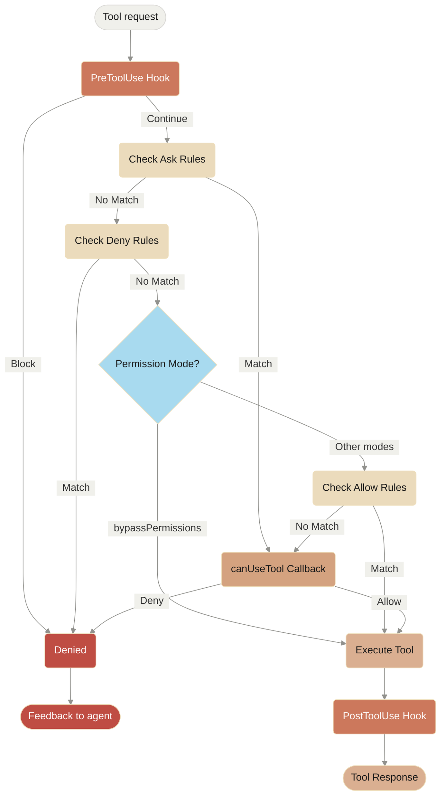

# Handling Permissions

> Control tool usage and permissions in the Claude Agent SDK

<style>
  {`
    .edgeLabel {
      padding: 8px 12px !important;
    }
    .edgeLabel rect {
      rx: 4;
      ry: 4;
      stroke: #D9D8D5 !important;
      stroke-width: 1px !important;
    }
    /* Add rounded corners to flowchart nodes */
    .node rect {
      rx: 8 !important;
      ry: 8 !important;
    }
    `}
</style>

# SDK Permissions

The Claude Agent SDK provides powerful permission controls that allow you to manage how Claude uses tools in your application.

This guide covers how to implement permission systems using the `canUseTool` callback, hooks, and settings.json permission rules. For complete API documentation, see the [TypeScript SDK reference](/en/docs/claude-code/typescript-sdk-reference).

## Overview

The Claude Agent SDK provides four complementary ways to control tool usage:

1. **[Permission Modes](#permission-modes)** - Global permission behavior settings that affect all tools
2. **[canUseTool callback](/en/docs/claude-code/typescript-sdk-reference#canusetool)** - Runtime permission handler for cases not covered by other rules
3. **[Hooks](/en/docs/claude-code/typescript-sdk-reference#hook-types)** - Fine-grained control over every tool execution with custom logic
4. **[Permission rules (settings.json)](/en/docs/claude-code/settings#permission-settings)** - Declarative allow/deny rules with integrated bash command parsing

Use cases for each approach:

* Permission modes - Set overall permission behavior (planning, auto-accepting edits, bypassing checks)
* `canUseTool` - Dynamic approval for uncovered cases, prompts user for permission
* Hooks - Programmatic control over all tool executions
* Permission rules - Static policies with intelligent bash command parsing

## Permission Flow Diagram



**Processing Order:** PreToolUse Hook → Ask Rules → Deny Rules → Permission Mode Check → Allow Rules → canUseTool Callback → PostToolUse Hook

## Permission Modes

Permission modes provide global control over how Claude uses tools. You can set the permission mode when calling `query()` or change it dynamically during streaming sessions.

### Available Modes

The SDK supports four permission modes, each with different behavior:

| Mode                | Description                  | Tool Behavior                                                                                              |
| :------------------ | :--------------------------- | :--------------------------------------------------------------------------------------------------------- |
| `default`           | Standard permission behavior | Normal permission checks apply                                                                             |
| `plan`              | Planning mode - no execution | Claude can only use read-only tools; presents a plan before execution **(Not currently supported in SDK)** |
| `acceptEdits`       | Auto-accept file edits       | File edits and filesystem operations are automatically approved                                            |
| `bypassPermissions` | Bypass all permission checks | All tools run without permission prompts (use with caution)                                                |

### Setting Permission Mode

You can set the permission mode in two ways:

#### 1. Initial Configuration

Set the mode when creating a query:

<CodeGroup>
  ```typescript TypeScript
  import { query } from "@anthropic-ai/claude-agent-sdk";

  const result = await query({
    prompt: "Help me refactor this code",
    options: {
      permissionMode: 'default'  // Standard permission mode
    }
  });
  ```

  ```python Python
  from claude_agent_sdk import query

  result = await query(
      prompt="Help me refactor this code",
      options={
          "permission_mode": "default"  # Standard permission mode
      }
  )
  ```
</CodeGroup>

#### 2. Dynamic Mode Changes (Streaming Only)

Change the mode during a streaming session:

<CodeGroup>
  ```typescript TypeScript
  import { query } from "@anthropic-ai/claude-agent-sdk";

  // Create an async generator for streaming input
  async function* streamInput() {
    yield { 
      type: 'user',
      message: { 
        role: 'user', 
        content: "Let's start with default permissions" 
      }
    };
    
    // Later in the conversation...
    yield {
      type: 'user',
      message: {
        role: 'user',
        content: "Now let's speed up development"
      }
    };
  }

  const q = query({
    prompt: streamInput(),
    options: {
      permissionMode: 'default'  // Start in default mode
    }
  });

  // Change mode dynamically
  await q.setPermissionMode('acceptEdits');

  // Process messages
  for await (const message of q) {
    console.log(message);
  }
  ```

  ```python Python
  from claude_agent_sdk import query

  async def stream_input():
      """Async generator for streaming input"""
      yield {
          "type": "user",
          "message": {
              "role": "user",
              "content": "Let's start with default permissions"
          }
      }
      
      # Later in the conversation...
      yield {
          "type": "user",
          "message": {
              "role": "user",
              "content": "Now let's speed up development"
          }
      }

  q = query(
      prompt=stream_input(),
      options={
          "permission_mode": "default"  # Start in default mode
      }
  )

  # Change mode dynamically
  await q.set_permission_mode("acceptEdits")

  # Process messages
  async for message in q:
      print(message)
  ```
</CodeGroup>

### Mode-Specific Behaviors

#### Accept Edits Mode (`acceptEdits`)

In accept edits mode:

* All file edits are automatically approved
* Filesystem operations (mkdir, touch, rm, etc.) are auto-approved
* Other tools still require normal permissions
* Speeds up development when you trust Claude's edits
* Useful for rapid prototyping and iterations

Auto-approved operations:

* File edits (Edit, MultiEdit, Write tools)
* Bash filesystem commands (mkdir, touch, rm, mv, cp)
* File creation and deletion

#### Bypass Permissions Mode (`bypassPermissions`)

In bypass permissions mode:

* **ALL tool uses are automatically approved**
* No permission prompts appear
* Hooks still execute (can still block operations)
* **Use with extreme caution** - Claude has full system access
* Recommended only for controlled environments

### Mode Priority in Permission Flow

Permission modes are evaluated at a specific point in the permission flow:

1. **Hooks execute first** - Can override any mode
2. **Deny rules** are checked - Block tools regardless of mode
3. **`bypassPermissions` mode** - If active, allows all remaining tools
4. **Allow rules** are checked
5. **Other modes** affect specific tool behaviors
6. **`canUseTool` callback** - Handles remaining cases

This means:

* Hooks can always block tool use, even in `bypassPermissions` mode
* Explicit deny rules override all permission modes
* `bypassPermissions` mode overrides allow rules and `canUseTool`

### Best Practices

1. **Use default mode** for controlled execution with normal permission checks
2. **Use acceptEdits mode** when working on isolated files or directories
3. **Avoid bypassPermissions** in production or on systems with sensitive data
4. **Combine modes with hooks** for fine-grained control
5. **Switch modes dynamically** based on task progress and confidence

Example of mode progression:

```typescript
// Start in default mode for controlled execution
permissionMode: 'default'

// Switch to acceptEdits for rapid iteration
await q.setPermissionMode('acceptEdits')
```

## canUseTool

The `canUseTool` callback is passed as an option when calling the `query` function. It receives the tool name and input parameters, and must return a decision- either allow or deny.

canUseTool fires whenever Claude Code would show a permission prompt to a user, e.g. hooks and permission rules do not cover it and it is not in autoaccept mode.

Here's a complete example showing how to implement interactive tool approval:

<CodeGroup>
  ```typescript TypeScript
  import { query } from "@anthropic-ai/claude-agent-sdk";

  async function promptForToolApproval(toolName: string, input: any) {
    console.log("\n🔧 Tool Request:");
    console.log(`   Tool: ${toolName}`);
    
    // Display tool parameters
    if (input && Object.keys(input).length > 0) {
      console.log("   Parameters:");
      for (const [key, value] of Object.entries(input)) {
        let displayValue = value;
        if (typeof value === 'string' && value.length > 100) {
          displayValue = value.substring(0, 100) + "...";
        } else if (typeof value === 'object') {
          displayValue = JSON.stringify(value, null, 2);
        }
        console.log(`     ${key}: ${displayValue}`);
      }
    }
    
    // Get user approval (replace with your UI logic)
    const approved = await getUserApproval();
    
    if (approved) {
      console.log("   ✅ Approved\n");
      return {
        behavior: "allow",
        updatedInput: input
      };
    } else {
      console.log("   ❌ Denied\n");
      return {
        behavior: "deny",
        message: "User denied permission for this tool"
      };
    }
  }

  // Use the permission callback
  const result = await query({
    prompt: "Help me analyze this codebase",
    options: {
      canUseTool: async (toolName, input) => {
        return promptForToolApproval(toolName, input);
      }
    }
  });
  ```

  ```python Python
  from claude_agent_sdk import query

  async def prompt_for_tool_approval(tool_name: str, input_params: dict):
      print(f"\n🔧 Tool Request:")
      print(f"   Tool: {tool_name}")
      
      # Display parameters
      if input_params:
          print("   Parameters:")
          for key, value in input_params.items():
              display_value = value
              if isinstance(value, str) and len(value) > 100:
                  display_value = value[:100] + "..."
              elif isinstance(value, (dict, list)):
                  display_value = json.dumps(value, indent=2)
              print(f"     {key}: {display_value}")
      
      # Get user approval
      answer = input("\n   Approve this tool use? (y/n): ")
      
      if answer.lower() in ['y', 'yes']:
          print("   ✅ Approved\n")
          return {
              "behavior": "allow",
              "updatedInput": input_params
          }
      else:
          print("   ❌ Denied\n")
          return {
              "behavior": "deny",
              "message": "User denied permission for this tool"
          }

  # Use the permission callback
  result = await query(
      prompt="Help me analyze this codebase",
      options={
          "can_use_tool": prompt_for_tool_approval
      }
  )
  ```
</CodeGroup>

## Using Hooks for Tool Control

Hooks provide programmatic control over tool execution at various stages. Hooks are called for every tool use, giving you complete control over the permission pipeline.

### Hook Implementation

<CodeGroup>
  ```typescript TypeScript
  import { query } from "@anthropic-ai/claude-agent-sdk";

  const result = await query({
    prompt: "Help me refactor this code",
    options: {
      hooks: {
        PreToolUse: [{
          hooks: [async (input, toolUseId, { signal }) => {
            console.log(`Tool request: ${input.tool_name}`);
            
            // Parse and validate tool input yourself
            if (input.tool_name === "Bash") {
              const command = input.tool_input.command;
              if (command.startsWith("rm -rf")) {
                return {
                  decision: "block",
                  reason: "Dangerous command blocked"
                };
              }
            }
            
            return { continue: true };
          }]
        }],
        PostToolUse: [{
          hooks: [async (input, toolUseId, { signal }) => {
            console.log(`Tool completed: ${input.tool_name}`);
            // Log or audit tool results
            return { continue: true };
          }]
        }]
      }
    }
  });
  ```

  ```python Python
  from claude_agent_sdk import query, ClaudeAgentOptions, HookMatcher, HookContext
  from typing import Any

  async def pre_tool_hook(
      input_data: dict[str, Any],
      tool_use_id: str | None,
      context: HookContext
  ) -> dict[str, Any]:
      print(f"Tool request: {input_data['tool_name']}")

      # Custom validation logic
      if input_data['tool_name'] == 'Bash':
          command = input_data['tool_input'].get('command', '')
          if command.startswith('rm -rf'):
              return {
                  'hookSpecificOutput': {
                      'hookEventName': 'PreToolUse',
                      'permissionDecision': 'deny',
                      'permissionDecisionReason': 'Dangerous command blocked'
                  }
              }

      return {}

  async def post_tool_hook(
      input_data: dict[str, Any],
      tool_use_id: str | None,
      context: HookContext
  ) -> dict[str, Any]:
      print(f"Tool completed: {input_data['tool_name']}")
      # Log or audit tool results
      return {}

  options = ClaudeAgentOptions(
      hooks={
          'PreToolUse': [
              HookMatcher(matcher='Bash', hooks=[pre_tool_hook])
          ],
          'PostToolUse': [
              HookMatcher(hooks=[post_tool_hook])
          ]
      }
  )

  result = await query(
      prompt="Help me refactor this code",
      options=options
  )
  ```
</CodeGroup>

### Key Differences from canUseTool

* **Scope**: Hooks are called for all tool uses; `canUseTool` handles cases not covered by permission rules
* **Control**: Hooks require parsing and validating inputs yourself
* **Events**: Hooks support multiple events (PreToolUse, PostToolUse, etc.) for different stages

## Using Permission Rules (settings.json)

Permission rules in `settings.json` provide declarative control with built-in bash command parsing. These rules are evaluated before `canUseTool` is called. For more details on settings configuration, see the [Claude Code settings documentation](/en/docs/claude-code/settings).

### Configuration Structure

```json
{
  "permissions": {
    "allow": [
      "Bash(npm run lint)",
      "Bash(npm run test:*)",
      "Read(~/.zshrc)"
    ],
    "deny": [
      "Bash(curl:*)",
      "Read(./.env)",
      "Read(./secrets/**)",
      "WebFetch"
    ],
    "ask": [
      "Bash(git push:*)",
      "Write(./production/**)"
    ]
  }
}
```

### Rule Syntax

Permission rules follow the pattern: `ToolName(pattern)`

* **Bash rules**: Use prefix matching (not regex). Example: `Bash(npm:*)` matches any command starting with "npm"
* **File rules**: Support glob patterns. Example: `Read(./src/**/*.ts)` matches TypeScript files in src
* **Tool-only rules**: Omit parentheses to control entire tools. Example: `WebFetch` blocks all web fetches

For more information on configuring permissions, see [Configuring permissions](/en/docs/claude-code/iam#configuring-permissions).

### Using with SDK

While rules cannot be set programtically in the SDK yet, they will be read from the settings.json file in the path that the SDK is loaded in.

### Permission Evaluation Order

1. **Deny rules** are checked first - if matched, tool use is blocked
2. **Allow rules** are checked next - if matched, tool use is permitted
3. **Ask rules** are checked - if matched, user is prompted
4. **canUseTool callback** is invoked for any remaining cases

### Bash Command Parsing

The SDK includes an integrated bash parser that understands command structure:

* Handles pipes, redirects, and command substitution
* Recognizes dangerous patterns like `rm -rf` or `curl | sh`
* Supports wildcards and prefix matching

Example of how bash patterns work:

* `Bash(git:*)` - Matches any git command
* `Bash(npm run test)` - Matches exact command
* `Bash(npm run test:*)` - Matches Bash commands starting with `npm run test` such as `npm run test anyFile.test.ts`

For more information on configuring permissions, see [Configuring permissions](/en/docs/claude-code/iam#configuring-permissions).

## Best Practices

1. **Start with default mode** for standard permission checks
2. **Use permission rules** for static policies, especially bash commands (see [permission settings](/en/docs/claude-code/settings#permission-settings))
3. **Use hooks** to log, audit, or transform all tool uses (see [hook types](/en/docs/claude-code/typescript-sdk-reference#hook-types))
4. **Use canUseTool** for dynamic decisions on uncovered cases (see [CanUseTool type](/en/docs/claude-code/typescript-sdk-reference#canusetool))
5. **Layer defenses** by combining modes, rules, hooks, and callbacks for critical applications
