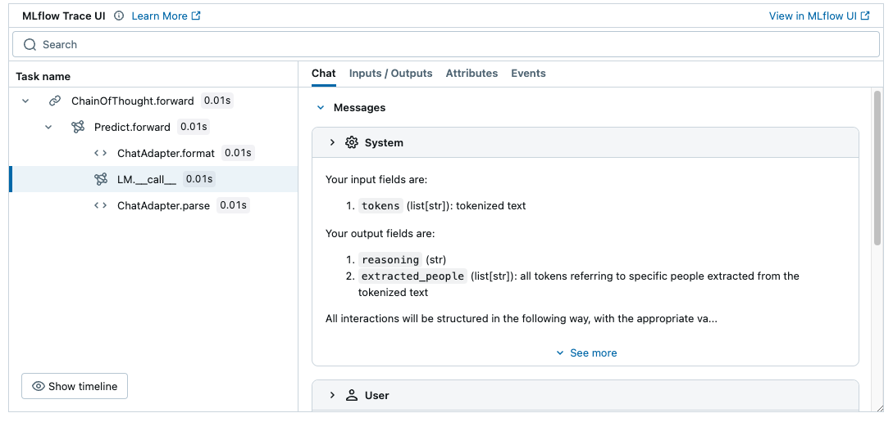

<!-- Auto-generated from /Volumes/cdrive/repos/OTHER_PEOPLES_REPOS/dspy/docs/docs/tutorials/classification_finetuning/index.ipynb on 2025-08-30T20:09:29.497572Z -->

# Tutorial: Classification Fine-tuning

Let's walk through a quick example of fine-tuning the LM weights within a DSPy program. We'll apply to a simple 77-way classification task.

Our finetuned program will use a tiny `Llama-3.2-1B` language model, hosted locally on your GPU. To make this more interesting, we'll assume that (i) we don't have **any training labels** but (ii) we have 500 unlabeled training examples.

### Install dependencies and download data

Install the latest DSPy via `pip install -U dspy` and follow along (or `uv pip`, if you prefer). This tutorial depends on DSPy >= 2.6.0. You also need to run `pip install datasets`.

This tutorial requires a local GPU at the moment for inference, though we plan to support ollama serving for finetuned models as well.

You will also need the following dependencies:
1. Inference: We use SGLang to run local inference servers. You can install the latest version by following the instructions here: https://docs.sglang.ai/start/install.html
Shared below is the most recent install command as of 04/02/2025, but we recommend that you follow the instructions in the most up to date version by navigating to the installation link.
This ensures that the fine-tuning packages and the `sglang` package are in sync.
    ```shell
    > pip install --upgrade pip
    > pip install uv
    > uv pip install "sglang[all]>=0.4.4.post3" --find-links https://flashinfer.ai/whl/cu124/torch2.5/flashinfer-python
    ```
1. Fine-tuning: We use the following packages. Note that we specify the version for the transformers package as a temporary fix to a recent issue: https://github.com/huggingface/trl/issues/2338
    ```shell
    > uv pip install -U torch transformers==4.48.3 accelerate trl peft
    ```

We recommend using `uv` package manager to speed up the installation.

<details>
<summary>Recommended: Set up MLflow Tracing to understand what's happening under the hood.</summary>

### MLflow DSPy Integration

<a href="https://mlflow.org/">MLflow</a> is an LLMOps tool that natively integrates with DSPy and offer explainability and experiment tracking. In this tutorial, you can use MLflow to visualize prompts and optimization progress as traces to understand the DSPy's behavior better. You can set up MLflow easily by following the four steps below.



1. Install MLflow

```bash
%pip install mlflow>=2.20
```

2. Start MLflow UI in a separate terminal
```bash
mlflow ui --port 5000
```

3. Connect the notebook to MLflow
```python
import mlflow

mlflow.set_tracking_uri("http://localhost:5000")
mlflow.set_experiment("DSPy")
```

4. Enabling tracing.
```python
mlflow.dspy.autolog()
```


To learn more about the integration, visit [MLflow DSPy Documentation](https://mlflow.org/docs/latest/llms/dspy/index.html) as well.
</details>

### Dataset

For this tutorial, we will use the Banking77 dataset.

```python
import dspy
import random
from dspy.datasets import DataLoader
from datasets import load_dataset

# Load the Banking77 dataset.
CLASSES = load_dataset("PolyAI/banking77", split="train", trust_remote_code=True).features['label'].names
kwargs = dict(fields=("text", "label"), input_keys=("text",), split="train", trust_remote_code=True)

# Load the first 2000 examples from the dataset, and assign a hint to each *training* example.
raw_data = [
    dspy.Example(x, label=CLASSES[x.label]).with_inputs("text")
    for x in DataLoader().from_huggingface(dataset_name="PolyAI/banking77", **kwargs)[:1000]
]

random.Random(0).shuffle(raw_data)
```

This dataset has 77 different categories for classification. Let's review some of them.

```python
len(CLASSES), CLASSES[:10]
```

Let us sample 500 (unlabeled) queries from Banking77. We'll use these for our bootstrapped finetuning.

```python
unlabeled_trainset = [dspy.Example(text=x.text).with_inputs("text") for x in raw_data[:500]]

unlabeled_trainset[0]
```

### DSPy program

Let's say that we want a program that takes the `text` and reasons step by step and then selects one of the classes from Banking77.

Note that this is meant mainly for illustration, or for cases where you want to inspect the model's reasoning, e.g. for a small degree of explainability. In other words, this type of task is not necessarily likely to benefit very much from explicit reasoning.

```python
from typing import Literal

classify = dspy.ChainOfThought(f"text -> label: Literal{CLASSES}")
```

### Bootstrapped finetuning

There are many ways to go about this, e.g. allowing the model to teach itself or using inference-time compute (e.g., ensembling) to identify cases of high confidence without labels.

Perhaps the simplest is to use a model that we'd expect can do a reasonable job at this task as a teacher of reasoning and classification, and to distill that to our small model. All of these patterns can be expressed in a handful of lines of code.

Let's set up the tiny `Llama-3.2-1B-Instruct` as a student LM. We'll use GPT-4o-mini as a teacher LM.

```python
from dspy.clients.lm_local import LocalProvider

student_lm_name = "meta-llama/Llama-3.2-1B-Instruct"
student_lm = dspy.LM(model=f"openai/local:{student_lm_name}", provider=LocalProvider(), max_tokens=2000)
teacher_lm = dspy.LM('openai/gpt-4o-mini', max_tokens=3000)
```

Now, let's assign classifiers to our LMs.

```python
student_classify = classify.deepcopy()
student_classify.set_lm(student_lm)

teacher_classify = classify.deepcopy()
teacher_classify.set_lm(teacher_lm)
```

Let's now launch the bootstrapped finetuning. The word "bootstrapped" here means that the program itself will be invoked on the training inputs and the resulting traces seen over all modules will be recorded and used for finetuning. This is the weight-optimizing variant of the various BootstrapFewShot methods in DSPy.

On every question in the (unlabeled) training set, this will invoke the teacher program, which will produce reasoning and select a class. This will be traced and then constitute a training set for all modules (in this case, just the one CoT module) in the student program.

When the `compile` method is called, the `BootstrapFinetune` optimizer will use the passed teacher program (or programs, you can pass a list!) to create a training dataset.
It will then use this training dataset to create a fine-tuned version of the LM set for the `student` program, replacing it with the trained LM.
Note that the trained LM will be a new LM instance (the `student_lm` object we instantiated here will be untouched!)

Note: If you have labels, you can pass `metric` to the constructor of `BootstrapFinetune`. If you want to apply this in practice, you can pass `train_kwargs` to the constructor to control local LM training settings: `device`, `use_peft`, `num_train_epochs`, `per_device_train_batch_size`, `gradient_accumulation_steps`, `learning_rate`, `max_seq_length`, `packing`, `bf16`, and `output_dir`.

```python
# Optional:
# [1] You can set `DSPY_FINETUNEDIR` environment variable to control where the directory that will be used to store the
#     checkpoints and fine-tuning data. If this is not set, `DSPY_CACHEDIR` is used by default.
# [2] You can set the `CUDA_VISIBLE_DEVICES` environment variable to control the GPU that will be used for fine-tuning
#     and inference. If this is not set and the default GPU that's used by HuggingFace's `transformers` library is
#     occupied, an OutOfMemoryError might be raised.
#
# import os
# os.environ["CUDA_VISIBLE_DEVICES"] = "0"
# os.environ["DSPY_FINETUNEDIR"] = "/path/to/dir"
```

```python
dspy.settings.experimental = True  # fine-tuning is an experimental feature, so we set a flag to enable it

optimizer = dspy.BootstrapFinetune(num_threads=16)  # if you *do* have labels, pass metric=your_metric here!
classify_ft = optimizer.compile(student_classify, teacher=teacher_classify, trainset=unlabeled_trainset)
```

Since this is a local model, we need to explicitly launch it.

```python
classify_ft.get_lm().launch()
```

### Validating the finetuned program

Let's now figure out if this was successful. We can ask the system one question and inspect its behavior.

```python
classify_ft(text="I didn't receive my money earlier and it says the transaction is still in progress. Can you fix it?")
```

We could also get a small set of gold labels and see if the system can generalize to unseen queries.

```python
devset = raw_data[500:600]
devset[0]
```

Let's define an evaluator on this small dev set, where the metric ignores the reasoning and checks that the label is exactly correct.

```python
metric = (lambda x, y, trace=None: x.label == y.label)
evaluate = dspy.Evaluate(devset=devset, metric=metric, display_progress=True, display_table=5, num_threads=16)
```

Now, let's evaluate the finetuned 1B classifier.

```python
evaluate(classify_ft)
```

```text
Average Metric: 51.00 / 99 (51.5%): 100%|██████████| 100/100 [00:35<00:00,  2.79it/s]
```

<details>
<summary>Tracking Evaluation Results in MLflow Experiment</summary>

<br/>

To track and visualize the evaluation results over time, you can record the results in MLflow Experiment.


```python
import mlflow

with mlflow.start_run(run_name="classifier_evaluation"):
    evaluate_correctness = dspy.Evaluate(
        devset=devset,
        metric=extraction_correctness_metric,
        num_threads=16,
        display_progress=True,
    )

    # Evaluate the program as usual
    result = evaluate_correctness(people_extractor)

    # Log the aggregated score
    mlflow.log_metric("exact_match", result.score)
    # Log the detailed evaluation results as a table
    mlflow.log_table(
        {
            "Text": [example.text for example in devset],
            "Expected": [example.example_label for example in devset],
            "Predicted": [output[1] for output in result.results],
            "Exact match": [output[2] for output in result.results],
        },
        artifact_file="eval_results.json",
    )
```

To learn more about the integration, visit [MLflow DSPy Documentation](https://mlflow.org/docs/latest/llms/dspy/index.html) as well.

</details>

Not bad, given that we started with no labels of the task. Even though we have no labels, you can use various strategies to boost the quality of the bootstrapped training data.

To try that next, let's free our GPU memory by killing the finetuned LM.

```python
classify_ft.get_lm().kill()
```

### Bootstrapped finetuning against a metric

If you have labels, you can generally boost this by a large margin. To do so, you can pass a `metric` to BootstrapFinetune, which it will use for filtering the trajectories over your program before it builds the finetuning data.

```python
optimizer = dspy.BootstrapFinetune(num_threads=16, metric=metric)
classify_ft = optimizer.compile(student_classify, teacher=teacher_classify, trainset=raw_data[:500])
```

Let's now launch and evaluate this.

```python
classify_ft.get_lm().launch()
```

```python
evaluate(classify_ft)
```

```text
Average Metric: 85.00 / 98 (86.7%): 100%|██████████| 100/100 [00:46<00:00,  2.14it/s]
```

```text

```

That's quite a bit better, given just 500 labels. In fact, it seems to be a lot stronger than the teacher LM gets out of the box!

```python
evaluate(teacher_classify)
```

```text
Average Metric: 55.00 / 100 (55.0%): 100%|██████████| 100/100 [00:11<00:00,  8.88it/s]
```

```text
2025/01/08 12:38:35 INFO dspy.evaluate.evaluate: Average Metric: 55 / 100 (55.0%)
```

```text

```

And thanks to bootstrapping, the model learns to apply our modules to get the right label, in this case, reasoning explicitly:

```python
classify_ft(text="why hasnt my card come in yet?")
dspy.inspect_history()
```

```text


[2025-01-08T12:39:42.143798]

System message:

Your input fields are:
1. `text` (str)

Your output fields are:
1. `reasoning` (str)
2. `label` (Literal[activate_my_card, age_limit, apple_pay_or_google_pay, atm_support, automatic_top_up, balance_not_updated_after_bank_transfer, balance_not_updated_after_cheque_or_cash_deposit, beneficiary_not_allowed, cancel_transfer, card_about_to_expire, card_acceptance, card_arrival, card_delivery_estimate, card_linking, card_not_working, card_payment_fee_charged, card_payment_not_recognised, card_payment_wrong_exchange_rate, card_swallowed, cash_withdrawal_charge, cash_withdrawal_not_recognised, change_pin, compromised_card, contactless_not_working, country_support, declined_card_payment, declined_cash_withdrawal, declined_transfer, direct_debit_payment_not_recognised, disposable_card_limits, edit_personal_details, exchange_charge, exchange_rate, exchange_via_app, extra_charge_on_statement, failed_transfer, fiat_currency_support, get_disposable_virtual_card, get_physical_card, getting_spare_card, getting_virtual_card, lost_or_stolen_card, lost_or_stolen_phone, order_physical_card, passcode_forgotten, pending_card_payment, pending_cash_withdrawal, pending_top_up, pending_transfer, pin_blocked, receiving_money, Refund_not_showing_up, request_refund, reverted_card_payment?, supported_cards_and_currencies, terminate_account, top_up_by_bank_transfer_charge, top_up_by_card_charge, top_up_by_cash_or_cheque, top_up_failed, top_up_limits, top_up_reverted, topping_up_by_card, transaction_charged_twice, transfer_fee_charged, transfer_into_account, transfer_not_received_by_recipient, transfer_timing, unable_to_verify_identity, verify_my_identity, verify_source_of_funds, verify_top_up, virtual_card_not_working, visa_or_mastercard, why_verify_identity, wrong_amount_of_cash_received, wrong_exchange_rate_for_cash_withdrawal])

All interactions will be structured in the following way, with the appropriate values filled in.

[[ ## text ## ]]
{text}

[[ ## reasoning ## ]]
{reasoning}

[[ ## label ## ]]
{label}        # note: the value you produce must be one of: activate_my_card; age_limit; apple_pay_or_google_pay; atm_support; automatic_top_up; balance_not_updated_after_bank_transfer; balance_not_updated_after_cheque_or_cash_deposit; beneficiary_not_allowed; cancel_transfer; card_about_to_expire; card_acceptance; card_arrival; card_delivery_estimate; card_linking; card_not_working; card_payment_fee_charged; card_payment_not_recognised; card_payment_wrong_exchange_rate; card_swallowed; cash_withdrawal_charge; cash_withdrawal_not_recognised; change_pin; compromised_card; contactless_not_working; country_support; declined_card_payment; declined_cash_withdrawal; declined_transfer; direct_debit_payment_not_recognised; disposable_card_limits; edit_personal_details; exchange_charge; exchange_rate; exchange_via_app; extra_charge_on_statement; failed_transfer; fiat_currency_support; get_disposable_virtual_card; get_physical_card; getting_spare_card; getting_virtual_card; lost_or_stolen_card; lost_or_stolen_phone; order_physical_card; passcode_forgotten; pending_card_payment; pending_cash_withdrawal; pending_top_up; pending_transfer; pin_blocked; receiving_money; Refund_not_showing_up; request_refund; reverted_card_payment?; supported_cards_and_currencies; terminate_account; top_up_by_bank_transfer_charge; top_up_by_card_charge; top_up_by_cash_or_cheque; top_up_failed; top_up_limits; top_up_reverted; topping_up_by_card; transaction_charged_twice; transfer_fee_charged; transfer_into_account; transfer_not_received_by_recipient; transfer_timing; unable_to_verify_identity; verify_my_identity; verify_source_of_funds; verify_top_up; virtual_card_not_working; visa_or_mastercard; why_verify_identity; wrong_amount_of_cash_received; wrong_exchange_rate_for_cash_withdrawal

[[ ## completed ## ]]

In adhering to this structure, your objective is: 
        Given the fields `text`, produce the fields `label`.


User message:

[[ ## text ## ]]
why hasnt my card come in yet?

Respond with the corresponding output fields, starting with the field `[[ ## reasoning ## ]]`, then `[[ ## label ## ]]` (must be formatted as a valid Python Literal[activate_my_card, age_limit, apple_pay_or_google_pay, atm_support, automatic_top_up, balance_not_updated_after_bank_transfer, balance_not_updated_after_cheque_or_cash_deposit, beneficiary_not_allowed, cancel_transfer, card_about_to_expire, card_acceptance, card_arrival, card_delivery_estimate, card_linking, card_not_working, card_payment_fee_charged, card_payment_not_recognised, card_payment_wrong_exchange_rate, card_swallowed, cash_withdrawal_charge, cash_withdrawal_not_recognised, change_pin, compromised_card, contactless_not_working, country_support, declined_card_payment, declined_cash_withdrawal, declined_transfer, direct_debit_payment_not_recognised, disposable_card_limits, edit_personal_details, exchange_charge, exchange_rate, exchange_via_app, extra_charge_on_statement, failed_transfer, fiat_currency_support, get_disposable_virtual_card, get_physical_card, getting_spare_card, getting_virtual_card, lost_or_stolen_card, lost_or_stolen_phone, order_physical_card, passcode_forgotten, pending_card_payment, pending_cash_withdrawal, pending_top_up, pending_transfer, pin_blocked, receiving_money, Refund_not_showing_up, request_refund, reverted_card_payment?, supported_cards_and_currencies, terminate_account, top_up_by_bank_transfer_charge, top_up_by_card_charge, top_up_by_cash_or_cheque, top_up_failed, top_up_limits, top_up_reverted, topping_up_by_card, transaction_charged_twice, transfer_fee_charged, transfer_into_account, transfer_not_received_by_recipient, transfer_timing, unable_to_verify_identity, verify_my_identity, verify_source_of_funds, verify_top_up, virtual_card_not_working, visa_or_mastercard, why_verify_identity, wrong_amount_of_cash_received, wrong_exchange_rate_for_cash_withdrawal]), and then ending with the marker for `[[ ## completed ## ]]`.


Response:

[[ ## reasoning ## ]]
The user is inquiring about the status of their card delivery, which suggests they are concerned about when they will receive their card. This aligns with the topic of card arrival and delivery estimates.

[[ ## label ## ]]
card_arrival

[[ ## completed ## ]]


```

<details>
<summary>Saving fine-tuned programs in MLflow Experiment</summary>

<br/>

To deploy the fine-tuned program in production or share it with your team, you can save it in MLflow Experiment. Compared to simply saving it to a local file, MLflow offers the following benefits:

1. **Dependency Management**: MLflow automatically save the frozen environment metadata along with the program to ensure reproducibility.
2. **Experiment Tracking**: With MLflow, you can track the program's performance and cost along with the program itself.
3. **Collaboration**: You can share the program and results with your team members by sharing the MLflow experiment.

To save the program in MLflow, run the following code:

```python
import mlflow

# Start an MLflow Run and save the program
with mlflow.start_run(run_name="optimized_classifier"):
    model_info = mlflow.dspy.log_model(
        classify_ft,
        artifact_path="model", # Any name to save the program in MLflow
    )

# Load the program back from MLflow
loaded = mlflow.dspy.load_model(model_info.model_uri)
```

To learn more about the integration, visit [MLflow DSPy Documentation](https://mlflow.org/docs/latest/llms/dspy/index.html) as well.

</details>
