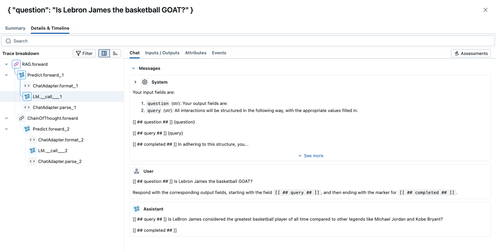

<!-- Auto-generated from /Volumes/cdrive/repos/OTHER_PEOPLES_REPOS/dspy/docs/docs/tutorials/custom_module/index.ipynb on 2025-10-26T02:21:50.523026Z -->

# Building AI Applications by Customizing DSPy Modules

In this guide, we will walk you through how to build a GenAI application by customizing `dspy.Module`.

A [DSPy module](https://dspy.ai/learn/programming/modules/) is the building block for DSPy programs.

- Each built-in module abstracts a prompting technique (like chain of thought or ReAct). Crucially, they are generalized to handle any signature.

- A DSPy module has learnable parameters (i.e., the little pieces comprising the prompt and the LM weights) and can be invoked (called) to process inputs and return outputs.

- Multiple modules can be composed into bigger modules (programs). DSPy modules are inspired directly by NN modules in PyTorch, but applied to LM programs.

Although you can build a DSPy program without implementing a custom module, we highly recommend putting your logic with a custom module so that you can use other DSPy features, like DSPy optimizer or MLflow DSPy tracing.

Before getting started, make sure you have DSPy installed:

```
!pip install dspy
```

<details>
<summary>Recommended: Set up MLflow Tracing to understand what's happening under the hood.</summary>

### MLflow DSPy Integration

<a href="https://mlflow.org/">MLflow</a> is an LLMOps tool that natively integrates with DSPy and offer explainability and experiment tracking. In this tutorial, you can use MLflow to visualize prompts and optimization progress as traces to understand the DSPy's behavior better. You can set up MLflow easily by following the four steps below.



1. Install MLflow

```bash
%pip install mlflow>=3.0.0
```

2. Start MLflow UI in a separate terminal
```bash
mlflow ui --port 5000 --backend-store-uri sqlite:///mlruns.db
```

3. Connect the notebook to MLflow
```python
import mlflow

mlflow.set_tracking_uri("http://localhost:5000")
mlflow.set_experiment("DSPy")
```

4. Enabling tracing.
```python
mlflow.dspy.autolog()
```


To learn more about the integration, visit [MLflow DSPy Documentation](https://mlflow.org/docs/latest/llms/dspy/index.html) as well.
</details>

## Customize DSPy Module

You can implement custom prompting logic and integrate external tools or services by customizing a DSPy module. To achieve this, subclass from `dspy.Module` and implement the following two key methods:

- `__init__`: This is the constructor, where you define the attributes and sub-modules of your program.
- `forward`: This method contains the core logic of your DSPy program.

Within the `forward()` method, you are not limited to calling only other DSPy modules; you can also integrate any standard Python functions, such as those for interacting with Langchain/Agno agents, MCP tools, database handlers, and more.

The basic structure for a custom DSPy module looks like this:

```python
class MyProgram(dspy.Module):
    
    def __init__(self, ...):
        # Define attributes and sub-modules here
        {constructor_code}

    def forward(self, input_name1, input_name2, ...):
        # Implement your program's logic here
        {custom_logic_code}
```

Let's illustrate this with a practical code example. We will build a simple Retrieval-Augmented Generation (RAG) application with multiple stages:

1.  **Query Generation:** Generate a suitable query based on the user's question to retrieve relevant context.
2.  **Context Retrieval:** Fetch context using the generated query.
3.  **Answer Generation:** Produce a final answer based on the retrieved context and the original question.

The code implementation for this multi-stage program is shown below.

```python
import dspy

class QueryGenerator(dspy.Signature):
    """Generate a query based on question to fetch relevant context"""
    question: str = dspy.InputField()
    query: str = dspy.OutputField()

def search_wikipedia(query: str) -> list[str]:
    """Query ColBERT endpoint, which is a knowledge source based on wikipedia data"""
    results = dspy.ColBERTv2(url='http://20.102.90.50:2017/wiki17_abstracts')(query, k=1)
    return [x["text"] for x in results]

class RAG(dspy.Module):
    def __init__(self):
        self.query_generator = dspy.Predict(QueryGenerator)
        self.answer_generator = dspy.ChainOfThought("question,context->answer")

    def forward(self, question, **kwargs):
        query = self.query_generator(question=question).query
        context = search_wikipedia(query)[0]
        return self.answer_generator(question=question, context=context).answer
```

Let's take a look at the `forward` method. We first send the question to `self.query_generator`, which is a `dspy.Predict`, to get the query for context retrieving. Then we use the query to call ColBERT and keep the first context retrieved. Finally, we send the question and context into `self.answer_generator`, which is a `dspy.ChainOfThought` to generate the final answer.

Next, we'll create an instance of our `RAG` module to run the program.

**Important:** When invoking a custom DSPy module, you should use the module instance directly (which calls the `__call__` method internally), rather than calling the `forward()` method explicitly. The `__call__` method handles necessary internal processing before executing the `forward` logic.

```python
import os

os.environ["OPENAI_API_KEY"] = "{your_openai_api_key}"

dspy.configure(lm=dspy.LM("openai/gpt-4o-mini"))
rag = RAG()
print(rag(question="Is Lebron James the basketball GOAT?"))
```

```text
The question of whether LeBron James is the basketball GOAT is subjective and depends on personal opinions. Many consider him one of the greatest due to his achievements and impact on the game, but others may argue for different players like Michael Jordan.
```

That's it! In summary, to build your GenAI applications, we just put the custom logic into the `forward()` method, then create a module instance and call the instance itself.

## Why Customizing Module?

DSPy is a lightweight authoring and optimization framework, and our focus is to resolve the mess of prompt engineering by transforming prompting (string in, string out) LLM into programming LLM (structured inputs in, structured outputs out) for robust AI system.

While we provide pre-built modules which have custom prompting logic like `dspy.ChainOfThought` for reasoning, `dspy.ReAct` for tool calling agent to facilitate building your AI applications, we don't aim at standardizing how you build agents.

In DSPy, your application logic simply goes to the `forward` method of your custom Module, which doesn't have any constraint as long as you are writing python code. With this layout, DSPy is easy to migrate to from other frameworks or vanilla SDK usage, and easy to migrate off because essentially it's just python code.
