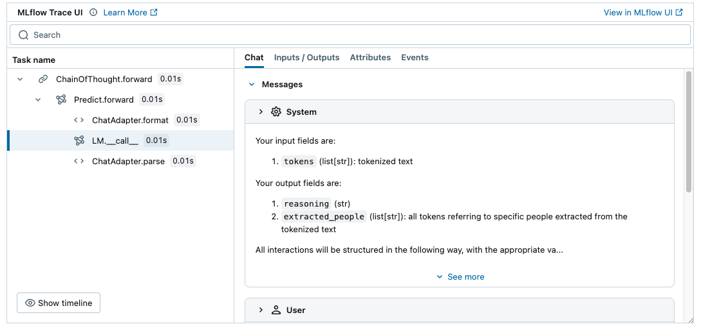

<!-- Auto-generated from /Volumes/cdrive/repos/OTHER_PEOPLES_REPOS/dspy/docs/docs/tutorials/entity_extraction/index.ipynb on 2025-11-06T02:07:55.142021Z -->

# Tutorial: Entity Extraction

This tutorial demonstrates how to perform **entity extraction** using the CoNLL-2003 dataset with DSPy. The focus is on extracting entities referring to people. We will:

- Extract and label entities from the CoNLL-2003 dataset that refer to people
- Define a DSPy program for extracting entities that refer to people
- Optimize and evaluate the program on a subset of the CoNLL-2003 dataset

By the end of this tutorial, you'll understand how to structure tasks in DSPy using signatures and modules, evaluate your system's performance, and improve its quality with optimizers.

Install the latest version of DSPy and follow along. If you're looking instead for a conceptual overview of DSPy, this [recent lecture](https://www.youtube.com/live/JEMYuzrKLUw) is a good place to start.

```python
# Install the latest version of DSPy
%pip install -U dspy
# Install the Hugging Face datasets library to load the CoNLL-2003 dataset
%pip install datasets
```

<details>
<summary>Recommended: Set up MLflow Tracing to understand what's happening under the hood.</summary>

### MLflow DSPy Integration

<a href="https://mlflow.org/">MLflow</a> is an LLMOps tool that natively integrates with DSPy and offer explainability and experiment tracking. In this tutorial, you can use MLflow to visualize prompts and optimization progress as traces to understand the DSPy's behavior better. You can set up MLflow easily by following the four steps below.



1. Install MLflow

```bash
%pip install mlflow>=2.20
```

2. Start MLflow UI in a separate terminal
```bash
mlflow ui --port 5000
```

3. Connect the notebook to MLflow
```python
import mlflow

mlflow.set_tracking_uri("http://localhost:5000")
mlflow.set_experiment("DSPy")
```

4. Enabling tracing.
```python
mlflow.dspy.autolog()
```

To learn more about the integration, visit [MLflow DSPy Documentation](https://mlflow.org/docs/latest/llms/dspy/index.html) as well.
</details>

## Load and Prepare the Dataset

In this section, we prepare the CoNLL-2003 dataset, which is commonly used for entity extraction tasks. The dataset includes tokens annotated with entity labels such as persons, organizations, and locations.

We will:
1. Load the dataset using the Hugging Face `datasets` library.
2. Define a function to extract tokens referring to people.
3. Slice the dataset to create smaller subsets for training and testing.

DSPy expects examples in a structured format, so we'll also transform the dataset into DSPy `Examples` for easy integration.

```python
import os
import tempfile
from datasets import load_dataset
from typing import Dict, Any, List
import dspy

def load_conll_dataset() -> dict:
    """
    Loads the CoNLL-2003 dataset into train, validation, and test splits.
    
    Returns:
        dict: Dataset splits with keys 'train', 'validation', and 'test'.
    """
    with tempfile.TemporaryDirectory() as temp_dir:
        # Use a temporary Hugging Face cache directory for compatibility with certain hosted notebook
        # environments that don't support the default Hugging Face cache directory
        os.environ["HF_DATASETS_CACHE"] = temp_dir
        return load_dataset("conll2003", trust_remote_code=True)

def extract_people_entities(data_row: dict[str, Any]) -> list[str]:
    """
    Extracts entities referring to people from a row of the CoNLL-2003 dataset.
    
    Args:
        data_row (dict[str, Any]): A row from the dataset containing tokens and NER tags.
    
    Returns:
        list[str]: List of tokens tagged as people.
    """
    return [
        token
        for token, ner_tag in zip(data_row["tokens"], data_row["ner_tags"])
        if ner_tag in (1, 2)  # CoNLL entity codes 1 and 2 refer to people
    ]

def prepare_dataset(data_split, start: int, end: int) -> list[dspy.Example]:
    """
    Prepares a sliced dataset split for use with DSPy.
    
    Args:
        data_split: The dataset split (e.g., train or test).
        start (int): Starting index of the slice.
        end (int): Ending index of the slice.
    
    Returns:
        list[dspy.Example]: List of DSPy Examples with tokens and expected labels.
    """
    return [
        dspy.Example(
            tokens=row["tokens"],
            expected_extracted_people=extract_people_entities(row)
        ).with_inputs("tokens")
        for row in data_split.select(range(start, end))
    ]

# Load the dataset
dataset = load_conll_dataset()

# Prepare the training and test sets
train_set = prepare_dataset(dataset["train"], 0, 50)
test_set = prepare_dataset(dataset["test"], 0, 200)
```

## Configure DSPy and create an Entity Extraction Program

Here, we define a DSPy program for extracting entities referring to people from tokenized text.

Then, we configure DSPy to use a particular language model (`gpt-4o-mini`) for all invocations of the program.

**Key DSPy Concepts Introduced:**
- **Signatures:** Define structured input/output schemas for your program.
- **Modules:** Encapsulate program logic in reusable, composable units.

Specifically, we'll:
- Create a `PeopleExtraction` DSPy Signature to specify the input (`tokens`) and output (`extracted_people`) fields.
- Define a `people_extractor` program that uses DSPy's built-in `dspy.ChainOfThought` module to implement the `PeopleExtraction` signature. The program extracts entities referring to people from a list of input tokens using language model (LM) prompting.
- Use the `dspy.LM` class and `dspy.settings.configure()` method to configure the language model that DSPy will use when invoking the program.

```python
from typing import List

class PeopleExtraction(dspy.Signature):
    """
    Extract contiguous tokens referring to specific people, if any, from a list of string tokens.
    Output a list of tokens. In other words, do not combine multiple tokens into a single value.
    """
    tokens: list[str] = dspy.InputField(desc="tokenized text")
    extracted_people: list[str] = dspy.OutputField(desc="all tokens referring to specific people extracted from the tokenized text")

people_extractor = dspy.ChainOfThought(PeopleExtraction)
```

Here, we tell DSPy to use OpenAI's `gpt-4o-mini` model in our program. To authenticate, DSPy reads your `OPENAI_API_KEY`. You can easily swap this out for [other providers or local models](https://github.com/stanfordnlp/dspy/blob/main/examples/migration.ipynb).

```python
lm = dspy.LM(model="openai/gpt-4o-mini")
dspy.settings.configure(lm=lm)
```

## Define Metric and Evaluation Functions

In DSPy, evaluating a program's performance is critical for iterative development. A good evaluation framework allows us to:
- Measure the quality of our program's outputs.
- Compare outputs against ground-truth labels.
- Identify areas for improvement.

**What We'll Do:**
- Define a custom metric (`extraction_correctness_metric`) to evaluate whether the extracted entities match the ground truth.
- Create an evaluation function (`evaluate_correctness`) to apply this metric to a training or test dataset and compute the overall accuracy.

The evaluation function uses DSPy's `Evaluate` utility to handle parallelism and visualization of results.

```python
def extraction_correctness_metric(example: dspy.Example, prediction: dspy.Prediction, trace=None) -> bool:
    """
    Computes correctness of entity extraction predictions.
    
    Args:
        example (dspy.Example): The dataset example containing expected people entities.
        prediction (dspy.Prediction): The prediction from the DSPy people extraction program.
        trace: Optional trace object for debugging.
    
    Returns:
        bool: True if predictions match expectations, False otherwise.
    """
    return prediction.extracted_people == example.expected_extracted_people

evaluate_correctness = dspy.Evaluate(
    devset=test_set,
    metric=extraction_correctness_metric,
    num_threads=24,
    display_progress=True,
    display_table=True
)
```

## Evaluate Initial Extractor

Before optimizing our program, we need a baseline evaluation to understand its current performance. This helps us:
- Establish a reference point for comparison after optimization.
- Identify potential weaknesses in the initial implementation.

In this step, we'll run our `people_extractor` program on the test set and measure its accuracy using the evaluation framework defined earlier.

```python
evaluate_correctness(people_extractor, devset=test_set)
```

```text
Average Metric: 172.00 / 200 (86.0%): 100%|███████████████████████████████████████████████████████████████████████████████████████████████████████████| 200/200 [00:16<00:00, 11.94it/s]
```

```text
2024/11/18 21:08:04 INFO dspy.evaluate.evaluate: Average Metric: 172 / 200 (86.0%)
```

```text

```

<details>
<summary>Tracking Evaluation Results in MLflow Experiment</summary>

<br/>

To track and visualize the evaluation results over time, you can record the results in MLflow Experiment.


```python
import mlflow

with mlflow.start_run(run_name="extractor_evaluation"):
    evaluate_correctness = dspy.Evaluate(
        devset=test_set,
        metric=extraction_correctness_metric,
        num_threads=24,
        display_progress=True,
    )

    # Evaluate the program as usual
    result = evaluate_correctness(people_extractor)

    # Log the aggregated score
    mlflow.log_metric("exact_match", result.score)
    # Log the detailed evaluation results as a table
    mlflow.log_table(
        {
            "Tokens": [example.tokens for example in test_set],
            "Expected": [example.expected_extracted_people for example in test_set],
            "Predicted": [output[1] for output in result.results],
            "Exact match": [output[2] for output in result.results],
        },
        artifact_file="eval_results.json",
    )
```

To learn more about the integration, visit [MLflow DSPy Documentation](https://mlflow.org/docs/latest/llms/dspy/index.html) as well.

</details>

## Optimize the Model

DSPy includes powerful optimizers that can improve the quality of your system.

Here, we use DSPy's `MIPROv2` optimizer to:
- Automatically tune the program's language model (LM) prompt by 1. using the LM to adjust the prompt's instructions and 2. building few-shot examples from the training dataset that are augmented with reasoning generated from `dspy.ChainOfThought`.
- Maximize correctness on the training set.

This optimization process is automated, saving time and effort while improving accuracy.

```python
mipro_optimizer = dspy.MIPROv2(
    metric=extraction_correctness_metric,
    auto="medium",
)
optimized_people_extractor = mipro_optimizer.compile(
    people_extractor,
    trainset=train_set,
    max_bootstrapped_demos=4,
    minibatch=False
)
```

## Evaluate Optimized Program

After optimization, we re-evaluate the program on the test set to measure improvements. Comparing the optimized and initial results allows us to:
- Quantify the benefits of optimization.
- Validate that the program generalizes well to unseen data.

In this case, we see that accuracy of the program on the test dataset has improved significantly.

```python
evaluate_correctness(optimized_people_extractor, devset=test_set)
```

```text
Average Metric: 186.00 / 200 (93.0%): 100%|███████████████████████████████████████████████████████████████████████████████████████████████████████████| 200/200 [00:23<00:00,  8.58it/s]
```

```text
2024/11/18 21:15:00 INFO dspy.evaluate.evaluate: Average Metric: 186 / 200 (93.0%)
```

```text

```

## Inspect Optimized Program's Prompt

After optimizing the program, we can inspect the history of interactions to see how DSPy has augmented the program's prompt with few-shot examples. This step demonstrates:
- The structure of the prompt used by the program.
- How few-shot examples are added to guide the model's behavior.

Use `inspect_history(n=1)` to view the last interaction and analyze the generated prompt.

```python
dspy.inspect_history(n=1)
```

```text


[2024-11-18T21:15:00.584497]

System message:

Your input fields are:
1. `tokens` (list[str]): tokenized text

Your output fields are:
1. `rationale` (str): ${produce the extracted_people}. We ...
2. `extracted_people` (list[str]): all tokens referring to specific people extracted from the tokenized text

All interactions will be structured in the following way, with the appropriate values filled in.

[[ ## tokens ## ]]
{tokens}

[[ ## rationale ## ]]
{rationale}

[[ ## extracted_people ## ]]
{extracted_people}        # note: the value you produce must be pareseable according to the following JSON schema: {"type": "array", "items": {"type": "string"}}

[[ ## completed ## ]]

In adhering to this structure, your objective is: 
        In a high-stakes situation where accurate identification of individuals is critical for regulatory compliance and public health communication, extract contiguous tokens referring to specific people from the provided list of string tokens. Ensure that you output each identified individual as separate tokens without combining multiple tokens into a single value. This task is essential for ensuring clarity and accountability in communications pertaining to EU regulations and health matters.


User message:

[[ ## tokens ## ]]
["He", "said", "further", "scientific", "study", "was", "required", "and", "if", "it", "was", "found", "that", "action", "was", "needed", "it", "should", "be", "taken", "by", "the", "European", "Union", "."]

Respond with the corresponding output fields, starting with the field `[[ ## rationale ## ]]`, then `[[ ## extracted_people ## ]]` (must be formatted as a valid Python list[str]), and then ending with the marker for `[[ ## completed ## ]]`.


Assistant message:

[[ ## rationale ## ]]
There are no specific people mentioned in the provided tokens. The only reference is to the "European Union," which is an organization rather than a specific person. We therefore conclude that there are no extracted people.

[[ ## extracted_people ## ]]
[]

[[ ## completed ## ]]


User message:

[[ ## tokens ## ]]
["BRUSSELS", "1996-08-22"]

Respond with the corresponding output fields, starting with the field `[[ ## rationale ## ]]`, then `[[ ## extracted_people ## ]]` (must be formatted as a valid Python list[str]), and then ending with the marker for `[[ ## completed ## ]]`.


Assistant message:

[[ ## rationale ## ]]
There are no tokens referring to specific people in the provided list. We only have a location and a date.

[[ ## extracted_people ## ]]
[]

[[ ## completed ## ]]


User message:

[[ ## tokens ## ]]
["Fischler", "proposed", "EU-wide", "measures", "after", "reports", "from", "Britain", "and", "France", "that", "under", "laboratory", "conditions", "sheep", "could", "contract", "Bovine", "Spongiform", "Encephalopathy", "(", "BSE", ")", "--", "mad", "cow", "disease", "."]

Respond with the corresponding output fields, starting with the field `[[ ## rationale ## ]]`, then `[[ ## extracted_people ## ]]` (must be formatted as a valid Python list[str]), and then ending with the marker for `[[ ## completed ## ]]`.


Assistant message:

[[ ## rationale ## ]]
The extracted tokens refer to specific people mentioned in the text. In this case, "Fischler" is the only token that refers to a specific person. We extract this token as it is contiguous and represents an individual involved in the proposed measures.

[[ ## extracted_people ## ]]
["Fischler"]

[[ ## completed ## ]]


User message:

[[ ## tokens ## ]]
["Germany", "'s", "representative", "to", "the", "European", "Union", "'s", "veterinary", "committee", "Werner", "Zwingmann", "said", "on", "Wednesday", "consumers", "should", "buy", "sheepmeat", "from", "countries", "other", "than", "Britain", "until", "the", "scientific", "advice", "was", "clearer", "."]

Respond with the corresponding output fields, starting with the field `[[ ## rationale ## ]]`, then `[[ ## extracted_people ## ]]` (must be formatted as a valid Python list[str]), and then ending with the marker for `[[ ## completed ## ]]`.


Assistant message:

[[ ## rationale ## ]]
We extracted the name "Werner Zwingmann" from the tokenized text as it refers to a specific person mentioned in the context of a statement regarding sheepmeat consumption.

[[ ## extracted_people ## ]]
["Werner", "Zwingmann"]

[[ ## completed ## ]]


User message:

[[ ## tokens ## ]]
["LONDON", "1996-12-06"]

Respond with the corresponding output fields, starting with the field `[[ ## rationale ## ]]`, then `[[ ## extracted_people ## ]]` (must be formatted as a valid Python list[str]), and then ending with the marker for `[[ ## completed ## ]]`.


Response:

[[ ## rationale ## ]]
There are no tokens referring to specific people in the provided list. The tokens only include a location and a date.

[[ ## extracted_people ## ]]
[]

[[ ## completed ## ]]


```

## Keeping an eye on cost

DSPy allows you to track the cost of your programs. The following code demonstrates how to obtain the cost of all LM calls made by the DSPy extractor program so far.

```python
cost = sum([x['cost'] for x in lm.history if x['cost'] is not None])  # cost in USD, as calculated by LiteLLM for certain providers
cost
```

## Saving and Loading Optimized Programs

DSPy supports saving and loading programs, enabling you to reuse optimized systems without the need to re-optimize from scratch. This feature is especially useful for deploying your programs in production environments or sharing them with collaborators.

In this step, we'll save the optimized program to a file and demonstrate how to load it back for future use.

```python
optimized_people_extractor.save("optimized_extractor.json")

loaded_people_extractor = dspy.ChainOfThought(PeopleExtraction)
loaded_people_extractor.load("optimized_extractor.json")

loaded_people_extractor(tokens=["Italy", "recalled", "Marcello", "Cuttitta"]).extracted_people
```

<details>
<summary>Saving programs in MLflow Experiment</summary>

<br/>

Instead of saving the program to a local file, you can track it in MLflow for better reproducibility and collaboration.

1. **Dependency Management**: MLflow automatically save the frozen environment metadata along with the program to ensure reproducibility.
2. **Experiment Tracking**: With MLflow, you can track the program's performance and cost along with the program itself.
3. **Collaboration**: You can share the program and results with your team members by sharing the MLflow experiment.

To save the program in MLflow, run the following code:

```python
import mlflow

# Start an MLflow Run and save the program
with mlflow.start_run(run_name="optimized_extractor"):
    model_info = mlflow.dspy.log_model(
        optimized_people_extractor,
        artifact_path="model", # Any name to save the program in MLflow
    )

# Load the program back from MLflow
loaded = mlflow.dspy.load_model(model_info.model_uri)
```

To learn more about the integration, visit [MLflow DSPy Documentation](https://mlflow.org/docs/latest/llms/dspy/index.html) as well.

</details>

## Conclusion

In this tutorial, we demonstrated how to:
- Use DSPy to build a modular, interpretable system for entity extraction.
- Evaluate and optimize the system using DSPy's built-in tools.

By leveraging structured inputs and outputs, we ensured that the system was easy to understand and improve. The optimization process allowed us to quickly improve performance without manually crafting prompts or tweaking parameters.

**Next Steps:**
- Experiment with extraction of other entity types (e.g., locations or organizations).
- Explore DSPy's other builtin modules like `ReAct` for more complex reasoning tasks.
- Use the system in larger workflows, such as large scale document processing or summarization.
