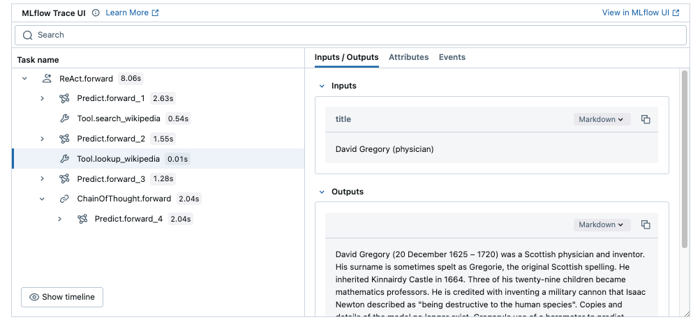

<!-- Auto-generated from /Volumes/cdrive/repos/OTHER_PEOPLES_REPOS/dspy/docs/docs/tutorials/games/index.ipynb on 2025-11-23T23:34:13.853230Z -->

# Tutorial: Fine-tuning Agents

Let's walk through a quick example of optimizing the _language model weights_ (i.e., fine-tuning) inside a DSPy module that represents a ReAct agent playing a game with 50-step tasks.

### Install dependencies and download data

Install the latest DSPy via `pip install -U dspy` and follow along. This tutorial uses the AlfWorld dataset, which depends on DSPy 2.6.0.

You will also need the following dependencies:

```shell
> pip install -U alfworld==0.3.5 multiprocess
> alfworld-download
```

<details>
<summary>Recommended: Setup MLflow Tracing for learning what's happening under the hood</summary>

### MLflow DSPy Integration

<a href="https://mlflow.org/">MLflow</a> is an LLMOps tool that natively integrates with DSPy and offer explainability and experiment tracking. In this tutorial, you can use MLflow to visualize prompts and optimization progress as traces to understand the DSPy's behavior better. You can set up MLflow easily by following the four steps below.



1. Install MLflow

```bash
%pip install mlflow>=2.20
```

2. Start MLflow UI in a separate terminal
```bash
mlflow ui --port 5000
```

3. Connect the notebook to MLflow
```python
import mlflow

mlflow.set_tracking_uri("http://localhost:5000")
mlflow.set_experiment("DSPy")
```

4. Enabling tracing.
```python
mlflow.dspy.autolog()
```


To learn more about the integration, visit [MLflow DSPy Documentation](https://mlflow.org/docs/latest/llms/dspy/index.html) as well.
</details>

### Set up the language models

Our goal is to allow `gpt-4o-mini` to play the AlfWorld household game proficiently, without tinkering with string prompts or example trajectories by hand.

Though it's not strictly necessary, we'll make our job a little easier by using the larger `gpt-4o` for prompt optimization and fine-tuning, building our small `gpt-4o-mini` agent.

```python
import dspy

gpt4o_mini = dspy.LM('gpt-4o-mini-2024-07-18')
gpt4o = dspy.LM('openai/gpt-4o')
dspy.configure(experimental=True)
```

Let's load 200 training and 200 development tasks from AlfWorld. The dataset is much larger, but a small number of examples will help keep this tutorial run in 1-2 hours, including fine-tuning.

With just 100 training tasks, we'll teach 4o-mini to go from 19% (can barely play the game) to 72%. If you use 500 tasks and retain the demonstrations during fine-tuning, you can push that easily to 82%.

```python
from dspy.datasets.alfworld import AlfWorld

alfworld = AlfWorld()
trainset, devset = alfworld.trainset[:200], alfworld.devset[-200:]
len(trainset), len(devset)
```

Before we proceed, let's view an example of this task.

```python
example = trainset[0]

with alfworld.POOL.session() as env:
    task, info = env.init(**example.inputs())

print(task)
```

```text
-= Welcome to TextWorld, ALFRED! =-

You are in the middle of a room. Looking quickly around you, you see a countertop 1, a drawer 8, a drawer 7, a drawer 6, a drawer 5, a drawer 4, a drawer 3, a drawer 2, a drawer 1, a garbagecan 1, a handtowelholder 1, a sinkbasin 2, a sinkbasin 1, a toilet 1, a toiletpaperhanger 1, and a towelholder 1.

Your task is to: put a clean soapbar in garbagecan.
```

### Defining the Agent program

The agent is a pretty simple `dspy.Module` with one sub-module called `self.react`.

This sub-module consumes a definition of a specific `task`, sees its previous `trajectory`, and sees a list of
`possible_actions` it can take. It responds simply with the next action.

In the `forward` method, we just initialize an environment for the given task `idx`. And we loop up to `self.max_iters`,
repeatedly invoking the `self.react` module to take the next action.

```python
class Agent(dspy.Module):
    def __init__(self, max_iters=50, verbose=False):
        self.max_iters = max_iters
        self.verbose = verbose
        self.react = dspy.Predict("task, trajectory, possible_actions: list[str] -> action")

    def forward(self, idx):
        with alfworld.POOL.session() as env:
            trajectory = []
            task, info = env.init(idx)
            if self.verbose:
                print(f"Task: {task}")

            for _ in range(self.max_iters):
                trajectory_ = "\n".join(trajectory)
                possible_actions = info["admissible_commands"][0] + ["think: ${...thoughts...}"]
                prediction = self.react(task=task, trajectory=trajectory_, possible_actions=possible_actions)
                trajectory.append(f"> {prediction.action}")

                if prediction.action.startswith("think:"):
                    trajectory.append("OK.")
                    continue

                obs, reward, done, info = env.step(prediction.action)
                obs, reward, done = obs[0], reward[0], done[0]
                trajectory.append(obs)

                if self.verbose:
                    print("\n".join(trajectory[-2:]))

                if done:
                    break

        assert reward == int(info["won"][0]), (reward, info["won"][0])
        return dspy.Prediction(trajectory=trajectory, success=reward)
```

#### Aside: If you wanted to include instructions for your agent...

Above, we opted to keep the agent super simple, without even providing short instructions that describe the task.

In principle, you can copy a short definition of the AlfWorld task (based on Yao et al., 2022) and use that as the
instruction for your agent. This is not inherently essential, but it helps illustrate the role that
instructions play in DSPy: they're not for coercing the model to exhibit a certain behavior, but they're there to
describe the fundamentals of the task in a straightforward, human-readable way.

If you want to do that, you can simply replace this:

```python
self.react = dspy.Predict("task, trajectory, possible_actions: list[str] -> action")
```

with this:

```python
INSTRUCTIONS = """
Interact with a simulated household to achieve a high-level goal. Make sure to plan, track subgoals,
determine likely locations for common household items (e.g. desklamps will likely be on desks, shelfs, or dressers),
and explore systematically (e.g. check all desks one by one for desklamp).
""".strip()

self.react = dspy.Predict(dspy.Signature("task, trajectory, possible_actions: list[str] -> action", INSTRUCTIONS))
```

### Zero-shot evaluation

Now, let's try this simple program, prior to any optimization work.

```python
agent_4o = Agent()
agent_4o.set_lm(gpt4o)
agent_4o.verbose = True

agent_4o(**example.inputs())
```

```text
Task: -= Welcome to TextWorld, ALFRED! =-

You are in the middle of a room. Looking quickly around you, you see a countertop 1, a drawer 8, a drawer 7, a drawer 6, a drawer 5, a drawer 4, a drawer 3, a drawer 2, a drawer 1, a garbagecan 1, a handtowelholder 1, a sinkbasin 2, a sinkbasin 1, a toilet 1, a toiletpaperhanger 1, and a towelholder 1.

Your task is to: put a clean soapbar in garbagecan.
> go to countertop 1
You arrive at countertop 1. On the countertop 1, you see a candle 1, a soapbar 1, a soapbottle 2, a soapbottle 1, and a spraybottle 1.
> take soapbar 1 from countertop 1
You pick up the soapbar 1 from the countertop 1.
> go to garbagecan 1
You arrive at garbagecan 1. On the garbagecan 1, you see nothing.
> move soapbar 1 to garbagecan 1
You move the soapbar 1 to the garbagecan 1.
> examine garbagecan 1
On the garbagecan 1, you see a soapbar 1.
> examine garbagecan 1
On the garbagecan 1, you see a soapbar 1.
> examine garbagecan 1
On the garbagecan 1, you see a soapbar 1.
> examine garbagecan 1
On the garbagecan 1, you see a soapbar 1.
> look
You are facing the garbagecan 1. Next to it, you see nothing.
> look
You are facing the garbagecan 1. Next to it, you see nothing.
> look
You are facing the garbagecan 1. Next to it, you see nothing.
> take soapbar 1 from garbagecan 1
You pick up the soapbar 1 from the garbagecan 1.
> move soapbar 1 to garbagecan 1
You move the soapbar 1 to the garbagecan 1.
> examine garbagecan 1
On the garbagecan 1, you see a soapbar 1.
> examine garbagecan 1
On the garbagecan 1, you see a soapbar 1.
> examine garbagecan 1
On the garbagecan 1, you see a soapbar 1.
> examine garbagecan 1
On the garbagecan 1, you see a soapbar 1.
> examine garbagecan 1
On the garbagecan 1, you see a soapbar 1.
> look
You are facing the garbagecan 1. Next to it, you see nothing.
> look
You are facing the garbagecan 1. Next to it, you see nothing.
> look
You are facing the garbagecan 1. Next to it, you see nothing.
> look
You are facing the garbagecan 1. Next to it, you see nothing.
> examine garbagecan 1
On the garbagecan 1, you see a soapbar 1.
> look
You are facing the garbagecan 1. Next to it, you see nothing.
> look
You are facing the garbagecan 1. Next to it, you see nothing.
> look
You are facing the garbagecan 1. Next to it, you see nothing.
> look
You are facing the garbagecan 1. Next to it, you see nothing.
> look
You are facing the garbagecan 1. Next to it, you see nothing.
> examine garbagecan 1
On the garbagecan 1, you see a soapbar 1.
> look
You are facing the garbagecan 1. Next to it, you see nothing.
> look
You are facing the garbagecan 1. Next to it, you see nothing.
> look
You are facing the garbagecan 1. Next to it, you see nothing.
> look
You are facing the garbagecan 1. Next to it, you see nothing.
> look
You are facing the garbagecan 1. Next to it, you see nothing.
> look
You are facing the garbagecan 1. Next to it, you see nothing.
> look
You are facing the garbagecan 1. Next to it, you see nothing.
> look
You are facing the garbagecan 1. Next to it, you see nothing.
> look
You are facing the garbagecan 1. Next to it, you see nothing.
> look
You are facing the garbagecan 1. Next to it, you see nothing.
> look
You are facing the garbagecan 1. Next to it, you see nothing.
> look
You are facing the garbagecan 1. Next to it, you see nothing.
> look
You are facing the garbagecan 1. Next to it, you see nothing.
> look
You are facing the garbagecan 1. Next to it, you see nothing.
> look
You are facing the garbagecan 1. Next to it, you see nothing.
> look
You are facing the garbagecan 1. Next to it, you see nothing.
> look
You are facing the garbagecan 1. Next to it, you see nothing.
> look
You are facing the garbagecan 1. Next to it, you see nothing.
> look
You are facing the garbagecan 1. Next to it, you see nothing.
> examine garbagecan 1
On the garbagecan 1, you see a soapbar 1.
> look
You are facing the garbagecan 1. Next to it, you see nothing.
```

Okay, in this case it couldn't solve this example! Now, let's check the average quality of 4o and 4o-mini.

```python
metric = lambda x, y, trace=None: y.success
evaluate = dspy.Evaluate(devset=devset, metric=metric, display_progress=True, num_threads=16)
```

<details>
<summary>Tracking Evaluation Results in MLflow Experiment</summary>

<br/>

To track and visualize the evaluation results over time, you can record the results in MLflow Experiment.


```python
import mlflow

with mlflow.start_run(run_name="agent_evaluation"):
    evaluate = dspy.Evaluate(
        devset=devset,
        metric=metric,
        num_threads=16,
        display_progress=True,
        # To record the outputs and detailed scores to MLflow
        return_all_scores=True,
        return_outputs=True,
    )

    # Evaluate the program as usual
    aggregated_score, outputs, all_scores = evaluate(cot)

    # Log the aggregated score
    mlflow.log_metric("success_rate", aggregated_score)
    # Log the detailed evaluation results as a table
    mlflow.log_table(
        {
            "Idx": [example.idx for example in eval_set],
            "Result": outputs,
            "Success": all_scores,
        },
        artifact_file="eval_results.json",
    )
```

To learn more about the integration, visit [MLflow DSPy Documentation](https://mlflow.org/docs/latest/llms/dspy/index.html) as well.

</details>

```python
agent_4o.verbose = False
evaluate(agent_4o)
```

```text
Average Metric: 115.00 / 200 (57.5%): 100%|██████████| 200/200 [06:14<00:00,  1.87s/it]
```

```text
2024/12/28 11:10:25 INFO dspy.evaluate.evaluate: Average Metric: 115 / 200 (57.5%)
```

```text

```

```python
agent_4o_mini = Agent()
agent_4o_mini.set_lm(gpt4o_mini)

evaluate(agent_4o_mini)
```

```text
Average Metric: 30.00 / 200 (15.0%): 100%|██████████| 200/200 [08:33<00:00,  2.57s/it]
```

```text
2024/12/28 11:18:59 INFO dspy.evaluate.evaluate: Average Metric: 30 / 200 (15.0%)
```

```text

```

Out of the box, on this task, 4o is decent (58% success rate) while 4o-mini struggles (15% success rate).

Let's apply the following strategy:

1. We'll optimize the _prompts_ for gpt-4o in a lightweight way.
2. We'll then use this prompt-optimized agent as a teacher to fine-tune gpt-4o-mini on the task. This will increase its quality from 19% to 72% (or 82% if you use 500 trainset examples).

### Prompt-optimizing GPT-4o

```python
optimizer = dspy.MIPROv2(metric=metric, auto="light", num_threads=16, prompt_model=gpt4o)

config = dict(max_bootstrapped_demos=1, max_labeled_demos=0, minibatch_size=40)
optimized_4o = optimizer.compile(agent_4o, trainset=trainset, **config)
```

### Fine-tuning GPT-4o-mini

For fine-tuning, we'll need a teacher program (`optimized_4o` above) and a student program derived from it (`student_4om` below).

```python
student_4o_mini = optimized_4o.deepcopy()
student_4o_mini.set_lm(gpt4o_mini)
# student_4o_mini.react.demos = []  # you can optionally reset the demos
```

```python
optimizer = dspy.BootstrapFinetune(metric=metric, num_threads=16)
finetuned_4o_mini = optimizer.compile(student_4o_mini, teacher=optimized_4o, trainset=trainset)
```

### Evaluate the finetuned GPT-4o-mini agent

```python
evaluate(finetuned_4o_mini)
```

```text
Average Metric: 143.00 / 200 (71.5%): 100%|██████████| 200/200 [03:15<00:00,  1.05it/s]
```

Having done all this optimization, let's save our program so we can use it later! This will keep a reference to the fine-tuned model as well, as long as it continued to exist with the same identifier at the provider side.

```python
finetuned_4o_mini.save('finetuned_4o_mini_001.pkl')
```

<details>
<summary>Saving programs in MLflow Experiment</summary>

<br/>

Instead of saving the program to a local file, you can track it in MLflow for better reproducibility and collaboration.

1. **Dependency Management**: MLflow automatically save the frozen environment metadata along with the program to ensure reproducibility.
2. **Experiment Tracking**: With MLflow, you can track the program's performance and cost along with the program itself.
3. **Collaboration**: You can share the program and results with your team members by sharing the MLflow experiment.

To save the program in MLflow, run the following code:

```python
import mlflow

# Start an MLflow Run and save the program
with mlflow.start_run(run_name="optimized"):
    model_info = mlflow.dspy.log_model(
        finetuned_4o_mini,
        artifact_path="model", # Any name to save the program in MLflow
    )

# Load the program back from MLflow
loaded = mlflow.dspy.load_model(model_info.model_uri)
```

To learn more about the integration, visit [MLflow DSPy Documentation](https://mlflow.org/docs/latest/llms/dspy/index.html) as well.

</details>

Let's now check out one task using our fine-tuned agent program!

```python
finetuned_4o_mini.verbose = True
finetuned_4o_mini(**devset[0].inputs())
```

```text
Task: -= Welcome to TextWorld, ALFRED! =-

You are in the middle of a room. Looking quickly around you, you see a armchair 1, a cabinet 1, a drawer 21, a drawer 20, a drawer 19, a drawer 18, a drawer 17, a drawer 16, a drawer 15, a drawer 14, a drawer 13, a drawer 12, a drawer 11, a drawer 10, a drawer 9, a drawer 8, a drawer 7, a drawer 6, a drawer 5, a drawer 4, a drawer 3, a drawer 2, a drawer 1, a dresser 1, a garbagecan 1, a sidetable 5, a sidetable 4, a sidetable 3, a sidetable 2, a sidetable 1, and a sofa 1.

Your task is to: put some box on dresser.
> go to cabinet 1
You arrive at cabinet 1. On the cabinet 1, you see nothing.
> go to dresser 1
You arrive at dresser 1. On the dresser 1, you see a book 1, a newspaper 1, a remotecontrol 1, a statue 3, and a television 1.
> look
You are facing the dresser 1. Next to it, you see nothing.
> go to sidetable 1
You arrive at sidetable 1. On the sidetable 1, you see a cellphone 1, and a desklamp 1.
> go to sidetable 2
You arrive at sidetable 2. On the sidetable 2, you see a box 2.
> take box 2 from sidetable 2
You pick up the box 2 from the sidetable 2.
> go to dresser 1
You arrive at dresser 1. On the dresser 1, you see a book 1, a newspaper 1, a remotecontrol 1, a statue 3, and a television 1.
> move box 2 to dresser 1
You move the box 2 to the dresser 1.
```

If you want to load and use the agent program, you can do that as follows.

> **⚠️ Security Warning:** Loading `.pkl` files can execute arbitrary code and may be dangerous. Only save and load pickle files from trusted sources in secure environments. Consider using JSON format when possible for safer serialization.

```python
loaded = Agent()
loaded.load('finetuned_4o_mini_001.pkl', allow_pickle=True)
```
