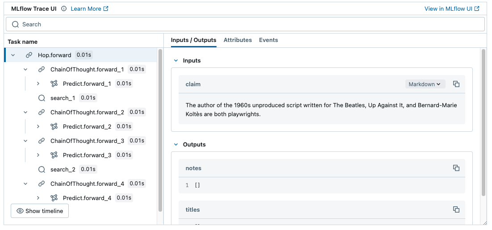

<!-- Auto-generated from /Volumes/cdrive/repos/OTHER_PEOPLES_REPOS/dspy/docs/docs/tutorials/multihop_search/index.ipynb on 2025-12-11T00:06:39.008535Z -->

# Tutorial: Multi-Hop Retrieval

Let's walk through a quick example of building a `dspy.Module` with multiple sub-modules. We'll do this for the task for multi-hop search.

Install the latest DSPy via `pip install -U dspy` and follow along. You also need to run `pip install datasets`.

<details>
<summary>Recommended: Set up MLflow Tracing to understand what's happening under the hood.</summary>

### MLflow DSPy Integration

<a href="https://mlflow.org/">MLflow</a> is an LLMOps tool that natively integrates with DSPy and offer explainability and experiment tracking. In this tutorial, you can use MLflow to visualize prompts and optimization progress as traces to understand the DSPy's behavior better. You can set up MLflow easily by following the four steps below.

1. Install MLflow

```bash
%pip install mlflow>=2.20
```

2. Start MLflow UI in a separate terminal
```bash
mlflow ui --port 5000
```

3. Connect the notebook to MLflow
```python
import mlflow

mlflow.set_tracking_uri("http://localhost:5000")
mlflow.set_experiment("DSPy")
```

4. Enabling tracing.
```python
mlflow.dspy.autolog()
```




To learn more about the integration, visit [MLflow DSPy Documentation](https://mlflow.org/docs/latest/llms/dspy/index.html) as well.
</details>

In this tutorial, we'll use a small local LM, Meta's `Llama-3.1-8B-Instruct` which has 8 billion parameters.

You might be able to host the 8B model on your laptop with Ollama, on your GPU server with SGLang, or via a provider that hosts it for you like Databricks or Together.

In the snippet below, we'll configure this small model as our main LM. We'll also set up a larger LM, i.e. `GPT-4o`, as a teacher that we'll invoke a very small number of times to help teach the small LM. This is technically not necessary; the small model can typically teach itself tasks like this in DSPy. But using a larger teacher will give us some peace of mind, where the initial system or optimizer configuration doesn't matter as much.

```python
import dspy

lm = dspy.LM('<your_provider>/Llama-3.1-8B-Instruct', max_tokens=3000)
gpt4o = dspy.LM('openai/gpt-4o', max_tokens=3000)

dspy.configure(lm=lm)
```

### Install dependencies and download data

To do the retrieval, we'll use the cool BM25S library, as it's pretty lightweight. You can replace this components with whatever you like.

```shell
> pip install -U bm25s PyStemmer "jax[cpu]"
```

Next, we'll download a snapshot abstracts (i.e., first paragraphs) of all 5,000,000 Wikipedia pages as of 2017. We'll use this as our retrieval corpus.

This is 500MB compressed, so the download and decompression may take 2-3 minutes.

```python
from dspy.utils import download

download("https://huggingface.co/dspy/cache/resolve/main/wiki.abstracts.2017.tar.gz")
!tar -xzvf wiki.abstracts.2017.tar.gz
```

Let's now load the corpus.

```python
import ujson
corpus = []

with open("wiki.abstracts.2017.jsonl") as f:
    for line in f:
        line = ujson.loads(line)
        corpus.append(f"{line['title']} | {' '.join(line['text'])}")

len(corpus)
```

And then let's index it for BM25 retrieval! This will take 2-3 minutes.

```python
import bm25s
import Stemmer

stemmer = Stemmer.Stemmer("english")
corpus_tokens = bm25s.tokenize(corpus, stopwords="en", stemmer=stemmer)

retriever = bm25s.BM25(k1=0.9, b=0.4)
retriever.index(corpus_tokens)
```

### Load the HoVer dataset.

Let's load a dataset for our task. We'll load examples from the HoVer multi-hop task, where the input is a (really!) complex claim and the output we're seeking is the set of Wikipedia pages that are required to fact-check that claim.

```python
import random
from dspy.datasets import DataLoader

kwargs = dict(fields=("claim", "supporting_facts", "hpqa_id", "num_hops"), input_keys=("claim",))
hover = DataLoader().from_huggingface(dataset_name="vincentkoc/hover-parquet", split="train", trust_remote_code=True, **kwargs)

hpqa_ids = set()
hover = [
    dspy.Example(claim=x.claim, titles=list(set([y["key"] for y in x.supporting_facts]))).with_inputs("claim")
    for x in hover
    if x["num_hops"] == 3 and x["hpqa_id"] not in hpqa_ids and not hpqa_ids.add(x["hpqa_id"])
]

random.Random(0).shuffle(hover)
trainset, devset, testset = hover[:200], hover[200:500], hover[650:]
```

Let's view an example of this task:

```python
example = trainset[0]

print("Claim:", example.claim)
print("Pages that must be retrieved:", example.titles)
```

```text
Claim: This director is known for his work on Miss Potter. The Academy of Motion Picture Arts and Sciences presents the award in which he was nominated for his work in "Babe".
Pages that must be retrieved: ['Miss Potter', 'Chris Noonan', 'Academy Award for Best Director']
```

Now, let's define a function to do the search in Wikipedia. This will use our BM25 index.

```python
def search(query: str, k: int) -> list[str]:
    tokens = bm25s.tokenize(query, stopwords="en", stemmer=stemmer, show_progress=False)
    results, scores = retriever.retrieve(tokens, k=k, n_threads=1, show_progress=False)
    run = {corpus[doc]: float(score) for doc, score in zip(results[0], scores[0])}
    return run
```

Now, let's define the multi-hop program in DSPy. It's going to be super simple: it'll take a `claim` and produce a list `titles: list[str]`.

It will do this via two sub-modules: `generate_query` and `append_notes`.

```python
class Hop(dspy.Module):
    def __init__(self, num_docs=10, num_hops=4):
        self.num_docs, self.num_hops = num_docs, num_hops
        self.generate_query = dspy.ChainOfThought('claim, notes -> query')
        self.append_notes = dspy.ChainOfThought('claim, notes, context -> new_notes: list[str], titles: list[str]')

    def forward(self, claim: str) -> list[str]:
        notes = []
        titles = []

        for _ in range(self.num_hops):
            query = self.generate_query(claim=claim, notes=notes).query
            context = search(query, k=self.num_docs)
            prediction = self.append_notes(claim=claim, notes=notes, context=context)
            notes.extend(prediction.new_notes)
            titles.extend(prediction.titles)
        
        return dspy.Prediction(notes=notes, titles=list(set(titles)))
```

Great. Now let's set up an evaluation metric, `top5_recall`.

It will return the fraction of the gold pages (which are always 3) that are retrieved in the top-5 titles returned by the program.

```python
def top5_recall(example, pred, trace=None):
    gold_titles = example.titles
    recall = sum(x in pred.titles[:5] for x in gold_titles) / len(gold_titles)

    # If we're "bootstrapping" for optimization, return True if and only if the recall is perfect.
    if trace is not None:
        return recall >= 1.0
    
    # If we're just doing inference, just measure the recall.
    return recall

evaluate = dspy.Evaluate(devset=devset, metric=top5_recall, num_threads=16, display_progress=True, display_table=5)
```

Let's evaluate our off-the-shelf program!

```python
evaluate(Hop())
```

```text
Average Metric: 27.67 / 98 (28.2%):  32%|███▏      | 97/300 [00:02<00:04, 49.34it/s]
```

```text
2024/12/25 12:18:00 ERROR dspy.utils.parallelizer: Error processing item Example({'claim': "All That is the show that the co-creator with the host of Vibe and Wild 'N Out had a debut on.", 'titles': ['Chris Spencer (actor)', 'Nick Cannon', 'Vibe (talk show)']}) (input_keys={'claim'}): Expected dict_keys(['reasoning', 'new_notes', 'titles']) but got dict_keys(['reasoning', 'new_notes']). Set `provide_traceback=True` to see the stack trace.
```

```text
Average Metric: 59.33 / 186 (31.9%):  62%|██████▏   | 186/300 [00:03<00:02, 51.84it/s]
```

```text
2024/12/25 12:18:02 ERROR dspy.utils.parallelizer: Error processing item Example({'claim': 'The song, which Billie Anthony is best known for her Top 10 hit version, topped the UK chart in 1981 in a recording by a platinum-selling British rock and roll singer whose recording and performing career began in the late 1960s.', 'titles': ["Shakin' Stevens", 'This Ole House', 'Billie Anthony']}) (input_keys={'claim'}): Expected dict_keys(['reasoning', 'new_notes', 'titles']) but got dict_keys(['reasoning']). Set `provide_traceback=True` to see the stack trace.
```

```text
Average Metric: 94.00 / 298 (31.5%): 100%|██████████| 300/300 [00:06<00:00, 48.56it/s]
```

```text
2024/12/25 12:18:04 INFO dspy.evaluate.evaluate: Average Metric: 93.99999999999993 / 300 (31.3%)
```

<details>
<summary>Tracking Evaluation Results in MLflow Experiment</summary>

<br/>

To track and visualize the evaluation results over time, you can record the results in MLflow Experiment.


```python
import mlflow

with mlflow.start_run(run_name="hop_evaluation"):
    evaluate = dspy.Evaluate(
        devset=devset,
        metric=top5_recall,
        num_threads=16,
        display_progress=True,
    )

    # Evaluate the program as usual
    result = evaluate(Hop())

    # Log the aggregated score
    mlflow.log_metric("top5_recall", result.score)
    # Log the detailed evaluation results as a table
    mlflow.log_table(
        {
            "Claim": [example.claim for example in eval_set],
            "Expected Titles": [example.titles for example in eval_set],
            "Predicted Titles": [output[1] for output in result.results],
            "Top 5 Recall": [output[2] for output in result.results],
        },
        artifact_file="eval_results.json",
    )
```

To learn more about the integration, visit [MLflow DSPy Documentation](https://mlflow.org/docs/latest/llms/dspy/index.html) as well.

</details>

Let's now optimize the two prompts inside the `Hop()` program jointly to maximize the recall of our program. This may take around 35 minutes and make some $5 worth of calls to GPT-4o to optimize Llama-3.1-8B.

```python
models = dict(prompt_model=gpt4o, teacher_settings=dict(lm=gpt4o))
tp = dspy.MIPROv2(metric=top5_recall, auto="medium", num_threads=16, **models)

kwargs = dict(minibatch_size=40, minibatch_full_eval_steps=4)
optimized = tp.compile(Hop(), trainset=trainset, max_bootstrapped_demos=4, max_labeled_demos=4, **kwargs)
```

Let's now evaluate again, after optimization.

```python
evaluate(optimized)
```

```text
Average Metric: 38.67 / 64 (60.4%):  21%|██        | 63/300 [00:01<00:06, 38.13it/s]
```

```text
2024/12/25 12:18:09 ERROR dspy.utils.parallelizer: Error processing item Example({'claim': 'Eliot Hyman co-founded  Seven Arts Productions in 1957. His co-founder produced the American-American black comedy-drama film directed by Stanley Kubrick.', 'titles': ['Ray Stark', 'Seven Arts Productions', 'Lolita (1962 film)']}) (input_keys={'claim'}): Expected dict_keys(['reasoning', 'query']) but got dict_keys(['reasoning']). Set `provide_traceback=True` to see the stack trace.
```

```text
Average Metric: 177.33 / 299 (59.3%): 100%|██████████| 300/300 [00:08<00:00, 36.01it/s]
```

```text
2024/12/25 12:18:16 INFO dspy.evaluate.evaluate: Average Metric: 177.33333333333334 / 300 (59.1%)
```

```text

```

Awesome. It looks like the system improved drastically from around 30% recall to a little below 60% recall. That was a pretty straightforward approach, but DSPy gives you many tools to continue iterating on this from here.

Next, let's inspect the optimized prompts to understand what it has learned. We'll run one query and then inspect the last two prompts, which will show us the prompts used for both sub-modules, in the later iteration inside the `Hop()` program. (Alternatively, if you enabled MLflow Tracing following the instructions above, you can see all steps done by the agent including LLM calls, prompts, tool execution, in a rich tree-view.)

```python
optimized(claim="The author of the 1960s unproduced script written for The Beatles, Up Against It, and Bernard-Marie Koltès are both playwrights.").titles
```

```python
dspy.inspect_history(n=2)
```

```text


[2024-12-25T12:18:16.177899]

System message:

Your input fields are:
1. `claim` (str)
2. `notes` (str)

Your output fields are:
1. `reasoning` (str)
2. `query` (str)

All interactions will be structured in the following way, with the appropriate values filled in.

[[ ## claim ## ]]
{claim}

[[ ## notes ## ]]
{notes}

[[ ## reasoning ## ]]
{reasoning}

[[ ## query ## ]]
{query}

[[ ## completed ## ]]

In adhering to this structure, your objective is: 
        Given a claim and a set of notes, generate a query that can be used to gather additional evidence or context to support or refute the claim. Think step by step to ensure the query is specific and relevant to the information provided in the notes.


User message:

[[ ## claim ## ]]
Danyang, Jiangusu and this city are both cities in China. This city was the birthplace of Chen Xiuke.

[[ ## notes ## ]]
[1] «Chen Xiuke was born in Dongfang, Hainan.»
[2] «Danyang is a city in Jiangsu province, China.»
[3] «Chen Xiuke was born in Dongfang, Hainan.»
[4] «Danyang is a city in Jiangsu province, China.»
[5] «Dongfang is a city in Hainan province, China.»
[6] «Chen Xiuke was born in Dongfang, Hainan.»
[7] «Danyang is a city in Jiangsu province, China.»
[8] «Dongfang is a city in Hainan province, China.»
[9] «Chen Xiuke was born in Dongfang, Hainan.»
[10] «Danyang is a city in Jiangsu province, China.»
[11] «Dongfang is a city in Hainan province, China.»

Respond with the corresponding output fields, starting with the field `[[ ## reasoning ## ]]`, then `[[ ## query ## ]]`, and then ending with the marker for `[[ ## completed ## ]]`.


Assistant message:

[[ ## reasoning ## ]]
The claim states that Danyang, Jiangsu, and another city are both cities in China, and that this other city was the birthplace of Chen Xiuke. According to the notes, Chen Xiuke was born in Dongfang, Hainan. Therefore, the city referred to in the claim as "this city" is Dongfang, which is indeed a city in Hainan province, China. The claim is consistent with the information provided in the notes.

[[ ## query ## ]]
What is the birthplace of Chen Xiuke?

[[ ## completed ## ]]


User message:

[[ ## claim ## ]]
The star of Nothing to Report and Gary Barlow have a profession in common.

[[ ## notes ## ]]
[1] «Chris Jericho is a musician and professional wrestler.»
[2] «Gary Barlow is a singer and songwriter, known for being a member of Take That.»
[3] «Chris Jericho is a musician and professional wrestler.»
[4] «Gary Barlow is a singer and songwriter, known for being a member of Take That.»
[5] «Chris Jericho stars in 'Nothing to Report'.»
[6] «Chris Jericho is a musician and professional wrestler.»
[7] «Gary Barlow is a singer and songwriter, known for being a member of Take That.»
[8] «Chris Jericho stars in 'Nothing to Report'.»
[9] «Chris Jericho is a musician and professional wrestler.»
[10] «Gary Barlow is a singer and songwriter, known for being a member of Take That.»
[11] «Chris Jericho stars in 'Nothing to Report'.»

Respond with the corresponding output fields, starting with the field `[[ ## reasoning ## ]]`, then `[[ ## query ## ]]`, and then ending with the marker for `[[ ## completed ## ]]`.


Assistant message:

[[ ## reasoning ## ]]
The claim suggests that the star of "Nothing to Report" and Gary Barlow share a profession. From the notes, we know that Chris Jericho stars in "Nothing to Report" and is a musician and professional wrestler. Gary Barlow is a singer and songwriter. The common profession between Chris Jericho and Gary Barlow is that they are both musicians.

[[ ## query ## ]]
What is the profession that Chris Jericho and Gary Barlow have in common?

[[ ## completed ## ]]


User message:

[[ ## claim ## ]]
The author of the 1960s unproduced script written for The Beatles, Up Against It, and Bernard-Marie Koltès are both playwrights.

[[ ## notes ## ]]
N/A

Respond with the corresponding output fields, starting with the field `[[ ## reasoning ## ]]`, then `[[ ## query ## ]]`, and then ending with the marker for `[[ ## completed ## ]]`.


Response:

[[ ## reasoning ## ]]
The claim states that the author of the 1960s unproduced script written for The Beatles, Up Against It, and Bernard-Marie Koltès are both playwrights. However, there is no information in the notes to support or refute this claim. The notes are empty, which means we cannot verify the author of the script or Bernard-Marie Koltès' profession.

[[ ## query ## ]]
Who is the author of the 1960s unproduced script written for The Beatles, Up Against It?

[[ ## completed ## ]]


[2024-12-25T12:18:16.191896]

System message:

Your input fields are:
1. `claim` (str)
2. `notes` (str)
3. `context` (str)

Your output fields are:
1. `reasoning` (str)
2. `new_notes` (list[str])
3. `titles` (list[str])

All interactions will be structured in the following way, with the appropriate values filled in.

[[ ## claim ## ]]
{claim}

[[ ## notes ## ]]
{notes}

[[ ## context ## ]]
{context}

[[ ## reasoning ## ]]
{reasoning}

[[ ## new_notes ## ]]
{new_notes}        # note: the value you produce must be pareseable according to the following JSON schema: {"type": "array", "items": {"type": "string"}}

[[ ## titles ## ]]
{titles}        # note: the value you produce must be pareseable according to the following JSON schema: {"type": "array", "items": {"type": "string"}}

[[ ## completed ## ]]

In adhering to this structure, your objective is: 
        Analyze the provided `claim`, `notes`, and `context` to generate `new_notes` that further support or refute the claim, and extract relevant `titles` that represent key topics or entities from the context.


User message:

This is an example of the task, though some input or output fields are not supplied.

[[ ## claim ## ]]
The figure who currently holds the role Michael Noonan held from 2001 to 2002, was the Minister for Social Protection from 2016 until 2017.

[[ ## notes ## ]]
Not supplied for this particular example.

[[ ## context ## ]]
Not supplied for this particular example.

Respond with the corresponding output fields, starting with the field `[[ ## reasoning ## ]]`, then `[[ ## new_notes ## ]]` (must be formatted as a valid Python list[str]), then `[[ ## titles ## ]]` (must be formatted as a valid Python list[str]), and then ending with the marker for `[[ ## completed ## ]]`.


Assistant message:

[[ ## reasoning ## ]]
Not supplied for this particular example.

[[ ## new_notes ## ]]
Not supplied for this particular example.

[[ ## titles ## ]]
["Michael Noonan", "Leader of Fine Gael", "Leo Varadkar"]

[[ ## completed ## ]]


User message:

This is an example of the task, though some input or output fields are not supplied.

[[ ## claim ## ]]
The type of area Wiliwili are typically found in have a dominant tree species of Acacia koa. They are of the pea family.

[[ ## notes ## ]]
Not supplied for this particular example.

[[ ## context ## ]]
Not supplied for this particular example.

Respond with the corresponding output fields, starting with the field `[[ ## reasoning ## ]]`, then `[[ ## new_notes ## ]]` (must be formatted as a valid Python list[str]), then `[[ ## titles ## ]]` (must be formatted as a valid Python list[str]), and then ending with the marker for `[[ ## completed ## ]]`.


Assistant message:

[[ ## reasoning ## ]]
Not supplied for this particular example.

[[ ## new_notes ## ]]
Not supplied for this particular example.

[[ ## titles ## ]]
["Acacia koa", "Wiliwili", "Hawaiian tropical dry forests"]

[[ ## completed ## ]]


User message:

[[ ## claim ## ]]
The father of Zak Ové and A. Edward Sutherland are not both photographers.

[[ ## notes ## ]]
[1] «Horace Ové is a photographer, filmmaker, and writer.»
[2] «A. Edward Sutherland is a film director, not a photographer.»
[3] «Horace Ové is a photographer, filmmaker, and writer.»
[4] «A. Edward Sutherland is a film director, not a photographer.»
[5] «Horace Ové is a photographer, filmmaker, and writer.»
[6] «A. Edward Sutherland is a film director, not a photographer.»
[7] «Horace Ové is a photographer, filmmaker, and writer.»
[8] «A. Edward Sutherland is a film director, not a photographer.»

[[ ## context ## ]]
{"Horace Ové | Horace Ové, CBE (born 1939), is a British filmmaker, photographer, painter and writer, one of the leading black independent film-makers to emerge in Britain since the post-war period.  Ové holds the \"Guinness World Record\" for being the first black British film-maker to direct a feature-length film, \"Pressure\" (1975).  In its retrospective history, \"100 Years of Cinema\", the British Film Institute (BFI) declared: \"Horace Ové is undoubtedly a pioneer in Black British history and his work provides a perspective on the Black experience in Britain.\"": 15.836545944213867, "Zak Ové | Zak Ové (born 1966) is a British visual artist who works between sculpture, film and photography, living in London, UK, and Trinidad.  His themes reflect \"his documentation of and anthropological interest in diasporic and African history, specifically that which is explored through Trinidadian carnival.\"  In work that is \"filtered through his own personal and cultural upbringing, with a black Trinidadian father and white Irish mother\", he has exhibited widely in Europe, the United States and Africa, participating in international museum shows in London, Dakar, Paris, Dubai, Prague, Berlin, Johannesburg, Bamako and New York City.  His father is the filmmaker Horace Ové and his sister is the actress Indra Ové.": 13.145259857177734, "Playing Away | Playing Away is a 1987 TV comedy film directed by Horace Ové, from a screenplay by Caryl Phillips.  In the story, an English cricket team, fictitiously named \"Sneddington\" (based in Lavenham, Suffolk), invites a team of West Indian heritage based in Brixton (South London) to play a charity game in support of their \"Third World Week.\"  According to Screenonline, \"The gentle comedy of manners and unexpected reversal of white and black stereotypes in \"Playing Away\" contrasts sharply with the stylistic experimentation and the militant denunciations of racial prejudice in director Horace Ové's earlier feature, \"Pressure\" (1975).\" \" New York Times\" reviewer Vincent Canby called it \"witty and wise without being seriously disturbing for a minute\".": 12.445182800292969, "Pressure (film) | Pressure is a 1976 British drama film and the first feature-length fiction film directed by a Black film-maker in Britain.  Directed by Horace Ové, and co-written by him with Samuel Selvon, \"Pressure\" is a powerful portrait of inter-generational tensions between first- and second-generation West Indian migrants in London's Notting Hill area.  According to Julia Toppin,": 10.526924133300781, "What a Night! (1928 film) | What a Night!  (1928) is an American silent film directed by A. Edward Sutherland.  The romantic comedy was written by Louise Long, from a story by Lloyd Corrigan and Grover Jones.  The film stars Bebe Daniels, Neil Hamilton, and William Austin.": 10.453304290771484, "The Orchid House (TV serial) | The Orchid House is a four-part television serial that first aired on British television's Channel 4 from 21 February to 14 March 1991, directed by Horace Ové.  Its cast featured Diana Quick, Madge Sinclair, Nigel Terry, Elizabeth Hurley, Kate Buffery and Frances Barber, and was based on Phyllis Shand Allfrey's only novel of the same name.": 10.413471221923828, "Indra Ové | Indra Ové (born 1968) is a British movie and stage actress.": 10.15088176727295, "Henry Sutherland Edwards | Henry Sutherland Edwards (1828–1906) was a British journalist.": 9.868606567382812, "Burning an Illusion | Burning an Illusion is a 1981 British film written and directed by Menelik Shabazz, about a young British-born black woman's love life, mostly shot in London's Notting Hill and Ladbroke Grove communities.  It was only the second British feature to have been made by a black director, following Horace Ové’s 1975 \"Pressure\", and is described by Stephen Bourne as \"the first British film to give a black woman a voice of any kind.\"  Imruh Bakari worked with Shabazz and co-founded Kumba productions with him.": 9.634703636169434, "Horace Hall Edwards | Horace Hall Edwards (August 21, 1902 – January 27, 1987) was an American politician, who was mayor of Richmond, Virginia, and a candidate for governor in 1949.": 9.451831817626953}

Respond with the corresponding output fields, starting with the field `[[ ## reasoning ## ]]`, then `[[ ## new_notes ## ]]` (must be formatted as a valid Python list[str]), then `[[ ## titles ## ]]` (must be formatted as a valid Python list[str]), and then ending with the marker for `[[ ## completed ## ]]`.


Assistant message:

[[ ## reasoning ## ]]
The claim states that the father of Zak Ové and A. Edward Sutherland are not both photographers. From the context, we know that Zak Ové's father is Horace Ové, who is indeed a photographer among other professions. However, A. Edward Sutherland is not mentioned as a photographer in the context; he is known as a film director. Therefore, the claim is correct because Horace Ové is a photographer, but A. Edward Sutherland is not.

[[ ## new_notes ## ]]
["Horace Ové is a photographer, filmmaker, and writer.", "A. Edward Sutherland is a film director, not a photographer."]

[[ ## titles ## ]]
["Horace Ové", "A. Edward Sutherland", "Zak Ové"]

[[ ## completed ## ]]


User message:

[[ ## claim ## ]]
The summer 2016 romantic drama "Me Before You" is directed by Thea Sharrock. The star of the film The Lost Future (who also appears in The Hunger Games) stars as the character Will Traynor.

[[ ## notes ## ]]
[1] «Sam Claflin stars as Will Traynor in 'Me Before You'.»
[2] «Sam Claflin is known for his role as Finnick Odair in 'The Hunger Games'.»
[3] «Thea Sharrock directed 'Me Before You'.»
[4] «Sam Claflin stars as Will Traynor in 'Me Before You'.»
[5] «Sam Claflin is known for his role as Finnick Odair in 'The Hunger Games'.»
[6] «Thea Sharrock directed 'Me Before You'.»
[7] «Sam Claflin starred in 'The Lost Future'.»
[8] «Sam Claflin stars as Will Traynor in 'Me Before You'.»
[9] «Sam Claflin is known for his role as Finnick Odair in 'The Hunger Games'.»
[10] «Thea Sharrock directed 'Me Before You'.»
[11] «Sam Claflin starred in 'The Lost Future'.»
[12] «Sam Claflin stars as Will Traynor in 'Me Before You'.»
[13] «Sam Claflin is known for his role as Finnick Odair in 'The Hunger Games'.»
[14] «Thea Sharrock directed 'Me Before You'.»
[15] «Sam Claflin starred in 'The Lost Future'.»

[[ ## context ## ]]
{"Sam Claflin | Samuel George Claflin (born 27 June 1986) is an English actor.  He is known for portraying Finnick Odair in \"The Hunger Games\" film series, Philip Swift in \"\", and Will Traynor in \"Me Before You\".": 19.94539451599121, "Me Before You (film) | Me Before You is a 2016 romantic drama film directed by Thea Sharrock in her directorial debut and adapted by English author Jojo Moyes from her 2012 novel of the same name.  The film stars Emilia Clarke, Sam Claflin, Steve Peacocke, Jenna Coleman, Charles Dance, Matthew Lewis, Janet McTeer, Vanessa Kirby and Joanna Lumley.": 18.48834228515625, "Look What You Did to Me | Look What You Did to Me is the debut studio album by American rapper and singer Z-Ro.  It was released on June 16, 1998, by this independently distributed label Fisherboy Records.  The album is entirely produced by Z-Ro alongside Rakish Jacob (aka Roc), while the guest appearances was from T.A.Z., Bam, Trae, The Fakkulty, Chris Ward and Al-D.": 14.100790977478027, "I Still Know What You Did Last Summer | I Still Know What You Did Last Summer is a 1998 American slasher film and a sequel to the 1997 film \"I Know What You Did Last Summer\".  Directed by Danny Cannon, the film was written by Trey Callaway, and features characters originally created in Lois Duncan's 1973 novel \"I Know What You Did Last Summer\".  Jennifer Love Hewitt, Freddie Prinze, Jr. and Muse Watson reprise their roles, with Brandy, Mekhi Phifer, Jennifer Esposito, and Matthew Settle joining the cast.  \"I Still Know What You Did Last Summer\" continues after the events of the first film.": 13.990736961364746, "Tell Me What You Dream | \"Tell Me What You Dream\" is a song written by Timothy B. Schmit, Josh Leo and Vince Melamed and performed by country group Restless Heart along with saxophonist Warren Hill.  The single was the group's only number one on the adult contemporary chart and despite previous country chart success, the song did not make the country top 40.  \"Tell Me What You Dream\" spent two weeks at number one and peaked at number forty-three on the \"Billboard\" Hot 100.": 13.774335861206055, "Geraldine Jones (character) | Geraldine Jones was a fictional African American character, the most famous recurring persona of comedian Flip Wilson.  Geraldine was played as a sassy liberated Southern woman who was coarsely flirty yet faithful to her (unseen) boyfriend \"Killer\".  Poorly educated, she was nevertheless confident; she did not change her behavior to suit anyone.  Several of Geraldine's sayings entered U.S. popular culture as catchphrases, especially \"When you're hot, you're hot; when you're not, you're not,\" \"The Devil made me do it,\" and \"What you see is what you get! \"": 13.149161338806152, "When Did You Stop Loving Me, When Did I Stop Loving You | When Did You Stop Loving Me, When Did I Stop Loving You": 12.946025848388672, "Pajama Sam 3: You Are What You Eat from Your Head to Your Feet | Pajama Sam 3: You Are What You Eat from Your Head to Your Feet": 12.687528610229492, "Sam Quartin | Sam Quartin is a musician, producer and actress best known for role as June Glass, starring alongside Marilyn Manson in the American movie Let Me Make You a Martyr\"(2017), also for \"By the Rivers of Babylon)\" and \"Aimy in a Cage\".": 12.639335632324219, "Why You Wanna Treat Me So Bad? | \"Why You Wanna Treat Me So Bad?\"  is the US follow-up single to Prince's first big hit, \"I Wanna Be Your Lover\".  It is also Prince's first rock and roll-inspired single release.  It did not make the top 40 of the Billboard Hot 100 charts, although it did reach #13 on the R&B Singles charts.  The lyrics are self-explanatory from the title, and deal with a cruel lover.  The song prominently features guitar and bass, with the keyboard featured in a less prominent role.  A highlight of the song is a soaring guitar solo at the end, played by Prince himself.": 12.574298858642578}

Respond with the corresponding output fields, starting with the field `[[ ## reasoning ## ]]`, then `[[ ## new_notes ## ]]` (must be formatted as a valid Python list[str]), then `[[ ## titles ## ]]` (must be formatted as a valid Python list[str]), and then ending with the marker for `[[ ## completed ## ]]`.


Assistant message:

[[ ## reasoning ## ]]
The claim states that the film "Me Before You" is directed by Thea Sharrock and that the actor who stars as Will Traynor also appeared in "The Lost Future" and "The Hunger Games". According to the notes, Sam Claflin stars as Will Traynor in "Me Before You" and is known for his role as Finnick Odair in "The Hunger Games". Additionally, Sam Claflin starred in "The Lost Future". The context confirms that "Me Before You" is directed by Thea Sharrock and that Sam Claflin plays Will Traynor. Therefore, the claim is supported by the provided notes and context.

[[ ## new_notes ## ]]
["Sam Claflin stars as Will Traynor in 'Me Before You'.", "Sam Claflin is known for his role as Finnick Odair in 'The Hunger Games'.", "Thea Sharrock directed 'Me Before You'.", "Sam Claflin starred in 'The Lost Future'."]

[[ ## titles ## ]]
["Me Before You (film)", "Sam Claflin", "Thea Sharrock", "The Lost Future", "The Hunger Games"]

[[ ## completed ## ]]


User message:

[[ ## claim ## ]]
The author of the 1960s unproduced script written for The Beatles, Up Against It, and Bernard-Marie Koltès are both playwrights.

[[ ## notes ## ]]
N/A

[[ ## context ## ]]
{"Up Against It | Up Against It is an unproduced script by Joe Orton, written in 1967 for The Beatles at the height of their fame.": 23.741416931152344, "The Alien (unproduced film) | The Alien was an unproduced Indian-American science fiction film in development in the late 1960s which was eventually cancelled.  It was to be directed by celebrated Indian filmmaker Satyajit Ray and co-produced by Columbia Pictures.  The script was written by Ray in 1967, loosely based on Bankubabur Bandhu (\"Banku Babu's Friend\" or \"Mr. Banku's Friend\"), a Bengali science fiction story he had written in 1962 for \"Sandesh\", the Ray family magazine, which gained popularity among Bengalis in the early 1960s.  \"Bankubabur Bandhu\" was eventually adapted into a television film by Satyajit Ray's son Sandip Ray, and a play by the theatre group Swapnasandhani Kaushik Sen, in 2006.": 14.683004379272461, "Marsha Albert | Marsha Albert (born 1948) is credited with being the person who jump-started the early 1960s phenomena known as Beatlemania in the United States when as a 15-year-old girl, on 17 December 1963, she introduced for the first time on American radio a song written and recorded by The Beatles titled I Want to Hold Your Hand (the Beatles' best-selling single worldwide), and that Beatles historian and author Bruce Spizer noted, in 2004, by his stating \"Marsha Albert's actions forced a major record company to push up the release date of a debut single from an unknown band during the holiday season, a time when record companies traditionally released no new product.\"": 13.236483573913574, "Up Against It! (Todd Rundgren album) | Up Against It!  is a 1997 album by Todd Rundgren, essentially consisting of Rundgren's song demos for the Off Broadway show that were Written and Recorded by Todd from 1986-88.  The project was inspired by the never-produced Up Against It which was a play originally written by Joe Orton for The Beatles.": 12.989564895629883, "Blood and Fire (Star Trek: The Next Generation) | \"Blood and Fire\" is an episode written by David Gerrold for possible use on \"\".  The script was commissioned and written, but never actually filmed.  According to Gerrold, some of the production staff, including Rick Berman, had a negative reaction to its positive depiction of an openly gay couple.  Herbert Wright rewrote the script under the name \"Blood and Ice\", which also was left unproduced.": 11.980508804321289, "Cedar Rapids (film) | Cedar Rapids is a 2011 American comedy film directed by Miguel Arteta.  The script, written by Phil Johnston, was included on the 2009 Black List, a Hollywood list of the most popular unproduced screenplays of the year.": 11.593443870544434, "The Beatles: The Biography | The Beatles: The Biography is the name of a 2005 biography of the 1960s rock band The Beatles written by Bob Spitz.  It was first published by Little, Brown and Company on November 1, 2005.": 11.583497047424316, "The Illusionist (2010 film) | The Illusionist (French: L'Illusionniste ) is a 2010 French-British animated film directed by Sylvain Chomet.  The film is based on an unproduced script written by French mime, director and actor Jacques Tati in 1956.  Controversy surrounds Tati's motivation for the script, which was written as a personal letter to his estranged eldest daughter, Helga Marie-Jeanne Schiel in collaboration with his long-term writing partner Henri Marquet, between writing for the films \"Mon Oncle\" and \"Play Time\".": 11.528533935546875, "Bobby Florsheim | Robert Florsheim (born December 19, 1969) is an American screenwriter, best known for co-writing \"The Passion Of The Ark\" with Josh Stolberg, (the basis for the film \"Evan Almighty\").  Their original script was reported by Daily Variety as the highest priced spec script ever sold by unproduced screenwriters (April, 2004).  In refashioning the script into \"Evan Almighty\", Universal Studios discarded the script and then hired screenwriter Steve Oedekerk, who received sole writing credit on the finished film.": 11.23757553100586, "The Hook (screenplay) | The Hook is an unproduced screenplay by American playwright, Arthur Miller.  It was written in 1947 and was intended to be produced by Columbia Pictures Studio, Hollywood, and to be directed by Elia Kazan.  The screenplay was inspired by the true story of Pete Panto, a young dockworker who stood up against the corrupt Mafia-connected union leadership.  Panto was discovered dead in a pit outside New York eighteen months after his disappearance.  Set in the Red Hook district of Brooklyn, \"The Hook\" is the story of Marty Ferrara, a longshoreman who is ‘ready to lay down his life, if need be, to secure one thing – his sense of personal dignity.’": 11.222980499267578}

Respond with the corresponding output fields, starting with the field `[[ ## reasoning ## ]]`, then `[[ ## new_notes ## ]]` (must be formatted as a valid Python list[str]), then `[[ ## titles ## ]]` (must be formatted as a valid Python list[str]), and then ending with the marker for `[[ ## completed ## ]]`.


Response:

[[ ## reasoning ## ]]
The claim states that the author of the 1960s unproduced script written for The Beatles, "Up Against It", and Bernard-Marie Koltès are both playwrights. The context confirms that Joe Orton wrote the script "Up Against It" for The Beatles, and Bernard-Marie Koltès was a French playwright. Therefore, the claim is supported by the provided context.

[[ ## new_notes ## ]]
[]

[[ ## titles ## ]]
["Up Against It", "Bernard-Marie Koltès", "Joe Orton", "The Beatles"]

[[ ## completed ## ]]


```

Finally, let's save our optimized program so we can use it again later.

```python
optimized.save("optimized_hop.json")

loaded_program = Hop()
loaded_program.load("optimized_hop.json")

loaded_program(claim="The author of the 1960s unproduced script written for The Beatles, Up Against It, and Bernard-Marie Koltès are both playwrights.").titles
```

<details>
<summary>Saving programs in MLflow Experiment</summary>

<br/>

Instead of saving the program to a local file, you can track it in MLflow for better reproducibility and collaboration.

1. **Dependency Management**: MLflow automatically save the frozen environment metadata along with the program to ensure reproducibility.
2. **Experiment Tracking**: With MLflow, you can track the program's performance and cost along with the program itself.
3. **Collaboration**: You can share the program and results with your team members by sharing the MLflow experiment.

To save the program in MLflow, run the following code:

```python
import mlflow

# Start an MLflow Run and save the program
with mlflow.start_run(run_name="optimized"):
    model_info = mlflow.dspy.log_model(
        optimized,
        artifact_path="model", # Any name to save the program in MLflow
    )

# Load the program back from MLflow
loaded = mlflow.dspy.load_model(model_info.model_uri)
```

To learn more about the integration, visit [MLflow DSPy Documentation](https://mlflow.org/docs/latest/llms/dspy/index.html) as well.

</details>
