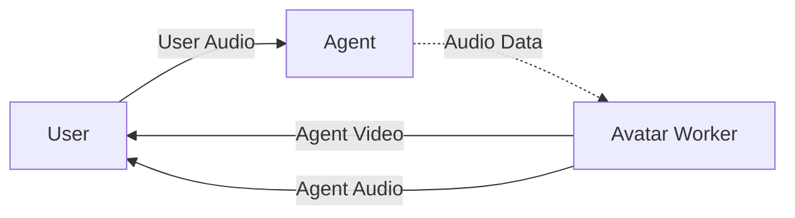

LiveKit docs › Models › Virtual avatars › Overview

---

# Virtual avatar plugins

> Guides for adding virtual avatars to your agents.

## Overview

Virtual avatars add lifelike video output for your voice AI agents. You can integrate a variety of providers to LiveKit Agents with just a few lines of code.

## Available plugins

The following plugins are available. Choose a plugin from this list for a step-by-step guide:

| Provider | Python | Node.js |
| -------- | ------ | ------- |
| [Anam](https://docs.livekit.io/agents/models/avatar/plugins/anam.md) | ✓ | — |
| [Beyond Presence](https://docs.livekit.io/agents/models/avatar/plugins/bey.md) | ✓ | — |
| [bitHuman](https://docs.livekit.io/agents/models/avatar/plugins/bithuman.md) | ✓ | — |
| [Hedra](https://docs.livekit.io/agents/models/avatar/plugins/hedra.md) | ✓ | — |
| [Simli](https://docs.livekit.io/agents/models/avatar/plugins/simli.md) | ✓ | — |
| [Tavus](https://docs.livekit.io/agents/models/avatar/plugins/tavus.md) | ✓ | — |

Have another provider in mind? LiveKit is open source and welcomes [new plugin contributions](https://docs.livekit.io/agents/models.md#contribute).

## How it works

The virtual avatar plugins work with the `AgentSession` class automatically. The plugin adds a separate participant, the avatar worker, to the room. The agent session sends its audio output to the avatar worker instead of to the room, which the avatar worker uses to publish synchronized audio + video tracks to the room and the end user.

To add a virtual avatar:

1. Install the selected plugin and API keys
2. Create an `AgentSession`, as in the [voice AI quickstart](https://docs.livekit.io/agents/start/voice-ai.md)
3. Create an `AvatarSession` and configure it as necessary
4. Start the avatar session, passing in the `AgentSession` instance
5. Start the `AgentSession` with audio output disabled (the audio is sent to the avatar session instead)

## Sample code

Here is an example using [Hedra Realtime Avatars](https://docs.livekit.io/agents/models/avatar/plugins/hedra.md):

```python
from livekit import agents
from livekit.agents import AgentServer, AgentSession, RoomOutputOptions
from livekit.plugins import hedra

server = AgentServer()

@server.rtc_session()
async def my_agent(ctx: agents.JobContext):
   session = AgentSession(
      # ... stt, llm, tts, etc.
   )

   avatar = hedra.AvatarSession(
      avatar_id="...",  # ID of the Hedra avatar to use
   )

   # Start the avatar and wait for it to join
   await avatar.start(session, room=ctx.room)

   # Start your agent session with the user
   await session.start(
      # ... room, agent, room_input_options, etc....
   )

```

## Avatar workers

To minimize latency, the avatar provider joins the LiveKit room directly as a secondary participant to publish synchronized audio and video to the room. In your frontend app, you must distinguish between the agent — your Python program running the `AgentSession` — and the avatar worker.



You can identify an avatar worker as a participant of kind `agent` with the attribute `lk.publish_on_behalf`. Check for these values in your frontend code to associate the worker's audio and video tracks with the agent.

```typescript
const agent = room.remoteParticipants.find(
  p => p.kind === Kind.Agent && p.attributes['lk.publish_on_behalf'] === null
);
const avatarWorker = room.remoteParticipants.find(
  p => p.kind === Kind.Agent && p.attributes['lk.publish_on_behalf'] === agent.identity
);

```

In React apps, use the [useVoiceAssistant hook](https://docs.livekit.io/reference/components/react/hook/usevoiceassistant.md) to get the correct audio and video tracks automatically:

```typescript
const { 
  agent, // The agent participant
  audioTrack, // the worker's audio track
  videoTrack, // the worker's video track
} = useVoiceAssistant();

```

## Frontend starter apps

The following [frontend starter apps](https://docs.livekit.io/agents/start/frontend.md#starter-apps) include out-of-the-box support for virtual avatars.

- **[SwiftUI Voice Agent](https://github.com/livekit-examples/agent-starter-swift)**: A native iOS, macOS, and visionOS voice AI assistant built in SwiftUI.

- **[Next.js Voice Agent](https://github.com/livekit-examples/agent-starter-react)**: A web voice AI assistant built with React and Next.js.

- **[Flutter Voice Agent](https://github.com/livekit-examples/agent-starter-flutter)**: A cross-platform voice AI assistant app built with Flutter.

- **[React Native Voice Agent](https://github.com/livekit-examples/agent-starter-react-native)**: A native voice AI assistant app built with React Native and Expo.

- **[Android Voice Agent](https://github.com/livekit-examples/agent-starter-android)**: A native Android voice AI assistant app built with Kotlin and Jetpack Compose.

- **[Agents Playground](https://docs.livekit.io/agents/start/playground.md)**: A virtual workbench to test your multimodal AI agent.

## Additional resources

- **[Web and mobile frontends](https://docs.livekit.io/agents/start/frontend.md)**: Guide to adding web or mobile frontends to your agent.

- **[Vision](https://docs.livekit.io/agents/build/vision.md)**: Give your agent the ability to see you, too.

---


For the latest version of this document, see [https://docs.livekit.io/agents/models/avatar.md](https://docs.livekit.io/agents/models/avatar.md).

To explore all LiveKit documentation, see [llms.txt](https://docs.livekit.io/llms.txt).