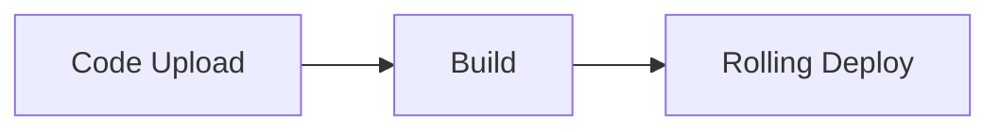

LiveKit docs › Agent deployment › Deploying to LiveKit Cloud › Getting started

---

# Deploying to LiveKit Cloud

> Run your agents in LiveKit Cloud.

## Overview

Deploy your agents to LiveKit Cloud to run them on LiveKit's global network and infrastructure. LiveKit Cloud provides automatic scaling and load balancing, ensuring capacity for new sessions up to the limits of your plan. Deploy your agent with a single LiveKit CLI command.

For deployments to other environments, see [Deploying to custom environments](https://docs.livekit.io/agents/ops/deployment/custom.md).

## Quickstart

Follow these steps to deploy your first agent to LiveKit Cloud.

### Prerequisites

This guide assumes that you already have:

- The latest version of the [LiveKit CLI](https://docs.livekit.io/home/cli.md)
- A [LiveKit Cloud](https://cloud.livekit.io) project
- A working agent. Create one using the [Voice AI quickstart](https://docs.livekit.io/agents/start/voice-ai.md) or one of the following starter templates:

- **[Python starter template](https://github.com/livekit-examples/agent-starter-python)**: A ready-to-deploy voice AI agent built with Python.

- **[Node.js starter template](https://github.com/livekit-examples/agent-starter-node)**: A ready-to-deploy voice AI agent built with Node.js.

### Deploy your agent

Use the following steps with the LiveKit CLI to deploy your agent.

1. Navigate to your project directory:

```shell
cd your-agent-project

```
2. Authenticate with LiveKit Cloud:

```shell
lk cloud auth

```

This opens a browser window to link your LiveKit Cloud project to the CLI. If you've already authenticated and have linked projects, use `lk project list` to list all linked projects. Then, set the default project for agent deployment with `lk project set-default "<project-name>"`.
3. Deploy your agent:

```shell
lk agent create

```

This registers your agent with LiveKit Cloud and assigns a unique ID. The ID is written to a new [`livekit.toml`](#toml) file along with the associated project and other default configuration. If you don't already have a `Dockerfile`, the CLI creates one for you.

Next, the CLI uploads your agent code to the LiveKit Cloud build service, builds an image from your Dockerfile, and then deploys it to your LiveKit Cloud project. See the [Builds](https://docs.livekit.io/agents/ops/deployment/builds.md) guide for details on the build process, logs, and templates.

Your agent is now deployed to LiveKit Cloud and is ready to handle requests. To connect, use the [Agent Playground](https://docs.livekit.io/agents/start/playground.md), [custom frontend](https://docs.livekit.io/agents/start/frontend.md), or [telephony integration](https://docs.livekit.io/agents/start/telephony.md).

### Monitor status and logs

Use the CLI to monitor the [status](https://docs.livekit.io/agents/ops/deployment/cli.md#status) and [logs](https://docs.livekit.io/agents/ops/deployment/cli.md#logs) of your agent.

1. Monitor agent status:

```shell
lk agent status

```

This shows status, replica count, and other details for your running agent.
2. Tail agent logs:

```shell
lk agent logs

```

This shows a live tail of the logs for the new instance of your deployed agent.

## Deploying new versions

To deploy a new version of your agent, run the following command:

```shell
lk agent deploy

```

LiveKit Cloud builds a container image that includes your agent code. The new version is pushed to production using a rolling deployment strategy. The rolling deployment allows new instances to serve new sessions, while existing instances are given up to 1 hour to complete active sessions. This ensures your new version is deployed without user interruptions or service downtime.



When you run `lk agent deploy`, LiveKit Cloud follows this process:

1. **Build**: The CLI uploads your code and builds a container image from your Dockerfile. See [Builds](https://docs.livekit.io/agents/ops/deployment/builds.md) for more information).
2. **Deploy**: New agent instances with your updated code are deployed alongside existing instances.
3. **Route new sessions**: New agent requests are routed to new instances.
4. **Graceful shutdown**: Old instances stop accepting new sessions, while remaining active for up to 1 hour to complete any active sessions.
5. **Autoscale**: New instances are automatically scaled up and down to meet demand.

### Rolling back

You can quickly rollback to a previous version of your agent, without a rebuild, by using the following command:

```shell
lk agent rollback

```

Rollback operates in the same rolling manner as a normal deployment.

> ℹ️ **Paid plan required**
> 
> Instant rollback is available only on paid LiveKit Cloud plans. Users on free plans should revert their code to an earlier version and then redeploy.

## Cold start

On certain plans, agents can be scaled down to zero replicas. When a new user connects to the agent, the instance does a "cold start" to serve them. This can take a little longer than normal to connect to the user. For more info, see the [Quotas and limits](https://docs.livekit.io/home/cloud/quotas-and-limits.md) guide.

## Regions

Each agent deployment is isolated to a single region, which you must select during the first deployment. The following regions are currently available for agent deployments:

| Region code | Geographic location |
| `us-east` | Ashburn, Virginia, USA |
| `eu-central` | Frankfurt, Germany |

Region assignment is immutable, and cannot be changed after agent creation.

### Multi-region deployments

To deploy an agent in multiple regions, use `lk agent create` once per region. To keep track of the deployments, add the region to the configuration file name. For instance, these commands deploy a new agent to both `us-east` and `eu-central` regions:

```shell
lk agent create --region us-east --config livekit.us-east.toml
lk agent create --region eu-central --config livekit.eu-central.toml

```

Now you can deploy the agent to each region as needed by specifying the appropriate configuration file:

```shell
lk agent deploy --config livekit.us-east.toml
lk agent deploy --config livekit.eu-central.toml

```

By default, users connect to the agent in the region closest to them. In some cases, if agents are at capacity, users may connect to an agent in a different region. For fine-grained control over which regions users connect to, set a separate agent name for each region and use [explicit dispatch](https://docs.livekit.io/agents/server/agent-dispatch.md#explicit) to directly assign users to the appropriate agent.

### Moving an agent to a new region

To move an existing agent to a new region, you should follow the preceding steps for [multi-region deployments](#multi-region-deployments) to add a deployment in the new region. Then, you can delete the agent in the old region using `lk agent delete`, specifying the old agent's ID or configuration file.

## Dashboard

The LiveKit Cloud dashboard provides a view into the status of your deployed and self-hosted agents.

- **Realtime metrics**: Monitor session count, agent status, and more.
- **Error tracking**: Identify and diagnose errors in agent sessions.
- **Usage and limits**: Track usage, billing, and limits.

- **[Agents dashboard](https://cloud.livekit.io/projects/p_/agents)**: Monitor and manage your deployed agents in the LiveKit Cloud dashboard.

## Configuration with livekit.toml

The `livekit.toml` file contains your agent's deployment configuration. The CLI automatically looks for this file in the current directory, and uses it when any `lk agent` commands are run in that directory.

** Filename: `livekit.toml`**

```toml
[project]
  subdomain = "<my-project-subdomain>"

[agent]
  id = "<agent-id>"

```

To generate a new `livekit.toml` file, run:

```shell
lk agent config

```

## Additional resources

The following guides cover additional topics for deploying and managing your agents in LiveKit Cloud.

- **[Secrets management](https://docs.livekit.io/agents/ops/deployment/secrets.md)**: Securely manage API keys and other sensitive data.

- **[Log collection](https://docs.livekit.io/agents/ops/deployment/logs.md)**: Monitor and debug your deployed agents.

- **[Builds and Dockerfiles](https://docs.livekit.io/agents/ops/deployment/builds.md)**: Guide to the LiveKit Cloud build process, plus Dockerfile templates and resources.

- **[Agents CLI reference](https://docs.livekit.io/agents/ops/deployment/cli.md)**: Reference for the agent deployment commands in the LiveKit CLI.

- **[Quotas and limits](https://docs.livekit.io/home/cloud/quotas-and-limits.md)**: Guide to quotas and limits for your LiveKit Cloud project.

- **[Agents framework overview](https://docs.livekit.io/agents.md)**: Learn more about the LiveKit Agents framework.

---


For the latest version of this document, see [https://docs.livekit.io/agents/ops/deployment.md](https://docs.livekit.io/agents/ops/deployment.md).

To explore all LiveKit documentation, see [llms.txt](https://docs.livekit.io/llms.txt).