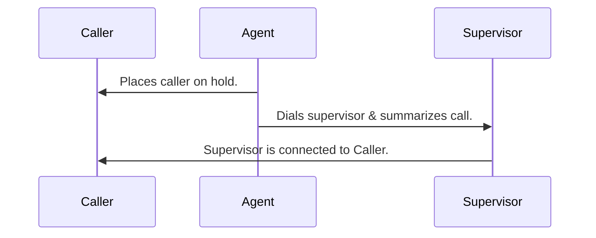
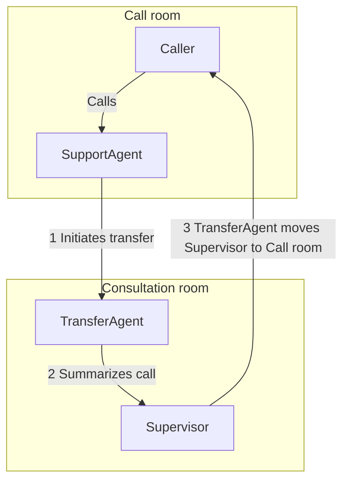

LiveKit Docs › Features › Transfers › Agent-assisted transfer

---

# Agent-assisted warm transfer

> How to transfer a call from an AI agent to a human operator while providing a contextual summary.

## Overview

A _warm transfer_ involves transferring a caller to another number or SIP endpoint, with an agent assisting in the process. During the transfer, the agent can provide a summary, pass along collected information, or other context about the call to the person the call is being transferred to. If the transferee is unavailable, the agent can return to the original caller, explain the situation, and either attempt another transfer or end the call. In this topic, the transferee is referred to as the _supervisor_ for example purposes.

## How it works

The following high-level steps occur during a warm transfer:

1. Caller is placed on hold.
2. Supervisor is dialed into a private consultation room.
3. Agent provides the supervisor with context about the call.
4. Supervisor is connected to the caller. The agent can optionally introduce them.
5. Agent leaves, and the caller and supervisor continue the call.

This simplified process reflects how the caller experiences the transfer, as shown in the following sequence diagram:



While the caller experiences one agent, it's best to use a workflow to orchestrate the different stages of the transfer while maintaining a clean user experience. The following sections describe the required setup for warm transfer in detail.

## Telephony setup

In order for your agent to transfer calls to another number, you must have an [outbound trunk](https://docs.livekit.io/sip/trunk-outbound.md). If you also want to receive calls, you need an [inbound trunk](https://docs.livekit.io/sip/trunk-inbound.md) and a [dispatch rule](https://docs.livekit.io/sip/dispatch-rules.md). For SIP trunking provider instructions, see [SIP trunk setup](https://docs.livekit.io/sip/quickstarts/configuring-sip-trunk.md).

> 💡 **Testing warm transfer**
> 
> You can test warm transfer functionality using the [Agent Playground](https://docs.livekit.io/agents/start/playground.md). Speak to your agent and request a transfer. Outbound trunking is _required_ to make the call to the supervisor. However, inbound call support can be added at any time.

## Agent set up

You need two agent sessions to complete a warm transfer. For warm transfer, each session is a private [room](https://docs.livekit.io/home/get-started/api-primitives.md#room) for communicating individually with the caller and the supervisor, before connecting them. This is different from the more common multi-agent use case, where different agents are coordinated within a single session.

The first session is the caller's session. This agent speaks with the caller and initiates the transfer. In the rest of this topic, this agent is referred to as `SupportAgent`. This agent is responsible for identifying when the caller wants to be transferred and initiating the transfer process.

The second session is the supervisor's session. This session is configured for a specific purpose: Providing a summary to the supervisor and connecting them with the caller. In this topic, an agent named `TransferAgent` is used for this purpose.

## Session management

A custom session management class is required to track state across calls and participants, and for methods for managing the transfer workflow.

The following are some example states that identify what is happening in the call for each user participant:

- Caller: `active`, `escalated`, `inactive`
- Supervisor: `inactive`, `summarizing`, `merged`, `failed`

Session management methods can be used by both agents and can include the following examples:

- Placing the caller on hold.
- Playing hold music.
- Creating a consultation room for the transfer agent.
- Moving the supervisor into the caller's room.
- Returning to the caller if the supervisor is unavailable.

## Warm transfer workflow

The following diagram shows the detailed workflow for a warm transfer.



1. Initiating the transfer process requires multiple steps:

- Place caller on hold.
- Create the consultation room
- Create `TransferAgent`, passing the conversation history.
- Call the supervisor.
2. `TransferAgent` summarizes the call to the supervisor. You can customize what information the agent provides about the call and caller for your specific use case.
3. After the supervisor is informed, the `TransferAgent` moves the supervisor to the call room. At this point, the `SupportAgent` can provide an introduction between the caller and supervisor.
4. The `TransferAgent` leaves the consultation room and the `SupportAgent` leaves the call room, leaving the caller and supervisor to continue the call.

### Step 1: Initiate transfer process

Initiating the transfer involves multiple sub-steps:

- Place caller on hold.
- Generate a token for the `TransferAgent` to join the consultation room.
- Create the consultation room.
- Connect the `TransferAgent` to the consultation room.
- Dial the supervisor.

#### Place caller on hold

The first step in the transfer process is to place the caller on hold. This means disabling audio input and output for the caller, and optionally playing hold music.

**Python**:

```python
# customer_session is the AgentSession for the initial call
customer_session.input.set_audio_enabled(False)
customer_session.output.set_audio_enabled(False)

```

---

**Node.js**:

```typescript
// customerSession is the AgentSession for the initial call
customerSession.input.setAudioEnabled(false);
customerSession.output.setAudioEnabled(false);

```

To play hold music in Python, see [Background audio](https://docs.livekit.io/agents/build/audio.md#background-audio). In Node.js, see [Publishing local audio files](https://docs.livekit.io/home/client/tracks/raw-tracks.md#publishing-local-audio-files).

#### Token generation

The `TransferAgent` needs a token to join the consultation room. Generate a token with the appropriate permissions:

**Python**:

```python
from livekit import api

# Name of the room where the agent consults with the transferee.
consult_room_name = "consult-room"
# Transfer agent identity
transfer_agent_identity = "transfer-agent"

# Assumes the api_key and api_secret are set in environment variables
access_token = (
    api.AccessToken()
    .with_identity(transfer_agent_identity)
    .with_grants(
        api.VideoGrants(
            room_join=True,
            room=consult_room_name,
            can_update_own_metadata=True,
            can_publish=True,
            can_subscribe=True,
        )
    )
)
token = access_token.to_jwt()

```

---

**Node.js**:

```typescript
import { AccessToken, VideoGrant } from 'livekit-server-sdk';

// Name of the room where the agent consults with the transferee.   
const consultRoomName = 'consult-room';
// Transfer agent identity
const transferAgentIdentity = 'transfer-agent';

// Assumes the api_key and api_secret are set in environment variables
const accessToken = new AccessToken('','',
  { identity: transferAgentIdentity, }
);

const videoGrant: VideoGrant = { 
  room: consultRoomName,
  roomJoin: true,
  canPublish: true,
  canSubscribe: true,
  canUpdateOwnMetadata: true,
};

accessToken.addGrant(videoGrant);

const token = await accessToken.toJwt();

```

To learn more about authentication tokens, see [Authentication](https://docs.livekit.io/home/get-started/authentication.md).

#### Create the consultation room

Use `rtc.Room` to create the consultation room:

**Python**:

```python
from livekit import rtc

consult_room = rtc.Room()

```

---

**Node.js**:

Install the `@livekit/rtc-node` package:

```bash
pnpm add @livekit/rtc-node

```

Then import the `Room` module and create a room:

```typescript
import { Room } from '@livekit/rtc-node';

const consultRoom = new Room();

```

#### Connect the `TransferAgent` to the consultation room

Use the token you generated to connect the `TransferAgent` to the consultation room:

**Python**:

```python
import os

consult_room.connect(os.getenv("LIVEKIT_URL"), token)

```

---

**Node.js**:

```typescript
import dotenv from 'dotenv';

dotenv.config();

consultRoom.connect(process.env.LIVEKIT_URL, token);

```

#### Call the supervisor

After you create the consultation room, and connect the `TransferAgent` to it, call the supervisor to add them to the room. Use the `CreateSIPParticipant` API to dial the supervisor. Set the SIP outbound trunk ID and supervisor contact number. The `room_name` is the name of the consultation room you used when you created the authentication token, and the `participant_identity` is the identity of the supervisor.

**Python**:

`ctx.api` in the following example, is the `LiveKitAPI` object in the job context.

```python
from livekit import api

SIP_TRUNK_ID = "<outbound-trunk-id>"
SUPERVISOR_CONTACT = "<supervisor-contact-number>"

await ctx.api.sip.create_sip_participant(
    api.CreateSIPParticipantRequest(
        sip_trunk_id=SIP_TRUNK_ID,
        sip_call_to=SUPERVISOR_CONTACT,
        room_name=consult-room-name
        participant_identity="Supervisor",
        wait_until_answered=True,
    )
)


```

---

**Node.js**:

The following example assumes the LiveKit URL, API key, and secret are set as environment variables.

```typescript
import { SipClient } from 'livekit-server-sdk';
import dotenv from 'dotenv';

dotenv.config();

const sipTrunkID = "<outbound-trunk-id>";
const supervisorContact = "<supervisor-contact-number>";

const sipClient = new SipClient(process.env.LIVEKIT_URL!,
                                process.env.LIVEKIT_API_KEY!,
                                process.env.LIVEKIT_API_SECRET!);

await sipClient.createSIPParticipant(sipTrunkID, supervisorContact, consultRoomName, {
    participantIdentity: "Supervisor",
    waitUntilAnswered: true
});

```

### Step 2: Summarize the call

In order to summarize the call, the `TransferAgent` needs to get the conversation history from the `SupportAgent`. To do this, pass the conversation history when you create `TransferAgent`:

**Python**:

```python
class TransferAgent(Agent):
    def __init__(self, prev_ctx: llm.ChatContext) -> None:
        prev_convo = ""
        context_copy = prev_ctx.copy(
            exclude_empty_message=True, exclude_instructions=True, exclude_function_call=True
        )
        for msg in context_copy.items:
            if msg.role == "user":
                prev_convo += f"Customer: {msg.text_content}\n"
            else:
                prev_convo += f"Assistant: {msg.text_content}\n"

        # Include the conversation history in the instructions
        super().__init__(
            instructions=(
                f"You are a supervisor who can summarize the call. "
                f"Here is the conversation history: {prev_convo}"
            ),
            # ...
        )    
    # ...

```

---

**Node.js**:

```typescript
class TransferAgent extends voice.Agent {
  constructor(prevCtx: llm.ChatContext) {
    const ctxCopy = prevCtx.copy(
      excludeEmptyMessage: true,
      excludeInstructions: true,
      excludeFunctionCall: true
    );
    const prevConvo = "";
    try { 
    for (const msg of ctxCopy.items) {
      if (msg.role === "user") {
        prevConvo += `Customer: ${msg.text_content}\n`;
      } else {
        prevConvo += `Assistant: ${msg.text_content}\n`;
      }
    }
    } catch (error) {
      console.error("Error copying chat context:", error);

    }
    super({
      instructions: `You are a supervisor who can summarize the call. Here is the conversation history: ${prevConvo}`,
      // ...
    });
  }
}

```

Create the `TransferAgent` with the conversation history:

**Python**:

```python
supervisor_agent = TransferAgent(prev_ctx=self.customer_session.chat_ctx)

```

---

**Node.js**:

```typescript
supervisor_agent = new TransferAgent(prevCtx=self.customer_session.chatCtx);

```

### Step 3: Move the supervisor to the call room

After the `TransferAgent` summarizes the call, and the supervisor is ready to talk to the customer, use the `MoveParticipant` API to move the supervisor to the call room where the caller is on hold.

**Python**:

```python
from livekit import api

await ctx.api.room.move_participant(
  api.MoveParticipantRequest(
    room="<CONSULT_ROOM_NAME>",
    identity="<SUPERVISOR_IDENTITY>",
    destination_room="<CUSTOMER_ROOM_NAME>",
  )
)

```

---

**Node.js**:

```typescript
import { RoomService } from 'livekit-server-sdk';

roomService.moveParticipant(consultRoomName, supervisorIdentity, customerRoomName);

```

After the supervisor is in the call room, the `SupportAgent` can provide an introduction between the caller and supervisor before disconnecting from the room.

### Step 4: Disconnect agents from rooms

You can disconnect the `TransferAgent` before you move the supervisor to the call room. The `SupportAgent` can leave when the supervisor is moved into the call room, or after providing an introduction.

To learn more, see [Disconnecting the agent](https://docs.livekit.io/agents/worker/job.md#disconnecting-the-agent).

## Example

For a full Python example, see the following.

- **[Warm Transfer](https://github.com/livekit/agents/tree/main/examples/warm-transfer)**: Transfer calls from an AI agent to a human operator with context.

## Additional workflow scenarios

You can customize a call's workflow based on the consultation with the supervisor. For example, the supervisor might decide not to take the escalation and provide a reason for the denial. The agent can then inform the caller the reason for the denial. Alternatively, the supervisor might inform the agent the caller should be transferred to a different supervisor or department. The agent can pass that information back to the caller and start a new transfer process.

You can choose to use both warm and [cold transfer](https://docs.livekit.io/sip/transfer-cold.md) depending on the context of the call. If a caller requests to be transferred directly to a specific person or department, the agent can inform the caller they are initiating the transfer, then transfer the caller directly using the SIP REFER method. In that case, the agent isn't involved after they initiate the transfer.

## Server API references

To learn more about the server APIs used for warm transfer, see the following reference topics:

- [Creating a token](https://docs.livekit.io/home/get-started/authentication.md#creating-a-token)
- [Create a room](https://docs.livekit.io/home/server/managing-rooms.md#create-a-room)
- [CreateSIPParticipant](https://docs.livekit.io/sip/api.md#createsipparticipant)
- [MoveParticipant](https://docs.livekit.io/home/server/managing-participants.md#moveparticipant)

---


For the latest version of this document, see [https://docs.livekit.io/sip/transfer-warm.md](https://docs.livekit.io/sip/transfer-warm.md).

To explore all LiveKit documentation, see [llms.txt](https://docs.livekit.io/llms.txt).