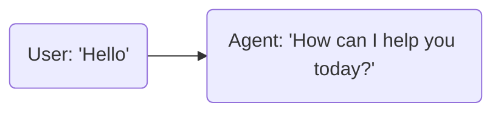
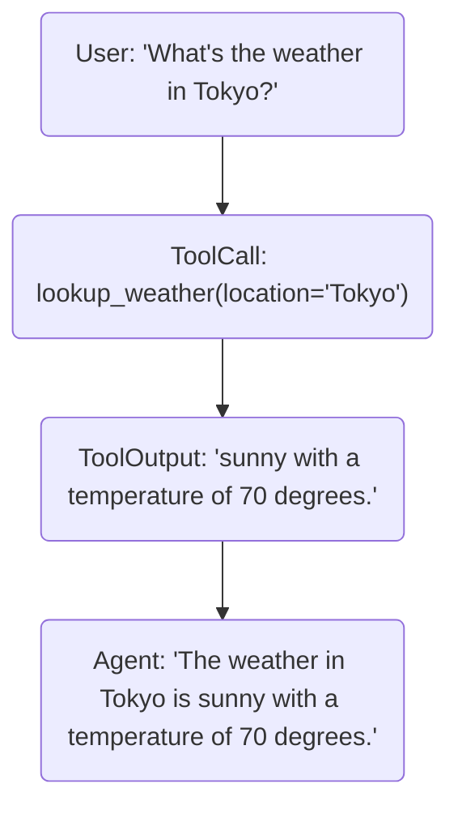
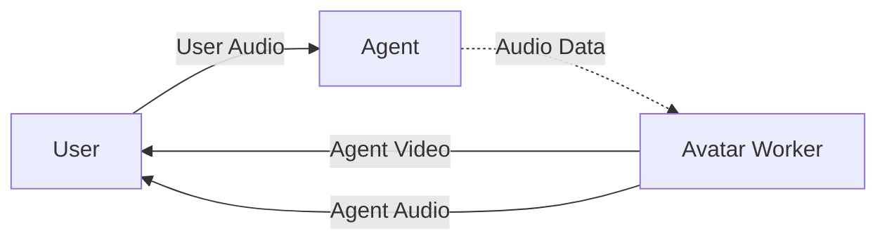

# LiveKit Docs

> LiveKit is an open source platform for developers building realtime media applications. It makes it easy to integrate audio, video, text, data, and AI models while offering scalable realtime infrastructure built on top of WebRTC.

## Overview

LiveKit contains these primary components:

- [Open source WebRTC SFU](https://github.com/livekit/livekit), with a hosted global mesh version available as [LiveKit Cloud](https://cloud.livekit.io)
- [Open source AI Agents Framework](https://github.com/livekit/agents) for building realtime and Voice AI agents in Python (Node.js beta also [available](https://github.com/livekit/agents-js))
- [Realtime SDKs](https://docs.livekit.io/home/client/connect.md) to make it easy to add realitme audio, video, and data to your apps (available for Web, iOS, Android, Flutter, React Native, Unity, Python, Node.js, Rust, and more))
- [Telephony integration](https://docs.livekit.io/sip.md) built on SIP for integrating telephony into LiveKit rooms

For greater detail, see [Intro to LiveKit](https://docs.livekit.io/home/get-started/intro-to-livekit.md).

The following document contains the full content of all LiveKit documentation pages.

## Home

### Get Started

---

## Intro to LiveKit

LiveKit is an open source platform for developers building realtime media applications. It makes it easy to integrate audio, video, text, data, and AI models while offering scalable realtime infrastructure built on top of WebRTC.

## Why choose LiveKit?

LiveKit provides a complete solution for realtime applications with several key advantages:

- **Developer-friendly**: Consistent APIs across platforms with comprehensive and well-documented SDKs.
- **Open source**: No vendor lock-in with complete transparency and flexibility.
- **AI-native**: First-class support for integrating AI models into realtime experiences.
- **Scalable**: Can support anywhere from a handful of users to thousands of concurrent participants, or more.
- **Deployment flexibility**: Choose between fully-managed cloud or self-hosted options.
- **Private and secure**: End-to-end encryption, HIPAA-compliance, and more.
- **Built on WebRTC**: The most robust realtime media protocol for peak performance in any network condition.

### What is WebRTC?

[WebRTC](https://developer.mozilla.org/en-US/docs/Web/API/WebRTC_API) provides significant advantages over other options for building realtime applications such as websockets.

- **Optimized for media**: Purpose-built for audio and video with advanced codecs and compression algorithms.
- **Network resilient**: Performs reliably even in challenging network conditions due to UDP, adaptive bitrate, and more.
- **Broad compatibility**: Natively supported in all modern browsers.

LiveKit handles all of the complexity of running production-grade WebRTC infrastructure while extending support to mobile apps, backends, and telephony.

## LiveKit ecosystem

The LiveKit platform consists of these core components:

- **LiveKit Server**: An open-source media server that enables realtime communication between participants. Use LiveKit's fully-managed global cloud, or self-host your own.
- **LiveKit SDKs**: Full-featured web, native, and backend SDKs that make it easy to join rooms and publish and consume realtime media and data.
- **LiveKit Agents**: A framework for building realtime multimodal AI agents, with an extensive collection of plugins for nearly every AI provider.
- **Telephony**: A flexible SIP integration for inbound or outbound calling into any LiveKit room or agent session.
- **Egress**: Record and export realtime media from LiveKit rooms.
- **Ingress**: Ingest external streams (such as RTMP and WHIP) into LiveKit rooms.
- **Server APIs**: A REST API for managing rooms, and more. Includes SDKs and a CLI.

## Deployment options

LiveKit offers two deployment options for LiveKit Server to fit your needs:

- **LiveKit Cloud**: A fully-managed, globally distributed service with automatic scaling and high reliability. Trusted by companies of all sizes, from startups to enterprises.
- **Self-hosted**: Run the open source LiveKit server on your own infrastructure for maximum control and customization.

Both options provide the same core platform features and use the same SDKs.

## What can you build with LiveKit?

- **AI assistants**: Voice and video agents powered by any AI model.
- **Video conferencing**: Secure, private meetings for teams of any size.
- **Interactive livestreaming**: Broadcast to audiences with realtime engagement.
- **Robotics**: Integrate realtime video and powerful AI models into real-world devices.
- **Healthcare**: HIPAA-compliant telehealth with AI and humans in the loop.
- **Customer service**: Flexible and observable web, mobile, and telephone support options.

Whatever your use case, LiveKit makes it easy to build innovative, intelligent realtime applications without worrying about scaling media infrastructure. [Get started with LiveKit today](https://docs.livekit.io/home.md).

---

---

## Rooms, participants, and tracks

## Overview

LiveKit has only three core constructs: a room, participant, and track. A room is simply a realtime session between one or more participants. A participant can publish one or more tracks and/or subscribe to one or more tracks from another participant.

## Room

A `Room` is a container object representing a LiveKit session.

Each participant in a room receives updates about changes to other participants in the same room. For example, when a participant adds, removes, or modifies the state (for example, mute) of a track, other participants are notified of this change. This is a powerful mechanism for synchronizing state and fundamental to building any realtime experience.

A room can be created manually via [server API](https://docs.livekit.io/home/server/managing-rooms.md#create-a-room), or automatically, when the first participant joins it. Once the last participant leaves a room, it closes after a short delay.

## Participant

A `Participant` is a user or process that is participating in a realtime session. They are represented by a unique developer-provided `identity` and a server-generated `sid`. A participant object also contains metadata about its state and tracks they've published.

> ❗ **Important**
> 
> A participant's identity is unique per room. Thus, if participants with the same identity join a room, only the most recent one to join will remain; the server automatically disconnects other participants using that identity.

There are two kinds of participant objects in the SDKs:

- A `LocalParticipant` represents the current user who, by default, can publish tracks in a room.
- A `RemoteParticipant` represents a remote user. The local participant, by default, can subscribe to any tracks published by a remote participant.

A participant may also [exchange data](https://docs.livekit.io/home/client/data.md) with one or many other participants.

### Participant fields

| Field | Type | Description |
| sid | string | A UID for this particular participant, generated by LiveKit server. |
| identity | string | Unique identity of the participant, as specified when connecting. |
| name | string | Optional display name. |
| state | ParticipantInfo.State | JOINING, JOINED, ACTIVE, or DISCONNECTED. |
| kind | ParticipantInfo.Kind | The type of participant; more below. |
| attributes | string | User-specified [attributes](https://docs.livekit.io/home/client/data.md) for the participant. |
| permission | ParticipantInfo.Permission | Permissions granted to the participant. |

### Types of participants

In a realtime session, a participant could represent an end-user, as well as a server-side process. It's possible to distinguish between them with the `kind` field:

- `STANDARD`: A regular participant, typically an end-user in your application.
- `AGENT`: An agent spawned with the [Agents framework](https://docs.livekit.io/agents.md).
- `SIP`: A telephony user connected via [SIP](https://docs.livekit.io/sip.md).
- `EGRESS`: A server-side process that is recording the session using [LiveKit Egress](https://docs.livekit.io/home/egress/overview.md).
- `INGRESS`: A server-side process that is ingesting media into the session using [LiveKit Ingress](https://docs.livekit.io/home/ingress/overview.md).

## Track

A `Track` represents a stream of information, be it audio, video or custom data. By default, a participant in a room may publish tracks, such as their camera or microphone streams and subscribe to one or more tracks published by other participants. In order to model a track which may not be subscribed to by the local participant, all track objects have a corresponding `TrackPublication` object:

- `Track`: a wrapper around the native WebRTC `MediaStreamTrack`, representing a playable track.
- `TrackPublication`: a track that's been published to the server. If the track is subscribed to by the local participant and available for playback locally, it will have a `.track` attribute representing the associated `Track` object.

We can now list and manipulate tracks (via track publications) published by other participants, even if the local participant is not subscribed to them.

### TrackPublication fields

A `TrackPublication` contains information about its associated track:

| Field | Type | Description |
| sid | string | A UID for this particular track, generated by LiveKit server. |
| kind | Track.Kind | The type of track, whether it be audio, video or arbitrary data. |
| source | Track.Source | Source of media: Camera, Microphone, ScreenShare, or ScreenShareAudio. |
| name | string | The name given to this particular track when initially published. |
| subscribed | boolean | Indicates whether or not this track has been subscribed to by the local participant. |
| track | Track | If the local participant is subscribed, the associated `Track` object representing a WebRTC track. |
| muted | boolean | Whether this track is muted or not by the local participant. While muted, it won't receive new bytes from the server. |

### Track subscription

When a participant is subscribed to a track (which hasn't been muted by the publishing participant), they continuously receive its data. If the participant unsubscribes, they stop receiving media for that track and may resubscribe to it at any time.

When a participant creates or joins a room, the `autoSubscribe` option is set to `true` by default. This means the participant automatically subscribes to all existing tracks being published and any track published in the future. For more fine-grained control over track subscriptions, you can set `autoSubscribe` to `false` and instead use [selective subscriptions](https://docs.livekit.io/home/client/receive.md#selective-subscription).

> ℹ️ **Note**
> 
> For most use cases, muting a track on the publisher side or unsubscribing from it on the subscriber side is typically recommended over unpublishing it. Publishing a track requires a negotiation phase and consequently has worse time-to-first-byte performance.

---

---

## Authentication

## Overview

For a LiveKit SDK to successfully connect to the server, it must pass an access token with the request.

This token encodes the identity of a participant, name of the room, capabilities and permissions. Access tokens are JWT-based and signed with your API secret to prevent forgery.

Access tokens also carry an expiration time, after which the server will reject connections with that token. Note: expiration time only impacts the initial connection, and not subsequent reconnects.

## Creating a token

**LiveKit CLI**:

```bash
lk token create \
  --api-key <KEY> \
  --api-secret <SECRET> \
  --identity <NAME> \
  --room <ROOM_NAME> \
  --join \
  --valid-for 1h

```

---

**Node.js**:

```typescript
import { AccessToken, VideoGrant } from 'livekit-server-sdk';

const roomName = 'name-of-room';
const participantName = 'user-name';

const at = new AccessToken('api-key', 'secret-key', {
  identity: participantName,
});

const videoGrant: VideoGrant = {
  room: roomName,
  roomJoin: true,
  canPublish: true,
  canSubscribe: true,
};

at.addGrant(videoGrant);

const token = await at.toJwt();
console.log('access token', token);

```

---

**Go**:

```go
import (
  "time"

  "github.com/livekit/protocol/auth"
)

func getJoinToken(apiKey, apiSecret, room, identity string) (string, error) {
  canPublish := true
  canSubscribe := true

  at := auth.NewAccessToken(apiKey, apiSecret)
  grant := &auth.VideoGrant{
    RoomJoin:     true,
    Room:         room,
    CanPublish:   &canPublish,
    CanSubscribe: &canSubscribe,
  }
  at.SetVideoGrant(grant).
     SetIdentity(identity).
     SetValidFor(time.Hour)

  return at.ToJWT()
}

```

---

**Ruby**:

```ruby
require 'livekit'

token = LiveKit::AccessToken.new(api_key: 'yourkey', api_secret: 'yoursecret')
token.identity = 'participant-identity'
token.name = 'participant-name'
token.video_grant=(LiveKit::VideoGrant.from_hash(roomJoin: true,
                                                 room: 'room-name'))

puts token.to_jwt

```

---

**Java**:

```java
import io.livekit.server.*;

public String createToken() {
  AccessToken token = new AccessToken("apiKey", "secret");
  token.setName("participant-name");
  token.setIdentity("participant-identity");
  token.setMetadata("metadata");
  token.addGrants(new RoomJoin(true), new Room("room-name"));

  return token.toJwt();
}

```

---

**Python**:

```python
from livekit import api
import os

token = api.AccessToken(os.getenv('LIVEKIT_API_KEY'), os.getenv('LIVEKIT_API_SECRET')) \
    .with_identity("identity") \
    .with_name("name") \
    .with_grants(api.VideoGrants(
        room_join=True,
        room="my-room",
    )).to_jwt()

```

---

**Rust**:

```rust
use livekit_api::access_token;
use std::env;

fn create_token() -> Result<String, AccessTokenError> {
   let api_key = env::var("LIVEKIT_API_KEY").expect("LIVEKIT_API_KEY is not set");
   let api_secret = env::var("LIVEKIT_API_SECRET").expect("LIVEKIT_API_SECRET is not set");

   let token = access_token::AccessToken::with_api_key(&api_key, &api_secret)
      .with_identity("identity")
      .with_name("name")
      .with_grants(access_token::VideoGrants {
         room_join: true,
         room: "my-room".to_string(),
         ..Default::default()
      })
      .to_jwt();
   return token
}

```

---

**Other**:

For other platforms, you can either implement token generation yourself or use the `lk` command.

Token signing is fairly straight forward, see [JS implementation](https://github.com/livekit/node-sdks/blob/main/packages/livekit-server-sdk/src/AccessToken.ts) as a reference.

LiveKit CLI is available at [https://github.com/livekit/livekit-cli](https://github.com/livekit/livekit-cli)

### Token example

Here's an example of the decoded body of a join token:

```json
{
  "exp": 1621657263,
  "iss": "APIMmxiL8rquKztZEoZJV9Fb",
  "sub": "myidentity",
  "nbf": 1619065263,
  "video": {
    "room": "myroom",
    "roomJoin": true
  },
  "metadata": ""
}

```

| field | description |
| exp | Expiration time of token |
| nbf | Start time that the token becomes valid |
| iss | API key used to issue this token |
| sub | Unique identity for the participant |
| metadata | Participant metadata |
| attributes | Participant attributes (key/value pairs of strings) |
| video | Video grant, including room permissions (see below) |
| sip | SIP grant |

## Video grant

Room permissions are specified in the `video` field of a decoded join token. It may contain one or more of the following properties:

| field | type | description |
| roomCreate | bool | Permission to create or delete rooms |
| roomList | bool | Permission to list available rooms |
| roomJoin | bool | Permission to join a room |
| roomAdmin | bool | Permission to moderate a room |
| roomRecord | bool | Permissions to use Egress service |
| ingressAdmin | bool | Permissions to use Ingress service |
| room | string | Name of the room, required if join or admin is set |
| canPublish | bool | Allow participant to publish tracks |
| canPublishData | bool | Allow participant to publish data to the room |
| canPublishSources | string[] | Requires `canPublish` to be true. When set, only listed source can be published. (camera, microphone, screen_share, screen_share_audio) |
| canSubscribe | bool | Allow participant to subscribe to tracks |
| canUpdateOwnMetadata | bool | Allow participant to update its own metadata |
| hidden | bool | Hide participant from others in the room |
| kind | string | Type of participant (standard, ingress, egress, sip, or agent). this field is typically set by LiveKit internals. |

### Example: subscribe-only token

To create a token where the participant can only subscribe, and not publish into the room, you would use the following grant:

```json
{
  ...
  "video": {
    "room": "myroom",
    "roomJoin": true,
    "canSubscribe": true,
    "canPublish": false,
    "canPublishData": false
  }
}

```

### Example: camera-only

Allow the participant to publish camera, but disallow other sources

```json
{
  ...
  "video": {
    "room": "myroom",
    "roomJoin": true,
    "canSubscribe": true,
    "canPublish": true,
    "canPublishSources": ["camera"]
  }
}

```

## SIP grant

In order to interact with the SIP service, permission must be granted in the `sip` field of the JWT. It may contain the following properties:

| field | type | description |
| admin | bool | Permission to manage SIP trunks and dispatch rules. |
| call | bool | Permission to make SIP calls via `CreateSIPParticipant`. |

### Creating a token with SIP grants

**Node.js**:

```typescript
import { AccessToken, SIPGrant, VideoGrant } from 'livekit-server-sdk';

const roomName = 'name-of-room';
const participantName = 'user-name';

const at = new AccessToken('api-key', 'secret-key', {
  identity: participantName,
});

const sipGrant: SIPGrant = { 
  admin: true,
  call: true,
};  

const videoGrant: VideoGrant = { 
  room: roomName,
  roomJoin: true,
};  

at.addGrant(sipGrant);
at.addGrant(videoGrant);

const token = await at.toJwt();
console.log('access token', token);

```

---

**Go**:

```go
import (
  "time"

  "github.com/livekit/protocol/auth"
)

func getJoinToken(apiKey, apiSecret, room, identity string) (string, error) {

  at := auth.NewAccessToken(apiKey, apiSecret)

  videoGrant := &auth.VideoGrant{
    RoomJoin:     true,
    Room:         room,
  }

  sipGrant := &auth.SIPGrant{
    Admin:     true,
    Call:      true,
  }

  at.SetSIPGrant(sipGrant).
    SetVideoGrant(videoGrant).
    SetIdentity(identity).
    SetValidFor(time.Hour)

  return at.ToJWT()
}

```

---

**Ruby**:

```ruby
require 'livekit'

token = LiveKit::AccessToken.new(api_key: 'yourkey', api_secret: 'yoursecret')
token.identity = 'participant-identity'
token.name = 'participant-name'

token.video_grant=(LiveKit::VideoGrant.from_hash(roomJoin: true,
                                                 room: 'room-name'))
token.sip_grant=(LiveKit::SIPGrant.from_hash(admin: true, call: true))

puts token.to_jwt

```

---

**Java**:

```java
import io.livekit.server.*;

public String createToken() {
  AccessToken token = new AccessToken("apiKey", "secret");

  // Fill in token information.
  token.setName("participant-name");
  token.setIdentity("participant-identity");
  token.setMetadata("metadata");
 
  // Add room and SIP privileges.
  token.addGrants(new RoomJoin(true), new RoomName("room-name"));
  token.addSIPGrants(new SIPAdmin(true), new SIPCall(true));
  
  return token.toJwt();
}

```

---

**Python**:

```python
from livekit import api
import os

token = api.AccessToken(os.getenv('LIVEKIT_API_KEY'),
                        os.getenv('LIVEKIT_API_SECRET')) \
    .with_identity("identity") \
    .with_name("name") \
    .with_grants(api.VideoGrants(
        room_join=True,
        room="my-room")) \
    .with_sip_grants(api.SIPGrants(
        admin=True,
        call=True)).to_jwt()

```

---

**Rust**:

```rust
use livekit_api::access_token;
use std::env;

fn create_token() -> Result<String, access_token::AccessTokenError> {
    let api_key = env::var("LIVEKIT_API_KEY").expect("LIVEKIT_API_KEY is not set");
    let api_secret = env::var("LIVEKIT_API_SECRET").expect("LIVEKIT_API_SECRET is not set");

    let token = access_token::AccessToken::with_api_key(&api_key, &api_secret)
        .with_identity("rust-bot")
        .with_name("Rust Bot")
        .with_grants(access_token::VideoGrants {
             room_join: true,
             room: "my-room".to_string(),
             ..Default::default()
        })  
        .with_sip_grants(access_token::SIPGrants {
            admin: true,
            call: true
        })  
        .to_jwt();
    return token
}

```

## Room configuration

You can create an access token for a user that includes room configuration options. When a room is created for a user, the room is created using the configuration stored in the token. For example, you can use this to [explicitly dispatch an agent](https://docs.livekit.io/agents/worker/agent-dispatch.md) when a user joins a room.

For the full list of `RoomConfiguration` fields, see [RoomConfiguration](https://docs.livekit.io/reference/server/server-apis.md#roomconfiguration).

### Creating a token with room configuration

**Node.js**:

For a full example of explicit agent dispatch, see the [example](https://github.com/livekit/node-sdks/blob/main/examples/agent-dispatch/index.ts) in GitHub.

```typescript
import { AccessToken, SIPGrant, VideoGrant } from 'livekit-server-sdk';
import { RoomAgentDispatch, RoomConfiguration } from '@livekit/protocol';

const roomName = 'name-of-room';
const participantName = 'user-name';
const agentName = 'my-agent';

const at = new AccessToken('api-key', 'secret-key', {
  identity: participantName,
});

const videoGrant: VideoGrant = { 
  room: roomName,
  roomJoin: true,
};  

at.addGrant(videoGrant);
at.roomConfig = new RoomConfiguration (
  agents: [
    new RoomAgentDispatch({
      agentName: "test-agent",
      metadata: "test-metadata"
    })
  ]
);

const token = await at.toJwt();
console.log('access token', token);

```

---

**Go**:

```go
import (
  "time"

  "github.com/livekit/protocol/auth"
  "github.com/livekit/protocol/livekit"
)

func getJoinToken(apiKey, apiSecret, room, identity string) (string, error) {

  at := auth.NewAccessToken(apiKey, apiSecret)

  videoGrant := &auth.VideoGrant{
    RoomJoin:     true,
    Room:         room,
  }

  roomConfig := &livekit.RoomConfiguration{
    Agents: []*livekit.RoomAgentDispatch{{
      AgentName: "test-agent",
      Metadata:  "test-metadata",
    }}, 
  }

  at.SetVideoGrant(videoGrant).
    SetRoomConfig(roomConfig).
    SetIdentity(identity).
    SetValidFor(time.Hour)

  return at.ToJWT()
}

```

---

**Ruby**:

```ruby
require 'livekit'

token = LiveKit::AccessToken.new(api_key: 'yourkey', api_secret: 'yoursecret')
token.identity = 'participant-identity'
token.name = 'participant-name'

token.video_grant=(LiveKit::VideoGrant.new(roomJoin: true,
                                           room: 'room-name'))
token.room_config=(LiveKit::Proto::RoomConfiguration.new(
    max_participants: 10
    agents: [LiveKit::Proto::RoomAgentDispatch.new(
      agent_name: "test-agent",
      metadata: "test-metadata",
    )]
  )
)

puts token.to_jwt

```

---

**Python**:

For a full example of explicit agent dispatch, see the [example](https://github.com/livekit/python-sdks/blob/main/examples/agent_dispatch.py) in GitHub.

```python
from livekit import api
import os

token = api.AccessToken(os.getenv('LIVEKIT_API_KEY'),
                        os.getenv('LIVEKIT_API_SECRET')) \
    .with_identity("identity") \
    .with_name("name") \
    .with_grants(api.VideoGrants(
        room_join=True,
        room="my-room")) \
        .with_room_config(
            api.RoomConfiguration(
                agents=[
                    api.RoomAgentDispatch(
                        agent_name="test-agent", metadata="test-metadata"
                    )
                ],
            ),
        ).to_jwt()

```

---

**Rust**:

```rust
use livekit_api::access_token;
use std::env;

fn create_token() -> Result<String, access_token::AccessTokenError> {
    let api_key = env::var("LIVEKIT_API_KEY").expect("LIVEKIT_API_KEY is not set");
    let api_secret = env::var("LIVEKIT_API_SECRET").expect("LIVEKIT_API_SECRET is not set");

    let token = access_token::AccessToken::with_api_key(&api_key, &api_secret)
        .with_identity("rust-bot")
        .with_name("Rust Bot")
        .with_grants(access_token::VideoGrants {
             room_join: true,
             room: "my-room".to_string(),
             ..Default::default()
        })
        .with_room_config(livekit::RoomConfiguration {
            agents: [livekit::AgentDispatch{
              name: "my-agent"
            }]  
        })  
        .to_jwt();
    return token
}

```

## Token refresh

LiveKit server proactively issues refreshed tokens to connected clients, ensuring they can reconnect if disconnected. These refreshed access tokens have a 10-minute expiration.

Additionally, tokens are refreshed when there are changes to a participant's name, permissions or metadata.

## Updating permissions

A participant's permissions can be updated at any time, even after they've already connected. This is useful in applications where the participant's role could change during the session, such as in a participatory livestream.

It's possible to issue a token with `canPublish: false` initially, and then updating it to `canPublish: true` during the session. Permissions can be changed with the [UpdateParticipant](https://docs.livekit.io/home/server/managing-participants.md#updating-permissions) server API.

---

### CLI

---

## Installing CLI

## Install LiveKit CLI

**macOS**:

```text
brew update && brew install livekit-cli

```

---

**Linux**:

```text
curl -sSL https://get.livekit.io/cli | bash

```

> 💡 **Tip**
> 
> You can also download the latest precompiled binaries [here](https://github.com/livekit/livekit-cli/releases/latest).

---

**Windows**:

```text
winget install LiveKit.LiveKitCLI

```

> 💡 **Tip**
> 
> You can also download the latest precompiled binaries [here](https://github.com/livekit/livekit-cli/releases/latest).

---

**From Source**:

This repo uses [Git LFS](https://git-lfs.github.com/) for embedded video resources. Please ensure git-lfs is installed on your machine before proceeding.

```text
git clone github.com/livekit/livekit-cli
make install

```

`lk` is LiveKit's suite of CLI utilities. It lets you conveniently access server APIs, create tokens, and generate test traffic all from your command line. For more details, refer to the docs in the `livekit-cli` [GitHub repo](https://github.com/livekit/livekit-cli#usage).

## Authenticate with Cloud (optional)

For LiveKit Cloud users, you can authenticate the CLI with your Cloud project to create an API key and secret. This allows you to use the CLI without manually providing credentials each time.

```shell
lk cloud auth

```

Then, follow instructions and log in from a browser.

> 💡 **Tip**
> 
> If you're looking to explore LiveKit's [Agents](https://docs.livekit.io/agents.md) framework, or want to prototype your app against a prebuilt frontend or token server, check out [Sandboxes](https://docs.livekit.io/home/cloud/sandbox.md).

## Generate access token

A participant creating or joining a LiveKit [room](https://docs.livekit.io/home/concepts/api-primitives.md) needs an [access token](https://docs.livekit.io/home/concepts/authentication.md) to do so. For now, let’s generate one via CLI:

**Localhost**:

```shell
lk token create \
  --api-key devkey --api-secret secret \
  --join --room test_room --identity test_user \
  --valid-for 24h

```

> 💡 **Tip**
> 
> Make sure you're running LiveKit server locally in [dev mode](https://docs.livekit.io/home/self-hosting/local.md#dev-mode).

---

**Cloud**:

```shell
lk token create \
  --api-key <PROJECT_KEY> --api-secret <PROJECT_SECRET> \
  --join --room test_room --identity test_user \
  --valid-for 24h

```

Alternatively, you can [generate tokens from your project's dashboard](https://cloud.livekit.io/projects/p_/settings/keys).

## Test with LiveKit Meet

> 💡 **Tip**
> 
> If you're testing a LiveKit Cloud instance, you can find your `Project URL` (it starts with `wss://`) in the project settings.

Use a sample app, [LiveKit Meet](https://meet.livekit.io), to preview your new LiveKit instance. Enter the token you [previously generated](#generate-access-token) in the "Custom" tab. Once connected, your microphone and camera will be streamed in realtime to your new LiveKit instance (and any other participant who connects to the same room)!

If interested, here's the [full source](https://github.com/livekit-examples/meet) for this example app.

### Simulating another publisher

One way to test a multi-user session is by [generating](#generate-access-token) a second token (ensure `--identity` is unique), opening our example app in another [browser tab](https://meet.livekit.io) and connecting to the same room.

Another way is to use the CLI as a simulated participant and publish a prerecorded video to the room. Here's how:

**Localhost**:

```shell
lk room join \
  --url ws://localhost:7880 \
  --api-key devkey --api-secret secret \
  --publish-demo --identity bot_user \
  my_first_room

```

---

**Cloud**:

```shell
lk room join \
  --url <PROJECT_SECURE_WEBSOCKET_ADDRESS> \
  --api-key <PROJECT_API_KEY> --api-secret <PROJECT_SECRET_KEY> \
  --publish-demo --identity bot_user \
  my_first_room

```

This command publishes a looped demo video to `my-first-room`. Due to how the file was encoded, expect a short delay before your browser has sufficient data to render frames.

---

---

## Bootstrapping an application

> ℹ️ **Note**
> 
> Before starting, make sure you have created a Cloud account, [installed the LiveKit CLI](https://docs.livekit.io/home/cli/cli-setup.md), and have authenticated or manually configured your LiveKit project of choice.

The LiveKit CLI can help you bootstrap applications from a number of convenient template repositories, using your project credentials to set up required environment variables and other configuration automatically. To create an application from a template, run the following:

```shell
lk app create --template <template_name> my-app

```

Then follow the CLI prompts to finish your setup.

The `--template` flag may be omitted to see a list of all available templates, or can be chosen from a selection of our first-party templates:

| **Template Name** | **Language/Framework** | **Description** |
| [agent-starter-python](https://github.com/livekit-examples/agent-starter-python) | Python | A starter project for Python, featuring a simple voice agent implementation |
| [voice-assistant-frontend](https://github.com/livekit-examples/agent-starter-react) | TypeScript/Next.js | A starter app for Next.js, featuring a flexible voice AI frontend |
| [agent-starter-android](https://github.com/livekit-examples/agent-starter-android) | Kotlin/Android | A starter project for Android, featuring a flexible voice AI frontend |
| [agent-starter-swift](https://github.com/livekit-examples/agent-starter-swift) | Swift | A starter project for Swift, featuring a flexible voice AI frontend |
| [agent-starter-flutter](https://github.com/livekit-examples/agent-starter-flutter) | Flutter | A starter project for Flutter, featuring a flexible voice AI frontend |
| [agent-starter-react-native](https://github.com/livekit-examples/agent-starter-react-native) | React Native/Expo | A starter project for Expo, featuring a flexible voice AI frontend |
| [agent-starter-embed](https://github.com/livekit-examples/agent-starter-embed) | TypeScript/Next.js | A starter project for a flexible voice AI that can be embedded in any website |
| [token-server](https://github.com/livekit-examples/token-server-node) | Node.js/TypeScript | A hosted token server to help you prototype your mobile applications faster |
| [meet](https://github.com/livekit-examples/meet) | TypeScript/Next.js | An open source video conferencing app built on LiveKit Components and Next.js |
| [multi-agent-python](https://github.com/livekit-examples/multi-agent-python) | Python | A team of writing coach agents demonstrating multi-agent workflows |
| [outbound-caller-python](https://github.com/livekit-examples/outbound-caller-python) | Python | An agent that makes outbound calls using LiveKit SIP |

> 💡 **Tip**
> 
> If you're looking to explore LiveKit's [Agents](https://docs.livekit.io/agents.md) framework, or want to prototype your app against a prebuilt frontend or token server, check out [Sandboxes](https://docs.livekit.io/home/cloud/sandbox.md).

For more information on templates, see the [LiveKit Template Index](https://github.com/livekit-examples/index?tab=readme-ov-file).

---

### LiveKit SDKs

---

## Connecting to LiveKit

## Overview

Your application will connect to LiveKit using the `Room` object, which is the base construct in LiveKit. Think of it like a conference call — multiple participants can join a room and share realtime audio, video, and data with each other.

Depending on your application, each participant might represent a user, an AI agent, a connected device, or some other program you've created. There is no limit on the number of participants in a room and each participant can publish audio, video, and data to the room.

## Installing the LiveKit SDK

LiveKit includes open-source SDKs for every major platform including JavaScript, Swift, Android, React Native, Flutter, and Unity.

LiveKit also has SDKs for realtime backend apps in Python, Node.js, Go, and Rust. These are designed to be used with the [Agents framework](https://docs.livekit.io/agents.md) for realtime AI applications.

**JavaScript**:

Install the LiveKit SDK and optional React Components library:

```shell
npm install livekit-client @livekit/components-react @livekit/components-styles --save

```

The SDK is also available using `yarn` or `pnpm`.

Check out the dedicated quickstarts for [React](https://docs.livekit.io/home/quickstarts/react.md) or [Next.js](https://docs.livekit.io/home/quickstarts/nextjs.md) if you're using one of those platforms.

---

**Swift**:

Add the Swift SDK and the optional Swift Components library to your project using Swift Package Manager. The package URLs are:

- [https://github.com/livekit/client-sdk-swift](https://github.com/livekit/client-sdk-swift)
- [https://github.com/livekit/components-swift](https://github.com/livekit/components-swift)

See [Adding package dependencies to your app](https://developer.apple.com/documentation/xcode/adding-package-dependencies-to-your-app) for more details.

You must also declare camera and microphone permissions, if needed in your `Info.plist` file:

```xml
<dict>
...
<key>NSCameraUsageDescription</key>
<string>$(PRODUCT_NAME) uses your camera</string>
<key>NSMicrophoneUsageDescription</key>
<string>$(PRODUCT_NAME) uses your microphone</string>
...
</dict>

```

For more details, see the [Swift quickstart](https://docs.livekit.io/home/quickstarts/swift.md).

---

**Android**:

The LiveKit SDK and components library are available as Maven packages.

```groovy
dependencies {
  implementation "io.livekit:livekit-android:2.+"
  implementation "io.livekit:livekit-android-compose-components:1.+"
}

```

See the [releases page](https://github.com/livekit/client-sdk-android/releases) for information on the latest version of the SDK.

You'll also need JitPack as one of your repositories. In your `settings.gradle` file:

```groovy
dependencyResolutionManagement {
    repositories {
        //...
        maven { url 'https://jitpack.io' }
    }
}

```

---

**React Native**:

Install the React Native SDK with NPM:

```shell
npm install @livekit/react-native @livekit/react-native-webrtc livekit-client

```

Check out the dedicated quickstart for [Expo](https://docs.livekit.io/home/quickstarts/expo.md) or [React Native](https://docs.livekit.io/home/quickstarts/react-native.md) for more details.

---

**Flutter**:

Install the latest version of the Flutter SDK and components library.

```shell
flutter pub add livekit_client livekit_components

```

You'll also need to declare camera and microphone permissions. See the [Flutter quickstart](https://docs.livekit.io/home/quickstarts/flutter.md) for more details.

If your SDK is not listed above, check out the full list of [platform-specific quickstarts](https://docs.livekit.io/home/quickstarts.md) and [SDK reference docs](https://docs.livekit.io/reference.md) for more details.

## Connecting to a room

Rooms are identified by their name, which can be any unique string. The room itself is created automatically when the first participant joins, and is closed when the last participant leaves.

You must use a participant identity when you connect to a room. This identity can be any string, but must be unique to each participant.

Connecting to a room always requires two parameters:

- `wsUrl`: The WebSocket URL of your LiveKit server.- LiveKit Cloud users can find theirs on the [Project Settings page](https://cloud.livekit.io/projects/p_/settings/project).
- Self-hosted users who followed [this guide](https://docs.livekit.io/home/self-hosting/local.md) can use `ws://localhost:7880` while developing.
- `token`: A unique [access token](https://docs.livekit.io/concepts/authentication.md) which each participant must use to connect.- The token encodes the room name, the participant's identity, and their permissions.
- For help generating tokens, see [this guide](https://docs.livekit.io/home/server/generating-tokens.md).

**JavaScript**:

```js
const room = new Room();
await room.connect(wsUrl, token);

```

---

**React**:

```js
<LiveKitRoom audio={true} video={true} token={token} serverUrl={wsUrl}>
  <!-- your components here -->
</LiveKitRoom>

```

---

**Swift**:

```swift
RoomScope(url: wsURL, token: token, connect: true, enableCamera: true) {
  // your components here
}

```

---

**Android**:

```kotlin
RoomScope(
  url = wsURL,
  token = token,
  audio = true,
  video = true,
  connect = true,
) {
  // your components here
}

```

---

**React Native**:

```js
<LiveKitRoom audio={true} video={true} token={token} serverUrl={wsUrl}>
  <!-- your components here -->
</LiveKitRoom>

```

---

**Flutter**:

```dart
final room = Room();
await room.connect(wsUrl, token);

```

Upon successful connection, the `Room` object will contain two key attributes: a `localParticipant` object, representing the current user, and `remoteParticipants`, an array of other participants in the room.

Once connected, you can [publish](https://docs.livekit.io/home/client/tracks/publish.md) and [subscribe](https://docs.livekit.io/home/client/tracks/subscribe.md) to realtime media tracks or [exchange data](https://docs.livekit.io/home/client/data.md) with other participants.

LiveKit also emits a number of events on the `Room` object, such as when new participants join or tracks are published. For details, see [Handling Events](https://docs.livekit.io/home/client/events.md).

## Disconnection

Call `Room.disconnect()` to leave the room. If you terminate the application without calling `disconnect()`, your participant disappears after 15 seconds.

> ℹ️ **Note**
> 
> On some platforms, including JavaScript and Swift, `Room.disconnect` is called automatically when the application exits.

### Automatic disconnection

Participants might get disconnected from a room due to server-initiated actions. This can happen if the room is closed using the [DeleteRoom](https://docs.livekit.io/home/server/managing-rooms.md#Delete-a-room) API or if a participant is removed with the [RemoveParticipant](https://docs.livekit.io/home/server/managing-participants.md#remove-a-participant) API.

In such cases, a `Disconnected` event is emitted, providing a reason for the disconnection. Common [disconnection reasons](https://github.com/livekit/protocol/blob/main/protobufs/livekit_models.proto#L333) include:

- DUPLICATE_IDENTITY: Disconnected because another participant with the same identity joined the room.
- ROOM_DELETED: The room was closed via the `DeleteRoom` API.
- PARTICIPANT_REMOVED: Removed from the room using the `RemoveParticipant` API.
- JOIN_FAILURE: Failure to connect to the room, possibly due to network issues.
- ROOM_CLOSED: The room was closed because all [Standard and Ingress participants](https://docs.livekit.io/home/get-started/api-primitives.md#types-of-participants) left.

## Connection reliability

LiveKit enables reliable connectivity in a wide variety of network conditions. It tries the following WebRTC connection types in descending order:

1. ICE over UDP: ideal connection type, used in majority of conditions
2. TURN with UDP (3478): used when ICE/UDP is unreachable
3. ICE over TCP: used when network disallows UDP (i.e. over VPN or corporate firewalls)
4. TURN with TLS: used when firewall only allows outbound TLS connections

**Cloud**:

LiveKit Cloud supports all of the above connection types. TURN servers with TLS are provided and maintained by LiveKit Cloud.

---

**Self-hosted**:

ICE over UDP and TCP works out of the box, while TURN requires additional configurations and your own SSL certificate.

### Network changes and reconnection

With WiFi and cellular networks, users may sometimes run into network changes that cause the connection to the server to be interrupted. This could include switching from WiFi to cellular or going through spots with poor connection.

When this happens, LiveKit will attempt to resume the connection automatically. It reconnects to the signaling WebSocket and initiates an [ICE restart](https://developer.mozilla.org/en-US/docs/Web/API/WebRTC_API/Session_lifetime#ice_restart) for the WebRTC connection. This process usually results in minimal or no disruption for the user. However, if media delivery over the previous connection fails, users might notice a temporary pause in video, lasting a few seconds, until the new connection is established.

In scenarios where an ICE restart is not feasible or unsuccessful, LiveKit will execute a full reconnection. As full reconnections take more time and might be more disruptive, a `Reconnecting` event is triggered. This allows your application to respond, possibly by displaying a UI element, during the reconnection process.

This sequence goes like the following:

1. `ParticipantDisconnected` fired for other participants in the room
2. If there are tracks unpublished, you will receive `LocalTrackUnpublished` for them
3. Emits `Reconnecting`
4. Performs full reconnect
5. Emits `Reconnected`
6. For everyone currently in the room, you will receive `ParticipantConnected`
7. Local tracks are republished, emitting `LocalTrackPublished` events

In essence, the full reconnection sequence is identical to everyone else having left the room, and came back.

---

#### Realtime media

---

## Overview

## Overview

LiveKit provides realtime media exchange between participants using tracks. Each participant can [publish](https://docs.livekit.io/home/client/tracks/publish.md) and [subscribe](https://docs.livekit.io/home/client/tracks/subscribe.md) to as many tracks as makes sense for your application.

### Audio tracks

Audio tracks are typically published from your microphone and played back on the other participants' speakers. You can also produce custom audio tracks, for instance to add background music or other audio effects.

AI agents can consume an audio track to perform speech-to-text, and can publish their own audio track with synthesized speech or other audio effects.

### Video tracks

Video tracks are usually published from a webcam or other video source, and rendered on the other participants' screens within your application's UI. LiveKit also supports screen sharing, which commonly results in two video tracks from the same participant.

AI agents can subscribe to video tracks to perform vision-based tasks, and can publish their own video tracks with synthetic video or other visual effects.

## Example use cases

The following examples demonstrate how to model your application for different use cases.

### AI voice agent

Each room has two participants: an end-user and an AI agent. They can have a natural conversation with the following setup:

- **End-user**: publishes their microphone track and subscribes to the AI agent's audio track
- **AI agent**: subscribes to the user's microphone track and publishes its own audio track with synthesized speech

The UI may be a simple audio visualizer showing that the AI agent is speaking.

### Video conference

Each room has multiple users. Each user publishes audio and/or video tracks and subscribes to all tracks published by others. In the UI, the room is typically displayed as a grid of video tiles.

### Livestreaming

Each room has one broadcaster and a significant number of viewers. The broadcaster publishes audio and video tracks. The viewers subscribe to the broadcaster's tracks but do not publish their own. Interaction is typically performed with a chat component.

An AI agent may also join the room to publish live captions.

### AI camera monitoring

Each room has one camera participant that publishes its video track, and one agent that monitors the camera feed and calls out to an external API to take action based on contents of the video feed (e.g. send an alert).

Alternatively, one room can have multiple cameras and an agent that monitors all of them, or an end-user could also optionally join the room to monitor the feeds alongside the agent.

---

---

## Camera & microphone

## Overview

LiveKit includes a simple and consistent method to publish the user's camera and microphone, regardless of the device or browser they are using. In all cases, LiveKit displays the correct indicators when recording is active and acquires the necessary permissions from the user.

```typescript
// Enables the camera and publishes it to a new video track
room.localParticipant.setCameraEnabled(true);

// Enables the microphone and publishes it to a new audio track
room.localParticipant.setMicrophoneEnabled(true);

```

## Device permissions

In native and mobile apps, you typically need to acquire consent from the user to access the microphone or camera. LiveKit integrates with the system privacy settings to record permission and display the correct indicators when audio or video capture is active.

For web browsers, the user is automatically prompted to grant camera and microphone permissions the first time your app attempts to access them and no additional configuration is required.

**Swift**:

Add these entries to your `Info.plist`:

```xml
<key>NSCameraUsageDescription</key>
<string>$(PRODUCT_NAME) uses your camera</string>
<key>NSMicrophoneUsageDescription</key>
<string>$(PRODUCT_NAME) uses your microphone</string>

```

To enable background audio, you must also add the "Background Modes" capability with "Audio, AirPlay, and Picture in Picture" selected.

Your `Info.plist` should have:

```xml
<key>UIBackgroundModes</key>
<array>
<string>audio</string>
</array>

```

---

**Android**:

Add these permissions to your `AndroidManifest.xml`:

```xml
<uses-feature android:name="android.hardware.camera" />
<uses-feature android:name="android.hardware.camera.autofocus" />
<uses-permission android:name="android.permission.CAMERA" />
<uses-permission android:name="android.permission.RECORD_AUDIO" />
<uses-permission android:name="android.permission.MODIFY_AUDIO_SETTINGS" />

```

Request permissions at runtime:

```kotlin
private fun requestPermissions() {
    val requestPermissionLauncher =
        registerForActivityResult(
            ActivityResultContracts.RequestMultiplePermissions()
        ) { grants ->
            for (grant in grants.entries) {
                if (!grant.value) {
                    Toast.makeText(
                        this,
                        "Missing permission: ${grant.key}",
                        Toast.LENGTH_SHORT
                    ).show()
                }
            }
        }

    val neededPermissions = listOf(
        Manifest.permission.RECORD_AUDIO,
        Manifest.permission.CAMERA
    ).filter {
        ContextCompat.checkSelfPermission(
            this,
            it
        ) == PackageManager.PERMISSION_DENIED
    }.toTypedArray()

    if (neededPermissions.isNotEmpty()) {
        requestPermissionLauncher.launch(neededPermissions)
    }
}

```

---

**React Native**:

For iOS, add to `Info.plist`:

```xml
<key>NSCameraUsageDescription</key>
<string>$(PRODUCT_NAME) uses your camera</string>
<key>NSMicrophoneUsageDescription</key>
<string>$(PRODUCT_NAME) uses your microphone</string>

```

For Android, add to `AndroidManifest.xml`:

```xml
<uses-permission android:name="android.permission.CAMERA" />
<uses-permission android:name="android.permission.RECORD_AUDIO" />
<uses-permission android:name="android.permission.MODIFY_AUDIO_SETTINGS" />

```

You'll need to request permissions at runtime using a permissions library like `react-native-permissions`.

---

**Flutter**:

For iOS, add to `Info.plist`:

```xml
<key>NSCameraUsageDescription</key>
<string>$(PRODUCT_NAME) uses your camera</string>
<key>NSMicrophoneUsageDescription</key>
<string>$(PRODUCT_NAME) uses your microphone</string>

```

For Android, add to `AndroidManifest.xml`:

```xml
<uses-permission android:name="android.permission.CAMERA" />
<uses-permission android:name="android.permission.RECORD_AUDIO" />
<uses-permission android:name="android.permission.MODIFY_AUDIO_SETTINGS" />

```

Request permissions using the `permission_handler` package:

```dart
import 'package:permission_handler/permission_handler.dart';

// Request permissions
await Permission.camera.request();
await Permission.microphone.request();

```

## Mute and unmute

You can mute any track to stop it from sending data to the server. When a track is muted, LiveKit will trigger a `TrackMuted` event on all participants in the room. You can use this event to update your app's UI and reflect the correct state to all users in the room.

Mute/unmute a track using its corresponding `LocalTrackPublication` object.

## Track permissions

By default, any published track can be subscribed to by all participants. However, publishers can restrict who can subscribe to their tracks using Track Subscription Permissions:

**JavaScript**:

```typescript
localParticipant.setTrackSubscriptionPermissions(false, [
  {
    participantIdentity: 'allowed-identity',
    allowAll: true,
  },
]);

```

---

**Swift**:

```swift
localParticipant.setTrackSubscriptionPermissions(
    allParticipantsAllowed: false,
    trackPermissions: [
        ParticipantTrackPermission(participantSid: "allowed-sid", allTracksAllowed: true)
    ]
)

```

---

**Android**:

```kotlin
localParticipant.setTrackSubscriptionPermissions(false, listOf(
    ParticipantTrackPermission(participantIdentity = "allowed-identity", allTracksAllowed = true),
))

```

---

**Flutter**:

```dart
localParticipant.setTrackSubscriptionPermissions(
  allParticipantsAllowed: false,
  trackPermissions: [
    const ParticipantTrackPermission('allowed-identity', true, null)
  ],
);

```

---

**Python**:

```python
from livekit import rtc

local_participant.set_track_subscription_permissions(
    all_participants_allowed=False,
    participant_permissions=[
        rtc.ParticipantTrackPermission(
            participant_identity="allowed-identity",
            allow_all=True,
        ),
    ],
)

```

## Publishing from backend

You may also publish audio and video tracks from a backend process, which can be consumed just like any camera or microphone track. The [LiveKit Agents](https://docs.livekit.io/agents.md) framework makes it easy to add a programmable participant to any room, and publish media such as synthesized speech or video.

LiveKit also includes complete SDKs for server environments in [Go](https://github.com/livekit/server-sdk-go), [Rust](https://github.com/livekit/rust-sdks), [Python](https://github.com/livekit/python-sdks), and [Node.js](https://github.com/livekit/node-sdks).

You can also publish media using the [LiveKit CLI](https://github.com/livekit/livekit-cli?tab=readme-ov-file#publishing-to-a-room).

### Publishing audio tracks

You can publish audio by creating an `AudioSource` and publishing it as a track.

Audio streams carry raw PCM data at a specified sample rate and channel count. Publishing audio involves splitting the stream into audio frames of a configurable length. An internal buffer holds 50 ms of queued audio to send to the realtime stack. The `capture_frame` method, used to send new frames, is blocking and doesn't return control until the buffer has taken in the entire frame. This allows for easier interruption handling.

In order to publish an audio track, you need to determine the sample rate and number of channels beforehand, as well as the length (number of samples) of each frame. In the following example, the agent transmits a constant 16-bit sine wave at 48kHz in 10 ms long frames:

**Python**:

```python
import numpy as np

from livekit import agents,rtc

SAMPLE_RATE = 48000
NUM_CHANNELS = 1 # mono audio
AMPLITUDE = 2 ** 8 - 1
SAMPLES_PER_CHANNEL = 480 # 10 ms at 48kHz

async def entrypoint(ctx: agents.JobContext):

    source = rtc.AudioSource(SAMPLE_RATE, NUM_CHANNELS)
    track = rtc.LocalAudioTrack.create_audio_track("example-track", source)
    # since the agent is a participant, our audio I/O is its "microphone"
    options = rtc.TrackPublishOptions(source=rtc.TrackSource.SOURCE_MICROPHONE)
    # ctx.agent is an alias for ctx.room.local_participant
    publication = await ctx.agent.publish_track(track, options)

    frequency = 440
    async def _sinewave():
        audio_frame = rtc.AudioFrame.create(SAMPLE_RATE, NUM_CHANNELS, SAMPLES_PER_CHANNEL)
        audio_data = np.frombuffer(audio_frame.data, dtype=np.int16)

        time = np.arange(SAMPLES_PER_CHANNEL) / SAMPLE_RATE
        total_samples = 0
        while True:
            time = (total_samples + np.arange(SAMPLES_PER_CHANNEL)) / SAMPLE_RATE
            sinewave = (AMPLITUDE * np.sin(2 * np.pi * frequency * time)).astype(np.int16)
            np.copyto(audio_data, sinewave)

            # send this frame to the track
            await source.capture_frame(audio_frame)
            total_samples += SAMPLES_PER_CHANNEL

    await _sinewave()

```

> ⚠️ **Warning**
> 
> When streaming finite audio (for example, from a file), make sure the frame length isn't longer than the number of samples left to stream, otherwise the end of the buffer consists of noise.

#### Audio examples

For audio examples using the LiveKit SDK, see the following in the GitHub repository:

- **[Speedup Output Audio](https://github.com/livekit/agents/blob/main/examples/voice_agents/speedup_output_audio.py)**: Use the [TTS node](https://docs.livekit.io/agents/build/nodes.md#tts-node) to speed up audio output.

- **[Echo Agent](https://github.com/livekit/agents/blob/main/examples/primitives/echo-agent.py)**: Echo user audio back to them.

- **[Sync TTS Transcription](https://github.com/livekit/agents/blob/main/examples/other/text-to-speech/sync_tts_transcription.py)**: Uses manual subscription, transcription forwarding, and manually publishes audio output.

### Publishing video tracks

Agents publish data to their tracks as a continuous live feed. Video streams can transmit data in any of [11 buffer encodings](https://github.com/livekit/python-sdks/blob/main/livekit-rtc/livekit/rtc/_proto/video_frame_pb2.pyi#L93). When publishing video tracks, you need to establish the frame rate and buffer encoding of the video beforehand.

In this example, the agent connects to the room and starts publishing a solid color frame at 10 frames per second (FPS). Copy the following code into your `entrypoint` function:

**Python**:

```python
from livekit import rtc
from livekit.agents import JobContext

WIDTH = 640
HEIGHT = 480

source = rtc.VideoSource(WIDTH, HEIGHT)
track = rtc.LocalVideoTrack.create_video_track("example-track", source)
options = rtc.TrackPublishOptions(
    # since the agent is a participant, our video I/O is its "camera"
    source=rtc.TrackSource.SOURCE_CAMERA,
    simulcast=True,
    # when modifying encoding options, max_framerate and max_bitrate must both be set
    video_encoding=rtc.VideoEncoding(
        max_framerate=30,
        max_bitrate=3_000_000,
    ),
    video_codec=rtc.VideoCodec.H264,
)
publication = await ctx.agent.publish_track(track, options)

# this color is encoded as ARGB. when passed to VideoFrame it gets re-encoded.
COLOR = [255, 255, 0, 0]; # FFFF0000 RED

async def _draw_color():
    argb_frame = bytearray(WIDTH * HEIGHT * 4)
    while True:
        await asyncio.sleep(0.1) # 10 fps
        argb_frame[:] = COLOR * WIDTH * HEIGHT
        frame = rtc.VideoFrame(WIDTH, HEIGHT, rtc.VideoBufferType.RGBA, argb_frame)

        # send this frame to the track
        source.capture_frame(frame)

asyncio.create_task(_draw_color())

```

> ℹ️ **Note**
> 
> - Although the published frame is static, it's still necessary to stream it continuously for the benefit of participants joining the room after the initial frame is sent.
> - Unlike audio, video `capture_frame` doesn't keep an internal buffer.

LiveKit can translate between video buffer encodings automatically. `VideoFrame` provides the current video buffer type and a method to convert it to any of the other encodings:

**Python**:

```python

async def handle_video(track: rtc.Track):
    video_stream = rtc.VideoStream(track)
    async for event in video_stream:
        video_frame = event.frame
        current_type = video_frame.type
        frame_as_bgra = video_frame.convert(rtc.VideoBufferType.BGRA)
        # [...]
    await video_stream.aclose()

@ctx.room.on("track_subscribed")
def on_track_subscribed(
    track: rtc.Track,
    publication: rtc.TrackPublication,
    participant: rtc.RemoteParticipant,
):
    if track.kind == rtc.TrackKind.KIND_VIDEO:
        asyncio.create_task(handle_video(track))

```

### Audio and video synchronization

> ℹ️ **Note**
> 
> `AVSynchronizer` is currently only available in Python.

While WebRTC handles A/V sync natively, some scenarios require manual synchronization - for example, when synchronizing generated video with voice output.

The [`AVSynchronizer`](https://docs.livekit.io/reference/python/v1/livekit/rtc/index.html.md#livekit.rtc.AVSynchronizer) utility helps maintain synchronization by aligning the first audio and video frames. Subsequent frames are automatically synchronized based on configured video FPS and audio sample rate.

- **[Audio and video synchronization](https://github.com/livekit/python-sdks/tree/main/examples/video-stream)**: Examples that demonstrate how to synchronize video and audio streams using the `AVSynchronizer` utility.

---

---

## Screen sharing

## Overview

LiveKit supports screen sharing natively across all platforms. Your screen is published as a video track, just like your camera. Some platforms support local audio sharing as well.

The steps are somewhat different for each platform:

**JavaScript**:

```typescript
// The browser will prompt the user for access and offer a choice of screen, window, or tab 
await room.localParticipant.setScreenShareEnabled(true);

```

---

**Swift**:

On iOS, LiveKit integrates with ReplayKit in two modes:

1. **In-app capture (default)**: For sharing content within your app
2. **Broadcast capture**: For sharing screen content even when users switch to other apps

#### In-app capture

The default in-app capture mode requires no additional configuration, but shares only the current application.

```swift
localParticipant.setScreenShare(enabled: true)

```

#### Broadcast capture

To share the full screen while your app is running in the background, you'll need to set up a Broadcast Extension. This will allow the user to "Start Broadcast". You can prompt this from your app or the user can start it from the control center.

The full steps are described in our [iOS screen sharing guide](https://github.com/livekit/client-sdk-swift/blob/main/Docs/ios-screen-sharing.md), but a summary is included below:

1. Add a new "Broadcast Upload Extension" target with the bundle identifier `<your-app-bundle-identifier>.broadcast`.
2. Replace the default `SampleHandler.swift` with the following:

```swift
import LiveKit

#if os(iOS)
@available(macCatalyst 13.1, *)
class SampleHandler: LKSampleHandler {
    override var enableLogging: Bool { true }
}
#endif

```

1. Add both your main app and broadcast extension to a common App Group, named `group.<your-app-bundle-identifier>`.
2. Present the broadcast dialog from your app:

```swift
localParticipant.setScreenShare(enabled: true)

```

---

**Android**:

On Android, screen capture is performed using `MediaProjectionManager`:

```kotlin
// Create an intent launcher for screen capture
// This *must* be registered prior to onCreate(), ideally as an instance val
val screenCaptureIntentLauncher = registerForActivityResult(
    ActivityResultContracts.StartActivityForResult()
) { result ->
    val resultCode = result.resultCode
    val data = result.data
    if (resultCode != Activity.RESULT_OK || data == null) {
        return@registerForActivityResult
    }
    lifecycleScope.launch {
        room.localParticipant.setScreenShareEnabled(true, data)
    }
}

// When it's time to enable the screen share, perform the following
val mediaProjectionManager =
    getSystemService(MEDIA_PROJECTION_SERVICE) as MediaProjectionManager
screenCaptureIntentLauncher.launch(mediaProjectionManager.createScreenCaptureIntent())

```

---

**Flutter**:

```dart
room.localParticipant.setScreenShareEnabled(true);

```

On Android, you would have to define a foreground service in your AndroidManifest.xml:

```xml
<manifest xmlns:android="http://schemas.android.com/apk/res/android">
  <application>
    ...
    <service
        android:name="de.julianassmann.flutter_background.IsolateHolderService"
        android:enabled="true"
        android:exported="false"
        android:foregroundServiceType="mediaProjection" />
  </application>
</manifest>

```

On iOS, follow [this guide](https://github.com/flutter-webrtc/flutter-webrtc/wiki/iOS-Screen-Sharing#broadcast-extension-quick-setup) to set up a Broadcast Extension.

---

**Unity (WebGL)**:

```csharp
yield return currentRoom.LocalParticipant.SetScreenShareEnabled(true);

```

## Sharing browser audio

> ℹ️ **Note**
> 
> Audio sharing is only possible in certain browsers. Check browser support on the [MDN compatibility table](https://developer.mozilla.org/en-US/docs/Web/API/Screen_Capture_API/Using_Screen_Capture#browser_compatibility).

To share audio from a browser tab, you can use the `createScreenTracks` method with the audio option enabled:

```js
const tracks = await localParticipant.createScreenTracks({
  audio: true,
});

tracks.forEach((track) => {
  localParticipant.publishTrack(track);
});

```

### Testing audio sharing

#### Publisher

When sharing audio, make sure you select a **Browser Tab** (not a Window) and ☑️ Share tab audio, otherwise no audio track will be generated when calling `createScreenTracks`:


#### Subscriber

On the receiving side, you can use [`RoomAudioRenderer`](https://github.com/livekit/components-js/blob/main/packages/react/src/components/RoomAudioRenderer.tsx) to play all audio tracks of the room automatically, [`AudioTrack`](https://github.com/livekit/components-js/blob/main/packages/react/src/components/participant/AudioTrack.tsx) or your own custom `<audio>` tag to add the track to the page. If you don't hear any sound, check you're receiving the track from the server:

**JavaScript**:

```javascript
room.getParticipantByIdentity('<participant_id>').getTrackPublication('screen_share_audio');

```

---

---

## Subscribing to tracks

## Overview

While connected to a room, a participant can receive and render any tracks published to the room. When `autoSubscribe` is enabled (default), the server automatically delivers new tracks to participants, making them ready for rendering.

## Track subscription

Rendering media tracks starts with a subscription to receive the track data from the server.

As mentioned in the guide on [rooms, participants, and tracks](https://docs.livekit.io/home/get-started/api-primitives.md), LiveKit models tracks with two constructs: `TrackPublication` and `Track`. Think of a `TrackPublication` as metadata for a track registered with the server and `Track` as the raw media stream. Track publications are always available to the client, even when the track is not subscribed to.

Track subscription callbacks provide your app with both the `Track` and `TrackPublication` objects.

Subscribed callback will be fired on both `Room` and `RemoteParticipant` objects.

**JavaScript**:

```typescript
import { connect, RoomEvent } from 'livekit-client';

room.on(RoomEvent.TrackSubscribed, handleTrackSubscribed);

function handleTrackSubscribed(
  track: RemoteTrack,
  publication: RemoteTrackPublication,
  participant: RemoteParticipant,
) {
  /* Do things with track, publication or participant */
}

```

---

**React**:

```typescript
import { useTracks } from '@livekit/components-react';

export const MyPage = () => {
  return (
    <LiveKitRoom ...>
      <MyComponent />
    </LiveKitRoom>
  )
}

export const MyComponent = () => {
  const cameraTracks = useTracks([Track.Source.Camera], {onlySubscribed: true});
  return (
    <>
      {cameraTracks.map((trackReference) => {
        return (
          <VideoTrack {...trackReference} />
        )
      })}
    </>
  )
}

```

---

**Swift**:

```swift
  let room = LiveKit.connect(options: ConnectOptions(url: url, token: token), delegate: self)
  ...
  func room(_ room: Room,
            participant: RemoteParticipant,
            didSubscribe publication: RemoteTrackPublication,
            track: Track) {

    /* Do things with track, publication or participant */
  }

```

---

**Android**:

```kotlin
coroutineScope.launch {
  room.events.collect { event ->
    when(event) {
      is RoomEvent.TrackSubscribed -> {
        /* Do things with track, publication or participant */
      }
      else -> {}
    }
  }
}

```

---

**Flutter**:

```dart
class ParticipantWidget extends StatefulWidget {
  final Participant participant;

  ParticipantWidget(this.participant);

  @override
  State<StatefulWidget> createState() {
    return _ParticipantState();
  }
}

class _ParticipantState extends State<ParticipantWidget> {
  TrackPublication? videoPub;

  @override
  void initState() {
    super.initState();
    // When track subscriptions change, Participant notifies listeners
    // Uses the built-in ChangeNotifier API
    widget.participant.addListener(_onChange);
  }

  @override
  void dispose() {
    super.dispose();
    widget.participant.removeListener(_onChange);
  }

  void _onChange() {
    TrackPublication? pub;
    var visibleVideos = widget.participant.videoTracks.values.where((pub) {
      return pub.kind == TrackType.VIDEO && pub.subscribed && !pub.muted;
    });
    if (visibleVideos.isNotEmpty) {
      pub = visibleVideos.first;
    }
    // setState will trigger a build
    setState(() {
      // Your updates here
      videoPub = pub;
    });
  }

  @override
  Widget build(BuildContext context) {
    // Your build function
  }
}

```

---

**Python**:

```python
@room.on("track_subscribed")
def on_track_subscribed(track: rtc.Track, publication: rtc.RemoteTrackPublication, participant: rtc.RemoteParticipant):
    if track.kind == rtc.TrackKind.KIND_VIDEO:
        video_stream = rtc.VideoStream(track)
        async for frame in video_stream:
            # Received a video frame from the track, process it here
            pass
        await video_stream.aclose()

```

---

**Rust**:

```rust
while let Some(msg) = rx.recv().await {
    #[allow(clippy::single_match)]
    match msg {
        RoomEvent::TrackSubscribed {
            track,
            publication: _,
            participant: _,
        } => {
            if let RemoteTrack::Audio(audio_track) = track {
                let rtc_track = audio_track.rtc_track();
                let mut audio_stream = NativeAudioStream::new(rtc_track);
                while let Some(frame) = audio_stream.next().await {
                    // do something with audio frame
                }
                break;
            }
        }
        _ => {}
    }
}

```

---

**Unity**:

```csharp
Room.TrackSubscribed += (track, publication, participant) =>
{
    // Do things with track, publication or participant
};

```

> ℹ️ **Note**
> 
> This guide is focused on frontend applications. To consume media in your backend, use the [LiveKit Agents framework](https://docs.livekit.io/agents.md) or SDKs for [Go](https://github.com/livekit/server-sdk-go), [Rust](https://github.com/livekit/rust-sdks), [Python](https://github.com/livekit/python-sdks), or [Node.js](https://github.com/livekit/node-sdks).

## Media playback

Once subscribed to an audio or video track, it's ready to be played in your application

**JavaScript**:

```typescript
function handleTrackSubscribed(
  track: RemoteTrack,
  publication: RemoteTrackPublication,
  participant: RemoteParticipant,
) {
  // Attach track to a new HTMLVideoElement or HTMLAudioElement
  const element = track.attach();
  parentElement.appendChild(element);
  // Or attach to existing element
  // track.attach(element)
}

```

---

**React**:

```tsx
export const MyComponent = ({ audioTrack, videoTrack }) => {
  return (
    <div>
      <VideoTrack trackRef={videoTrack} />
      <AudioTrack trackRef={audioTrack} />
    </div>
  );
};

```

---

**React Native**:

Audio playback will begin automatically after track subscription. Video playback requires the `VideoTrack` component:

```tsx
export const MyComponent = ({ videoTrack }) => {
  return <VideoTrack trackRef={videoTrack} />;
};

```

---

**Swift**:

Audio playback begins automatically after track subscription. Video playback requires the `VideoView` component:

```swift
func room(_ room: Room,
          participant: RemoteParticipant,
          didSubscribe publication: RemoteTrackPublication,
          track: Track) {

  // Audio tracks are automatically played.
  if let videoTrack = track as? VideoTrack {
    DispatchQueue.main.async {
      // VideoView is compatible with both iOS and MacOS
      let videoView = VideoView(frame: .zero)
      videoView.translatesAutoresizingMaskIntoConstraints = false
      self.view.addSubview(videoView)

      /* Add any app-specific layout constraints */

      videoView.track = videoTrack
    }
  }
}

```

---

**Android**:

Audio playback will begin automatically after track subscription. Video playback requires the `VideoTrack` component:

```kotlin
coroutineScope.launch {
  room.events.collect { event ->
    when(event) {
      is RoomEvent.TrackSubscribed -> {
        // Audio tracks are automatically played.
        val videoTrack = event.track as? VideoTrack ?: return@collect
        videoTrack.addRenderer(videoRenderer)
      }
      else -> {}
    }
  }
}

```

---

**Flutter**:

Audio playback will begin automatically after track subscription. Video playback requires the `VideoTrackRenderer` component:

```dart
class _ParticipantState extends State<ParticipantWidget> {
  TrackPublication? videoPub;
  ...
  @override
  Widget build(BuildContext context) {
    // Audio tracks are automatically played.
    var videoPub = this.videoPub;
    if (videoPub != null) {
      return VideoTrackRenderer(videoPub.track as VideoTrack);
    } else {
      return Container(
        color: Colors.grey,
      );
    }
  }
}

```

---

**Unity (WebGL)**:

Audio playback will begin automatically after track subscription. Video playback requires an `HTMLVideoElement`:

```csharp
Room.TrackSubscribed += (track, publication, participant) =>
{
    var element = track.Attach();

    if (element is HTMLVideoElement video)
    {
        video.VideoReceived += tex =>
        {
            // Do things with tex
        };
    }
};

```

### Volume control

Audio tracks support a volume between 0 and 1.0, with a default value of 1.0. You can adjust the volume if necessary be setting the volume property on the track.

**JavaScript**:

```typescript
track.setVolume(0.5);

```

---

**Swift**:

```swift
track.volume = 0.5

```

---

**Android**:

```kotlin
track.setVolume(0.5)

```

---

**Flutter**:

```dart
track.setVolume(0.5)

```

## Active speaker identification

LiveKit can automatically detect participants who are actively speaking and send updates when their speaking status changes. Speaker updates are sent for both local and remote participants. These events fire on both Room and Participant objects, allowing you to identify active speakers in your UI.

**JavaScript**:

```typescript
room.on(RoomEvent.ActiveSpeakersChanged, (speakers: Participant[]) => {
  // Speakers contain all of the current active speakers
});

participant.on(ParticipantEvent.IsSpeakingChanged, (speaking: boolean) => {
  console.log(
    `${participant.identity} is ${speaking ? 'now' : 'no longer'} speaking. audio level: ${participant.audioLevel}`,
  );
});

```

---

**React**:

```tsx
export const MyComponent = ({ participant }) => {
  const { isSpeaking } = useParticipant(participant);

  return <div>{isSpeaking ? 'speaking' : 'not speaking'}</div>;
};

```

---

**React Native**:

```tsx
export const MyComponent = ({ participant }) => {
  const { isSpeaking } = useParticipant(participant);

  return <Text>{isSpeaking ? 'speaking' : 'not speaking'}</Text>;
};

```

---

**Swift**:

```swift
extension MyRoomHandler : RoomDelegate {
  func didUpdateSpeakingParticipants(speakers: [Participant], room _: Room) {
    // Do something with the active speakers
  }
}

extension ParticipantHandler : ParticipantDelegate {
  /// The isSpeaking status of the participant has changed
  func didUpdateIsSpeaking(participant: Participant) {
    print("\(participant.identity) is now speaking: \(participant.isSpeaking), audioLevel: \(participant.audioLevel)")
  }
}

```

---

**Android**:

```kotlin
coroutineScope.launch {
  room::activeSpeakers.flow.collect { currentActiveSpeakers ->
    // Manage speaker changes across the room
  }
}

coroutineScope.launch {
  remoteParticipant::isSpeaking.flow.collect { isSpeaking ->
    // Handle a certain participant speaker status change
  }
}

```

---

**Flutter**:

```dart
class _ParticipantState extends State<ParticipantWidget> {
  late final _listener = widget.participant.createListener()

  @override
  void initState() {
    super.initState();
    _listener.on<SpeakingChangedEvent>((e) {
      // Handle isSpeaking change
    })
  }
}

```

---

**Unity (WebGL)**:

```csharp
Room.ActiveSpeakersChanged += speakers =>
{
    // Do something with the active speakers
};

participant.IsSpeakingChanged += speaking =>
{
    Debug.Log($"{participant.Identity} is {(speaking ? "now" : "no longer")} speaking. Audio level {participant.AudioLevel}");
};

```

## Selective subscription

Disable `autoSubscribe` to take manual control over which tracks the participant should subscribe to. This is appropriate for spatial applications and/or applications that require precise control over what each participant receives.

Both LiveKit's SDKs and server APIs have controls for selective subscription. Once configured, only explicitly subscribed tracks are delivered to the participant.

### From frontend

**JavaScript**:

```typescript
let room = await room.connect(url, token, {
  autoSubscribe: false,
});

room.on(RoomEvent.TrackPublished, (publication, participant) => {
  publication.setSubscribed(true);
});

// Also subscribe to tracks published before participant joined
room.remoteParticipants.forEach((participant) => {
  participant.trackPublications.forEach((publication) => {
    publication.setSubscribed(true);
  });
});

```

---

**Swift**:

```swift
let connectOptions = ConnectOptions(
  url: "ws://<your_host>",
  token: "<your_token>",
  autoSubscribe: false
)
let room = LiveKit.connect(options: connectOptions, delegate: self)

func didPublishRemoteTrack(publication: RemoteTrackPublication, participant: RemoteParticipant) {
    publication.set(subscribed: true)
}

// Also subscribe to tracks published before participant joined
for participant in roomCtx.room.room.remoteParticipants {
    for publication in participant.tracks {
        publication.set(subscribed: true)
    }
}

```

---

**Android**:

```kotlin
class ViewModel(...) {
  suspend fun connect() {
    val room = LiveKit.create(appContext = application)
    room.connect(
        url = url,
        token = token,
        options = ConnectOptions(autoSubscribe = false)
    )

    // Also subscribe to tracks published before participant joined
    for (participant in room.remoteParticipants.values) {
      for (publication in participant.trackPublications.values) {
        val remotePub = publication as RemoteTrackPublication
        remotePub.setSubscribed(true)
      }
    }
    viewModelScope.launch {
      room.events.collect { event ->
        if(event is RoomEvent.TrackPublished) {
          val remotePub = event.publication as RemoteTrackPublication
          remotePub.setSubscribed(true)
        }
      }
    }
  }
}

```

---

**Flutter**:

```dart
const roomOptions = RoomOptions(
      adaptiveStream: true,
      dynacast: true);
const connectOptions = ConnectOptions(
      autoSubscribe: false);

final room = Room();
await room.connect(url, token, connectOptions: connectOptions, roomOptions: roomOptions);
// If necessary, we can listen to room events here
final listener = room.createListener();

class RoomHandler {
  Room room;
  late EventsListener<RoomEvent> _listener;

  RoomHandler(this.room) {
    _listener = room.createListener();
    _listener.on<TrackPublishedEvent>((e) {
      unawaited(e.publication.subscribe());
    });

    // Also subscribe to tracks published before participant joined
    for (RemoteParticipant participant in room.remoteParticipants.values) {
      for (RemoteTrackPublication publication
          in participant.trackPublications.values) {
        unawaited(publication.subscribe());
      }
    }
  }
}

```

---

**Python**:

```python
@room.on("track_published")
    def on_track_published(
        publication: rtc.RemoteTrackPublication, participant: rtc.RemoteParticipant
    ):
        publication.set_subscribed(True)

await room.connect(url, token, rtc.RoomOptions(auto_subscribe=False))

# Also subscribe to tracks published before participant joined
for p in room.remote_participants.values():
  for pub in p.track_publications.values():
    pub.set_subscribed(True)

```

---

**Unity (WebGL)**:

```csharp
yield return room.Connect(url, token, new RoomConnectOptions()
{
    AutoSubscribe = false
});

room.TrackPublished += (publication, participant) =>
{
    publication.SetSubscribed(true);
};

```

### From server API

These controls are also available with the server APIs.

**Node.js**:

```typescript
import { RoomServiceClient } from 'livekit-server-sdk';

const roomServiceClient = new RoomServiceClient('myhost', 'api-key', 'my secret');

// Subscribe to new track
roomServiceClient.updateSubscriptions('myroom', 'receiving-participant-identity', ['TR_TRACKID'], true);

// Unsubscribe from existing track
roomServiceClient.updateSubscriptions('myroom', 'receiving-participant-identity', ['TR_TRACKID'], false);

```

---

**Go**:

```go
import (
  lksdk "github.com/livekit/server-sdk-go"
)

roomServiceClient := lksdk.NewRoomServiceClient(host, apiKey, apiSecret)
_, err := roomServiceClient.UpdateSubscriptions(context.Background(), &livekit.UpdateSubscriptionsRequest{
  Room: "myroom",
  Identity: "receiving-participant-identity",
  TrackSids: []string{"TR_TRACKID"},
  Subscribe: true
})

```

## Adaptive stream

In an application, video elements where tracks are rendered could vary in size, and sometimes hidden. It would be extremely wasteful to fetch high-resolution videos but only to render it in a 150x150 box.

Adaptive stream allows a developer to build dynamic video applications without consternation for how interface design or user interaction might impact video quality. It allows us to fetch the minimum bits necessary for high-quality rendering and helps with scaling to very large sessions.

When adaptive stream is enabled, the LiveKit SDK will monitor both size and visibility of the UI elements that the tracks are attached to. Then it'll automatically coordinate with the server to ensure the closest-matching simulcast layer that matches the UI element is sent back. If the element is hidden, the SDK will automatically pause the associated track on the server side until the element becomes visible.

> ℹ️ **Note**
> 
> With JS SDK, you must use `Track.attach()` in order for adaptive stream to be effective.


## Enabling/disabling tracks

Implementations seeking fine-grained control can enable or disable tracks at their discretion. This could be used to implement subscriber-side mute. (for example, muting a publisher in the room, but only for the current user).

When disabled, the participant will not receive any new data for that track. If a disabled track is subsequently enabled, new data will be received again.

The `disable` action is useful when optimizing for a participant's bandwidth consumption. For example, if a particular user's video track is offscreen, disabling this track will reduce bytes from being sent by the LiveKit server until the track's data is needed again. (this is not needed with adaptive stream)

**JavaScript**:

```typescript
import { connect, RoomEvent } from 'livekit-client';

room.on(RoomEvent.TrackSubscribed, handleTrackSubscribed);

function handleTrackSubscribed(
  track: RemoteTrack,
  publication: RemoteTrackPublication,
  participant: RemoteParticipant,
) {
  publication.setEnabled(false);
}

```

---

**Swift**:

```swift
let room = LiveKit.connect(options: ConnectOptions(url: url, token: token), delegate: self)
...
func room(_ room: Room,
          participant: RemoteParticipant,
          didSubscribe publication: RemoteTrackPublication,
          track: Track) {

  publication.setEnabled(false)
}

```

---

**Android**:

```kotlin
coroutineScope.launch {
  room.events.collect { event ->
    when(event) {
      is RoomEvent.TrackSubscribed -> {
        event.publication.setEnabled(false)
      }
      else -> {}
    }
  }
}

```

---

**Flutter**:

```dart
void disableTrack(RemoteTrackPublication publication) {
  publication.enabled = false;
}

```

---

**Unity (WebGL)**:

```csharp
room.TrackSubscribed += (track, publication, participant) =>
{
    publication.SetEnabled(false);
};

```

> ℹ️ **Note**
> 
> You may be wondering how `subscribe` and `unsubscribe` differs from `enable` and `disable`. A track must be subscribed to and enabled for data to be received by the participant. If a track has not been subscribed to (or was unsubscribed) or disabled, the participant performing these actions will not receive that track's data.
> 
> The difference between these two actions is _negotiation_. Subscribing requires a negotiation handshake with the LiveKit server, while enable/disable does not. Depending on one's use case, this can make enable/disable more efficient, especially when a track may be turned on or off frequently.

## Simulcast controls

If a video track has simulcast enabled, a receiving participant may want to manually specify the maximum receivable quality. This would result a quality and bandwidth reduction for the target track. This might come in handy, for instance, when an application's user interface is displaying a small thumbnail for a particular user's video track.

**JavaScript**:

```typescript
import { connect, RoomEvent } from 'livekit-client';

connect('ws://your_host', token, {
  audio: true,
  video: true,
}).then((room) => {
  room.on(RoomEvent.TrackSubscribed, handleTrackSubscribed);
});

function handleTrackSubscribed(
  track: RemoteTrack,
  publication: RemoteTrackPublication,
  participant: RemoteParticipant,
) {
  if (track.kind === Track.Kind.Video) {
    publication.setVideoQuality(VideoQuality.LOW);
  }
}

```

---

**Swift**:

```swift
let room = LiveKit.connect(url, token, delegate: self)
...
func room(_ room: Room,
          participant: RemoteParticipant,
          didSubscribe publication: RemoteTrackPublication,
          track: Track) {

  if let _ = track as? VideoTrack {
    publication.setVideoQuality(.low)
  }
}

```

---

**Android**:

```kotlin
coroutineScope.launch {
  room.events.collect { event ->
    when(event) {
      is RoomEvent.TrackSubscribed -> {
        event.publication.setVideoQuality(VideoQuality.LOW)
      }
      else -> {}
    }
  }
}

```

---

**Flutter**:

```dart
var listener = room.createListener();
listener.on<TrackSubscribedEvent>((e) {
  if (e.publication.kind == TrackType.VIDEO) {
    e.publication.videoQuality = VideoQuality.LOW;
  }
})

```

---

**Unity (WebGL)**:

```csharp
room.TrackSubscribed += (track, publication, participant) =>
{
    if(publication.Kind == TrackKind.Video)
        publication.SetVideoQuality(VideoQuality.LOW);
};

```

---

---

## Noise & echo cancellation

## Overview

Your user's microphone is likely to pick up undesirable audio including background noise (like traffic, music, voices, etc) and might also pick up echoes from their own speakers. In both cases, this noise leads to a poor experience for other participants in a call. In voice AI apps, this can also interfere with turn detection or degrade the quality of transcriptions, both of which are critical to a good user experience.

LiveKit includes default outbound noise and echo cancellation based on the underlying open source WebRTC implementations of [`echoCancellation`](https://developer.mozilla.org/en-US/docs/Web/API/MediaTrackSettings/echoCancellation) and [`noiseSuppression`](https://developer.mozilla.org/en-US/docs/Web/API/MediaTrackSettings/noiseSuppression). You can adjust these settings with the `AudioCaptureOptions` type in the LiveKit SDKs during connection.

LiveKit Cloud includes [enhanced noise cancellation](https://docs.livekit.io/home/cloud/noise-cancellation.md) for the best possible audio quality, including a background voice cancellation (BVC) model that is optimized for voice AI applications.

To hear the effects of the various noise removal options, play the samples below:

---

---

## End-to-end encryption

## Overview

LiveKit includes built-in support for end-to-end encryption (E2EE) on realtime audio and video tracks. With E2EE enabled, media data remains fully encrypted from sender to receiver, ensuring that no intermediaries (including LiveKit servers) can access or modify the content. This feature is:

- Available for both self-hosted and LiveKit Cloud customers at no additional cost.
- Ideal for regulated industries and security-critical applications.
- Designed to provide an additional layer of protection beyond standard transport encryption.

> ℹ️ **Security**
> 
> Security is our highest priority. Learn more about [our comprehensive approach to security](https://livekit.io/security).

## How E2EE works

E2EE is enabled at the room level and automatically applied to all media tracks from all participants in that room. You must enable it within the LiveKit SDK for each participant. In many cases you can use a built-in key provider with a single shared key for the whole room. If you require unique keys for each participant, or key rotation during the lifetime of a single room, you can implement your own key provider.

## Key distribution

It is your responsibility to securely generate, store, and distribute encryption keys to your application at runtime. LiveKit does not (and cannot) store or transport encryption keys for you.

If using a shared key, you would typically generate it on your server at the same time that you create a room and distribute it securely to participants alongside their access token for the room. When using unique keys per participant, you may need a more sophisticated method for distributing keys as new participants join the room. Remember that the key is needed for both encryption and decryption, so even when using per-participant keys, you must ensure that all participants have all keys.

## Limitations

All LiveKit network traffic is encrypted using TLS, but full end-to-end encryption applies only to media tracks and is not applied to realtime data, text, API calls, or other signaling.

## Implementation guide

These examples show how to use the built-in key provider with a shared key. If you need to use a custom key provider, see the section below.

**JavaScript**:

```typescript
// 1. Initialize the external key provider
const keyProvider = new ExternalE2EEKeyProvider();

// 2. Configure room options
const roomOptions: RoomOptions = {
  e2ee: {
    keyProvider: keyProvider,
    // Required for web implementations
    worker: new Worker(new URL('livekit-client/e2ee-worker', import.meta.url)),
  },
};

// 3. Create and configure the room
const room = new Room(roomOptions);

// 4. Set your externally distributed encryption key
await keyProvider.setKey(yourSecureKey);

// 5. Enable E2EE for all local tracks
await room.setE2EEEnabled(true);

// 6. Connect to the room
await room.connect(url, token);

```

#### Example implementation

For a production-ready implementation, refer to our [Meet example app](https://github.com/livekit-examples/meet) which demonstrates E2EE in a production-grade application using the `ExternalE2EEKeyProvider`.

---

**iOS**:

```swift
// 1. Initialize the key provider with options
let keyProvider = BaseKeyProvider(isSharedKey: true, sharedKey: "yourSecureKey")

// 2. Configure room options with E2EE
let roomOptions = RoomOptions(e2eeOptions: E2EEOptions(keyProvider: keyProvider))

// 3. Create the room
let room = Room(roomOptions: roomOptions)

// 4. Connect to the room
try await room.connect(url: url, token: token)

```

---

**Android**:

```kotlin
// 1. Initialize the key provider
val keyProvider = BaseKeyProvider()

// 2. Configure room options
val roomOptions = RoomOptions(
    e2eeOptions = E2EEOptions(
        keyProvider = keyProvider
    )
)
// 3. Create and configure the room
val room = LiveKit.create(context, options = roomOptions)

// 4. Set your externally distributed encryption key
keyProvider.setSharedKey(yourSecureKey)

// 5. Connect to the room
room.connect(url, token)

```

#### Example implementation

Our main [Android sample app](https://github.com/livekit/client-sdk-android/tree/main/sample-app) includes an example implementation of E2EE using the built-in key provider.

---

**Flutter**:

```dart
// 1. Initialize the key provider
final keyProvider = await BaseKeyProvider.create();

// 2. Configure room options
final roomOptions = RoomOptions(
  e2eeOptions: E2EEOptions(
    keyProvider: keyProvider,
  ),
);

// 3. Create and configure the room
final room = Room(options: roomOptions);

// 4. Set your externally distributed encryption key
await keyProvider.setSharedKey(yourSecureKey);

// 5. Connect to the room
await room.connect(url, token);

```

#### Example implementation

The Flutter SDK includes a [complete multi-platform example implementation](https://github.com/livekit/client-sdk-flutter/tree/main/example) with E2EE support using a shared key.

---

**React Native**:

```jsx
// 1. Use the hook to create an RNE2EEManager 
//    with your externally distributed shared key
// (Note: if you need a custom key provider, then you'll need 
//        to create the key provider and `RNE2EEManager` directly)
const { e2eeManager } = useRNE2EEManager({
  sharedKey: yourSecureKey,
});

// 2. Provide the e2eeManager in your room options
const roomOptions = {
  e2ee: {
    e2eeManager,
  },
};

// 3. Pass the room options when creating your room
<LiveKitRoom
  serverUrl={url}
  token={token}
  connect={true}
  options={roomOptions}
  audio={true}
  video={true}
>
</LiveKitRoom>

```

#### Example implementation

The React Native SDK includes a complete [example app](https://github.com/livekit/client-sdk-react-native/tree/main/example) which demonstrates how to use the `useRNE2EEManager` hook and a shared key.

---

**Python**:

```python
# 1. Initialize key provider options with a shared key
e2ee_options = rtc.E2EEOptions()
e2ee_options.key_provider_options.shared_key = YOUR_SHARED_KEY

# 2. Configure room options with E2EE
room_options = RoomOptions(
    auto_subscribe=True,
    e2ee=e2ee_options
)

# 3. Create and connect to the room
room = Room()
await room.connect(url, token, options=room_options)

```

#### Example implementation

The Python SDK includes a [simple example app](https://github.com/livekit/python-sdks/blob/main/examples/e2ee.py) using E2EE with a shared key.

---

**Node.js**:

```javascript
// 1. Initialize the key provider with options
const keyProviderOptions = {
  sharedKey: yourSecureKey, // Your externally distributed encryption key
};

// 2. Configure E2EE options
const e2eeOptions = {
  keyProviderOptions,
};

// 3. Create and configure the room
const room = new Room();

// 4. Connect to the room with E2EE enabled
await room.connect(url, token, {
    e2ee: e2eeOptions,
  }
);

```

## Using a custom key provider

If your application requires key rotation during the lifetime of a single room or unique keys per participant (such as when implementing the [MEGOLM](https://gitlab.matrix.org/matrix-org/olm/blob/master/docs/megolm.html) or [MLS](https://messaginglayersecurity.rocks/mls-architecture/draft-ietf-mls-architecture.html) protocol), you'll need to implement your own key provider.  The full details of that are beyond the scope of this guide, but a brief outline for the JS SDK is provided below (the process is similar in the other SDKs as well):

1. Extend the `BaseKeyProvider` class.
2. Call `onSetEncryptionKey` with each key/identity pair
3. Set appropriate ratcheting options (`ratchetSalt`, `ratchetWindowSize`, `failureTolerance`, `keyringSize`).
4. Implement the `onKeyRatcheted` method to handle key updates.
5. Call `ratchetKey()` when key rotation is needed.
6. Pass your custom key provider in the room options, in place of the built-in key provider.

---

---

## Codecs & more

## Video codec support

LiveKit supports multiple video codecs to suit different application needs:

- H.264
- VP8
- VP9 (including SVC)
- AV1 (including SVC)

Scalable Video Coding (SVC) is a feature of newer codecs like VP9 and AV1 that provides the following benefits:

- Improves bitrate efficiency by letting higher quality layers leverage information from lower quality layers.
- Enables instant layer switching without waiting for keyframes.
- Incorporates multiple spatial (resolution) and temporal (frame rate) layers in a single stream.

When using VP9 or AV1, SVC is automatically activated with L3T3_KEY `scalabilityMode` (three spatial and temporal layers).

You can specify which codec to use when connecting to a room. To learn more, see the examples in the following sections.

## Video quality presets

LiveKit provides preset resolutions when creating video tracks. These presets include common resolutions and aspect ratios:

- h720 (1280x720)
- h540 (960x540)
- h360 (640x360)
- h180 (320x180)

The presets also include recommended bitrates and framerates for optimal quality. You can use these presets or define custom parameters based on your needs.

**React**:

```js
const localParticipant = useLocalParticipant();

const audioTrack = await createLocalAudioTrack();
const audioPublication = await localParticipant.publishTrack(audioTrack, {
  red: false,
});

```

---

**JavaScript**:

```js
const audioTrack = await createLocalAudioTrack();
const audioPublication = await room.localParticipant.publishTrack(audioTrack, {
  red: false,
});

```

## Video track configuration

LiveKit provides extensive control over video track settings through two categories:

- Capture settings: Device selection and capabilities (resolution, framerate, facing mode).
- Publish settings: Encoding parameters (bitrate, framerate, simulcast layers).

Here's how to configure these settings:

**JavaScript**:

```typescript
// Room defaults
const room = new Room({
  videoCaptureDefaults: {
    deviceId: '',
    facingMode: 'user',
    resolution: {
      width: 1280,
      height: 720,
      frameRate: 30,
    },
  },
  publishDefaults: {
    videoEncoding: {
      maxBitrate: 1_500_000,
      maxFramerate: 30,
    },
    videoSimulcastLayers: [
      {
        width: 640,
        height: 360,
        encoding: {
          maxBitrate: 500_000,
          maxFramerate: 20,
        },
      },
      {
        width: 320,
        height: 180,
        encoding: {
          maxBitrate: 150_000,
          maxFramerate: 15,
        },
      },
    ],
  },
});

// Individual track settings
const videoTrack = await createLocalVideoTrack({
  facingMode: 'user',
  resolution: VideoPresets.h720,
});
const publication = await room.localParticipant.publishTrack(videoTrack);

```

---

**Swift**:

```swift
// Room defaults
var room = Room(
  delegate: self,
  roomOptions: RoomOptions(
    defaultCameraCaptureOptions: CameraCaptureOptions(
      position: .front,
      dimensions: .h720_169,
      fps: 30,
    ),
    defaultVideoPublishOptions: VideoPublishOptions(
      encoding: VideoEncoding(
        maxBitrate: 1_500_000,
        maxFps: 30,
      ),
      simulcastLayers: [
        VideoParameters.presetH180_169,
        VideoParameters.presetH360_169,
      ]
    ),
  )
)

// Individual track
let videoTrack = try LocalVideoTrack.createCameraTrack(options: CameraCaptureOptions(
  position: .front,
  dimensions: .h720_169,
  fps: 30,
))
let publication = localParticipant.publishVideoTrack(track: videoTrack)

```

## Video simulcast

Simulcast enables publishing multiple versions of the same video track with different bitrate profiles. This allows LiveKit to dynamically forward the most suitable stream based on each recipient's bandwidth and preferred resolution.

LiveKit will automatically select appropriate layers when it detects bandwidth constraints, upgrading to higher resolutions as conditions improve.

Simulcast is enabled by default in all LiveKit SDKs and can be disabled in publish settings if needed.

## Dynacast

Dynamic broadcasting (Dynacast) automatically pauses video layer publication when they aren't being consumed by subscribers. For simulcasted video, if subscribers only use medium and low-resolution layers, the high-resolution publication is paused.

To enable this bandwidth optimization:

**JavaScript**:

```typescript
const room = new Room({
  dynacast: true
});

```

---

**Swift**:

```swift
let room = Room(
  delegate: self,
  roomOptions: RoomOptions(
    dynacast: true
  )
)

```

---

**Android**:

```kotlin
val options = RoomOptions(
  dynacast = true
)
var room = LiveKit.create(
  options = options
)

```

---

**Flutter**:

```dart
var room = Room(
  roomOptions: RoomOptions(
    dynacast: true
  ),
)

```

With SVC codecs (VP9 and AV1), Dynacast can only pause entire streams, not individual layers, due to SVC encoding characteristics.

## Hi-fi audio

For high-quality audio streaming, LiveKit provides several configuration options to optimize audio quality.

#### Recommended hi-fi settings

For high-quality audio, we provide a preset with our recommended settings:

**React**:

```js
const localParticipant = useLocalParticipant();

const audioTrack = await createLocalAudioTrack({
  channelCount: 2,
  echoCancellation: false,
  noiseSuppression: false,
});
const audioPublication = await localParticipant.publishTrack(audioTrack, {
  audioPreset: AudioPresets.musicHighQualityStereo,
  dtx: false,
  red: false,
});

```

---

**JavaScript**:

```js
const audioTrack = await createLocalAudioTrack({
  channelCount: 2,
  echoCancellation: false,
  noiseSuppression: false,
});

const audioPublication = await room.localParticipant.publishTrack(audioTrack, {
  audioPreset: AudioPresets.musicHighQualityStereo,
  dtx: false,
  red: false,
});

```

#### Maximum quality settings

LiveKit supports audio tracks up to 510kbps stereo - the highest theoretical quality possible. Note that the listener's playback stack may resample the audio, so actual playback quality may be lower than published quality. For comparison, 256kbps AAC-encoded audio is considered high quality for music streaming services like Spotify.

**React**:

```js
const localParticipant = useLocalParticipant();

const audioTrack = await createLocalAudioTrack({
  channelCount: 2,
  echoCancellation: false,
  noiseSuppression: false,
});
const audioPublication = await localParticipant.publishTrack(audioTrack, {
  audioBitrate: 510000,
  dtx: false,
  red: false,
});

```

---

**JavaScript**:

```js
const audioTrack = await createLocalAudioTrack({
  channelCount: 2,
  echoCancellation: false,
  noiseSuppression: false,
});

const audioPublication = await room.localParticipant.publishTrack(audioTrack, {
  audioBitrate: 510000,
  dtx: false,
  red: false,
});

```

If you configure a high bitrate, we recommend testing under real-world conditions to find what settings work best for your use case.

## Audio RED

REDundant Encoding is a technique to improve audio quality by sending multiple copies of the same audio data in different packets. This is useful in lossy networks where packets may be dropped. The receiver can then use the redundant packets to reconstruct the original audio packet.

Redundant encoding increases bandwidth usage in order to achieve higher audio quality. LiveKit recommends enabling this feature because audio glitches are so distracting that the tradeoff is almost always worth it. If your use case prioritizes bandwidth and can tolerate audio glitches, you can disable RED.

#### Disabling Audio RED when publishing

You can disable Audio RED when publishing new audio tracks:

**React**:

```js
const localParticipant = useLocalParticipant();

const audioTrack = await createLocalAudioTrack();
const audioPublication = await localParticipant.publishTrack(audioTrack, {
  red: false,
});

```

---

**JavaScript**:

```js
const audioTrack = await createLocalAudioTrack();
const audioPublication = await room.localParticipant.publishTrack(audioTrack, {
  red: false,
});

```

---

**Swift**:

```swift
let audioTrack = LocalAudioTrack.createTrack()
let audioPublication = room.localParticipant.publish(audioTrack: audioTrack, options: AudioPublishOptions(red: false))

```

---

**Android**:

```kotlin
val audioTrack = localParticipant.createAudioTrack()
coroutineScope.launch {
  val publication = localParticipant.publishAudioTrack(
      track = localAudioTrack,
      red = false
  )
}

```

---

#### Realtime text & data

---

## Overview

- **[Sending text](https://docs.livekit.io/home/client/data/text-streams.md)**: Use text streams to send and receive text data, such as LLM responses or chat messages.

- **[Sending files & bytes](https://docs.livekit.io/home/client/data/byte-streams.md)**: Use byte streams to transfer files, images, or any other binary data.

- **[Remote method calls](https://docs.livekit.io/home/client/data/rpc.md)**: Use RPC to execute custom methods on other participants in the room and await a response.

For low-level control over individual packet behavior, LiveKit also includes a simple [data packets](https://docs.livekit.io/home/client/data/packets.md) API.

---

---

## Sending text

## Overview

Text streams provide a simple way to send text between participants in realtime, supporting use cases such as chat, streamed LLM responses, and more. Each individual stream is associated with a topic, and you must register a handler to receive incoming streams for that topic. Streams can target specific participants or the entire room.

To send other kinds of data, use [byte streams](https://docs.livekit.io/home/client/data/byte-streams.md) instead.

## Sending all at once

Use the `sendText` method when the whole string is available up front. The input string is automatically chunked and streamed so there is no limit on string size.

**JavaScript**:

```typescript
const text = 'Lorem ipsum dolor sit amet...';
const info = await room.localParticipant.sendText(text, {
  topic: 'my-topic',
});

console.log(`Sent text with stream ID: ${info.id}`);

```

---

**Swift**:

```swift
let text = "Lorem ipsum dolor sit amet..."
let info = try await room.localParticipant
    .sendText(text, for: "my-topic")

print("Sent text with stream ID: \(info.id)")

```

---

**Python**:

```python
text = 'Lorem ipsum dolor sit amet...'
info = await room.local_participant.send_text(text, 
  topic='my-topic'
)
print(f"Sent text with stream ID: {info.stream_id}")

```

---

**Rust**:

```rust
let text = "Lorem ipsum dolor sit amet...";
let options = StreamTextOptions {
    topic: "my-topic".to_string(),
    ..Default::default()
};
let info = room.local_participant()
    .send_text(&text, options).await?;

println!("Sent text with stream ID: {}", info.id);

```

---

**Node.js**:

```typescript
const text = 'Lorem ipsum dolor sit amet...';
const info = await room.localParticipant.sendText(text, {
  topic: 'my-topic',
});

console.log(`Sent text with stream ID: ${info.id}`);

```

---

**Go**:

```go
text := "Lorem ipsum dolor sit amet..."
info := room.LocalParticipant.SendText(text, livekit.StreamTextOptions{
  Topic: "my-topic",
})

fmt.Printf("Sent text with stream ID: %s\n", info.ID)

```

## Streaming incrementally

If your text is generated incrementally, use `streamText` to open a stream writer. You must explicitly close the stream when you are done sending data.

**JavaScript**:

```typescript
const streamWriter = await room.localParticipant.streamText({
  topic: 'my-topic',
});   

console.log(`Opened text stream with ID: ${streamWriter.info.id}`);

// In a real app, you would generate this text asynchronously / incrementally as well
const textChunks = ["Lorem ", "ipsum ", "dolor ", "sit ", "amet..."]
for (const chunk of textChunks) {
  await streamWriter.write(chunk)
}

// The stream must be explicitly closed when done
await streamWriter.close(); 

console.log(`Closed text stream with ID: ${streamWriter.info.id}`);

```

---

**Swift**:

```swift
let writer = try await room.localParticipant
    .streamText(for: "my-topic")

print("Opened text stream with ID: \(writer.info.id)")

// In a real application, you might receive chunks of text from an LLM or other source
let textChunks = ["Lorem ", "ipsum ", "dolor ", "sit ", "amet..."]
for chunk in textChunks {
    try await writer.write(chunk)
}

// The stream must be explicitly closed when done
try await writer.close()

print("Closed text stream with ID: \(writer.info.id)")

```

---

**Python**:

```python
writer = await room.local_participant.stream_text(
    topic="my-topic",
)

print(f"Opened text stream with ID: {writer.stream_id}")

# In a real application, you might receive chunks of text from an LLM or other source
text_chunks = ["Lorem ", "ipsum ", "dolor ", "sit ", "amet..."]
for chunk in text_chunks:
    await writer.write(chunk)

await writer.close()

print(f"Closed text stream with ID: {writer.stream_id}")

```

---

**Rust**:

```rust
let options = StreamTextOptions {
    topic: "my-topic".to_string(),
    ..Default::default()
};
let stream_writer = room.local_participant()
    .stream_text(options).await?;

let id = stream_writer.info().id.clone();
println!("Opened text stream with ID: {}", id);

let text_chunks = ["Lorem ", "ipsum ", "dolor ", "sit ", "amet..."];
for chunk in text_chunks {
    stream_writer.write(&chunk).await?;
}
// The stream can be closed explicitly or will be closed implicitly
// when the last writer is dropped
stream_writer.close().await?;

println!("Closed text stream with ID: {}", id);

```

---

**Node.js**:

```typescript
const streamWriter = await room.localParticipant.streamText({
  topic: 'my-topic',
});   

console.log(`Opened text stream with ID: ${streamWriter.info.id}`);

// In a real app, you would generate this text asynchronously / incrementally as well
const textChunks = ["Lorem ", "ipsum ", "dolor ", "sit ", "amet..."]
for (const chunk of textChunks) {
  await streamWriter.write(chunk)
}

// The stream must be explicitly closed when done
await streamWriter.close(); 

console.log(`Closed text stream with ID: ${streamWriter.info.id}`);

```

---

**Go**:

```go
// In a real application, you would generate this text asynchronously / incrementally as well
textChunks := []string{"Lorem ", "ipsum ", "dolor ", "sit ", "amet..."}

writer := room.LocalParticipant.SendText(livekit.StreamTextOptions{
  Topic: "my-topic",
})

for i, chunk := range textChunks {
  // Close the stream when the last chunk is sent
  onDone := func() {
    if i == len(textChunks) - 1 {
      writer.Close()
    }
  } 
  writer.Write(chunk, onDone)
}

fmt.Printf("Closed text stream with ID: %s\n", writer.Info.ID)

```

## Handling incoming streams

Whether the data was sent with `sendText` or `streamText`, it is always received as a stream. You must register a handler to receive it.

**JavaScript**:

```typescript
room.registerTextStreamHandler('my-topic', (reader, participantInfo) => {
  const info = reader.info;
  console.log(
    `Received text stream from ${participantInfo.identity}\n` +
    `  Topic: ${info.topic}\n` +
    `  Timestamp: ${info.timestamp}\n` +
    `  ID: ${info.id}\n` +
    `  Size: ${info.size}` // Optional, only available if the stream was sent with `sendText`
  );  

  // Option 1: Process the stream incrementally using a for-await loop.
  for await (const chunk of reader) {
    console.log(`Next chunk: ${chunk}`);
  }

  // Option 2: Get the entire text after the stream completes.
  const text = await reader.readAll();
  console.log(`Received text: ${text}`);
});

```

---

**Swift**:

```swift
try await room.localParticipant
    .registerTextStreamHandler(for: "my-topic") { reader, participantIdentity in
        let info = reader.info

        print("""
            Text stream received from \(participantIdentity)
            Topic: \(info.topic)
            Timestamp: \(info.timestamp)
            ID: \(info.id)
            Size: \(info.size) (only available if the stream was sent with `sendText`)
            """)

        // Option 1: Process the stream incrementally using a for-await loop
        for try await chunk in reader {
            print("Next chunk: \(chunk)")
        }

        // Option 2: Get the entire text after the stream completes
        let text = try await reader.readAll()
        print("Received text: \(text)")
    }

```

---

**Python**:

```python
import asyncio

# Store active tasks to prevent garbage collection
_active_tasks = set()

async def async_handle_text_stream(reader, participant_identity):
    info = reader.info

    print(
        f'Text stream received from {participant_identity}\n'
        f'  Topic: {info.topic}\n'
        f'  Timestamp: {info.timestamp}\n'
        f'  ID: {info.id}\n'
        f'  Size: {info.size}'  # Optional, only available if the stream was sent with `send_text`
    )

    # Option 1: Process the stream incrementally using an async for loop.
    async for chunk in reader:
        print(f"Next chunk: {chunk}")

    # Option 2: Get the entire text after the stream completes.
    text = await reader.read_all()
    print(f"Received text: {text}")
  
def handle_text_stream(reader, participant_identity):
    task = asyncio.create_task(async_handle_text_stream(reader, participant_identity))
    _active_tasks.add(task)
    task.add_done_callback(lambda t: _active_tasks.remove(t))

room.register_text_stream_handler(
    "my-topic",
    handle_text_stream
)

```

---

**Rust**:

The Rust API differs slightly from the other SDKs. Instead of registering a topic handler, you handle the `TextStreamOpened` room event and take the reader from the event if you wish to handle the stream.

```rust
while let Some(event) = room.subscribe().recv().await {
    match event {
        RoomEvent::TextStreamOpened { reader, topic, participant_identity } => {
            if topic != "my-topic" { continue };
            let Some(mut reader) = reader.take() else { continue };
            let info = reader.info();

            println!("Text stream received from {participant_identity}");
            println!("  Topic: {}", info.topic);
            println!("  Timestamp: {}", info.timestamp);
            println!("  ID: {}", info.id);
            println!("  Size: {:?}", info.total_length);

            // Option 1: Process the stream incrementally as a Stream
            //           using `TryStreamExt` from the `futures_util` crate
            while let Some(chunk) = reader.try_next().await? {
                println!("Next chunk: {chunk}");
            }

            // Option 2: Get the entire text after the stream completes
            let text = reader.read_all().await?;
            println!("Received text: {text}");
        }
        _ => {}
    }
}

```

---

**Node.js**:

```typescript
room.registerTextStreamHandler('my-topic', (reader, participantInfo) => {
  const info = reader.info;
  console.log(
    `Received text stream from ${participantInfo.identity}\n` +
    `  Topic: ${info.topic}\n` +
    `  Timestamp: ${info.timestamp}\n` +
    `  ID: ${info.id}\n` +
    `  Size: ${info.size}` // Optional, only available if the stream was sent with `sendText`
  );  

  // Option 1: Process the stream incrementally using a for-await loop.
  for await (const chunk of reader) {
    console.log(`Next chunk: ${chunk}`);
  }

  // Option 2: Get the entire text after the stream completes.
  const text = await reader.readAll();
  console.log(`Received text: ${text}`);
});

```

---

**Go**:

```go
room.RegisterTextStreamHandler(
  "my-topic",
  func(reader livekit.TextStreamReader, participantIdentity livekit.ParticipantIdentity) {
    fmt.Printf("Text stream received from %s\n", participantIdentity)

    // Option 1: Process the stream incrementally
    res := ""
		for {
      // ReadString takes a delimiter
			word, err := reader.ReadString(' ')
			fmt.Printf("read word: %s\n", word)
			res += word
			if err != nil {
				// EOF represents the end of the stream
				if err == io.EOF {
					break
				} else {
					fmt.Printf("failed to read text stream: %v\n", err)
					break
				}
			}
		}
    // Similar to ReadString, there is Read(p []bytes), ReadByte(), ReadBytes(delim byte) and ReadRune() as well
    // All of these methods return io.EOF when the stream is closed
    // If the stream has no data, it will block until there is data or the stream is closed
    // If the stream has data, but not as much as requested, it will return what is available without any error

    // Option 2: Get the entire text after the stream completes
    text := reader.ReadAll()
    fmt.Printf("received text: %s\n", text)
  },
)

```

## Stream properties

These are all of the properties available on a text stream, and can be set from the send/stream methods or read from the handler.

| Property | Description | Type |
| `id` | Unique identifier for this stream. | string |
| `topic` | Topic name used to route the stream to the appropriate handler. | string |
| `timestamp` | When the stream was created. | number |
| `size` | Total expected size in bytes (UTF-8), if known. | number |
| `attributes` | Additional attributes as needed for your application. | string dict |
| `destinationIdentities` | Identities of the participants to send the stream to. If empty, is sent to all. | array |

## Concurrency

Multiple streams can be written or read concurrently. If you call `sendText` or `streamText` multiple times on the same topic, the recipient's handler will be invoked multiple times, once for each stream. These invocations will occur in the same order as the streams were opened by the sender, and the stream readers will be closed in the same order in which the streams were closed by the sender.

## Joining mid-stream

Participants who join a room after a stream has been initiated will not receive any of it. Only participants connected at the time the stream is opened are eligible to receive it.

## No message persistence

LiveKit does not include long-term persistence for text streams. All data is transmitted in real-time between connected participants only. If you need message history, you'll need to implement storage yourself using a database or other persistence layer.

## Chat components

LiveKit provides pre-built React components for common text streaming use cases like chat. For details, see the [Chat component](https://docs.livekit.io/reference/components/react/component/chat.md) and [useChat hook](https://docs.livekit.io/reference/components/react/hook/usechat.md).

> ℹ️ **Note**
> 
> Streams are a simple and powerful way to send text, but if you need precise control over individual packet behavior, the lower-level [data packets](https://docs.livekit.io/home/client/data/packets.md) API may be more appropriate.

---

---

## Sending files & bytes

## Overview

Byte streams provide a simple way to send files, images, or other binary data between participants in realtime. Each individual stream is associated with a topic, and you must register a handler to receive incoming streams for that topic. Streams can target specific participants or the entire room.

To send text data, use [text streams](https://docs.livekit.io/home/client/data/text-streams.md) instead.

## Sending files

To send a file or an image, use the `sendFile` method. Precise support varies by SDK, as this is integrated with the platform's own file APIs.

**JavaScript**:

```typescript
// Send a `File` object
const file = ($('file') as HTMLInputElement).files?.[0]!; 
const info = await room.localParticipant.sendFile(file, {
  mimeType: file.type,
  topic: 'my-topic',

  // Optional, allows progress to be shown to the user
  onProgress: (progress) => console.log('sending file, progress', Math.ceil(progress * 100)), 
});
console.log(`Sent file with stream ID: ${info.id}`);

```

---

**Swift**:

```swift
// Send a file from disk by specifying its path
let fileURL = URL(filePath: "path/to/file.jpg")
let info = try await room.localParticipant
    .sendFile(fileURL, for: "my-topic")

print("Sent file with stream ID: \(info.id)")

```

---

**Python**:

```python
# Send a file from disk by specifying its path
info = await room.local_participant.send_file(
  file_path="path/to/file.jpg",
  topic="my-topic",
)
print(f"Sent file with stream ID: {info.stream_id}")

```

---

**Rust**:

```rust
let options = StreamByteOptions {
    topic: "my-topic".to_string(),
    ..Default::default()
};
let info = room.local_participant()
    .send_file("path/to/file.jpg", options).await?;

println!("Sent file with stream ID: {}", info.id);

```

---

**Node.js**:

```typescript
// Send a file from disk by specifying its path
const info = await room.localParticipant.sendFile("path/to/file.jpg", {
  topic: "my-topic",
});
console.log(`Sent file with stream ID: ${info.id}`);

```

---

**Go**:

```go
filePath := "path/to/file.jpg"
info, err := room.LocalParticipant.SendFile(filePath, livekit.StreamBytesOptions{
  Topic: "my-topic",
  FileName: &filePath,
})
if err != nil {
  fmt.Printf("failed to send file: %v\n", err)
}
fmt.Printf("Sent file with stream ID: %s\n", info.ID)

```

## Streaming bytes

To stream any kind of binary data, open a stream writer with the `streamBytes` method. You must explicitly close the stream when you are done sending data.

**Swift**:

```swift
let writer = try await room.localParticipant
    .streamBytes(for: "my-topic")

print("Opened byte stream with ID: \(writer.info.id)")

// Example sending arbitrary binary data
// For sending files, use `sendFile` instead
let dataChunks = [Data([0x00, 0x01]), Data([0x03, 0x04])]
for chunk in dataChunks {
    try await writer.write(chunk)
}

// The stream must be explicitly closed when done
try await writer.close()

print("Closed byte stream with ID: \(writer.info.id)")

```

---

**Python**:

```python
writer = await self.stream_bytes(
    # All byte streams must have a name, which is like a filename
    name="my-byte-stream",

    # The topic must match the topic used in the receiver's `register_byte_stream_handler`
    topic="my-topic",
)

print(f"Opened byte stream with ID: {writer.stream_id}")

chunk_size = 15000 # 15KB, a recommended max chunk size

# This an example to send a file, but you can send any kind of binary data
async with aiofiles.open(file_path, "rb") as f:
    while bytes := await f.read(chunk_size):
        await writer.write(bytes)

await writer.aclose()

```

---

**Rust**:

```rust
let options = StreamByteOptions {
    topic: "my-topic".to_string(),
    ..Default::default()
};
let stream_writer = room.local_participant()
    .stream_bytes(options).await?;

let id = stream_writer.info().id.clone();
println!("Opened text stream with ID: {}", id);

// Example sending arbitrary binary data
// For sending files, use `send_file` instead
let data_chunks = [[0x00, 0x01], [0x03, 0x04]];
for chunk in data_chunks {
    stream_writer.write(&chunk).await?;
}
// The stream can be closed explicitly or will be closed implicitly
// when the last writer is dropped
stream_writer.close().await?;

println!("Closed text stream with ID: {}", id);

```

---

**Node.js**:

```typescript
const writer = await room.localParticipant.streamBytes({
  // All byte streams must have a name, which is like a filename
  name: "my-byte-stream",

  // The topic must match the topic used in the receiver's `registerByteStreamHandler`
  topic: "my-topic",
});

console.log(`Opened byte stream with ID: ${writer.info.id}`);

const chunkSize = 15000; // 15KB, a recommended max chunk size

// This is an example to send a file, but you can send any kind of binary data
const fileStream = fs.createReadStream(filePath, { highWaterMark: chunkSize });

for await (const chunk of fileStream) {
  await writer.write(chunk);
}

await writer.close();

```

---

**Go**:

```go
writer := room.LocalParticipant.StreamBytes(livekit.StreamBytesOptions{
  Topic: "my-topic",
})

// Use the writer to send data
// onDone is called when a chunk is sent
// writer can be closed in onDone of the last chunk
writer.Write(data, onDone)

// Close the writer when done, if you haven't already
writer.Close()

```

## Handling incoming streams

Whether the data was sent as a file or a stream, it is always received as a stream. You must register a handler to receive it.

**JavaScript**:

```typescript
room.registerByteStreamHandler('my-topic', (reader, participantInfo) => {
  const info = reader.info;

  // Optional, allows you to display progress information if the stream was sent with `sendFile`
  reader.onProgress = (progress) => {
    console.log(`"progress ${progress ? (progress * 100).toFixed(0) : 'undefined'}%`);
  };

  // Option 1: Process the stream incrementally using a for-await loop.
  for await (const chunk of reader) {
    // Collect these however you want. 
    console.log(`Next chunk: ${chunk}`); 
  }

  // Option 2: Get the entire file after the stream completes.
  const result = new Blob(await reader.readAll(), { type: info.mimeType });

  console.log(
    `File "${info.name}" received from ${participantInfo.identity}\n` +
    `  Topic: ${info.topic}\n` +
    `  Timestamp: ${info.timestamp}\n` +
    `  ID: ${info.id}\n` +
    `  Size: ${info.size}` // Optional, only available if the stream was sent with `sendFile`
  );
});

```

---

**Swift**:

```swift
try await room.localParticipant
    .registerByteStreamHandler(for: "my-topic") { reader, participantIdentity in
        let info = reader.info

        // Option 1: Process the stream incrementally using a for-await loop
        for try await chunk in reader {
            // Collect these however you want
            print("Next chunk received: \(chunk.count) bytes")
        }

        // Option 2: Get the entire file after the stream completes
        let data = try await reader.readAll()

        // Option 3: Write the stream to a local file on disk as it arrives
        let fileURL = try await reader.writeToFile()
        print("Wrote file to: \(fileURL)")

        print("""
            File "\(info.name ?? "unnamed")" received from \(participantIdentity)
            Topic: \(info.topic)
            Timestamp: \(info.timestamp)
            ID: \(info.id)
            Size: \(info.size) (only available if the stream was sent with `sendFile`)
            """)
    }

```

---

**Python**:

```python
import asyncio

# Store active tasks to prevent garbage collection
_active_tasks = []

async def async_handle_byte_stream(reader, participant_identity):
    info = reader.info

    # Read the stream to a file
    with open(reader.info["name"], mode="wb") as f:
        async for chunk in reader:
            f.write(chunk)

        f.close()

    print(
        f'File "{info.name}" received from {participant_identity}\n'
        f'  Topic: {info.topic}\n'
        f'  Timestamp: {info.timestamp}\n'
        f'  ID: {info.id}\n'
        f'  Size: {info.size}'  # Optional, only available if the stream was sent with `send_file`
    )

def handle_byte_stream(reader, participant_identity):
    task = asyncio.create_task(async_handle_byte_stream(reader, participant_identity))
    _active_tasks.append(task)
    task.add_done_callback(lambda t: _active_tasks.remove(t))

room.register_byte_stream_handler(
    "my-topic",
    handle_byte_stream
)

```

---

**Rust**:

The Rust API differs slightly from the other SDKs. Instead of registering a topic handler, you handle the `ByteStreamOpened` room event and take the reader from the event if you wish to handle the stream.

```rust
while let Some(event) = room.subscribe().recv().await {
    match event {
        RoomEvent::ByteStreamOpened { reader, topic, participant_identity } => {
            if topic != "my-topic" { continue };
            let Some(mut reader) = reader.take() else { continue };
            let info = reader.info();

            // Option 1: Process the stream incrementally as a Stream
            //           using `TryStreamExt` from the `futures_util` crate
            while let Some(chunk) = reader.try_next().await? {
                println!("Next chunk: {:?}", chunk);
            }

            // Option 2: Get the entire file after the stream completes
            let data = reader.read_all().await?;

            // Option 3: Write the stream to a local file on disk as it arrives
            let file_path = reader.write_to_file().await?;
            println!("Wrote file to: {}", file_path.display());

            println!("File '{}' received from {}", info.name, participant_identity);
            println!("  Topic: {}", info.topic);
            println!("  Timestamp: {}", info.timestamp);
            println!("  ID: {}", info.id);
            println!("  Size: {:?}", info.total_length); // Only available when sent with `send_file`
        }
        _ => {}
    }
}

```

---

**Node.js**:

```typescript
room.registerByteStreamHandler('my-topic', (reader, participantInfo) => {
  const info = reader.info;

  // Option 1: Process the stream incrementally using a for-await loop.
  for await (const chunk of reader) {
    // Collect these however you want. 
    console.log(`Next chunk: ${chunk}`); 
  }

  // Option 2: Get the entire file after the stream completes.
  const result = new Blob(await reader.readAll(), { type: info.mimeType });

  console.log(
    `File "${info.name}" received from ${participantInfo.identity}\n` +
    `  Topic: ${info.topic}\n` +
    `  Timestamp: ${info.timestamp}\n` +
    `  ID: ${info.id}\n` +
    `  Size: ${info.size}` // Optional, only available if the stream was sent with `sendFile`
  );
});

```

---

**Go**:

```go
room.RegisterByteStreamHandler(
  "my-topic",
  func(reader livekit.ByteStreamReader, participantIdentity livekit.ParticipantIdentity) {
    fmt.Printf("Byte stream received from %s\n", participantIdentity)

    // Option 1: Process the stream incrementally
    res := []byte{}
    for {
      chunk := make([]byte, 1024)
      n, err := reader.Read(chunk)
      res = append(res, chunk[:n]...)
      if err != nil {
        if err == io.EOF {
          break
        } else {
          fmt.Printf("failed to read byte stream: %v\n", err)
          break
        }
      }
    }
    // Similar to Read, there is ReadByte(), ReadBytes(delim byte)

    // Option 2: Get the entire stream after it completes
    data := reader.ReadAll()
    fmt.Printf("received data: %v\n", data)
  },
)

```

## Stream properties

These are all of the properties available on a text stream, and can be set from the send/stream methods or read from the handler.

| Property | Description | Type |
| `id` | Unique identifier for this stream. | string |
| `topic` | Topic name used to route the stream to the appropriate handler. | string |
| `timestamp` | When the stream was created. | number |
| `mimeType` | The MIME type of the stream data. Auto-detected for files, otherwise defaults to `application/octet-stream`. | string |
| `name` | The name of the file being sent. | string |
| `size` | Total expected size in bytes, if known. | number |
| `attributes` | Additional attributes as needed for your application. | string dict |
| `destinationIdentities` | Identities of the participants to send the stream to. If empty, will be sent to all. | array |

## Concurrency

Multiple streams can be written or read concurrently. If you call `sendFile` or `streamBytes` multiple times on the same topic, the recipient's handler will be invoked multiple times, once for each stream. These invocations will occur in the same order as the streams were opened by the sender, and the stream readers will be closed in the same order in which the streams were closed by the sender.

## Joining mid-stream

Participants who join a room after a stream has been initiated will not receive any of it. Only participants connected at the time the stream is opened are eligible to receive it.

## Chunk sizes

The processes for writing and reading streams are optimized separately. This means the number and size of chunks sent may not match the number and size of those received. However, the full data received is guaranteed to be complete and in order. Chunks are generally smaller than 15kB.

> ℹ️ **Note**
> 
> Streams are a simple and powerful way to send data, but if you need precise control over individual packet behavior, the lower-level [data packets](https://docs.livekit.io/home/client/data/packets.md) API may be more appropriate.

---

---

## Remote method calls

## Overview

With RPC your application can define methods on one participant that can be invoked remotely by other participants within a room, and may return a response. This feature can be used to request data, coordinate application-specific state, and more. When used to [forward tool calls](https://docs.livekit.io/agents/build/tools.md#forwarding) from an AI Agent, your LLM can directly access data or manipulate UI in your application's frontend.

## Method registration

First register the method at the destination participant with `localParticipant.registerRpcMethod` and provide the method's name and a handler function.  Any number of methods can be registered on a single participant.

**JavaScript**:

```typescript
localParticipant.registerRpcMethod(
  'greet',
  async (data: RpcInvocationData) => {
    console.log(`Received greeting from ${data.callerIdentity}: ${data.payload}`);
    return `Hello, ${data.callerIdentity}!`;
  }
);

```

---

**Python**:

```python
@room.local_participant.register_rpc_method("greet")
async def handle_greet(data: RpcInvocationData):
    print(f"Received greeting from {data.caller_identity}: {data.payload}")
    return f"Hello, {data.caller_identity}!"

```

---

**Node.js**:

```typescript
localParticipant.registerRpcMethod(
  'greet',
  async (data: RpcInvocationData) => {
    console.log(`Received greeting from ${data.callerIdentity}: ${data.payload}`);
    return `Hello, ${data.callerIdentity}!`;
  }
);

```

---

**Rust**:

```rust
room.local_participant().register_rpc_method(
    "greet".to_string(),
    |data| {
        Box::pin(async move {
            println!(
                "Received greeting from {}: {}",
                data.caller_identity,
                data.payload
            );
            return Ok("Hello, ".to_string() + &data.caller_identity);
        })
    },
);

```

---

**Android**:

```kotlin
localParticipant.registerRpcMethod(
    "greet"
) { data ->
    println("Received greeting from ${data.callerIdentity}: ${data.payload}")
    "Hello, ${data.callerIdentity}!"
}

```

---

**Swift**:

```swift
localParticipant.registerRpcMethod("greet") { data in
    print("Received greeting from \(data.callerIdentity): \(data.payload)")
    return "Hello, \(data.callerIdentity)!"
}

```

---

**Go**:

```go
greetHandler := func(data livekit.RpcInvocationData) (string, error) {
  fmt.Printf("Received greeting from %s: %s\n", data.CallerIdentity, data.Payload)
  return "Hello, " + data.CallerIdentity + "!", nil
}
room.LocalParticipant.RegisterRpcMethod("greet", greetHandler)

```

## Method invocation

Use `localParticipant.performRpc` to invoke the registered RPC method on a remote participant by providing the destination participant's identity, the method name, and the payload. This is an asynchronous operation that returns a string, and may raise an error.

**JavaScript**:

```typescript
try {
  const response = await localParticipant.performRpc({
    destinationIdentity: 'recipient-identity',
    method: 'greet',
    payload: 'Hello from RPC!',
  });
  console.log('RPC response:', response);
} catch (error) {
  console.error('RPC call failed:', error);
}

```

---

**Python**:

```python
try:
  response = await room.local_participant.perform_rpc(
    destination_identity='recipient-identity',
    method='greet',
    payload='Hello from RPC!'
  )
  print(f"RPC response: {response}")
except Exception as e:
  print(f"RPC call failed: {e}")

```

---

**Node.js**:

```typescript
try {
  const response = await localParticipant.performRpc({
    destinationIdentity: 'recipient-identity',
    method: 'greet',
    payload: 'Hello from RPC!',
  });
  console.log('RPC response:', response);
} catch (error) {
  console.error('RPC call failed:', error);
}

```

---

**Rust**:

```rust
match room
    .local_participant()
    .perform_rpc(PerformRpcParams {
        destination_identity: "recipient-identity".to_string(),
        method: "greet".to_string(),
        payload: "Hello from RPC!".to_string(),
        ..Default::default()
    })
    .await
{
    Ok(response) => {
        println!("RPC response: {}", response);
    }
    Err(e) => log::error!("RPC call failed: {:?}", e),
}

```

---

**Android**:

```kotlin
try {
    val response = localParticipant.performRpc(
        destinationIdentity = "recipient-identity",
        method = "greet",
        payload = "Hello from RPC!"
    ).await()
    println("RPC response: $response")
} catch (e: RpcError) {
    println("RPC call failed: $e")
}

```

---

**Swift**:

```swift
do {
    let response = try await localParticipant.performRpc(
      destinationIdentity: "recipient-identity",
      method: "greet",
      payload: "Hello from RPC!"
    )
    print("RPC response: \(response)")
} catch let error as RpcError {
    print("RPC call failed: \(error)")
}

```

---

**Go**:

```go
res, err := room.LocalParticipant.PerformRpc(livekit.PerformRpcParams{
  DestinationIdentity: "recipient-identity",
  Method: "greet",
  Payload: "Hello from RPC!",
})
if err != nil {
  fmt.Printf("RPC call failed: %v\n", err)
}
fmt.Printf("RPC response: %s\n", res)

```

## Method names

Method names can be any string, up to 64 bytes long (UTF-8).

## Payload format

RPC requests and responses both support a string payload, with a maximum size of 15KiB (UTF-8). You may use any format that makes sense, such as JSON or base64-encoded data.

## Response timeout

`performRpc` uses a timeout to hang up automatically if the response takes too long. The default timeout is 10 seconds, but you are free to change it as needed in your `performRpc` call. In general, you should set a timeout that is as short as possible while still satisfying your use case.

The timeout you set is used for the entire duration of the request, including network latency. This means the timeout the handler is provided will be shorter than the overall timeout.

## Errors

`performRpc` will return certain built-in errors (detailed below), or your own custom errors generated in your remote method handler.

To return a custom error to the caller, handlers should throw an error of the type `RpcError` with the following properties:

- `code`: A number that indicates the type of error. Codes 1001-1999 are reserved for LiveKit internal errors.
- `message`: A string that provides a readable description of the error.
- `data`: An optional string that provides even more context about the error, with the same format and limitations as request/response payloads.

Any other error thrown in a handler will be caught and the caller will receive a generic `1500 Application Error`.

#### Built-in error types

| Code | Name | Description |
| 1400 | UNSUPPORTED_METHOD | Method not supported at destination |
| 1401 | RECIPIENT_NOT_FOUND | Recipient not found |
| 1402 | REQUEST_PAYLOAD_TOO_LARGE | Request payload too large |
| 1403 | UNSUPPORTED_SERVER | RPC not supported by server |
| 1404 | UNSUPPORTED_VERSION | Unsupported RPC version |
| 1500 | APPLICATION_ERROR | Application error in method handler |
| 1501 | CONNECTION_TIMEOUT | Connection timeout |
| 1502 | RESPONSE_TIMEOUT | Response timeout |
| 1503 | RECIPIENT_DISCONNECTED | Recipient disconnected |
| 1504 | RESPONSE_PAYLOAD_TOO_LARGE | Response payload too large |
| 1505 | SEND_FAILED | Failed to send |

---

---

## Data packets

## Overview

Use `LocalParticipant.publishData` or [RoomService.SendData](https://docs.livekit.io/reference/server/server-apis.md#senddata) to send individual packets of data to one or more participants in a room.

> ℹ️ **Note**
> 
> This is a low-level API meant for advanced control over individual packet behavior. For most use cases, consider using the higher-level [text streams](https://docs.livekit.io/home/client/data/text-streams.md), [byte streams](https://docs.livekit.io/home/client/data/byte-streams.md), or [RPC](https://docs.livekit.io/home/client/data/rpc.md) features.

### Delivery options

LiveKit offers two forms of packet delivery:

- **Reliable**: Packets are delivered in order, with automatic retransmission in the case of packet loss. This is preferable for scenarios where delivery is prioritized over latency, such as in-room chat.
- **Lossy**: Each packet is sent once, with no ordering guarantee. This is ideal for realtime updates where speed of delivery is a priority.

> ℹ️ **Note**
> 
> Reliable delivery indicates "best-effort" delivery. It cannot fully guarantee the packet will be delivered in all cases. For instance, a receiver that is temporarily disconnected at the moment the packet is sent will not receive it. Packets are not buffered on the server and only a limited number of retransmissions are attempted.

### Size limits

In the **reliable** delivery mode, each packet can be up to 15KiB in size. The protocol limit is 16KiB for the entire data packet, but LiveKit adds various headers to properly route the packets which reduces the space available for user data.

While some platforms might support larger packet sizes without returning an error, LiveKit recommends this 16KiB limit to maximize compatibility across platforms and address limitations of the Stream Control Transmission Protocol (SCTP).  To learn more, see [Understanding message size limits](https://developer.mozilla.org/en-US/docs/Web/API/WebRTC_API/Using_data_channels#understanding_message_size_limits).

In the **lossy** delivery mode, LiveKit recommends even smaller data packets - just 1300 bytes maximum - to stay within the network Maximum Transmit Unit (MTU) of 1400 bytes. Larger packets are fragmented into multiple packets and if any single packet is lost, the whole packet is lost with it.

### Selective delivery

Packets can be sent either to the entire room or to a subset of participants with the `destinationIdentities` parameter on the `publishData` call. To send to the entire room, leave `destinationIdentities` blank.

### Topic

You may have different types and purposes of data packets. To easily differentiate, set the `topic` field to any string that makes sense for your application.

For example, in a realtime multiplayer game, you might use different topics for chat messages, character position updates, and environment updates.

## Usage

**JavaScript**:

```typescript
const strData = JSON.stringify({some: "data"})
const encoder = new TextEncoder()
const decoder = new TextDecoder()

// publishData takes in a Uint8Array, so we need to convert it
const data = encoder.encode(strData);

// Publish lossy data to the entire room
room.localParticipant.publishData(data, {reliable: false})

// Publish reliable data to a set of participants
room.localParticipant.publishData(data, {reliable: true, destinationIdentities: ['my-participant-identity']})

// Receive data from other participants
room.on(RoomEvent.DataReceived, (payload: Uint8Array, participant: Participant, kind: DataPacket_Kind) => {
  const strData = decoder.decode(payload)
  ...
})

```

---

**Swift**:

```swift
import LiveKit

public class DataExample {
  func publishData(localParticipant: LocalParticipant, destinationIdentities: [Participant.Identity]) async throws {
    let someVal = "your value"

    // Publish lossy data to the entire room
    let options1 = DataPublishOptions(reliable: false)
    try await localParticipant.publish(data: someVal.data(using: .utf8), options: options1)

    // Publish reliable data to a set of participants
    let options2 = DataPublishOptions(reliable: true, destinationIdentities: destinationIdentities)
    try await localParticipant.publish(data: someVal.data(using: .utf8), options: options2)
  }
}

extension DataExample: RoomDelegate {
  func room(_ room: Room, participant: RemoteParticipant?, didReceiveData data: Data, forTopic topic: String) {
    // Received data
  }
}

```

---

**Kotlin**:

```kotlin
// Publishing data
coroutineScope.launch {
  val data: ByteArray = //...

  // Publish lossy data to the entire room
  room.localParticipant.publishData(data, DataPublishReliability.LOSSY)

  // Publish reliable data to a set of participants
  val identities = listOf(
    Participant.Identity("alice"),
    Participant.Identity("bob"),
  )
  room.localParticipant.publishData(data, DataPublishReliability.RELIABLE, identities)
}

// Processing received data
coroutineScope.launch {
  room.events.collect { event ->
    if(event is RoomEvent.DataReceived) {
        // Process data
    }
  }
}

```

---

**Flutter**:

```dart
class DataExample {
  Room room;
  late final _listener = room.createListener();

  DataExample() {
    _listener.on<DataReceivedEvent>((e) {
      // Process received data: e.data
    })
  }

  void publishData() {
    // publish lossy data to the entire room
    room.localParticipant.publishData(data, reliable: false);

    // publish reliable data to a set of participants with a specific topic
    room.localParticipant.publishData(data,
            reliable: true,
            destinationIdentities: ["identity1", "identity2"],
            topic: "topic1");
  }

  void dispose() {
    _listener.dispose();
  }
}

```

---

**Python**:

```python
@room.on("data_received")
def on_data_received(data: rtc.DataPacket):
  logging.info("received data from %s: %s", data.participant.identity, data.data)

# string payload will be encoded to bytes with UTF-8
await room.local_participant \
  .publish_data("my payload",
                reliable=True,
                destination_identities=["identity1", "identity2"],
                topic="topic1")

```

---

**Go**:

```go
room := lksdk.ConnectToRoom(
	url,
	info,
	&lksdk.RoomCallback{
		OnDataReceived: func(data []byte, rp *lksdk.RemoteParticipant) {
			// Process received data
		},
	},
)

// Publish lossy data to the entire room
room.LocalParticipant.PublishDataPacket(lksdk.UserData(data))

// Publish reliable data to a set of participants
room.LocalParticipant.PublishDataPacket(
    lksdk.UserData(data),
    lksdk.WithDataPublishReliable(true),
    lksdk.WithDataPublishDestination([]string{"alice", "bob"}),
)

```

---

**Unity**:

```csharp
yield return room.LocalParticipant.PublishData(data, DataPacketKind.RELIABLE, participant1, participant2);

room.DataReceived += (data, participant, kind) =>
{
    // Process received data
};

```

---

#### State synchronization

---

## Overview

_Content not available for /home/client/state/_

---

---

## Participant attributes

## Overview

Each LiveKit participant has two fields for application-specific state:

- **Participant.attributes**: A string key-value store
- **Participant.metadata**: A single string that can store any data.

These fields are stored and managed by the LiveKit server, and are automatically synchronized to new participants who join the room later.

Initial values can be set in the participant’s [access token](https://docs.livekit.io/concepts/authentication.md), ensuring the value is immediately available when the participant connects.

While the metadata field is a single string, the attributes field is a key-value store. This allows fine-grained updates to different parts of the state without affecting or transmitting the values of other keys.

## Deleting attributes

To delete an attribute key, set its value to an empty string (`''`).

## Update frequency

Attributes and metadata are not suitable for high-frequency updates (more than once every few seconds) due to synchronization overhead on the server. If you need to send updates more frequently, consider using [data packets](https://docs.livekit.io/home/client/data/packets.md) instead.

## Size limits

Metadata and attributes each have a 64 KiB limit. For attributes, this limit includes the combined size of all keys and values.

## Usage from LiveKit SDKs

The LiveKit SDKs receive events on attributes and metadata changes for both the local participant and any remote participants in the room. See [Handling events](https://docs.livekit.io/home/client/events.md#events) for more information.

Participants must have the `canUpdateOwnMetadata` permission in their access token to update their own attributes or metadata.

**JavaScript**:

```typescript
// receiving changes
room.on(
  RoomEvent.ParticipantAttributesChanged,
  (changed: Record<string, string>, participant: Participant) => {
    console.log(
      'participant attributes changed',
      changed,
      'all attributes',
      participant.attributes,
    );
  },
);

room.on(
  RoomEvent.ParticipantMetadataChanged,
  (oldMetadata: string | undefined, participant: Participant) => {
    console.log('metadata changed from', oldMetadata, participant.metadata);
  },
);

// updating local participant
room.localParticipant.setAttributes({
  myKey: 'myValue',
  myOtherKey: 'otherValue',
});
room.localParticipant.setMetadata(
  JSON.stringify({
    some: 'values',
  }),
);

```

---

**React**:

Our React component library provides a few convenience hooks to work with participant attributes.

```jsx
function MyComponent() {
  // getting all attributes of a participant
  const { attributes } = useParticipantAttributes({ participant: participant });

  // getting a single attribute of a participant
  const myKey = useParticipantAttribute('myKey', { participant: participant });

  // setting attributes and metadata would be the same as in JS
}

```

---

**Swift**:

```swift
extension MyClass: RoomDelegate {
    // receiving participant attributes changes
    func room(_ room: Room, participant: Participant, didUpdateAttributes changedAttributes: [String: String]) {

    }

    // receiving room metadata changes
    func room(_ room: Room, didUpdateMetadata newMetadata: String?) {

    }
}

// updating participant attributes (from async function)
try await room.localParticipant.set(attributes: ["mykey" : "myvalue"])

// updating participant metadata
try await room.localParticipant.set(metadata: "some metadata")

```

---

**Kotlin**:

```kotlin
room.events.collect { event ->
    when (event) {
        is RoomEvent.ParticipantAttributesChanged -> {
        }
        is RoomEvent.ParticipantMetadataChanged -> {
        }
    }
}

localParticipant.updateAttributes(mapOf("myKey" to "myvalue"))

localParticipant.updateMetadata("mymetadata")

```

---

**Flutter**:

```dart
final listener = room.createListener();

listener
  ..on<ParticipantAttributesChanged>((event) {})
  ..on<ParticipantMetadataUpdatedEvent>((event) {});

room.localParticipant?.setAttributes({
  'myKey': 'myValue',
});

room.localParticipant?.setMetadata('myMetadata');

```

---

**Python**:

```python
@room.on("participant_attributes_changed")
def on_attributes_changed(
    changed_attributes: dict[str, str], participant: rtc.Participant
):
    logging.info(
        "participant attributes changed: %s %s",
        participant.attributes,
        changed_attributes,
    )

@room.on("participant_metadata_changed")
def on_metadata_changed(
    participant: rtc.Participant, old_metadata: str, new_metadata: str
):
    logging.info(
        "metadata changed from %s to %s",
        old_metadata,
        participant.metadata,
    )

# setting attributes & metadata are async functions
async def myfunc():
    await room.local_participant.set_attributes({"foo": "bar"})
    await room.local_participant.set_metadata("some metadata")

asyncio.run(myfunc())

```

## Usage from server APIs

From the server side, you can update attributes or metadata of any participant in the room using the [RoomService.UpdateParticipant](https://docs.livekit.io/server/room-management.md#updateparticipant) API.

**Node.js**:

```typescript
import { RoomServiceClient } from 'livekit-server-sdk';

const roomServiceClient = new RoomServiceClient('myhost', 'api-key', 'my secret');
roomServiceClient.updateParticipant('room', 'identity', {
  attributes: {
    myKey: 'myValue',
  },
  metadata: 'updated metadata',
});

```

---

**Go**:

```go
import (
  "context"
  lksdk "github.com/livekit/server-sdk-go/v2"
)

func updateMetadata(values interface{}) {
  roomClient := lksdk.NewRoomServiceClient(host, apiKey, apiSecret)

	_, err := roomClient.UpdateParticipant(context.Background(), &livekit.UpdateParticipantRequest{
		Room:     "roomName",
		Identity: "participantIdentity",
		Metadata: "new metadata",
		Attributes: map[string]string{
			"myKey": "myvalue",
		},
	})
}

```

---

**Python**:

```python
import livekit.api

lkapi = livekit.api.LiveKitAPI()
lkapi.room.update_participant(
    UpdateParticipantRequest(
        room="roomName",
        identity="participantIdentity",
        metadata="new metadata",
        attributes={
            "myKey": "myValue",
        },
    ),
)

```

---

**Ruby**:

```ruby
require "livekit"

roomServiceClient = LiveKit::RoomServiceClient.new("https://my-livekit-url")
roomServiceClient.update_participant(
  room: "roomName",
  identity: "participantIdentity",
  attributes: {"myKey": "myvalue"})

```

---

**Java/Kotlin**:

The following example is in Kotlin, the Java API is similar.

```kotlin
// Update participant attributes and metadata
val call = roomServiceClient.updateParticipant(
    roomName = "room123",
    identity = "participant456",
    metadata = "New metadata",
    attributes = mapOf("myKey" to "myValue")
)
val response = call.execute()

```

---

---

## Room metadata

## Overview

Similar to [Participant metadata](https://docs.livekit.io/home/client/data/participant-attributes.md), Rooms also feature a metadata field for application-specific data which is visible to all participants.

Room metadata can only be set using the server APIs, but can be accessed by all participants in the room using the LiveKit SDKs.

To set room metadata, use the [CreateRoom](https://docs.livekit.io/home/server/managing-rooms.md#create-a-room) and [UpdateRoomMetadata](https://docs.livekit.io/server/room-management.md#updateroommetadata) APIs.

To subscribe to updates, you must [handle](https://docs.livekit.io/home/client/events.md#events) the `RoomMetadataChanged` event.

---

---

## Handling events

## Overview

The LiveKit SDKs use events to communicate with the application changes that are taking place in the room.

There are two kinds of events, **room events** and **participant events**. Room events are emitted from the main `Room` object, reflecting any change in the room. Participant events are emitted from each `Participant`, when that specific participant has changed.

Room events are generally a superset of participant events. As you can see, some events are fired on both `Room` and `Participant`; this is intentional. This duplication is designed to make it easier to componentize your application. For example, if you have a UI component that renders a participant, it should only listen to events scoped to that participant.

## Declarative UI

Event handling can be quite complicated in a realtime, multi-user system. Participants could be joining and leaving, each publishing tracks or muting them. To simplify this, LiveKit offers built-in support for [declarative UI](https://alexsidorenko.com/blog/react-is-declarative-what-does-it-mean/) for most platforms.

With declarative UI you specify the how the UI should look given a particular state, without having to worry about the sequence of transformations to apply. Modern frameworks are highly efficient at detecting changes and rendering only what's changed.

**React**:

We offer a few hooks and components that makes working with React much simpler.

- [useParticipant](https://docs.livekit.io/reference/components/react/hook/useparticipants.md) - maps participant events to state
- [useTracks](https://docs.livekit.io/reference/components/react/hook/usetracks.md) - returns the current state of the specified audio or video track
- [VideoTrack](https://docs.livekit.io/reference/components/react/component/videotrack.md) - React component that renders a video track
- [RoomAudioRenderer](https://docs.livekit.io/reference/components/react/component/roomaudiorenderer.md) - React component that renders the sound of all audio tracks

```tsx
const Stage = () => {
  const tracks = useTracks([Track.Source.Camera, Track.Source.ScreenShare]);
  return (
    <LiveKitRoom
      {/* ... */}
    >
      // Render all video
      {tracks.map((track) => {
        <VideoTrack trackRef={track} />;
      })}
      // ...and all audio tracks.
      <RoomAudioRenderer />
    </LiveKitRoom>
  );
};

function ParticipantList() {
  // Render a list of all participants in the room.
  const participants = useParticipants();
  <ParticipantLoop participants={participants}>
    <ParticipantName />
  </ParticipantLoop>;
}

```

---

**SwiftUI**:

Most core objects in the Swift SDK, including `Room`, `Participant`, and `TrackReference`, implement the `ObservableObject` protocol so they are ready-made for use with SwiftUI.

For the simplest integration, the [Swift Components SDK](https://github.com/livekit/components-swift) contains ready-made utilities for modern SwiftUI apps, built on `.environmentObject`:

- `RoomScope` - creates and (optionally) connects to a `Room`, leaving upon dismissal
- `ForEachParticipant` - iterates each `Participant` in the current room, automatically updating
- `ForEachTrack` - iterates each `TrackReference` on the current participant, automatically updating

```swift
struct MyChatView: View {
    var body: some View {
        RoomScope(url: /* URL */,
                  token: /* Token */,
                  connect: true,
                  enableCamera: true,
                  enableMicrophone: true) {
            VStack {
                ForEachParticipant { _ in
                    VStack {
                        ForEachTrack(filter: .video) { _ in
                            MyVideoView()
                                .frame(width: 100, height: 100)
                        }
                    }
                }
            }
        }
    }
}

struct MyVideoView: View {
  @EnvironmentObject private var trackReference: TrackReference

  var body: some View {
      VideoTrackView(trackReference: trackReference)
        .frame(width: 100, height: 100)
  }
}

```

---

**Android Compose**:

The `Room` and `Participant` objects have built-in `Flow` support. Any property marked with a `@FlowObservable` annotation can be observed with the `flow` utility method. It can be used like this:

```kotlin
@Composable
fun Content(
  room: Room
) {
  val remoteParticipants by room::remoteParticipants.flow.collectAsState(emptyMap())
  val remoteParticipantsList = remoteParticipants.values.toList()
  LazyRow {
      items(
          count = remoteParticipantsList.size,
          key = { index -> remoteParticipantsList[index].sid }
      ) { index ->
          ParticipantItem(room = room, participant = remoteParticipantsList[index])
      }
  }
}

@Composable
fun ParticipantItem(
    room: Room,
    participant: Participant,
) {
  val videoTracks by participant::videoTracks.flow.collectAsState(emptyList())
  val subscribedTrack = videoTracks.firstOrNull { (pub) -> pub.subscribed } ?: return
  val videoTrack = subscribedTrack.second as? VideoTrack ?: return

  VideoTrackView(
      room = room,
      videoTrack = videoTrack,
  )
}

```

---

**Flutter**:

Flutter supports [declarative UI](https://docs.flutter.dev/get-started/flutter-for/declarative) by default. The LiveKit SDK notifies changes in two ways:

- ChangeNotifier - generic notification of changes. This is useful when you are building reactive UI and only care about changes that may impact rendering
- EventsListener<Event> - listener pattern to listen to specific events (see [events.dart](https://github.com/livekit/client-sdk-flutter/blob/main/lib/src/events.dart))

```dart
class RoomWidget extends StatefulWidget {
  final Room room;

  RoomWidget(this.room);

  @override
  State<StatefulWidget> createState() {
    return _RoomState();
  }
}

class _RoomState extends State<RoomWidget> {
  late final EventsListener<RoomEvent> _listener = widget.room.createListener();

  @override
  void initState() {
    super.initState();
    // used for generic change updates
    widget.room.addListener(_onChange);

    // Used for specific events
    _listener
      ..on<RoomDisconnectedEvent>((_) {
        // handle disconnect
      })
      ..on<ParticipantConnectedEvent>((e) {
        print("participant joined: ${e.participant.identity}");
      })
  }

  @override
  void dispose() {
    // Be sure to dispose listener to stop listening to further updates
    _listener.dispose();
    widget.room.removeListener(_onChange);
    super.dispose();
  }

  void _onChange() {
    // Perform computations and then call setState
    // setState will trigger a build
    setState(() {
      // your updates here
    });
  }

  @override
  Widget build(BuildContext context) => Scaffold(
    // Builds a room layout with a main participant in the center, and a row of
    // participants at the bottom.
    // ParticipantWidget is located here: https://github.com/livekit/client-sdk-flutter/blob/main/example/lib/widgets/participant.dart
    body: Column(
      children: [
        Expanded(
            child: participants.isNotEmpty
                ? ParticipantWidget.widgetFor(participants.first)
                : Container()),
        SizedBox(
          height: 100,
          child: ListView.builder(
            scrollDirection: Axis.horizontal,
            itemCount: math.max(0, participants.length - 1),
            itemBuilder: (BuildContext context, int index) => SizedBox(
              width: 100,
              height: 100,
              child: ParticipantWidget.widgetFor(participants[index + 1]),
            ),
          ),
        ),
      ],
    ),
  );
}

```

## Events

This table captures a consistent set of events that are available across platform SDKs. In addition to what's listed here, there may be platform-specific events on certain platforms.

| Event | Description | Room Event | Participant Event |
| **ParticipantConnected** | A RemoteParticipant joins _after_ the local participant. | ✔️ |  |
| **ParticipantDisconnected** | A RemoteParticipant leaves | ✔️ |  |
| **Reconnecting** | The connection to the server has been interrupted and it's attempting to reconnect. | ✔️ |  |
| **Reconnected** | Reconnection has been successful | ✔️ |  |
| **Disconnected** | Disconnected from room due to the room closing or unrecoverable failure | ✔️ |  |
| **TrackPublished** | A new track is published to room after the local participant has joined | ✔️ | ✔️ |
| **TrackUnpublished** | A RemoteParticipant has unpublished a track | ✔️ | ✔️ |
| **TrackSubscribed** | The LocalParticipant has subscribed to a track | ✔️ | ✔️ |
| **TrackUnsubscribed** | A previously subscribed track has been unsubscribed | ✔️ | ✔️ |
| **TrackMuted** | A track was muted, fires for both local tracks and remote tracks | ✔️ | ✔️ |
| **TrackUnmuted** | A track was unmuted, fires for both local tracks and remote tracks | ✔️ | ✔️ |
| **LocalTrackPublished** | A local track was published successfully | ✔️ | ✔️ |
| **LocalTrackUnpublished** | A local track was unpublished | ✔️ | ✔️ |
| **ActiveSpeakersChanged** | Current active speakers has changed | ✔️ |  |
| **IsSpeakingChanged** | The current participant has changed speaking status |  | ✔️ |
| **ConnectionQualityChanged** | Connection quality was changed for a Participant | ✔️ | ✔️ |
| **ParticipantAttributesChanged** | A participant's attributes were updated | ✔️ | ✔️ |
| **ParticipantMetadataChanged** | A participant's metadata was updated | ✔️ | ✔️ |
| **RoomMetadataChanged** | Metadata associated with the room has changed | ✔️ |  |
| **DataReceived** | Data received from another participant or server | ✔️ | ✔️ |
| **TrackStreamStateChanged** | Indicates if a subscribed track has been paused due to bandwidth | ✔️ | ✔️ |
| **TrackSubscriptionPermissionChanged** | One of subscribed tracks have changed track-level permissions for the current participant | ✔️ | ✔️ |
| **ParticipantPermissionsChanged** | When the current participant's permissions have changed | ✔️ | ✔️ |

---

#### Platform-specific quickstarts

---

## Overview

_Content not available for /home/quickstarts/_

---

---

## Next.js

> ℹ️ **Note**
> 
> This guide is compatible with Next.js 13 or later. On an older version? Check out the [quickstart for Next.js 12](https://docs.livekit.io/home/quickstarts/nextjs-12.md).

## Voice AI quickstart

To build your first voice AI app for Next.js, use the following quickstart and the starter app. Otherwise follow the getting started guide below.

- **[Voice AI quickstart](https://docs.livekit.io/agents/start/voice-ai.md)**: Create a voice AI agent in less than 10 minutes.

- **[Next.js Voice Agent](https://github.com/livekit-examples/agent-starter-react)**: A web voice AI assistant built with React and Next.js.

## Getting started guide

This guide walks you through the steps to build a video-conferencing application using NextJS. It uses the [LiveKit React components library](https://docs.livekit.io/reference/components/react.md) to render the UI and communicate with LiveKit servers via WebRTC. By the end, you will have a basic video-conferencing application you can run with multiple participants.

### Create a Next.js app

If you're working with an existing app, skip to the next step.

```shell
npx create-next-app <your_app_name>

```

Change directory into your app directory:

```shell
cd <your_app_name>

```

### Install LiveKit SDK

Install both frontend and backend LiveKit SDKs:

**yarn**:

```shell
yarn add livekit-server-sdk @livekit/components-react @livekit/components-styles

```

---

**npm**:

```shell
npm install livekit-server-sdk @livekit/components-react @livekit/components-styles --save

```

### Keys and Configuration

To start, your app needs an LiveKit API key and secret, as well as your LiveKit project URL.

In your project root create the file `.env.local` with the following contents. Do not commit this file because it contains your secrets!

```bash
LIVEKIT_API_KEY=%{apiKey}%
LIVEKIT_API_SECRET=%{apiSecret}%
LIVEKIT_URL=%{wsURL}%

```

### Create token endpoint

Create a new file at `/app/api/token/route.ts` with the following content:

```tsx
import { NextRequest, NextResponse } from 'next/server';
import { AccessToken } from 'livekit-server-sdk';

// Do not cache endpoint result
export const revalidate = 0;

export async function GET(req: NextRequest) {
  const room = req.nextUrl.searchParams.get('room');
  const username = req.nextUrl.searchParams.get('username');
  if (!room) {
    return NextResponse.json({ error: 'Missing "room" query parameter' }, { status: 400 });
  } else if (!username) {
    return NextResponse.json({ error: 'Missing "username" query parameter' }, { status: 400 });
  }

  const apiKey = process.env.LIVEKIT_API_KEY;
  const apiSecret = process.env.LIVEKIT_API_SECRET;
  const wsUrl = process.env.LIVEKIT_URL;

  if (!apiKey || !apiSecret || !wsUrl) {
    return NextResponse.json({ error: 'Server misconfigured' }, { status: 500 });
  }

  const at = new AccessToken(apiKey, apiSecret, { identity: username });
  at.addGrant({ room, roomJoin: true, canPublish: true, canSubscribe: true });

  return NextResponse.json(
    { token: await at.toJwt() },
    { headers: { "Cache-Control": "no-store" } },
  );
}

```

### Make a page in your web app

Make a new file at `/app/room/page.tsx` with the following content:

```tsx
'use client';

import {
  ControlBar,
  GridLayout,
  ParticipantTile,
  RoomAudioRenderer,
  useTracks,
  RoomContext,
} from '@livekit/components-react';
import { Room, Track } from 'livekit-client';
import '@livekit/components-styles';
import { useEffect, useState } from 'react';

export default function Page() {
  // TODO: get user input for room and name
  const room = 'quickstart-room';
  const name = 'quickstart-user';
  const [roomInstance] = useState(() => new Room({
    // Optimize video quality for each participant's screen
    adaptiveStream: true,
    // Enable automatic audio/video quality optimization
    dynacast: true,
  }));

  useEffect(() => {
    let mounted = true;
    (async () => {
      try {
        const resp = await fetch(`/api/token?room=${room}&username=${name}`);
        const data = await resp.json();
        if (!mounted) return;
        if (data.token) {
          await roomInstance.connect(process.env.NEXT_PUBLIC_LIVEKIT_URL, data.token);
        }
      } catch (e) {
        console.error(e);
      }
    })();
  
    return () => {
      mounted = false;
      roomInstance.disconnect();
    };
  }, [roomInstance]);

  if (token === '') {
    return <div>Getting token...</div>;
  }

  return (
    <RoomContext.Provider value={roomInstance}>
      <div data-lk-theme="default" style={{ height: '100dvh' }}>
        {/* Your custom component with basic video conferencing functionality. */}
        <MyVideoConference />
        {/* The RoomAudioRenderer takes care of room-wide audio for you. */}
        <RoomAudioRenderer />
        {/* Controls for the user to start/stop audio, video, and screen share tracks */}
        <ControlBar />
      </div>
    </RoomContext.Provider>
  );
}

function MyVideoConference() {
  // `useTracks` returns all camera and screen share tracks. If a user
  // joins without a published camera track, a placeholder track is returned.
  const tracks = useTracks(
    [
      { source: Track.Source.Camera, withPlaceholder: true },
      { source: Track.Source.ScreenShare, withPlaceholder: false },
    ],
    { onlySubscribed: false },
  );
  return (
    <GridLayout tracks={tracks} style={{ height: 'calc(100vh - var(--lk-control-bar-height))' }}>
      {/* The GridLayout accepts zero or one child. The child is used
      as a template to render all passed in tracks. */}
      <ParticipantTile />
    </GridLayout>
  );
}

```

### Load the page and connect

Start your server with:

**yarn**:

```shell
yarn dev

```

---

**npm**:

```shell
npm run start

```

And then open `localhost:3000/room` in your browser.

## Next steps

The following resources are useful for getting started with LiveKit on Next.js.

- **[Generating tokens](https://docs.livekit.io/home/server/generating-tokens.md)**: Guide to generating authentication tokens for your users.

- **[Realtime media](https://docs.livekit.io/home/client/tracks.md)**: Complete documentation for live video and audio tracks.

- **[Realtime data](https://docs.livekit.io/home/client/data.md)**: Send and receive realtime data between clients.

- **[JavaScript SDK](https://github.com/livekit/client-sdk-js)**: LiveKit JavaScript SDK on GitHub.

- **[React components](https://github.com/livekit/components-js)**: LiveKit React components on GitHub.

- **[JavaScript SDK reference](https://docs.livekit.io/reference/client-sdk-js.md)**: LiveKit JavaScript SDK reference docs.

- **[React components reference](https://docs.livekit.io/reference/components/react.md)**: LiveKit React components reference docs.

---

---

## React

## Voice AI quickstart

To build your first voice AI app for Next.js, use the following quickstart and the starter app. Otherwise follow the getting started guide below.

- **[Voice AI quickstart](https://docs.livekit.io/agents/start/voice-ai.md)**: Create a voice AI agent in less than 10 minutes.

- **[Next.js Voice Agent](https://github.com/livekit-examples/agent-starter-react)**: A web voice AI assistant built with React and Next.js.

## Getting started guide

This guide walks you through the steps to build a video-conferencing application using React. It uses the [LiveKit React components library](https://docs.livekit.io/reference/components/react.md) to render the UI and communicate with LiveKit servers via WebRTC. By the end, you will have a basic video-conferencing application you can run with multiple participants.

### Install LiveKit SDK

Install the LiveKit SDK:

**yarn**:

```shell
yarn add @livekit/components-react @livekit/components-styles livekit-client

```

---

**npm**:

```shell
npm install @livekit/components-react @livekit/components-styles livekit-client --save

```

### Join a room

Update the `serverUrl` and `token` values and copy and paste the following into your `src/App.tsx` file. To generate a token for this example, see [Creating a token](https://docs.livekit.io/home/get-started/authentication.md#creating-a-token).

> ℹ️ **Note**
> 
> This example hardcodes a token. In a real app, your server generates a token for you.

```tsx
import {
  ControlBar,
  GridLayout,
  ParticipantTile,
  RoomAudioRenderer,
  useTracks,
  RoomContext,
} from '@livekit/components-react';
import { Room, Track } from 'livekit-client';
import '@livekit/components-styles';
import { useState } from 'react';

const serverUrl = '%{wsURL}%';
const token = '%{token}%';

export default function App() {
  const [room] = useState(() => new Room({
    // Optimize video quality for each participant's screen
    adaptiveStream: true,
    // Enable automatic audio/video quality optimization
    dynacast: true,
  }));

  // Connect to room
  useEffect(() => {
    let mounted = true;
    
    const connect = async () => {
      if (mounted) {
        await room.connect(serverUrl, token);
      }
    };
    connect();

    return () => {
      mounted = false;
      room.disconnect();
    };
  }, [room]);

  return (
    <RoomContext.Provider value={room}>
      <div data-lk-theme="default" style={{ height: '100vh' }}>
        {/* Your custom component with basic video conferencing functionality. */}
        <MyVideoConference />
        {/* The RoomAudioRenderer takes care of room-wide audio for you. */}
        <RoomAudioRenderer />
        {/* Controls for the user to start/stop audio, video, and screen share tracks */}
        <ControlBar />
      </div>
    </RoomContext.Provider>
  );
}

function MyVideoConference() {
  // `useTracks` returns all camera and screen share tracks. If a user
  // joins without a published camera track, a placeholder track is returned.
  const tracks = useTracks(
    [
      { source: Track.Source.Camera, withPlaceholder: true },
      { source: Track.Source.ScreenShare, withPlaceholder: false },
    ],
    { onlySubscribed: false },
  );
  return (
    <GridLayout tracks={tracks} style={{ height: 'calc(100vh - var(--lk-control-bar-height))' }}>
      {/* The GridLayout accepts zero or one child. The child is used
      as a template to render all passed in tracks. */}
      <ParticipantTile />
    </GridLayout>
  );
}

```

## Next steps

The following resources are useful for getting started with LiveKit on React.

- **[Generating tokens](https://docs.livekit.io/home/server/generating-tokens.md)**: Guide to generating authentication tokens for your users.

- **[Realtime media](https://docs.livekit.io/home/client/tracks.md)**: Complete documentation for live video and audio tracks.

- **[Realtime data](https://docs.livekit.io/home/client/data.md)**: Send and receive realtime data between clients.

- **[JavaScript SDK](https://github.com/livekit/client-sdk-js)**: LiveKit JavaScript SDK on GitHub.

- **[React components](https://github.com/livekit/components-js)**: LiveKit React components on GitHub.

- **[JavaScript SDK reference](https://docs.livekit.io/reference/client-sdk-js.md)**: LiveKit JavaScript SDK reference docs.

- **[React components reference](https://docs.livekit.io/reference/components/react.md)**: LiveKit React components reference docs.

---

---

## JavaScript

> 💡 **Tip**
> 
> Check out the dedicated quickstarts for [React](https://docs.livekit.io/home/quickstarts/react.md) or [Next.js](https://docs.livekit.io/home/quickstarts/nextjs.md) if you're using one of those platforms.

## Voice AI quickstart

To build your first voice AI app for web, use the following quickstart and the starter app. Otherwise follow the getting started guide below.

- **[Voice AI quickstart](https://docs.livekit.io/agents/start/voice-ai.md)**: Create a voice AI agent in less than 10 minutes.

- **[Next.js Voice Agent](https://github.com/livekit-examples/agent-starter-react)**: A web voice AI assistant built with React and Next.js.

## Getting started guide

This guide covers the basics to connect to LiveKit from a JavaScript app.

### Install LiveKit SDK

Install the LiveKit SDK:

**yarn**:

```shell
yarn add livekit-client

```

---

**npm**:

```shell
npm install livekit-client --save

```

### Join a room

Note that this example hardcodes a token. In a real app, you’ll need your server to generate a token for you.

```js
import { Room } from 'livekit-client';

const wsURL = '%{wsURL}%';
const token = '%{token}%';

const room = new Room();
await room.connect(wsURL, token);
console.log('connected to room', room.name);

// Publish local camera and mic tracks
await room.localParticipant.enableCameraAndMicrophone();

```

## Next steps

The following resources are useful for getting started with LiveKit in a JavaScript app.

- **[Generating tokens](https://docs.livekit.io/home/server/generating-tokens.md)**: Guide to generating authentication tokens for your users.

- **[Realtime media](https://docs.livekit.io/home/client/tracks.md)**: Complete documentation for live video and audio tracks.

- **[Realtime data](https://docs.livekit.io/home/client/data.md)**: Send and receive realtime data between clients.

- **[JavaScript SDK](https://github.com/livekit/client-sdk-js)**: LiveKit JavaScript SDK on GitHub.

- **[React components](https://github.com/livekit/components-js)**: LiveKit React components on GitHub.

- **[JavaScript SDK reference](https://docs.livekit.io/reference/client-sdk-js.md)**: LiveKit JavaScript SDK reference docs.

- **[React components reference](https://docs.livekit.io/reference/components/react.md)**: LiveKit React components reference docs.

---

---

## Unity (WebGL)

## 1. Install LiveKit SDK

Click the Add **+** menu in the Package Manager toolbar, select **Add package from git URL**, and enter: `https://github.com/livekit/client-sdk-unity-web.git`

For more details, see the [Unity docs on installing packages from Git URLs](https://docs.unity3d.com/Manual/upm-ui-giturl.html).

## 2. Connect to a room

Note that this example hardcodes a token. In a real app, you’ll need your server to generate a token for you.

```cs
public class MyObject : MonoBehaviour
{
    public Room Room;

    IEnumerator Start()
    {
        Room = new Room();
        var c = Room.Connect("%{wsURL}%", "%{token}%");
        yield return c;

        if (!c.IsError) {
            // Connected
        }
    }
}

```

## 3. Publish video & audio

```cs
yield return Room.LocalParticipant.EnableCameraAndMicrophone();

```

## 4. Display a video on a RawImage

```cs
RawImage image = GetComponent<RawImage>();

Room.TrackSubscribed += (track, publication, participant) =>
{
    if(track.Kind == TrackKind.Video)
    {
        var video = track.Attach() as HTMLVideoElement;
        video.VideoReceived += tex =>
        {
            // VideoReceived is called every time the video resolution changes
            image.texture = tex;
        };
    }
};

```

## 5. Next Steps

- Set up a server to generate tokens for your app at runtime by following this guide: [Generating Tokens](https://docs.livekit.io/home/server/generating-tokens.md).
- View the [full SDK reference](https://livekit.github.io/client-sdk-unity-web/) and [GitHub repository](https://github.com/livekit/client-sdk-unity-web) for more documentation and examples.

Happy coding!

---

---

## Swift

## Voice AI quickstart

To build your first voice AI app for SwiftUI, use the following quickstart and the starter app. Otherwise follow the getting started guide below.

- **[Voice AI quickstart](https://docs.livekit.io/agents/start/voice-ai.md)**: Create a voice AI agent in less than 10 minutes.

- **[SwiftUI Voice Agent](https://github.com/livekit-examples/agent-starter-swift)**: A native iOS, macOS, and visionOS voice AI assistant built in SwiftUI.

## Getting started guide

This guide uses the Swift Components library for the easiest way to get started on iOS.

LiveKit also supports macOS, tvOS, and visionOS. More documentation for the core Swift SDK is [on GitHub](https://github.com/livekit/client-sdk-swift).

Otherwise follow this guide to build your first LiveKit app with SwiftUI.

### SDK installation

**Xcode**:

Go to _Project Settings_ > _Package Dependencies_.

Add a new package and enter the URL: `https://github.com/livekit/components-swift`.

See [Adding package dependencies to your app](https://developer.apple.com/documentation/xcode/adding-package-dependencies-to-your-app) for more details.

---

**Package.swift**:

```swift
let package = Package(
  ...
  dependencies: [
    .package(url: "https://github.com/livekit/client-sdk-swift.git", from: "2.5.0"), // Core SDK
    .package(url: "https://github.com/livekit/components-swift.git", from: "0.1.0"), // UI Components
  ],
  targets: [
    .target(
      name: "MyApp",
      dependencies: [
        .product(name: "LiveKitComponents", package: "components-swift"),
      ]
    )
  ]
)

```

### Permissions and entitlements

You must add privacy strings for both camera and microphone usage to your `Info.plist` file, even if you don't plan to use both in your app.

```xml
<dict>
...
<key>NSCameraUsageDescription</key>
<string>$(PRODUCT_NAME) uses your camera</string>
<key>NSMicrophoneUsageDescription</key>
<string>$(PRODUCT_NAME) uses your microphone</string>
...
</dict>

```

To continue audio sessions in the background add the **Audio, AirPlay, and Picture in Picture** background mode to the Capabilities tab of your app target in Xcode.

Your `Info.plist` should have the following entries:

```xml
<dict>
...
<key>UIBackgroundModes</key>
<array>
<string>audio</string>
</array>

```

### Connecting to LiveKit

This simple example uses a hardcoded token that expires in 2 hours. In a real app, you’ll need to [generate a token](https://docs.livekit.io/home/server/generating-tokens.md) with your server.

** Filename: `ContentView.swift`**

```swift
// !! Note !!
// This sample hardcodes a token which expires in 2 hours.
let wsURL = "%{wsURL}%"
let token = "%{token}%"
// In production you should generate tokens on your server, and your client
// should request a token from your server.
@preconcurrency import LiveKit
import LiveKitComponents
import SwiftUI

struct ContentView: View {
    @StateObject private var room: Room

    init() {
        let room = Room()
        _room = StateObject(wrappedValue: room)
    }

    var body: some View {
        Group {
            if room.connectionState == .disconnected {
                Button("Connect") {
                    Task {
                        do {
                            try await room.connect(
                                url: wsURL,
                                token: token,
                                connectOptions: ConnectOptions(enableMicrophone: true)
                            )
                            try await room.localParticipant.setCamera(enabled: true)
                        } catch {
                            print("Failed to connect to LiveKit: \(error)")
                        }
                    }
                }
            } else {
                LazyVStack {
                    ForEachParticipant { _ in
                        VStack {
                            ForEachTrack(filter: .video) { trackReference in
                                VideoTrackView(trackReference: trackReference)
                                    .frame(width: 500, height: 500)
                            }
                        }
                    }
                }
            }
        }
        .padding()
        .environmentObject(room)
    }
}

```

For more details, you can reference [the components example app](https://github.com/livekit-examples/swift-components).

## Next steps

The following resources are useful for getting started with LiveKit on iOS.

- **[Generating tokens](https://docs.livekit.io/home/server/generating-tokens.md)**: Guide to generating authentication tokens for your users.

- **[Realtime media](https://docs.livekit.io/home/client/tracks.md)**: Complete documentation for live video and audio tracks.

- **[Realtime data](https://docs.livekit.io/home/client/data.md)**: Send and receive realtime data between clients.

- **[Swift SDK](https://github.com/livekit/client-sdk-swift)**: LiveKit Swift SDK on GitHub.

- **[SwiftUI Components](https://github.com/livekit/components-swift)**: LiveKit SwiftUI Components on GitHub.

- **[Swift SDK reference](https://docs.livekit.io/reference/client-sdk-swift.md)**: LiveKit Swift SDK reference docs.

- **[SwiftUI components reference](https://livekit.github.io/components-swift/documentation/livekitcomponents/)**: LiveKit SwiftUI components reference docs.

---

---

## Android (Compose)

## Voice AI quickstart

To build your first voice AI app for Android, use the following quickstart and the starter app. Otherwise follow the getting started guide below.

- **[Voice AI quickstart](https://docs.livekit.io/agents/start/voice-ai.md)**: Create a voice AI agent in less than 10 minutes.

- **[Android Voice Agent](https://github.com/livekit-examples/agent-starter-android)**: A native Android voice AI assistant app built with Kotlin and Jetpack Compose.

## Getting started guide

This guide uses the Android Components library for the easiest way to get started on Android.

If you are using the traditional view-based system, check out the [Android quickstart](https://docs.livekit.io/home/quickstarts/android.md).

Otherwise follow this guide to build your first LiveKit app with Android Compose.

### SDK installation

LiveKit Components for Android Compose is available as a Maven package.

```groovy
...
dependencies {
    implementation "io.livekit:livekit-android-compose-components:<current version>"
}

```

See the [releases page](https://github.com/livekit/components-android/releases) for information on the latest version of the SDK.

You'll also need JitPack as one of your repositories. In your `settings.gradle` file:

```groovy
dependencyResolutionManagement {
    repositories {
        google()
        mavenCentral()
        //...
        maven { url 'https://jitpack.io' }
    }
}

```

### Permissions

LiveKit relies on the `RECORD_AUDIO` and `CAMERA` permissions to use the microphone and camera. These permission must be requested at runtime, like so:

```kt
/**
 * Checks if the RECORD_AUDIO and CAMERA permissions are granted.
 *
 * If not granted, will request them. Will call onPermissionGranted if/when
 * the permissions are granted.
 */
fun ComponentActivity.requireNeededPermissions(onPermissionsGranted: (() -> Unit)? = null) {
    val requestPermissionLauncher =
        registerForActivityResult(
            ActivityResultContracts.RequestMultiplePermissions()
        ) { grants ->
            // Check if any permissions weren't granted.
            for (grant in grants.entries) {
                if (!grant.value) {
                    Toast.makeText(
                        this,
                        "Missing permission: ${grant.key}",
                        Toast.LENGTH_SHORT
                    )
                        .show()
                }
            }

            // If all granted, notify if needed.
            if (onPermissionsGranted != null && grants.all { it.value }) {
                onPermissionsGranted()
            }
        }

    val neededPermissions = listOf(Manifest.permission.RECORD_AUDIO, Manifest.permission.CAMERA)
        .filter { ContextCompat.checkSelfPermission(this, it) == PackageManager.PERMISSION_DENIED }
        .toTypedArray()

    if (neededPermissions.isNotEmpty()) {
        requestPermissionLauncher.launch(neededPermissions)
    } else {
        onPermissionsGranted?.invoke()
    }
}

```

### Connecting to LiveKit

Note that this example hardcodes a token we generated for you that expires in 2 hours. In a real app, you’ll need your server to generate a token for you.

```kt
// !! Note !!
// This sample hardcodes a token which expires in 2 hours.
const val wsURL = "%{wsURL}%"
const val token = "%{token}%"
// In production you should generate tokens on your server, and your frontend
// should request a token from your server.

class MainActivity : ComponentActivity() {
    override fun onCreate(savedInstanceState: Bundle?) {
        super.onCreate(savedInstanceState)

        requireNeededPermissions {
            setContent {
                RoomScope(
                    url = wsURL,
                    token = token,
                    audio = true,
                    video = true,
                    connect = true,
                ) {
                    // Get all the tracks in the room.
                    val trackRefs = rememberTracks()

                    // Display the video tracks.
                    // Audio tracks are automatically played.
                    LazyColumn(modifier = Modifier.fillMaxSize()) {
                        items(trackRefs.size) { index ->
                            VideoTrackView(
                                trackReference = trackRefs[index],
                                modifier = Modifier.fillParentMaxHeight(0.5f)
                            )
                        }
                    }
                }
            }
        }
    }
}

```

(For more details, you can reference [the complete quickstart app](https://github.com/livekit-examples/android-components-quickstart).)

## Next steps

The following resources are useful for getting started with LiveKit on Android.

- **[Generating tokens](https://docs.livekit.io/home/server/generating-tokens.md)**: Guide to generating authentication tokens for your users.

- **[Realtime media](https://docs.livekit.io/home/client/tracks.md)**: Complete documentation for live video and audio tracks.

- **[Realtime data](https://docs.livekit.io/home/client/data.md)**: Send and receive realtime data between clients.

- **[Android SDK](https://github.com/livekit/client-sdk-android)**: LiveKit Android SDK on GitHub.

- **[Android components](https://github.com/livekit/components-android)**: LiveKit Android components on GitHub.

- **[Android SDK reference](https://docs.livekit.io/reference/client-sdk-android/index.html.md)**: LiveKit Android SDK reference docs.

- **[Android components reference](https://docs.livekit.io/reference/components/android.md)**: LiveKit Android components reference docs.

---

---

## Android

## Voice AI quickstart

To build your first voice AI app for Android, use the following quickstart and the starter app. Otherwise follow the getting started guide below.

- **[Voice AI quickstart](https://docs.livekit.io/agents/start/voice-ai.md)**: Create a voice AI agent in less than 10 minutes.

- **[Android Voice Agent](https://github.com/livekit-examples/agent-starter-android)**: A native Android voice AI assistant app built with Kotlin and Jetpack Compose.

## Getting started guide

This guide is for Android apps using the traditional view-based system. If you are using Jetpack Compose, check out the [Compose quickstart guide](https://docs.livekit.io/home/quickstarts/android-compose.md).

### Install LiveKit SDK

LiveKit for Android is available as a Maven package.

```groovy
...
dependencies {
  implementation "io.livekit:livekit-android:<current version>"
}

```

See the [releases page](https://github.com/livekit/client-sdk-android/releases) for information on the latest version of the SDK.

You'll also need JitPack as one of your repositories. In your `settings.gradle` file:

```groovy
dependencyResolutionManagement {
    repositories {
        google()
        mavenCentral()
        //...
        maven { url 'https://jitpack.io' }
    }
}

```

### Permissions

LiveKit relies on the `RECORD_AUDIO` and `CAMERA` permissions to use the microphone and camera. These permission must be requested at runtime, like so:

```kt
private fun requestPermissions() {
    val requestPermissionLauncher =
        registerForActivityResult(
            ActivityResultContracts.RequestMultiplePermissions()
        ) { grants ->
            for (grant in grants.entries) {
                if (!grant.value) {
                    Toast.makeText(
                        this,
                        "Missing permission: ${grant.key}",
                        Toast.LENGTH_SHORT
                    )
                        .show()
                }
            }
        }
    val neededPermissions = listOf(Manifest.permission.RECORD_AUDIO, Manifest.permission.CAMERA)
        .filter {
            ContextCompat.checkSelfPermission(
                this,
                it
            ) == PackageManager.PERMISSION_DENIED
        }
        .toTypedArray()
    if (neededPermissions.isNotEmpty()) {
        requestPermissionLauncher.launch(neededPermissions)
    }
}

```

### Connect to LiveKit

Use the following code to connect and publish audio/video to a room, while rendering the video from other connected participants.

LiveKit uses `SurfaceViewRenderer` to render video tracks. A `TextureView` implementation is also provided through `TextureViewRenderer`. Subscribed audio tracks are automatically played.

Note that this example hardcodes a token we generated for you that expires in 2 hours. In a real app, you’ll need your server to generate a token for you.

```kt
// !! Note !!
// This sample hardcodes a token which expires in 2 hours.
const val wsURL = "%{wsURL}%"
const val token = "%{token}%"
// In production you should generate tokens on your server, and your frontend
// should request a token from your server.

class MainActivity : AppCompatActivity() {

    lateinit var room: Room

    override fun onCreate(savedInstanceState: Bundle?) {
        super.onCreate(savedInstanceState)

        setContentView(R.layout.activity_main)

        // Create Room object.
        room = LiveKit.create(applicationContext)

        // Setup the video renderer
        room.initVideoRenderer(findViewById<SurfaceViewRenderer>(R.id.renderer))

        connectToRoom()
    }

    private fun connectToRoom() {

        lifecycleScope.launch {

            // Setup event handling.
            launch {
                room.events.collect { event ->
                    when (event) {
                        is RoomEvent.TrackSubscribed -> onTrackSubscribed(event)
                        else -> {}
                    }
                }
            }

            // Connect to server.
            room.connect(
                wsURL,
                token,
            )

            // Publish audio/video to the room
            val localParticipant = room.localParticipant
            localParticipant.setMicrophoneEnabled(true)
            localParticipant.setCameraEnabled(true)
        }
    }

    private fun onTrackSubscribed(event: RoomEvent.TrackSubscribed) {
        val track = event.track
        if (track is VideoTrack) {
            attachVideo(track)
        }
    }

    private fun attachVideo(videoTrack: VideoTrack) {
        videoTrack.addRenderer(findViewById<SurfaceViewRenderer>(R.id.renderer))
        findViewById<View>(R.id.progress).visibility = View.GONE
    }
}

```

(For more details, you can reference [the complete sample app](https://github.com/livekit/client-sdk-android/blob/d8c3b2c8ad8c129f061e953eae09fc543cc715bb/sample-app-basic/src/main/java/io/livekit/android/sample/basic/MainActivity.kt#L21).)

## Next steps

The following resources are useful for getting started with LiveKit on Android.

- **[Generating tokens](https://docs.livekit.io/home/server/generating-tokens.md)**: Guide to generating authentication tokens for your users.

- **[Realtime media](https://docs.livekit.io/home/client/tracks.md)**: Complete documentation for live video and audio tracks.

- **[Realtime data](https://docs.livekit.io/home/client/data.md)**: Send and receive realtime data between clients.

- **[Android SDK](https://github.com/livekit/client-sdk-android)**: LiveKit Android SDK on GitHub.

- **[Android components](https://github.com/livekit/components-android)**: LiveKit Android components on GitHub.

- **[Android SDK reference](https://docs.livekit.io/reference/client-sdk-android/index.html.md)**: LiveKit Android SDK reference docs.

- **[Android components reference](https://docs.livekit.io/reference/components/android.md)**: LiveKit Android components reference docs.

---

---

## Flutter

## Voice AI quickstart

To build your first voice AI app for Flutter, use the following quickstart and the starter app. Otherwise follow the getting started guide below.

- **[Voice AI quickstart](https://docs.livekit.io/agents/start/voice-ai.md)**: Create a voice AI agent in less than 10 minutes.

- **[Flutter Voice Agent](https://github.com/livekit-examples/agent-starter-flutter)**: A cross-platform voice AI assistant app built with Flutter.

## Getting started guide

This guide covers the basic setup for a new Flutter app for iOS, Android, or web using LiveKit.

### Install LiveKit SDK

```bash
flutter pub add livekit_client

```

### Permissions and entitlements

You'll need to request camera and/or microphone permissions (depending on your use case). This must be done within your platform-specific code:

**iOS**:

Camera and microphone usage need to be declared in your `Info.plist` file.

```xml
<dict>
...
<key>NSCameraUsageDescription</key>
<string>$(PRODUCT_NAME) uses your camera</string>
<key>NSMicrophoneUsageDescription</key>
<string>$(PRODUCT_NAME) uses your microphone</string>
...
</dict>

```

Your application can still run a voice call when it is switched to the background if the background mode is enabled. Select the app target in Xcode, click the Capabilities tab, enable Background Modes, and check **Audio, AirPlay, and Picture in Picture**.

Your `Info.plist` should have the following entries:

```xml
<key>UIBackgroundModes</key>
<array>
<string>audio</string>
</array>

```

(LiveKit strongly recommends using Flutter 3.3.0+. If you are using Flutter 3.0.0 or below, please see [this note in the SDK README](https://github.com/livekit/client-sdk-flutter#notes).)

---

**Android**:

Permissions are configured in `AppManifest.xml`. In addition to camera and microphone, you may need to add networking and bluetooth permissions.

```xml
<uses-feature android:name="android.hardware.camera" />
<uses-feature android:name="android.hardware.camera.autofocus" />
<uses-permission android:name="android.permission.CAMERA" />
<uses-permission android:name="android.permission.RECORD_AUDIO" />
<uses-permission android:name="android.permission.ACCESS_NETWORK_STATE" />
<uses-permission android:name="android.permission.CHANGE_NETWORK_STATE" />
<uses-permission android:name="android.permission.MODIFY_AUDIO_SETTINGS" />
<uses-permission android:name="android.permission.BLUETOOTH" android:maxSdkVersion="30" />
<uses-permission android:name="android.permission.BLUETOOTH_ADMIN" android:maxSdkVersion="30" />

```

---

**macOS**:

Add the following entries to your `macos/Runner/Info.plist`:

```xml
<key>NSCameraUsageDescription</key>
<string>$(PRODUCT_NAME) uses your camera</string>
<key>NSMicrophoneUsageDescription</key>
<string>$(PRODUCT_NAME) uses your microphone</string>

```

You might also need the following entitlements, for both `DebugProfile.entitlements` and `Release.entitlements` (in `macos/Runner/`):

```xml
<key>com.apple.security.device.camera</key>
<true/>
<key>com.apple.security.device.microphone</key>
<true/>
<key>com.apple.security.device.audio-input</key>
<true/>
<key>com.apple.security.files.user-selected.read-only</key>
<true/>
<key>com.apple.security.network.client</key>
<true/>
<key>com.apple.security.network.server</key>
<true/>

```

---

**Windows**:

On Windows, [Visual Studio 2019](https://visualstudio.microsoft.com/thank-you-downloading-visual-studio/?sku=community&rel=16) is required (note that the link in Flutter docs may download VS 2022).

---

**Web**:

Add the following permissions to your `web/index.html` file:

```html
<meta name="permissions-policy" content="interest-cohort=(), microphone=*, camera=*">

```

### Connect to LiveKit

Add the following code to connect and publish audio/video to a room:

```dart
final roomOptions = RoomOptions(
  adaptiveStream: true,
  dynacast: true,
  // ... your room options
)

final room = Room();

await room.connect(url, token, roomOptions: roomOptions);
try {
  // video will fail when running in ios simulator
  await room.localParticipant.setCameraEnabled(true);
} catch (error) {
  print('Could not publish video, error: $error');
}

await room.localParticipant.setMicrophoneEnabled(true);

```

## Next steps

The following resources are useful for getting started with LiveKit on Android.

- **[Generating tokens](https://docs.livekit.io/home/server/generating-tokens.md)**: Guide to generating authentication tokens for your users.

- **[Realtime media](https://docs.livekit.io/home/client/tracks.md)**: Complete documentation for live video and audio tracks.

- **[Realtime data](https://docs.livekit.io/home/client/data.md)**: Send and receive realtime data between clients.

- **[Flutter SDK](https://github.com/livekit/client-sdk-flutter)**: LiveKit Flutter SDK on GitHub.

- **[Flutter components](https://github.com/livekit/components-flutter)**: LiveKit Flutter components on GitHub.

- **[Flutter SDK reference](https://docs.livekit.io/reference/client-sdk-flutter/index.html.md)**: LiveKit Flutter SDK reference docs.

---

---

## React Native

> ℹ️ **Note**
> 
> If you're planning to integrate LiveKit into an Expo app, see the [quickstart guide for Expo instead](https://docs.livekit.io/home/quickstarts/expo.md).

## Voice AI quickstart

To build your first voice AI app for React Native, use the following quickstart and the starter app. Otherwise follow the getting started guide below.

- **[Voice AI quickstart](https://docs.livekit.io/agents/start/voice-ai.md)**: Create a voice AI agent in less than 10 minutes.

- **[React Native Voice Agent](https://github.com/livekit-examples/agent-starter-react-native)**: A native voice AI assistant app built with React Native and Expo.

## Getting started guide

The following guide walks you through the steps to build a video-conferencing application using React Native. It uses the [LiveKit React Native SDK](https://github.com/livekit/client-sdk-react-native) to render the UI and communicate with LiveKit servers via WebRTC. By the end, you will have a basic video-conferencing application you can run with multiple participants.

### Install LiveKit SDK

Install the LiveKit SDK:

```shell
npm install @livekit/react-native @livekit/react-native-webrtc livekit-client

```

### Integrate into your project

**Android**:

This library depends on @livekit/react-native-webrtc, which has additional installation instructions for [Android](https://github.com/livekit/react-native-webrtc/blob/master/Documentation/AndroidInstallation.md).

Once the @livekit/react-native-webrtc dependency is installed, one last step is required. In your MainApplication.java file:

```java
import com.livekit.reactnative.LiveKitReactNative;
import com.livekit.reactnative.audio.AudioType;

public class MainApplication extends Application implements ReactApplication {

  @Override
  public void onCreate() {
    // Place this above any other RN related initialization
    // When the AudioType is omitted, it'll default to CommunicationAudioType.
    // Use AudioType.MediaAudioType if user is only consuming audio, and not publishing
    LiveKitReactNative.setup(this, new AudioType.CommunicationAudioType());

    //...
  }
}

```

---

**Swift**:

This library depends on `@livekit/react-native-webrtc`, which has additional installation instructions for [iOS](https://github.com/livekit/react-native-webrtc/blob/master/Documentation/iOSInstallation.md).

Once the `@livekit/react-native-webrtc` dependency is installed, one last step is required. In your `AppDelegate.m` file:

```objc
#import "LivekitReactNative.h"

@implementation AppDelegate

- (BOOL)application:(UIApplication *)application didFinishLaunchingWithOptions:(NSDictionary *)launchOptions
{
  // Place this above any other RN related initialization
  [LivekitReactNative setup];

  //...
}

```

If you are using Expo, LiveKit is available on Expo through development builds. [See the instructions found here](https://github.com/livekit/client-sdk-react-native/wiki/Expo-Development-Build-Instructions).

Finally, in your index.js file, setup the LiveKit SDK by calling `registerGlobals()`. This sets up the required WebRTC libraries for use in Javascript, and is needed for LiveKit to work.

```jsx
import { registerGlobals } from '@livekit/react-native';

// ...

registerGlobals();

```

### Connect to a room, publish video & audio

```jsx
import * as React from 'react';
import {
  StyleSheet,
  View,
  FlatList,
  ListRenderItem,
} from 'react-native';
import { useEffect } from 'react';
import {
  AudioSession,
  LiveKitRoom,
  useTracks,
  TrackReferenceOrPlaceholder,
  VideoTrack,
  isTrackReference,
  registerGlobals,
} from '@livekit/react-native';
import { Track } from 'livekit-client';

// !! Note !!
// This sample hardcodes a token which expires in 2 hours.
const wsURL = "%{wsURL}%"
const token = "%{token}%"

export default function App() {
  // Start the audio session first.
  useEffect(() => {
    let start = async () => {
      await AudioSession.startAudioSession();
    };

    start();
    return () => {
      AudioSession.stopAudioSession();
    };
  }, []);

  return (
    <LiveKitRoom
      serverUrl={wsURL}
      token={token}
      connect={true}
      options={{
        // Use screen pixel density to handle screens with differing densities.
        adaptiveStream: { pixelDensity: 'screen' },
      }}
      audio={true}
      video={true}
    >
      <RoomView />
    </LiveKitRoom>
  );
};

const RoomView = () => {
  // Get all camera tracks.
  const tracks = useTracks([Track.Source.Camera]);

  const renderTrack: ListRenderItem<TrackReferenceOrPlaceholder> = ({item}) => {
    // Render using the VideoTrack component.
    if(isTrackReference(item)) {
      return (<VideoTrack trackRef={item} style={styles.participantView} />)
    } else {
      return (<View style={styles.participantView} />)
    }
  };

  return (
    <View style={styles.container}>
      <FlatList
        data={tracks}
        renderItem={renderTrack}
      />
    </View>
  );
};

const styles = StyleSheet.create({
  container: {
    flex: 1,
    alignItems: 'stretch',
    justifyContent: 'center',
  },
  participantView: {
    height: 300,
  },
});

```

### Create a backend server to generate tokens

Set up a server to generate tokens for your app at runtime by following this guide: [Generating Tokens](https://docs.livekit.io/home/server/generating-tokens.md).

## Next steps

The following resources are useful for getting started with LiveKit on React Native.

- **[Generating tokens](https://docs.livekit.io/home/server/generating-tokens.md)**: Guide to generating authentication tokens for your users.

- **[Realtime media](https://docs.livekit.io/home/client/tracks.md)**: Complete documentation for live video and audio tracks.

- **[Realtime data](https://docs.livekit.io/home/client/data.md)**: Send and receive realtime data between clients.

- **[React Native SDK](https://github.com/livekit/client-sdk-react-native)**: LiveKit React Native SDK on GitHub.

- **[React Native SDK reference](https://htmlpreview.github.io/?https://raw.githubusercontent.com/livekit/client-sdk-react-native/main/docs/modules.html)**: LiveKit React Native SDK reference docs.

---

---

## Expo

## Voice AI quickstart

To build your first voice AI app for Expo, use the following quickstart and the starter app. Otherwise follow the getting started guide below.

- **[Voice AI quickstart](https://docs.livekit.io/agents/start/voice-ai.md)**: Create a voice AI agent in less than 10 minutes.

- **[React Native Voice Agent](https://github.com/livekit-examples/agent-starter-react-native)**: A native voice AI assistant app built with React Native and Expo.

## Getting started guide

The following guide walks you through the steps to build a video-conferencing application using Expo. It uses the [LiveKit React Native SDK](https://github.com/livekit/client-sdk-react-native) to render the UI and communicate with LiveKit servers via WebRTC. By the end, you will have a basic video-conferencing application you can run with multiple participants.

### Install LiveKit SDK

LiveKit provides a [React Native SDK](https://github.com/livekit/client-sdk-react-native) and corresponding Expo config plugin. Install the packages and dependencies with:

```shell
npm install @livekit/react-native @livekit/react-native-expo-plugin @livekit/react-native-webrtc @config-plugins/react-native-webrtc livekit-client

```

> ℹ️ **Note**
> 
> The LiveKit SDK is not compatible with the Expo Go app due to the native code required. Using `expo-dev-client` and [building locally](https://docs.expo.dev/guides/local-app-development/) will allow you to create development builds compatible with LiveKit.

### Configure Expo

In your root folder, add the Expo plugins to the `app.json` file:

```json
{
  "expo": {
    "plugins": ["@livekit/react-native-expo-plugin", "@config-plugins/react-native-webrtc"]
  }
}

```

Finally, in your App.js file, setup the LiveKit SDK by calling `registerGlobals()`. This sets up the required WebRTC libraries for use in Javascript, and is needed for LiveKit to work.

```jsx
import { registerGlobals } from '@livekit/react-native';

registerGlobals();

```

### Connect to a room, publish video & audio

```jsx
import * as React from 'react';
import {
  StyleSheet,
  View,
  FlatList,
  ListRenderItem,
} from 'react-native';
import { useEffect } from 'react';
import {
  AudioSession,
  LiveKitRoom,
  useTracks,
  TrackReferenceOrPlaceholder,
  VideoTrack,
  isTrackReference,
  registerGlobals,
} from '@livekit/react-native';
import { Track } from 'livekit-client';

registerGlobals();

// !! Note !!
// This sample hardcodes a token which expires in 2 hours.
const wsURL = "%{wsURL}%"
const token = "%{token}%"

export default function App() {
  // Start the audio session first.
  useEffect(() => {
    let start = async () => {
      await AudioSession.startAudioSession();
    };

    start();
    return () => {
      AudioSession.stopAudioSession();
    };
  }, []);

  return (
    <LiveKitRoom
      serverUrl={wsURL}
      token={token}
      connect={true}
      options={{
        // Use screen pixel density to handle screens with differing densities.
        adaptiveStream: { pixelDensity: 'screen' },
      }}
      audio={true}
      video={true}
    >
      <RoomView />
    </LiveKitRoom>
  );
};

const RoomView = () => {
  // Get all camera tracks.
  const tracks = useTracks([Track.Source.Camera]);

  const renderTrack: ListRenderItem<TrackReferenceOrPlaceholder> = ({item}) => {
    // Render using the VideoTrack component.
    if(isTrackReference(item)) {
      return (<VideoTrack trackRef={item} style={styles.participantView} />)
    } else {
      return (<View style={styles.participantView} />)
    }
  };

  return (
    <View style={styles.container}>
      <FlatList
        data={tracks}
        renderItem={renderTrack}
      />
    </View>
  );
};

const styles = StyleSheet.create({
  container: {
    flex: 1,
    alignItems: 'stretch',
    justifyContent: 'center',
  },
  participantView: {
    height: 300,
  },
});

```

See the [quickstart example repo](https://github.com/livekit-examples/react-native-expo-quickstart) for a fully configured app using Expo.

### Create a backend server to generate tokens

Set up a server to generate tokens for your app at runtime by following this guide: [Generating Tokens](https://docs.livekit.io/home/server/generating-tokens.md).

## Next steps

The following resources are useful for getting started with LiveKit on React Native and Expo.

- **[Generating tokens](https://docs.livekit.io/home/server/generating-tokens.md)**: Guide to generating authentication tokens for your users.

- **[Realtime media](https://docs.livekit.io/home/client/tracks.md)**: Complete documentation for live video and audio tracks.

- **[Realtime data](https://docs.livekit.io/home/client/data.md)**: Send and receive realtime data between clients.

- **[React Native SDK](https://github.com/livekit/client-sdk-react-native)**: LiveKit React Native SDK on GitHub.

- **[React Native SDK reference](https://htmlpreview.github.io/?https://raw.githubusercontent.com/livekit/client-sdk-react-native/main/docs/modules.html)**: LiveKit React Native SDK reference docs.

---

### Server APIs

---

## Token generation

In order for frontend apps to connect to LiveKit rooms, they need a token generated by your backend server. In this guide, we'll walk through how to set up a server to generate tokens for your frontend.

## 1. Install LiveKit Server SDK

**Go**:

```bash
go get github.com/livekit/server-sdk-go/v2

```

---

**Node.js**:

```bash
# yarn:
yarn add livekit-server-sdk

# npm:
npm install livekit-server-sdk --save

```

---

**Ruby**:

```ruby
# Add to your Gemfile
gem 'livekit-server-sdk'

```

---

**Python**:

```bash
pip install livekit-api

```

---

**Rust**:

```toml
# Cargo.toml
[package]
name = "example_server"
version = "0.1.0"
edition = "2021"

[dependencies]
livekit-api = "0.2.0"
# Remaining deps are for the example server
warp = "0.3"
serde = { version = "1.0", features = ["derive"] }
serde_json = "1.0"
tokio = { version = "1", features = ["full"] }

```

---

**PHP**:

```bash
composer require agence104/livekit-server-sdk

```

## 2. Keys and Configuration

Create a new file at `development.env` and with your API Key and Secret:

```bash
export LIVEKIT_API_KEY=%{apiKey}%
export LIVEKIT_API_SECRET=%{apiSecret}%

```

## 3. Make an endpoint that returns a token

Create a server:

**Go**:

```go
// server.go
import (
	"net/http"
	"log"
	"time"
	"os"

	"github.com/livekit/protocol/auth"
)

func getJoinToken(room, identity string) string {
	at := auth.NewAccessToken(os.Getenv("LIVEKIT_API_KEY"), os.Getenv("LIVEKIT_API_SECRET"))
	grant := &auth.VideoGrant{
		RoomJoin: true,
		Room: room,
	}
	at.AddGrant(grant).
		SetIdentity(identity).
		SetValidFor(time.Hour)

	token, _ := at.ToJWT()
	return token
}

func main() {
	http.HandleFunc("/getToken", func(w http.ResponseWriter, r *http.Request) {
		w.Write([]byte(getJoinToken("my-room", "identity")))
	})

	log.Fatal(http.ListenAndServe(":8080", nil))
}

```

---

**Node.js**:

```js
// server.js
import express from 'express';
import { AccessToken } from 'livekit-server-sdk';

const createToken = async () => {
  // If this room doesn't exist, it'll be automatically created when the first
  // participant joins
  const roomName = 'quickstart-room';
  // Identifier to be used for participant.
  // It's available as LocalParticipant.identity with livekit-client SDK
  const participantName = 'quickstart-username';

  const at = new AccessToken(process.env.LIVEKIT_API_KEY, process.env.LIVEKIT_API_SECRET, {
    identity: participantName,
    // Token to expire after 10 minutes
    ttl: '10m',
  });
  at.addGrant({ roomJoin: true, room: roomName });

  return await at.toJwt();
};

const app = express();
const port = 3000;

app.get('/getToken', async (req, res) => {
  res.send(await createToken());
});

app.listen(port, () => {
  console.log(`Server listening on port ${port}`);
});

```

---

**Ruby**:

```ruby
# server.rb
require 'livekit'
require 'sinatra'

def createToken()
  token = LiveKit::AccessToken.new(api_key: ENV['LIVEKIT_API_KEY'], api_secret: ENV['LIVEKIT_API_SECRET'])
  token.identity = 'quickstart-identity'
  token.name = 'quickstart-name'
  token.add_grant(roomJoin: true, room: 'room-name')

  token.to_jwt
end

get '/getToken' do
  createToken
end

```

---

**Python**:

```python
# server.py
import os
from livekit import api
from flask import Flask

app = Flask(__name__)

@app.route('/getToken')
def getToken():
  token = api.AccessToken(os.getenv('LIVEKIT_API_KEY'), os.getenv('LIVEKIT_API_SECRET')) \
    .with_identity("identity") \
    .with_name("my name") \
    .with_grants(api.VideoGrants(
        room_join=True,
        room="my-room",
    ))
  return token.to_jwt()

```

---

**Rust**:

```rust
// src/main.rs

use livekit_api::access_token;
use warp::Filter;
use serde::{Serialize, Deserialize};
use std::env;

#[tokio::main]
async fn main() {
    // Define the route
    let create_token_route = warp::path("create-token")
        .map(|| {
            let token = create_token().unwrap();
            warp::reply::json(&TokenResponse { token })
        });

    // Start the server
    warp::serve(create_token_route).run(([127, 0, 0, 1], 3030)).await;
}

// Token creation function
fn create_token() -> Result<String, access_token::AccessTokenError> {
   let api_key = env::var("LIVEKIT_API_KEY").expect("LIVEKIT_API_KEY is not set");
   let api_secret = env::var("LIVEKIT_API_SECRET").expect("LIVEKIT_API_SECRET is not set");

   let token = access_token::AccessToken::with_api_key(&api_key, &api_secret)
      .with_identity("identity")
      .with_name("name")
      .with_grants(access_token::VideoGrants {
         room_join: true,
         room: "my-room".to_string(),
         ..Default::default()
      })
      .to_jwt();
   return token
}

// Response structure
#[derive(Serialize, Deserialize)]
struct TokenResponse {
    token: String,
}

```

---

**PHP**:

```php
// If this room doesn't exist, it'll be automatically created when the first
// participant joins.
$roomName = 'name-of-room';
// The identifier to be used for participant.
$participantName = 'user-name';

// Define the token options.
$tokenOptions = (new AccessTokenOptions())
  ->setIdentity($participantName);

// Define the video grants.
$videoGrant = (new VideoGrant())
  ->setRoomJoin()
  ->setRoomName($roomName);

// Initialize and fetch the JWT Token.
$token = (new AccessToken(getenv('LIVEKIT_API_KEY'), getenv('LIVEKIT_API_SECRET')))
  ->init($tokenOptions)
  ->setGrant($videoGrant)
  ->toJwt();

```

Load the environment variables and run the server:

**Go**:

```bash
$ source development.env
$ go run server.go

```

---

**Node.js**:

```bash
$ source development.env
$ node server.js

```

---

**Ruby**:

```bash
$ source development.env
$ ruby server.rb

```

---

**Python**:

```bash
$ source development.env
$ python server.py

```

---

**Rust**:

```bash
$ source development.env
$ cargo r src/main.rs

```

---

**PHP**:

```bash
$ source development.env
$ php server.php

```

> ℹ️ **Note**
> 
> See the [Authentication](https://docs.livekit.io/home/get-started/authentication.md) page for more information on how to generate tokens with custom permissions.

## 4. Create a frontend app to connect

Create a frontend app that fetches a token from the server we just made, then uses it to connect to a LiveKit room:

- [iOS](https://docs.livekit.io/home/quickstarts/swift.md)
- [Android](https://docs.livekit.io/home/quickstarts/android.md)
- [Flutter](https://docs.livekit.io/home/quickstarts/flutter.md)
- [React Native](https://docs.livekit.io/home/quickstarts/react-native.md)
- [React](https://docs.livekit.io/home/quickstarts/react.md)
- [Unity (web)](https://docs.livekit.io/home/quickstarts/unity-web.md)
- [JavaScript](https://docs.livekit.io/home/quickstarts/javascript.md)

---

---

## Room management

## Initialize RoomServiceClient

Room management is done with a RoomServiceClient, created like so:

**Go**:

```go
import (
  lksdk "github.com/livekit/server-sdk-go"
  livekit "github.com/livekit/protocol/livekit"
)

// ...

host := "https://my.livekit.host"
roomClient := lksdk.NewRoomServiceClient(host, "api-key", "secret-key")

```

---

**Python**:

```shell
pip install livekit-api

```

```python
from livekit.api import LiveKitAPI

# Will read LIVEKIT_URL, LIVEKIT_API_KEY, and LIVEKIT_API_SECRET from environment variables
async with api.LiveKitAPI() as lkapi:
  # ... use your client with `lkapi.room` ...

```

---

**Node.js**:

```js
import { Room, RoomServiceClient } from 'livekit-server-sdk';

const livekitHost = 'https://my.livekit.host';
const roomService = new RoomServiceClient(livekitHost, 'api-key', 'secret-key');

```

## Create a room

**Go**:

```go
room, _ := roomClient.CreateRoom(context.Background(), &livekit.CreateRoomRequest{
  Name:            "myroom",
  EmptyTimeout:    10 * 60, // 10 minutes
  MaxParticipants: 20,
})

```

---

**Python**:

```python
from livekit.api import CreateRoomRequest

room = await lkapi.room.create_room(CreateRoomRequest(
  name="myroom",
  empty_timeout=10 * 60,
  max_participants=20,
))

```

---

**Node.js**:

```js
const opts = {
  name: 'myroom',
  emptyTimeout: 10 * 60, // 10 minutes
  maxParticipants: 20,
};
roomService.createRoom(opts).then((room: Room) => {
  console.log('room created', room);
});

```

---

**LiveKit CLI**:

```shell
lk room create --empty-timeout 600 myroom

```

## List rooms

**Go**:

```go
rooms, _ := roomClient.ListRooms(context.Background(), &livekit.ListRoomsRequest{})

```

---

**Python**:

```python
from livekit.api import ListRoomsRequest

rooms = await lkapi.room.list_rooms(ListRoomsRequest())

```

---

**Node.js**:

```js
roomService.listRooms().then((rooms: Room[]) => {
  console.log('existing rooms', rooms);
});

```

---

**LiveKit CLI**:

```shell
lk room list

```

## Delete a room

Deleting a room causes all Participants to be disconnected.

**Go**:

```go
_, _ = roomClient.DeleteRoom(context.Background(), &livekit.DeleteRoomRequest{
  Room: "myroom",
})

```

---

**Python**:

```python
from livekit.api import DeleteRoomRequest

await lkapi.room.delete_room(DeleteRoomRequest(
  room="myroom",
))

```

---

**Node.js**:

```js
// Delete a room
roomService.deleteRoom('myroom').then(() => {
  console.log('room deleted');
});

```

---

**LiveKit CLI**:

```shell
lk room delete myroom

```

---

---

## Participant management

## Initialize RoomServiceClient

Participant management is done with a RoomServiceClient, created like so:

**Go**:

```go
import (
  lksdk "github.com/livekit/server-sdk-go"
  livekit "github.com/livekit/protocol/livekit"
)

// ...

host := "https://my.livekit.host"
roomClient := lksdk.NewRoomServiceClient(host, "api-key", "secret-key")

```

---

**Python**:

```shell
pip install livekit-api

```

```python
from livekit.api import LiveKitAPI

# Will read LIVEKIT_URL, LIVEKIT_API_KEY, and LIVEKIT_API_SECRET from environment variables
async with api.LiveKitAPI() as lkapi:
  # ... use your client with `lkapi.room` ...

```

---

**Node.js**:

```js
import { Room, RoomServiceClient } from 'livekit-server-sdk';

const livekitHost = 'https://my.livekit.host';
const roomService = new RoomServiceClient(livekitHost, 'api-key', 'secret-key');

```

## List Participants

**Go**:

```go
res, err := roomClient.ListParticipants(context.Background(), &livekit.ListParticipantsRequest{
  Room: roomName,
})

```

---

**Python**:

```python
from livekit.api import ListParticipantsRequest

res = await lkapi.room.list_participants(ListParticipantsRequest(
  room=room_name
))

```

---

**Node.js**:

```js
const res = await roomService.listParticipants(roomName);

```

---

**LiveKit CLI**:

```shell
lk room participants list <ROOM_NAME>

```

## Get details on a Participant

**Go**:

```go
res, err := roomClient.GetParticipant(context.Background(), &livekit.RoomParticipantIdentity{
  Room:     roomName,
  Identity: identity,
})

```

---

**Python**:

```python
from livekit.api import RoomParticipantIdentity

res = await lkapi.room.get_participant(RoomParticipantIdentity(
  room=room_name,
  identity=identity,
))

```

---

**Node.js**:

```js
const res = await roomService.getParticipant(roomName, identity);

```

---

**LiveKit CLI**:

```shell
lk room participants get --room <ROOM_NAME> <ID>

```

## Updating permissions

You can modify a participant's permissions on-the-fly using `UpdateParticipant`. When there's a change in permissions, connected clients will be notified through the `ParticipantPermissionChanged` event.

This comes in handy, for instance, when transitioning an audience member to a speaker role within a room.

Note that if you revoke the `CanPublish` permission from a participant, all tracks they've published will be automatically unpublished.

**Go**:

```go
// Promotes an audience member to a speaker
res, err := c.UpdateParticipant(context.Background(), &livekit.UpdateParticipantRequest{
  Room: roomName,
  Identity: identity,
  Permission: &livekit.ParticipantPermission{
    CanSubscribe: true,
    CanPublish: true,
    CanPublishData: true,
  },
})

// ...and later move them back to audience
res, err := c.UpdateParticipant(context.Background(), &livekit.UpdateParticipantRequest{
  Room: roomName,
  Identity: identity,
  Permission: &livekit.ParticipantPermission{
    CanSubscribe: true,
    CanPublish: false,
    CanPublishData: true,
  },
})

```

---

**Python**:

```python
from livekit.api import UpdateParticipantRequest, ParticipantPermission

# Promotes an audience member to a speaker
await lkapi.room.update_participant(UpdateParticipantRequest(
  room=room_name,
  identity=identity,
  permission=ParticipantPermission(
    can_subscribe=True,
    can_publish=True,
    can_publish_data=True,
  ),
))

# ...and later move them back to audience
await lkapi.room.update_participant(UpdateParticipantRequest(
  room=room_name,
  identity=identity,
  permission=ParticipantPermission(
    can_subscribe=True,
    can_publish=False,
    can_publish_data=True,
  ),
))

```

---

**Node.js**:

```js
// Promotes an audience member to a speaker
await roomService.updateParticipant(roomName, identity, undefined, {
  canPublish: true,
  canSubscribe: true,
  canPublishData: true,
});

// ...and later move them back to audience
await roomService.updateParticipant(roomName, identity, undefined, {
  canPublish: false,
  canSubscribe: true,
  canPublishData: true,
});

```

---

**LiveKit CLI**:

```shell
lk room participants update \
  --permissions '{"can_publish":true,"can_subscribe":true,"can_publish_data":true}' \
  --room <ROOM_NAME> \
  <ID>

```

## Updating metadata

You can modify a Participant's metadata whenever necessary. Once changed, connected clients will receive a `ParticipantMetadataChanged` event.

**Go**:

```go
data, err := json.Marshal(values)
_, err = c.UpdateParticipant(context.Background(), &livekit.UpdateParticipantRequest{
  Room: roomName,
  Identity: identity,
  Metadata: string(data),
})

```

---

**Python**:

```python
from livekit.api import UpdateParticipantRequest

await lkapi.room.update_participant(UpdateParticipantRequest(
  room=room_name,
  identity=identity,
  metadata=json.dumps({"some": "values"}),
))

```

---

**Node.js**:

```js
const data = JSON.stringify({
  some: 'values',
});

await roomService.updateParticipant(roomName, identity, data);

```

---

**LiveKit CLI**:

```shell
lk room participants update \
  --metadata '{"some":"values"}' \
  --room <ROOM_NAME> \
  <ID>

```

## Remove a Participant

`RemoteParticipant` will forcibly disconnect the participant from the room. However, this action doesn't invalidate the participant's token.

To prevent the participant from rejoining the same room, consider the following measures:

- Generate access tokens with a short TTL (Time-To-Live).
- Refrain from providing a new token to the same participant via your application's backend.

**Go**:

```go
res, err := roomClient.RemoveParticipant(context.Background(), &livekit.RoomParticipantIdentity{
  Room:     roomName,
  Identity: identity,
})

```

---

**Python**:

```python
from livekit.api import RoomParticipantIdentity

await lkapi.room.remove_participant(RoomParticipantIdentity(
  room=room_name,
  identity=identity,
))

```

---

**Node.js**:

```js
await roomService.removeParticipant(roomName, identity);

```

---

**LiveKit CLI**:

```shell
lk room participants remove <ID>

```

## Mute/unmute a Participant's Track

To mute a particular Track from a Participant, first get the TrackSid from `GetParticipant` (above), then call `MutePublishedTrack`:

**Go**:

```go
res, err := roomClient.MutePublishedTrack(context.Background(), &livekit.MuteRoomTrackRequest{
  Room:     roomName,
  Identity: identity,
  TrackSid: "track_sid",
  Muted:    true,
})

```

---

**Python**:

```python
from livekit.api import MuteRoomTrackRequest

await lkapi.room.mute_published_track(MuteRoomTrackRequest(
  room=room_name,
  identity=identity,
  track_sid="track_sid",
  muted=True,
))

```

---

**Node.js**:

```js
await roomService.mutePublishedTrack(roomName, identity, 'track_sid', true);

```

---

**LiveKit CLI**:

```shell
lk room mute-track \
  --room <ROOM_NAME> \
  --identity <ID> \
  <TRACK_SID>

```

You may also unmute the track by setting `muted` to `false`.

> ℹ️ **Note**
> 
> Being remotely unmuted can catch users by surprise, so it's disabled by default.
> 
> To allow remote unmute, select the `Admins can remotely unmute tracks` option in your [project settings](https://cloud.livekit.io/projects/p_/settings/project).
> 
> If you're self-hosting, configure `room.enable_remote_unmute: true` in your config YAML.

---

---

## Webhooks

## Overview

LiveKit can be configured to notify your server when room events take place. This can be helpful for your backend to know when a room has finished, or when a participant leaves.

With Cloud, webhooks can be configured in the Settings section of your project's dashboard.

When self-hosting, webhooks can be enabled by setting the `webhook` section in your config.

For Egress, extra webhooks can also be [configured inside Egress requests](https://docs.livekit.io/home/egress/api.md#WebhookConfig).

```yaml
webhook:
  # The API key to use in order to sign the message
  # This must match one of the keys LiveKit is configured with
  api_key: 'api-key-to-sign-with'
  urls:
    - 'https://yourhost'

```

## Receiving webhooks

Webhook requests are HTTP POST requests sent to URLs that you specify in your config or Cloud dashboard. A `WebhookEvent` is encoded as JSON and sent in the body of the request.

The `Content-Type` header of the request is set to `application/webhook+json`. Please ensure your webserver is configured to receive payloads with this content type.

In order to ensure webhook requests are coming from LiveKit, these requests have an `Authorization` header containing a signed JWT token. The token includes a sha256 hash of the payload.

LiveKit's server SDKs provide webhook receiver libraries which should help with validation and decoding of the payload.

**Node.js**:

```typescript
import { WebhookReceiver } from 'livekit-server-sdk';

const receiver = new WebhookReceiver('apikey', 'apisecret');

// In order to use the validator, WebhookReceiver must have access to the raw
// POSTed string (instead of a parsed JSON object). If you are using express
// middleware, ensure that `express.raw` is used for the webhook endpoint
// app.use(express.raw({type: 'application/webhook+json'}));

app.post('/webhook-endpoint', async (req, res) => {
  // Event is a WebhookEvent object
  const event = await receiver.receive(req.body, req.get('Authorization'));
});

```

---

**Go**:

```go
import (
  "github.com/livekit/protocol/auth"
  "github.com/livekit/protocol/livekit"
  "github.com/livekit/protocol/webhook"
)

func ServeHTTP(w http.ResponseWriter, r *http.Request) {
  authProvider := auth.NewSimpleKeyProvider(
    apiKey, apiSecret,
  )
  // Event is a livekit.WebhookEvent{} object
  event, err := webhook.ReceiveWebhookEvent(r, authProvider)
  if err != nil {
    // Could not validate, handle error
    return
  }
  // Consume WebhookEvent
}

```

---

**Java**:

```java
import io.livekit.server.*;

WebhookReceiver webhookReceiver = new WebhookReceiver("apiKey", "secret");

// postBody is the raw POSTed string.
// authHeader is the value of the "Authorization" header in the request.
LivekitWebhook.WebhookEvent event = webhookReceiver.receive(postBody, authHeader);

// Consume WebhookEvent

```

## Delivery and retries

Webhooks are HTTP requests initiated by LiveKit and sent to your backend. Due to the protocol's push-based nature, there are no guarantees around delivery.

LiveKit aims to mitigate transient failures by retrying a webhook request multiple times. Each message will undergo several delivery attempts before being abandoned. If multiple events are queued for delivery, LiveKit will properly sequence them; only delivering newer events after older ones have been delivered or abandoned.

## Events

In addition to the fields below, all webhook events will include the following fields:

- `id` - a UUID identifying the event
- `createdAt` - UNIX timestamp in seconds

### Room Started

```typescript
interface WebhookEvent {
  event: 'room_started';
  room: Room;
}

```

### Room Finished

```typescript
interface WebhookEvent {
  event: 'room_finished';
  room: Room;
}

```

### Participant Joined

```typescript
interface WebhookEvent {
  event: 'participant_joined';
  room: Room;
  participant: ParticipantInfo;
}

```

### Participant Left

```typescript
interface WebhookEvent {
  event: 'participant_left';
  room: Room;
  participant: ParticipantInfo;
}

```

### Track Published

In the Room and Participant objects, only sid, identity, and name are sent.

```typescript
interface WebhookEvent {
  event: 'track_published';
  room: Room;
  participant: ParticipantInfo;
  track: TrackInfo;
}

```

### Track Unpublished

In the Room and Participant objects, only sid, identity, and name are sent.

```typescript
interface WebhookEvent {
  event: 'track_unpublished';
  room: Room;
  participant: ParticipantInfo;
  track: TrackInfo;
}

```

### Egress Started

```typescript
interface WebhookEvent {
  event: 'egress_started';
  egressInfo: EgressInfo;
}

```

### Egress Updated

```typescript
interface WebhookEvent {
  event: 'egress_updated';
  egressInfo: EgressInfo;
}

```

### Egress Ended

```typescript
interface WebhookEvent {
  event: 'egress_ended';
  egressInfo: EgressInfo;
}

```

### Ingress Started

```typescript
interface WebhookEvent {
  event: 'ingress_started';
  ingressInfo: IngressInfo;
}

```

### Ingress Ended

```typescript
interface WebhookEvent {
  event: 'ingress_ended';
  ingressInfo: IngressInfo;
}

```

---

### Recording & Composition

---

## Overview

## Introduction

LiveKit Egress gives you a powerful and consistent set of APIs to export any room or individual tracks from a LiveKit session.

It supports recording to a MP4 file or HLS segments, as well as exporting to livestreaming services like YouTube Live, Twitch, and Facebook via RTMP(s).

For LiveKit Cloud customers, Egress is ready to use with your project without additional configuration. When self-hosting LiveKit, Egress is a separate component that needs to be [deployed](https://docs.livekit.io/home/self-hosting/egress.md).

## Egress types

### Room composite egress

Export an entire room's video and/or audio using a web layout rendered by Chrome. Room composites are tied to a room's lifecycle, and will stop automatically when the room ends. Composition templates are customizable web pages that can be hosted anywhere.

Example use case: recording a meeting for team members to watch later.

### Web egress

Similar to Room Composite, but allows you to record and export any web page. Web Egress are not tied to LiveKit rooms, and can be used to record non-LiveKit content.

Example use case: restreaming content from a third-party source to YouTube and Twitch.

### Participant egress

Export a participant's video and audio together. This is a newer API and is designed to be easier to use than Track Composite Egress.

Example use case: record the teacher's video in an online class.

### Track composite egress

Sync and export up to one audio and one video track. Will transcode and mux.

Example use case: exporting audio+video from many cameras at once during a production, for use in additional post-production.

### Track egress

Export individual tracks directly. Video tracks are not transcoded.

Example use case: streaming an audio track to a captioning service via websocket.

## Service architecture

Depending on your request type, the egress service will either launch a web template in Chrome and connect to the room (room composite requests), or it will use the sdk directly (track and track composite requests). It uses GStreamer to encode, and can output to a file or to one or more streams.


---

---

## Composite & web recordings

## Composite recording

Composite recordings use a web-based recorder to capture a composited view of a room, including all participants, interactions, and any customized UI elements from the application.

We provide two options for composite recording:

- **RoomComposite**: A composite recording that is tied to a room's lifecycle. When all of the participants leave the room, the recording would stop automatically.
- **Web**: A standalone composite recording can be started and stopped independently of a room’s lifecycle. Web Egress can be used to record any web-based content, even if it’s not part of a LiveKit room.

## RoomComposite Egress

One common requirement when recording a room is to capture all of the participants and interactions that take place. This can be challenging in a multi-user application, where different users may be joining, leaving, or turning their cameras on and off. It may also be desirable for the recording to look as close to the actual application experience as possible, capturing the richness and interactivity of your application.

A `RoomComposite` Egress uses a web app to create the composited view, rendering the output with an instance of headless Chromium. In most cases, your existing LiveKit application can be used as a compositing template with few modifications.

### Default layouts

We provide a few default compositing layouts that works out of the box. They'll be used by default if a custom template URL is not passed in. These templates are deployed alongside and served by the Egress service ([source](https://github.com/livekit/egress/tree/main/template-default)).

While it's a great starting point, you can easily [create your own layout](https://docs.livekit.io/home/egress/custom-template.md) using standard web technologies that you are already familiar with.

| Layout | Preview |
| **grid** |  |
| **speaker** |  |
| **single-speaker** |  |

Additionally, you can use a `-light` suffix to change background color to white. i.e. `grid-light`.

### Output options

Composite recordings can output to a wide variety of formats and destinations. The options are described in detail in [Output options](https://docs.livekit.io/home/egress/outputs.md).

### Audio-only composite

If your application is audio-only, you can export a mixed audio file containing audio from all participants in the room. To start an audio-only composite, pass `audio_only=true` when starting an Egress.

## Web Egress

Web egress allows you to record or stream any website. Similar to room composite egress, it uses headless Chromium to render output. Unlike room composite egress, you can supply any url, and the lifecycle of web egress is not attached to a LiveKit room.

## Examples

For examples on using composite recordings, see [Egress examples](https://docs.livekit.io/home/egress/examples.md).

---

---

## Recording participants

Some use cases require participants to be recorded individually instead of compositing them. LiveKit offers two options for recording participants individually. Both options support a wide range of [output options](https://docs.livekit.io/home/egress/outputs.md).

See the [Egress examples](https://docs.livekit.io/home/egress/examples.md) page for example usage.

## Participant Egress

Participant Egress allows you to record a participant's audio and video tracks by providing the participant's identity. Participant Egress is designed to simplify the workflow of recording participants in a realtime session, and handles the changes in track state, such as when a track is muted.

When a Participant Egress is requested, the Egress service joins the room and waits for the participant to join and publish tracks. Recording begins as soon as either audio or video tracks are published. The service automatically handles muted or unpublished tracks and stops recording when the participant leaves the room.

You can also record a participant’s screen share along with the screen share's audio. To enable this, pass `screen_share=true` when starting the Egress. The Egress service will identify tracks based on their `source` setting.

## TrackComposite Egress

TrackComposite combines an audio and video track for output, as the name suggests.

It’s a more advanced version of Participant Egress, allowing you to specify which tracks to record — useful when precise control over track IDs is needed.

One key difference with TrackComposite is that tracks must be published before starting the Egress. As a result, there may be a slight delay between when the track is published and when recording begins.

## Examples

For examples on using Participant or Track Composite Egress, please reference [Egress examples](https://docs.livekit.io/home/egress/examples.md).

---

---

## Recording individual tracks

## Overview

TrackEgress is the simplest way to export individual tracks to cloud storage or a server via WebSocket.

Tracks are exported as is, without transcoding. The following containers will be used depending on track codec:

- H.264: MP4
- VP8: WebM
- Opus: Ogg

Note: Track Egress only exports one track, either video or audio. If you want to export video and audio together, use [Track Composite Egress](https://docs.livekit.io/home/egress/track-composite.md).

### Example

See an example of exporting to Azure Blob Storage on the [example page](https://docs.livekit.io/home/egress/examples.md#exporting-individual-tracks-without-transcode).

## Stream audio to WebSocket

You can add custom stream processing by starting a TrackEgress to your WebSocket server. This will give you a realtime streaming export of your audio tracks. (WebSocket streaming is only available for audio tracks).

The tracks will be exported as raw PCM data. This format is compatible with most transcription services.

- Format: `pcm_s16le`
- Content-Type: `audio/x-raw`
- Sample rate: matches incoming, typically 48kHz

When a `TrackEgressRequest` is started with a WebSocket URL, we'll initiate a WebSocket session to the designated URL. We recommend using query parameters in the URL in order to help you identify the track. For example: `wss://your-server.com/egress?trackID=<trackID>&participant=<participantIdentity>`

We'll send a combination of binary and text frames. Binary frames would contain audio data. Text frames will contain end user events on the tracks. For example: if the track was muted, you will receive the following:

```json
{ "muted": true }

```

And when unmuted:

```json
{ "muted": false }

```

The WebSocket connection will terminate when the track is unpublished (or if the participant leaves the room).

**JavaScript**:

```typescript
const info = await egressClient.startTrackEgress(
  'my-room',
  'wss://my-websocket-server.com',
  trackID,
);
const egressID = info.egressId;

```

---

**Go**:

```go
trackRequest := &livekit.TrackEgressRequest{
  RoomName:  "my-room",
  TrackId:   "speaker",
  Output: &livekit.TrackEgressRequest_WebsocketUrl{
    WebsocketUrl: "wss://my-websocket-server.com",
  },
}

info, err := egressClient.StartTrackEgress(ctx, trackRequest)
egressID := info.EgressId

```

---

**Ruby**:

```ruby
info = egressClient.start_track_egress(
    'room-name',
    'wss://my-websocket-server.com',
    'TR_XXXXXXXXXXXX',
)
puts info

```

---

**LiveKit CLI**:

```json
{
  "room_name": "my-room",
  "track_id": "TR_XXXXXXXXXXXX",
  "websocket_url": "wss://my-websocket-server.com"
}

```

```shell
lk egress start --type track request.json

```

```shell
Egress started. Egress ID: EG_XXXXXXXXXXXX

```

---

---

## Output and streaming options

## Supported Outputs

| Egress Type | Transcoded | Pass-through (mp4, webm, ogg) | HLS Segments | RTMP stream | SRT stream | WebSocket stream |
| Room Composite | ✅ |  | ✅ | ✅ | ✅ |  |
| Web | ✅ |  | ✅ | ✅ | ✅ |  |
| Participant | ✅ |  | ✅ | ✅ | ✅ |  |
| Track Composite | ✅ |  | ✅ | ✅ | ✅ |  |
| Track |  | ✅ |  |  |  | ✅ (audio-only) |

> ℹ️ **Note**
> 
> A very long-running Egress may hit our [Egress time limits](https://docs.livekit.io/home/cloud/quotas-and-limits.md#egress-time-limits).

## Composite and Participant Egress Outputs

Since Composite and Participant Egress are transcoded, they can be output to a wide range of formats and destinations.

Egress is optimized to transcode once while sending output to multiple destinations. For example, from the same Egress you may simultaneously:

- Stream to one or more RTMP endpoints.
- Record as HLS.
- Record as MP4.
- Generate thumbnails.

When creating a new Egress, set one or more of the following configuration fields:

| Field | Description |
| `file_outputs` | Record to a MP4 file. |
| `stream_outputs` | Stream to RTMP or SRT server. |
| `segment_outputs` | Record as HLS segments. |
| `image_outputs` | Generate thumbnails. |

> ℹ️ **Note**
> 
> While each output type is a list (`*_outputs`), Egress supports only a single item per type. i.e. It's not possible to output to two different files, but it is possible to output to both a `file` and a HLS `segment`.

**LiveKit CLI**:

```json
{
  ... // source details
  "file_outputs": [
    {
      "filepath": "my-test-file.mp4",
      "s3": { ... },
      "gcp": { ... },
      "azure": { ... },
      "aliOSS": { ... }
    }
  ],
  "stream_outputs": [
    {
      "protocol": "rtmp",
      "urls": ["rtmp://my-rtmp-endpoint/path/stream-key"]
    }
  ],
  "segment_outputs": [
    {
      "filename_prefix": "my-output",
      "playlist_name": "my-output.m3u8",
      // when provided, we'll generate a playlist containing only the last few segments
      "live_playlist_name": "my-output-live.m3u8",
      "segment_duration": 2,
      "s3": { ... },
      "gcp": { ... },
      "azure": { ... },
      "aliOSS": { ... }
    }
  ],
  "image_outputs": [
    {
      "capture_interval": 5,
      "filename_prefix": "my-image",
      "filename_suffix": "IMAGE_SUFFIX_INDEX",
      "s3": { ... },
      "gcp": { ... },
      "azure": { ... },
      "aliOSS": { ... }
    }
  ]
}

```

---

**JavaScript**:

```typescript
const outputs = {
  file: new EncodedFileOutput({
    filepath: 'my-test-file.mp4',
    output: {
      case: 's3',
      value: { ... },
    },
  }),
  stream: new StreamOutput({
    protocol: StreamProtocol.SRT,
    urls: ['rtmps://my-server.com/live/stream-key'],
  }),
  segments: new SegmentedFileOutput({
    filenamePrefix: 'my-output',
    playlistName: 'my-output.m3u8',
    livePlaylistName: "my-output-live.m3u8",
    segmentDuration: 2,
    output: {
      case: "gcp",
      value: { ... },
    }
  }),
  images: new ImageOutput({
    captureInterval: 5,
    // width: 1920,
    // height: 1080,
    filenamePrefix: 'my-image',
    filenameSuffix: ImageFileSuffix.IMAGE_SUFFIX_TIMESTAMP,
    output: {
      case: "azure",
      value: { ... },
    }
  }),
};

```

---

**Go**:

```go
req := &livekit.RoomCompositeEgressRequest{}
//req := &livekit.WebEgressRequest{}
//req := &livekit.ParticipantEgressRequest{}
//req := &livekit.TrackCompositeEgressRequest{}
req.FileOutputs = []*livekit.EncodedFileOutput{
  {
    Filepath: "myfile.mp4",
    Output: &livekit.EncodedFileOutput_S3{
      S3: &livekit.S3Upload{
        ...
      },
    },
  },
}
req.StreamOutputs = []*livekit.StreamOutput{
  {
    Protocol: livekit.StreamProtocol_RTMP,
    Urls: []string{"rtmp://myserver.com/live/stream-key"},
  },
}
req.SegmentOutputs = []*livekit.SegmentedFileOutput{
  {
    FilenamePrefix: "my-output",
    PlaylistName: "my-output.m3u8",
    LivePlaylistName: "my-output-live.m3u8",
    SegmentDuration: 2,
    Output: &livekit.SegmentedFileOutput_Azure{
      Azure: &livekit.AzureBlobUpload{ ... },
    },
  },
}
req.ImageOutputs = []*livekit.ImageOutput{
  {
    CaptureInterval: 10,
    FilenamePrefix: "my-image",
    FilenameSuffix: livekit.ImageFileSuffix_IMAGE_SUFFIX_INDEX,
    Output: &livekit.ImageOutput_Gcp{
      Gcp: &livekit.GCPUpload{ ... },
    },
  },
}

```

---

**Ruby**:

```ruby
outputs = [
  LiveKit::Proto::EncodedFileOutput.new(
    filepath: "myfile.mp4",
    s3: LiveKit::Proto::S3Upload.new(
      ...
    )
  ),
  LiveKit::Proto::StreamOutput.new(
    protocol: LiveKit::Proto::StreamProtocol::RTMP,
    urls: ["rtmp://myserver.com/live/stream-key"]
  ),
  LiveKit::Proto::SegmentedFileOutput.new(
    filename_prefix: "my-output",
    playlist_name: "my-output.m3u8",
    live_playlist_name: "my-output-live.m3u8",
    segment_duration: 2,
    azure: LiveKit::Proto::AzureBlobUpload.new(
      ...
    )
  ),
  LiveKit::Proto::ImageOutput.new(
    capture_interval: 10,
    filename_prefix: "my-image",
    filename_suffix: LiveKit::Proto::ImageFileSuffix::IMAGE_SUFFIX_INDEX,
    azure: LiveKit::Proto::GCPUpload.new(
      ...
    )
  )
]


```

---

**Python**:

```python
# recording to a mp4 file
file_output = EncodedFileOutput(
    filepath="myfile.mp4",
    s3=S3Upload(...),
)

# outputing to a stream
stream_output =StreamOutput(
    protocol=StreamProtocol.RTMP,
    urls=["rtmps://myserver.com/live/stream-key"],
)

# outputing to HLS
segment_output = SegmentedFileOutput(
    filename_prefix="my-output",
    playlist_name="my-playlist.m3u8",
    live_playlist_name="my-live-playlist.m3u8",
    segment_duration=2,
    azure=AzureBlobUpload(...),
)

# saving image thumbnails
image_output = ImageOutput(
    capture_interval=10,
    filename_prefix="my-image",
    filename_suffix=ImageFileSuffix.IMAGE_SUFFIX_INDEX,
)

req = RoomCompositeEgressRequest(
  file_outputs=[file_output],
  # if stream output is needed later on, you can initialize it with empty array `[]`
  stream_outputs=[stream_output],
  segment_outputs=[segment_output],
  image_outputs=[image_output],
)
# req = WebEgressRequest()
# req = ParticipantEgressRequest()
# req = TrackCompositeEgressRequest()

```

---

**Java**:

```java
import io.livekit.server.EncodedOutputs;
import livekit.LivekitEgress;

LivekitEgress.EncodedFileOutput fileOutput = LivekitEgress.EncodedFileOutput.newBuilder().
        setFilepath("my-test-file.mp4").
        setS3(LivekitEgress.S3Upload.newBuilder()
                .setBucket("")
                .setAccessKey("")
                .setSecret("")
                .setForcePathStyle(true)).
        build();
LivekitEgress.StreamOutput streamOutput = LivekitEgress.StreamOutput.newBuilder().
        setProtocol(LivekitEgress.StreamProtocol.RTMP).
        addUrls("rtmp://my-rtmp-server").
        build();
LivekitEgress.SegmentedFileOutput segmentOutput = LivekitEgress.SegmentedFileOutput.newBuilder().
        setFilenamePrefix("my-segmented-file").
        setPlaylistName("my-playlist.m3u8").
        setLivePlaylistName("my-live-playlist.m3u8").
        setSegmentDuration(2).
        setGcp(LivekitEgress.GCPUpload.newBuilder()
                .setBucket("")
                .setCredentials("{...}")).
        build();
LivekitEgress.ImageOutput imageOutput = LivekitEgress.ImageOutput.newBuilder().
        setFilenamePrefix("my-file").
        setFilenameSuffix(LivekitEgress.ImageFileSuffix.IMAGE_SUFFIX_TIMESTAMP).
        setAzure(LivekitEgress.AzureBlobUpload.newBuilder()
                .setAccountName("")
                .setAccountKey("")
                .setContainerName("")).
        build();

EncodedOutputs outputs = new EncodedOutputs(
        fileOutput,
        streamOutput,
        segmentOutput,
        imageOutput
);

```

### RTMP/SRT Streaming

#### Choosing RTMP ingest endpoints

RTMP streams do not perform well over long distances. Some stream providers include a region or location as part of your stream url, while others might use region-based routing.

- When self-hosting, choose stream endpoints that are close to where your Egress servers are deployed.
- With Cloud Egress, we will route your Egress request to a server closest to your RTMP endpoints.

#### Adding streams to non-streaming egress

Streams can be added and removed on the fly using the [UpdateStream API](https://docs.livekit.io/home/egress/api.md#updatestream).

To use the UpdateStream API, your initial request must include a `StreamOutput`. If the stream will start later, include a `StreamOutput` in the initial request with the correct `protocol` and an empty `urls` array.

#### Integration with Mux

Mux is LiveKit's preferred partner for HLS streaming. To start a [Mux](https://www.mux.com) stream, all you need is your stream key. You can then use `mux://<stream_key>` as a url in your `StreamOutput`.

### File/Segment outputs

#### Filename templating

When outputing to files, the `filepath` and `filename_prefix` fields support templated variables. The below templates can be used in request filename/filepath parameters:

| Egress Type | {room_id} | {room_name} | {time} | {publisher_identity} | {track_id} | {track_type} | {track_source} |
| Room Composite | ✔️ | ✔️ | ✔️ |  |  |  |  |
| Web |  |  | ✔️ |  |  |  |  |
| Participant | ✔️ | ✔️ | ✔️ | ✔️ |  |  |  |
| Track Composite | ✔️ | ✔️ | ✔️ | ✔️ |  |  |  |
| Track | ✔️ | ✔️ | ✔️ | ✔️ | ✔️ | ✔️ | ✔️ |

- If no filename is provided with a request, one will be generated in the form of `"{room_name}-{time}"`.
- If your filename ends with a `/`, a file will be generated in that directory.
- If your filename is missing an extension or includes the wrong extension, the correct one will be added.

Examples:

| Request filename | Output filename |
| "" | testroom-2022-10-04T011306.mp4 |
| "livekit-recordings/" | livekit-recordings/testroom-2022-10-04T011306.mp4 |
| "{room_name}/{time}" | testroom/2022-10-04T011306.mp4 |
| "{room_id}-{publisher_identity}.mp4" | 10719607-f7b0-4d82-afe1-06b77e91fe12-david.mp4 |
| "{track_type}-{track_source}-{track_id}" | audio-microphone-TR_SKasdXCVgHsei.ogg |

### Image output

Image output allows you to create periodic snapshots from a recording or stream, useful for generating thumbnails or running moderation workflows in your application.

The configuration options are:

| Field | Description |
| `capture_interval` | The interval in seconds between each snapshot. |
| `filename_prefix` | The prefix for each image file. |
| `filename_suffix` | The suffix for each image file. This can be a timestamp or an index. |
| `width` and `height` | The dimensions of the image. If not provided, the image is the same size as the video frame. |

## Cloud storage configurations

### S3

Egress supports any S3-compatible storage provider, including the following:

- MinIO
- Oracle Cloud
- CloudFlare R2
- Digital Ocean
- Akamai Linode
- Backblaze

When using non-AWS storage, set `force_path_style` to `true`. This ensures the bucket name is used in the path, rather than as a subdomain.

Configuration fields:

| Field | Description |
| `access_key` | The access key for your S3 account. |
| `secret` | The secret key for your S3 account. |
| `region` | The region where your S3 bucket is located (required when `endpoint` is not set). |
| `bucket` | The name of the bucket where the file will be stored. |
| `endpoint` | The endpoint for your S3-compatible storage provider (optional). Must start with `https://`. |
| `metadata` | Key/value pair to set as S3 metadata. |
| `content_disposition` | Content-Disposition header when the file is downloaded. |
| `proxy` | HTTP proxy to use when uploading files. {url: "", username: "", password: ""}. |

> ℹ️ **Note**
> 
> If the `endpoint` field is left empty, it uses AWS's regional endpoints. The `region` field is required when `endpoint` is not set.

### Google Cloud Storage

For Egress to upload to Google Cloud Storage, you'll need to provide credentials in JSON.

This can be obtained by first creating a [service account](https://cloud.google.com/iam/docs/creating-managing-service-accounts#iam-service-accounts-create-gcloud) that has permissions to create storage objects (i.e. `Storage Object Creator`). Then [create a key](https://cloud.google.com/iam/docs/creating-managing-service-account-keys#creating) for that account and export as a JSON file. We'll refer to this file as `credentials.json`.

Configuration fields:

| Field | Description |
| `credentials` | Service account credentials serialized in a JSON file named `credentials.json`. |
| `bucket` | The name of the bucket where the file will be stored. |
| `proxy` | HTTP proxy to use when uploading files. {url: "", username: "", password: ""}. |

### Azure

In order to upload to Azure Blob Storage, you'll need the account's shared access key.

Configuration fields:

| Field | Description |
| `account_name` | The name of the Azure account. |
| `account_key` | The shared access key for the Azure account. |
| `container_name` | The name of the container where the file will be stored. |

---

---

## Auto Egress

## Start recordings automatically

Sometimes it's desirable to record every track published to the room, or to start recording the room as soon as it's created.

Autoegress is designed to simplify these workflows. When a room is created with `CreateRoom`, you can set the `egress` field to have it automatically record the room as a composite as well as each published track separately.

## Examples

### Automatically record all tracks to S3

```shell
curl -X POST <your-host>/twirp/livekit.RoomService/CreateRoom \
	-H "Authorization: Bearer <token-with-roomCreate>" \
	-H 'Content-Type: application/json' \
	--data-binary @- << EOF
{
  "name": "my-room",
  "egress": {
    "tracks": {
      "filepath": "bucket-path/{room_name}-{publisher_identity}-{time}"
      "s3": {
        "access_key": "",
        "secret": "",
        "bucket": "mybucket",
        "region": "",
      }
    }
  }
}
EOF

```

### Record each room to HLS on GCP

```shell
curl -X POST <your-host>/twirp/livekit.RoomService/CreateRoom \
	-H "Authorization: Bearer <token-with-roomCreate>" \
	-H 'Content-Type: application/json' \
	--data-binary @- << EOF
{
  "name": "my-room",
  "egress": {
    "room": {
      "customBaseUrl": "https://your-template-url"
      "segments": {
        "filename_prefix": "path-in-bucket/myfile",
        "segment_duration": 3,
        "gcp": {
          "credentials": "<json-encoded-credentials>",
          "bucket": "mybucket"
        }
      }
    }
  }
}
EOF

```

---

---

## Custom recording templates

## Overview

LiveKit [Room Composite Egress](https://docs.livekit.io/room-composite.md) enables recording of all participants' tracks in a room. This document explains its functionality and customization options.

## Built-in LiveKit Recording View

The recording feature in LiveKit is built on a web-based architecture, utilizing a headless Chrome instance to render and capture output. The default view is built using LiveKit's [React Components](https://docs.livekit.io/reference/components/react.md). There are a handful of configuration options available including:

- [layout](https://docs.livekit.io/room-composite.md#Default-layouts) to control how the participants are arranged in the view. (You can set or change the layout using either [`StartRoomCompositeEgress()`](https://docs.livekit.io/overview.md#StartRoomCompositeEgress) or [`UpdateLayout()`](https://docs.livekit.io/overview.md#UpdateLayout).)
- [Encoding options](https://docs.livekit.io/overview.md#EncodingOptions) to control the quality of the audio and/or video captured

For more advanced customization, LiveKit supports configuring the URL of the web application that will generate the page to be recorded, allowing full customization of the recording view.

## Building a Custom Recording View

While you can use any web framework, it's often easiest to start with the built-in React-based application and modify it to meet your requirements. The source code can be found in the [`template-default` folder](https://github.com/livekit/egress/tree/main/template-default/src) of the [LiveKit egress repository](https://github.com/livekit/egress). The main files include:

- [`Room.tsx`](https://github.com/livekit/egress/blob/main/template-default/src/Room.tsx): the main component that renders the recording view
- [`SpeakerLayout.tsx`](https://github.com/livekit/egress/blob/main/template-default/src/SpeakerLayout.tsx), [`SingleSpeakerLayout.tsx`](https://github.com/livekit/egress/blob/main/template-default/src/SingleSpeakerLayout.tsx): components used for the `speaker` and `single-speaker` layouts
- [`App.tsx`](https://github.com/livekit/egress/blob/main/template-default/src/App.tsx), [`index.tsx`](https://github.com/livekit/egress/blob/main/template-default/src/index.tsx): the main entry points for the application
- [`App.css`](https://github.com/livekit/egress/blob/main/template-default/src/App.css), [`index.css`](https://github.com/livekit/egress/blob/main/template-default/src/index.css): the CSS files for the application

> ℹ️ **Note**
> 
> The built-in `Room.tsx` component uses the [template SDK](https://github.com/livekit/egress/tree/main/template-sdk/src/index.ts), for common tasks like:
> 
> - Retrieving query string arguments (Example: [App.tsx](https://github.com/livekit/egress/blob/c665a4346fcc91f0a7a54289c8f897853dd3fc4f/template-default/src/App.tsx#L27-L30))
> - Starting a recording (Example: [Room.tsx](https://github.com/livekit/egress/blob/c665a4346fcc91f0a7a54289c8f897853dd3fc4f/template-default/src/Room.tsx#L81-L86))
> - Ending a recording (Example: [EgressHelper.setRoom()](https://github.com/livekit/egress/blob/ea1daaed50eb506d7586fb15198cd21506ecd457/template-sdk/src/index.ts#L67))
> 
> If you are not using `Room.tsx` as a starting point, be sure to leverage the template SDK to handle these and other common tasks.

### Building your Application

Make a copy of the above files and modify tnem to meet your requirements.

#### Example: Move non-speaking participants to the right side of the Speaker view

By default the `Speaker` view shows the non-speaking participants on the left and the speaker on the right. Let's change this so the speaker is on the left and the non-speaking participants are on the right.

1. Copy the default components and CSS files into a new location
2. Modify `SpeakerLayout.tsx` to move the `FocusLayout` above `CarouselLayout` so it looks like this:

```tsx
return (
    <div className="lk-focus-layout">
      <FocusLayout trackRef={mainTrack as TrackReference} />

      <CarouselLayout tracks={remainingTracks}>
        <ParticipantTile />
      </CarouselLayout>
    </div>
  );

```
3. Modify `App.css` to fix the `grid-template-columns` value (reverse the values). It should look like this:

```css
.lk-focus-layout {
  height: 100%;
  grid-template-columns: 5fr 1fr;
}

```

### Deploying your Application

Once your app is ready for testing or deployment, you'll need to host it on a web server. We recommend using [Vercel](https://vercel.com/) for its simplicity, but many other options are available.

### Testing Your Application

We have created the [`egress test-egress-template`](https://github.com/livekit/livekit-cli?tab=readme-ov-file#testing-egress-templates) subcommand in the [LiveKit CLI](https://github.com/livekit/livekit-cli) to make it easier to test.

The `egress test-egress-template` subcommand:

- Creates a room
- Adds the desired number of virtual publishers who will publish simulated video streams
- Opens a browser instance to your app URL with the correct parameters

Once you have your application deployed, you can use this command to test it out.

#### Usage

```shell
export LIVEKIT_API_SECRET=SECRET
export LIVEKIT_API_KEY=KEY
export LIVEKIT_URL=YOUR_LIVEKIT_URL

lk egress test-template \
  --base-url YOUR_WEB_SERVER_URL \
  --room ROOM_NAME \
  --layout LAYOUT \
  --publishers PUBLISHER_COUNT

```

This command launches a browser and opens: `YOUR_WEB_SERVER_URL?url=<LIVEKIT_INSTANCE WSS URL>&token=<RECORDER TOKEN>&layout=LAYOUT`

#### Example

```shell
export LIVEKIT_API_SECRET=SECRET
export LIVEKIT_API_KEY=KEY
export LIVEKIT_URL=YOUR_LIVEKIT_URL

lk egress test-template \
  --base-url http://localhost:3000/lk-recording-view \
  --room my-room \
  --layout grid \
  --publishers 3

```

This command launches a browser and opens: `http://localhost:3000/lk-recording-view?url=wss%3A%2F%2Ftest-1234567890.livekit.cloud&token=<RECORDER TOKEN>&layout=grid`

### Using the Custom Recording View in Production

Set the `custom_base_url` parameter on the `StartRoomCompositeEgress()` API to the URL where your custom recording application is deployed.

For additional authentication, most customers attach URL parameters to the `custom_base_url`. For example: `https://your-template-url.example.com/?yourparam={auth_info}` (and set this as your `custom_base_url`).

## Recording Process

For those curious about the workflow of a recording, the basic steps are:

1. The `Egress.StartRoomCompositeEgress()` API is invoked
2. LiveKit assigns an available egress instance to handle the request
3. The egress recorder creates necessary connection & authentication details
4. A URL for the rendering web page is constructed with these parameters:- `url`: URL of LiveKit Server
- `token`: Access token for joining the room as a recorder
- `layout`: Desired layout passed to `StartRoomCompositeEgress()`
5. The egress recorder launches a headless Chrome instance with the constructed URL
6. The recorder waits for the web page to log `START_RECORDING` to the console
7. The recording begins
8. The recorder waits for the web page to log `END_RECORDING` to the console
9. The recording is terminated

---

---

## Egress API

## API

The Egress API is available within our server SDKs and CLI:

- [Go Egress Client](https://pkg.go.dev/github.com/livekit/server-sdk-go/v2#EgressClient)
- [JS Egress Client](https://docs.livekit.io/reference/server-sdk-js/classes/EgressClient.html.md)
- [Ruby Egress Client](https://github.com/livekit/server-sdk-ruby/blob/main/lib/livekit/egress_service_client.rb)
- [Python Egress Client](https://docs.livekit.io/reference/python/v1/livekit/api/egress_service.html.md)
- [Java Egress Client](https://github.com/livekit/server-sdk-kotlin/blob/main/src/main/kotlin/io/livekit/server/EgressServiceClient.kt)
- [CLI](https://github.com/livekit/livekit-cli/blob/main/cmd/lk/egress.go)

> ❗ **Important**
> 
> Requests to the Egress API need the `roomRecord` permission on the [access token](https://docs.livekit.io/concepts/authentication.md).

You can also use `curl` to interact with the Egress APIs. To do so, `POST` the arguments in JSON format to:

`https://<your-livekit-host>/twirp/livekit.Egress/<MethodName>`

For example:

```shell
% curl -X POST https://<your-livekit-host>/twirp/livekit.Egress/StartRoomCompositeEgress \
        -H 'Authorization: Bearer <livekit-access-token>' \
        -H 'Content-Type: application/json' \
        -d '{"room_name": "your-room", "segments": {"filename_prefix": "your-hls-playlist.m3u8", "s3": {"access_key": "<key>", "secret": "<secret>", "bucket": "<bucket>", "region": "<bucket-region>"}}}'

```

```shell
{"egress_id":"EG_MU4QwhXUhWf9","room_id":"<room-id>","room_name":"your-room","status":"EGRESS_STARTING"...}

```

> 💡 **Tip**
> 
> All RPC definitions and options can be found [here](https://github.com/livekit/protocol/blob/main/protobufs/livekit_egress.proto).

### StartRoomCompositeEgress

Starts a new [Composite Recording](https://docs.livekit.io/home/egress/room-composite.md) using a web browser as the rendering engine.

| Parameter | Type | Required | Description |
| room_name | string | yes | name of room to record |
| layout | string |  | layout parameter that is passed to the template |
| audio_only | bool |  | true if resulting output should only contain audio |
| video_only | bool |  | true if resulting output should only contain video |
| custom_base_url | string |  | URL to the page that would composite tracks, uses embedded templates if left blank |
| file_outputs | [EncodedFileOutput](#EncodedFileOutput)[] |  | output to MP4 file. currently only supports a single entry |
| segment_outputs | [SegmentedFileOutput](#SegmentedFileOutput)[] |  | output to HLS segments. currently only supports a single entry |
| stream_outputs | [StreamOutput](#StreamOutput)[] |  | output to a stream. currently only supports a single entry, though it could includ multiple destination URLs |
| image_outputs | [ImageOutput](#ImageOutput)[] |  | output to a succession of snapshot images taken at a given interval (thumbnails). Currently only supports a single entry. |
| preset | [EncodingOptionsPreset](#EncodingOptionsPreset) |  | encoding preset to use. only one of preset or advanced could be set |
| advanced | [EncodingOptions](#EncodingOptions) |  | advanced encoding options. only one of preset or advanced could be set |
| webhooks | [WebhookConfig](#WebhookConfig)[] |  | extra webhooks to send on egress events for this request |

### StartTrackCompositeEgress

Starts a new [Track Composite](https://docs.livekit.io/home/egress/track-composite.md)

| Parameter | Type | Required | Description |
| room_name | string | yes | name of room to record |
| audio_track_id | string |  | ID of audio track to composite |
| video_track_id | string |  | ID of video track to composite |
| file_outputs | [EncodedFileOutput](#EncodedFileOutput)[] |  | output to MP4 file. currently only supports a single entry |
| segment_outputs | [SegmentedFileOutput](#SegmentedFileOutput)[] |  | output to HLS segments. currently only supports a single entry |
| stream_outputs | [StreamOutput](#StreamOutput)[] |  | output to a stream. currently only supports a single entry, though it could includ multiple destination URLs |
| image_outputs | [ImageOutput](#ImageOutput)[] |  | output to a succession of snapshot images taken at a given interval (thumbnails). Currently only supports a single entry. |
| preset | [EncodingOptionsPreset](#EncodingOptionsPreset) |  | encoding preset to use. only one of preset or advanced could be set |
| advanced | [EncodingOptions](#EncodingOptions) |  | advanced encoding options. only one of preset or advanced could be set |
| webhooks | [WebhookConfig](#WebhookConfig)[] |  | extra webhooks to send on egress events for this request |

### StartTrackEgress

Starts a new [Track Egress](https://docs.livekit.io/home/egress/track.md)

| Parameter | Type | Required | Description |
| room_name | string | yes | name of room to record |
| track_id | string |  | layout parameter that is passed to the template |
| file | [DirectFileOutput](#DirectFileOutput) |  | only one of file or websocket_url can be set |
| websocket_url | string |  | url to websocket to receive audio output. only one of file or websocket_url can be set |
| webhooks | [WebhookConfig](#WebhookConfig)[] |  | extra webhooks to send on egress events for this request |

### StartWebEgress

Starts a new [Web Egress](https://docs.livekit.io/home/egress/web.md)

| Parameter | Type | Required | Description |
| url | string | yes | URL of the web page to record |
| audio_only | bool |  | true if resulting output should only contain audio |
| video_only | bool |  | true if resulting output should only contain video |
| file_outputs | [EncodedFileOutput](#EncodedFileOutput)[] |  | output to MP4 file. currently only supports a single entry |
| segment_outputs | [SegmentedFileOutput](#SegmentedFileOutput)[] |  | output to HLS segments. currently only supports a single entry |
| stream_outputs | [StreamOutput](#StreamOutput)[] |  | output to a stream. currently only supports a single entry, though it could includ multiple destination URLs |
| image_outputs | [ImageOutput](#ImageOutput)[] |  | output to a succession of snapshot images taken at a given interval (thumbnails). Currently only supports a single entry. |
| preset | [EncodingOptionsPreset](#EncodingOptionsPreset) |  | encoding preset to use. only one of preset or advanced could be set |
| advanced | [EncodingOptions](#EncodingOptions) |  | advanced encoding options. only one of preset or advanced could be set |
| webhooks | [WebhookConfig](#WebhookConfig)[] |  | extra webhooks to send on egress events for this request |

### UpdateLayout

Used to change the web layout on an active RoomCompositeEgress.

| Parameter | Type | Required | Description |
| egress_id | string | yes | Egress ID to update |
| layout | string | yes | layout to update to |

**JavaScript**:

```typescript
const info = await egressClient.updateLayout(egressID, 'grid-light');

```

---

**Go**:

```go
info, err := egressClient.UpdateLayout(ctx, &livekit.UpdateLayoutRequest{
    EgressId: egressID,
    Layout:   "grid-light",
})

```

---

**Ruby**:

```ruby
egressClient.update_layout('egress-id', 'grid-dark')

```

---

**Java**:

```java
try {
    egressClient.updateLayout("egressId", "grid-light").execute();
} catch (IOException e) {
    // handle exception
}

```

---

**LiveKit CLI**:

```bash
lk egress update-layout --id <EGRESS_ID> --layout speaker

```

### UpdateStream

Used to add or remove stream urls from an active stream

Note: you can only add outputs to an Egress that was started with `stream_outputs` set.

| Parameter | Type | Required | Description |
| egress_id | string | yes | Egress ID to update |
| add_output_urls | string[] |  | URLs to add to the egress as output destinations |
| remove_output_urls | string[] |  | URLs to remove from the egress |

**JavaScript**:

```typescript
const streamOutput = new StreamOutput({
  protocol: StreamProtocol.RTMP,
  urls: ['rtmp://live.twitch.tv/app/<stream-key>'],
});
var info = await egressClient.startRoomCompositeEgress('my-room', { stream: streamOutput });
const streamEgressID = info.egressId;

info = await egressClient.updateStream(streamEgressID, [
  'rtmp://a.rtmp.youtube.com/live2/stream-key',
]);

```

---

**Go**:

```go
streamRequest := &livekit.RoomCompositeEgressRequest{
    RoomName:  "my-room",
    Layout:    "speaker",
    Output: &livekit.RoomCompositeEgressRequest_Stream{
        Stream: &livekit.StreamOutput{
            Protocol: livekit.StreamProtocol_RTMP,
            Urls:     []string{"rtmp://live.twitch.tv/app/<stream-key>"},
        },
    },
}

info, err := egressClient.StartRoomCompositeEgress(ctx, streamRequest)
streamEgressID := info.EgressId

info, err = egressClient.UpdateStream(ctx, &livekit.UpdateStreamRequest{
    EgressId:      streamEgressID,
    AddOutputUrls: []string{"rtmp://a.rtmp.youtube.com/live2/<stream-key>"}
})

```

---

**Ruby**:

```ruby
# to add streams
egressClient.update_stream(
    'egress-id',
    add_output_urls: ['rtmp://new-url'],
    remove_output_urls: ['rtmp://old-url']
)

```

---

**Java**:

```java
try {
    egressClient.updateStream(
            "egressId",
            Collections.singletonList("rtmp://new-url"),
            Collections.singletonList("rtmp://old-url")
    ).execute();
} catch (IOException e) {
    // handle exception
}

```

---

**LiveKit CLI**:

```shell
lk update-stream \
  --id <EGRESS_ID> \
  --add-urls "rtmp://a.rtmp.youtube.com/live2/stream-key"

```

### ListEgress

Used to list active egress. Does not include completed egress.

**JavaScript**:

```typescript
const res = await egressClient.listEgress();

```

---

**Go**:

```go
res, err := egressClient.ListEgress(ctx, &livekit.ListEgressRequest{})

```

---

**Ruby**:

```ruby
# to list egress on myroom
egressClient.list_egress(room_name: 'myroom')

# to list all egresses
egressClient.list_egress()

```

---

**Java**:

```java
try {
    List<LivekitEgress.EgressInfo> egressInfos = egressClient.listEgress().execute().body();
} catch (IOException e) {
    // handle exception
}

```

---

**LiveKit CLI**:

```shell
lk egress list

```

### StopEgress

Stops an active egress.

**JavaScript**:

```typescript
const info = await egressClient.stopEgress(egressID);

```

---

**Go**:

```go
info, err := egressClient.StopEgress(ctx, &livekit.StopEgressRequest{
    EgressId: egressID,
})

```

---

**Ruby**:

```ruby
egressClient.stop_egress('egress-id')

```

---

**Java**:

```java
try {
    egressClient.stopEgress("egressId").execute();
} catch (IOException e) {
    // handle exception
}

```

---

**LiveKit CLI**:

```shell
lk egress stop --id <EGRESS_ID>

```

## Types

### EncodedFileOutput

| Field | Type | Description |
| filepath | string | default {room_name}-{time} |
| disable_manifest | bool | by default, Egress outputs a {filepath}.json with metadata of the file |
| s3 | [S3Upload](#S3Upload) | set if uploading to S3 compatible storage. only one storage output can be set |
| gcp | [GCPUpload](#GCPUpload) | set if uploading to GCP |
| azure | [AzureBlobUpload](#AzureBlobUpload) | set if uploading to Azure |
| aliOSS | [AliOSSUpload](#AliOSSUpload) | set if uploading to AliOSS |

### DirectFileOutput

| Field | Type | Description |
| filepath | string | default {track_id}-{time} |
| disable_manifest | bool | by default, Egress outputs a {filepath}.json with metadata of the file |
| s3 | [S3Upload](#S3Upload) | set if uploading to S3 compatible storage. only one storage output can be set |
| gcp | [GCPUpload](#GCPUpload) | set if uploading to GCP |
| azure | [AzureBlobUpload](#AzureBlobUpload) | set if uploading to Azure |
| aliOSS | [AliOSSUpload](#AliOSSUpload) | set if uploading to AliOSS |

### SegmentedFileOutput

| Field | Type | Description |
| filename_prefix | string | prefix used in each segment (include any paths here) |
| playlist_name | string | name of the m3u8 playlist. when empty, matches filename_prefix |
| segment_duration | uint32 | length of each segment (defaults to 4s) |
| filename_suffix | SegmentedFileSuffix | INDEX (1, 2, 3) or TIMESTAMP (in UTC) |
| disable_manifest | bool |  |
| s3 | [S3Upload](#S3Upload) | set if uploading to S3 compatible storage. only one storage output can be set |
| gcp | [GCPUpload](#GCPUpload) | set if uploading to GCP |
| azure | [AzureBlobUpload](#AzureBlobUpload) | set if uploading to Azure |
| aliOSS | [AliOSSUpload](#AliOSSUpload) | set if uploading to AliOSS |

### StreamOutput

| Field | Type | Description |
| protocol | SreamProtocol | (optional) only RTMP is supported |
| urls | string[] | list of URLs to send stream to |

### ImageOutput

| Field | Type | Description |
| capture_interval | uint32 | time in seconds between each snapshot |
| width | int32 | width of the snapshot images (optional, the original width will be used if not provided) |
| height | int32 | height of the snapshot images (optional, the original width will be used if not provided) |
| filename_prefix | string | prefix used in each image filename (include any paths here) |
| filename_suffix | ImageFileSuffix | INDEX (1, 2, 3) or TIMESTAMP (in UTC) |
| image_codec | ImageCodec | IC_DEFAULT or IC_JPEG (optional, both options will cause JPEGs to be generated currently) |
| disable_manifest | bool | by default, Egress outputs a {filepath}.json with a list of exported snapshots |
| s3 | [S3Upload](#S3Upload) | set if uploading to S3 compatible storage. only one storage output can be set |
| gcp | [GCPUpload](#GCPUpload) | set if uploading to GCP |
| azure | [AzureBlobUpload](#AzureBlobUpload) | set if uploading to Azure |
| aliOSS | [AliOSSUpload](#AliOSSUpload) | set if uploading to AliOSS |

### S3Upload

| Field | Type | Description |
| access_key | string |  |
| secret | string | S3 secret key |
| bucket | string | destination bucket |
| region | string | region of the S3 bucket (optional) |
| endpoint | string | URL to use for S3 (optional) |
| force_path_style | bool | leave bucket in the path and never to sub-domain (optional) |
| metadata | map<string, string> | metadata key/value pairs to store (optional) |
| tagging | string | (optional) |
| proxy | [ProxyConfig](#ProxyConfig) | Proxy server to use when uploading(optional) |

### GCPUpload

| Field | Type | Description |
| credentials | string | Contents of credentials.json |
| bucket | string | destination bucket |
| proxy | [ProxyConfig](#ProxyConfig) | Proxy server to use when uploading(optional) |

### AzureBlobUpload

| Field | Type | Description |
| account_name | string |  |
| account_key | string |  |
| container_name | string | destination container |

### AliOSSUpload

| Field | Type | Description |
| access_key | string |  |
| secret | string |  |
| bucket | string |  |
| region | string |  |
| endpoint | string |  |

### EncodingOptions

| Field | Type | Description |
| width | int32 |  |
| height | int32 |  |
| depth | int32 | default 24 |
| framerate | int32 | default 30 |
| audio_codec | AudioCodec | default AAC |
| audio_bitrate | int32 | 128 |
| audio_frequency | int32 | 44100 |
| video_codec | VideoCodec | default H264_MAIN |
| video_bitrate | int32 | default 4500 |
| key_frame_interval | int32 | default 4s |

### EncodingOptionsPreset

Enum, valid values:

- H264_720P_30: 0
- H264_720P_60: 1
- H264_1080P_30: 2
- H264_1080P_60: 3
- PORTRAIT_H264_720P_30: 4
- PORTRAIT_H264_720P_60: 5
- PORTRAIT_H264_1080P_30: 6
- PORTRAIT_H264_1080P_60: 7

### ProxyConfig

For S3 and GCP, you can specify a proxy server for Egress to use when uploading files.

This can be helpful to avoid network restrictions on the destination buckets.

| Field | Type | Description |
| url | string | URL of the proxy |
| username | string | username for basic auth (optional) |
| password | string | password for basic auth (optional) |

### WebhookConfig

Extra webhooks can be configured for a specific Egress request. These webhooks are called for Egress lifecycle events in addition to the project wide webhooks. To learn more, see [Webhooks](https://docs.livekit.io/home/server/webhooks.md).

| Field | Type | Description |
| url | string | URL of the webhook |
| signing_key | string | API key to use to sign the request, must be defined for the project |

---

---

## Examples

## Recording Room Composite as HLS

This example records a room composite layout as HLS segments to a S3 bucket.

**LiveKit CLI**:

> ℹ️ **Note**
> 
> When `live_playlist_name` is provided, we'll generate a playlist containing only the last few segments. This can be useful to live-stream the recording via HLS.

```json
{
  "room_name": "my-room",
  "layout": "grid",
  "preset": "H264_720P_30",
  "custom_base_url": "https://my-custom-template.com",
  "audio_only": false,
  "segment_outputs": [
    {
      "filename_prefix": "path/to/my-output",
      "playlist_name": "my-output.m3u8",
      "live_playlist_name": "my-output-live.m3u8",
      "segment_duration": 2,
      "s3": {
        "access_key": "",
        "secret": "",
        "region": "",
        "bucket": "my-bucket",
        "force_path_style": true
      }
    }
  ]
}

```

```shell
lk egress start --type room-composite egress.json

```

---

**JavaScript**:

```typescript
const outputs = {
  segments: new SegmentedFileOutput({
    filenamePrefix: 'my-output',
    playlistName: 'my-output.m3u8',
    livePlaylistName: 'my-output-live.m3u8',
    segmentDuration: 2,
    output: {
      case: 's3',
      value: {
        accessKey: '',
        secret: '',
        bucket: '',
        region: '',
        forcePathStyle: true,
      },
    },
  }),
};
const egressClient = new EgressClient('https://myproject.livekit.cloud');
await egressClient.startRoomCompositeEgress('my-room', outputs, {
  layout: 'grid',
  customBaseUrl: 'https://my-custom-template.com',
  encodingOptions: EncodingOptionsPreset.H264_1080P_30,
  audioOnly: false,
});

```

---

**Go**:

```go
req := &livekit.RoomCompositeEgressRequest{
  RoomName: "my-room-to-record",
  Layout: "speaker",
  AudioOnly: false,
  CustomBaseUrl: "https://my-custom-template.com",
  Options: &livekit.RoomCompositeEgressRequest_Preset{
    Preset: livekit.EncodingOptionsPreset_PORTRAIT_H264_1080P_30,
  },
}
req.SegmentOutputs = []*livekit.SegmentedFileOutput{
  {
    FilenamePrefix: "my-output",
    PlaylistName: "my-output.m3u8",
    LivePlaylistName: "my-output-live.m3u8",
    SegmentDuration: 2,
    Output: &livekit.SegmentedFileOutput_S3{
      S3: &livekit.S3Upload{
        AccessKey: "",
        Secret: "",
        Endpoint: "",
        Bucket: "",
        ForcePathStyle: true,
      },
    },
  },
}
egressClient := lksdk.NewEgressClient(
  "https://project.livekit.cloud",
  os.Getenv("LIVEKIT_API_KEY"),
  os.Getenv("LIVEKIT_API_SECRET"),
)
res, err := egressClient.StartRoomCompositeEgress(context.Background(), req)

```

---

**Ruby**:

```ruby
outputs = [
  LiveKit::Proto::SegmentedFileOutput.new(
    filename_prefix: "my-output",
    playlist_name: "my-output.m3u8",
    live_playlist_name: "my-output-live.m3u8",
    segment_duration: 2,
    s3: LiveKit::Proto::S3Upload.new(
      access_key: "",
      secret: "",
      endpoint: "",
      region: "",
      bucket: "my-bucket",
      force_path_style: true,
    )
  )
]
egress_client = LiveKit::EgressClient.new("https://myproject.livekit.cloud")
egress_client.start_room_composite_egress(
  'my-room',
  outputs,
  layout: 'speaker',
  custom_base_url: 'https://my-custom-template.com',
  encoding_options: LiveKit::Proto::EncodingOptionsPreset::H264_1080P_30,
  audio_only: false
)

```

---

**Python**:

```python
from livekit import api

req = api.RoomCompositeEgressRequest(
    room_name="my-room",
    layout="speaker",
    custom_base_url="http://my-custom-template.com",
    preset=api.EncodingOptionsPreset.H264_720P_30,
    audio_only=False,
    segment_outputs=[api.SegmentedFileOutput(
        filename_prefix="my-output",
        playlist_name="my-playlist.m3u8",
        live_playlist_name="my-live-playlist.m3u8",
        segment_duration=2,
        s3=api.S3Upload(
            bucket="my-bucket",
            region="",
            access_key="",
            secret="",
            force_path_style=True,
        ),
    )],
)
lkapi = api.LiveKitAPI("http://localhost:7880")
res = await lkapi.egress.start_room_composite_egress(req)

```

---

**Java**:

```java
import io.livekit.server.EgressServiceClient;
import io.livekit.server.EncodedOutputs;
import retrofit2.Call;
import retrofit2.Response;
import livekit.LivekitEgress;

import java.io.IOException;

public class Main {
    public void startEgress() throws IOException {
        EgressServiceClient ec = EgressServiceClient.createClient(
            "https://myproject.livekit.cloud", "apiKey", "secret");

        LivekitEgress.SegmentedFileOutput segmentOutput = LivekitEgress.SegmentedFileOutput.newBuilder().
                setFilenamePrefix("my-segmented-file").
                setPlaylistName("my-playlist.m3u8").
                setLivePlaylistName("my-live-playlist.m3u8").
                setSegmentDuration(2).
                setS3(LivekitEgress.S3Upload.newBuilder()
                        .setBucket("")
                        .setAccessKey("")
                        .setSecret("")
                        .setForcePathStyle(true)).
                build();

        Call<LivekitEgress.EgressInfo> call = ec.startRoomCompositeEgress(
                "my-room",
                segmentOutput,
                // layout
                "speaker",
                LivekitEgress.EncodingOptionsPreset.H264_720P_30,
                // not using advanced encoding options, since preset is specified
                null,
                // not audio-only
                false,
                // not video-only
                false,
                // using custom template, leave empty to use defaults
                "https://my-templates.com");
        Response<LivekitEgress.EgressInfo> response = call.execute();
        LivekitEgress.EgressInfo egressInfo = response.body();
    }
}

```

## Recording Web In Portrait

This example records a web page in portrait mode to Google Cloud Storage and streaming to RTMP.

Portrait orientation can be specified by either setting a preset or advanced options. Egress will resize the Chrome compositor to your specified resolution. However, keep in mind:

- Chrome has a minimum browser width limit of 500px.
- Your application should maintain a portrait layout, even when the browser reports a width larger than typical mobile phones. (e.g., 720px width or higher).

**LiveKit CLI**:

```json
{
  "url": "https://my-page.com",
  "preset": "PORTRAIT_H264_720P_30",
  "audio_only": false,
  "file_outputs": [
    {
      "filepath": "my-test-file.mp4",
      "gcp": {
        "credentials": "{\"type\": \"service_account\", ...}",
        "bucket": "my-bucket"
      }
    }
  ],
  "stream_outputs": [
    {
      "protocol": "RTMP",
      "urls": ["rtmps://my-rtmp-server.com/live/stream-key"]
    }
  ]
}

```

```bash
lk egress start --type web egress.json

```

---

**JavaScript**:

```typescript
import * as fs from 'fs';

const content = fs.readFileSync('/path/to/credentials.json');
const outputs = {
  file: new EncodedFileOutput({
    filepath: 'my-recording.mp4',
    output: {
      case: 'gcp',
      value: new GCPUpload({
        // credentials need to be a JSON encoded string containing credentials
        credentials: content.toString(),
        bucket: 'my-bucket',
      }),
    },
  }),
  stream: new StreamOutput({
    protocol: StreamProtocol.RTMP,
    urls: ['rtmp://example.com/live/stream-key'],
  }),
};
await egressClient.startWebEgress('https://my-site.com', outputs, {
  encodingOptions: EncodingOptionsPreset.PORTRAIT_H264_1080P_30,
  audioOnly: false,
});

```

---

**Go**:

```go
credentialsJson, err := os.ReadFile("/path/to/credentials.json")
if err != nil {
  panic(err.Error())
}
req := &livekit.WebEgressRequest{
  Url: "https://my-website.com",
  AudioOnly: false,
  Options: &livekit.WebEgressRequest_Preset{
    Preset: livekit.EncodingOptionsPreset_PORTRAIT_H264_1080P_30,
  },
}
req.FileOutputs = []*livekit.EncodedFileOutput{
  {
    Filepath: "myfile.mp4",
    Output: &livekit.EncodedFileOutput_Gcp{
              Gcp: &livekit.GCPUpload{
                  Credentials: string(credentialsJson),
                  Bucket:      "my-bucket",
              },
          },
  },
}
req.StreamOutputs = []*livekit.StreamOutput{
  {
    Protocol: livekit.StreamProtocol_RTMP,
    Urls: []string{"rtmp://myserver.com/live/stream-key"},
  },
}
res, err := egressClient.StartWebEgress(context.Background(), req)

```

---

**Ruby**:

```ruby
content = File.read("/path/to/credentials.json")
outputs = [
  LiveKit::Proto::EncodedFileOutput.new(
    filepath: "myfile.mp4",
    s3: LiveKit::Proto::S3Upload.new(
      credentials: content,
      bucket: "my-bucket"
    )
  ),
  LiveKit::Proto::StreamOutput.new(
    protocol: LiveKit::Proto::StreamProtocol::RTMP,
    urls: ["rtmp://myserver.com/live/stream-key"]
  )
]

egress_client.start_web_egress(
  'https://my-website.com',
  outputs,
  encoding_options: LiveKit::Proto::EncodingOptionsPreset::PORTRAIT_H264_1080P_30,
  audio_only: false
)

```

---

**Python**:

```python
content = ""
with open("/path/to/credentials.json", "r") as f:
    content = f.read()

file_output = api.EncodedFileOutput(
    filepath="myfile.mp4",
    gcp=api.GCPUpload(
        credentials=content,
        bucket="my-bucket",
    ),
)
req = api.WebEgressRequest(
    url="https://my-site.com",
    preset=EncodingOptionsPreset.PORTRAIT_H264_1080P_30,
    audio_only=False,
    file_outputs=[file_output],
    stream_outputs=[api.StreamOutput(
        protocol=api.StreamProtocol.RTMP,
        urls=["rtmp://myserver.com/live/stream-key"],
    )],
)

res = await lkapi.egress.start_web_egress(req)

```

---

**Java**:

```java
public void startEgress() throws IOException {
    EgressServiceClient ec = EgressServiceClient.createClient(
        "https://myproject.livekit.cloud", "apiKey", "secret");

    // We recommend using Google's auth library (google-auth-library-oauth2-http) to load their credentials file.
    GoogleCredentials credentials = GoogleCredentials.fromStream(new FileInputStream("path/to/credentials.json"));

    LivekitEgress.SegmentedFileOutput segmentOutput = LivekitEgress.SegmentedFileOutput.newBuilder().
            setFilenamePrefix("my-segmented-file").
            setPlaylistName("my-playlist.m3u8").
            setLivePlaylistName("my-live-playlist.m3u8").
            setSegmentDuration(2).
            setGcp(LivekitEgress.GCPUpload.newBuilder()
                    .setBucket("")
                    .setCredentials(credentials.toString())
            ).
            build();
    LivekitEgress.StreamOutput streamOutput = LivekitEgress.StreamOutput.newBuilder().
            setProtocol(LivekitEgress.StreamProtocol.RTMP).
            addUrls("rtmps://myserver.com/live/stream-key").
            build();

    EncodedOutputs outputs = new EncodedOutputs(
            // no file output
            null,
            streamOutput,
            segmentOutput,
            // no image output
            null
    );

    Call<LivekitEgress.EgressInfo> call = ec.startWebEgress(
            "https://my-site.com",
            outputs,
            LivekitEgress.EncodingOptionsPreset.PORTRAIT_H264_720P_30,
            // not using advanced encoding options, since preset is specified
            null,
            // not audio-only
            false,
            // not video-only
            false,
            // wait for console.log("START_RECORDING") before recording
            true);
    Response<LivekitEgress.EgressInfo> response = call.execute();
    LivekitEgress.EgressInfo egressInfo = response.body();
}

```

## SRT Streaming With Thumbnails

This examples shows streaming a Participant Egress to a SRT server, and generating thumbnails every 5 seconds. Thumbnails are stored in Azure.

**LiveKit CLI**:

```json
{
  "room_name": "my-room",
  "identity": "participant-to-record",
  "screen_share": false,
  "advanced": {
    "width": 1280,
    "height": 720,
    "framerate": 30,
    "audioCodec": "AAC",
    "audioBitrate": 128,
    "videoCodec": "H264_HIGH",
    "videoBitrate": 5000,
    "keyFrameInterval": 2
  },
  "stream_outputs": [
    {
      "protocol": "SRT",
      "urls": ["srt://my-srt-server.com:9999"]
    }
  ],
  "image_outputs": [
    {
      "capture_interval": 5,
      "width": 1280,
      "height": 720,
      "filename_prefix": "{room_name}/{publisher_identity}",
      "filename_suffix": "IMAGE_SUFFIX_TIMESTAMP",
      "disable_manifest": true,
      "azure": {
        "account_name": "my-account",
        "account_key": "my-key",
        "container_name": "my-container"
      }
    }
  ]
}

```

```shell
lk egress start --type participant egress.json

```

---

**JavaScript**:

```typescript
const outputs: EncodedOutputs = {
  stream: new StreamOutput({
    protocol: StreamProtocol.SRT,
    url: 'srt://my-srt-server.com:9999',
  }),
  images: new ImageOutput({
    captureInterval: 5,
    width: 1280,
    height: 720,
    filenamePrefix: '{room_name}/{publisher_identity}',
    filenameSuffix: ImageFileSuffix.IMAGE_SUFFIX_TIMESTAMP,
    output: {
      case: 'azure',
      value: {
        accountName: 'azure-account-name',
        accountKey: 'azure-account-key',
        container_name: 'azure-container',
      },
    },
  }),
};

const info = await ec.startParticipantEgress('my-room', 'participant-to-record', outputs, {
  screenShare: false,
  encodingOptions: {
    width: 1280,
    height: 720,
    framerate: 30,
    audioCodec: AudioCodec.AAC,
    audioBitrate: 128,
    videoCodec: VideoCodec.H264_HIGH,
    videoBitrate: 5000,
    keyFrameInterval: 2,
  },
});

```

---

**Go**:

```go
req := &livekit.ParticipantEgressRequest{
		RoomName:    "my-room",
		Identity:    "participant-to-record",
		ScreenShare: false,
		Options: &livekit.ParticipantEgressRequest_Advanced{
        Advanced: &livekit.EncodingOptions{
            Width:            1280,
            Height:           720,
            Framerate:        30,
            AudioCodec:       livekit.AudioCodec_AAC,
            AudioBitrate:     128,
            VideoCodec:       livekit.VideoCodec_H264_HIGH,
            VideoBitrate:     5000,
            KeyFrameInterval: 2,
        },
		},
		StreamOutputs: []*livekit.StreamOutput{{
        Protocol: livekit.StreamProtocol_SRT,
        Urls:     []string{"srt://my-srt-host:9999"},
		}},
		ImageOutputs: []*livekit.ImageOutput{{
        CaptureInterval: 5,
        Width:           1280,
        Height:          720,
        FilenamePrefix:  "{room_name}/{publisher_identity}",
        FilenameSuffix:  livekit.ImageFileSuffix_IMAGE_SUFFIX_TIMESTAMP,
        DisableManifest: true,
        Output: &livekit.ImageOutput_Azure{
            Azure: &livekit.AzureBlobUpload{
                AccountName:   "my-account-name",
                AccountKey:    "my-account-key",
                ContainerName: "my-container",
            },
        },
		}},
}
info, err := client.StartParticipantEgress(context.Background(), req)

```

---

**Ruby**:

```ruby
outputs = [
  LiveKit::Proto::StreamOutput.new(
    protocol: LiveKit::Proto::StreamProtocol::SRT,
    urls: ["srt://my-srt-server:9999"],
  ),
  LiveKit::Proto::ImageOutput.new(
    capture_interval: 5,
    width: 1280,
    height: 720,
    filename_prefix: "{room_name}/{publisher_identity}",
    filename_suffix: LiveKit::Proto::ImageFileSuffix::IMAGE_SUFFIX_TIMESTAMP,
    azure: LiveKit::Proto::AzureBlobUpload.new(
      account_name: "account-name",
      account_key: "account-key",
      container_name: "container-name",
    )
  )
]
info = egressClient.start_participant_egress(
    'room-name',
    'publisher-identity',
    outputs,
    screen_share: false,
    advanced: LiveKit::Proto::EncodingOptions.new(
      width: 1280,
      height: 720,
      framerate: 30,
      audio_codec: LiveKit::Proto::AudioCodec::AAC,
      audio_bitrate: 128,
      video_codec: LiveKit::Proto::VideoCodec::H264_HIGH,
      video_bitrate: 5000,
      key_frame_interval: 2,
    )
)

```

---

**Python**:

```python
request = api.ParticipantEgressRequest(
    room_name="my-room",
    identity="publisher-to-record",
    screen_share=False,
        advanced=api.EncodingOptions(
            width=1280,
            height=720,
            framerate=30,
            audio_codec=api.AudioCodec.AAC,
            audio_bitrate=128,
            video_codec=api.VideoCodec.H264_HIGH,
            video_bitrate=5000,
            keyframe_interval=2,
        ),
    stream_outputs=[api.StreamOutput(
        protocol=api.StreamProtocol.SRT,
        urls=["srt://my-srt-server:9999"],
    )],
    image_outputs=[api.ImageOutput(
        capture_interval=5,
        width=1280,
        height=720,
        filename_prefix="{room_name}/{publisher_identity}",
        filename_suffix=api.IMAGE_SUFFIX_TIMESTAMP,
        azure=api.AzureBlobUpload(
            account_name="my-azure-account",
            account_key="my-azure-key",
            container_name="my-azure-container",
        ),
    )],
)
info = await lkapi.egress.start_participant_egress(request)

```

---

**Java**:

```java
public void startEgress() throws IOException {
    EgressServiceClient ec = EgressServiceClient.createClient(
        "https://myproject.livekit.cloud", "apiKey", "secret");

    LivekitEgress.StreamOutput streamOutput = LivekitEgress.StreamOutput.newBuilder().
            setProtocol(LivekitEgress.StreamProtocol.SRT).
            addUrls("srt://my-srt-server:9999").
            build();
    LivekitEgress.ImageOutput imageOutput = LivekitEgress.ImageOutput.newBuilder().
            setCaptureInterval(5).
            setWidth(1280).
            setHeight(720).
            setFilenamePrefix("{room_name}/{publisher_identity}").
            setFilenameSuffix(LivekitEgress.ImageFileSuffix.IMAGE_SUFFIX_TIMESTAMP).
            setAzure(LivekitEgress.AzureBlobUpload.newBuilder()
                    .setAccountName("")
                    .setAccountKey("")
                    .setContainerName("")).
            build();

    EncodedOutputs outputs = new EncodedOutputs(
            // no file output
            null,
            streamOutput,
            null,
            imageOutput
    );

    LivekitEgress.EncodingOptions encodingOptions = LivekitEgress.EncodingOptions.newBuilder()
            .setWidth(1280)
            .setHeight(720)
            .setFramerate(30)
            .setAudioCodec(LivekitModels.AudioCodec.AAC)
            .setAudioBitrate(128)
            .setVideoCodec(LivekitModels.VideoCodec.H264_HIGH)
            .setVideoBitrate(5000)
            .setKeyFrameInterval(2)
            .build();
    Call<LivekitEgress.EgressInfo> call = ec.startParticipantEgress(
            "my-room",
            "publisher-to-record",
            outputs,
            // capture camera/microphone, not screenshare
            false,
            // not using preset, using custom encoding options
            null,
            encodingOptions);
    Response<LivekitEgress.EgressInfo> response = call.execute();
    LivekitEgress.EgressInfo egressInfo = response.body();
}

```

## Adding RTMP To Track Composite Egress

This example demonstrates a TrackComposite Egress that starts by saving to HLS, with RTMP output added later.

**LiveKit CLI**:

```json
{
  "room_name": "my-room",
  "audio_track_id": "TR_AUDIO_ID",
  "video_track_id": "TR_VIDEO_ID",
  "stream_outputs": [
    {
      "protocol": "RTMP",
      "urls": []
    }
  ],
  "segment_outputs": [
    {
      "filename_prefix": "path/to/my-output",
      "playlist_name": "my-output.m3u8",
      "segment_duration": 2,
      "s3": {
        "access_key": "",
        "secret": "",
        "region": "",
        "bucket": "my-bucket"
      }
    }
  ]
}

```

```shell
lk egress start --type track-composite egress.json

# later, to add a RTMP output
lk egress update-stream --id <egress-id> --add-urls rtmp://new-server.com/live/stream-key

# to remove RTMP output
lk egress update-stream --id <egress-id> --remove-urls rtmp://new-server.com/live/stream-key

```

---

**JavaScript**:

```typescript
const outputs: EncodedOutputs = {
  // a placeholder RTMP output is needed to ensure stream urls can be added to it later
  stream: new StreamOutput({
    protocol: StreamProtocol.RTMP,
    urls: [],
  }),
  segments: new SegmentedFileOutput({
    filenamePrefix: 'my-output',
    playlistName: 'my-output.m3u8',
    segmentDuration: 2,
    output: {
      case: 's3',
      value: {
        accessKey: '',
        secret: '',
        bucket: '',
        region: '',
        forcePathStyle: true,
      },
    },
  }),
};

const info = await ec.startTrackCompositeEgress('my-room', outputs, {
  videoTrackId: 'TR_VIDEO_TRACK_ID',
  audioTrackId: 'TR_AUDIO_TRACK_ID',
  encodingOptions: EncodingOptionsPreset.H264_720P_30,
});

// later, to add RTMP output
await ec.updateStream(info.egressId, ['rtmp://new-server.com/live/stream-key']);

// to remove RTMP output
await ec.updateStream(info.egressId, [], ['rtmp://new-server.com/live/stream-key']);

```

---

**Go**:

```go
req := &livekit.TrackCompositeEgressRequest{
		RoomName:     "my-room",
		VideoTrackId: "TR_VIDEO_TRACK_ID",
		AudioTrackId: "TR_AUDIO_TRACK_ID",
		Options: &livekit.TrackCompositeEgressRequest_Preset{
			  Preset: livekit.EncodingOptionsPreset_H264_720P_30,
		},
		SegmentOutputs: []*livekit.SegmentedFileOutput{{
				FilenamePrefix:   "my-output",
				PlaylistName:     "my-output.m3u8",
				SegmentDuration:  2,
				Output: &livekit.SegmentedFileOutput_S3{
            S3: &livekit.S3Upload{
                AccessKey:      "",
                Secret:         "",
                Endpoint:       "",
                Bucket:         "",
                ForcePathStyle: true,
            },
				},
    }},
		// a placeholder RTMP output is needed to ensure stream urls can be added to it later
		StreamOutputs: []*livekit.StreamOutput{{
        Protocol: livekit.StreamProtocol_RTMP,
        Urls:     []string{},
		}},
}
info, err := client.StartTrackCompositeEgress(context.Background(), req)

// add new output URL to the stream
client.UpdateStream(context.Background(), &livekit.UpdateStreamRequest{
		EgressId:      info.EgressId,
		AddOutputUrls: []string{"rtmp://new-server.com/live/stream-key"},
})

// remove an output URL from the stream
client.UpdateStream(context.Background(), &livekit.UpdateStreamRequest{
		EgressId:      info.EgressId,
		RemoveOutputUrls: []string{"rtmp://new-server.com/live/stream-key"},
})

```

---

**Ruby**:

```ruby
outputs = [
  # a placeholder RTMP output is needed to ensure stream urls can be added to it later
  LiveKit::Proto::StreamOutput.new(
    protocol: LiveKit::Proto::StreamProtocol::RTMP,
    urls: [],
  ),
  LiveKit::Proto::SegmentedFileOutput.new(
    filename_prefix: "my-output",
    playlist_name: "my-output.m3u8",
    segment_duration: 2,
    s3: LiveKit::Proto::S3Upload.new(
      access_key: "",
      secret: "",
      endpoint: "",
      region: "",
      bucket: "my-bucket",
      force_path_style: true,
    )
  )
]

info = egressClient.start_track_composite_egress(
  'room-name',
  outputs,
  audio_track_id: 'TR_AUDIO_TRACK_ID',
  video_track_id: 'TR_VIDEO_TRACK_ID',
  preset: LiveKit::Proto::EncodingOptionsPreset::H264_1080P_30,
)

# add new output URL to the stream
egressClient.update_stream(info.egress_id, ["rtmp://new-server.com/live/stream-key"])

# remove an output URL from the stream
egressClient.remove_stream(info.egress_id, [], ["rtmp://new-server.com/live/stream-key"])

```

---

**Python**:

```python
request = api.TrackCompositeEgressRequest(
    room_name="my-room",
    audio_track_id="TR_AUDIO_TRACK_ID",
    video_track_id="TR_VIDEO_TRACK_ID",
    preset=api.EncodingOptionsPreset.H264_720P_30,
    # a placeholder RTMP output is needed to ensure stream urls can be added to it later
    stream_outputs=[api.StreamOutput(
        protocol=api.StreamProtocol.RTMP,
        urls=[],
    )],
    segment_outputs=[api.SegmentedFileOutput(
        filename_prefix= "my-output",
        playlist_name= "my-playlist.m3u8",
        live_playlist_name= "my-live-playlist.m3u8",
        segment_duration= 2,
        s3 = api.S3Upload(
            bucket="my-bucket",
            region="",
            access_key="",
            secret="",
            force_path_style=True,
        ),
    )],
)
info = await lkapi.egress.start_track_composite_egress(request)

# add new output URL to the stream
lkapi.egress.update_stream(api.UpdateStreamRequest(
    egress_id=info.egress_id,
    add_output_urls=["rtmp://new-server.com/live/stream-key"],
))

# remove an output URL from the stream
lkapi.egress.update_stream(api.UpdateStreamRequest(
    egress_id=info.egress_id,
    remove_output_urls=["rtmp://new-server.com/live/stream-key"],
))

```

---

**Java**:

```java
public void startEgress() throws IOException {
    EgressServiceClient ec = EgressServiceClient.createClient(
        "https://myproject.livekit.cloud", "apiKey", "secret");

    // a placeholder RTMP output is needed to ensure stream urls can be added to it later
    LivekitEgress.StreamOutput streamOutput = LivekitEgress.StreamOutput.newBuilder().
            setProtocol(LivekitEgress.StreamProtocol.RTMP).
            build();
    LivekitEgress.SegmentedFileOutput segmentOutput = LivekitEgress.SegmentedFileOutput.newBuilder().
            setFilenamePrefix("my-hls-file").
            setPlaylistName("my-playlist.m3u8").
            setLivePlaylistName("my-live-playlist.m3u8").
            setSegmentDuration(2).
            setS3(LivekitEgress.S3Upload.newBuilder()
                    .setBucket("")
                    .setAccessKey("")
                    .setSecret("")
                    .setForcePathStyle(true)).
            build();

    EncodedOutputs outputs = new EncodedOutputs(
            // no file output
            null,
            streamOutput,
            segmentOutput,
            null
    );

    Call<LivekitEgress.EgressInfo> call = ec.startTrackCompositeEgress(
            "my-room",
            outputs,
            "TR_AUDIO_TRACK_ID",
            "TR_VIDEO_TRACK_ID",
            LivekitEgress.EncodingOptionsPreset.H264_1080P_30);
    Response<LivekitEgress.EgressInfo> response = call.execute();
    LivekitEgress.EgressInfo egressInfo = response.body();

    // add new output URL to the stream
    call = ec.updateStream(egressInfo.getEgressId(), List.of("rtmp://new-server.com/live/stream-key"), List.of());
    response = call.execute();
    egressInfo = response.body();

    // remove an output URL from the stream
    call = ec.updateStream(egressInfo.getEgressId(), List.of(), List.of("rtmp://new-server.com/live/stream-key"));
    response = call.execute();
    egressInfo = response.body();
}

```

## Exporting Individual Tracks Without Transcode

This example exports video tracks to Azure Blob Storage without transcoding. Note: video and audio tracks must be exported separately using Track Egress.

**LiveKit CLI**:

```json
{
  "room_name": "my-room",
  "track_id": "TR_TRACK_ID",
  "filepath": "{room_name}/{track_id}",
  "azure": {
    "account_name": "my-account",
    "account_key": "my-key",
    "container_name": "my-container"
  }
}

```

```shell
lk egress start --type track egress.json

```

---

**JavaScript**:

```typescript
const output = new DirectFileOutput({
  filepath: '{room_name}/{track_id}',
  output: {
    case: 'azure',
    value: {
      accountName: 'account-name',
      accountKey: 'account-key',
      containerName: 'container-name',
    },
  },
});

const info = await ec.startTrackEgress('my-room', output, 'TR_TRACK_ID');

```

---

**Go**:

```go
req := &livekit.TrackEgressRequest{
		RoomName: "my-room",
		TrackId:  "TR_TRACK_ID",
		Output: &livekit.TrackEgressRequest_File{
        File: &livekit.DirectFileOutput{
            Filepath: "{room_name}/{track_id}",
            Output: &livekit.DirectFileOutput_Azure{
                Azure: &livekit.AzureBlobUpload{
                    AccountName:   "",
                    AccountKey:    "",
                    ContainerName: "",
                },
            },
        },
		},
}
info, err := client.StartTrackEgress(context.Background(), req)

```

---

**Ruby**:

```ruby
output = LiveKit::Proto::DirectFileOutput.new(
  filepath: "{room_name}/{track_id}",
  azure: LiveKit::Proto::AzureBlobUpload.new(
    account_name: "account",
    account_key: "account-key",
    container_name: "container"
  )
)

egressClient.start_track_egress("my-room", output, "TR_TRACK_ID")

```

---

**Python**:

```python
request = api.TrackEgressRequest(
    room_name="my-room",
    track_id="TR_TRACK_ID",
    file=api.DirectFileOutput(
        filepath="{room_name}/{track_id}",
        azure=api.AzureBlobUpload(
            account_name="ACCOUNT_NAME",
            account_key="ACCOUNT_KEY",
            container_name="CONTAINER_NAME",
        ),
    ),
)
egress_info = await lkapi.egress.start_track_egress(request)

```

---

**Java**:

```java
public void startEgress() throws IOException {
    EgressServiceClient ec = EgressServiceClient.createClient(
        "https://myproject.livekit.cloud", "apiKey", "secret");

    LivekitEgress.DirectFileOutput fileOutput = LivekitEgress.DirectFileOutput.newBuilder().
            setFilepath("{room_name}/{track_id}").
            setAzure(LivekitEgress.AzureBlobUpload.newBuilder()
                    .setAccountName("")
                    .setAccountKey("")
                    .setContainerName("")).
            build();

    Call<LivekitEgress.EgressInfo> call = ec.startTrackEgress(
            "my-room",
            fileOutput,
            "TR_TRACK_ID");
    Response<LivekitEgress.EgressInfo> response = call.execute();
    LivekitEgress.EgressInfo egressInfo = response.body();
}

```

---

### Stream ingest

---

## Overview

## Introduction

LiveKit Ingress lets you import video from another source into a LiveKit room. While WebRTC is a versatile and scalable transport protocol for both media ingestion and delivery, some applications require integrating with existing workflows or equipment that do not support WebRTC. Perhaps your users want to publish video from OBS Studio or a dedicated hardware device, or maybe they want to stream the content of media file hosted on a HTTP server to a room. LiveKit Ingress makes these integrations easy.

LiveKit Ingress can automatically transcode the source media to ensure compatibility with LiveKit clients. It can publish multiple layers with [Simulcast](https://blog.livekit.io/an-introduction-to-webrtc-simulcast-6c5f1f6402eb/). The parameters of the different video layers can be defined at ingress creation time. Presets are provided to make encoding settings configuration easy. The optional ability to provide custom encoding parameters enables more specialized use cases.

For LiveKit Cloud customers, Ingress is ready to use with your project without additional configuration. When self-hosting LiveKit, Ingress is deployed as a separate service.

## Supported Sources

- RTMP/RTMPS
- WHIP
- Media files fetched from any HTTP server. The following media formats are supported:- HTTP Live Streaming (HLS)
- ISO MPEG-4 (MP4)
- Apple Quicktime (MOV)
- Matroska (MKV/WEBM)
- OGG audio
- MP3 audio
- M4A audio
- Media served by a SRT server

## Workflow

### WHIP / RTMP

A typical push Ingress goes like this:

1. Your app creates an Ingress with `CreateIngress` API, which returns a URL and stream key of the Ingress
2. Your user copies and pastes the URL and key into your streaming workflow
3. Your user starts their stream
4. The Ingress Service starts transcoding their stream, or forwards media unchanged if transcoding is disabled.
5. The Ingress Service joins the LiveKit room and publishes the media for other Participants
6. When the stream source disconnects from the Ingress service, the Ingress Service participant leaves the room.
7. The Ingress remains valid, in a disconnected state, allowing it to be reused with the same stream key

### URL Input

When pulling media from a HTTP or SRT server, Ingress has a slightly different lifecycle: it will start immediately after calling CreateIngress.

1. Your app creates an Ingress with `CreateIngress` API
2. The Ingress Service starts fetching the file or media and transcoding it
3. The Ingress Service joins the LiveKit room and publishes the transcoded media for other Participants
4. When the media is completely consumed, or if `DeleteIngress` is called, the Ingress Service participant leaves the room.

## API

### CreateIngress

#### WHIP / RTMP example

To provision an Ingress with the Ingress Service, use the CreateIngress API. It returns an `IngressInfo` object that describes the created Ingress, along with connection settings. These parameters can also be queried at any time using the `ListIngress` API

**LiveKit CLI**:

Create a file at `ingress.json` with the following content:

```json
{
    "input_type": 0 for RTMP, 1 for WHIP
    "name": "Name of the Ingress goes here",
    "room_name": "Name of the room to connect to",
    "participant_identity": "Unique identity for the room participant the Ingress service will connect as",
    "participant_name": "Name displayed in the room for the participant",
    "enable_transcoding": true // Transcode the input stream. Can only be false for WHIP,
}

```

Then create the Ingress using `lk`:

```shell
export LIVEKIT_URL=https://my-livekit-host
export LIVEKIT_API_KEY=livekit-api-key
export LIVEKIT_API_SECRET=livekit-api-secret

lk ingress create ingress.json

```

---

**JavaScript**:

```typescript
import { IngressClient, IngressInfo, IngressInput } from 'livekit-server-sdk';

const livekitHost = 'https://my-livekit-host';
const ingressClient = new IngressClient(livekitHost, 'api-key', 'secret-key');

const ingress = {
  name: 'my-ingress',
  roomName: 'my-room',
  participantIdentity: 'my-participant',
  participantName: 'My Participant',
  // Transcode the input stream. Can only be false for WHIP.
  enableTranscoding: false,
};

// Use IngressInput.WHIP_INPUT to create a WHIP endpoint
await ingressClient.createIngress(IngressInput.RTMP_INPUT, ingress);

```

---

**Go**:

```go
ctx := context.Background()
ingressClient := lksdk.NewIngressClient(
    "https://my-livekit-host",
    "livekit-api-key",
    "livekit-api-secret",
)

t := true

ingressRequest := &livekit.CreateIngressRequest{
    InputType:           livekit.IngressInput_RTMP_INPUT, // Or livekit.IngressInput_WHIP_INPUT
    Name:                "my-ingress",
    RoomName:            "my-room",
    ParticipantIdentity: "my-participant",
    ParticipantName:     "My Participant",
    // Transcode the input stream. Can only be false for WHIP.
    EnableTranscoding:   &t,
}

info, err := ingressClient.CreateIngress(ctx, ingressRequest)
ingressID := info.IngressId

```

---

**Ruby**:

```ruby
ingressClient = LiveKit::IngressServiceClient.new(url, api_key: "yourkey", api_secret: "yoursecret")
info = ingressClient.create_ingress(
  :RTMP_INPUT, # Or WHIP_INPUT
  name: "my-ingress",
  room_name: "my-room",
  participant_identity: "my-participant",
  participant_name: "My Participant",

)
puts info.ingress_id

```

#### URL Input example

With URL Input, Ingress will begin immediately after `CreateIngress` is called. URL_INPUT Ingress cannot be re-used.

**LiveKit CLI**:

Create a file at `ingress.json` with the following content:

```json
{
  "input_type": "URL_INPUT", // or 2
  "name": "Name of the Ingress goes here",
  "room_name": "Name of the room to connect to",
  "participant_identity": "Unique identity for the room participant the Ingress service will connect as",
  "participant_name": "Name displayed in the room for the participant",
  "url": "HTTP(S) or SRT url to the file or stream"
}

```

Then create the Ingress using `lk`:

```shell
export LIVEKIT_URL=https://my-livekit-host
export LIVEKIT_API_KEY=livekit-api-key
export LIVEKIT_API_SECRET=livekit-api-secret

lk ingress create ingress.json

```

---

**JavaScript**:

```typescript
import { IngressClient, IngressInfo, IngressInput } from 'livekit-server-sdk';

const livekitHost = 'https://my-livekit-host';
const ingressClient = new IngressClient(livekitHost, 'api-key', 'secret-key');

const ingress = {
  name: 'my-ingress',
  roomName: 'my-room',
  participantIdentity: 'my-participant',
  participantName: 'My Participant',
  url: 'https://domain.com/video.m3u8', // or 'srt://domain.com:7001'
};

await ingressClient.createIngress(IngressInput.URL_INPUT, ingress);

```

---

**Go**:

```go
ctx := context.Background()
ingressClient := lksdk.NewIngressClient(
    "https://my-livekit-host",
    "livekit-api-key",
    "livekit-api-secret",
)

ingressRequest := &livekit.CreateIngressRequest{
    InputType:           livekit.IngressInput_URL_INPUT,
    Name:                "my-ingress",
    RoomName:            "my-room",
    ParticipantIdentity: "my-participant",
    ParticipantName:     "My Participant",
    Url:                 "https://domain.com/video.m3u8", // or 'srt://domain.com:7001'
}

info, err := ingressClient.CreateIngress(ctx, ingressRequest)
ingressID := info.IngressId

```

---

**Ruby**:

```ruby
ingressClient = LiveKit::IngressServiceClient.new(url, api_key: "yourkey", api_secret: "yoursecret")
info = ingressClient.create_ingress(
  :URL_INPUT,
  name: "my-ingress",
  room_name: "my-room",
  participant_identity: "my-participant",
  participant_name: "My Participant",
  url: "https://domain.com/video.m3u8", # or 'srt://domain.com:7001'
)
puts info.ingress_id

```

### ListIngress

**LiveKit CLI**:

```shell
lk ingress list

```

The optional `--room` option allows to restrict the output to the Ingress associated to a given room. The `--id` option can check if a specific ingress is active.

---

**JavaScript**:

```js
await ingressClient.listIngress('my-room');

```

The `roomName` parameter can be left empty to list all Ingress.

---

**Go**:

```go
listRequest := &livekit.ListIngressRequest{
    RoomName:            "my-room",   // Optional parameter to restrict the list to only one room. Leave empty to list all Ingress.
}

infoArray, err := ingressClient.ListIngress(ctx, listRequest)

```

---

**Ruby**:

```ruby
puts ingressClient.list_ingress(
  # optional
  room_name: "my-room"
)

```

### UpdateIngress

The Ingress configuration can be updated using the `UpdateIngress` API. This enables the ability to re-use the same Ingress URL to publish to different rooms. Only reusable Ingresses, such as RTMP or WHIP, can be updated.

**LiveKit CLI**:

Create a file at `ingress.json` with the fields to be updated.

```json
{
  "ingress_id": "Ingress ID of the Ingress to update",
  "name": "Name of the Ingress goes here",
  "room_name": "Name of the room to connect to",
  "participant_identity": "Unique identity for the room participant the Ingress service will connect as",
  "participant_name": "Name displayed in the room for the participant"
}

```

The only required field is `ingress_id`. Non provided fields are left unchanged.

```shell
lk ingress update ingress.json

```

---

**JavaScript**:

```js
const update = {
  name: 'my-other-ingress',
  roomName: 'my-other-room',
  participantIdentity: 'my-other-participant',
  participantName: 'My Other Participant',
};

await ingressClient.updateIngress(ingressID, update);

```

Parameters left empty in the update object are left unchanged.

---

**Go**:

```go
updateRequest := &livekit.UpdateIngressRequest{
    IngressId:           "ingressID",        // required parameter indicating what Ingress to update
    Name:                "my-other-ingress",
    RoomName:            "my-other-room",
    ParticipantIdentity: "my-other-participant",
    ParticipantName:     "My Other Participant",
}

info, err := ingressClient.UpdateIngress(ctx, updateRequest)

```

Non specified fields are left unchanged.

---

**Ruby**:

```ruby
# only specified fields are updated, all fields are optional
puts ingressClient.update_ingress(
  "ingress-id",
  name: "ingress-name",
  room_name: "my-room",
  participant_identity: "my-participant",
  participant_name: "My Participant",
  audio: LiveKit::Proto::IngressAudioOptions.new(...),
  video: LiveKit::Proto::IngressVideoOptions.new(...),
)

```

### DeleteIngress

An Ingress can be reused multiple times. When not needed anymore, it can be deleted using the `DeleteIngress` API:

**LiveKit CLI**:

```shell
lk ingress delete <INGRESS_ID>

```

---

**JavaScript**:

```js
await ingressClient.deleteIngress('ingress_id');

```

---

**Go**:

```go
deleteRequest := &livekit.DeleteIngressRequest{
    IngressId:  "ingress_id",
}

info, err := ingressClient.DeleteIngress(ctx, deleteRequest)

```

---

**Ruby**:

```ruby
puts ingressClient.delete_ingress("ingress-id")

```

## Using video presets

The Ingress service can transcode the media being received. This is the only supported behavior for RTMP and URL inputs. WHIP ingresses are not transcoded by default, but transcoding can be enabled by setting the `enable_transcoding` parameter. When transcoding is enabled, The default settings enable [video simulcast](https://blog.livekit.io/an-introduction-to-webrtc-simulcast-6c5f1f6402eb/) to ensure media can be consumed by all viewers, and should be suitable for most use cases. In some situations however, adjusting these settings may be desirable to match source content or the viewer conditions better. For this purpose, LiveKit Ingress defines several presets, both for audio and video. Presets define both the characteristics of the media (codec, dimesions, framerate, channel count, sample rate) and the bitrate. For video, a single preset defines the full set of simulcast layers.

A preset can be chosen at Ingress creation time from the [constants in the Ingress protocol definition](https://github.com/livekit/protocol/blob/main/protobufs/livekit_ingress.proto):

**LiveKit CLI**:

Create a file at `ingress.json` with the following content:

```json
{
    "name": "Name of the egress goes here",
    "room_name": "Name of the room to connect to",
    "participant_identity": "Unique identity for the room participant the Ingress service will connect as",
    "participant_name": "Name displayed in the room for the participant"
    "video": {
        "name": "track name",
        "source": "SCREEN_SHARE",
        "preset": "Video preset enum value"
    },
    "audio": {
        "name": "track name",
        "source": "SCREEN_SHARE_AUDIO",
        "preset": "Audio preset enum value"
    }
}

```

Then create the Ingress using `lk`:

```shell
lk ingress create ingress.json

```

---

**JavaScript**:

```ts
const ingress: CreateIngressOptions = {
  name: 'my-ingress',
  roomName: 'my-room',
  participantIdentity: 'my-participant',
  participantName: 'My Participant',
  video: new IngressVideoOptions({
    source: TrackSource.SCREEN_SHARE,
    encodingOptions: {
      case: 'preset',
      value: IngressVideoEncodingPreset.H264_1080P_30FPS_3_LAYERS,
    },
  }),
  audio: new IngressAudioOptions({
    source: TrackSource.SCREEN_SHARE_AUDIO,
    encodingOptions: {
      case: 'preset',
      value: IngressAudioEncodingPreset.OPUS_MONO_64KBS,
    },
  }),
};

await ingressClient.createIngress(IngressInput.RTMP_INPUT, ingress);

```

---

**Go**:

```go
ingressRequest := &livekit.CreateIngressRequest{
    Name:                "my-ingress",
    RoomName:            "my-room",
    ParticipantIdentity: "my-participant",
    ParticipantName:     "My Participant",
    Video: &livekit.IngressVideoOptions{
        EncodingOptions: &livekit.IngressVideoOptions_Preset{
            Preset: livekit.IngressVideoEncodingPreset_H264_1080P_30FPS_3_LAYERS,
        },
    },
    Audio: &livekit.IngressAudioOptions{
        EncodingOptions: &livekit.IngressAudioOptions_Preset{
            Preset: livekit.IngressAudioEncodingPreset_OPUS_MONO_64KBS,
        },
    },
}

info, err := ingressClient.CreateIngress(ctx, ingressRequest)
ingressID := info.IngressId

```

---

**Ruby**:

```ruby
video_options = LiveKit::Proto::IngressVideoOptions.new(
  name: "track name",
  source: :SCREEN_SHARE,
  preset: :H264_1080P_30FPS_3_LAYERS
)
audio_options = LiveKit::Proto::IngressAudioOptions.new(
  name: "track name",
  source: :SCREEN_SHARE_AUDIO,
  preset: :OPUS_STEREO_96KBPS
)
info = ingressClient.create_ingress(:RTMP_INPUT,
  name: 'dz-test',
  room_name: 'davids-room',
  participant_identity: 'ingress',
  video: video_options,
  audio: audio_options,
)
puts info.ingress_id

```

## Custom settings

For specialized use cases, it is also possible to specify fully custom encoding parameters. In this case, all video layers need to be defined if simulcast is desired.

**LiveKit CLI**:

Create a file at `ingress.json` with the following content:

```json
{
  "name": "Name of the egress goes here",
  "room_name": "Name of the room to connect to",
  "participant_identity": "Unique identity for the room participant the Ingress service will connect as",
  "participant_name": "Name displayed in the room for the participant",
  "video": {
    "options": {
"video_codec": "video codec ID from the [VideoCodec enum](https://github.com/livekit/protocol/blob/main/protobufs/livekit_models.proto)",
      "frame_rate": "desired framerate in frame per second",
      "layers": [
        {
          "quality": "ID for one of the LOW, MEDIUM or HIGH VideoQualitu definitions",
          "witdh": "width of the layer in pixels",
          "height": "height of the layer in pixels",
          "bitrate": "video bitrate for the layer in bit per second"
        }
      ]
    }
  },
  "audio": {
    "options": {
"audio_codec": "audio codec ID from the [AudioCodec enum](https://github.com/livekit/protocol/blob/main/protobufs/livekit_models.proto)",
      "bitrate": "audio bitrate for the layer in bit per second",
      "channels": "audio channel count, 1 for mono, 2 for stereo",
      "disable_dtx": "wether to disable the [DTX feature](https://www.rfc-editor.org/rfc/rfc6716#section-2.1.9) for the OPUS codec"
    }
  }
}

```

Then create the Ingress using `lk`:

```shell
lk ingress create ingress.json

```

---

**JavaScript**:

```ts
const ingress: CreateIngressOptions = {
  name: 'my-ingress',
  roomName: 'my-room',
  participantIdentity: 'my-participant',
  participantName: 'My Participant',
  enableTranscoding: true,
  video: new IngressVideoOptions({
    name: 'my-video',
    source: TrackSource.CAMERA,
    encodingOptions: {
      case: 'options',
      value: new IngressVideoEncodingOptions({
        videoCodec: VideoCodec.H264_BASELINE,
        frameRate: 30,
        layers: [
          {
            quality: VideoQuality.HIGH,
            width: 1920,
            height: 1080,
            bitrate: 4500000,
          },
        ],
      }),
    },
  }),
  audio: new IngressAudioOptions({
    name: 'my-audio',
    source: TrackSource.MICROPHONE,
    encodingOptions: {
      case: 'options',
      value: new IngressAudioEncodingOptions({
        audioCodec: AudioCodec.OPUS,
        bitrate: 64000,
        channels: 1,
      }),
    },
  }),
};

await ingressClient.createIngress(IngressInput.RTMP_INPUT, ingress);

```

---

**Go**:

```go
ingressRequest := &livekit.CreateIngressRequest{
    Name:                "my-ingress",
    RoomName:            "my-room:",
    ParticipantIdentity: "my-participant",
    ParticipantName:     "My Participant",
    Video: &livekit.IngressVideoOptions{
        EncodingOptions: &livekit.IngressVideoOptions_Options{
            Options: &livekit.IngressVideoEncodingOptions{
                VideoCodec: livekit.VideoCodec_H264_BASELINE,
                FrameRate:  30,
                Layers: []*livekit.VideoLayer{
                    &livekit.VideoLayer{
                        Quality: livekit.VideoQuality_HIGH,
                        Width:   1920,
                        Height:  1080,
                        Bitrate: 4_500_000,
                    },
                },
            },
        },
    },
    Audio: &livekit.IngressAudioOptions{
        EncodingOptions: &livekit.IngressAudioOptions_Options{
            Options: &livekit.IngressAudioEncodingOptions{
                AudioCodec: livekit.AudioCodec_OPUS,
                Bitrate:    64_000,
                Channels:   1,
            },
        },
    },
}

info, err := ingressClient.CreateIngress(ctx, ingressRequest)
ingressID := info.IngressId


```

---

**Ruby**:

```ruby
video_encoding_opts = LiveKit::Proto::IngressVideoEncodingOptions.new(
  frame_rate: 30,
)
# add layers as array
video_encoding_opts.layers += [
  LiveKit::Proto::VideoLayer.new(
    quality: :HIGH,
    width: 1920,
    height: 1080,
    bitrate: 4_500_000,
  )
]
video_options = LiveKit::Proto::IngressVideoOptions.new(
  name: "track name",
  source: :SCREEN_SHARE,
  options: video_encoding_opts,
)
audio_options = LiveKit::Proto::IngressAudioOptions.new(
  name: "track name",
  source: :SCREEN_SHARE_AUDIO,
  options: LiveKit::Proto::IngressAudioEncodingOptions.new(
    bitrate: 64000,
    disable_dtx: true,
    channels: 1,
  )
)
info = ingressClient.create_ingress(:RTMP_INPUT,
  name: 'dz-test',
  room_name: 'davids-room',
  participant_identity: 'ingress',
  video: video_options,
  audio: audio_options,
)
puts info.ingress_id

```

## Enabling transcoding for WHIP sessions

By default, WHIP ingress sessions forward incoming audio and video media unmodified from the source to LiveKit clients. This behavior allows the lowest possible end to end latency between the media source and the viewers. This however requires the source encoder to be configured with settings that are compatible with all the subscribers, and ensure the right trade offs between quality and reach for clients with variable connection quality. This is best achieved when the source encoder is configured with simulcast enabled.

If the source encoder cannot be setup easily to achieve such tradeoffs, or if the available uplink bandwidth is insufficient to send all required simulcast layers, WHIP ingresses can be configured to transcode the source media similarly to other source types. This is done by setting the `enable_transcoding` option on the ingress. The encoder settings can then be configured in the `audio` and `video` settings in the same manner as for other inputs types.

**LiveKit CLI**:

Create a file at `ingress.json` with the following content:

```json
{
    "input_type": 1 (WHIP only)
    "name": "Name of the egress goes here",
    "room_name": "Name of the room to connect to",
    "participant_identity": "Unique identity for the room participant the Ingress service will connect as",
    "participant_name": "Name displayed in the room for the participant",
    "enable_transcoding": true
    "video": {
        "name": "track name",
        "source": "SCREEN_SHARE",
        "preset": "Video preset enum value"
    },
    "audio": {
        "name": "track name",
        "source": "SCREEN_SHARE_AUDIO",
        "preset": "Audio preset enum value"
    }
}

```

Then create the Ingress using `lk`:

```shell
lk ingress create ingress.json

```

---

**JavaScript**:

```ts
const ingress: CreateIngressOptions = {
  name: 'my-ingress',
  roomName: 'my-room',
  participantIdentity: 'my-participant',
  participantName: 'My Participant',
  enableTranscoding: true,
  video: new IngressVideoOptions({
    source: TrackSource.SCREEN_SHARE,
    encodingOptions: {
      case: 'options',
      value: new IngressVideoEncodingOptions({
        videoCodec: VideoCodec.H264_BASELINE,
        frameRate: 30,
        layers: [
          {
            quality: VideoQuality.HIGH,
            width: 1920,
            height: 1080,
            bitrate: 4500000,
          },
        ],
      }),
    },
  }),
  audio: new IngressAudioOptions({
    source: TrackSource.MICROPHONE,
    encodingOptions: {
      case: 'options',
      value: new IngressAudioEncodingOptions({
        audioCodec: AudioCodec.OPUS,
        bitrate: 64000,
        channels: 1,
      }),
    },
  }),
};

await ingressClient.createIngress(IngressInput.WHIP_INPUT, ingress);

```

---

**Go**:

```go
t := true

ingressRequest := &livekit.CreateIngressRequest{
    InputType:           livekit.IngressInput_WHIP_INPUT
    Name:                "my-ingress",
    RoomName:            "my-room:",
    ParticipantIdentity: "my-participant",
    ParticipantName:     "My Participant",
    EnableTranscoding:   &t,
    Video: &livekit.IngressVideoOptions{
        EncodingOptions: &livekit.IngressVideoOptions_Options{
            Options: &livekit.IngressVideoEncodingOptions{
                VideoCodec: livekit.VideoCodec_H264_BASELINE,
                FrameRate:  30,
                Layers: []*livekit.VideoLayer{
                    &livekit.VideoLayer{
                        Quality: livekit.VideoQuality_HIGH,
                        Width:   1920,
                        Height:  1080,
                        Bitrate: 4_500_000,
                    },
                },
            },
        },
    },
    Audio: &livekit.IngressAudioOptions{
        EncodingOptions: &livekit.IngressAudioOptions_Options{
            Options: &livekit.IngressAudioEncodingOptions{
                AudioCodec: livekit.AudioCodec_OPUS,
                Bitrate:    64_000,
                Channels:   1,
            },
        },
    },
}

info, err := ingressClient.CreateIngress(ctx, ingressRequest)
ingressID := info.IngressId


```

---

**Ruby**:

```ruby
video_encoding_opts = LiveKit::Proto::IngressVideoEncodingOptions.new(
  frame_rate: 30,
)
# add layers as array
video_encoding_opts.layers += [
  LiveKit::Proto::VideoLayer.new(
    quality: :HIGH,
    width: 1920,
    height: 1080,
    bitrate: 4_500_000,
  )
]
video_options = LiveKit::Proto::IngressVideoOptions.new(
  name: "track name",
  source: :SCREEN_SHARE,
  options: video_encoding_opts,
)
audio_options = LiveKit::Proto::IngressAudioOptions.new(
  name: "track name",
  source: :SCREEN_SHARE_AUDIO,
  options: LiveKit::Proto::IngressAudioEncodingOptions.new(
    bitrate: 64000,
    disable_dtx: true,
    channels: 1,
  )
)

info = ingressClient.create_ingress(:WHIP_INPUT,
  name: 'dz-test',
  room_name: 'davids-room',
  participant_identity: 'ingress',
  enable_transcoding: true,
  video: video_options,
  audio: audio_options,
)
puts info.ingress_id

```

## Service architecture

LiveKit Ingress exposes public RTMP and WHIP endpoints streamers can connect to. On initial handshake, the Ingress service validates the incoming request and retrieves the corresponding Ingress metadata, including what LiveKit room the stream belongs to. The Ingress server then sets up a GStreamer based media processing pipeline to transcode the incoming media to a format compatible with LiveKit WebRTC clients, publishes the resulting media to the LiveKit room.


---

---

## Encoder configuration

The `IngressInfo` object returned by most Ingress APIs contains a full list of the ingress parameters. In particular, the `url` and `stream_key` fields provide the settings required to configure encoders to send media to the Ingress service. Refer to the documentation of any RTMP or WHIP-capable streaming software for more information about how to provide these parameters. Two common examples are OBS and FFmpeg:

## OBS

The [OBS Project](https://obsproject.com/) releases OBS Studio, a powerful cross platform broadcasting software that can be fully configured through a graphical user interface, and capable of sending complex video compositions to LiveKit WebRTC via Ingress. In order to configure OBS for LiveKit, in the main window, select the `Settings` option, and then the `Stream` tab. In the window, select the `Custom...` Service and enter the URL from the `StreamInfo` in the `Server` field, and the stream key in the `Stream Key` field.


## FFmpeg

[FFmpeg](https://ffmpeg.org/) is a powerful media processing command-line tool that can be used to stream media to LiveKit Ingress. The following command can be used for that purpose:

```shell
% ffmpeg -re -i <input definition> -c:v libx254 -b:v 3M -preset veryfast -profile high -c:a libfdk_aac -b:a 128k -f flv "<url from the stream info>/<stream key>"

```

For instance:

```shell
% ffmpeg -re -i my_file.mp4 -c:v libx264 -b:v 3M -preset veryfast -profile:v high -c:a libfdk_aac -b:a 128k -f flv rtmps://my-project.livekit.cloud/x/1234567890ab

```

Refer to the [FFmpeg documentation](https://ffmpeg.org/ffmpeg.html) for a list of the supported inputs, and how to use them.

## GStreamer

[GStreamer](https://gstreamer.freedesktop.org/) is multi platform multimedia framework that can be used either directly using command line tools provided as part of the distribution, or integrated in other applications using their API. GStreamer supports streaming media to LiveKit Ingress both over RTMP and WHIP.

For RTMP, the following sample command and pipeline definition can be used:

```shell
% gst-launch-1.0 flvmux name=mux ! rtmp2sink location="<url from the stream info>/<stream key>" audiotestsrc wave=sine-table ! faac ! mux. videotestsrc is-live=true ! video/x-raw,width=1280,height=720 ! x264enc speed-preset=3 tune=zerolatency ! mux.

```

WHIP requires the following GStreamer plugins to be installed:

- nicesink
- webrtcbin
- whipsink

Some these plugins are distributed as part of [libnice](https://libnice.freedesktop.org) or the [Rust GStreamer plugins package](https://gitlab.freedesktop.org/gstreamer/gst-plugins-rs) and may not always be present. This can be verified using the `gst-inspect-1.0` command. LiveKit provides a Docker image based on Ubuntu that includes all the required GStreamer plugins at [livekit/gstreamer:1.22.8-prod-rs](https://hub.docker.com/layers/livekit/gstreamer/1.22.8-prod-rs/images/sha256-1a4d7ef428875550400430a57acf0759f1cb02771dbac2501b2d3fbe2f1ce74e?context=explore).

```shell
gst-launch-1.0 audiotestsrc wave=sine-table ! opusenc ! rtpopuspay ! 'application/x-rtp,media=audio,encoding-name=OPUS,payload=96,clock-rate=48000,encoding-params=(string)2' ! whip.sink_0 videotestsrc is-live=true ! video/x-raw,width=1280,height=720 ! x264enc speed-preset=3 tune=zerolatency ! rtph264pay ! 'application/x-rtp,media=video,encoding-name=H264,payload=97,clock-rate=90000' ! whip.sink_1 whipsink name=whip whip-endpoint="<url from the stream info>/<stream key>"

```

These 2 sample command lines use the `audiotestsrc` and `videotestsrc` sources to generate test audio and video pattern. These can be replaced with other GStreamer sources to stream any media supported by GStreamer.

---

### Cloud

---

## Overview

LiveKit Cloud is a fully-managed, globally distributed mesh network of LiveKit servers that provides all the power of the open-source platform with none of the operational complexity. It allows you to focus on building your application while LiveKit handles deployment, scaling, and maintenance.

- **[Dashboard](https://cloud.livekit.io)**: Sign up for LiveKit Cloud to manage your projects, view analytics, and configure your LiveKit Cloud deployment.

- **[Pricing](https://livekit.io/pricing)**: View LiveKit Cloud pricing plans and choose the right option for your application's needs.

## Why Choose LiveKit Cloud?

- **Zero operational overhead**: No need to manage servers, scaling, or infrastructure.
- **Global edge network**: Users connect to the closest server for minimal latency.
- **Unlimited scale**: Support for rooms with unlimited participants through our mesh architecture.
- **Enterprise-grade reliability**: 99.99% uptime guarantee with redundant infrastructure.
- **Comprehensive analytics**: Monitor usage, performance, and quality metrics through the Cloud dashboard.
- **Same APIs and SDKs**: Use the exact same code whether you're on Cloud or self-hosted.

LiveKit Cloud runs the same open-source servers that you can find on GitHub. It provides the same APIs and supports all of the same SDKs. An open source user can migrate to Cloud, and a Cloud customer can switch to self-hosted at any moment. As far as your code is concerned, the only difference is the URL that it connects to.

For more details on LiveKit Cloud's architecture, see [Cloud Architecture](https://docs.livekit.io/home/cloud/architecture.md).

## Comparing Open Source and Cloud

When building with LiveKit, you can either self-host the open-source server or use the managed LiveKit Cloud service:

|  | Open Source | Cloud |
| **Realtime features** | Full support | Full support |
| **Egress (recording, streaming)** | Full support | Full support |
| **Ingress (RTMP, WHIP, SRT ingest)** | Full support | Full support |
| **SIP (telephony integration)** | Full support | Full support |
| **Agents framework** | Full support | Full support |
| **Who manages it** | You | LiveKit |
| **Architecture** | Single-home SFU | Mesh SFU |
| **Connection model** | Users in the same room connect to the same server | Each user connects to the closest server |
| **Max users per room** | Up to ~3,000 | No limit |
| **Analytics & telemetry** | N/A | Cloud dashboard |
| **Uptime guarantees** | N/A | 99.99% |

---

---

## Architecture

## Built with LiveKit SFU

[LiveKit Cloud](https://livekit.io/cloud) builds on our open-source [SFU](https://github.com/livekit/livekit). This means it supports the exact same SDKs and APIs as the open-source [stack](https://github.com/livekit).

Maintaining compatibility with LiveKit's Open Source stack (OSS) is important to us. We didn't want any developer locked into using Cloud, or needing to integrate a different set of features, APIs or SDKs for their applications to work with it. Our design goal: a developer should be able to switch between Cloud or self-hosted without changing a line of code.

## Distributed Mesh Architecture

In contrast to traditional [WebRTC architectures](https://docs.livekit.io/reference/internals/livekit-sfu.md), LiveKit Cloud runs multiple SFU instances in a mesh formation. We've developed capabilities for media servers to discover and connect to one another, in order to relay media between servers. This key capability allows us to bypass the single-server limitation that exists in traditional SFU and MCU architectures.

### Multi-home


With a multi-home architecture, participants no longer need to connect to the same server. When participants from different regions join the same meeting, they'll each connect to the SFU closest to them, minimizing latency and transmission loss between the participant and SFU.

Each SFU instance establishes connections to other instances over optimized inter-data center networks. Inter-data center networks often run close to internet backbones, delivering high throughput with a minimal number of network hops.

### No SPOF

Anything that can fail, will. LiveKit Cloud is designed to anticipate (and recover from) failures in every software and hardware component.

Layers of redundancy are built into the system. A media server failure is recovered from by moving impacted participants to another instance. We isolate shared infrastructure, like our message bus, to individual data centers.

When an entire data center fails, customer traffic is automatically migrated to the next closest data center. LiveKit's SDKs will perform a "session migration": moving existing WebRTC sessions to a different media server without service interruption for your users.

### Globally distributed

To serve end users around the world, our infrastructure runs across multiple Cloud vendors and data centers, delivering under 100ms of latency in each region. Today, we have data centers in the following regions:

- North America (US East, US Central, US West)
- South America (Brazil)
- Oceania (Australia)
- East Asia (Japan)
- Southeast Asia (Singapore)
- South Asia (India)
- Middle East (Israel, Saudi Arabia, UAE)
- Africa (South Africa)
- Europe (France, Germany, UK)

### Designed to scale

When you need to support many viewers on a media track, such as in a livestream, LiveKit Cloud dynamically manages that capacity by forming a distribution mesh, similar to a CDN. This process occurs automatically as your session scales, with no special configurations required. Every LiveKit Cloud project scales seamlessly to accommodate millions of concurrent users in any session.


For a deeper look into the design decisions we've made for LiveKit Cloud, you can [read more](https://blog.livekit.io/scaling-webrtc-with-distributed-mesh/) on our blog.

---

---

## Sandbox

## Overview

[LiveKit Sandboxes](https://cloud.livekit.io/projects/p_/sandbox) are hosted components that help you prototype your ideas without having to copy and paste code or manage deployments. They're integrated with our CLI, and ready to work with your LiveKit account out of the box. You can use a sandbox to:

- Build and customize an AI voice assistant you can share with others, without building and deploying a frontend.
- Prototype a mobile or web app without having to set up and deploy a backend server with a token endpoint.
- Set up video conferencing rooms with a single click, and share the link with friends and colleagues.

## Getting started

Once you've created a LiveKit Cloud account, you can head to the [Sandboxes](https://cloud.livekit.io/projects/p_/sandbox) page to create a new sandbox, choosing from one of our templates.

1. Create a LiveKit Cloud account and [Install the LiveKit CLI](https://docs.livekit.io/home/cli/cli-setup.md).
2. If you're setting up the CLI for the first time, authenticate with your LiveKit Cloud account:

```bash
lk cloud auth

```
3. Navigate to the [Sandboxes](https://cloud.livekit.io/projects/p_/sandbox) page to create a new sandbox, choosing from one of our templates.
4. Some templates (for example, [Next.js Voice Agent](https://github.com/livekit-examples/agent-starter-react)) require you to run some code on your local machine. This might be an AI agent, a web server, or some other component depending on that template's use case. If present, follow the instructions under the `Code` tab to clone and set up the component:

```bash
lk app create \
    --template <template-name> \
    --sandbox <my-sandbox-id>

```

## Moving to production

When you're ready to move on from the prototyping stage and own the code yourself, every sandbox app can be cloned to your local machine, ready for customization. The quickest way to do this is via the [LiveKit CLI](https://docs.livekit.io/home/cli/cli-setup.md):

```bash
lk app create --template <template-name>

```

You'll notice this is similar to the process for cloning agents and other local templates. That's because all sandboxes, and many other templates at [github.com/livekit-examples](https://github.com/livekit-examples), are simple git repositories with a few conventions around environment variables and make them ready to work with your LiveKit account and the CLI.

## Community templates

If you're interested in creating and sharing your own templates with the larger community of LiveKit users, check out the [Template Index](https://github.com/livekit-examples/index) repository for more information on contributing.

---

---

## Quotas & limits

## Free quotas

Every LiveKit project gets the following for free:

- 50GB data transfer
- 5,000 connection minutes
- 60 minutes of transcoding (for [Stream import (ingress)](https://docs.livekit.io/home/ingress/overview.md) or [Composite recording (egress)](https://docs.livekit.io/home/egress/overview.md))

## Connection limits

LiveKit projects have limitations on the number of concurrent connections of various types in order to ensure the stability of the network and to prevent abuse. This is similar to rate limiting for an HTTP service, but for a continuous service with long-lived connections. Like rate limiting, the primary purpose of these connection limits is to prevent abuse.

You can view the current connection limits on your project at any time in the [LiveKit Cloud](https://cloud.livekit.io) dashboard by navigating to **Settings** and selecting the **Project** tab.

For pricing information for any of the following plans, see the [pricing guide](https://livekit.io/pricing).

### Build plan

Projects on the `Build` (free) plan have the following limits:

- 100 concurrent participants.
- 2 concurrent [egress requests](https://docs.livekit.io/home/egress/overview.md) at a time.
- 2 concurrent [ingress requests](https://docs.livekit.io/home/ingress/overview.md) at a time.

When these limits are reached, new connections of the same type fail.

### Ship plan

Projects on the `Ship` plan have the following limits:

- 1,000 concurrent participants.
- 100 concurrent egress requests.
- 100 concurrent ingress requests.

When these limits are reached, new connections of the same type fail.

### Scale plan

Projects on the `Scale` plan have the following default limits:

- 5,000 concurrent participants.
- 100 concurrent egress requests.
- 100 concurrent ingress requests.

When these limits are reached, new connections of the same type fail.

> 💡 **Tip**
> 
> Your project admin can request an increase for specific limits in your [project settings](https://cloud.livekit.io/projects/p_/settings/project).

### Custom plan

LiveKit can work with you to ensure your project has the capacity it needs. [Contact the sales team](https://livekit.io/contact-sales?plan=Enterprise) with your project details.

## Egress time limits

Egress has time limits, depending on the output type:

| Egress output | Time limit |
| File output (MP4, OGG, WebM) | 3 hours |
| HLS segments | 12 hours |
| HLS/RTMP streaming | 12 hours |

When these time limits are reached, any in-progress egress automatically ends with the status `LIMIT_REACHED`.

You can listen for this status change using the `egress_ended` [webhook](https://docs.livekit.io/home/server/webhooks.md).

## Media subscription limits

Each participant may subscribe to a limited number of media tracks. Currently, the limits are as follows:

- Up to 100 video tracks.
- Up to 100 audio tracks.

For high volume video use cases, consider using pagination and [selective subscriptions](https://docs.livekit.io/home/client/receive.md#selective-subscription) to keep the number of subscriptions within these limits.

## API request rate limits

All projects have a 1000 requests per minute rate limit on API requests. The limit only applies to [Server API](https://docs.livekit.io/reference/server/server-apis.md) requests (for example, `RoomService` or `EgressService` API requests) and doesn't apply to SDK methods like joining a room or sending data packets.

LiveKit doesn't anticipate any project exceeding this rate limit. However, you can reach out to [support](mailto:support@livekit.io) to request an increase. Include the **Project URL** in your email. You can find your project URL in the LiveKit Cloud dashboard in your [Project Settings](https://cloud.livekit.io/projects/p_/settings/project) page.

---

---

## Billing

## Overview

Refer to our latest [blog post](https://blog.livekit.io/towards-a-future-aligned-pricing-model/) and [pricing page](https://livekit.io/pricing) for information about our current pricing.

## Billing

### How we meter

We meter all projects and bill for resources consumed. This table shows the resources we meter and the increments we bill in:

| Resource | Unit | Minimum increment |
| Outbound transfer | GB | 0.01 GB |
| Realtime connection | minute | 1 minute |
| SIP connection | minute | 1 minute |
| Egress Transcode | minute | 1 minute |
| Ingress Transcode | minute | 1 minute |

### Billing cycle

LiveKit Cloud bills monthly. At the end of each month, we calculate the total resources consumed by your project and bill you for the resources consumed.

## Invoices

### Downloading invoices

Paying projects can download previous months' invoices as PDFs on the project's [billing page](https://cloud.livekit.io/projects/p_/billing) (accessible only to project admins) and clicking the "PDF" link in the "Statements" section.

### Customizing invoices

By default, the invoice only lists your project name. Some customers require more information on the invoice, such as a billing address or VAT number. You can add this information to your invoice by clicking the `...` menu to the right of the PDF link, then clicking `Customize “Invoice to:” field`.

This field is a plain text field that accepts any text. Newlines will be preserved on the invoice PDF. For example, you could include your business name and address like so, and the invoice PDF will have line breaks in the same places:

```
Acme Inc.
404 Nowhere Ln.
New York, NY 10001

```

After saving your “Invoice to:” field, you can click the `PDF` link to re-download the invoice PDF and it will include the new information.

---

---

## Configuring firewalls

## Corporate firewalls

LiveKit uses WebSocket and WebRTC to transmit data and media. All transmissions are encrypted with [TLS](https://en.wikipedia.org/wiki/Transport_Layer_Security) and [DTLS](https://en.wikipedia.org/wiki/Datagram_Transport_Layer_Security).

LiveKit Cloud requires access to a few domains in order to establish a connection. If you are behind a corporate firewall, please ensure outbound traffic is allowed to the following addresses and ports:

| Host | Port | Purpose |
| *.livekit.cloud | TCP: 443 | Signal connection over secure WebSocket |
| *.turn.livekit.cloud | TCP: 443 | [TURN](https://en.wikipedia.org/wiki/Traversal_Using_Relays_around_NAT)/TLS. Used when UDP connection isn't viable |
| *.host.livekit.cloud | UDP: 3478 | TURN/UDP servers that assist in establishing connectivity |
| all hosts (optional) | UDP: 50000-60000 | UDP connection for WebRTC |
| all hosts (optional) | TCP: 7881 | TCP connection for WebRTC |

In order to obtain the best audio and video quality, we recommend allowing access to the UDP ports listed above. Additionally, please ensure UDP hole-punching is enabled (or disable symmetric NAT). This helps machines behind the firewall to establish a direct connection to a LiveKit Cloud media server.

## Minimum requirements

If wildcard hostnames are not allowed by your firewall or security policy, the following are the mimimum set of hostnames required to connect to LiveKit Cloud:

| Host | Port |
| `<your-subdomain>.livekit.cloud` | TCP 443 |
| `<your-subdomain>.sfo3.production.livekit.cloud` | TCP 443 |
| `<your-subdomain>.dsfo3a.production.livekit.cloud` | TCP 443 |
| `<your-subdomain>.dsfo3b.production.livekit.cloud` | TCP 443 |
| `<your-subdomain>.dfra1a.production.livekit.cloud` | TCP 443 |
| `<your-subdomain>.dfra1b.production.livekit.cloud` | TCP 443 |
| `<your-subdomain>.dblr1a.production.livekit.cloud` | TCP 443 |
| `<your-subdomain>.dblr1b.production.livekit.cloud` | TCP 443 |
| `<your-subdomain>.dsgp1a.production.livekit.cloud` | TCP 443 |
| `<your-subdomain>.dsgp1b.production.livekit.cloud` | TCP 443 |
| `<your-subdomain>.dsyd1a.production.livekit.cloud` | TCP 443 |
| `<your-subdomain>.dsyd1b.production.livekit.cloud` | TCP 443 |
| `<your-subdomain>.osaopaulo1a.production.livekit.cloud` | TCP 443 |
| `<your-subdomain>.osaopaulo1b.production.livekit.cloud` | TCP 443 |
| `<your-subdomain>.oashburn1a.production.livekit.cloud` | TCP 443 |
| `<your-subdomain>.oashburn1b.production.livekit.cloud` | TCP 443 |
| `<your-subdomain>.omarseille1a.production.livekit.cloud` | TCP 443 |
| `<your-subdomain>.omarseille1b.production.livekit.cloud` | TCP 443 |
| `<your-subdomain>.otokyo1a.production.livekit.cloud` | TCP 443 |
| `<your-subdomain>.otokyo1b.production.livekit.cloud` | TCP 443 |
| `<your-subdomain>.ophoenix1a.production.livekit.cloud` | TCP 443 |
| `<your-subdomain>.ophoenix1b.production.livekit.cloud` | TCP 443 |
| `<your-subdomain>.olondon1a.production.livekit.cloud` | TCP 443 |
| `<your-subdomain>.olondon1b.production.livekit.cloud` | TCP 443 |
| `<your-subdomain>.ochicago1a.production.livekit.cloud` | TCP 443 |
| `<your-subdomain>.ochicago1b.production.livekit.cloud` | TCP 443 |
| `<your-subdomain>.osingapore1a.production.livekit.cloud` | TCP 443 |
| `<your-subdomain>.osingapore1b.production.livekit.cloud` | TCP 443 |
| `<your-subdomain>.odubai1a.production.livekit.cloud` | TCP 443 |
| `<your-subdomain>.odubai1b.production.livekit.cloud` | TCP 443 |
| `<your-subdomain>.ohyderabad1a.production.livekit.cloud` | TCP 443 |
| `<your-subdomain>.ohyderabad1b.production.livekit.cloud` | TCP 443 |
| `<your-subdomain>.ojohannesburg1a.production.livekit.cloud` | TCP 443 |
| `<your-subdomain>.ojohannesburg1b.production.livekit.cloud` | TCP 443 |
| `<your-subdomain>.omumbai1a.production.livekit.cloud` | TCP 443 |
| `<your-subdomain>.omumbai1b.production.livekit.cloud` | TCP 443 |
| `<your-subdomain>.ofrankfurt1a.production.livekit.cloud` | TCP 443 |
| `<your-subdomain>.ofrankfurt1b.production.livekit.cloud` | TCP 443 |
| `<your-subdomain>.ojerusalem1a.production.livekit.cloud` | TCP 443 |
| `<your-subdomain>.ojerusalem1b.production.livekit.cloud` | TCP 443 |
| `<your-subdomain>.osydney1a.production.livekit.cloud` | TCP 443 |
| `<your-subdomain>.osydney1b.production.livekit.cloud` | TCP 443 |
| `<your-subdomain>.ozurich1a.production.livekit.cloud` | TCP 443 |
| `<your-subdomain>.ozurich1b.production.livekit.cloud` | TCP 443 |
| `<your-subdomain>.turn.livekit.cloud` | TCP 443 |
| `sfo3.turn.livekit.cloud` | TCP 443 |
| `dsfo3a.turn.livekit.cloud` | TCP 443 |
| `dsfo3b.turn.livekit.cloud` | TCP 443 |
| `dfra1a.turn.livekit.cloud` | TCP 443 |
| `dfra1b.turn.livekit.cloud` | TCP 443 |
| `dblr1a.turn.livekit.cloud` | TCP 443 |
| `dblr1b.turn.livekit.cloud` | TCP 443 |
| `dsgp1a.turn.livekit.cloud` | TCP 443 |
| `dsgp1b.turn.livekit.cloud` | TCP 443 |
| `dsyd1a.turn.livekit.cloud` | TCP 443 |
| `dsyd1b.turn.livekit.cloud` | TCP 443 |
| `osaopaulo1a.turn.livekit.cloud` | TCP 443 |
| `osaopaulo1b.turn.livekit.cloud` | TCP 443 |
| `oashburn1a.turn.livekit.cloud` | TCP 443 |
| `oashburn1b.turn.livekit.cloud` | TCP 443 |
| `omarseille1a.turn.livekit.cloud` | TCP 443 |
| `omarseille1b.turn.livekit.cloud` | TCP 443 |
| `otokyo1a.turn.livekit.cloud` | TCP 443 |
| `otokyo1b.turn.livekit.cloud` | TCP 443 |
| `ophoenix1a.turn.livekit.cloud` | TCP 443 |
| `ophoenix1b.turn.livekit.cloud` | TCP 443 |
| `olondon1a.turn.livekit.cloud` | TCP 443 |
| `olondon1b.turn.livekit.cloud` | TCP 443 |
| `ochicago1a.turn.livekit.cloud` | TCP 443 |
| `ochicago1b.turn.livekit.cloud` | TCP 443 |
| `osingapore1a.turn.livekit.cloud` | TCP 443 |
| `osingapore1b.turn.livekit.cloud` | TCP 443 |
| `odubai1a.turn.livekit.cloud` | TCP 443 |
| `odubai1b.turn.livekit.cloud` | TCP 443 |
| `ohyderabad1a.turn.livekit.cloud` | TCP 443 |
| `ohyderabad1b.turn.livekit.cloud` | TCP 443 |
| `ojohannesburg1a.turn.livekit.cloud` | TCP 443 |
| `ojohannesburg1b.turn.livekit.cloud` | TCP 443 |
| `omumbai1a.turn.livekit.cloud` | TCP 443 |
| `omumbai1b.turn.livekit.cloud` | TCP 443 |
| `ofrankfurt1a.turn.livekit.cloud` | TCP 443 |
| `ofrankfurt1b.turn.livekit.cloud` | TCP 443 |
| `ojerusalem1a.turn.livekit.cloud` | TCP 443 |
| `ojerusalem1b.turn.livekit.cloud` | TCP 443 |
| `osydney1a.turn.livekit.cloud` | TCP 443 |
| `osydney1b.turn.livekit.cloud` | TCP 443 |
| `ozurich1a.turn.livekit.cloud` | TCP 443 |
| `ozurich1b.turn.livekit.cloud` | TCP 443 |

> ℹ️ **Note**
> 
> This list of domains is subject to change. Last updated 2025-06-27.

---

---

## Region pinning

## Overview

Region pinning restricts network traffic to a specific geographical region. Use this feature to comply with local telephony regulations or data residency requirements.

There are two options for restricting traffic to a specific region:

- **Protocol-based region pinning**

Signaling and transport protocols include region selection. Use this option with LiveKit realtime SDKs.
- **Region-based endpoint**

Clients connect to a region-specific endpoint. Use this option for telephony applications. To learn more, see [SIP cloud and region pinning](https://docs.livekit.io/sip/cloud.md).

## Protocol-based region pinning

In protocol-based region pinning, region selection information is embedded in the initial signaling and transport messages. When pinning is enabled, if the initial connection is routed to a server outside the allowed regions, the request is rejected. The client then retries the connection using a server in one of the pinned regions.

Region pinning is available for customers on the [Scale plan](https://livekit.io/pricing) or higher.

> 🔥 **Protocol-based region pinning only works with LiveKit realtime SDKs**
> 
> For SIP requests, the server rejects the connection and doesn't retry it. Use [region-based endpoints](https://docs.livekit.io/sip/cloud.md#region-based-endpoint) for SIP.

> ℹ️ **When to use protocol-based region pinning**
> 
> When connecting with LiveKit realtime SDKs or when regional data residency (for example, GDPR compliance) is required.

### Enabling protocol-based region pinning

LiveKit must enable region pinning for your project. To request region pinning, sign in to [LiveKit Cloud](https://cloud.livekit.io) and select the **Support** option in the menu.

## Considerations

When you enable region pinning, you turn off automatic failover to the nearest region in the case of an outage.

## Available regions

The following regions are available for region pinning:

---

---

## Analytics API

## Generate an access token for Analytics requests

Analytics API requests are authorized with a LiveKit token. This is generated by a server side SDK,much like [generating a token for joining Rooms](https://docs.livekit.io/home/server/generating-tokens.md), except that the token needs the `roomList` grant.

> ℹ️ **Note**
> 
> Analytics API is only available to LiveKit Cloud customers with a [Scale plan or higher](https://livekit.io/pricing).

**LiveKit CLI**:

```shell
lk token create \
  --api-key $LIVEKIT_API_KEY \
  --api-secret $LIVEKIT_SECRET_KEY \
  --list \
  --valid-for 24h

```

> 💡 **Tip**
> 
> To streamline your workflow with the [CLI](https://docs.livekit.io/home/cli-setup/), add your projects using the command `lk project add`. This approach spares you from repeatedly entering your `--url`, `--api-key`, and `--api-secret` for each command you execute.

---

**Node.js**:

```js
const at = new AccessToken(apiKey, apiSecret, { ttl: 60 * 60 * 24 });
at.addGrant({ roomList: true });

```

## List sessions

To make a request, you'll need to know your project id, which you can see in the URL for your project dashboard. It's the part after `/projects/` that starts with `p_`.

**Shell**:

```shell
curl -H "Authorization: Bearer $TOKEN" \
  "https://cloud-api.livekit.io/api/project/$PROJECT_ID/sessions"

```

---

**Node.js**:

```js
async function listLiveKitSessions() {
  const endpoint = `https://cloud-api.livekit.io/api/project/${PROJECT_ID}/sessions/`;
  try {
    const response = await fetch(endpoint, {
      method: 'GET',
      headers: {
        Authorization: `Bearer ${token}`,
        'Content-Type': 'application/json',
      },
    });

    if (!response.ok) throw new Error('Network response was not ok');

    const data = await response.json();
    console.log(data); // or do whatever you like here
  } catch (error) {
    console.log('There was a problem:', error.message);
  }
}

listLiveKitSessions();

```

This will return a JSON object like this:

```json
{
  sessions: [
    {
      sessionId,     // string
      roomName,      // string
      createdAt,     // Timestamp
      lastActive,    // Timestamp
      bandwidthIn,   // bytes of bandwidth uploaded
      bandwidthOut,  // bytes of bandwidth downloaded
      egress,         // 0 = never started, 1 = active, 2 = ended
      numParticipants,        // int
      numActiveParticipants, // int
    },
    // ...
  ]
}

```

### Query parameters

- **`limit`** _(int)_: You can limit the number of returned sessions by adding the limit query parameter like `?limit=100`.

> 🔥 **Caution**
> 
> Higher `limit` values may result in a timeout from the Analytics API.

- **`page`** _(int)_: You can page through the results by adding `?page=n&limit=100` to the endpoint URL to get the `n`th page of results with `100` sessions per page. Pagination starts from `0`.

- **`start`** _(string)_: Specify the start date for the request time range in the format `YYYY-MM-DD`. Sessions starting on the specified start date will be included in the response.

> ℹ️ **Note**
> 
> The start date must be within 7 days of the current date.

- **`end`** _(string)_: Specify the end date for the request time range using the format `YYYY-MM-DD`. Sessions up to and including this end date will be included in the response.

#### Examples

```bash
# Get the first page and limit the number of sessions to 100.
curl -H "Authorization: Bearer $TOKEN" \
  "https://cloud-api.livekit.io/api/project/$PROJECT_ID/sessions\
  ?page=0&limit=100"


# Fetch sessions from a specified time range.
curl -H "Authorization: Bearer $TOKEN" \
  "https://cloud-api.livekit.io/api/project/$PROJECT_ID/sessions\
  ?start=2024-01-12&end=2024-01-13"

```

## List session details

To get more details about a specific session, you can use the session_id returned from the list sessions request.

**Shell**:

```bash
curl -H "Authorization: Bearer $TOKEN" \
  "cloud-api.livekit.io/api/project/$PROJECT_ID/sessions/$SESSION_ID"

```

---

**Node.js**:

```js
async function getLiveKitSessionDetails() {
  const endpoint = `https://cloud-api.livekit.io/api/project/${PROJECT_ID}/sessions/${SESSION_ID}`;
  try {
    const response = await fetch(endpoint, {
      method: 'GET',
      headers: {
        Authorization: `Bearer ${token}`,
        'Content-Type': 'application/json',
      },
    });

    if (!response.ok) throw new Error('Network response was not ok');

    const data = await response.json();
    console.log(data); // or do whatever you like here
  } catch (error) {
    console.log('There was a problem:', error.message);
  }
}

getLiveKitSessionDetails();

```

This will return a JSON object like this:

```json
{
  roomId,    // string
  roomName,  // string
  bandwidth,  // billable bytes of bandwidth used
  startTime, // Timestamp
  endTime,   // Timestamp
  numParticipants, // int
  participants: [
    {
      participantIdentity, // string
      participantName,     // string
      roomId,              // string
      joinedAt,            // Timestamp
      leftAt,              // Timestamp
      publishedSources: {
        cameraTrack,       // boolean
        microphoneTrack,   // boolean
        screenShareTrack, // boolean
        screenShareAudio, // boolean
      },
      sessions: [
        {
          sessionId, // string
          joinedAt,  // Timestamp
          leftAt,    // Timestamp
        },
        // ...
      ],
    },
    // ...
  ],
}

```

`Timestamp` objects are [Protobuf Timestamps](https://protobuf.dev/reference/protobuf/google.protobuf/#timestamp).

---

---

## Enhanced noise cancellation

## Overview

LiveKit Cloud includes advanced models licensed from [Krisp](https://krisp.ai/) to remove background noise and ensure the best possible audio quality. The models run locally, with no audio data sent to Krisp servers as part of this process and negligible impact on audio latency or quality.

The feature includes a background voice cancellation (BVC) model, which removes extra background speakers in addition to background noise, providing the best possible experience for voice AI applications. You can also use the standard NC model if desired.

The following comparison shows the effect of the models on the audio as perceived by a user, and also as perceived by a voice AI agent running an STT model ([Deepgram Nova 3](https://docs.livekit.io/agents/integrations/stt/deepgram.md) in these samples). The segments marked with a strikethrough indicate unwanted content that would confuse the agent. These samples illustrate that BVC is necessary to achieve clean STT in noisy multi-speaker environments.

Try the free [noise canceller tool](https://github.com/livekit-examples/noise-canceller) with your LiveKit Cloud account to test your own audio samples.

## Supported platforms

You can apply the filter in the frontend ("outbound") with plugins for JavaScript, Swift, and Android, or directly inside of your agent code ("inbound"). The BVC model is available only within your agent, using the Python or Node.js plugins. LiveKit also offers an NC model for SIP-based telephony, which can be enabled with a flag in the trunk configuration.

The following table shows the support for each platform.

| Platform | Outbound | Inbound | BVC | Package |
| Web | ✅ | ❌ | ❌ | [@livekit/krisp-noise-filter](https://www.npmjs.com/package/@livekit/krisp-noise-filter) |
| Swift | ✅ | ❌ | ❌ | [LiveKitKrispNoiseFilter](https://github.com/livekit/swift-krisp-noise-filter) |
| Android | ✅ | ❌ | ❌ | [io.livekit:krisp-noise-filter](https://central.sonatype.com/artifact/io.livekit/krisp-noise-filter) |
| Flutter | ✅ | ❌ | ❌ | [livekit_noise_filter](https://pub.dev/packages/livekit_noise_filter) |
| React Native | ✅ | ❌ | ❌ | [@livekit/react-native-krisp-noise-filter](https://www.npmjs.com/package/@livekit/react-native-krisp-noise-filter) |
| Unity | ❌ | ❌ | ❌ | N/A |
| Python | ❌ | ✅ | ✅ | [livekit-plugins-noise-cancellation](https://pypi.org/project/livekit-plugins-noise-cancellation/) |
| Node.js | ❌ | ✅ | ✅ | [@livekit/noise-cancellation-node](https://www.npmjs.com/package/@livekit/noise-cancellation-node) |
| Telephony | ✅ | ✅ | ❌ | [LiveKit SIP documentation](https://docs.livekit.io/sip.md#noise-cancellation-for-calls) |

## Usage instructions

Use the following instructions to integrate the filter into your app.

> 💡 **Tip**
> 
> When using server-side noise or background voice cancellation (for example, in agents), client-side noise cancellation should be disabled. Noise cancellation models are trained on raw audio and may produce unexpected results if the input has already been processed on the client.

**Python**:

#### Installation

Install the noise cancellation package from PyPI:

```bash
pip install "livekit-plugins-noise-cancellation~=0.2"

```

#### Usage in LiveKit Agents

Include the filter in `RoomInputOptions` when starting your `AgentSession`:

```python
from livekit.plugins import noise_cancellation

# ...
await session.start(
    # ...,
    room_input_options=room_io.RoomInputOptions(
        noise_cancellation=noise_cancellation.BVC(),
    ),
)
# ...

```

> 💡 **Agents v0.12 compatibility**
> 
> In LiveKit Agents v0.12, pass the `noise_cancellation` parameter to the `VoicePipelineAgent` or `MultimodalAgent` constructor.

#### Usage with AudioStream

Apply the filter to any individual inbound AudioStream:

```python
stream = rtc.AudioStream.from_track(
    track=track,
    noise_cancellation=noise_cancellation.NC(),
)

```

#### Available models

There are three noise cancellation models available:

```python
# Standard enhanced noise cancellation
noise_cancellation.NC()

# Background voice cancellation (NC + removes non-primary voices 
# that would confuse transcription or turn detection)
noise_cancellation.BVC()

# Background voice cancellation optimized for telephony applications
noise_cancellation.BVCTelephony()

```

---

**Node.js**:

#### Installation

Install the noise cancellation package from NPM:

```bash
npm install @livekit/noise-cancellation-node

```

#### Usage in LiveKit Agents

Pass the model to the `VoicePipelineAgent` or `MultimodalAgent` constructor:

```typescript
import { BackgroundVoiceCancellation } from '@livekit/noise-cancellation-node';

// MultimodalAgent usage
const multimodalAgent = new multimodal.MultimodalAgent({
  noiseCancellation: BackgroundVoiceCancellation(),
  // ... model, etc.
});

// VoicePipelineAgent usage
const voicePipelineAgent = new pipeline.VoicePipelineAgent({
  // vad, stt, tts, llm...
  { noiseCancellation: BackgroundVoiceCancellation(), /* ... other options ... */ },
});

```

#### Usage with AudioStream

Apply the filter to any individual inbound AudioStream:

```typescript
import { BackgroundVoiceCancellation } from '@livekit/noise-cancellation-node';

// Create AudioStream with noise cancellation
const stream = new AudioStream(track, { 
  noiseCancellation: BackgroundVoiceCancellation() 
});

```

#### Available models

There are three noise cancellation models available:

```typescript
import {
  // Standard enhanced noise cancellation
  NoiseCancellation,

  // Background voice cancellation (NC + removes non-primary voices 
  // that would confuse transcription or turn detection)
  BackgroundVoiceCancellation,

  // Background voice cancellation optimized for telephony applications
  TelephonyBackgroundVoiceCancellation,
} from '@livekit/noise-cancellation-node';

```

---

**JavaScript**:

#### Installation

```bash
npm install @livekit/krisp-noise-filter

```

This package includes the Krisp SDK but not the models, which downloads at runtime to minimize the impact on your application's bundle size.

#### React components usage

LiveKit Components includes a convenient [`useKrispNoiseFilter`](https://docs.livekit.io/reference/components/react/hook/usekrispnoisefilter.md) hook to easily integrate Krisp into your React app:

```tsx
import { useKrispNoiseFilter } from '@livekit/components-react/krisp';

function MyKrispSetting() {
  const krisp = useKrispNoiseFilter();
  return (
    <input
      type="checkbox"
      onChange={(ev) => krisp.setNoiseFilterEnabled(ev.target.checked)}
      checked={krisp.isNoiseFilterEnabled}
      disabled={krisp.isNoiseFilterPending}
    />
  );
}

```

#### Base JS SDK usage

For other frameworks or advanced use cases, use the `KrispNoiseFilter` class directly:

```ts
import { type LocalAudioTrack, Room, RoomEvent, Track } from 'livekit-client';

const room = new Room();

// We recommend a dynamic import to only load the required resources when you enable the plugin
const { KrispNoiseFilter } = await import('@livekit/krisp-noise-filter');

room.on(RoomEvent.LocalTrackPublished, async (trackPublication) => {
  if (
    trackPublication.source === Track.Source.Microphone &&
    trackPublication.track instanceof LocalAudioTrack
  ) {
    if (!isKrispNoiseFilterSupported()) {
      console.warn('Krisp noise filter is currently not supported on this browser');
      return;
    }
    // Once instantiated, the filter will begin initializing and will download additional resources
    const krispProcessor = KrispNoiseFilter();
    console.log('Enabling LiveKit Krisp noise filter');
    await trackPublication.track.setProcessor(krispProcessor);

    // To enable/disable the noise filter, use setEnabled()
    await krispProcessor.setEnabled(true);

    // To check the current status use:
    // krispProcessor.isEnabled()

    // To stop and dispose of the Krisp processor, simply call:
    // await trackPublication.track.stopProcessor()
  }
});

```

#### Available models

The JavaScript noise filter supports only the standard noise cancellation (NC) model.

#### Compatibility

Not all browsers support the underlying Krisp SDK (including Safari <17.4). Use `isKrispNoiseFilterSupported()` to check if the current browser is supported.

---

**Android**:

#### Installation

Add the package to your `build.gradle` file:

```groovy
dependencies {
  implementation "io.livekit:krisp-noise-filter:0.0.10"
}

```

Get the latest SDK version number from [Maven Central](https://central.sonatype.com/artifact/io.livekit/krisp-noise-filter).

#### Usage

```kotlin
val krisp = KrispAudioProcessor.getInstance(getApplication())

coroutineScope.launch(Dispatchers.IO) {
    // Only needs to be done once.
    // This should be executed on the background thread to avoid UI freezes.
    krisp.init()
}

// Pass the KrispAudioProcessor into the Room creation
room = LiveKit.create(
    getApplication(),
    overrides = LiveKitOverrides(
        audioOptions = AudioOptions(
            audioProcessorOptions = AudioProcessorOptions(
                capturePostProcessor = krisp,
            )
        ),
    ),
)

// Or to set after Room creation
room.audioProcessingController.setCapturePostProcessing(krisp)

```

#### Available models

The Android noise filter supports only the standard noise cancellation (NC) model.

---

**Swift**:

#### Installation

Add a new [package dependency](https://developer.apple.com/documentation/xcode/adding-package-dependencies-to-your-app) to your app by URL:

```
https://github.com/livekit/swift-krisp-noise-filter

```

Or in your `Package.swift` file:

```swift
.package(url: "https://github.com/livekit/swift-krisp-noise-filter.git", from: "0.0.7"),

```

#### Usage

Here is a simple example of a SwiftUI app that uses Krisp in its root view:

```swift
import LiveKit
import SwiftUI
import LiveKitKrispNoiseFilter

struct ContentView: View {
    @StateObject private var room = Room()

    private let krispProcessor = LiveKitKrispNoiseFilter()
    
    init() {
        AudioManager.shared.capturePostProcessingDelegate = krispProcessor
    }
    
    var body: some View {
        MyOtherView()
        .environmentObject(room)
        .onAppear {
            // This must be done before calling `room.connect()`
            room.add(delegate: krispProcessor)

            // You are now ready to connect to the room from this view or any child view
        }
    }
}

```

For a complete example, view the [Krisp sample project](https://github.com/livekit-examples/swift-example-collection/tree/main/krisp-minimal).

#### Available models

The Swift noise filter supports only the standard noise cancellation (NC) model.

#### Compatibility

- The Krisp SDK requires iOS 13+ or macOS 10.15+.
- If your app also targets visionOS or tvOS, you'll need to wrap your Krisp code in `#if os(iOS) || os(macOS)` and [add a filter to the library linking step in Xcode](https://developer.apple.com/documentation/xcode/customizing-the-build-phases-of-a-target#Link-against-additional-frameworks-and-libraries).

---

**React Native**:

#### Installation

```bash
npm install @livekit/react-native-krisp-noise-filter

```

This package includes both the Krisp SDK and the required models.

#### Usage

```tsx
import { KrispNoiseFilter } from '@livekit/react-native-krisp-noise-filter';
import { useLocalParticipant } from '@livekit/components-react';
import { useMemo, useEffect } from 'react';

function MyComponent() {
  let { microphoneTrack } = useLocalParticipant();
  const krisp = useMemo(() => KrispNoiseFilter(), []);

  useEffect(() => {
    const localAudioTrack = microphoneTrack?.audioTrack;
    if (!localAudioTrack) {
      return;
    }
    localAudioTrack?.setProcessor(krisp);
  }, [microphoneTrack, krisp]);
}

```

#### Available models

The React Native noise filter supports only the standard noise cancellation (NC) model.

---

**Flutter**:

#### Installation

Add the package to your `pubspec.yaml` file:

```yaml
dependencies:
  livekit_noise_filter: ^0.1.0

```

#### Usage

```dart
import 'package:livekit_client/livekit_client.dart';
import 'package:livekit_noise_filter/livekit_noise_filter.dart';

// Create the noise filter instance
final liveKitNoiseFilter = LiveKitNoiseFilter();

// Configure room with the noise filter
final room = Room(
  roomOptions: RoomOptions(
    defaultAudioCaptureOptions: AudioCaptureOptions(
      processor: liveKitNoiseFilter,
    ),
  ),
);

// Connect to room and enable microphone
await room.connect(url, token);
await room.localParticipant?.setMicrophoneEnabled(true);

// You can also enable/disable the filter at runtime
// liveKitNoiseFilter.setBypass(true);  // Disables noise cancellation
// liveKitNoiseFilter.setBypass(false); // Enables noise cancellation

```

#### Available models

The Flutter noise filter supports only the standard noise cancellation (NC) model.

#### Compatibility

The Flutter noise filter is currently supported only on iOS, macOS, and Android platforms.

---

**SIP**:

#### Inbound calls

Include `krisp_enabled: true` in the trunk configuration.

```json
{
  "trunk": {
    "name": "My trunk",
    "numbers": ["+15105550100"],
    "krisp_enabled": true
  }
}

```

See the full [inbound trunk docs](https://docs.livekit.io/sip/trunk-inbound.md) for more information.

#### Outbound calls

Include `krisp_enabled: true` in the [`CreateSipParticipant`](https://docs.livekit.io/sip/api.md#createsipparticipant) request.

```python
request = CreateSIPParticipantRequest(
  sip_trunk_id = "<trunk_id>",
  sip_call_to = "<phone_number>",
  room_name = "my-sip-room",
  participant_identity = "sip-test",
  participant_name = "Test Caller",
  krisp_enabled = True,
  wait_until_answered = True
)

```

See the full [outbound call docs](https://docs.livekit.io/sip/outbound-calls.md) for more information.

#### Available models

The Telephony noise filter supports only the standard noise cancellation (NC) model.

---

### Self-hosting

---

## Running locally

### Install LiveKit Server

**macOS**:

```text
brew update && brew install livekit

```

---

**Linux**:

```text
curl -sSL https://get.livekit.io | bash

```

---

**Windows**:

Download the latest release [here](https://github.com/livekit/livekit/releases/latest).

### Start the server in dev mode

You can start LiveKit in development mode by running:

```text
livekit-server --dev

```

This will start an instance using the following API key/secret pair:

```text
API key: devkey
API secret: secret

```

To customize your setup for production, refer to our [deployment guides](https://docs.livekit.io/home/self-hosting/deployment/).

> 💡 **Tip**
> 
> By default LiveKit's signal server binds to `127.0.0.1:7880`. If you'd like to access it from other devices on your network, pass in `--bind 0.0.0.0`

---

---

## Deployment overview

## Domain, SSL certificates, and load balancer

In order to have a secure LiveKit deployment, you will need a domain as well as a SSL certificate for that domain. This domain will be used as the primary endpoint for LiveKit SDKs, for example: `wss://livekit.yourhost.com`. The SSL certificate must be signed by a trusted certificate authority; self-signed certs do not work here.

You will also need to set up HTTPS/SSL termination with a load balancer or reverse proxy.

If you are using TURN, then a separate TURN domain and SSL cert will be needed, as well.

## Improving connectivity with TURN

Certain corporate firewalls block not only UDP traffic, but non-secure TCP traffic, as well. In those cases, it's helpful to use a TURN server. [Here's](https://bloggeek.me/webrtc-turn/) a good resource if you're interested in reading more about how TURN is used.

The good news is LiveKit includes an embedded TURN server. It's a secure TURN implementation that has integrated authentication with the rest of LiveKit. The authentication layer ensures that only clients that have already established a signal connection could connect to our TURN server.

### TURN/TLS

To firewalls, TLS traffic looks no different from regular HTTPS traffic to websites. Enabling TURN/TLS gives you the broadest coverage in client connectivity, including those behind corporate firewalls. TURN/TLS can be enabled with:

```yaml
turn:
  enabled: true
  tls_port: 5349
  domain: turn.myhost.com
  cert_file: /path/to/turn.crt
  key_file: /path/to/turn.key

```

LiveKit will perform TLS termination, so you will have to specify the certificates in the config. When running multiple LiveKit instances, you can place a layer 4 load balancer in front of the TCP port.

If you are not using a load balancer, `turn.tls_port` needs to be set to 443, as that will be the port that's advertised to clients.

### TURN/UDP

As QUIC (HTTP/3) gains adoption, some firewalls started allowing UDP traffic to pass through port 443. In those cases, it helps to use TURN/UDP on port 443. UDP is preferred over TCP for WebRTC traffic, as it has better control over congestion and latency. TURN/UDP can be enabled with:

```yaml
turn:
  enabled: true
  udp_port: 443

```

## Configuration

For production deploys, we recommend using a config file. The config file can be passed in via `--config` flag, or the body of the YAML can be set with a `LIVEKIT_CONFIG` environment variable.

Below is a recommended config for a production deploy. To view other customization options, see [config-sample.yaml](https://github.com/livekit/livekit/blob/master/config-sample.yaml)

```yaml
port: 7880
log_level: info
rtc:
  tcp_port: 7881
  port_range_start: 50000
  port_range_end: 60000
  # use_external_ip should be set to true for most cloud environments where
  # the host has a public IP address, but is not exposed to the process.
  # LiveKit will attempt to use STUN to discover the true IP, and advertise
  # that IP with its clients
  use_external_ip: true
redis:
  # redis is recommended for production deploys
  address: my-redis-server.name:6379
keys:
  # key-value pairs
  # your_api_key: <your_api_secret>
# When enabled, LiveKit will expose prometheus metrics on :6789/metrics
#prometheus_port: 6789
turn:
  enabled: true
  # domain must match tls certificate
  domain: <turn.myhost.com>
  # defaults to 3478. If not using a load balancer, must be set to 443.
  tls_port: 3478

```

## Resources

The scalability of LiveKit is bound by CPU and bandwidth. We recommend running production setups on 10Gbps ethernet or faster.

When deploying to cloud providers, compute-optimized instance types are the most suitable for LiveKit.

If running in a Dockerized environment, host networking should be used for optimal performance.

---

---

## Virtual machine

This configuration utilizes Docker Compose and Caddy. Your LiveKit server will support a broad spectrum of connectivity options, including those behind VPN and firewalls (via TURN/TLS)

You do not need separate SSL certificates for this set up, we will provision them automatically with Caddy. (by using Let's Encrypt or ZeroSSL)

If desired, the generator can also assist with setting up LiveKit [Ingress](https://docs.livekit.io/home/ingress/overview.md) and [Egress](https://docs.livekit.io/home/egress/overview.md). This gives you the ability to ingest media from other sources, as well as enabling recording capabilities.

## Pre-requisites

To start, you'll need:

- A domain that you own
- The ability to add DNS records for subdomains for your new LiveKit server

## Generate configuration

Use our configuration generation tool to create a customized configuration for your domain. This script should be run on your development machine:

```shell
docker pull livekit/generate
docker run --rm -it -v$PWD:/output livekit/generate

```

It creates a folder with the name of domain you provided, containing the following files:

- `caddy.yaml`
- `docker-compose.yaml`
- `livekit.yaml`
- `redis.conf`
- `init_script.sh` OR `cloud_init.xxxx.yaml`

## Deploy to a VM

Depending on your cloud provider, there are a couple of options:

**Cloud Init**:

This is the easiest method for deploying LiveKit Server. AWS, Azure, Digital Ocean, and others support [cloud-init](https://cloud-init.io/).

We have tested our scripts on Ubuntu and Amazon Linux, but it's possible the same scripts may work on other platforms. (Please let us know in Slack or open a PR!)

When starting a VM, paste the contents of the file `cloud-init.xxxx.yaml` into the `User data` field.

That's it! When the machine starts up, it'll execute the cloud-init protocol and install LiveKit.

---

**Startup Script**:

We can also generate a startup script which may be copied onto any Linux VM.

This has been tested with Linode and Google Cloud.

1. Start a VM as usual
2. Copy the file `init_script.sh` to the VM
3. ssh into the instance
4. Run `sudo ./init_script.sh` to perform installation

When the install script is finished, your instance should be set up. It will have installed:

- `docker`
- `docker-compose`
- generated configuration to `/opt/livekit`
- systemd service `livekit-docker`

To start/stop the service via systemctl:

```shell
systemctl stop livekit-docker

systemctl start livekit-docker

```

## Firewall

Ensure that the following ports are open on your firewall and accessible on the instance:

- `443` - primary HTTPS and TURN/TLS
- `80` - TLS issuance
- `7881` - WebRTC over TCP
- `3478/UDP` - TURN/UDP
- `50000-60000/UDP` - WebRTC over UDP

And if Ingress is desired

- `1935` - RTMP Ingress
- `7885/UDP` - WebRTC for WHIP Ingress

## DNS

Both primary and TURN domains must point to the IP address of your instance.

This is required for Caddy to start provisioning your TLS certificates.

## Upgrading

To upgrade your install to new LiveKit releases, edit the docker compose file: `/opt/livekit/docker-compose.yaml`

Change the image field under `livekit` to `livekit/livekit-server:v<version>`

Alternatively, to always run the latest version, set the image field to `livekit/livekit-server:latest` and run:

```shell
docker pull livekit/livekit-server

```

## Troubleshooting

If something is not working as expected, SSH in to your server and use the following commands to investigate:

```shell
systemctl status livekit-docker
cd /opt/livekit
sudo docker-compose logs

```

### Checking TLS certificates

If certificate acquisition process has been successful, you should see the following log entry:

```shell
livekit-caddy-1    | {"level":"info","ts":1642786068.3883107,"logger":"tls.obtain","msg":"certificate obtained successfully","identifier":"<yourhost>"}

```

If you don't see these messages, it means your server could not be reached from the internet.

### Ensure DNS is pointed at your domain

Running `host <yourdomain>` should show the IP address of your server. Ensure that it matches the IP address of your server.

### Instance started before networking

When using cloud-init, it's possible that the instance started up before networking was available to the machine. This is commonly the case on EC2 instances. When this happens, your cloud-init scripts will be stuck in a bad state. To fix this, you can SSH into the machine and trigger a re-run:

```shell
sudo cloud-init clean --logs
sudo reboot now

```

### Instance firewall

Certain Linux distributions ship with an instance-specific firewall enabled. To check if this is the case, run:

```shell
sudo firewall-cmd --list-all

```

If firewall is enabled, you could add the following rules to it and restart the firewall:

```shell
sudo firewall-cmd --zone public --permanent --add-port 80/tcp
sudo firewall-cmd --zone public --permanent --add-port 443/tcp
sudo firewall-cmd --zone public --permanent --add-port 7881/tcp
sudo firewall-cmd --zone public --permanent --add-port 443/udp
sudo firewall-cmd --zone public --permanent --add-port 50000-60000/udp
sudo firewall-cmd --reload

```

When the ports are successfully opened, running `curl http://<yourdomain>` should return a 404 response. (instead of hanging)

---

---

## Kubernetes

LiveKit streamlines deployment to Kubernetes. We publish a [Helm chart](https://github.com/livekit/livekit-helm) that help you set up a distributed deployment of LiveKit, along with a Service and Ingress to correctly route traffic. Our Helm chart supports Google GKE, Amazon EKS, and Digital Ocean DOKS out of the box, and can serve as a guide on your custom Kubernetes installations.

> ❗ **Important**
> 
> LiveKit does not support deployment to serverless and/or private clusters. Private clusters have additional layers of NAT that make it unsuitable for WebRTC traffic.

## Understanding the deployment

LiveKit pods requires direct access to the network with host networking. This means that the rtc.udp/tcp ports that are open on those nodes are directly handled by LiveKit server. With that direct requirement of specific ports, it means we'll be limited to one LiveKit pod per node. It's possible to run other workload on those nodes.

Termination of TLS/SSL is left as a responsibility of the Ingress. Our Helm chart will configure TLS termination for GKE and ALB load balancers. To use ALB on EKS, AWS Load Balancer Controller needs to be [installed separately](https://docs.aws.amazon.com/eks/latest/userguide/aws-load-balancer-controller.html).


### Graceful restarts

During an upgrade deployment, older pods will need to be terminated. This could be extremely disruptive if there are active sessions running on those pods. LiveKit handles this by allowing that instance to drain prior to shutting down.

We also set `terminationGracePeriodSeconds` to 5 hours in the helm chart, ensuring Kubernetes gives sufficient time for the pod to gracefully shut down.

## Using the Helm Chart

## Pre-requisites

To deploy a multi-node cluster that autoscales, you'll need:

- a Redis instance
- SSL certificates for primary domain and TURN/TLS
- a Kubernetes cluster on AWS, GCloud, or DO
- [Helm](https://helm.sh/docs/intro/install/) is installed on your machine.

Then add the LiveKit repo

```shell
$ helm repo add livekit https://helm.livekit.io

```

Depending on your cloud provider, the following pre-requisites may be required

**AWS**:

On AWS, it's recommended to use ALB Ingress Controller as the main load balancer for LiveKit's signal connection. You can find installation instructions [here](https://docs.aws.amazon.com/eks/latest/userguide/aws-load-balancer-controller.html).

With ALB, you could also used ACM to handle TLS termination for the primary domain. However, a SSL certificate is still needed in order to use the embedded TURN/TLS server.

---

**Digital Ocean**:

Digital Ocean requires Nginx Ingress Controller and Cert Manager to be installed.

**Nginx Ingress Controller**

```shell
$ helm repo add ingress-nginx https://kubernetes.github.io/ingress-nginx
$ helm repo update
$ helm install nginx-ingress ingress-nginx/ingress-nginx --set controller.publishService.enabled=true

```

**Cert Manager**

```shell
$ kubectl create namespace cert-manager
$ helm repo add jetstack https://charts.jetstack.io
$ helm repo update
$ helm install cert-manager jetstack/cert-manager --namespace cert-manager --version v1.8.0 --set installCRDs=true

```

Then create a YAML file `cluster_issuer.yaml` with content below to configure it to use LetsEncrypt.

```yaml
apiVersion: cert-manager.io/v1
kind: ClusterIssuer
metadata:
  name: letsencrypt-prod
spec:
  acme:
    # Email address used for ACME registration
    email: <your-email-address>
    server: https://acme-v02.api.letsencrypt.org/directory
    privateKeySecretRef:
      name: letsencrypt-prod-private-key
    # Add a single challenge solver, HTTP01 using nginx
    solvers:
      - http01:
          ingress:
            class: nginx

```

Then create the `ClusterIssuer` object

```shell
kubectl apply -f cluster_issuer.yaml

```

Create a values.yaml for your deployment, using [server-sample.yaml](https://github.com/livekit/livekit-helm/blob/master/server-sample.yaml) as a template.

Checkout [Helm examples](https://github.com/livekit/livekit-helm/tree/master/examples) for AWS, Google Cloud, and Digital Ocean.

### Importing SSL Certificates

In order to set up TURN/TLS and HTTPS on the load balancer, you may need to import your SSL certificate(s) into as a Kubernetes Secret. This can be done with:

```shell
kubectl create secret tls <NAME> --cert <CERT-FILE> --key <KEY-FILE> --namespace <NAMESPACE>

```

Note, please ensure that the secret is created in the same namespace as the deployment.

### Install & Upgrade

```shell
helm install <INSTANCE_NAME> livekit/livekit-server --namespace <NAMESPACE> --values values.yaml

```

We'll publish new version of the chart with new server releases. To fetch these updates and upgrade your installation, perform

```shell
helm repo update
helm upgrade <INSTANCE_NAME> livekit/livekit-server --namespace <NAMESPACE> --values values.yaml

```

If any configuration has changed, you may need to trigger a restart of the deployment. Kubernetes triggers a restart only when the pod itself has changed, but does not when the changes took place in the ConfigMap.

### Firewall

Ensure that your [firewall](https://docs.livekit.io/home/self-hosting/ports-firewall.md#firewall) is configured properly to allow traffic into LiveKit ports.

---

---

## Distributed multi-region

## Multi-node routing

When Redis is configured, LiveKit automatically switches to a distributed setup by using Redis for room data as well as a message bus. In this mode, each node periodically reports their stats to Redis; this enables them to be aware of the entire cluster and make routing decisions based on availability and load. We recommend this setup for a redundant deployment.

When a new room is created, the node that received this request is able to choose an available node from the cluster to host the room.

When a client establishes a signal connection to LiveKit, it creates a persistent WebSocket connection with one of the instances. That instance will then acts as a signaling bridge, proxying messages between the node where the room is hosted and the client.

In a multi-node setup, LiveKit can support a large number of concurrent rooms. However, there are limits to the number of participants in a room since, for now, a room must fit on a single node.

## Downscaling and draining

It's simple to scale up instances, but what about scaling down? Terminating an instance while it's hosting active sessions would be extremely disruptive to the end user.

LiveKit solves this problem by providing connection draining natively. When it receives a request to terminate (via `SIGTERM`, `SIGINT`, or `SIGQUIT`) and there are participants currently connected, it will put itself into draining mode. While draining, the instance would:

- allow active rooms to run as usual
- accept traffic for new participants to active rooms
- reject participants trying to join new rooms

When all participants have disconnected, the server will complete draining and shut down.

## Multi-region support

It's possible to deploy LiveKit to multiple data centers, allowing users located in different regions to connect to a server that's closest to them.

LiveKit supports this via a [region-aware, load aware node selector](https://github.com/livekit/livekit/blob/master/pkg/routing/selector/regionaware.go). It's designed to be used in conjunction with region-aware load balancing of the signal connection.

Here's how it works:

1. Geo or latency aware DNS service (such as Route53 or Cloudflare) returns IP of load balancer closest to the user
2. User connects load balancer in that region
3. Then connects to an instance of LiveKit in that region
4. If the room doesn't already exist, LiveKit will use node selector to choose an available node
5. The selection criteria is- node must have lower utilization than `sysload_limit`
- nodes are in the region closest to the signaling instance
- a node satisfying the above is chosen at random

### Configuration

```yaml
node_selector:
  kind: regionaware
  sysload_limit: 0.5
  # List of regions and their lat/lon coordinates
  regions:
    - name: us-west-2
      lat: 37.64046607830567
      lon: -120.88026233189062
    - name: us-east
      lat: 40.68914362140307
      lon: -74.04445748616385

```

---

---

## Firewall configuration

## Ports

LiveKit uses several ports to communicate with clients. Exposed ports below need to be open on the firewall.

| Port | Default | Config | Exposed | Description |
| API, WebSocket | 7880 | `port` | no | This port should be placed behind a load balancer that can terminate SSL. LiveKit APIs are homogenous: any client could connect to any backend instance, regardless of the room they are in. |
| ICE/UDP | 50000-60000 | `rtc.port_range_start`, `rtc.port_range_end` | yes | LiveKit advertises these ports as WebRTC host candidates (each participant in the room will use two ports) |
| ICE/TCP | 7881 | `rtc.tcp_port` | yes | Used when the client could not connect via UDP (e.g. VPN, corporate firewalls) |
| ICE/UDP Mux | 7882 | `rtc.udp_port` | yes | (optional) It's possible to handle all UDP traffic on a single port. When this is set, rtc.port_range_start/end are not used |
| TURN/TLS | 5349 | `turn.tls_port` | when not using LB | (optional) For a distributed setup, use a network load balancer in front of the port. If not using LB, this port needs to be set to 443. |
| TURN/UDP | 3478 | `turn.udp_port` | yes | (optional) To use the embedded TURN/UDP server. When enabled, it also serves as a STUN server. |
| SIP/UDP | 5060 | `sip_port` | yes | (optional) UDP signaling port for LiveKit SIP. Available in  `sip/config.yml`. |
| SIP/TCP | 5060 | `sip_port` | yes | (optional) TCP signaling port for LiveKit SIP. Available in  `sip/config.yml`. |
| SIP/TLS | 5061 | `tls.port` | yes | (optional) TLS signaling port for LiveKit SIP. Available in  `sip/config.yml`. |
| SIP RTP/UDP | 10000-20000 | `rtp_port` | yes | (optional) RTP media port range for LiveKit SIP. Available in  `sip/config.yml`. |

## Firewall

When hosting in cloud environments, the ports configured above will have to be opened in the firewall.

**AWS**:

Navigate to the VPC dashboard, choose `Security Groups`, and select the security group that LiveKit is deployed to. Open the `Inbound rules` tab and select `Edit Inbound Rules`


Then add the following rules (assuming use of default ports):


---

**Digital Ocean**:

By default, Droplets are not placed behind a firewall, as long as they have a public IP address.

If using a firewall, ensure the inbound rules are edited to match the required ports


---

**Google Cloud**:

Navigate to VPC network, then select `Firewall` on the left. Then select `Create Firewall Rule` in the top menu.

The firewall rule should look something like this:


---

---

## Benchmarks

## Measuring performance

LiveKit can scale to many simulteneous rooms by running a distributed setup across multiple nodes. However, each room must fit within a single node. For this reason, benchmarks below will be focused on stressing the number of concurrent users in a room.

With WebRTC SFUs, a few factors determine the amount of work a server could perform:

- Number of tracks published
- Number of subscribers
- Amount of data sent to each subscriber

An SFU needs to perform work to receive every track - this means receiving tens of packets per second. It then needs to forward that received data to every subscriber. That adds up to a significant amount of work in decryption and encryption, packet processing, and data forwarding.

Due to these variations, it can be difficult to understand the capacity of the SFU for an specific application. We provide tooling that help with simulating workload according to your specifications.

## Load testing

The LiveKit [CLI](https://github.com/livekit/livekit-cli) includes the `lk load-test` subcommand, which can simulate real-world loading conditions for various scenarios. It uses the Go SDK to simulate publishers and subscribers in a room.

When publishing, it could send both video and audio tracks:

- video: looping video clips at 720p, with keyframes every ~3s (simulcast enabled)
- audio: sends blank packets that aren't audible, but would simulate a target bitrate.

As a subscriber, it can simulate an application that takes advantage of adaptive stream, rendering a specified number of remote streams on-screen.

When benchmarking with the load tester, be sure to run it on a machine with plenty of CPU and bandwidth, and ensure it has sufficient file handles (`ulimit -n 65535`). You can also run the load tester from multiple machines.

> 🔥 **Caution**
> 
> Load testing traffic on your cloud instance _will_ count toward your [quotas](https://docs.livekit.io/home/cloud/quotas-and-limits.md), and is subject to the limits of your plan.

## Benchmarks

We've run benchmarks for a few common scenarios to give a general understanding of performance. All benchmarks below are to demonstrate max number of participants supported in a single room.

All benchmarks were ran with the server running on a 16-core, compute optimized instance on Google Cloud. ( `c2-standard-16`)

In the tables below:

- `Pubs` - Number of publishers
- `Subs` - Number of subscribers

### Audio only

This simulates an audio only experience with a large number of listeners in the room. It uses an average audio bitrate of 3kbps. In large audio sessions, only a small number of people are usually speaking (while everyone are on mute). We use 10 as the approximate number of speakers here.

| Use case | Pubs | Subs | Bytes/s in/out | Packets/s in/out | CPU utilization |
| Large audio rooms | 10 | 3000 | 7.3 kBps / 23 MBps | 305 / 959,156 | 80% |

Command:

```shell
lk load-test \
  --url <YOUR-SERVER-URL> \
  --api-key <YOUR-KEY> \
  --api-secret <YOUR-SECRET> \
  --room load-test \
  --audio-publishers 10 \
  --subscribers 1000

```

### Video room

Default video resolution of 720p was used in the load tests.

| Use case | Pubs | Subs | Bytes/s in/out | Packets/s in/out | CPU utilization |
| Large meeting | 150 | 150 | 50 MBps / 93 MBps | 51,068 / 762,749 | 85% |
| Livestreaming | 1 | 3000 | 233 kBps / 531 MBps | 246 / 560,962 | 92% |

To simulate large meeting:

```shell
lk load-test \
  --url <YOUR-SERVER-URL> \
  --api-key <YOUR-KEY> \
  --api-secret <YOUR-SECRET> \
  --room load-test \
  --video-publishers 150 \
  --subscribers 150

```

To simulate livestreaming:

```shell
lk load-test \
  --url <YOUR-SERVER-URL> \
  --api-key <YOUR-KEY> \
  --api-secret <YOUR-SECRET> \
  --room load-test \
  --video-publishers 1 \
  --subscribers 3000 \

```

---

---

## Egress


When multiple Egress workers are deployed, they will automatically load-balance and ensure requests are distributed across worker instances.

## Requirements

Certain kinds of Egress operations can be resource-intensive. We recommend giving each Egress instance at least **4 CPUs** and **4 GB** of memory.

An Egress worker may process one or more jobs at once, depending on their resource requirements. For example, a TrackEgress job consumes minimal resources because it doesn't need to transcode. Consequently, hundreds of simulteneous TrackEgress jobs can run on a single instance.

> ℹ️ **Note**
> 
> As of **v1.7.6**, chrome sandboxing is enabled for increased security. As a result, the service is no longer run as the `root` user inside docker, and all Egress deployments (even local) require `--cap-add=SYS_ADMIN` in your `docker run` command. Without it, all web and room composite egress will fail with a `chrome failed to start` error.

## Config

The Egress service takes a yaml config file:

```yaml
# Required fields
api_key: livekit server api key. LIVEKIT_API_KEY env can be used instead
api_secret: livekit server api secret. LIVEKIT_API_SECRET env can be used instead
ws_url: livekit server websocket url. LIVEKIT_WS_URL can be used instead
redis:
  address: must be the same redis address used by your livekit server
  username: redis username
  password: redis password
  db: redis db

# Optional fields
health_port: if used, will open an http port for health checks
template_port: port used to host default templates (default 7980)
prometheus_port: port used to collect prometheus metrics. Used for autoscaling
log_level: debug, info, warn, or error (default info)
template_base: can be used to host custom templates (default http://localhost:<template_port>/)
enable_chrome_sandbox: if true, egress will run Chrome with sandboxing enabled. This requires a specific Docker setup, see below.
insecure: can be used to connect to an insecure websocket (default false)

# File upload config - only one of the following. Can be overridden per-request
s3:
  access_key: AWS_ACCESS_KEY_ID env can be used instead
  secret: AWS_SECRET_ACCESS_KEY env can be used instead
  region: AWS_DEFAULT_REGION env can be used instead
  endpoint: optional custom endpoint
  bucket: bucket to upload files to
azure:
  account_name: AZURE_STORAGE_ACCOUNT env can be used instead
  account_key: AZURE_STORAGE_KEY env can be used instead
  container_name: container to upload files to
gcp:
  credentials_json: GOOGLE_APPLICATION_CREDENTIALS env can be used instead
  bucket: bucket to upload files to

```

The config file can be added to a mounted volume with its location passed in the EGRESS_CONFIG_FILE env var, or its body can be passed in the EGRESS_CONFIG_BODY env var.

## Running locally

These changes are **not** recommended for a production setup.

To run against a local livekit server, you'll need to do the following:

- open `/usr/local/etc/redis.conf` and comment out the line that says `bind 127.0.0.1`
- change `protected-mode yes` to `protected-mode no` in the same file
- find your IP as seen by docker
- `ws_url` needs to be set using the IP as Docker sees it
- on linux, this should be `172.17.0.1`
- on mac or windows, run `docker run -it --rm alpine nslookup host.docker.internal` and you should see something like `Name:	host.docker.internal Address: 192.168.65.2`

These changes allow the service to connect to your local redis instance from inside the docker container.

Create a directory to mount. In this example, we will use `~/livekit-egress`.

Create a config.yaml in the above directory.

- `redis` and `ws_url` should use the above IP instead of `localhost`
- `insecure` should be set to true

```yaml
log_level: debug
api_key: your-api-key
api_secret: your-api-secret
ws_url: ws://192.168.65.2:7880
insecure: true
redis:
  address: 192.168.65.2:6379

```

Then to run the service:

```shell
docker run --rm \
  --cap-add SYS_ADMIN \
  -e EGRESS_CONFIG_FILE=/out/config.yaml \
  -v ~/livekit-egress:/out \
  livekit/egress

```

You can then use our [CLI](https://github.com/livekit/livekit-cli) to submit recording requests to your server.

## Helm

If you already deployed the server using our Helm chart, jump to `helm install` below.

Ensure [Helm](https://helm.sh/docs/intro/install/) is installed on your machine.

Add the LiveKit repo

```shell
helm repo add livekit https://helm.livekit.io

```

Create a values.yaml for your deployment, using [egress-sample.yaml](https://github.com/livekit/livekit-helm/blob/master/egress-sample.yaml) as a template. Each instance can record one room at a time, so be sure to either enable autoscaling, or set replicaCount >= the number of rooms you'll need to simultaneously record.

Then install the chart

```shell
helm install <INSTANCE_NAME> livekit/egress --namespace <NAMESPACE> --values values.yaml

```

We'll publish new version of the chart with new egress releases. To fetch these updates and upgrade your installation, perform

```shell
helm repo update
helm upgrade <INSTANCE_NAME> livekit/egress --namespace <NAMESPACE> --values values.yaml

```

## Ensuring availability

Room Composite egress can use anywhere between 2-6 CPUs. For this reason, it is recommended to use pods with 4 CPUs if you will be using room composite egress.

The `livekit_egress_available` Prometheus metric is also provided to support autoscaling. `prometheus_port` must be defined in your config. With this metric, each instance looks at its own CPU utilization and decides whether it is available to accept incoming requests. This can be more accurate than using average CPU or memory utilization, because requests are long-running and are resource intensive.

To keep at least 3 instances available:

```
sum(livekit_egress_available) > 3

```

To keep at least 30% of your egress instances available:

```
sum(livekit_egress_available)/sum(kube_pod_labels{label_project=~"^.*egress.*"}) > 0.3

```

### Autoscaling with Helm

There are 3 options for autoscaling: `targetCPUUtilizationPercentage`, `targetMemoryUtilizationPercentage`, and `custom`.

```yaml
autoscaling:
  enabled: false
  minReplicas: 1
  maxReplicas: 5
#  targetCPUUtilizationPercentage: 60
#  targetMemoryUtilizationPercentage: 60
#  custom:
#    metricName: my_metric_name
#    targetAverageValue: 70

```

To use `custom`, you'll need to install the prometheus adapter. You can then create a kubernetes custom metric based off the `livekit_egress_available` prometheus metric.

## Chrome sandboxing

By default, Room Composite and Web egresses run with Chrome sandboxing disabled. This is because the default docker security settings prevent Chrome from switching to a different kernel namespace, which is needed by Chrome to setup its sandbox.

Chrome sandboxing within Egress can be reenabled by setting the `enable_chrome_sandbox` option to `true` in the egress configuration, and launching docker using the [provided seccomp security profile](https://github.com/livekit/egress/blob/main/chrome-sandboxing-seccomp-profile.json):

```shell
docker run --rm \
  -e EGRESS_CONFIG_FILE=/out/config.yaml \
  -v ~/egress-test:/out \
  --security-opt seccomp=chrome-sandboxing-seccomp-profile.json \
  livekit/egress

```

This profile is based on the [default docker seccomp security profile](https://github.com/moby/moby/blob/master/profiles/seccomp/default.json) and allows the 2 extra system calls (`clone` and `unshare`) that Chrome needs to setup the sandbox.

Note that kubernetes disables seccomp entirely by default, which means that running with Chrome sandboxing enabled is possible on a kubernetes cluster with the default security settings.

---

---

## Ingress


## Requirements

If more than one Ingress worker is needed, the service must be setup behind a TCP load balancer (or HTTP reverse proxy for WHIP) to assign an incoming RTMP or WHIP request to an available instance. The load balancer is also responsible for TLS termination and performing Ingress node health checks.

Certain kinds of Ingress operations can be resource-intensive. We recommend giving each Ingress instance at least **4 CPUs** and **4 GB** of memory.

If WHIP support is enabled, the instance will also need access to UDP port 7885.

An Ingress worker may process one or more jobs at once, depending on their resource requirements. For example, a WHIP session with transcoding bypassed consumes minimal resources. For Ingress with transcoding enabled, such as RTMP or WHIP with transcoding bypass disabled, the amount of required resources depend on the video resolution and amount of video layers configured in the Ingress video settings.

## Config

### Ingress Service

The Ingress service takes a yaml config file:

```yaml
# Required fields
api_key: livekit server api key. LIVEKIT_API_KEY env can be used instead
api_secret: livekit server api secret. LIVEKIT_API_SECRET env can be used instead
ws_url: livekit server websocket url. LIVEKIT_WS_URL can be used instead
redis:
  address: must be the same redis address used by your livekit server
  username: redis username
  password: redis password
  db: redis db

# Optional fields
health_port: if used, will open an http port for health checks
prometheus_port: port used to collect Prometheus metrics. Used for autoscaling
rtmp_port: TCP port to listen for RTMP connections on (default 1935)
whip_port: TCP port to listen for WHIP connections on (default 8080)
http_relay_port: TCP port for communication between the main service process and session handler processes, on localhost (default 9090)
logging:
  level: debug, info, warn, or error (default info)
rtc_config:
  tcp_port: TCP port to use for ICE connections on (default disabled)
  udp_port: UDP port to use for ICE connections on (default 7885)
  use_external_ip: whether to use advertise the server public facing IP address for ICE connections
  # use_external_ip should be set to true for most cloud environments where
  # the host has a public IP address, but is not exposed to the process.
  # LiveKit will attempt to use STUN to discover the true IP, and convenient
  # that IP with its clients
cpu_cost:
  rtmp_cpu_cost: cpu resources to reserve when accepting RTMP sessions, in fraction of core count
  whip_cpu_cost: cpu resources to reserve when accepting WHIP sessions, in fraction of core count
  whip_bypass_transcoding_cpu_cost: cpu resources to reserve when accepting WHIP sessions with transcoding disabled, in fraction of core count

```

The location of the config file can be passed in the INGRESS_CONFIG_FILE env var, or its body can be passed in the INGRESS_CONFIG_BODY env var.

### LiveKit Server

LiveKit Server serves as the API endpoint for the CreateIngress API calls. Therefore, it needs to know the location of the Ingress service to provide the Ingress URL to clients.

To achieve this, include the following in the LiveKit Server's configuration:

```yaml
ingress:
  rtmp_base_url: 'rtmps://my.domain.com/live'
  whip_base_url: 'https://my.domain.com/whip'

```

## Health checks

The Ingress service provides HTTP endpoints for both health and availability checks. The heath check endpoint will always return a 200 status code if the Ingress service is running. The availability endpoint will only return 200 if the server load is low enough that a new request with the maximum cost, as defined in the `cpu_cost` section of the configuration file, can still be handled.

Health and availability check endpoints are exposed in 2 different ways:

- A dedicated HTTP server that can be enabled by setting the `health_port` configuration entry. The health check endpoint is running at the root of the HTTP server (`/`), while the availability endpoint is available at `/availability`
- If enabled, the WHIP server also exposes a heath check endpoint at `/health` and an availability endpoint at `/availability`

## Running natively on a host

This documents how to run the Ingress service natively on a host server. This setup is convenient for testing and development, but not advised in production.

### Prerequisites

The Ingress service can be run natively on any platform supported by GStreamer.

The Ingress service is built in Go. Go >= 1.18 is needed. The following [GStreamer](https://gstreamer.freedesktop.org/) libraries and headers must be installed:

- `gstreamer`
- `gst-plugins-base`
- `gst-plugins-good`
- `gst-plugins-bad`
- `gst-plugins-ugly`
- `gst-libav`

On MacOS, these can be installed using [Homebrew](https://brew.sh/) by running `mage bootstrap`.

In order to run Ingress against a local LiveKit server, a Redis server must be running on the host.

##### Building

Build the Ingress service by running:

```shell
mage build

```

### Configuration

All servers must be configured to communicate over localhost. Create a file named `config.yaml` with the following content:

```yaml
logging:
  level: debug
api_key: <YOUR_API_KEY>
api_secret: <YOUR_API_SECRET>
ws_url: ws://localhost:7880
redis:
  address: localhost:6379

```

### Running the service

On MacOS, if GStreamer was installed using Homebrew, the following environment must be set:

```shell
export GST_PLUGIN_PATH=/opt/homebrew/Cellar/gst-plugins-base:/opt/homebrew/Cellar/gst-plugins-good:/opt/homebrew/Cellar/gst-plugins-bad:/opt/homebrew/Cellar/gst-plugins-ugly:/opt/homebrew/Cellar/gst-plugins-bad:/opt/homebrew/Cellar/gst-libav 

```

Then to run the service:

```shell
ingress --config config.yaml

```

## Running with Docker

To run against a local LiveKit server, a Redis server must be running locally. The Ingress service must be instructed to connect to LiveKit server and Redis on the host. The host network is accessible from within the container on IP:

- host.docker.internal on MacOS and Windows
- 172.17.0.1 on linux

Create a file named `config.yaml` with the following content:

```yaml
log_level: debug
api_key: <YOUR_API_KEY>
api_secret: <YOUR_API_SECRET>
ws_url: ws://host.docker.internal:7880 (or ws://172.17.0.1:7880 on linux)
redis:
  address: host.docker.internal:6379 (or 172.17.0.1:6379 on linux)

```

In order to be able to use establish WHIP sessions over UDP, the container must be run with host networking enabled.

Then to run the service:

```shell
docker run --rm \
  -e INGRESS_CONFIG_BODY="`cat config.yaml`" \
  -p 1935:1935 \
  -p 8080:8080 \
  --network host \
  livekit/ingress

```

## Helm

If you already deployed the server using our Helm chart, jump to `helm install` below.

Ensure [Helm](https://helm.sh/docs/intro/install/) is installed on your machine.

Add the LiveKit repo

```shell
helm repo add livekit https://helm.livekit.io

```

Create a values.yaml for your deployment, using [ingress-sample.yaml](https://github.com/livekit/livekit-helm/blob/master/ingress-sample.yaml) as a template. Each instance can handle a few transcoding-enabled Ingress at a time, so be sure to either enable autoscaling, or set replicaCount accordingly.

Then install the chart

```shell
helm install <INSTANCE_NAME> livekit/ingress --namespace <NAMESPACE> --values values.yaml

```

We'll publish new version of the chart with new Ingress releases. To fetch these updates and upgrade your installation, perform

```shell
helm repo update
helm upgrade <INSTANCE_NAME> livekit/ingress --namespace <NAMESPACE> --values values.yaml

```

## Ensuring availability

An Ingress with transcoding enabled can use anywhere between 2-6 CPU cores. For this reason, it is recommended to use pods with 4 CPUs if you will be transcoding incoming media.

The `livekit_ingress_available` Prometheus metric is also provided to support autoscaling. `prometheus_port` must be defined in your config. With this metric, each instance looks at its own CPU utilization and decides whether it is available to accept incoming requests. This can be more accurate than using average CPU or memory utilization, because requests are long-running and are resource intensive.

To keep at least 3 instances available:

```
sum(livekit_ingress_available) > 3

```

To keep at least 30% of your Ingress instances available:

```
sum(livekit_ingress_available)/sum(kube_pod_labels{label_project=~"^.*ingress.*"}) > 0.3

```

### Autoscaling with Helm

There are 3 options for autoscaling: `targetCPUUtilizationPercentage`, `targetMemoryUtilizationPercentage`, and `custom`.

```yaml
autoscaling:
  enabled: false
  minReplicas: 1
  maxReplicas: 5
#  targetCPUUtilizationPercentage: 60
#  targetMemoryUtilizationPercentage: 60
#  custom:
#    metricName: my_metric_name
#    targetAverageValue: 70

```

To use `custom`, you'll need to install the Prometheus adapter. You can then create a Kubernetes custom metric based off the `livekit_ingress_available` Prometheus metric.

You can find an example on how to do this [here](https://towardsdatascience.com/kubernetes-hpa-with-custom-metrics-from-prometheus-9ffc201991e).

---

---

## SIP server

> 🔥 **Caution**
> 
> Both SIP signaling port (`5060`) and media port range (`10000-20000`) must be accessible from the Internet. See [Firewall configuration](https://docs.livekit.io/home/self-hosting/ports-firewall.md) for details.

## Docker compose

The easiest way to run SIP Server is by using Docker Compose:

```shell
wget https://raw.githubusercontent.com/livekit/sip/main/docker-compose.yaml
docker compose up

```

This starts a local LiveKit Server and SIP Server connected to Redis.

## Running natively

You may also run SIP server natively without Docker.

### 1. Install SIP server

Follow instructions [here](https://github.com/livekit/sip/#running-locally).

### 2. Create config file

Create a file named `config.yaml` with the following content:

```yaml
api_key: <your-api-key>
api_secret: <your-api-secret>
ws_url: ws://localhost:7880
redis:
  address: localhost:6379
sip_port: 5060
rtp_port: 10000-20000
use_external_ip: true
logging:
  level: debug

```

### 3. Run SIP server:

```shell
livekit-sip --config=config.yaml

```

### 4. Determine your SIP URI

Once your SIP server is running, you would have to determine the publilc IP address of the machine.

Then your SIP URI would be:

```
<public-ip-address>:5060

```

---

## Agents

### Getting started

---

## Introduction

## Introduction

The Agents framework allows you to add a Python or Node.js program to any LiveKit room as a full realtime participant. The SDK includes a complete set of tools and abstractions that make it easy to feed realtime media and data through an AI pipeline that works with any provider, and to publish realtime results back to the room.

If you want to get your hands on the code right away, follow this quickstart guide. It takes just a few minutes to build your first voice agent.

- **[Voice AI quickstart](https://docs.livekit.io/agents/start/voice-ai.md)**: Build a simple voice assistant with Python in less than 10 minutes.

- **[Deeplearning.ai course](https://www.deeplearning.ai/short-courses/building-ai-voice-agents-for-production/)**: Learn to build and deploy voice agents with LiveKit in this free course from Deeplearning.ai.

- **[GitHub repository](https://github.com/livekit/agents)**: Python source code and examples for the LiveKit Agents SDK.

- **[SDK reference](https://docs.livekit.io/reference/python/v1/livekit/agents/index.html.md)**: Python reference docs for the LiveKit Agents SDK.

## Use cases

Some applications for agents include:

- **Multimodal assistant**: Talk, text, or screen share with an AI assistant.
- **Telehealth**: Bring AI into realtime telemedicine consultations, with or without humans in the loop.
- **Call center**: Deploy AI to the front lines of customer service with inbound and outbound call support.
- **Realtime translation**: Translate conversations in realtime.
- **NPCs**: Add lifelike NPCs backed by language models instead of static scripts.
- **Robotics**: Put your robot's brain in the cloud, giving it access to the most powerful models.

The following [recipes](https://docs.livekit.io/recipes.md) demonstrate some of these use cases:

- **[Medical Office Triage](https://github.com/livekit-examples/python-agents-examples/tree/main/complex-agents/medical_office_triage)**: Agent that triages patients based on symptoms and medical history.

- **[Restaurant Agent](https://github.com/livekit/agents/blob/main/examples/voice_agents/restaurant_agent.py)**: A restaurant front-of-house agent that can take orders, add items to a shared cart, and checkout.

- **[Company Directory](https://docs.livekit.io/recipes/company-directory.md)**: Build a AI company directory agent. The agent can respond to DTMF tones and voice prompts, then redirect callers.

- **[Pipeline Translator](https://github.com/livekit-examples/python-agents-examples/tree/main/translators/pipeline_translator.py)**: Implement translation in the processing pipeline.

## Framework overview


Your agent code operates as a stateful, realtime bridge between powerful AI models and your users. While AI models typically run in data centers with reliable connectivity, users often connect from mobile networks with varying quality.

WebRTC ensures smooth communication between agents and users, even over unstable connections. LiveKit WebRTC is used between the frontend and the agent, while the agent communicates with your backend using HTTP and WebSockets. This setup provides the benefits of WebRTC without its typical complexity.

The agents SDK includes components for handling the core challenges of realtime voice AI, such as streaming audio through an STT-LLM-TTS pipeline, reliable turn detection, handling interruptions, and LLM orchestration. It supports plugins for most major AI providers, with more continually added. The framework is fully open source and supported by an active community.

Other framework features include:

- **Voice, video, and text**: Build agents that can process realtime input and produce output in any modality.
- **Tool use**: Define tools that are compatible with any LLM, and even forward tool calls to your frontend.
- **Multi-agent handoff**: Break down complex workflows into simpler tasks.
- **Extensive integrations**: Integrate with nearly every AI provider there is for LLMs, STT, TTS, and more.
- **State-of-the-art turn detection**: Use the custom turn detection model for lifelike conversation flow.
- **Made for developers**: Build your agents in code, not configuration.
- **Production ready**: Includes built-in worker orchestration, load balancing, and Kubernetes compatibility.
- **Open source**: The framework and entire LiveKit ecosystem are open source under the Apache 2.0 license.

## How agents connect to LiveKit


When your agent code starts, it first registers with a LiveKit server (either [self hosted](https://docs.livekit.io/home/self-hosting/deployment.md) or [LiveKit Cloud](https://cloud.livekit.io)) to run as a "worker" process. The worker waits until it receives a dispatch request. To fulfill this request, the worker boots a "job" subprocess which joins the room. By default, your workers are dispatched to each new room created in your LiveKit project. To learn more about workers, see the [Worker lifecycle](https://docs.livekit.io/agents/worker.md) guide.

After your agent and user join a room, the agent and your frontend app can communicate using LiveKit WebRTC. This enables reliable and fast realtime communication in any network conditions. LiveKit also includes full support for telephony, so the user can join the call from a phone instead of a frontend app.

To learn more about how LiveKit works overall, see the [Intro to LiveKit](https://docs.livekit.io/home/get-started/intro-to-livekit.md) guide.

## Getting started

Follow these guides to learn more and get started with LiveKit Agents.

- **[Voice AI quickstart](https://docs.livekit.io/agents/start/voice-ai.md)**: Build a simple voice assistant with Python in less than 10 minutes.

- **[Recipes](https://docs.livekit.io/recipes.md)**: A comprehensive collection of examples, guides, and recipes for LiveKit Agents.

- **[Intro to LiveKit](https://docs.livekit.io/home/get-started/intro-to-livekit.md)**: An overview of the LiveKit ecosystem.

- **[Web and mobile frontends](https://docs.livekit.io/agents/start/frontend.md)**: Put your agent in your pocket with a custom web or mobile app.

- **[Telephony integration](https://docs.livekit.io/agents/start/telephony.md)**: Your agent can place and receive calls with LiveKit's SIP integration.

- **[Building voice agents](https://docs.livekit.io/agents/build.md)**: Comprehensive documentation to build advanced voice AI apps with LiveKit.

- **[Worker lifecycle](https://docs.livekit.io/agents/worker.md)**: Learn how to manage your agents with workers and jobs.

- **[Deploying to production](https://docs.livekit.io/agents/ops/deployment.md)**: Guide to deploying your voice agent in a production environment.

- **[Integration guides](https://docs.livekit.io/agents/integrations.md)**: Explore the full list of AI providers available for LiveKit Agents.

---

---

## Voice AI quickstart

## Overview

This guide walks you through the setup of your very first voice assistant using LiveKit Agents for Python. In less than 10 minutes, you'll have a voice assistant that you can speak to in your terminal, browser, telephone, or native app.

- **[Python starter project](https://github.com/livekit-examples/agent-starter-python)**: Prefer to just clone a repo? This repo is ready-to-go, will all the code you need to get started.

- **[Deeplearning.ai course](https://www.deeplearning.ai/short-courses/building-ai-voice-agents-for-production/)**: Learn to build and deploy voice agents with LiveKit in this free course from Deeplearning.ai.

## Requirements

The following sections describe the minimum requirements to get started with LiveKit Agents.

### Python

LiveKit Agents requires Python 3.9 or later.

> ℹ️ **Looking for Node.js?**
> 
> The Node.js beta is still in development and has not yet reached v1.0. See the [v0.x documentation](https://docs.livekit.io/agents/v0.md) for Node.js reference and join the [LiveKit Community Slack](https://livekit.io/join-slack) to be the first to know when the next release is available.

### LiveKit server

You need a LiveKit server instance to transport realtime media between user and agent. The easiest way to get started is with a free [LiveKit Cloud](https://cloud.livekit.io/) account. Create a project and use the API keys in the following steps. You may also [self-host LiveKit](https://docs.livekit.io/home/self-hosting/local.md) if you prefer.

### AI providers

LiveKit Agents [integrates with most AI model providers](https://docs.livekit.io/agents/integrations.md) and supports both high-performance STT-LLM-TTS voice pipelines, as well as lifelike multimodal models.

The rest of this guide assumes you use one of the following two starter packs, which provide the best combination of value, features, and ease of setup.

**STT-LLM-TTS pipeline**:

Your agent strings together three specialized providers into a high-performance voice pipeline. You need accounts and API keys for each.


| Component | Provider | Required Key | Alternatives |
| STT | [Deepgram](https://deepgram.com/) | `DEEPGRAM_API_KEY` | [STT integrations](https://docs.livekit.io/agents/integrations/stt.md#providers) |
| LLM | [OpenAI](https://platform.openai.com/) | `OPENAI_API_KEY` | [LLM integrations](https://docs.livekit.io/agents/integrations/llm.md#providers) |
| TTS | [Cartesia](https://cartesia.ai) | `CARTESIA_API_KEY` | [TTS integrations](https://docs.livekit.io/agents/integrations/tts.md#providers) |

---

**Realtime model**:

Your agent uses a single realtime model to provide an expressive and lifelike voice experience.


| Component | Provider | Required Key | Alternatives |
| Realtime model | [OpenAI](https://platform.openai.com/docs/guides/realtime) | `OPENAI_API_KEY` | [Realtime models](https://docs.livekit.io/agents/integrations/realtime.md#providers) |

## Setup

Use the instructions in the following sections to set up your new project.

### Packages

> ℹ️ **Noise cancellation**
> 
> This example integrates LiveKit Cloud [enhanced background voice/noise cancellation](https://docs.livekit.io/home/cloud/noise-cancellation.md), powered by Krisp.
> 
> If you're not using LiveKit Cloud, omit the plugin and the `noise_cancellation` parameter from the following code.
> 
> For telephony applications, use the `BVCTelephony` model for the best results.

**STT-LLM-TTS pipeline**:

Install the following packages to build a complete voice AI agent with your STT-LLM-TTS pipeline, noise cancellation, and [turn detection](https://docs.livekit.io/agents/build/turns.md):

```shell
pip install \
  "livekit-agents[deepgram,openai,cartesia,silero,turn-detector]~=1.0" \
  "livekit-plugins-noise-cancellation~=0.2" \
  "python-dotenv"

```

---

**Realtime model**:

Install the following packages to build a complete voice AI agent with your realtime model and noise cancellation.

```shell
pip install \
  "livekit-agents[openai]~=1.0" \
  "livekit-plugins-noise-cancellation~=0.2" \
  "python-dotenv"

```

### Environment variables

Create a file named `.env` and add your LiveKit credentials along with the necessary API keys for your AI providers.

**STT-LLM-TTS pipeline**:

** Filename: `.env`**

```shell
DEEPGRAM_API_KEY=<Your Deepgram API Key>
OPENAI_API_KEY=<Your OpenAI API Key>
CARTESIA_API_KEY=<Your Cartesia API Key>
LIVEKIT_API_KEY=%{apiKey}%
LIVEKIT_API_SECRET=%{apiSecret}%
LIVEKIT_URL=%{wsURL}%

```

---

**Realtime model**:

** Filename: `.env`**

```shell
OPENAI_API_KEY=<Your OpenAI API Key>
LIVEKIT_API_KEY=%{apiKey}%
LIVEKIT_API_SECRET=%{apiSecret}%
LIVEKIT_URL=%{wsURL}%

```

### Agent code

Create a file named `agent.py` containing the following code for your first voice agent.

**STT-LLM-TTS pipeline**:

** Filename: `agent.py`**

```python
from dotenv import load_dotenv

from livekit import agents
from livekit.agents import AgentSession, Agent, RoomInputOptions
from livekit.plugins import (
    openai,
    cartesia,
    deepgram,
    noise_cancellation,
    silero,
)
from livekit.plugins.turn_detector.multilingual import MultilingualModel

load_dotenv()


class Assistant(Agent):
    def __init__(self) -> None:
        super().__init__(instructions="You are a helpful voice AI assistant.")


async def entrypoint(ctx: agents.JobContext):
    session = AgentSession(
        stt=deepgram.STT(model="nova-3", language="multi"),
        llm=openai.LLM(model="gpt-4o-mini"),
        tts=cartesia.TTS(model="sonic-2", voice="f786b574-daa5-4673-aa0c-cbe3e8534c02"),
        vad=silero.VAD.load(),
        turn_detection=MultilingualModel(),
    )

    await session.start(
        room=ctx.room,
        agent=Assistant(),
        room_input_options=RoomInputOptions(
            # LiveKit Cloud enhanced noise cancellation
            # - If self-hosting, omit this parameter
            # - For telephony applications, use `BVCTelephony` for best results
            noise_cancellation=noise_cancellation.BVC(), 
        ),
    )

    await session.generate_reply(
        instructions="Greet the user and offer your assistance."
    )


if __name__ == "__main__":
    agents.cli.run_app(agents.WorkerOptions(entrypoint_fnc=entrypoint))


```

---

**Realtime model**:

** Filename: `agent.py`**

```python
from dotenv import load_dotenv

from livekit import agents
from livekit.agents import AgentSession, Agent, RoomInputOptions
from livekit.plugins import (
    openai,
    noise_cancellation,
)

load_dotenv()


class Assistant(Agent):
    def __init__(self) -> None:
        super().__init__(instructions="You are a helpful voice AI assistant.")


async def entrypoint(ctx: agents.JobContext):
    session = AgentSession(
        llm=openai.realtime.RealtimeModel(
            voice="coral"
        )
    )

    await session.start(
        room=ctx.room,
        agent=Assistant(),
        room_input_options=RoomInputOptions(
            # LiveKit Cloud enhanced noise cancellation
            # - If self-hosting, omit this parameter
            # - For telephony applications, use `BVCTelephony` for best results
            noise_cancellation=noise_cancellation.BVC(),
        ),
    )

    await session.generate_reply(
        instructions="Greet the user and offer your assistance."
    )


if __name__ == "__main__":
    agents.cli.run_app(agents.WorkerOptions(entrypoint_fnc=entrypoint))


```

## Download model files

To use the `turn-detector`, `silero`, or `noise-cancellation` plugins, you first need to download the model files:

```shell
python agent.py download-files

```

## Speak to your agent

Start your agent in `console` mode to run inside your terminal:

```shell
python agent.py console

```

Your agent speaks to you in the terminal, and you can speak to it as well.


## Connect to playground

Start your agent in `dev` mode to connect it to LiveKit and make it available from anywhere on the internet:

```shell
python agent.py dev

```

Use the [Agents playground](https://docs.livekit.io/agents/start/playground.md) to speak with your agent and explore its full range of multimodal capabilities.

Congratulations, your agent is up and running. Continue to use the playground or the `console` mode as you build and test your agent.

> 💡 **Agent CLI modes**
> 
> In the `console` mode, the agent runs locally and is only available within your terminal.
> 
> Run your agent in `dev` (development / debug) or `start` (production) mode to connect to LiveKit and join rooms.

## Next steps

Follow these guides bring your voice AI app to life in the real world.

- **[Web and mobile frontends](https://docs.livekit.io/agents/start/frontend.md)**: Put your agent in your pocket with a custom web or mobile app.

- **[Telephony integration](https://docs.livekit.io/agents/start/telephony.md)**: Your agent can place and receive calls with LiveKit's SIP integration.

- **[Testing your agent](https://docs.livekit.io/agents/build/testing.md)**: Add behavioral tests to fine-tune your agent's behavior.

- **[Building voice agents](https://docs.livekit.io/agents/build.md)**: Comprehensive documentation to build advanced voice AI apps with LiveKit.

- **[Worker lifecycle](https://docs.livekit.io/agents/worker.md)**: Learn how to manage your agents with workers and jobs.

- **[Deploying to production](https://docs.livekit.io/agents/ops/deployment.md)**: Guide to deploying your voice agent in a production environment.

- **[Integration guides](https://docs.livekit.io/agents/integrations.md)**: Explore the full list of AI providers available for LiveKit Agents.

- **[Recipes](https://docs.livekit.io/recipes.md)**: A comprehensive collection of examples, guides, and recipes for LiveKit Agents.

---

---

## Telephony integration

## Overview

It's easy to integrate LiveKit Agents with telephony systems using Session Initiation Protocol (SIP). You can choose to support inbound calls, outbound calls, or both. LiveKit also provides features including DTMF, SIP REFER, and more.

Telephony integration requires no significant changes to your existing agent code, as phone calls are simply bridged into LiveKit rooms using a special participant type.

## Getting started

1. Follow the [Voice AI quickstart](https://docs.livekit.io/agents/start/voice-ai.md) to get a simple agent up and running.
2. Set up a SIP trunk for your project.
3. Return to this guide to enable inbound and outbound calls.

- **[Voice AI quickstart](https://docs.livekit.io/agents/start/voice-ai.md)**: Follow the Voice AI quickstart to get your agent up and running.

- **[SIP trunk setup](https://docs.livekit.io/sip/quickstarts/configuring-sip-trunk.md)**: Configure your SIP trunk provider to route calls in LiveKit.

## Agent dispatch

LiveKit recommends using explicit agent dispatch for telephony integrations to ensure no unexpected automatic dispatch occurs given the complexity of inbound and outbound calling.

To enable explicit dispatch, give your agent a name. This disables automatic dispatch.

** Filename: `agent.py`**

```python
# ... your existing agent code ...

if __name__ == "__main__":
    agents.cli.run_app(agents.WorkerOptions(
        entrypoint_fnc=entrypoint,

        # agent_name is required for explicit dispatch
        agent_name="my-telephony-agent"
    ))

```

> 💡 **Full examples**
> 
> See the docs on [agent dispatch](https://docs.livekit.io/agents/worker/agent-dispatch.md) for more complete examples.

## Inbound calls

After you configure your [inbound trunk](https://docs.livekit.io/sip/trunk-inbound.md) follow these steps to enable inbound calling for your agent.

### Dispatch rules

The following rule routes all inbound calls to a new room and dispatches your agent to that room:

** Filename: `dispatch-rule.json`**

```json
{
    "dispatch_rule":
    {
        "rule": {
            "dispatchRuleIndividual": {
                "roomPrefix": "call-"
            }
        },
        "roomConfig": {
            "agents": [{
                "agentName": "my-telephony-agent"
            }]
        }
    }
}

```

Create this rule with the following command:

```shell
lk sip dispatch create dispatch-rule.json

```

### Answering the phone

Call the `generate_reply` method of your `AgentSession` to greet the caller after picking up. This code goes after `session.start`:

```python
await session.generate_reply(
    instructions="Greet the user and offer your assistance."
)

```

### Call your agent

After you start your agent with the following command, dial the number you set up earlier to hear your agent answer the phone.

```shell
python agent.py dev

```

## Outbound calls

After setting up your [outbound trunk](https://docs.livekit.io/sip/trunk-outbound.md), you may place outbound calls by dispatching an agent and then creating a SIP participant.

The following guide describes how to modify the [voice AI quickstart](https://docs.livekit.io/agents/start/voice-ai.md) for outbound calling. Alternatively, see the following complete example on GitHub:

- **[Outbound caller example](https://github.com/livekit-examples/outbound-caller-python)**: Complete example of an outbound calling agent.

### Dialing a number

Add the following code so your agent reads the phone number and places an outbound call by creating a SIP participant after connection.

You should also remove the initial greeting or place it behind an `if` statement to ensure the agent waits for the user to speak first when placing an outbound call.

> ℹ️ **SIP trunk ID**
> 
> You must fill in the `sip_trunk_id` for this example to work. You can get this from LiveKit CLI with `lk sip outbound list`.

** Filename: `agent.py`**

```python
# add these imports at the top of your file
from livekit import api
import json

# ... any existing code / imports ...

def entrypoint(ctx: agents.JobContext):
    # If a phone number was provided, then place an outbound call
    # By having a condition like this, you can use the same agent for inbound/outbound telephony as well as web/mobile/etc.
    dial_info = json.loads(ctx.job.metadata)
    phone_number = dial_info["phone_number"]

    # The participant's identity can be anything you want, but this example uses the phone number itself
    sip_participant_identity = phone_number
    if phone_number is not None:
        # The outbound call will be placed after this method is executed
        try:
            await ctx.api.sip.create_sip_participant(api.CreateSIPParticipantRequest(
                # This ensures the participant joins the correct room
                room_name=ctx.room.name,

                # This is the outbound trunk ID to use (i.e. which phone number the call will come from)
                # You can get this from LiveKit CLI with `lk sip outbound list`
                sip_trunk_id='ST_xxxx',

                # The outbound phone number to dial and identity to use
                sip_call_to=phone_number,
                participant_identity=sip_participant_identity,

                # This will wait until the call is answered before returning
                wait_until_answered=True,
            ))

            print("call picked up successfully")
        except api.TwirpError as e:
            print(f"error creating SIP participant: {e.message}, "
                  f"SIP status: {e.metadata.get('sip_status_code')} "
                  f"{e.metadata.get('sip_status')}")
            ctx.shutdown()
    
    # .. create and start your AgentSession as normal ...

    # Add this guard to ensure the agent only speaks first in an inbound scenario.
    # When placing an outbound call, its more customary for the recipient to speak first
    # The agent will automatically respond after the user's turn has ended.
    if phone_number is None:
        await session.generate_reply(
            instructions="Greet the user and offer your assistance."
        )

```

### Make a call with your agent

Use either the LiveKit CLI or the Python API to instruct your agent to place an outbound phone call.

In this example, the job's metadata includes the phone number to call. You can extend this to include more information if needed for your use case.

**LiveKit CLI**:

The following command creates a new room and dispatches your agent to it with the phone number to call. Ensure the agent name matches the name you set earlier in the [agent dispatch](#agent-dispatch) section.

```shell
lk dispatch create \
    --new-room \
    --agent-name my-telephony-agent \
    --metadata '{"phone_number": "+15105550123"}' # insert your own phone number here

```

---

**Python**:

```python
await lkapi.agent_dispatch.create_dispatch(
    api.CreateAgentDispatchRequest(
        # Use the agent name you set in the WorkerOptions
        agent_name="my-telephony-agent", 

        # The room name to use. This should be unique for each call
        room=f"outbound-{''.join(str(random.randint(0, 9)) for _ in range(10))}",

        # Here we use JSON to pass the phone number, and could add more information if needed.
        metadata='{"phone_number": "+15105550123"}'
    )
)

```

### Voicemail detection

Your agent may still encounter an automated system such as an answering machine or voicemail. You can give your LLM the ability to detect a likely voicemail system via tool call, and then perform special actions such as leaving a message and [hanging up](#hangup).

** Filename: `agent.py`**

```python
import asyncio # add this import at the top of your file

class Assistant(Agent):
    ## ... existing init code ...
        
    @function_tool
    async def detected_answering_machine(self):
        """Call this tool if you have detected a voicemail system, AFTER hearing the voicemail greeting"""
        await self.session.generate_reply(
            instructions="Leave a voicemail message letting the user know you'll call back later."
        )
        await asyncio.sleep(0.5) # Add a natural gap to the end of the voicemail message
        await hangup_call()

```

## Hangup

To end a call for all participants, use the `delete_room` API. If only the agent session ends, the user will continue to hear silence until they hang up. The example below shows a basic `hangup_call` function you can use as a starting point.

** Filename: `agent.py`**

```python
# Add these imports at the top of your file
from livekit import api, rtc
from livekit.agents import get_job_context

# Add this function definition anywhere
async def hangup_call():
    ctx = get_job_context()
    if ctx is None:
        # Not running in a job context
        return
    
    await ctx.api.room.delete_room(
        api.DeleteRoomRequest(
            room=ctx.room.name,
        )
    )

class MyAgent(Agent):
    ...

    # to hang up the call as part of a function call
    @function_tool
    async def end_call(self, ctx: RunContext):
        """Called when the user wants to end the call"""
        # let the agent finish speaking
        current_speech = ctx.session.current_speech
        if current_speech:
            await current_speech.wait_for_playout()

        await hangup_call()

```

## Transferring call to another number

In case the agent needs to transfer the call to another number or SIP destination, you can use the `transfer_sip_participant` API.

This is a "cold" transfer, where the agent hands the call off to another party without staying on the line. The current session ends after the transfer is complete.

** Filename: `agent.py`**

```python
class Assistant(Agent):
    ## ... existing init code ...

    @function_tool()
    async def transfer_call(self, ctx: RunContext):
        """Transfer the call to a human agent, called after confirming with the user"""

        transfer_to = "+15105550123"
        participant_identity = "+15105550123"

        # let the message play fully before transferring
        await ctx.session.generate_reply(
            instructions="Inform the user that you're transferring them to a different agent."
        )

        job_ctx = get_job_context()
        try:
            await job_ctx.api.sip.transfer_sip_participant(
                api.TransferSIPParticipantRequest(
                    room_name=job_ctx.room.name,
                    participant_identity=participant_identity,
                    # to use a sip destination, use `sip:user@host` format
                    transfer_to=f"tel:{transfer_to}",
                )
            )
        except Exception as e:
            print(f"error transferring call: {e}")
            # give the LLM that context
            return "could not transfer call"

```

> ℹ️ **SIP REFER**
> 
> You must enable SIP REFER on your SIP trunk provider to use `transfer_sip_participant`. For Twilio, you must also enable `Enable PSTN Transfer`.

## Recipes

The following recipes are particular helpful to learn more about telephony integration.

- **[Company Directory](https://docs.livekit.io/recipes/company-directory.md)**: Build a AI company directory agent. The agent can respond to DTMF tones and voice prompts, then redirect callers.

- **[SIP Warm Handoff](https://github.com/livekit-examples/python-agents-examples/tree/main/telephony/warm_handoff.py)**: Transfer calls from an AI agent to a human operator seamlessly.

- **[SIP Lifecycle](https://github.com/livekit-examples/python-agents-examples/tree/main/telephony/sip_lifecycle.py)**: Complete lifecycle management for SIP calls.

- **[Survey Caller](https://github.com/livekit-examples/python-agents-examples/tree/main/telephony/survey_caller/)**: Automated survey calling system.

## Further reading

The following guides provide more information on building voice agents for telephony.

- **[Workflows](https://docs.livekit.io/agents/build/workflows.md)**: Orchestrate detailed workflows such as collecting credit card information over the phone.

- **[Tool definition & use](https://docs.livekit.io/agents/build/tools.md)**: Extend your agent's capabilities with tools.

- **[Telephony documentation](https://docs.livekit.io/sip.md)**: Full documentation on the LiveKit SIP integration and features.

- **[Agent speech](https://docs.livekit.io/agents/build/audio.md)**: Customize and perfect your agent's verbal interactions.

---

---

## Web & mobile frontends

## Overview

LiveKit Agents is ready to integrate with your preferred frontend platform using the [LiveKit SDKs](https://docs.livekit.io/home/client/connect.md) for JavaScript, Swift, Android, Flutter, React Native, and more. Your agent can communicate with your frontend through LiveKit WebRTC, which provides fast and reliable realtime connectivity.

For example, a simple voice agent subscribes to the user's microphone track and publishes its own. [Text transcriptions](https://docs.livekit.io/agents/build/text.md) are also available as text streams. A more complex agent with vision capabilities can subscribe to a video track published from the user's camera or shared screen. An agent can also publish its own video to implement a virtual avatar or other features.

In all of these cases, the LiveKit SDKs are production grade and easy to use so you can build useful and advanced agents without worrying about the complexities of realtime media delivery. This topic contains resources and tips for building a high-quality frontend for your agent.

## Starter apps

LiveKit recommends using one of the following starter apps to get up and running quickly on your preferred platform. Each app is open source under the MIT License so you can freely modify it to your own needs. The mobile apps require a hosted token server, but include a [LiveKit Cloud Sandbox](https://cloud.livekit.io/projects/p_/sandbox/templates/token-server) for development purposes.


- **[SwiftUI Voice Agent](https://github.com/livekit-examples/agent-starter-swift)**: A native iOS, macOS, and visionOS voice AI assistant built in SwiftUI.

- **[Next.js Voice Agent](https://github.com/livekit-examples/agent-starter-react)**: A web voice AI assistant built with React and Next.js.

- **[Flutter Voice Agent](https://github.com/livekit-examples/agent-starter-flutter)**: A cross-platform voice AI assistant app built with Flutter.

- **[React Native Voice Agent](https://github.com/livekit-examples/agent-starter-react-native)**: A native voice AI assistant app built with React Native and Expo.

- **[Android Voice Agent](https://github.com/livekit-examples/agent-starter-android)**: A native Android voice AI assistant app built with Kotlin and Jetpack Compose.

- **[Web Embed Voice Agent](https://github.com/livekit-examples/agent-starter-embed)**: A voice AI agent that can be embedded in any web page.

## Media and text

To learn more about realtime media and text streams, see the following documentation.

- **[Media tracks](https://docs.livekit.io/home/client/tracks.md)**: Use the microphone, speaker, cameras, and screenshare with your agent.

- **[Text streams](https://docs.livekit.io/home/client/data/text-streams.md)**: Send and receive realtime text and transcriptions.

## Data sharing

To share images, files, or any other kind of data between your frontend and your agent, you can use the following features.

- **[Byte streams](https://docs.livekit.io/home/client/data/byte-streams.md)**: Send and receive images, files, or any other data.

- **[Data packets](https://docs.livekit.io/home/client/data/packets.md)**: Low-level API for sending and receiving any kind of data.

## State and control

In some cases, your agent and your frontend code might need a custom integration of state and configuration to meet your application's requirements. In these cases, the LiveKit realtime state and data features can be used to create a tightly-coupled and responsive experience.

AgentSession automatically manages the `lk.agent.state` participant attribute to contain the appropriate string value from among `initializing`, `listening`, `thinking`, or `speaking`.

- **[State synchronization](https://docs.livekit.io/home/client/state.md)**: Share custom state between your frontend and agent.

- **[RPC](https://docs.livekit.io/home/client/data/rpc.md)**: Define and call methods on your agent or your frontend from the other side.

## Audio visualizer

The LiveKit component SDKs for React, SwiftUI, Android Compose, and Flutter include an audio visualizer component that can be used to give your voice agent a visual presence in your application.

For complete examples, see the sample apps listed above. The following documentation is a quick guide to using these components:

**React**:

Install the [React components](https://github.com/livekit/components-js/tree/main/packages/react) and [styles](https://github.com/livekit/components-js/tree/main/packages/styles) packages to use the [useVoiceAssistant](https://docs.livekit.io/reference/components/react/hook/usevoiceassistant.md) hook and the [BarVisualizer](https://docs.livekit.io/reference/components/react/component/barvisualizer.md). These components work automatically within a [LiveKitRoom](https://docs.livekit.io/reference/components/react/component/livekitroom.md) or [RoomContext.Provider](https://docs.livekit.io/reference/components/react/component/roomcontext.md)).

Also see [VoiceAssistantControlBar](https://docs.livekit.io/reference/components/react/component/voiceassistantcontrolbar.md), which provides a simple set of common UI controls for voice agent applications.

```typescript
"use client";

import "@livekit/components-styles";

import {
  useVoiceAssistant,
  BarVisualizer,
} from "@livekit/components-react";

export default function SimpleVoiceAssistant() {
  // Get the agent's audio track and current state
  const { state, audioTrack } = useVoiceAssistant();
  return (
    <div className="h-80">
      <BarVisualizer state={state} barCount={5} trackRef={audioTrack} style={{}} />
      <p className="text-center">{state}</p>
    </div>
  );
}

```

---

**Swift**:

First install the components package from [https://github.com/livekit/components-swift](https://github.com/livekit/components-swift).

Then you can use the `AgentBarAudioVisualizer` view to display the agent's audio and state:

```swift
struct AgentView: View {
    // Load the room from the environment
    @EnvironmentObject private var room: Room

    // Find the first agent participant in the room
    private var agentParticipant: RemoteParticipant? {
        for participant in room.remoteParticipants.values {
            if participant.kind == .agent {
                return participant
            }
        }
        
        return nil
    }

    // Reads the agent state property
    private var agentState: AgentState {
        agentParticipant?.agentState ?? .initializing
    }

    var body: some View {
          AgentBarAudioVisualizer(audioTrack: participant.firstAudioTrack, agentState: agentState, barColor: .primary, barCount: 5)
              .id(participant.firstAudioTrack?.id)
    }
}

```

---

**Android**:

First install the components package from [https://github.com/livekit/components-android](https://github.com/livekit/components-android).

Then you can use the `rememberVoiceAssistant` and `VoiceAssistantBarVisualizer` composables to display the visualizer, assuming you are within a `RoomScope` composable already.

```kotlin
import androidx.compose.foundation.layout.fillMaxWidth
import androidx.compose.foundation.layout.padding
import androidx.compose.runtime.Composable
import androidx.compose.ui.Modifier
import androidx.compose.ui.unit.dp
import io.livekit.android.compose.state.rememberVoiceAssistant
import io.livekit.android.compose.ui.audio.VoiceAssistantBarVisualizer

@Composable
fun AgentAudioVisualizer(modifier: Modifier = Modifier) {
    // Get the voice assistant instance
    val voiceAssistant = rememberVoiceAssistant()
    
    // Display the audio visualization
    VoiceAssistantBarVisualizer(
        voiceAssistant = voiceAssistant,
        modifier = modifier
            .padding(8.dp)
            .fillMaxWidth()
    )
}

```

---

**Flutter**:

First install the components package from [https://github.com/livekit/components-flutter](https://github.com/livekit/components-flutter).

```bash
flutter pub add livekit_components

```

Enable audio visualization when creating the `Room`:

```dart
// Enable audio visualization when creating the Room
final room = Room(roomOptions: const RoomOptions(enableVisualizer: true));

```

Then you can use the `SoundWaveformWidget` to display the agent's audio visualization, assuming you're using a `RoomContext`:

```dart
import 'package:flutter/material.dart';
import 'package:livekit_client/livekit_client.dart';
import 'package:livekit_components/livekit_components.dart' hide ParticipantKind;
import 'package:provider/provider.dart';

/// Shows a simple audio visualizer for an agent participant
class AgentView extends StatelessWidget {
  const AgentView({super.key});

  @override
  Widget build(BuildContext context) {
    return Consumer<RoomContext>(
      builder: (context, roomContext, child) {
        // Find the agent participant in the room
        final agentParticipant = roomContext.room.remoteParticipants.values
            .where((p) => p.kind == ParticipantKind.AGENT)
            .firstOrNull;
        
        if (agentParticipant == null) {
          return const SizedBox.shrink();
        }
        
        // Get the agent's audio track for visualization
        final audioTrack = agentParticipant.audioTrackPublications
            .firstOrNull?.track as AudioTrack?;
            
        if (audioTrack == null) {
          return const SizedBox.shrink();
        }
        
        // Show the waveform visualization
        return SoundWaveformWidget(
          audioTrack: audioTrack,
          options: AudioVisualizerOptions(
            width: 32,
            minHeight: 32,
            maxHeight: 256,
            color: Theme.of(context).colorScheme.primary,
            count: 7,
          ),
        );
      },
    );
  }
}

```

## Authentication

The LiveKit SDKs require a [token](https://docs.livekit.io/home/get-started/authentication.md) to connect to a room. In web apps, you can typically include a simple token endpoint as part of the app. For mobile apps, you need a separate [token server](https://docs.livekit.io/home/server/generating-tokens.md).

## Virtual avatars

Your frontend can include a video representation of your agent using a virtual avatar from a supported provider. LiveKit includes full support for video rendering on all supported platforms. The [starter apps](#starter-apps) include support for virtual avatars. For more information and a list of supported providers, consult the documentation:

- **[Virtual avatars](https://docs.livekit.io/agents/integrations/avatar.md)**: Use a virtual avatar to give your agent a visual presence in your app.

## Responsiveness tips

This section contains some suggestions to make your app feel more responsive to the user.

### Minimize connection time

To connect your user to your agent, these steps must all occur:

1. Fetch an access token.
2. The user connects to the room.
3. Dispatch an agent process.
4. The agent connects to the room.
5. User and agent publish and subscribe to each other's media tracks.

If done in sequence, this takes up to a few seconds to complete. You can reduce this time by eliminating or parallelizing these steps.

**Option 1: "Warm" token**

In this case, your application will generate a token for the user at login with a long expiration time. When you need to connect to the room, the token is already available in your frontend.

**Option 2: Dispatch agent during token generation**

In this case, your application will optimistically create a room and dispatch the agent at the same time the token is generated, using [explicit agent dispatch](https://docs.livekit.io/agents/worker/agent-dispatch.md#explicit). This allows the user and the agent to connect to the room at the same time.

### Connection indicators

Make your app feel more responsive, even when slow to connect, by linking various events into only one or two status indicators for the user rather than a number of discrete steps and UI changes.  Refer to the [event handling](https://docs.livekit.io/home/client/events.md) documentation for more information on how to monitor the connection state and other events.

In the case that your agent fails to connect, you should notify the user and allow them to try again rather than leaving them to speak into an empty room.

- **Room connection**: The `room.connect` method can be awaited in most SDKs, and most also provide a `room.connectionState` property. Also monitor the `Disconnected` event to know when the connection is lost.
- **Agent presence**: Monitor `ParticipantConnected` events with `participant.kind === ParticipantKind.AGENT`
- **Agent state**: Access the agent's state (`initializing`, `listening`, `thinking`, or `speaking`)
- **Track subscription**: Listen for `TrackSubscribed` events to know when your media has been subscribed to.

### Effects

You should use sound effects, haptic feedback, and visual effects to make your agent feel more responsive. This is especially important during long thinking states (for instance, when performing external lookups or tool use). The [visualizer](#audio-visualizer) includes basic "thinking" state indication and also allows the user to notice when their audio is not working. For more advanced effects, use the [state and control](#state-control) features to trigger effects in your frontend.

---

---

## Agents playground

## Overview

The LiveKit Agents playground is a versatile web frontend that makes it easy to test your multimodal AI agent without having to worry about UI until you're happy with your AI.

To use the playground, you first need to have an agent running in `dev` or `start` mode. If you haven't done that yet, first follow the [Voice AI quickstart](https://docs.livekit.io/agents/start/voice-ai.md).

| Feature | Notes |
| Audio | Mic input and speaker output with visualizer |
| Text | Live transcription and chat input |
| Video | Live webcam input, live output |

## Links

Follow these links to get started with the playground.

- **[Hosted playground](https://agents-playground.livekit.io)**: A hosted playground that seamlessly integrates with LiveKit Cloud.

- **[Source code](https://github.com/livekit/agents-playground/)**: Run the playground yourself or use it as a starting point for your own application.

---

---

## Migrating from v0.x

## Unified agent interface

Agents 1.0 introduces `AgentSession`, a single, unified [agent orchestrator](https://docs.livekit.io/agents/build.md#agent-sessions) that serves as the foundation for all types of agents built using the framework.  With this change, the `VoicePipelineAgent` and `MultimodalAgent` classes have been deprecated and 0.x agents will need to be updated to use `AgentSession` in order to be compatible with 1.0 and later.

`AgentSession` contains a superset of the functionality of `VoicePipelineAgent` and `MultimodalAgent`, allowing you to switch between pipelined and speech-to-speech models without changing your core application logic.

> ℹ️ **Note**
> 
> The following code highlights the differences between Agents v0.x and Agents 1.0. For a full working example, see the [Voice AI quickstart](https://docs.livekit.io/agents/starts/voice-ai.md).

**Version 0.x**:

```python
from livekit.agents import JobContext, llm
from livekit.agents.pipeline import VoicePipelineAgent
from livekit.plugins import (
    cartesia,
    deepgram,
    google,
    silero,
)

async def entrypoint(ctx: JobContext):
    initial_ctx = llm.ChatContext().append(
        role="system",
        text="You are a helpful voice AI assistant.",
    )

    agent = VoicePipelineAgent(
        vad=silero.VAD.load(),
        stt=deepgram.STT(),
        llm=google.LLM(),
        tts=cartesia.TTS(),
    )

    await agent.start(room, participant)

    await agent.say("Hey, how can I help you today?", allow_interruptions=True)


```

---

**Version 1.0**:

```python
from livekit.agents import (
    AgentSession,
    Agent,
    llm,
    RoomInputOptions
)
from livekit.plugins import (
    elevenlabs,
    deepgram,
    google,
    openai,
    silero,
    noise_cancellation,
)
from livekit.plugins.turn_detector.multilingual import MultilingualModel

class Assistant(Agent):
    def __init__(self) -> None:
        super().__init__(instructions="You are a helpful voice AI assistant.")


async def entrypoint(ctx: agents.JobContext):
    session = AgentSession(
        stt=deepgram.STT(),
        llm=google.LLM(),
        tts=elevenlabs.TTS(),
        vad=silero.VAD.load(),
        turn_detection=MultilingualModel(),
    )
    # if using realtime api, use the following
    #session = AgentSession(
    #    llm=openai.realtime.RealtimeModel(voice="echo"),
    #)

    await session.start(
        room=ctx.room,
        agent=Assistant(),
        room_input_options=RoomInputOptions(
            noise_cancellation=noise_cancellation.BVC(),
        ),
    )

    # Instruct the agent to speak first
    await session.generate_reply(instructions="say hello to the user")

```

## Customizing pipeline behavior

We’ve introduced more flexibility for developers to customize the behavior of agents built on 1.0 through the new concept of [pipeline nodes](https://docs.livekit.io/agents/build/nodes.md), which enable custom processing within the pipeline steps while also delegating to the default implementation of each node as needed.

Pipeline nodes replaces the `before_llm_cb` and `before_tts_cb` callbacks.

### before_llm_cb -> llm_node

`before_llm_cb` has been replaced by `llm_node`. This node can be used to modify the chat context before sending it to LLM, or integrate with custom LLM providers without having to create a plugin. As long as it returns AsyncIterable[llm.ChatChunk], the LLM node will forward the chunks to the next node in the pipeline.

**Version 0.x**:

```python
async def add_rag_context(assistant: VoicePipelineAgent, chat_ctx: llm.ChatContext):
    rag_context: str = retrieve(chat_ctx)
    chat_ctx.append(text=rag_context, role="system")

agent = VoicePipelineAgent(
    ...
    before_llm_cb=add_rag_context,
)

```

---

**Version 1.0**:

```python
class MyAgent(Agent):
    # override method from superclass to customize behavior
    async def llm_node(
        self,
        chat_ctx: llm.ChatContext,
        tools: list[llm.FunctionTool],
        model_settings: ModelSettings,
    ) -> AsyncIterable[llm.ChatChunk]::
        rag_context: str = retrieve(chat_ctx)
        chat_ctx.add_message(content=rag_context, role="system")

        # update the context for persistence
        # await self.update_chat_ctx(chat_ctx)

        return Agent.default.llm_node(self, chat_ctx, tools, model_settings)

```

### before_tts_cb -> tts_node

`before_tts_cb` has been replaced by `tts_node`. This node gives greater flexibility in customizing the TTS pipeline. It's possible to modify the text before synthesis, as well as the audio buffers after synthesis.

**Version 0.x**:

```python
def _before_tts_cb(agent: VoicePipelineAgent, text: str | AsyncIterable[str]):
    # The TTS is incorrectly pronouncing "LiveKit", so we'll replace it with MFA-style IPA
    # spelling for Cartesia
    return tokenize.utils.replace_words(
        text=text, replacements={"livekit": r"<<l|aj|v|cʰ|ɪ|t|>>"}
    )

agent = VoicePipelineAgent(
    ...
    before_tts_cb=_before_tts_cb,
)


```

---

**Version 1.0**:

```python
class MyAgent(Agent):
    async def tts_node(self, text: AsyncIterable[str], model_settings: ModelSettings):
        # use default implementation, but pre-process the text
        return Agent.default.tts_node(self, tokenize.utils.replace_words(text), model_settings)

```

## Tool definition and use

Agents 1.0 streamlines the way in which [tools](https://docs.livekit.io/agents/build/tools.md) are defined for use within your agents, making it easier to add and maintain agent tools.  When migrating from 0.x to 1.0, developers will need to make the following changes to existing use of functional calling within their agents in order to be compatible with versions 1.0 and later.

- The `@llm.ai_callable` decorator for function definition has been replaced with the new `@function_tool` decorator.
- If you define your functions within an `Agent` and use the `@function_tool` decorator, these tools are automatically accessible to the LLM. In this scenario, you no longer required to define your functions in a `llm.FunctionContext` class and pass them into the agent constructor.
- Argument types are now inferred from the function signature and docstring. Annotated types are no longer supported.
- Functions take in a `RunContext` object, which provides access to the current agent state.

**Version 0.x**:

```python
from livekit.agents import llm
from livekit.agents.pipeline import VoicePipelineAgent
from livekit.agents.multimodal import MultimodalAgent

class AssistantFnc(llm.FunctionContext):
    @llm.ai_callable()
    async def get_weather(
        self,
        ...
    )
    ...

fnc_ctx = AssistantFnc()

pipeline_agent = VoicePipelineAgent(
    ...
    fnc_ctx=fnc_ctx,
)

multimodal_agent = MultimodalAgent(
    ...
    fnc_ctx=fnc_ctx,
)

```

---

**Version 1.0**:

```python
from livekit.agents.llm import function_tool
from livekit.agents.voice import Agent
from livekit.agents.events import RunContext

class MyAgent(Agent):
    @function_tool()
    async def get_weather(
        self,
        context: RunContext,
        location: str,
    ) -> dict[str, Any]:
        """Look up weather information for a given location.
        
        Args:
            location: The location to look up weather information for.
        """

        return {"weather": "sunny", "temperature_f": 70}

```

## Chat context

ChatContext has been overhauled in 1.0 to provide a more powerful and flexible API for managing chat history. It now accounts for differences between LLM providers—such as stateless and stateful APIs—while exposing a unified interface.

Chat history can now include three types of items:

- `ChatMessage`: a message associated with a role (e.g., user, assistant). Each message includes a list of `content` items, which can contain text, images, or audio.
- `FunctionCall`: a function call initiated by the LLM.
- `FunctionCallOutput`: the result returned from a function call.

### Updating chat context

In 0.x, updating the chat context required modifying chat_ctx.messages directly. This approach was error-prone and difficult to time correctly, especially with realtime APIs.

In v1.x, there are two supported ways to update the chat context:

- **Agent handoff** – [transferring control](https://docs.livekit.io/agents/build/workflows.md#handing-off-control-to-another-agent) to a new agent, which will have its own chat context.
- **Explicit update** - calling `agent.update_chat_ctx()` to modify the context directly.

## Transcriptions

Agents 1.0 brings some new changes to how [transcriptions](https://docs.livekit.io/agents/build/text.md#transcriptions) are handled:

- Transcriptions now use [text streams](https://docs.livekit.io/home/client/data/text-streams.md) with topic `lk.transcription`.
- The [old transcription protocol](https://docs.livekit.io/agents/v0/voice-agent/transcriptions.md) is deprecated and will be removed in v1.1.
- for now both protocols are used for backwards compatibility.
- Upcoming versions SDKs/components standardize on text streams for transcriptions.

## Accepting text input

Agents 1.0 introduces [improved support for text input](https://docs.livekit.io/agents/build/text.md#text-input). Previously, text had to be manually intercepted and injected into the agent via `ChatManager`.

In this version, agents automatically receive text input from a text stream on the `lk.chat` topic.

The `ChatManager` has been removed in Python SDK v1.0.

## State change events

### User state

`user_started_speaking` and `user_stopped_speaking` events are no longer emitted. They've been combined into a single `user_state_changed` event.

**Version 0.x**:

```python
@agent.on("user_started_speaking")
def on_user_started_speaking():
    print("User started speaking")

```

---

**Version 1.0**:

```python
@session.on("user_state_changed")
def on_user_state_changed(ev: UserStateChangedEvent):
    # userState could be "speaking", "listening", or "away"
    print(f"state change from {ev.old_state} to {ev.new_state}")

```

### Agent state

**Version 0.x**:

```python
@agent.on("agent_started_speaking")
def on_agent_started_speaking():
    # Log transcribed message from user
    print("Agent started speaking")

```

---

**Version 1.0**:

```python
@session.on("agent_state_changed")
def on_agent_state_changed(ev: AgentStateChangedEvent):
    # AgentState could be "initializing", "idle", "listening", "thinking", "speaking"
    # new_state is set as a participant attribute `lk.agent.state` to notify frontends
    print(f"state change from {ev.old_state} to {ev.new_state}")

```

## Other events

Agent events were overhauled in version 1.0. For details, see the [events](https://docs.livekit.io/agents/build/events.md) page.

## Removed features

- OpenAI Assistants API support has been removed in 1.0.

The beta integration with the Assistants API in the OpenAI LLM plugin has been deprecated. Its stateful model made it difficult to manage state consistently between the API and agent.

---

---

## Deeplearning.ai course

_Content not available for https://www.deeplearning.ai/short-courses/building-ai-voice-agents-for-production/_

---

### Building voice agents

---

## Overview

## Overview

Building a great voice AI app requires careful orchestration of multiple components. LiveKit Agents is built on top of the [Realtime SDK](https://github.com/livekit/python-sdks) to provide dedicated abstractions that simplify development while giving you full control over the underlying code.

## Agent sessions

The `AgentSession` is the main orchestrator for your voice AI app. The session is responsible for collecting user input, managing the voice pipeline, invoking the LLM, and sending the output back to the user.

Each session requires at least one `Agent` to orchestrate. The agent is responsible for defining the core AI logic - instructions, tools, etc - of your app. The framework supports the design of custom [workflows](https://docs.livekit.io/agents/build/workflows.md) to orchestrate handoff and delegation between multiple agents.

The following example shows how to begin a simple single-agent session:

```python
from livekit.agents import AgentSession, Agent, RoomInputOptions
from livekit.plugins import openai, cartesia, deepgram, noise_cancellation, silero
from livekit.plugins.turn_detector.multilingual import MultilingualModel

session = AgentSession(
    stt=deepgram.STT(),
    llm=openai.LLM(),
    tts=cartesia.TTS(),
    vad=silero.VAD.load(),
    turn_detection=turn_detector.MultilingualModel(),
)

await session.start(
    room=ctx.room,
    agent=Agent(instructions="You are a helpful voice AI assistant."),
    room_input_options=RoomInputOptions(
        noise_cancellation=noise_cancellation.BVC(),
    ),
)

```

### RoomIO

Communication between agent and user participants happens using media streams, also known as tracks. For voice AI apps, this is primarily audio, but can include vision. By default, track management is handled by `RoomIO`, a utility class that serves as a bridge between the agent session and the LiveKit room. When an AgentSession is initiated, it automatically creates a `RoomIO` object that enables all room participants to subscribe to available audio tracks.

To learn more about publishing audio and video, see the following topics:

- **[Agent speech and audio](https://docs.livekit.io/agents/build/audio.md)**: Add speech, audio, and background audio to your agent.

- **[Vision](https://docs.livekit.io/agents/build/vision.md)**: Give your agent the ability to see images and live video.

- **[Text and transcription](https://docs.livekit.io/agents/build/text.md)**: Send and receive text messages and transcription to and from your agent.

- **[Realtime media](https://docs.livekit.io/home/client/tracks.md)**: Tracks are a core LiveKit concept. Learn more about publishing and subscribing to media.

- **[Camera and microphone](https://docs.livekit.io/home/client/tracks/publish.md)**: Use the LiveKit SDKs to publish audio and video tracks from your user's device.

#### Custom RoomIO

For greater control over media sharing in a room,  you can create a custom `RoomIO` object. For example, you might want to manually control which input and output devices are used, or to control which participants an agent listens to or responds to.

To replace the default one created in `AgentSession`, create a `RoomIO` object in your entrypoint function and pass it an instance of the `AgentSession` in the constructor. For examples, see the following in the GitHub repository:

- **[Toggling audio](https://github.com/livekit/agents/blob/main/examples/voice_agents/push_to_talk.py)**: Create a push-to-talk interface to toggle audio input and output.

- **[Toggling input and output](https://github.com/livekit/agents/blob/main/examples/voice_agents/toggle_io.py)**: Toggle both audio and text input and output.

## Voice AI providers

You can choose from a variety of providers for each part of the voice pipeline to fit your needs. The framework supports both high-performance STT-LLM-TTS pipelines and speech-to-speech models. In either case, it automatically manages interruptions, transcription forwarding, turn detection, and more.

You may add these components to the `AgentSession`, where they act as global defaults within the app, or to each individual `Agent` if needed.

- **[TTS](https://docs.livekit.io/agents/integrations/tts.md)**: Text-to-speech integrations

- **[STT](https://docs.livekit.io/agents/integrations/stt.md)**: Speech-to-text integrations

- **[LLM](https://docs.livekit.io/agents/integrations/llm.md)**: Language model integrations

- **[Multimodal](https://docs.livekit.io/agents/integrations/realtime.md)**: Realtime multimodal APIs

## Capabilities

The following guides, in addition to others in this section, cover the core capabilities of the `AgentSession` and how to leverage them in your app.

- **[Workflows](https://docs.livekit.io/agents/build/workflows.md)**: Orchestrate complex tasks among multiple agents.

- **[Tool definition & use](https://docs.livekit.io/agents/build/tools.md)**: Use tools to call external services, inject custom logic, and more.

- **[Pipeline nodes](https://docs.livekit.io/agents/build/nodes.md)**: Add custom behavior to any component of the voice pipeline.

---

---

## Workflows

## Overview

LiveKit Agents enables you to compose reliable workflows to tackle complex scenarios.

An **Agent** takes indefinite control of a session. It can include custom prompts, tools, and other logic. If needed, it can invoke tasks or hand off control to a different agent. This is useful for scenarios such as the following:

- Including multiple personas with unique traits within a single session.
- Moving through different predetermined conversation phases.
- Offering multiple modes or functionality within a single voice agent.

The framework also includes experimental support for **Tasks**, which take temporary control of a session to complete a specific task and return a specific result. For more information, see [Tasks](#tasks).

## Agents

Agents form the backbone of a session’s functionality and are responsible for overall orchestration.

### Defining an agent

Extend the `Agent` class to define a custom agent.

```python
from livekit.agents import Agent

class HelpfulAssistant(Agent):
    def __init__(self):
        super().__init__(instructions="You are a helpful voice AI assistant.")

    async def on_enter(self) -> None:
        await self.session.generate_reply(instructions="Greet the user and ask how you can help them.")

```

You can also create an instance of `Agent` class directly:

```python
agent = Agent(instructions="You are a helpful voice AI assistant.")

```

### Setting the active agent

Specify the initial agent in the `AgentSession` constructor:

```python
session = AgentSession(
    agent=CustomerServiceAgent()
    # ...
)

```

To set a new agent, use the `update_agent` method:

```python
session.update_agent(CustomerServiceAgent())

```

### Handing off from tool call

Return a different agent from within a tool call to hand off control automatically. This allows the LLM to make decisions about when handoff should occur. For more information, see [tool return value](https://docs.livekit.io/agents/build/tools.md#return-value).

```python
from livekit.agents import Agent, function_tool

class CustomerServiceAgent(Agent):
    def __init__(self):
        super().__init__(
            instructions="""You are a friendly customer service representative. Help customers with 
            general inquiries, account questions, and technical support. If a customer needs 
            specialized help, transfer them to the appropriate specialist."""
        )

    async def on_enter(self) -> None:
        await self.session.generate_reply(instructions="Greet the user warmly and offer your assistance.")

    @function_tool()
    async def transfer_to_billing(self, context: RunContext):
        """Transfer the customer to a billing specialist for account and payment questions."""
        return "Transferring to billing", BillingAgent(chat_ctx=self.chat_ctx)

    @function_tool()
    async def transfer_to_technical_support(self, context: RunContext):
        """Transfer the customer to technical support for product issues and troubleshooting."""
        return "Transferring to technical support", TechnicalSupportAgent(chat_ctx=self.chat_ctx)

class BillingAgent(Agent):
    def __init__(self):
        super().__init__(
            instructions="""You are a billing specialist. Help customers with account questions, 
            payments, refunds, and billing inquiries. Be thorough and empathetic."""
        )

    async def on_enter(self) -> None:
        await self.session.generate_reply(instructions="Introduce yourself as a billing specialist and ask how you can help with their account.")

class TechnicalSupportAgent(Agent):
    def __init__(self):
        super().__init__(
            instructions="""You are a technical support specialist. Help customers troubleshoot 
            product issues, setup problems, and technical questions. Ask clarifying questions 
            to diagnose problems effectively."""
        )

    async def on_enter(self) -> None:
        await self.session.generate_reply(instructions="Introduce yourself as a technical support specialist and offer to help with any technical issues.")

```

### Passing state

To store custom state within your session, use the `userdata` attribute. The type of userdata is up to you, but the recommended approach is to use a `dataclass`.

```python
from livekit.agents import AgentSession
from dataclasses import dataclass

@dataclass
class MySessionInfo:
    user_name: str | None = None
    age: int | None = None

```

To add userdata to your session, pass it in the constructor. You must also specify the type of userdata on the `AgentSession` itself.

```python
session = AgentSession[MySessionInfo](
    userdata=MySessionInfo(),
    # ... tts, stt, llm, etc.
)

```

Userdata is available as `session.userdata`, and is also available within function tools on the `RunContext`. The following example shows how to use userdata in an agent workflow that starts with the `IntakeAgent`.

```python
class IntakeAgent(Agent):
    def __init__(self):
        super().__init__(
            instructions="""Your are an intake agent. Learn the user's name and age."""
        )
        
    @function_tool()
    async def record_name(self, context: RunContext[MySessionInfo], name: str):
        """Use this tool to record the user's name."""
        context.userdata.user_name = name
        return self._handoff_if_done()
    
    @function_tool()
    async def record_age(self, context: RunContext[MySessionInfo], age: int):
        """Use this tool to record the user's age."""
        context.userdata.age = age
        return self._handoff_if_done()
    
    def _handoff_if_done(self):
        if self.session.userdata.user_name and self.session.userdata.age:
            return CustomerServiceAgent()
        else:
            return None

class CustomerServiceAgent(Agent):
    def __init__(self):
        super().__init__(instructions="You are a friendly customer service representative.")

    async def on_enter(self) -> None:
        userdata: MySessionInfo = self.session.userdata
        await self.session.generate_reply(
            instructions=f"Greet {userdata.user_name} personally and offer your assistance."
        )

```

## Tasks

Tasks allow you to create focused, reusable components that complete specific tasks and return typed results. Unlike regular agents that take indefinite control of a session, tasks are used within agents or other tasks, complete their objective, and return control along with their result.

Tasks are useful for scenarios such as:

- Acquiring recording consent at the beginning of a call.
- Collecting specific structured information, such as an address or a credit card number.
- Moving through a series of questions, one at a time.
- Any discrete task that should complete and return control to the caller.

> 🔥 **Experimental feature**
> 
> Tasks are currently experimental and the API might change in a future release.

### Defining a task

Extend the `AgentTask` class and specify a result type using [generics](https://typing.python.org/en/latest/reference/generics.html). Use the `on_enter` method to begin the task's interaction with the user, and call the `complete` method with a result when complete. The task has full support for tools, similar to an agent.

```python
from livekit.agents import AgentTask, function_tool

class CollectConsent(AgentTask[bool]):
    def __init__(self):
        super().__init__(
            instructions="Ask for recording consent and get a clear yes or no answer."
        )

    async def on_enter(self) -> None:
        await self.session.generate_reply(instructions="Ask for permission to record the call for quality assurance purposes.")

    @function_tool
    async def consent_given(self) -> None:
        """Use this when the user gives consent to record."""
        self.complete(True)

    @function_tool
    async def consent_denied(self) -> None:
        """Use this when the user denies consent to record."""
        self.complete(False)

```

### Running a task

The task runs automatically upon creation. It must be created within the context of an existing `Agent` which is active within an `AgentSession`. The task takes control of the session until it returns a result. Await the task to receive its result.

```python
from livekit.agents import Agent, function_tool, get_job_context

class CustomerServiceAgent(Agent):
    def __init__(self):
        super().__init__(instructions="You are a friendly customer service representative.")

    async def on_enter(self) -> None:
        if await CollectConsent(chat_ctx=self.chat_ctx):
            await self.session.generate_reply(instructions="Offer your assistance to the user.")
        else:
            await self.session.generate_reply(instructions="Inform the user that you are unable to proceed and will end the call.")
            job_ctx = get_job_context()
            await job_ctx.api.room.delete_room(api.DeleteRoomRequest(room=job_ctx.room.name))

```

### Task results

Use any result type you want. For complex results, use a custom dataclass.

```python
from dataclasses import dataclass

@dataclass
class ContactInfoResult:
    name: str
    email_address: str
    phone_number: str

class GetContactInfoTask(AgentTask[ContactInfoResult]):
    # ....

```

### Prebuilt tasks

The framework will include prebuilt tasks for common use cases within the module [livekit.agents.beta.workflows](https://docs.livekit.io/reference/python/v1/livekit/agents/beta/workflows/index.html.md). As of initial release, only the `GetEmailTask` is available.

#### GetEmailTask

Use `GetEmailTask` to reliably collect and validate an email address from the user.

```python
from livekit.agents.beta.workflows import GetEmailTask

# ... within your agent ...
email_result = await GetEmailTask(chat_ctx=self.chat_ctx)
print(f"Collected email: {email_result.email_address}")

```

## Context preservation

By default, each new agent or task starts with a fresh conversation history for their LLM prompt. To include the prior conversation, set the `chat_ctx` parameter in the `Agent` or `AgentTask` constructor. You can either copy the prior agent's `chat_ctx`, or construct a new one based on custom business logic to provide the appropriate context.

```python
from livekit.agents import ChatContext, function_tool, Agent

class TechnicalSupportAgent(Agent):
    def __init__(self, chat_ctx: ChatContext):
        super().__init__(
            instructions="""You are a technical support specialist. Help customers troubleshoot 
            product issues, setup problems, and technical questions.""",
            chat_ctx=chat_ctx
        )

class CustomerServiceAgent(Agent):
    # ...

    @function_tool()
    async def transfer_to_technical_support(self):
        """Transfer the customer to technical support for product issues and troubleshooting."""
        await self.session.generate_reply(instructions="Inform the customer that you're transferring them to the technical support team.")
        
        # Pass the chat context during handoff
        return TechnicalSupportAgent(chat_ctx=self.session.chat_ctx)

```

The complete conversation history for the session is always available in `session.history`.

## Overriding plugins

You can override any of the plugins used in the session by setting the corresponding attributes in your `Agent` or `AgentTask` constructor. For instance, you can change the voice for a specific agent by overriding the `tts` attribute.

```python
from livekit.agents import Agent
from livekit.plugins import cartesia

class CustomerServiceManager(Agent):
    def __init__(self):
        super().__init__(
            instructions="You are a customer service manager who can handle escalated issues.",
            tts=cartesia.TTS(voice="6f84f4b8-58a2-430c-8c79-688dad597532")
        )

```

## Examples

These examples show how to build more complex workflows with multiple agents:

- **[Drive-thru agent](https://github.com/livekit/agents/blob/main/examples/drive-thru)**: A complex food ordering agent with tasks, tools, and a complete evaluation suite.

- **[Front-desk agent](https://github.com/livekit/agents/blob/main/examples/frontdesk)**: A calendar booking agent with tasks, tools, and evaluations.

- **[Medical Office Triage](https://github.com/livekit-examples/python-agents-examples/tree/main/complex-agents/medical_office_triage)**: Agent that triages patients based on symptoms and medical history.

- **[Restaurant Agent](https://github.com/livekit/agents/blob/main/examples/voice_agents/restaurant_agent.py)**: A restaurant front-of-house agent that can take orders, add items to a shared cart, and checkout.

## Further reading

For more information on concepts touched on in this article, see the following related articles:

- **[Tool definition and use](https://docs.livekit.io/agents/build/tools.md)**: Complete guide to defining and using tools in your agents.

- **[Nodes](https://docs.livekit.io/agents/build/nodes.md)**: Add custom behavior to any component of the voice pipeline.

- **[Agent speech](https://docs.livekit.io/agents/build/audio.md)**: Customize the speech output of your agents.

- **[Testing & evaluation](https://docs.livekit.io/agents/build/testing.md)**: Test every aspect of your agents with a custom test suite.

---

---

## Speech & audio

## Overview

Speech capabilities are a core feature of LiveKit agents, enabling them to interact with users through voice. This guide covers the various speech features and functionalities available for agents.

LiveKit Agents provide a unified interface for controlling agents using both the STT-LLM-TTS pipeline and realtime models.

To learn more and see usage examples, see the following topics:

- **[Text-to-speech (TTS)](https://docs.livekit.io/agents/integrations/tts.md)**: TTS is a synthesis process that converts text into audio, giving AI agents a "voice."

- **[Speech-to-speech](https://docs.livekit.io/agents/integrations/realtime.md)**: Multimodal, realtime APIs can understand speech input and generate speech output directly.

## Preemptive speech generation

**Preemptive generation** allows the agent to begin generating a response before the user's end of turn is committed. The response is based on partial transcription or early signals from user input, helping reduce perceived response delay and improving conversational flow.

When enabled, the agent starts generating a response as soon as the final transcript is available. If the chat context or tools change in the `on_user_turn_completed` [node](https://docs.livekit.io/agents/build/nodes.md#on_user_turn_completed), the preemptive response is canceled and replaced with a new one based on the final transcript.

This feature reduces latency when the following are true:

- [STT node](https://docs.livekit.io/agents/build/nodes.md#stt-node) returns the final transcript faster than [VAD](https://docs.livekit.io/agents/build/turns/vad.md) emits the `end_of_speech` event.
- [Turn detection model](https://docs.livekit.io/agents/build/turns/turn-detector.md) is enabled.

You can enable this feature for STT-LLM-TTS pipeline agents using the `preemptive_generation` parameter for AgentSession:

```python
session = AgentSession(
   preemptive_generation=True,
   ... # STT, LLM, TTS, etc.
)

```

> ℹ️ **Note**
> 
> Preemptive generation doesn't guarantee reduced latency. Use [logging, metrics, and telemetry](https://docs.livekit.io/agents/build/metrics.md)  to validate and fine tune agent performance.

### Example

- **[Preemptive generation example](https://github.com/livekit/agents/blob/main/examples/voice_agents/preemptive_generation.py)**: An example of an agent using preemptive generation.

## Initiating speech

By default, the agent waits for user input before responding—the Agents framework automatically handles response generation.

In some cases, though, the agent might need to initiate the conversation. For example, it might greet the user at the start of a session or check in after a period of silence.

### session.say

To have the agent speak a predefined message, use `session.say()`. This triggers the configured TTS to synthesize speech and play it back to the user.

You can also optionally provide pre-synthesized audio for playback. This skips the TTS step and reduces response time.

> 💡 **Realtime models and TTS**
> 
> The `say` method requires a TTS plugin. If you're using a realtime model, you need to add a TTS plugin to your session or use the [`generate_reply()`](#manually-interrupt-and-generate-responses) method instead.

```python
await session.say(
   "Hello. How can I help you today?",
   allow_interruptions=False,
)

```

#### Parameters

- **`text`** _(str | AsyncIterable[str])_: The text to speak.

 - **`audio`** _(AsyncIterable[rtc.AudioFrame])_ (optional): Pre-synthesized audio to play.

 - **`allow_interruptions`** _(boolean)_ (optional): If `True`, allow the user to interrupt the agent while speaking. (default `True`)

 - **`add_to_chat_ctx`** _(boolean)_ (optional): If `True`, add the text to the agent's chat context after playback. (default `True`)

#### Returns

Returns a [`SpeechHandle`](#speechhandle) object.

#### Events

This method triggers a [`speech_created`](https://docs.livekit.io/agents/build/events.md#speech_created) event.

### generate_reply

To make conversations more dynamic, use `session.generate_reply()` to prompt the LLM to generate a response.

There are two ways to use `generate_reply`:

1. give the agent instructions to generate a response

```python
session.generate_reply(
   instructions="greet the user and ask where they are from",
)

```
2. provide the user's input via text

```python
session.generate_reply(
   user_input="how is the weather today?",
)

```

> ℹ️ **Impact to chat history**
> 
> When using `generate_reply` with `instructions`, the agent uses the instructions to generate a response, which is added to the chat history. The instructions themselves are not recorded in the history.
> 
> In contrast, `user_input` is directly added to the chat history.

#### Parameters

- **`user_input`** _(string)_ (optional): The user input to respond to.

 - **`instructions`** _(string)_ (optional): Instructions for the agent to use for the reply.

 - **`allow_interruptions`** _(boolean)_ (optional): If `True`, allow the user to interrupt the agent while speaking. (default `True`)

#### Returns

Returns a [`SpeechHandle`](#speechhandle) object.

#### Events

This method triggers a [`speech_created`](https://docs.livekit.io/agents/build/events.md#speech_created) event.

## Controlling agent speech

You can control agent speech using the `SpeechHandle` object returned by the `say()` and `generate_reply()` methods, and allowing user interruptions.

### SpeechHandle

The `say()` and `generate_reply()` methods return a `SpeechHandle` object, which lets you track the state of the agent's speech. This can be useful for coordinating follow-up actions—for example, notifying the user before ending the call.

```python

await session.say("Goodbye for now.", allow_interruptions=False)

# the above is a shortcut for 
# handle = session.say("Goodbye for now.", allow_interruptions=False)
# await handle.wait_for_playout()

```

You can wait for the agent to finish speaking before continuing:

```python
handle = session.generate_reply(instructions="Tell the user we're about to run some slow operations.")

# perform an operation that takes time
...

await handle # finally wait for the speech

```

The following example makes a web request for the user, and cancels the request when the user interrupts:

```python
async with aiohttp.ClientSession() as client_session:
    web_request = client_session.get('https://api.example.com/data')
    handle = await session.generate_reply(instructions="Tell the user we're processing their request.")
    if handle.interrupted:
        # if the user interrupts, cancel the web_request too
        web_request.cancel()

```

`SpeechHandle` has an API similar to `ayncio.Future`, allowing you to add a callback:

```python
handle = session.say("Hello world")
handle.add_done_callback(lambda _: print("speech done"))

```

### Getting the current speech handle

The agent session's active speech handle, if any, is available with the `current_speech` property. If no speech is active, this property returns `None`. Otherwise, it returns the active `SpeechHandle`.

Use the active speech handle to coordinate with the speaking state. For instance, you can ensure that a hang up occurs only after the current speech has finished, rather than mid-speech:

```python
# to hang up the call as part of a function call
@function_tool
async def end_call(self, ctx: RunContext):
   """Use this tool when the user has signaled they wish to end the current call. The session ends automatically after invoking this tool."""
   # let the agent finish speaking
   current_speech = ctx.session.current_speech
   if current_speech:
      await current_speech.wait_for_playout()

   # call API to delete_room
   ...

```

### Interruptions

By default, the agent stops speaking when it detects that the user has started speaking. This behavior can be disabled by setting  `allow_interruptions=False` when scheduling speech.

To explicitly interrupt the agent, call the `interrupt()` method on the handle or session at any time. This can be performed even when `allow_interruptions` is set to `False`.

```python
handle = session.say("Hello world")
handle.interrupt()

# or from the session
session.interrupt()

```

## Customizing pronunciation

Most TTS providers allow you to customize pronunciation of words using Speech Synthesis Markup Language (SSML). The following example uses the [tts_node](https://docs.livekit.io/agents/build/nodes.md#tts_node) to add custom pronunciation rules:

** Filename: `agent.py`**

```python
async def tts_node(
    self,
    text: AsyncIterable[str],
    model_settings: ModelSettings
) -> AsyncIterable[rtc.AudioFrame]:
    # Pronunciation replacements for common technical terms and abbreviations.
    # Support for custom pronunciations depends on the TTS provider.
    pronunciations = {
        "API": "A P I",
        "REST": "rest",
        "SQL": "sequel",
        "kubectl": "kube control",
        "AWS": "A W S",
        "UI": "U I",
        "URL": "U R L",
        "npm": "N P M",
        "LiveKit": "Live Kit",
        "async": "a sink",
        "nginx": "engine x",
    }
    
    async def adjust_pronunciation(input_text: AsyncIterable[str]) -> AsyncIterable[str]:
        async for chunk in input_text:
            modified_chunk = chunk
            
            # Apply pronunciation rules
            for term, pronunciation in pronunciations.items():
                # Use word boundaries to avoid partial replacements
                modified_chunk = re.sub(
                    rf'\b{term}\b',
                    pronunciation,
                    modified_chunk,
                    flags=re.IGNORECASE
                )
            
            yield modified_chunk
    
    # Process with modified text through base TTS implementation
    async for frame in Agent.default.tts_node(
        self,
        adjust_pronunciation(text),
        model_settings
    ):
        yield frame

```

** Filename: `Required imports`**

```python
import re
from livekit import rtc
from livekit.agents.voice import ModelSettings
from livekit.agents import tts
from typing import AsyncIterable

```

The following table lists the SSML tags supported by most TTS providers:

| SSML Tag | Description |
| `phoneme` | Used for phonetic pronunciation using a standard phonetic alphabet. These tags provide a phonetic pronunciation for the enclosed text. |
| `say as` | Specifies how to interpret the enclosed text. For example, use `character` to speak each character individually, or `date` to specify a calendar date. |
| `lexicon` | A custom dictionary that defines the pronunciation of certain words using phonetic notation or text-to-pronunciation mappings. |
| `emphasis` | Speak text with an emphasis. |
| `break` | Add a manual pause. |
| `prosody` | Controls pitch, speaking rate, and volume of speech output. |

## Adjusting speech volume

To adjust the volume of the agent's speech, add a processor to the `tts_node` or the `realtime_audio_output_node`.  Alternative, you can also [adjust the volume of playback](https://docs.livekit.io/home/client/tracks/subscribe.md#volume) in the frontend SDK.

The following example agent has an adjustable volume between 0 and 100, and offers a [tool call](https://docs.livekit.io/agents/build/tools.md) to change it.

** Filename: `agent.py`**

```python
class Assistant(Agent):
    def __init__(self) -> None:
        self.volume: int = 50
        super().__init__(
            instructions=f"You are a helpful voice AI assistant. Your starting volume level is {self.volume}."
        )

    @function_tool()
    async def set_volume(self, volume: int):
        """Set the volume of the audio output.

        Args:
            volume (int): The volume level to set. Must be between 0 and 100.
        """
        self.volume = volume

    # Audio node used by STT-LLM-TTS pipeline models
    async def tts_node(self, text: AsyncIterable[str], model_settings: ModelSettings):
        return self._adjust_volume_in_stream(
            Agent.default.tts_node(self, text, model_settings)
        )

    # Audio node used by realtime models
    async def realtime_audio_output_node(
        self, audio: AsyncIterable[rtc.AudioFrame], model_settings: ModelSettings
    ) -> AsyncIterable[rtc.AudioFrame]:
        return self._adjust_volume_in_stream(
            Agent.default.realtime_audio_output_node(self, audio, model_settings)
        )

    async def _adjust_volume_in_stream(
        self, audio: AsyncIterable[rtc.AudioFrame]
    ) -> AsyncIterable[rtc.AudioFrame]:
        stream: utils.audio.AudioByteStream | None = None
        async for frame in audio:
            if stream is None:
                stream = utils.audio.AudioByteStream(
                    sample_rate=frame.sample_rate,
                    num_channels=frame.num_channels,
                    samples_per_channel=frame.sample_rate // 10,  # 100ms
                )
            for f in stream.push(frame.data):
                yield self._adjust_volume_in_frame(f)

        if stream is not None:
            for f in stream.flush():
                yield self._adjust_volume_in_frame(f)

    def _adjust_volume_in_frame(self, frame: rtc.AudioFrame) -> rtc.AudioFrame:
        audio_data = np.frombuffer(frame.data, dtype=np.int16)
        audio_float = audio_data.astype(np.float32) / np.iinfo(np.int16).max
        audio_float = audio_float * max(0, min(self.volume, 100)) / 100.0
        processed = (audio_float * np.iinfo(np.int16).max).astype(np.int16)

        return rtc.AudioFrame(
            data=processed.tobytes(),
            sample_rate=frame.sample_rate,
            num_channels=frame.num_channels,
            samples_per_channel=len(processed) // frame.num_channels,
        )

```

** Filename: `Required imports`**

```python
import numpy as np
from typing import AsyncIterable
from livekit.agents import Agent, function_tool, utils
from livekit.plugins import rtc

```

## Adding background audio

To add more realism to your agent, or add additional sound effects, publish background audio. This audio is played on a separate audio track. The `BackgroundAudioPlayer` class supports on-demand playback of custom audio as well as automatic ambient and thinking sounds synchronized to the agent lifecycle.

For a complete example, see the following recipe:

- **[Background Audio](https://github.com/livekit/agents/blob/main/examples/voice_agents/background_audio.py)**: A voice AI agent with background audio for thinking states and ambiance.

### Create the player

The `BackgroundAudioPlayer` class manages audio playback to a room. It can also play ambient and thinking sounds automatically during the lifecycle of the agent session, if desired.

- **`ambient_sound`** _(AudioSource | AudioConfig | list[AudioConfig])_ (optional): Ambient sound plays on a loop in the background during the agent session. See [Supported audio sources](#audio-sources) and [Multiple audio clips](#multiple-audio-clips) for more details.

- **`thinking_sound`** _(AudioSource | AudioConfig | list[AudioConfig])_ (optional): Thinking sound plays while the agent is in the "thinking" state. See [Supported audio sources](#audio-sources) and [Multiple audio clips](#multiple-audio-clips) for more details.

Create the player within your `entrypoint` function:

```python
from livekit.agents import BackgroundAudioPlayer, AudioConfig, BuiltinAudioClip

# An audio player with automated ambient and thinking sounds
background_audio = BackgroundAudioPlayer(
    ambient_sound=AudioConfig(BuiltinAudioClip.OFFICE_AMBIENCE, volume=0.8),
    thinking_sound=[
        AudioConfig(BuiltinAudioClip.KEYBOARD_TYPING, volume=0.8),
        AudioConfig(BuiltinAudioClip.KEYBOARD_TYPING2, volume=0.7),
    ],
)

# An audio player with a custom ambient sound played on a loop
background_audio = BackgroundAudioPlayer(
    ambient_sound="/path/to/my-custom-sound.mp3",
)

# An audio player for on-demand playback only
background_audio = BackgroundAudioPlayer()

```

### Start and stop the player

Call the `start` method after room connection and after starting the agent session. Ambient sounds, if any, begin playback immediately.

- `room`: The room to publish the audio to.
- `agent_session`: The agent session to publish the audio to.

```python
await background_audio.start(room=ctx.room, agent_session=session)

```

To stop and dispose the player, call the `aclose` method. You must create a new player instance if you want to start again.

```python
await background_audio.aclose()

```

### Play audio on-demand

You can play audio at any time, after starting the player, with the `play` method.

- **`audio`** _(AudioSource | AudioConfig | list[AudioConfig])_: The audio source or a probabilistic list of sources to play. To learn more, see [Supported audio sources](#audio-sources) and [Multiple audio clips](#multiple-audio-clips).

- **`loop`** _(boolean)_ (optional) - Default: `False`: Set to `True` to continuously loop playback.

For example, if you created `background_audio` in the [previous example](#publishing-background-audio), you can play an audio file like this:

```python
background_audio.play("/path/to/my-custom-sound.mp3")

```

The `play` method returns a `PlayHandle` which you can use to await or cancel the playback.

The following example uses the handle to await playback completion:

```python
# Wait for playback to complete
await background_audio.play("/path/to/my-custom-sound.mp3")

```

The next example shows the handle's `stop` method, which stops playback early:

```python
handle = background_audio.play("/path/to/my-custom-sound.mp3")
await(asyncio.sleep(1))
handle.stop() # Stop playback early

```

### Multiple audio clips

You can pass a list of audio sources to any of `play`, `ambient_sound`, or `thinking_sound`. The player selects a single entry in the list based on the `probability` parameter. This is useful to avoid repetitive sound effects. To allow for the possibility of no audio at all, ensure the sum of the probabilities is less than 1.

`AudioConfig` has the following properties:

- **`source`** _(AudioSource)_: The audio source to play. See [Supported audio sources](#audio-sources) for more details.

- **`volume`** _(float)_ (optional) - Default: `1`: The volume at which to play the given audio.

- **`probability`** _(float)_ (optional) - Default: `1`: The relative probability of selecting this audio source from the list.

```python
# Play the KEYBOARD_TYPING sound with an 80% probability and the KEYBOARD_TYPING2 sound with a 20% probability
background_audio.play([
    AudioConfig(BuiltinAudioClip.KEYBOARD_TYPING, volume=0.8, probability=0.8),
    AudioConfig(BuiltinAudioClip.KEYBOARD_TYPING2, volume=0.7, probability=0.2),
])

```

### Supported audio sources

The following audio sources are supported:

#### Local audio file

Pass a string path to any local audio file. The player decodes files with FFmpeg via [PyAV](https://github.com/PyAV-Org/PyAV) and supports all common audio formats including MP3, WAV, AAC, FLAC, OGG, Opus, WebM, and MP4.

> 💡 **WAV files**
> 
> The player uses an optimized custom decoder to load WAV data directly to audio frames, without the overhead of FFmpeg. For small files, WAV is the highest-efficiency option.

#### Built-in audio clips

The following built-in audio clips are available by default for common sound effects:

- `BuiltinAudioClip.OFFICE_AMBIENCE`: Chatter and general background noise of a busy office.
- `BuiltinAudioClip.KEYBOARD_TYPING`: The sound of an operator typing on a keyboard, close to their microphone.
- `BuiltinAudioClip.KEYBOARD_TYPING2`: A shorter version of `KEYBOARD_TYPING`.

#### Raw audio frames

Pass an `AsyncIterator[rtc.AudioFrame]` to play raw audio frames from any source.

## Additional resources

To learn more, see the following resources.

- **[Voice AI quickstart](https://docs.livekit.io/agents/start/voice-ai.md)**: Use the quickstart as a starting base for adding audio code.

- **[Speech related event](https://docs.livekit.io/agents/build/events.md#speech_created)**: Learn more about the `speech_created` event, triggered when new agent speech is created.

- **[LiveKit SDK](https://docs.livekit.io/home/client/tracks/publish.md#publishing-audio-tracks)**: Learn how to use the LiveKit SDK to play audio tracks.

- **[Background audio example](https://github.com/livekit/agents/blob/main/examples/voice_agents/background_audio.py)**: An example of using the `BackgroundAudioPlayer` class to play ambient office noise and thinking sounds.

- **[Text-to-speech (TTS)](https://docs.livekit.io/agents/integrations/tts.md)**: TTS usage and examples for pipeline agents.

- **[Speech-to-speech](https://docs.livekit.io/agents/integrations/realtime.md)**: Multimodal, realtime APIs understand speech input and generate speech output directly.

---

---

## Vision

## Overview

If your [LLM](https://docs.livekit.io/agents/integrations/llm.md) includes support for vision, you can add images to its chat context to leverage its full capabilities. LiveKit has tools for adding raw images from disk, the network, or uploaded directly from your frontend app. Additionally, you can use live video either with sampled frames in an STT-LLM-TTS pipeline model or true video input with a realtime model such as [Gemini Live](https://docs.livekit.io/agents/integrations/realtime/gemini.md).

This guide includes an overview of the vision features and code samples for each use case.

## Images

The agent's chat context supports images as well as text. You can add as many images as you want to the chat context, but keep in mind that larger context windows contribute to slow response times.

To add an image to the chat context, create an `ImageContent` object and include it in a chat message. The image content can be a base 64 data URL, an external URL, or a frame from a [video track](https://docs.livekit.io/home/client/tracks.md).

### Load into initial context

The following example shows an agent initialized with an image at startup. This example uses an external URL, but you can modify it to load a local file using a base 64 data URL instead:

** Filename: `agent.py`**

```python
def entrypoint(ctx: JobContext):
    # ctx.connect, etc.

    session = AgentSession(
        # ... stt, tts, llm, etc.
    )
    
    initial_ctx = ChatContext()
    initial_ctx.add_message(
        role="user",
        content=[
            "Here is a picture of me", 
            ImageContent(image="https://example.com/image.jpg")
        ],
    )

    await session.start(
        room=ctx.room,
        agent=Agent(chat_ctx=initial_ctx,),
        # ... room_input_options, etc.
    )        

```

** Filename: `Required imports`**

```python
from livekit.agents.llm import ImageContent
from livekit.agents import Agent, AgentSession, ChatContext, JobContext

```

> 🔥 **LLM provider support for external URLs**
> 
> Not every provider supports external image URLs. Consult their documentation for details.

### Upload from frontend

To upload an image from your frontend app, use the [sendFile method](https://docs.livekit.io/home/client/data/byte-streams.md#sending-files) of the LiveKit SDK. Add a byte stream handler to your agent to receive the image data and add it to the chat context. Here is a simple agent capable of receiving images from the user on the byte stream topic `"images"`:

** Filename: `agent.py`**

```python
class Assistant(Agent):
    def __init__(self) -> None:
        self._tasks = [] # Prevent garbage collection of running tasks
        super().__init__(instructions="You are a helpful voice AI assistant.")
    
    async def on_enter(self):
        def _image_received_handler(reader, participant_identity):
            task = asyncio.create_task(
                self._image_received(reader, participant_identity)
            )
            self._tasks.append(task)
            task.add_done_callback(lambda t: self._tasks.remove(t))
        
        # Add the handler when the agent joins
        get_job_context().room.register_byte_stream_handler("images", _image_received_handler)
    
    async def _image_received(self, reader, participant_identity):
        image_bytes = bytes()
        async for chunk in reader:
            image_bytes += chunk

        chat_ctx = self.chat_ctx.copy()

        # Encode the image to base64 and add it to the chat context
        chat_ctx.add_message(
            role="user",
            content=[
                ImageContent(
                    image=f"data:image/png;base64,{base64.b64encode(image_bytes).decode('utf-8')}"
                )
            ],
        )
        await self.update_chat_ctx(chat_ctx)

```

** Filename: `Required imports`**

```python
import asyncio
import base64
from livekit.agents import Agent, get_job_context
from livekit.agents.llm import ImageContent

```

### Sample video frames

LLMs can process video in the form of still images, but many LLMs are not trained for this use case and can produce suboptimal results in understanding motion and other changes through a video feed. Realtime models, like [Gemini Live](https://docs.livekit.io/agents/integrations/realtime/gemini.md), are trained on video and you can enable [live video input](#video) for automatic support.

If you are using an STT-LLM-TTS pipeline, you can still work with video by sampling the video track at suitable times. For instance, in the following example the agent always includes the latest video frame on each conversation turn from the user. This provides the model with additional context without overwhelming it with data or expecting it to interpret many sequential frames at a time:

** Filename: `agent.py`**

```python
class Assistant(Agent):
    def __init__(self) -> None:
        self._latest_frame = None
        self._video_stream = None
        self._tasks = []
        super().__init__(instructions="You are a helpful voice AI assistant.")
    
    async def on_enter(self):
        room = get_job_context().room

        # Find the first video track (if any) from the remote participant
        remote_participant = list(room.remote_participants.values())[0]
        video_tracks = [publication.track for publication in list(remote_participant.track_publications.values()) if publication.track.kind == rtc.TrackKind.KIND_VIDEO]
        if video_tracks:
            self._create_video_stream(video_tracks[0])
        
        # Watch for new video tracks not yet published
        @room.on("track_subscribed")
        def on_track_subscribed(track: rtc.Track, publication: rtc.RemoteTrackPublication, participant: rtc.RemoteParticipant):
            if track.kind == rtc.TrackKind.KIND_VIDEO:
                self._create_video_stream(track)
                        
    async def on_user_turn_completed(self, turn_ctx: ChatContext, new_message: ChatMessage) -> None:
        # Add the latest video frame, if any, to the new message
        if self._latest_frame:
            new_message.content.append(ImageContent(image=self._latest_frame))
            self._latest_frame = None
    
    # Helper method to buffer the latest video frame from the user's track
    def _create_video_stream(self, track: rtc.Track):
        # Close any existing stream (we only want one at a time)
        if self._video_stream is not None:
            self._video_stream.close()

        # Create a new stream to receive frames    
        self._video_stream = rtc.VideoStream(track)
        async def read_stream():
            async for event in self._video_stream:
                # Store the latest frame for use later
                self._latest_frame = event.frame
        
        # Store the async task
        task = asyncio.create_task(read_stream())
        task.add_done_callback(lambda t: self._tasks.remove(t))
        self._tasks.append(task)

```

** Filename: `Required imports`**

```python
import asyncio
from livekit import rtc
from livekit.agents import Agent, get_job_context
from livekit.agents.llm import ImageContent

```

#### Video frame encoding

By default, the `ImageContent` encodes video frames as JPEG at their native size. To adjust the size of the encoded frames, set the `inference_width` and `inference_height` parameters. Each frame is resized to fit within the provided dimensions while maintaining the original aspect ratio. For more control, use the `encode` method of the `livekit.agents.utils.images` module and pass the result as a data URL:

** Filename: `agent.py`**

```python
image_bytes = encode(
    event.frame,
    EncodeOptions(
        format="PNG",
        resize_options=ResizeOptions(
            width=512, 
            height=512, 
            strategy="scale_aspect_fit"
        )
    )
)
image_content = ImageContent(
    image=f"data:image/png;base64,{base64.b64encode(image_bytes).decode('utf-8')}"
)

```

** Filename: `Required imports`**

```python
import base64
from livekit.agents.utils.images import encode, EncodeOptions, ResizeOptions

```

### Inference detail

If your LLM provider supports it, you can set the `inference_detail` parameter to `"high"` or `"low"` to control the token usage and inference quality applied. The default is `"auto"`, which uses the provider's default.

## Live video

> ℹ️ **Limited support**
> 
> Live video input requires a realtime model with video support. Currently, only [Gemini Live](https://docs.livekit.io/agents/integrations/realtime/gemini.md) has this feature.

Set the `video_enabled` parameter to `True` in `RoomInputOptions` to enable live video input. Your agent automatically receives frames from the user's [camera](https://docs.livekit.io/home/client/tracks/publish.md) or [screen sharing](https://docs.livekit.io/home/client/tracks/screenshare.md) tracks, if available. Only the single most recently published video track is used.

By default the agent samples one frame per second while the user speaks, and one frame every three seconds otherwise. Each frame is fit into 1024x1024 and encoded to JPEG. To override the frame rate, set `video_sampler` on the `AgentSession` with a custom instance.

Video input is passive and has no effect on [turn detection](https://docs.livekit.io/agents/build/turns.md). To leverage live video input in a non-conversational context, use [manual turn control](https://docs.livekit.io/agents/build/turns.md#manual) and trigger LLM responses or tool calls on a timer or other schedule.

The following example shows how to add Gemini Live vision to your [voice AI quickstart](https://docs.livekit.io/agents/start/voice-ai.md) agent:

** Filename: `agent.py`**

```python
class VideoAssistant(Agent):
    def __init__(self) -> None:
        super().__init__(
            instructions="You are a helpful voice assistant with live video input from your user.",
            llm=google.beta.realtime.RealtimeModel(
                voice="Puck",
                temperature=0.8,
            ),
        ) 

async def entrypoint(ctx: JobContext):
    session = AgentSession()

    await session.start(
        agent=VideoAssistant(),
        room=ctx.room,
        room_input_options=RoomInputOptions(
            video_enabled=True,
            # ... noise_cancellation, etc.
        ),
    )

```

** Filename: `Required imports`**

```python
from livekit.agents import (
    AgentSession,
    RoomInputOptions,
)
from livekit.plugins import google

```

## Additional resources

The following documentation and examples can help you get started with vision in LiveKit Agents.

- **[Voice AI quickstart](https://docs.livekit.io/agents/start/voice-ai.md)**: Use the quickstart as a starting base for adding vision code.

- **[Byte streams](https://docs.livekit.io/home/client/data/byte-streams.md)**: Send images from your frontend to your agent with byte streams.

- **[RoomIO](https://docs.livekit.io/agents/build.md#roomio)**: Learn more about `RoomIO` and how it manages tracks.

- **[Vision Assistant](https://github.com/livekit-examples/vision-demo)**: A voice AI agent with video input powered by Gemini Live.

- **[Camera and microphone](https://docs.livekit.io/home/client/tracks/publish.md)**: Publish camera and microphone tracks from your frontend.

- **[Screen sharing](https://docs.livekit.io/home/client/tracks/screenshare.md)**: Publish screen sharing tracks from your frontend.

---

---

## Tool definition & use

## Overview

LiveKit Agents has full support for LLM tool use. This feature allows you to create a custom library of tools to extend your agent's context, create interactive experiences, and overcome LLM limitations. Within a tool, you can:

- Generate [agent speech](https://docs.livekit.io/agents/build/audio.md) with `session.say()` or `session.generate_reply()`.
- Call methods on the frontend using [RPC](https://docs.livekit.io/home/client/data/rpc.md).
- Handoff control to another agent as part of a [workflow](https://docs.livekit.io/agents/build/workflows.md).
- Store and retrieve session data from the `context`.
- Anything else that a Python function can do.
- [Call external APIs or lookup data for RAG](https://docs.livekit.io/agents/build/external-data.md).

## Tool definition

Add tools to your agent class with the `@function_tool` decorator. The LLM has access to them automatically.

```python
from livekit.agents import function_tool, Agent, RunContext


class MyAgent(Agent):
    @function_tool()
    async def lookup_weather(
        self,
        context: RunContext,
        location: str,
    ) -> dict[str, Any]:
        """Look up weather information for a given location.
        
        Args:
            location: The location to look up weather information for.
        """

        return {"weather": "sunny", "temperature_f": 70}

```

> 💡 **Best practices**
> 
> A good tool definition is key to reliable tool use from your LLM. Be specific about what the tool does, when it should or should not be used, what the arguments are for, and what type of return value to expect.

### Name and description

By default, the tool name is the name of the function, and the description is its docstring. Override this behavior with the `name` and `description` arguments to the `@function_tool` decorator.

### Arguments

The tool arguments are copied automatically by name from the function arguments. Type hints for arguments are included, if present.

Place additional information about the tool arguments, if needed, in the tool description.

### Return value

The tool return value is automatically converted to a string before being sent to the LLM. The LLM generates a new reply or additional tool calls based on the return value. Return `None` or nothing at all to complete the tool silently without requiring a reply from the LLM.

You can return an `Agent` instance to initiate a [handoff within a workflow](https://docs.livekit.io/agents/build/workflows.md#tool-handoff). You can additionally return the result of the original tool call to the LLM by returning a tuple that includes both the `Agent` instance and the result. The tool call and subsequent LLM reply are completed prior to the handoff.

When a handoff occurs, prompt the LLM to inform the user:

```python
@function_tool()
async def my_tool(context: RunContext):
    return SomeAgent(), "Transferring the user to SomeAgent"

```

### RunContext

Tools include support for a special `context` argument. This contains access to the current `session`, `function_call`, `speech_handle`, and `userdata`. Consult the documentation on [speech](https://docs.livekit.io/agents/build/audio.md) and [state within workflows](https://docs.livekit.io/agents/build/workflows.md) for more information about how to use these features.

### Adding tools dynamically

You can exercise more control over the tools available by setting the `tools` argument directly.

To share a tool between multiple agents, define it outside of their class and then provide it to each. The `RunContext` is especially useful for this purpose to access the current session, agent, and state.

Tools set in the `tools` value are available alongside any registered within the class using the `@function_tool` decorator.

```python
from livekit.agents import function_tool, Agent, RunContext

@function_tool()
async def lookup_user(
    context: RunContext,
    user_id: str,
) -> dict:
    """Look up a user's information by ID."""

    return {"name": "John Doe", "email": "john.doe@example.com"}


class AgentA(Agent):
    def __init__(self):
        super().__init__(
            tools=[lookup_user],
            # ...
        )


class AgentB(Agent):
    def __init__(self):
        super().__init__(
            tools=[lookup_user],
            # ...
        )

```

Use `agent.update_tools()` to update available tools after creating an agent. This replaces _all_ tools, including those registered automatically within the agent class. To reference existing tools before replacement, access the `agent.tools` property:

```python
# add a tool
await agent.update_tools(agent.tools + [tool_a])

# remove a tool
await agent.update_tools(agent.tools - [tool_a]) 

# replace all tools
await agent.update_tools([tool_a, tool_b]) 

```

### Creating tools programmatically

To create a tool on the fly, use `function_tool` as a function rather than as a decorator. You must supply a name, description, and callable function. This is useful to compose specific tools based on the same underlying code or load them from external sources such as a database or Model Context Protocol (MCP) server.

In the following example, the app has a single function to set any user profile field but gives the agent one tool per field for improved reliability:

```python
from livekit.agents import function_tool, RunContext

class Assistant(Agent):
    def _set_profile_field_func_for(self, field: str):
        async def set_value(context: RunContext, value: str):
            # custom logic to set input
            return f"field {field} was set to {value}"

        return set_value

    def __init__(self):
        super().__init__(
            tools=[
                function_tool(self._set_profile_field_func_for("phone"),
                              name="set_phone_number",
                              description="Call this function when user has provided their phone number."),
                function_tool(self._set_profile_field_func_for("email"),
                              name="set_email",
                              description="Call this function when user has provided their email."),
                # ... other tools ...
            ],
            # instructions, etc ...
        )

```

### Creating tools from raw schema

For advanced use cases, you can create tools directly from a [raw function calling schema](https://platform.openai.com/docs/guides/function-calling?api-mode=responses). This is useful when integrating with existing function definitions, loading tools from external sources, or working with schemas that don't map cleanly to Python function signatures.

Use the `raw_schema` parameter in the `@function_tool` decorator to provide the full function schema:

```python
from livekit.agents import function_tool, RunContext

raw_schema = {
    "type": "function",
    "name": "get_weather",
    "description": "Get weather for a given location.",
    "parameters": {
        "type": "object",
        "properties": {
            "location": {
                "type": "string",
                "description": "City and country e.g. New York"
            }
        },
        "required": [
            "location"
        ],
        "additionalProperties": False
    }
}

@function_tool(raw_schema=raw_schema)
async def get_weather(raw_arguments: dict[str, object], context: RunContext):
    location = raw_arguments["location"]
    
    # Your implementation here
    return f"The weather of {location} is ..."

```

When using raw schemas, function parameters are passed to your handler as a dictionary named `raw_arguments`. You can extract values from this dictionary using the parameter names defined in your schema.

You can also create tools programmatically using `function_tool` as a function with a raw schemas:

```python
from livekit.agents import function_tool

def create_database_tool(table_name: str, operation: str):
    schema = {
        "type": "function",
        "name": f"{operation}_{table_name}",
        "description": f"Perform {operation} operation on {table_name} table",
        "parameters": {
            "type": "object",
            "properties": {
                "record_id": {
                    "type": "string",
                    "description": f"ID of the record to {operation}"
                }
            },
            "required": ["record_id"]
        }
    }
    
    async def handler(raw_arguments: dict[str, object], context: RunContext):
        record_id = raw_arguments["record_id"]
        # Perform database operation
        return f"Performed {operation} on {table_name} for record {record_id}"
    
    return function_tool(handler, raw_schema=schema)

# Create tools dynamically
user_tools = [
    create_database_tool("users", "read"),
    create_database_tool("users", "update"),  
    create_database_tool("users", "delete")
]

class DataAgent(Agent):
    def __init__(self):
        super().__init__(
            instructions="You are a database assistant.",
            tools=user_tools,
        )

```

## Error handling

Raise the `ToolError` exception to return an error to the LLM in place of a response. You can include a custom message to describe the error and/or recovery options.

```python
@function_tool()
async def lookup_weather(
    self,
    context: RunContext,
    location: str,
) -> dict[str, Any]:
    if location == "mars":
        raise ToolError("This location is coming soon. Please join our mailing list to stay updated.")
    else:
        return {"weather": "sunny", "temperature_f": 70}

```

## Model Context Protocol (MCP)

LiveKit Agents has full support for [MCP](https://modelcontextprotocol.io/) servers to load tools from external sources.

To use it, first install the `mcp` optional dependencies:

```shell
pip install livekit-agents[mcp]~=1.0

```

Then pass the MCP server URL to the `AgentSession` or `Agent` constructor. The tools will be automatically loaded like any other tool.

```python
from livekit.agents import mcp

session = AgentSession(
    #... other arguments ...
    mcp_servers=[
        mcp.MCPServerHTTP(
            "https://your-mcp-server.com"
        )       
    ]       
)

```

```python
from livekit.agents import mcp

agent = Agent(
    #... other arguments ...
    mcp_servers=[
        mcp.MCPServerHTTP(
            "https://your-mcp-server.com"
        )       
    ]       
)

```

## Forwarding to the frontend

Forward tool calls to a frontend app using [RPC](https://docs.livekit.io/home/client/data/rpc.md). This is useful when the data needed to fulfill the function call is only available at the frontend. You may also use RPC to trigger actions or UI updates in a structured way.

For instance, here's a function that accesses the user's live location from their web browser:

### Agent implementation

```python
from livekit.agents import function_tool, get_job_context, RunContext

@function_tool()
async def get_user_location(
    context: RunContext,
    high_accuracy: bool
):
    """Retrieve the user's current geolocation as lat/lng.
    
    Args:
        high_accuracy: Whether to use high accuracy mode, which is slower but more precise
    
    Returns:
        A dictionary containing latitude and longitude coordinates
    """
    try:
        room = get_job_context().room
        participant_identity = next(iter(room.remote_participants))
        response = await room.local_participant.perform_rpc(
            destination_identity=participant_identity,
            method="getUserLocation",
            payload=json.dumps({
                "highAccuracy": high_accuracy
            }),
            response_timeout=10.0 if high_accuracy else 5.0,
        )
        return response
    except Exception:
        raise ToolError("Unable to retrieve user location")

```

### Frontend implementation

The following example uses the JavaScript SDK. The same pattern works for other SDKs. For more examples, see the [RPC documentation](https://docs.livekit.io/home/client/data/rpc.md).

```typescript
import { RpcError, RpcInvocationData } from 'livekit-client';

localParticipant.registerRpcMethod(
    'getUserLocation',
    async (data: RpcInvocationData) => {
        try {
            let params = JSON.parse(data.payload);
            const position: GeolocationPosition = await new Promise((resolve, reject) => {
                navigator.geolocation.getCurrentPosition(resolve, reject, {
                    enableHighAccuracy: params.highAccuracy ?? false,
                    timeout: data.responseTimeout,
                });
            });

            return JSON.stringify({
                latitude: position.coords.latitude,
                longitude: position.coords.longitude,
            });
        } catch (error) {
            throw new RpcError(1, "Could not retrieve user location");
        }
    }
);

```

## Slow tool calls

For best practices on providing feedback to the user during long-running tool calls, see the section on [user feedback](https://docs.livekit.io/agents/build/external-data.md#user-feedback) in the External data and RAG guide.

## External tools and MCP

To load tools from an external source as a Model Context Protocol (MCP) server, use the `function_tool` function and register the tools with the `tools` property or `update_tools()` method. See the following example for a complete MCP implementation:

- **[MCP Agent](https://github.com/livekit-examples/python-agents-examples/tree/main/mcp)**: A voice AI agent with an integrated Model Context Protocol (MCP) server for the LiveKit API.

## Examples

The following additional examples show how to use tools in different ways:

- **[Use of enum](https://github.com/livekit/agents/blob/main/examples/voice_agents/annotated_tool_args.py)**: Example showing how to annotate arguments with enum.

- **[Dynamic tool creation](https://github.com/livekit/agents/blob/main/examples/voice_agents/dynamic_tool_creation.py)**: Complete example with dynamic tool lists.

- **[MCP Agent](https://github.com/livekit-examples/python-agents-examples/tree/main/mcp)**: A voice AI agent with an integrated Model Context Protocol (MCP) server for the LiveKit API.

- **[LiveKit Docs RAG](https://github.com/livekit-examples/python-agents-examples/tree/main/rag)**: An agent that can answer questions about LiveKit with lookups against the docs website.

## Further reading

The following articles provide more information about the topics discussed in this guide:

- **[RPC](https://docs.livekit.io/home/client/data/rpc.md)**: Complete documentation on function calling between LiveKit participants.

- **[Agent speech](https://docs.livekit.io/agents/build/audio.md)**: More information about precise control over agent speech output.

- **[Workflows](https://docs.livekit.io/agents/build/workflows.md)**: Read more about handing off control to other agents.

- **[External data and RAG](https://docs.livekit.io/agents/build/external-data.md)**: Best practices for adding context and taking external actions.

---

---

## Pipeline nodes & hooks

## Overview

You can fully customize your agent's behavior at multiple **nodes** in the processing path. A node is a point in the path where one process transitions to another. Some example customizations include:

- Use a custom STT, LLM, or TTS provider without a plugin.
- Generate a custom greeting when an agent enters a session.
- Modify STT output to remove filler words before sending it to the LLM.
- Modify LLM output before sending it to TTS to customize pronunciation.
- Update the user interface when an agent or user finishes speaking.

The `Agent` supports the following nodes and hooks. Some nodes are only available for STT-LLM-TTS pipeline models, and others are only available for realtime models.

Lifecycle hooks:

- `on_enter()`: Called after the agent becomes the active agent in a session.
- `on_exit()`: Called before the agent gives control to another agent in the same session.
- `on_user_turn_completed()`: Called when the user's [turn](https://docs.livekit.io/agents/build/turns.md) has ended, before the agent's reply.

STT-LLM-TTS pipeline nodes:

- `stt_node()`: Transcribe input audio to text.
- `llm_node()`: Perform inference and generate a new conversation turn (or tool call).
- `tts_node()`: Synthesize speech from the LLM text output.

Realtime model nodes:

- `realtime_audio_output_node()`: Adjust output audio before publishing to the user.

Transcription node:

- `transcription_node()`: Access transcription timestamps, or adjust pipeline or realtime model transcription before sending to the user.

The following diagrams show the processing path for STT-LLM-TTS pipeline models and realtime models.

**STT-LLM-TTS pipeline**:


---

**Realtime model**:


## How to implement

Override the method within a custom `Agent` subclass to customize the behavior of your agent at a specific node in the processing path. To use the default, call `Agent.default.<node-name>()`. For instance, this code overrides the STT node while maintaining the default behavior.

```python
async def stt_node(self, audio: AsyncIterable[rtc.AudioFrame], model_settings: ModelSettings) -> Optional[AsyncIterable[stt.SpeechEvent]]:
    # insert custom before STT processing here
    events = Agent.default.stt_node(self, audio, model_settings)
    # insert custom after STT processing here
    return events

```

## Lifecycle hooks

The following lifecycle hooks are available for customization.

### On enter

The `on_enter` node is called when the agent becomes the active agent in a session. Each session can have only one active agent at a time, which can be read from the `session.agent` property. Change the active agent using [Workflows](https://docs.livekit.io/agents/build/workflows.md).

For example, to greet the user:

```python
async def on_enter(self):
    await self.session.generate_reply(
        instructions="Greet the user with a warm welcome",
    )

```

### On exit

The `on_exit` node is called before the agent gives control to another agent in the same session as part of a [workflow](https://docs.livekit.io/agents/build/workflows.md). Use it to save data, say goodbye, or perform other actions and cleanup.

For example, to say goodbye:

```python
async def on_exit(self):
    await self.session.generate_reply(
        instructions="Tell the user a friendly goodbye before you exit.",
    )

```

### On user turn completed

The `on_user_turn_completed` node is called when the user's [turn](https://docs.livekit.io/agents/build/turns.md) has ended, before the agent's reply. Override this method to modify the content of the turn, cancel the agent's reply, or perform other actions.

> ℹ️ **Realtime model turn detection**
> 
> To use the `on_user_turn_completed` node with a [realtime model](https://docs.livekit.io/agents/integrations/realtime.md), you must configure [turn detection](https://docs.livekit.io/agents/build/turns.md) to occur in your agent instead of within the realtime model.

The node receives the following parameters:

- `turn_ctx`: The full `ChatContext`, up to but not including the user's latest message.
- `new_message`: The user's latest message, representing their current turn.

After the node is complete, the `new_message` is added to the chat context.

One common use of this node is [retrieval-augmented generation (RAG)](https://docs.livekit.io/agents/build/external-data.md). You can retrieve context relevant to the newest message and inject it into the chat context for the LLM.

```python
from livekit.agents import ChatContext, ChatMessage

async def on_user_turn_completed(
    self, turn_ctx: ChatContext, new_message: ChatMessage,
) -> None:
    rag_content = await my_rag_lookup(new_message.text_content())
    turn_ctx.add_message(
        role="assistant", 
        content=f"Additional information relevant to the user's next message: {rag_content}"
    )

```

Additional messages added in this way are not persisted beyond the current turn. To permanently add messages to the chat history, use the `update_chat_ctx` method:

```python
async def on_user_turn_completed(
    self, turn_ctx: ChatContext, new_message: ChatMessage,
) -> None:
    rag_content = await my_rag_lookup(new_message.text_content())
    turn_ctx.add_message(role="assistant", content=rag_content)
    await self.update_chat_ctx(turn_ctx)

```

You can also edit the `new_message` object to modify the user's message before it's added to the chat context. For example, you can remove offensive content or add additional context. These changes are persisted to the chat history going forward.

```python
async def on_user_turn_completed(
    self, turn_ctx: ChatContext, new_message: ChatMessage,
) -> None:
    new_message.content = ["... modified message ..."]

```

To abort generation entirely—for example, in a push-to-talk interface—you can do the following:

```python
async def on_user_turn_completed(
    self, turn_ctx: ChatContext, new_message: ChatMessage,
) -> None:
    if not new_message.text_content:
        # for example, raise StopResponse to stop the agent from generating a reply
        raise StopResponse()

```

For a complete example, see the [multi-user agent with push to talk example](https://github.com/livekit/agents/blob/main/examples/voice_agents/push_to_talk.py).

## STT-LLM-TTS pipeline nodes

The following nodes are available for STT-LLM-TTS pipeline models.

### STT node

The `stt_node` transcribes audio frames into speech events, converting user audio input into text for the LLM. By default, this node uses the Speech-To-Text (STT) capability from the current agent. If the STT implementation doesn't support streaming natively, a Voice Activity Detection (VAD) mechanism wraps the STT.

You can override this node to implement:

- Custom pre-processing of audio frames
- Additional buffering mechanisms
- Alternative STT strategies
- Post-processing of the transcribed text

To use the default implementation, call `Agent.default.stt_node()`.

This example adds a noise filtering step:

```python
from livekit import rtc
from livekit.agents import ModelSettings, stt, Agent
from typing import AsyncIterable, Optional

async def stt_node(
    self, audio: AsyncIterable[rtc.AudioFrame], model_settings: ModelSettings
) -> Optional[AsyncIterable[stt.SpeechEvent]]:
    async def filtered_audio():
        async for frame in audio:
            # insert custom audio preprocessing here
            yield frame
    
    async for event in Agent.default.stt_node(self, filtered_audio(), model_settings):
        # insert custom text postprocessing here 
        yield event

```

### LLM node

The `llm_node` is responsible for performing inference based on the current chat context and creating the agent's response or tool calls. It may yield plain text (as `str`) for straightforward text generation, or `llm.ChatChunk` objects that can include text and optional tool calls. `ChatChunk` is helpful for capturing more complex outputs such as function calls, usage statistics, or other metadata.

You can override this node to:

- Customize how the LLM is used
- Modify the chat context prior to inference
- Adjust how tool invocations and responses are handled
- Implement a custom LLM provider without a plugin

To use the default implementation, call `Agent.default.llm_node()`.

```python
from livekit.agents import ModelSettings, llm, FunctionTool, Agent
from typing import AsyncIterable

async def llm_node(
    self,
    chat_ctx: llm.ChatContext,
    tools: list[FunctionTool],
    model_settings: ModelSettings
) -> AsyncIterable[llm.ChatChunk]:
    # Insert custom preprocessing here
    async for chunk in Agent.default.llm_node(self, chat_ctx, tools, model_settings):
        # Insert custom postprocessing here
        yield chunk

```

### TTS node

The `tts_node` synthesizes audio from text segments, converting the LLM output into speech. By default, this node uses the Text-To-Speech capability from the agent. If the TTS implementation doesn't support streaming natively, it uses a sentence tokenizer to split text for incremental synthesis.

You can override this node to:

- Provide different text chunking behavior
- Implement a custom TTS engine
- [Add custom pronunciation rules](https://docs.livekit.io/agents/build/audio.md#pronunciation)
- [Adjust the volume of the audio output](https://docs.livekit.io/agents/build/audio.md#volume)
- Apply any other specialized audio processing

To use the default implementation, call `Agent.default.tts_node()`.

```python
from livekit import rtc
from livekit.agents import ModelSettings, Agent
from typing import AsyncIterable

async def tts_node(
    self, text: AsyncIterable[str], model_settings: ModelSettings
) -> AsyncIterable[rtc.AudioFrame]:
    # Insert custom text processing here
    async for frame in Agent.default.tts_node(self, text, model_settings):
        # Insert custom audio processing here
        yield frame

```

## Realtime model nodes

The following nodes are available for realtime models.

### Realtime audio output node

The `realtime_audio_output_node` is called when a realtime model outputs speech. This allows you to modify the audio output before it's sent to the user. For example, you can [adjust the volume of the audio output](https://docs.livekit.io/agents/build/audio.md#volume).

To use the default implementation, call `Agent.default.realtime_audio_output_node()`.

```python
from livekit.agents import ModelSettings, rtc, Agent
from typing import AsyncIterable

async def realtime_audio_output_node(
    self, audio: AsyncIterable[rtc.AudioFrame], model_settings: ModelSettings
) -> AsyncIterable[rtc.AudioFrame]:
    # Insert custom audio preprocessing here
    async for frame in Agent.default.realtime_audio_output_node(self, audio, model_settings):
        # Insert custom audio postprocessing here
        yield frame

```

## Transcription node

The `transcription_node` is part of the forwarding path for [agent transcriptions](https://docs.livekit.io/agents/build/text.md#transcriptions) and can be used to adjust or post-process text coming from an LLM (or any other source) into a final transcribed form. It may also be used to access [transcription timestamps](https://docs.livekit.io/agents/build/text.md#tts-aligned-transcriptions) for TTS-aligned transcriptions.

By default, the node simply passes the transcription to the task that forwards it to the designated output. You can override this node to:

- Clean up formatting
- Fix punctuation
- Strip unwanted characters
- Perform any other text transformations
- Access [transcription timestamps](https://docs.livekit.io/agents/build/text.md#tts-aligned-transcriptions) for TTS-aligned transcriptions

To use the default implementation, call `Agent.default.transcription_node()`.

```python
from livekit.agents import ModelSettings
from typing import AsyncIterable

async def transcription_node(self, text: AsyncIterable[str], model_settings: ModelSettings) -> AsyncIterable[str]: 
    async for delta in text:
        yield delta.replace("😘", "")

```

## Examples

The following examples demonstrate advanced usage of nodes and hooks:

- **[Restaurant Agent](https://github.com/livekit/agents/blob/main/examples/voice_agents/restaurant_agent.py)**: A restaurant front-of-house agent demonstrates the `on_enter` and `on_exit` lifecycle hooks.

- **[Structured Output](https://github.com/livekit/agents/blob/main/examples/voice_agents/structured_output.py)**: Handle structured output from the LLM by overriding the `llm_node` and `tts_node`.

- **[Chain-of-thought agent](https://docs.livekit.io/recipes/chain-of-thought.md)**: Build an agent for chain-of-thought reasoning using the `llm_node` to clean the text before TTS.

- **[Keyword Detection](https://github.com/livekit-examples/python-agents-examples/tree/main/pipeline-stt/keyword_detection.py)**: Use the `stt_node` to detect keywords in the user's speech.

- **[LLM Content Filter](https://github.com/livekit-examples/python-agents-examples/tree/main/pipeline-llm/llm_powered_content_filter.py)**: Implement content filtering in the `llm_node`.

- **[Speedup Output Audio](https://github.com/livekit/agents/blob/main/examples/voice_agents/speedup_output_audio.py)**: Speed up the output audio of an agent with the `tts_node` or `realtime_audio_output_node`.

---

---

## Text & transcriptions

## Overview

LiveKit Agents supports text inputs and outputs in addition to audio, based on the [text streams](https://docs.livekit.io/home/client/data/text-streams.md) feature of the LiveKit SDKs. This guide explains what's possible and how to use it in your app.

## Transcriptions

When an agent performs STT as part of its processing pipeline, the transcriptions are also published to the frontend in realtime. Additionally, a text representation of the agent speech is also published in sync with audio playback when the agent speaks. These features are both enabled by default when using `AgentSession`.

Transcriptions use the `lk.transcription` text stream topic. They include a `lk.transcribed_track_id` attribute and the sender identity is the transcribed participant.

To disable transcription output, set `transcription_enabled=False` in `RoomOutputOptions`.

### Synchronized transcription forwarding

When both voice and transcription are enabled, the agent's speech is synchronized with its transcriptions, displaying text word by word as it speaks. If the agent is interrupted, the transcription stops and is truncated to match the spoken output.

#### Disabling synchronization

To send transcriptions to the client as soon as they become available, without synchronizing to the original speech, set `sync_transcription` to False in `RoomOutputOptions`.

```python
await session.start(
    agent=MyAgent(),
    room=ctx.room,
    room_output_options=RoomOutputOptions(sync_transcription=False),
)

```

### Accessing from AgentSession

You can be notified within your agent whenever text input or output is committed to the chat history by listening to the [conversation_item_added](https://docs.livekit.io/agents/build/events.md#conversation_item_added) event.

### TTS-aligned transcriptions

If your TTS provider supports it, you can enable TTS-aligned transcription forwarding to improve transcription synchronization to your frontend. This feature synchronizes the transcription output with the actual speech timing, enabling word-level synchronization. When using this feature, certain formatting may be lost from the original text (dependent on the TTS provider).

Currently, only [Cartesia](https://docs.livekit.io/agents/integrations/tts/cartesia.md) and [ElevenLabs](https://docs.livekit.io/agents/integrations/tts/elevenlabs.md) support word-level transcription timing. For other providers, the alignment is applied at the sentence level and still improves synchronization reliability for multi-sentence turns.

To enable this feature, set `use_tts_aligned_transcript=True` in your `AgentSession` configuration:

```python
session = AgentSession(
    # ... stt, llm, tts, vad, etc...
    use_tts_aligned_transcript=True,
)

```

To access timing information in your code, implement a [transcription_node](https://docs.livekit.io/agents/build/nodes.md#transcription-node) method in your agent. The iterator yields a `TimedString` which includes `start_time` and `end_time` for each word, in seconds relative to the start of the agent's current [turn](https://docs.livekit.io/agents/build/turns.md).

> 🔥 **Experimental feature**
> 
> The `transcription_node` and `TimedString` implementations are experimental and may change in a future version of the SDK.

```python
async def transcription_node(
    self, text: AsyncIterable[str | TimedString], model_settings: ModelSettings
) -> AsyncGenerator[str | TimedString, None]:
    async for chunk in text:
        if isinstance(chunk, TimedString):
            logger.info(f"TimedString: '{chunk}' ({chunk.start_time} - {chunk.end_time})")
        yield chunk

```

## Text input

Your agent also monitors the `lk.chat` text stream topic for incoming text messages from its linked participant. The agent interrupts its current speech, if any, to process the message and generate a new response.

To disable text input, set `text_enabled=False` in `RoomInputOptions`.

## Text-only session

### Disable audio for the entire session

To disable audio input or output for the entire session, set `audio_enabled=False` in `RoomInputOptions` or `RoomOutputOptions`. When audio output is disabled, the agent will not publish audio tracks to the room. Text responses will be sent without the `lk.transcribed_track_id` attribute and without speech synchronization.

```python
session = AgentSession(
    ...,
    room_input_options=RoomInputOptions(audio_enabled=False),
    room_output_options=RoomOutputOptions(audio_enabled=False),
)

```

### Toggle audio input/output

For hybrid sessions where audio input and output may be used, such as when a user toggles an audio switch, the audio track should remain published to the room. The agent can toggle audio input and output dynamically using `session.input.set_audio_enabled()` and `session.output.set_audio_enabled()`.

```python
session = AgentSession(...)

# start with audio disabled
session.input.set_audio_enabled(False)
session.output.set_audio_enabled(False)
await session.start(...)

# user toggles audio switch
@room.local_participant.register_rpc_method("toggle_audio")
async def on_toggle_audio(data: rtc.RpcInvocationData) -> None:
    session.input.set_audio_enabled(not session.input.audio_enabled)
    session.output.set_audio_enabled(not session.output.audio_enabled)

```

## Frontend integration

LiveKit client SDKs have native support for text streams. For more information, see the [text streams](https://docs.livekit.io/home/client/data/text-streams.md) documentation.

### Receiving text streams

Use the `registerTextStreamHandler` method to receive incoming transcriptions or text:

**JavaScript**:

```typescript
room.registerTextStreamHandler('lk.transcription', async (reader, participantInfo) => {
  const message = await reader.readAll();
  if (reader.info.attributes['lk.transcribed_track_id']) {
    console.log(`New transcription from ${participantInfo.identity}: ${message}`);
  } else {
    console.log(`New message from ${participantInfo.identity}: ${message}`);
  }
});

```

---

**Swift**:

```swift
try await room.registerTextStreamHandler(for: "lk.transcription") { reader, participantIdentity in
    let message = try await reader.readAll()
    if let transcribedTrackId = reader.info.attributes["lk.transcribed_track_id"] {
        print("New transcription from \(participantIdentity): \(message)")
    } else {
        print("New message from \(participantIdentity): \(message)")
    }
}

```

### Sending text input

Use the `sendText` method to send text messages:

**JavaScript**:

```typescript
const text = 'Hello how are you today?';
const info = await room.localParticipant.sendText(text, {
  topic: 'lk.chat',
});

```

---

**Swift**:

```swift
let text = "Hello how are you today?"
let info = try await room.localParticipant.sendText(text, for: "lk.chat")

```

## Manual text input

To insert text input and generate a response, use the `generate_reply` method of AgentSession: `session.generate_reply(user_input="...")`.

## Transcription events

Frontend SDKs can also receive transcription events via `RoomEvent.TranscriptionReceived`.

> 🔥 **Deprecated feature**
> 
> Transcription events will be removed in a future version. Use [text streams](https://docs.livekit.io/home/client/data/text-streams.md) on the `lk.chat` topic instead.

**JavaScript**:

```typescript
room.on(RoomEvent.TranscriptionReceived, (segments) => {
  for (const segment of segments) {
    console.log(`New transcription from ${segment.senderIdentity}: ${segment.text}`);
  }
});

```

---

**Swift**:

```swift
func room(_ room: Room, didReceiveTranscriptionSegments segments: [TranscriptionSegment]) {
  for segment in segments {
    print("New transcription from \(segment.senderIdentity): \(segment.text)")
  }
}

```

---

**Android**:

```kotlin
room.events.collect { event ->
  if (event is RoomEvent.TranscriptionReceived) {
    event.transcriptionSegments.forEach { segment ->
      println("New transcription from ${segment.senderIdentity}: ${segment.text}")
    }
  }
}

```

---

**Flutter**:

```dart
room.createListener().on<TranscriptionEvent>((event) {
  for (final segment in event.segments) {
    print("New transcription from ${segment.senderIdentity}: ${segment.text}");
  }
});

```

---

#### Turn detection & interruptions

---

## Overview

## Overview

Turn detection is the process of determining when a user begins or ends their "turn" in a conversation. This lets the agent know when to start listening and when to respond.

Most turn detection techniques rely on voice activity detection (VAD) to detect periods of silence in user input. The agent applies heuristics to the VAD data to perform phrase endpointing, which determines the end of a sentence or thought. The agent can use endpoints alone or apply more contextual analysis to determine when a turn is complete.

Effective turn detection and interruption management is essential to great voice AI experiences.

## Turn detection

The `AgentSession` supports the following turn detection modes, in addition to manual turn control that's always available.

- **Turn detector model**: A custom, open-weights model for context-aware turn detection on top of VAD or STT endpoint data.
- **Realtime models**: Support for the built-in turn detection or VAD in realtime models like the OpenAI Realtime API.
- **VAD only**: Detect end of turn from speech and silence data alone.
- **STT endpointing**: Use phrase endpoints returned in realtime STT data from your chosen provider.
- **Manual turn control**: Disable automatic turn detection entirely.

### Turn detector model

To achieve the recommended behavior of an agent that listens while the user speaks and replies after they finish their thought, use the following plugins in an STT-LLM-TTS pipeline:

- **[Turn detection model](https://docs.livekit.io/agents/build/turns/turn-detector.md)**: Open-weights model for contextually-aware turn detection.

- **[Silero VAD](https://docs.livekit.io/agents/build/turns/vad.md)**: Silero VAD model for voice activity detection.

```python
from livekit.plugins.turn_detector.multilingual import MultilingualModel
from livekit.plugins import silero

session = AgentSession(
    turn_detection=MultilingualModel(), # or EnglishModel()
    vad=silero.VAD.load(),
    # ... stt, tts, llm, etc.
)

```

See the [Voice AI quickstart](https://docs.livekit.io/agents/start/voice-ai.md) for a complete example.

> 💡 **Realtime model turn detection**
> 
> For a realtime model, LiveKit recommends using the built-in turn detection capabilities of the [chosen model provider](https://docs.livekit.io/agents/integrations/realtime.md). This is the most cost-effective option, since the custom turn detection model requires realtime speech-to-text (STT) that would need to run separately.

### Realtime models

Realtime models include built-in turn detection options based on VAD and other techniques. Leave the `turn_detection` parameter unset and configure the realtime model's turn detection options directly.

To use the LiveKit turn detector model with a realtime model, you must also provide an STT plugin. The turn detector model operates on STT output.

- **[OpenAI Realtime API turn detection](https://docs.livekit.io/agents/integrations/realtime/openai.md#turn-detection)**: Turn detection options for the OpenAI Realtime API.

- **[Gemini Live API turn detection](https://docs.livekit.io/agents/integrations/realtime/gemini.md#turn-detection)**: Turn detection options for the Gemini Live API.

### VAD only

In some cases, VAD is the best option for turn detection. For example, VAD works with any spoken language. To use VAD alone, use the Silero VAD plugin and set `turn_detection="vad"`.

```python
session = AgentSession(
    turn_detection="vad",
    vad=silero.VAD.load(),
    # ... stt, tts, llm, etc.
)

```

### STT endpointing

You can also use your STT model's built-in phrase endpointing features for turn detection. Some providers, including [AssemblyAI](https://docs.livekit.io/agents/integrations/stt/assemblyai.md), include sophisticated semantic turn detection models.

You should still provide a VAD plugin for responsive interruption handling. When you use STT endpointing only, your agent is less responsive to user interruptions.

To use STT endpointing, set `turn_detection="stt"` and provide an STT plugin.

```python
session = AgentSession(
    turn_detection="stt",
    stt=assemblyai.STT(), # AssemblyAI is the recommended STT plugin for STT-based endpointing
    vad=silero.VAD.load(), # Recommended for responsive interruption handling
    # ... tts, llm, etc.
)

```

### Manual turn control

Disable automatic turn detection entirely by setting `turn_detection="manual"` in the `AgentSession` constructor.

You can now control the user's turn with `session.interrupt()`, `session.clear_user_turn()`, and `session.commit_user_turn()` methods.

For instance, you can use this to implement a push-to-talk interface. Here is a simple example using [RPC](https://docs.livekit.io/home/client/data/rpc.md) methods that the frontend can call:

```python
session = AgentSession(
    turn_detection="manual",
    # ... stt, tts, llm, etc.
)

# Disable audio input at the start
session.input.set_audio_enabled(False)

# When user starts speaking
@ctx.room.local_participant.register_rpc_method("start_turn")
async def start_turn(data: rtc.RpcInvocationData):
    session.interrupt()  # Stop any current agent speech
    session.clear_user_turn()  # Clear any previous input
    session.input.set_audio_enabled(True)  # Start listening

# When user finishes speaking
@ctx.room.local_participant.register_rpc_method("end_turn")
async def end_turn(data: rtc.RpcInvocationData):
    session.input.set_audio_enabled(False)  # Stop listening
    session.commit_user_turn()  # Process the input and generate response

# When user cancels their turn
@ctx.room.local_participant.register_rpc_method("cancel_turn")
async def cancel_turn(data: rtc.RpcInvocationData):
    session.input.set_audio_enabled(False)  # Stop listening
    session.clear_user_turn()  # Discard the input

```

A more complete example is available here:

- **[Push-to-Talk Agent](https://github.com/livekit/agents/blob/main/examples/voice_agents/push_to_talk.py)**: A voice AI agent that uses push-to-talk for controlled multi-participant conversations, only enabling audio input when explicitly triggered.

### Reducing background noise

[Enhanced noise cancellation](https://docs.livekit.io/home/cloud/noise-cancellation.md) is available in LiveKit Cloud and improves the quality of turn detection and speech-to-text (STT) for voice AI apps. You can add background noise and voice cancellation to your agent by adding it to the `room_input_options` when you start your agent session. To learn how to enable it, see the [Voice AI quickstart](https://docs.livekit.io/agents/start/voice-ai.md).

## Interruptions

The user can interrupt the agent at any time, either by speaking with automatic turn detection or via the `session.interrupt()` method. When an interruption occurs, the agent stops speaking and automatically truncates its conversation history to reflect only the speech that the user actually heard before interruption.

## Session configuration

The following parameters related to turn detection and interruptions are available on the `AgentSession` constructor:

- **`allow_interruptions`** _(bool)_ (optional) - Default: `True`: Whether to allow the user to interrupt the agent mid-turn. Ignored when using a realtime model with built-in turn detection.

- **`min_interruption_duration`** _(float)_ (optional) - Default: `0.5`: Minimum detected speech duration before triggering an interruption.

## Turn-taking events

The `AgentSession` exposes user and agent state events to monitor the flow of a conversation:

```python
from livekit.agents import UserStateChangedEvent, AgentStateChangedEvent

@session.on("user_state_changed")
def on_user_state_changed(ev: UserStateChangedEvent):
    if ev.new_state == "speaking":
        print("User started speaking")
    elif ev.new_state == "listening":
        print("User stopped speaking")
    elif ev.new_state == "away":
        print("User is not present (e.g. disconnected)")

@session.on("agent_state_changed")
def on_agent_state_changed(ev: AgentStateChangedEvent):
    if ev.new_state == "initializing":
        print("Agent is starting up")
    elif ev.new_state == "idle":
        print("Agent is ready but not processing")
    elif ev.new_state == "listening":
        print("Agent is listening for user input")
    elif ev.new_state == "thinking":
        print("Agent is processing user input and generating a response")
    elif ev.new_state == "speaking":
        print("Agent started speaking")

```

## Further reading

- **[Agent speech](https://docs.livekit.io/agents/build/audio.md)**: Guide to agent speech and related methods.

- **[Pipeline nodes](https://docs.livekit.io/agents/build/nodes.md)**: Monitor input and output as it flows through the voice pipeline.

---

---

## Turn detector plugin

## Overview

The LiveKit turn detector plugin is a custom, open-weights language model that adds conversational context as an additional signal to voice activity detection (VAD) to improve end of turn detection in voice AI apps.

Traditional VAD models are effective at determining the presence or absence of speech, but without language understanding they can provide a poor user experience. For instance, a user might say "I need to think about that for a moment" and then take a long pause. The user has more to say but a VAD-only system interrupts them anyways. A context-aware model can predict that they have more to say and wait for them to finish before responding.

The LiveKit turn detector plugin is free to use with the Agents SDK and includes both English-only and multilingual models.

- **[Turn detector demo](https://youtu.be/EYDrSSEP0h0)**: A video showcasing the improvements provided by the LiveKit turn detector.

## Quick reference

The following sections provide a quick overview of the turn detector plugin. For more information, see [Additional resources](#additional-resources).

### Requirements

The LiveKit turn detector is designed for use inside an `AgentSession` and also requires an [STT plugin](https://docs.livekit.io/agents/integrations/stt.md) be provided. If you're using a realtime LLM you must include a separate STT plugin to use the LiveKit turn detector plugin.

LiveKit recommends also using the [Silero VAD plugin](https://docs.livekit.io/agents/build/turns/vad.md) for maximum performance, but you can rely on your STT plugin's endpointing instead if you prefer.

The model runs locally on the CPU and requires <500 MB of RAM even with multiple concurrent jobs with a shared inference server.

For production deployments, use compute-optimized instances (such as AWS c6i or c7i) rather than burstable instances (such as AWS t3). Burstable instances can cause inference timeouts under consistent load due to their CPU credit system.

### Installation

Install the plugin from PyPI:

```bash
pip install "livekit-agents[turn-detector]~=1.0"

```

### Download model weights

You must download the model weights before running your agent for the first time:

```bash
python agent.py download-files

```

### Usage

Initialize your `AgentSession` with the turn detector and initialize your STT plugin with matching language settings. These examples use the Deepgram STT plugin, but more than 10 other STT plugins [are available](https://docs.livekit.io/agents/integrations/stt.md).

#### English-only model

Use the `EnglishModel` and ensure your STT plugin configuration matches:

```python
from livekit.plugins.turn_detector.english import EnglishModel
from livekit.plugins import deepgram

session = AgentSession(
    turn_detection=EnglishModel(),
    stt=deepgram.STT(model="nova-3", language="en"),
    # ... vad, stt, tts, llm, etc.
)

```

#### Multilingual model

Use the `MultilingualModel` and ensure your STT plugin configuration matches. In this example, Deepgram performs automatic language detection and passes that value to the turn detector.

```python
from livekit.plugins.turn_detector.multilingual import MultilingualModel
from livekit.plugins import deepgram

session = AgentSession(
    turn_detection=MultilingualModel(),
    stt=deepgram.STT(model="nova-3", language="multi"),
    # ... vad, stt, tts, llm, etc.
)

```

### Parameters

The turn detector itself has no configuration, but the `AgentSession` that uses it supports the following related parameters:

## Supported languages

The `MultilingualModel` supports English and 13 other languages. The model relies on your [STT plugin](https://docs.livekit.io/agents/integrations/stt.md) to report the language of the user's speech. To set the language to a fixed value, configure the STT plugin with a specific language. For example, to force the model to use Spanish:

```python
session = AgentSession(
    turn_detection=MultilingualModel(),
    stt=deepgram.STT(model="nova-2", language="es"),
    # ... vad, stt, tts, llm, etc.
)

```

The model currently supports English, Spanish, French, German, Italian, Portuguese, Dutch, Chinese, Japanese, Korean, Indonesian, Turkish, Russian, and Hindi.

## Realtime model usage

Realtime models like the OpenAI Realtime API produce user transcripts after the end of the turn, rather than incrementally while the user speaks. The turn detector model requires live STT results to operate, so you must provide an STT plugin to the `AgentSession` to use it with a realtime model. This incurs extra cost for the STT model.

## Benchmarks

The following data shows the expected performance of the turn detector model.

### Runtime performance

The size on disk and typical CPU inference time for the turn detector models is as follows:

| Model | Base Model | Size on Disk | Per Turn Latency |
| English-only | [SmolLM2-135M](https://huggingface.co/HuggingFaceTB/SmolLM2-135M-Instruct) | 66 MB | ~15-45 ms |
| Multilingual | [Qwen2.5-0.5B](https://huggingface.co/Qwen/Qwen2.5-0.5B) | 281 MB | ~50-160 ms |

### Detection accuracy

The following tables show accuracy metrics for the turn detector models in each supported language.

- **True positive** means the model correctly identifies the user has finished speaking.
- **True negative** means the model correctly identifies the user will continue speaking.

#### English-only model

Accuracy metrics for the English-only model:

| Language | True Positive Rate | True Negative Rate |
| English | 98.8% | 87.5% |

#### Multilingual model

Accuracy metrics for the multilingual model, when configured with the correct language:

| Language | True Positive Rate | True Negative Rate |
| Hindi | 99.4% | 93.6% |
| Korean | 99.3% | 88.7% |
| French | 99.3% | 84.9% |
| Portuguese | 99.4% | 82.8% |
| Indonesian | 99.3% | 80.3% |
| Russian | 99.3% | 80.2% |
| English | 99.3% | 80.2% |
| Chinese | 99.3% | 80.0% |
| Japanese | 99.3% | 79.8% |
| Italian | 99.3% | 79.8% |
| Spanish | 99.3% | 79.7% |
| German | 99.3% | 77.6% |
| Turkish | 99.3% | 74.3% |
| Dutch | 99.3% | 73.4% |

## Additional resources

The following resources provide more information about using the LiveKit turn detector plugin.

- **[Python package](https://pypi.org/project/livekit-plugins-turn-detector/)**: The `livekit-plugins-turn-detector` package on PyPI.

- **[Plugin reference](https://docs.livekit.io/reference/python/v1/livekit/plugins/turn_detector/index.html.md#livekit.plugins.turn_detector.TurnDetector)**: Reference for the LiveKit turn detector plugin.

- **[GitHub repo](https://github.com/livekit/agents/tree/main/livekit-plugins/livekit-plugins-turn-detector)**: View the source or contribute to the LiveKit turn detector plugin.

- **[LiveKit Model License](https://huggingface.co/livekit/turn-detector/blob/main/LICENSE)**: LiveKit Model License used for the turn detector model.

---

---

## Silero VAD plugin

## Overview

The Silero VAD plugin provides voice activity detection (VAD) that contributes to accurate [turn detection](https://docs.livekit.io/agents/build/turns.md) in voice AI applications.

VAD is a crucial component for voice AI applications as it helps determine when a user is speaking versus when they are silent. This enables natural turn-taking in conversations and helps optimize resource usage by only performing speech-to-text while the user speaks.

LiveKit recommends using the Silero VAD plugin in combination with the custom [turn detector model](https://docs.livekit.io/agents/build/turns/turn-detector.md) for the best performance.

## Quick reference

The following sections provide a quick overview of the Silero VAD plugin. For more information, see [Additional resources](#additional-resources).

### Requirements

The model runs locally on the CPU and requires minimal system resources.

### Installation

Install the plugin from PyPI:

```bash
pip install "livekit-agents[silero]~=1.0"

```

### Download model weights

You must download the model weights before running your agent for the first time:

```bash
python agent.py download-files

```

### Usage

Initialize your `AgentSession` with the Silero VAD plugin:

```python
from livekit.plugins import silero

session = AgentSession(
    vad=silero.VAD.load(),
    # ... stt, tts, llm, etc.
)

```

## Prewarm

You can [prewarm](https://docs.livekit.io/agents/worker/options.md#prewarm) the plugin to improve load times for new jobs:

```python
async def entrypoint(ctx: agents.JobContext):
    session = AgentSession(
        vad=ctx.proc.userdata["vad"],
        # ... stt, tts, llm, etc.
    )

    # ... session.start etc ...

def prewarm(proc: agents.JobProcess):
    proc.userdata["vad"] = silero.VAD.load()

if __name__ == "__main__":
    agents.cli.run_app(
        agents.WorkerOptions(entrypoint_fnc=entrypoint, prewarm_fnc=prewarm)
    )


```

## Configuration

The following parameters are available on the `load` method:

- **`min_speech_duration`** _(float)_ (optional) - Default: `0.05`: Minimum duration of speech required to start a new speech chunk.

- **`min_silence_duration`** _(float)_ (optional) - Default: `0.55`: Duration of silence to wait after speech ends to determine if the user has finished speaking.

- **`prefix_padding_duration`** _(float)_ (optional) - Default: `0.5`: Duration of padding to add to the beginning of each speech chunk.

- **`max_buffered_speech`** _(float)_ (optional) - Default: `60.0`: Maximum duration of speech to keep in the buffer (in seconds).

- **`activation_threshold`** _(float)_ (optional) - Default: `0.5`: Threshold to consider a frame as speech. A higher threshold results in more conservative detection but might potentially miss soft speech. A lower threshold results in more sensitive detection, but might identify noise as speech.

- **`sample_rate`** _(Literal[8000, 16000])_ (optional) - Default: `16000`: Sample rate for the inference (only 8KHz and 16KHz are supported).

- **`force_cpu`** _(bool)_ (optional) - Default: `True`: Force the use of CPU for inference.

## Additional resources

The following resources provide more information about using the LiveKit Silero VAD plugin.

- **[Python package](https://pypi.org/project/livekit-plugins-silero/)**: The `livekit-plugins-silero` package on PyPI.

- **[Plugin reference](https://docs.livekit.io/reference/python/v1/livekit/plugins/silero/index.html.md#livekit.plugins.silero.VAD)**: Reference for the LiveKit Silero VAD plugin.

- **[GitHub repo](https://github.com/livekit/agents/tree/main/livekit-plugins/livekit-plugins-silero)**: View the source or contribute to the LiveKit Silero VAD plugin.

- **[Silero VAD project](https://github.com/snakers4/silero-vad)**: The open source VAD model that powers the LiveKit Silero VAD plugin.

- **[Transcriber](https://github.com/livekit-examples/python-agents-examples/tree/main/pipeline-stt/transcriber.py)**: An example using standalone VAD and STT outside of an `AgentSession`.

---

---

## External data & RAG

## Overview

Your agent can connect to external data sources to retrieve information, store data, or take other actions. In general, you can install any Python package or add custom code to the agent to use any database or API that you need.

For instance, your agent might need to:

- Load a user's profile information from a database before starting a conversation.
- Search a private knowledge base for information to accurately answer user queries.
- Perform read/write/update operations on a database or service such as a calendar.
- Store conversation history or other data to a remote server.

This guide covers best practices and techniques for job initialization, retrieval-augmented generation (RAG), tool calls, and other techniques to connect your agent to external data sources and other systems.

## Initial context

By default, each `AgentSession` begins with an empty chat context. You can load user or task-specific data into the agent's context before connecting to the room and starting the session. For instance, this agent greets the user by name based on the [job metadata](https://docs.livekit.io/agents/worker/job.md#metadata).

```python
from livekit import agents
from livekit.agents import Agent, ChatContext, AgentSession

class Assistant(Agent):
    def __init__(self, chat_ctx: ChatContext) -> None:
        super().__init__(chat_ctx=chat_ctx, instructions="You are a helpful voice AI assistant.")


async def entrypoint(ctx: agents.JobContext):
    # Simple lookup, but you could use a database or API here if needed
    metadata = json.loads(ctx.job.metadata)
    user_name = metadata["user_name"]

    session = AgentSession(
        # ... stt, llm, tts, vad, turn_detection, etc.
    )
    
    initial_ctx = ChatContext()
    initial_ctx.add_message(role="assistant", content=f"The user's name is {user_name}.")

    await session.start(
        room=ctx.room,
        agent=Assistant(chat_ctx=initial_ctx),
        # ... room_input_options, etc.
    )

    await session.generate_reply(
        instructions="Greet the user by name and offer your assistance."
    )

```

> 💡 **Load time optimizations**
> 
> If your agent requires external data in order to start, the following tips can help minimize the impact to the user experience:
> 
> 1. For static data (not user-specific) load it in the [prewarm function](https://docs.livekit.io/agents/worker/options.md#prewarm)
> 2. Send user specific data in the [job metadata](https://docs.livekit.io/agents/worker/job.md#metadata), [room metadata](https://docs.livekit.io/home/client/state/room-metadata.md), or [participant attributes](https://docs.livekit.io/home/client/state/participant-attributes.md) rather than loading it in the entrypoint.
> 3. If you must make a network call in the entrypoint, do so before `ctx.connect()`. This ensures your frontend doesn't show the agent participant before it is listening to incoming audio.

## Tool calls

To achieve the highest degree of precision or take external actions, you can offer the LLM a choice of [tools](https://docs.livekit.io/agents/build/tools.md) to use in its response. These tools can be as generic or as specific as needed for your use case.

For instance, define tools for `search_calendar`, `create_event`, `update_event`, and `delete_event` to give the LLM complete access to the user's calendar. Use [participant attributes](https://docs.livekit.io/home/client/state/participant-attributes.md) or [job metadata](https://docs.livekit.io/agents/worker/job.md#metadata) to pass the user's calendar ID and access tokens to the agent.

- **[Tool definition and use](https://docs.livekit.io/agents/build/tools.md)**: Guide to defining and using custom tools in LiveKit Agents.

## Add context during conversation

You can use the [on_user_turn_completed node](https://docs.livekit.io/agents/build/nodes.md#on_user_turn_completed) to perform a RAG lookup based on the user's most recent turn, prior to the LLM generating a response. This method can be highly performant as it avoids the extra round-trips involved in tool calls, but it's only available for STT-LLM-TTS pipelines that have access to the user's turn in text form. Additionally, the results are only as good as the accuracy of the search function you implement.

For instance, you can use vector search to retrieve additional context relevant to the user's query and inject it into the chat context for the next LLM generation. Here is a simple example:

```python
from livekit.agents import ChatContext, ChatMessage

async def on_user_turn_completed(
    self, turn_ctx: ChatContext, new_message: ChatMessage,
) -> None:
    # RAG function definition omitted for brevity
    rag_content = await my_rag_lookup(new_message.text_content())
    turn_ctx.add_message(
        role="assistant", 
        content=f"Additional information relevant to the user's next message: {rag_content}"
    )

```

## User feedback

It’s important to provide users with direct feedback about status updates—for example, to explain a delay or failure. Here are a few example use cases:

- When an operation takes more than a few hundred milliseconds.
- When performing write operations such as sending an email or scheduling a meeting.
- When the agent is unable to perform an operation.

The following section describes various techniques to provide this feedback to the user.

### Verbal status updates

Use [Agent speech](https://docs.livekit.io/agents/build/speech.md) to provide verbal feedback to the user during a long-running tool call or other operation.

In the following example, the agent speaks a status update only if the call takes longer than a specified timeout. The update is dynamically generated based on the query, and could be extended to include an estimate of the remaining time or other information.

```python
import asyncio
from livekit.agents import function_tool, RunContext

@function_tool()
async def search_knowledge_base(
    self,
    context: RunContext,
    query: str,
) -> str:
    # Send a verbal status update to the user after a short delay
    async def _speak_status_update(delay: float = 0.5):
        await asyncio.sleep(delay)
        await context.session.generate_reply(instructions=f"""
            You are searching the knowledge base for \"{query}\" but it is taking a little while.
            Update the user on your progress, but be very brief.
        """)
    
    status_update_task = asyncio.create_task(_speak_status_update(0.5))

    # Perform search (function definition omitted for brevity)
    result = await _perform_search(query)
    
    # Cancel status update if search completed before timeout
    status_update_task.cancel()
    
    return result

```

For more information, see the following article:

- **[Agent speech](https://docs.livekit.io/agents/build/speech.md)**: Explore the speech capabilities and features of LiveKit Agents.

### "Thinking" sounds

Add [background audio](https://docs.livekit.io/agents/build/audio.md#background-audio) to play a "thinking" sound automatically when tool calls are ongoing. This can be useful to provide a more natural feel to the agent's responses.

```python
from livekit.agents import BackgroundAudioPlayer, AudioConfig, BuiltinAudioClip

async def entrypoint(ctx: agents.JobContext):
    session = AgentSession(
        # ... stt, llm, tts, vad, turn_detection, etc.
    )

    await session.start(
        room=ctx.room,
        # ... agent, etc.
    )

    background_audio = BackgroundAudioPlayer(
        thinking_sound=[
            AudioConfig(BuiltinAudioClip.KEYBOARD_TYPING, volume=0.8),
            AudioConfig(BuiltinAudioClip.KEYBOARD_TYPING2, volume=0.7),
        ],
    )
    await background_audio.start(room=ctx.room, agent_session=session)

```

### Frontend UI

If your app includes a frontend, you can add custom UI to represent the status of the agent's operations. For instance, present a popup for a long-running operation that the user can optionally cancel:

```python
from livekit.agents import get_job_context
import json
import asyncio

@function_tool()
async def perform_deep_search(
    self,
    context: RunContext,
    summary: str,
    query: str,
) -> str:
    """
    Initiate a deep internet search that will reference many external sources to answer the given query. This may take 1-5 minutes to complete.

    Summary: A user-friendly summary of the query
    Query: the full query to be answered
    """
    async def _notify_frontend(query: str):
        room = get_job_context().room
        response = await room.local_participant.perform_rpc(
            destination_identity=next(iter(room.remote_participants)),
            # frontend method that shows a cancellable popup
            # (method definition omitted for brevity, see RPC docs)
            method='start_deep_search',
            payload=json.dumps({
                "summary": summary,
                "estimated_completion_time": 300,
            }),
            # Allow the frontend a long time to return a response
            response_timeout=500,
        )
        # In this example the frontend has a Cancel button that returns "cancelled"
        # to stop the task
        if response == "cancelled":
            deep_search_task.cancel()

    notify_frontend_task = asyncio.create_task(_notify_frontend(query))

    # Perform deep search (function definition omitted for brevity)
    deep_search_task = asyncio.create_task(_perform_deep_search(query))

    try:
        result = await deep_search_task
    except asyncio.CancelledError:
        result = "Search cancelled by user"
    finally:
        notify_frontend_task.cancel()
        return result

```

For more information and examples, see the following articles:

- **[Web and mobile frontends](https://docs.livekit.io/agents/start/frontend.md)**: Guide to building a custom web or mobile frontend for your agent.

- **[RPC](https://docs.livekit.io/home/client/data/rpc.md)**: Learn how to use RPC to communicate with your agent from the frontend.

## Fine-tuned models

Sometimes the best way to get the most relevant results is to fine-tune a model for your specific use case. You can explore the available [LLM integrations](https://docs.livekit.io/agents/integrations/llm.md) to find a provider that supports fine-tuning, or use [Ollama](https://docs.livekit.io/agents/integrations/llm/ollama.md) to integrate a custom model.

## RAG providers and services

You can integrate with any RAG provider or tool of your choice to enhance your agent with additional context. Suggested providers and tools include:

- [LlamaIndex](https://www.llamaindex.ai/) - Framework for connecting custom data to LLMs.
- [Mem0](https://mem0.ai) - Memory layer for AI assistants.
- [TurboPuffer](https://turbopuffer.com/) - Fast serverless vector search built on object storage.
- [Pinecone](https://pinecone.io/) - Managed vector database for AI applications.
- [Annoy](https://github.com/spotify/annoy) - Open source Python library from Spotify for nearest neighbor search.

## Additional examples

The following examples show how to implement RAG and other techniques:

- **[LlamaIndex RAG](https://github.com/livekit/agents/tree/main/examples/voice_agents/llamaindex-rag)**: A voice AI agent that uses LlamaIndex for RAG to answer questions from a knowledge base.

- **[LiveKit Docs RAG](https://github.com/livekit-examples/python-agents-examples/tree/main/rag)**: An agent that can answer questions about LiveKit with lookups against the docs website.

---

---

## Logs, metrics, & telemetry

## Overview

LiveKit Agents provides built-in support for logging, collecting, and analyzing metrics to help you monitor and optimize your agent's performance. Agent sessions emit structured metrics events that can be logged in real time or aggregated to analyze latency and usage patterns.

In addition to per-event metrics, LiveKit’s OpenTelemetry integration provides trace-based observability. This enables you to capture the execution flow of an agents's lifecycle—from session start to individual [node](https://docs.livekit.io/agents/build/nodes.md) operations. You can use any OpenTelemetry-compatible provider to collect and analyze telemetry data, giving you  insight into conversation latency, tool usage, and performance bottlenecks.

## Logging events

Agent metrics events are fired by the `AgentSession` whenever there is a new metrics object available during an active session.

A `log_metrics` helper function is also provided to format logging output for each metric type.

```python
from livekit.agents import metrics, MetricsCollectedEvent

...

@session.on("metrics_collected")
def _on_metrics_collected(ev: MetricsCollectedEvent):
    metrics.log_metrics(ev.metrics)

```

## Aggregating metrics

The `metrics` module also includes a `UsageCollector` helper class for aggregating usage metrics across a session. It tracks metrics such as LLM, TTS, and STT API usage, which can help estimate session cost.

```python
from livekit.agents import metrics, MetricsCollectedEvent

...

usage_collector = metrics.UsageCollector()

@session.on("metrics_collected")
def _on_metrics_collected(ev: MetricsCollectedEvent):
    usage_collector.collect(ev.metrics)

async def log_usage():
    summary = usage_collector.get_summary()
    logger.info(f"Usage: {summary}")

# At shutdown, generate and log the summary from the usage collector
ctx.add_shutdown_callback(log_usage)

```

## Metrics reference


### Speech-to-text (STT)

`STTMetrics` is emitted after the STT model has processed the audio input. This metrics is only available when an STT component is used, which does not apply to Realtime APIs.

| Metric | Description |
| `audio_duration` | The duration (seconds) of the audio input received by the STT model. |
| `duration` | For non-streaming STT, the amount of time (seconds) it took to create the transcript. Always `0` for streaming STT. |
| `streamed` | `True` if the STT is in streaming mode. |

### LLM

`LLMMetrics` is emitted after each LLM inference completes. If the response includes tool calls, the event does not include the time taken to execute those calls. Each tool call response triggers a separate `LLMMetrics` event.

| Metric | Description |
| `duration` | The amount of time (seconds) it took for the LLM to generate the entire completion. |
| `completion_tokens` | The number of tokens generated by the LLM in the completion. |
| `prompt_tokens` | The number of tokens provided in the prompt sent to the LLM. |
| `prompt_cached_tokens` | The number of cached tokens in the input prompt. |
| `speech_id` | An unique identifier representing a turn in the user input. |
| `total_tokens` | Total token usage for the completion. |
| `tokens_per_second` | The rate of token generation (tokens/second) by the LLM to generate the completion. |
| `ttft` | The amount of time (seconds) that it took for the LLM to generate the first token of the completion. |

### Text-to-speech (TTS)

`TTSMetrics` is emitted after a TTS has generated speech from text input.

| Metric | Description |
| `audio_duration` | The duration (seconds) of the audio output generated by the TTS model. |
| `characters_count` | The number of characters in the text input to the TTS model. |
| `duration` | The amount of time (seconds) it took for the TTS model to generate the entire audio output. |
| `ttfb` | The amount of time (seconds) that it took for the TTS model to generate the first byte of its audio output. |
| `speech_id` | An identifier linking to a user's turn. |
| `streamed` | `True` if the TTS is in streaming mode. |

### End-of-utterance (EOU)

`EOUMetrics` is emitted when the user is determined to have finished speaking. It includes metrics related to end-of-turn detection and transcription latency.

This event is only available in Realtime APIs when `turn_detection` is set to either VAD or LiveKit's turn detector plugin. When using server-side turn detection, EOUMetrics is not emitted, as this information is not available.

| Metric | Description |
| `end_of_utterance_delay` | Time (in seconds) from the end of speech (as detected by VAD) to the point when the user's turn is considered complete. This includes any `transcription_delay`. |
| `transcription_delay` | Time (seconds) between the end of speech and when final transcript is available |
| `on_user_turn_completed_delay` | Time (in seconds) taken to execute the `on_user_turn_completed` callback. |
| `speech_id` | A unique identifier indicating the user's turn. |

## Measuring conversation latency

Total conversation latency is defined as the time it takes for the agent to respond to a user's utterance. Given the metrics above, it can be computed as follows:

```python
total_latency = eou.end_of_utterance_delay + llm.ttft + tts.ttfb

```

## Telemetry

LiveKit's [OpenTelemetry](https://opentelemetry.io/docs/) integration automatically collects telemetry data from your agents and publishes it to any OpenTelemetry-compatible provider you choose. This enables monitoring and analysis of your agent's behavior and performance.

### Collected data

A **trace** represents the execution flow of a single request within an LLM application. It captures all relevant steps, including duration and metadata.

Agent telemetry records traces for the following activities:

- Session start
- Agent turn
- LLM node
- Function tool
- TTS node
- End-of-turn detection
- LLM and TTS metrics

### Enabling telemetry

To enable telemetry, configure a tracer provider using `set_tracer_provider` in your entrypoint function. You can use any [OpenTelemetry-compatible provider](https://opentelemetry.io/ecosystem/vendors/).

The following example uses [LangFuse](https://langfuse.com/docs/opentelemetry/get-started). Set the required public key, secret key, and host as environment variables:

```python
import base64
import os

from livekit.agents.telemetry import set_tracer_provider

def setup_langfuse(
    host: str | None = None, public_key: str | None = None, secret_key: str | None = None
):
    from opentelemetry.exporter.otlp.proto.http.trace_exporter import OTLPSpanExporter
    from opentelemetry.sdk.trace import TracerProvider
    from opentelemetry.sdk.trace.export import BatchSpanProcessor

    public_key = public_key or os.getenv("LANGFUSE_PUBLIC_KEY")
    secret_key = secret_key or os.getenv("LANGFUSE_SECRET_KEY")
    host = host or os.getenv("LANGFUSE_HOST")

    if not public_key or not secret_key or not host:
        raise ValueError("LANGFUSE_PUBLIC_KEY, LANGFUSE_SECRET_KEY, and LANGFUSE_HOST must be set")

    langfuse_auth = base64.b64encode(f"{public_key}:{secret_key}".encode()).decode()
    os.environ["OTEL_EXPORTER_OTLP_ENDPOINT"] = f"{host.rstrip('/')}/api/public/otel"
    os.environ["OTEL_EXPORTER_OTLP_HEADERS"] = f"Authorization=Basic {langfuse_auth}"

    trace_provider = TracerProvider()
    trace_provider.add_span_processor(BatchSpanProcessor(OTLPSpanExporter()))
    set_tracer_provider(trace_provider)

async def entrypoint(ctx: JobContext):
    setup_langfuse()  # set up the langfuse tracer provider

    # ...

```

### Trace example

The following diagram shows a trace of an agent session with user turns.


### Example

For a full example, see the following in the LiveKit Agents GitHub repository.

- **[LangFuse trace example](https://github.com/livekit/agents/blob/main/examples/voice_agents/langfuse_trace.py)**: An example of an agent using LangFuse as the tracer provider.

---

---

## Events & error handling

## Events

`AgentSession` emits events to notify you of state changes. Each event is emitted with an event object as its sole argument.

### user_input_transcribed

A `UserInputTranscribedEvent` is emitted when user transcription is available.

#### Properties

- `transcript`: str
- `is_final`: bool
- `speaker_id`: str | None - Only available if speaker diarization is supported in your STT plugin.

#### Example

```python
from livekit.agents import UserInputTranscribedEvent

@session.on("user_input_transcribed")
def on_user_input_transcribed(event: UserInputTranscribedEvent):
    print(f"User input transcribed: {event.transcript}, final: {event.is_final}, speaker id: {event.speaker_id}")

```

### conversation_item_added

A `ConversationItemAddedEvent` is emitted when a item is committed to the chat history. This event is emitted for both user and agent items.

#### Properties

- `item`: [ChatMessage](https://github.com/livekit/agents/blob/3ee369e7783a2588cffecc0725e582cac10efa39/livekit-agents/livekit/agents/llm/chat_context.py#L105)

#### Example

```python
from livekit.agents import ConversationItemAddedEvent
from livekit.agents.llm import ImageContent, AudioContent

...

@session.on("conversation_item_added")
def on_conversation_item_added(event: ConversationItemAddedEvent):
    print(f"Conversation item added from {event.item.role}: {event.item.text_content}. interrupted: {event.item.interrupted}")
    # to iterate over all types of content:
    for content in event.item.content:
        if isinstance(content, str):
            print(f" - text: {content}")
        elif isinstance(content, ImageContent):
            # image is either a rtc.VideoFrame or URL to the image
            print(f" - image: {content.image}")
        elif isinstance(content, AudioContent):
            # frame is a list[rtc.AudioFrame]
            print(f" - audio: {content.frame}, transcript: {content.transcript}")

```

### function_tools_executed

`FunctionToolsExecutedEvent` is emitted after all function tools have been executed for a given user input.

#### Methods

- `zipped()` returns a list of tuples of function calls and their outputs.

#### Properties

- `function_calls`: list[[FunctionCall](https://github.com/livekit/agents/blob/3ee369e7783a2588cffecc0725e582cac10efa39/livekit-agents/livekit/agents/llm/chat_context.py#L129)]
- `function_call_outputs`: list[[FunctionCallOutput](https://github.com/livekit/agents/blob/3ee369e7783a2588cffecc0725e582cac10efa39/livekit-agents/livekit/agents/llm/chat_context.py#L137)]

### metrics_collected

`MetricsCollectedEvent` is emitted when new metrics are available to be reported. For more information on metrics, see [Capturing metrics](https://docs.livekit.io/agents/build/metrics.md).

#### Properties

- `metrics`: Union[STTMetrics, LLMMetrics, TTSMetrics, VADMetrics, EOUMetrics]

### speech_created

`SpeechCreatedEvent` is emitted when new agent speech is created. Speech could be created for any of the following reasons:

- the user has provided input
- `session.say` is used to create agent speech
- `session.generate_reply` is called to create a reply

#### Properties

- `user_initiated`: str - True if speech was created using public methods like `say` or `generate_reply`
- `source`: str - "say", "generate_reply", or "tool_response"
- `speech_handle`: [SpeechHandle](https://docs.livekit.io/agents/build/audio.md#speechhandle) - handle to track speech playout.

### agent_state_changed

`AgentStateChangedEvent` is emitted when the agent's state changes. The `lk.agent.state` attribute on the agent participant is updated to reflect the new state, allowing frontend code to easily respond to changes.

#### Properties

- `old_state`: AgentState
- `new_state`: AgentState

#### AgentState

The agent could be in one of the following states:

- `initializing` - agent is starting up. this should be brief.
- `listening` - agent is waiting for user input
- `thinking` - agent is processing user input
- `speaking` - agent is speaking

### user_state_changed

`UserStateChangedEvent` is emitted when the user's state changes. This change is driven by the VAD module running on the user's audio input.

#### Properties

- `old_state`: UserState
- `new_state`: UserState

#### UserState

The user's state can be one of the following:

- `speaking` - VAD detected user has started speaking
- `listening` - VAD detected the user has stopped speaking
- `away` - The user hasn't responded for a while (default: 15s). Specify a custom timeout with `AgentSession(user_away_timeout=...)`.

#### Example

- **[Handling idle user](https://github.com/livekit/agents/blob/main/examples/voice_agents/inactive_user.py)**: Check in with the user after they go idle.

### close

The `CloseEvent` is emitted when the AgentSession has closed and the agent is no longer running. This can occur for several reasons:

- The user ended the conversation
- `session.aclose()` was called
- The room was deleted, disconnecting the agent
- An unrecoverable error occurred during the session

#### Properties

- `error`: LLMError | STTError | TTSError | RealtimeModelError | None - The error that caused the session to close, if applicable

## Handling errors

In addition to state changes, it's important to handle errors that may occur during a session. In real-time conversations, inference API failures can disrupt the flow, potentially leaving the agent unable to continue.

### FallbackAdapter

For STT, LLM, and TTS, the Agents framework includes a `FallbackAdapter` that can fall back to secondary providers if the primary one fails.

When in use, `FallbackAdapter` would:

- automatically resubmit the failed request to backup providers when the primary provider fails
- mark the failed provider as unhealthy and stop sending requests to it
- continue to use the backup providers until the primary provider recovers
- periodically checks the primary provider’s status in the background

```python
from livekit.agents import llm, stt, tts
from livekit.plugins import assemblyai, deepgram, elevenlabs, openai, groq

session = AgentSession(
    stt=stt.FallbackAdapter(
        [
            assemblyai.STT(),
            deepgram.STT(),
        ]
    ),
    llm=llm.FallbackAdapter(
        [
            openai.LLM(model="gpt-4o"),
            openai.LLM.with_azure(model="gpt-4o", ...),
        ]
    ),
    tts=tts.FallbackAdapter(
        [
            elevenlabs.TTS(...),
            groq.TTS(...),
        ]
    ),
)

```

### Error event

`AgentSession` emits `ErrorEvent` when errors occur during the session. It includes an `error` object with a `recoverable` field indicating whether the session will retry the failed operation.

- If `recoverable` is `True`, the event is informational, and the session will continue as expected.
- If `recoverable` is `False` (e.g., after exhausting retries), the session requires intervention. You can handle the error—for instance, by using `.say()` to inform the user of an issue.

#### Properties

- `model_config`: dict - a dictionary representing the current model's configuration
- `error`: [LLMError | STTError | TTSError | RealtimeModelError](https://github.com/livekit/agents/blob/db551d2/livekit-agents/livekit/agents/voice/events.py#L138) - the error that occurred. `recoverable` is a field within `error`.
- `source`: LLM | STT | TTS | RealtimeModel - the source object responsible for the error

### Example

- **[Error handling](https://github.com/livekit/agents/blob/main/examples/voice_agents/error_callback.py)**: Handling unrecoverable errors with a presynthesized message.

---

---

## Testing & evaluation

## Overview

Writing effective tests and evaluations are a key part of developing a reliable and production-ready AI agent. LiveKit Agents includes helpers that work with any Python testing framework, such as [pytest](https://docs.pytest.org/en/stable/), to write behavioral tests and evaluations alongside your existing unit and integration tests.

Use these tools to fine-tune your agent's behavior, work around tricky edge cases, and iterate on your agent's capabilities without breaking previously existing functionality.

## What to test

You should plan to test your agent's behavior in the following areas:

- **Expected behavior**: Does your agent respond with the right intent and tone for typical use cases?
- **Tool usage**: Are functions called with correct arguments and proper context?
- **Error handling**: How does your agent respond to invalid inputs or tool failures?
- **Grounding**: Does your agent stay factual and avoid hallucinating information?
- **Misuse resistance**: How does your agent handle intentional attempts to misuse or manipulate it?

> 💡 **Text-only testing**
> 
> The built-in testing helpers are designed to work with text input and output, using an LLM plugin or realtime model in text-only mode. This is the most cost-effective and intuitive way to write comprehensive tests of your agent's behavior.
> 
> For testing options that exercise the entire audio pipeline, see the [external tools](#external-tools) section at the end of this guide.

## Example test

Here is a simple behavioral test for the agent created in the [voice AI quickstart](https://docs.livekit.io/agents/start/voice-ai.md), using [pytest](https://docs.pytest.org/en/stable/). It ensures that the agent responds with a friendly greeting and offers assistance.

```python
from livekit.agents import AgentSession
from livekit.plugins import openai

from my_agent import Assistant

@pytest.mark.asyncio
async def test_assistant_greeting() -> None:
    async with (
        openai.LLM(model="gpt-4o-mini") as llm,
        AgentSession(llm=llm) as session,
    ):
        await session.start(Assistant())

        result = await session.run(user_input="Hello")

        await result.expect.next_event().is_message(role="assistant").judge(
            llm, intent="Makes a friendly introduction and offers assistance."
        )
        
        result.expect.no_more_events()


```

## Writing tests

> 💡 **Testing frameworks**
> 
> This guide assumes the use of [pytest](https://docs.pytest.org/en/stable/), but is adaptable to other testing frameworks.

You must install both the `pytest` and `pytest-asyncio` packages to write tests for your agent.

```bash
pip install pytest pytest-asyncio

```

### Test setup

Each test typically follows the same pattern:

```python
@pytest.mark.asyncio # Or your async testing framework of choice
async def test_your_agent() -> None:
    async with (
        # You must create an LLM instance for the `judge` method
        openai.LLM(model="gpt-4o-mini") as llm,

        # Create a session for the life of this test. 
        # LLM is not required - it will use the agent's LLM if you don't provide one here
        AgentSession(llm=llm) as session,
    ):
        # Start the agent in the session
        await session.start(Assistant())
        
        # Run a single conversation turn based on the given user input
        result = await session.run(user_input="Hello")
        
        # ...your assertions go here...

```

### Result structure

The `run` method executes a single conversation turn and returns a `RunResult`, which contains each of the events that occurred during the turn, in order, and offers a fluent assertion API.

Simple turns where the agent responds with a single message and no tool calls can be straightforward, with only a single entry:



However, a more complex turn may contain tool calls, tool outputs, handoffs, and one or more messages.



To validate these multi-part turns, you can use either of the following approaches.

#### Sequential navigation

- Cursor through the events with `next_event()`.
- Validate individual events with `is_*` assertions such as `is_message()`.
- Use `no_more_events()` to assert that you have reached the end of the list and no more events remain.

For example, to validate that the agent responds with a friendly greeting, you can use the following code:

```python
result.expect.next_event().is_message(role="assistant")

```

###### Skipping events

You can also skip events without validation:

- Use `skip_next()` to skip one event, or pass a number to skip multiple events.
- Use `skip_next_event_if()` to skip events conditionally if it matches the given type (`"message"`, `"function_call"`, `"function_call_output"`, or `"agent_handoff"`), plus optional other arguments of the same format as the `is_*` assertions.
- Use `next_event()` with a type and other arguments in the same format as the `is_*` assertions to skip non-matching events implicitly.

Example:

```python

result.expect.skip_next() # skips one event
result.expect.skip_next(2) # skips two events
result.expect.skip_next_event_if(type="message", role="assistant") # Skips the next assistant message

result.expect.next_event(type="message", role="assistant") # Advances to the next assistant message, skipping anything else. If no matching event is found, an assertion error is raised.

```

#### Indexed access

Access single events by index, without advancing the cursor, using the `[]` operator.

```python
result.expect[0].is_message(role="assistant")

```

#### Search

Look for the presence of individual events in an order-agnostic way with the `contains_*` methods such as `contains_message()`. This can be combined with slices using the `[:]` operator to search within a range.

```python
result.expect.contains_message(role="assistant")
result.expect[0:2].contains_message(role="assistant")

```

### Assertions

The framework includes a number of assertion helpers to validate the content and types of events within each result.

#### Message assertions

Use `is_message()` and `contains_message()` to test individual messages. These methods accept an optional `role` argument to match the message role.

```python
result.expect.next_event().is_message(role="assistant")
result.expect[0:2].contains_message(role="assistant")

```

Access additional properties with the `event()` method:

- **`event().item.content`** - Message content
- **`event().item.role`** - Message role

#### LLM-based judgment

Use `judge()` to perform a qualitative evaluation of the message content using your LLM of choice. Specify the intended content, structure, or style of the message as a string, and include an [LLM](https://docs.livekit.io/agents/integrations/llm.md) instance to evaluate it. The LLM receives the message string and the intent string, without surrounding context.

Here's an example:

```python
result = await session.run(user_input="Hello")

await (
    result.expect.next_event().is_message(role="assistant")
    .judge(
        llm, intent="Offers a friendly introduction and offer of assistance."
    )
)

```

The `llm` argument can be any LLM instance and does not need to be the same one used in the agent itself. Ensure you have setup the plugin correctly with the appropriate API keys and any other needed setup.

#### Tool call assertions

You can test three aspects of your agent's use of tools in these ways:

1. **Function calls**: Verify that the agent calls the correct tool with the correct arguments.
2. **Function call outputs**: Verify that the tool returns the expected output.
3. **Agent response**: Verify that the agent performs the appropriate next step based on the tool output.

This example tests all three aspects in order:

```python
result = await session.run(user_input="What's the weather in Tokyo?")

# Test that the agent's first conversation item is a function call
fnc_call = result.expect.next_event().is_function_call(name="lookup_weather", arguments={"location": "Tokyo"})

# Test that the tool returned the expected output to the agent
result.expect.next_event().is_function_call_output(output="sunny with a temperature of 70 degrees.")

# Test that the agent's response is appropriate based on the tool output
await (
    result.expect.next_event()
    .is_message(role="assistant")
    .judge(
        llm,
        intent="Informs the user that the weather in Tokyo is sunny with a temperature of 70 degrees.",
    )
)

# Verify the agent's turn is complete, with no additional messages or function calls
result.expect.no_more_events()

```

Access individual properties with the `event()` method:

- **`is_function_call().event().item.name`** - Function name
- **`is_function_call().event().item.arguments`** - Function arguments
- **`is_function_call_output().event().item.output`** - Raw function output
- **`is_function_call_output().event().item.is_error`** - Whether the output is an error
- **`is_function_call_output().event().item.call_id`** - The function call ID

#### Agent handoff assertions

Use `is_agent_handoff()` and `contains_agent_handoff()` to test that the agent performs a [handoff](https://docs.livekit.io/agents/build/workflows.md) to a new agent.

```python
# The next event must be an agent handoff to the specified agent
result.expect.next_event().is_agent_handoff(new_agent_type=MyAgent)

# A handoff must occur somewhere in the turn
result.expect.contains_agent_handoff(new_agent_type=MyAgent)

```

### Mocking tools

In many cases, you should mock your tools for testing. This is useful to easily test edge cases, such as errors or other unexpected behavior, or when the tool has a dependency on an external service that you don't need to test against.

Use the `mock_tools` helper in a `with` block to mock one or more tools for a specific Agent. For instance, to mock a tool to raise an error, use the following code:

```python
from livekit.agents.testing import mock_tools

# Mock a tool error
with mock_tools(
    Assistant,
    {"lookup_weather": lambda: RuntimeError("Weather service is unavailable")},
):
    result = await session.run(user_input="What's the weather in Tokyo?")
    
    await result.expect.next_event(type="message").judge(
        llm, intent="Should inform the user that an error occurred while looking up the weather."
    )

```

If you need a more complex mock, pass a function instead of a lambda:

```python
def _mock_weather_tool(location: str) -> str:
    if location == "Tokyo":
        return "sunny with a temperature of 70 degrees."
    else:
        return "UNSUPPORTED_LOCATION"

# Mock a specific tool response
with mock_tools(Assistant, {"lookup_weather": _mock_weather_tool}):
    result = await session.run(user_input="What's the weather in Tokyo?")

    await result.expect.next_event(type="message").judge(
        llm,
        intent="Should indicate the weather in Tokyo is sunny with a temperature of 70 degrees.",
    )

    result = await session.run(user_input="What's the weather in Paris?")

    await result.expect.next_event(type="message").judge(
        llm,
        intent="Should indicate that weather lookups in Paris are not supported.",
    )

```

### Testing multiple turns

You can test multiple turns of a conversation by executing the `run` method multiple times. The conversation history builds automatically across turns.

```python
# First turn
result1 = await session.run(user_input="Hello")
await result1.expect.next_event().is_message(role="assistant").judge(
    llm, intent="Friendly greeting"
)

# Second turn builds on conversation history
result2 = await session.run(user_input="What's the weather like?")
result2.expect.next_event().is_function_call(name="lookup_weather")
result2.expect.next_event().is_function_call_output()
await result2.expect.next_event().is_message(role="assistant").judge(
    llm, intent="Provides weather information"
)

```

### Loading conversation history

To load conversation history manually, use the `ChatContext` class just as in your agent code:

```python
from livekit.agents import ChatContext

agent = Assistant()
await session.start(agent)

chat_ctx = ChatContext()
chat_ctx.add_message(role="user", content="My name is Alice")
chat_ctx.add_message(role="assistant", content="Nice to meet you, Alice!")
await agent.update_chat_ctx(chat_ctx)

# Test that the agent remembers the context
result = await session.run(user_input="What's my name?")
await result.expect.next_event().is_message(role="assistant").judge(
    llm, intent="Should remember and mention the user's name is Alice"
)

```

## Verbose output

The `LIVEKIT_EVALS_VERBOSE` environment variable turns on detailed output for each agent execution. To use it with pytest, you must also set the `-s` flag to disable pytest's automatic capture of stdout:

```bash
LIVEKIT_EVALS_VERBOSE=1 pytest -s -o log_cli=true <your-test-file>

```

Sample verbose output:

```
evals/test_agent.py::test_offers_assistance 
+ RunResult(
   user_input=`Hello`
   events:
     [0] ChatMessageEvent(item={'role': 'assistant', 'content': ['Hi there! How can I assist you today?']})
)
- Judgment succeeded for `Hi there! How can I assist...`: `The message provides a friendly greeting and explicitly offers assistance, fulfilling the intent.`
PASSED

```

## Integrating with CI

As the testing helpers work live against your LLM provider to test real agent behavior, you need to set up your CI system to include any necessary LLM API keys in order to work. Testing does not require LiveKit API keys as it does not make a LiveKit connection.

For GitHub Actions, see the guide on [using secrets in GitHub Actions](https://docs.github.com/en/actions/how-tos/security-for-github-actions/security-guides/using-secrets-in-github-actions).

> ⚠️ **Warning**
> 
> Never commit API keys to your repository. Use environment variables and CI secrets instead.

## Third-party testing tools

To perform end-to-end testing of deployed agents, including the audio pipeline, consider these third-party services:

- **[Bluejay](https://getbluejay.ai/)**: End-to-end testing for voice agents powered by real-world simulations.

- **[Cekura](https://www.cekura.ai/)**: Testing and monitoring for voice AI agents.

- **[Coval](https://www.coval.dev/)**: Manage your AI conversational agents. Simulation & evaluations for voice and chat agents.

- **[Hamming](https://hamming.ai/)**: At-scale testing & production monitoring for AI voice agents.

## Additional resources

These examples and resources provide more help with testing and evaluation.

- **[Drive-thru agent evals](https://github.com/livekit/agents/blob/main/examples/drive-thru/test_agent.py)**: Complete evaluation suite for a complex food ordering agent.

- **[Front-desk agent evals](https://github.com/livekit/agents/blob/main/examples/frontdesk/test_agent.py)**: Complete evaluation suite for a calendar booking agent.

- **[Agent starter project](https://github.com/livekit-examples/agent-starter-python)**: Starter project with a complete testing integration.

- **[RunResult API reference](https://docs.livekit.io/reference/python/v1/livekit/agents/voice/index.html.md#livekit.agents.voice.RunResult)**: API reference for the `RunResult` class.

---

### Worker lifecycle

---

## Overview

## Overview

When you start your app with `python agent.py dev`, it registers itself as a **worker** with LiveKit server. LiveKit server manages dispatching your agents to rooms with users by sending requests to available workers.

A **LiveKit session** is one or more participants in a [room](https://docs.livekit.io/home/get-started/api-primitives.md#room). A LiveKit session is often referred to simply as a "room." When a user connects to a room, a worker fulfills the request to dispatch an agent to the room.

An overview of the worker lifecycle is as follows:

1. **Worker registration**: Your agent code registers itself as a "worker" with LiveKit server, then waits on standby for requests.
2. **Job request**: When a user connects to a room, LiveKit server sends a request to an available worker. A worker accepts and starts a new process to handle the job. This is also known as [agent dispatch](https://docs.livekit.io/agents/worker/agent-dispatch.md).
3. **Job**: The job initiated by your`entrypoint` function. This is the bulk of the code and logic you write. To learn more, see [Job lifecycle](https://docs.livekit.io/agents/worker/job.md).
4. **LiveKit session close**: By default, a room is automatically closed when the last non-agent participant leaves. Any remaining agents disconnect. You can also [end the session](https://docs.livekit.io/agents/worker/job.md#ending-the-session) manually.

The following diagram shows the worker lifecycle:


Some additional features of workers include the following:

- Workers automatically exchange availability and capacity information with the LiveKit server, enabling load balancing of incoming requests.
- Each worker can run multiple jobs simultaneously, running each in its own process for isolation. If one crashes, it won’t affect others running on the same worker.
- When you deploy updates, workers gracefully drain active LiveKit sessions before shutting down, ensuring no sessions are interrupted mid-call.

## Worker options

You can change the permissions, dispatch rules, add prewarm functions, and more through [WorkerOptions](https://docs.livekit.io/agents/worker/options.md).

---

---

## Agent dispatch

## Dispatching agents

Dispatch is the process of assigning an agent to a room. LiveKit server manages this process as part of the [worker lifecycle](https://docs.livekit.io/agents/worker.md). LiveKit optimizes dispatch for high concurrency and low latency, typically supporting hundred of thousands of new connections per second with a max dispatch time under 150 ms.

## Automatic agent dispatch

By default, an agent is automatically dispatched to each new room. Automatic dispatch is the best option if you want to assign the same agent to all new participants.

## Explicit agent dispatch

Explicit dispatch is available for greater control over when and how agents join rooms. This approach leverages the same worker systems, allowing you to run agent workers in the same way.

To use explicit dispatch, set the `agent_name` field in the `WorkerOptions`:

**Python**:

```python
opts = WorkerOptions(
    ...
    agent_name="test-agent",
)

```

---

**Node.js**:

```ts
const opts = new WorkerOptions({
  ...
  agentName: "test-agent",
});

```

> ❗ **Important**
> 
> Automatic dispatch is disabled if the `agent_name` property is set.

### Dispatch via API

Agent workers with the `agent_name` set can be explicitly dispatched to a room via `AgentDispatchService`.

**Python**:

```python
import asyncio
from livekit import api

room_name = "my-room"
agent_name = "test-agent"

async def create_explicit_dispatch():
    lkapi = api.LiveKitAPI()
    dispatch = await lkapi.agent_dispatch.create_dispatch(
        api.CreateAgentDispatchRequest(
            agent_name=agent_name, room=room_name, metadata='{"user_id": "12345"}'
        )
    )
    print("created dispatch", dispatch)

    dispatches = await lkapi.agent_dispatch.list_dispatch(room_name=room_name)
    print(f"there are {len(dispatches)} dispatches in {room_name}")
    await lkapi.aclose()

asyncio.run(create_explicit_dispatch())

```

---

**Node.js**:

```ts
import { AgentDispatchClient } from 'livekit-server-sdk';

const roomName = 'my-room';
const agentName = 'test-agent';

async function createExplicitDispatch() {
  const agentDispatchClient = new AgentDispatchClient(process.env.LIVEKIT_URL, process.env.LIVEKIT_API_KEY, process.env.LIVEKIT_API_SECRET);

  // create a dispatch request for an agent named "test-agent" to join "my-room"
  const dispatch = await agentDispatchClient.createDispatch(roomName, agentName, {
    metadata: '{"user_id": "12345"}',
  });
  console.log('created dispatch', dispatch);

  const dispatches = await agentDispatchClient.listDispatch(roomName);
  console.log(`there are ${dispatches.length} dispatches in ${roomName}`);
}

```

---

**LiveKit CLI**:

```shell
lk dispatch create \
  --agent-name test-agent \
  --room my-room \
  --metadata '{"user_id": "12345"}'

```

---

**Go**:

```go
func createAgentDispatch() {
	req := &livekit.CreateAgentDispatchRequest{
		Room:      "my-room",
		AgentName: "test-agent",
		Metadata:  "{\"user_id\": \"12345\"}",
	}
	dispatch, err := dispatchClient.CreateDispatch(context.Background(), req)
	if err != nil {
		panic(err)
	}
	fmt.Printf("Dispatch created: %v\n", dispatch)
}

```

The room, `my-room`, is automatically created during dispatch if it doesn't already exist, and the worker assigns `test-agent` to it.

#### Job metadata

Explicit dispatch allows you to pass metadata to the agent, available in the `JobContext`. This is useful for including details the like the user's ID, name, or phone number.

The metadata field is a string. LiveKit recommends using JSON to pass structured data.

The [examples](#via-api) in the previous section demonstrate how to pass job metadata during dispatch.

For information on consuming job metadata in an agent, see the following guide:

- **[Job metadata](https://docs.livekit.io/agents/worker/job.md#metadata)**: Learn how to consume job metadata in an agent.

### Dispatch from inbound SIP calls

Agents can be explicitly dispatched for inbound SIP calls. [SIP dispatch rules](https://docs.livekit.io/sip/dispatch-rule.md) can define one or more agents using the `room_config.agents` field.

LiveKit recommends explicit agent dispatch for SIP inbound calls rather than automatic agent dispatch as it allows multiple agents within a single project.

### Dispatch on participant connection

You can configure a participant's token to dispatch one or more agents immediately upon connection.

To dispatch multiple agents, include multiple `RoomAgentDispatch` entries in `RoomConfiguration`.

The following example creates a token that dispatches the `test-agent` agent to the `my-room` room when the participant connects:

**Python**:

```python
from livekit.api import (
  AccessToken,
  RoomAgentDispatch,
  RoomConfiguration,
  VideoGrants,
)

room_name = "my-room"
agent_name = "test-agent"

def create_token_with_agent_dispatch() -> str:
    token = (
        AccessToken()
        .with_identity("my_participant")
        .with_grants(VideoGrants(room_join=True, room=room_name))
        .with_room_config(
            RoomConfiguration(
                agents=[
                    RoomAgentDispatch(agent_name="test-agent", metadata='{"user_id": "12345"}')
                ],
            ),
        )
        .to_jwt()
    )
    return token

```

---

**Node.js**:

```ts
import { RoomAgentDispatch, RoomConfiguration } from '@livekit/protocol';
import { AccessToken } from 'livekit-server-sdk';

const roomName = 'my-room';
const agentName = 'test-agent';

async function createTokenWithAgentDispatch(): Promise<string> {
  const at = new AccessToken();
  at.identity = 'my-participant';
  at.addGrant({ roomJoin: true, room: roomName });
  at.roomConfig = new RoomConfiguration({
    agents: [
      new RoomAgentDispatch({
        agentName: agentName,
        metadata: '{"user_id": "12345"}',
      }),
    ],
  });
  return await at.toJwt();
}

```

---

**Go**:

```go
func createTokenWithAgentDispatch() (string, error) {
	at := auth.NewAccessToken(
		os.Getenv("LIVEKIT_API_KEY"),
		os.Getenv("LIVEKIT_API_SECRET"),
	).
		SetIdentity("my-participant").
		SetName("Participant Name").
		SetVideoGrant(&auth.VideoGrant{
			Room:     "my-room",
			RoomJoin: true,
		}).
		SetRoomConfig(&livekit.RoomConfiguration{
			Agents: []*livekit.RoomAgentDispatch{
				{
					AgentName: "test-agent",
					Metadata:  "{\"user_id\": \"12345\"}",
				},
			},
		})

	return at.ToJWT()
}

```

---

---

## Job lifecycle

## Lifecycle

When a [worker](https://docs.livekit.io/agents/worker.md) accepts a job request from LiveKit server, it starts a new process and runs your agent code inside. Each job runs in a separate process to isolate agents from each other. If a session instance crashes, it doesn't affect other agents running on the same worker. The job runs until all standard and SIP participants leave the room, or you explicitly shut it down.

## Entrypoint

The `entrypoint` is executed as the main function of the process for each new job run by the worker, effectively handing control over to your code. You should load any necessary app-specific data and then execute your agent's logic.

> ℹ️ **Note**
> 
> If you use `AgentSession`, it connects to LiveKit automatically when started. If not using `AgentSession`, or If you need to control the precise timing or method of connection, for instance to enable [end-to-end encryption](https://docs.livekit.io/home/client/tracks/encryption.md), use the `JobContext`'s [connect method](https://docs.livekit.io/reference/python/livekit/agents/index.html.md#livekit.agents.JobContext.connect).

This example shows a simple entrypoint that processes incoming audio tracks and publishes a text message to the room.

**Python**:

```python
async def do_something(track: rtc.RemoteAudioTrack):
    audio_stream = rtc.AudioStream(track)
    async for event in audio_stream:
        # Do something here to process event.frame
        pass
    await audio_stream.aclose()

async def entrypoint(ctx: JobContext):
    # an rtc.Room instance from the LiveKit Python SDK
    room = ctx.room

    # set up listeners on the room before connecting
    @room.on("track_subscribed")
    def on_track_subscribed(track: rtc.Track, *_):
        if track.kind == rtc.TrackKind.KIND_AUDIO:
            asyncio.create_task(do_something(track))

    # connect to room
    await ctx.connect(auto_subscribe=AutoSubscribe.AUDIO_ONLY)

    # when connected, room.local_participant represents the agent
    await room.local_participant.send_text('hello world', topic='hello-world')
)
    # iterate through currently connected remote participants
    for rp in room.remote_participants.values():
        print(rp.identity)

```

For more LiveKit Agents examples, see the [GitHub repository](https://github.com/livekit/agents/tree/main/examples). To learn more about publishing and receiving tracks, see the following topics:

- **[Media tracks](https://docs.livekit.io/home/client/tracks.md)**: Use the microphone, speaker, cameras, and screenshare with your agent.

- **[Realtime text and data](https://docs.livekit.io/home/client/data.md)**: Use text and data channels to communicate with your agent.

## Adding custom fields to agent logs

Each job outputs JSON-formatted logs that include the user transcript, turn detection data, job ID, process ID, and more. You can include custom fields in the logs using `ctx.log_fields_context` for additional diagnostic context.

The following example adds worker ID and room name to the logs:

```python
async def entrypoint(ctx: JobContext):
    ctx.log_context_fields = {
      "worker_id": ctx.worker_id,
      "room_name": ctx.room.name,
    }

```

To learn more, see the reference documentation for [JobContext.log_context_fields](https://docs.livekit.io/reference/python/v1/livekit/agents/index.html.md#livekit.agents.JobContext.log_context_fields).

## Passing data to a job

You can customize a job with user or job-specific data using either job metadata, room metadata, or participant attributes.

### Job metadata

Job metadata is a freeform string field defined in the [dispatch request](https://docs.livekit.io/agents/worker/agent-dispatch.md#via-api) and consumed in the `entrypoint`. Use JSON or similar structured data to pass complex information.

For instance, you can pass the user's ID, name, and phone number:

```python
import json

async def entrypoint(ctx: JobContext):
    metadata = json.loads(ctx.job.metadata)
    user_id = metadata["user_id"]
    user_name = metadata["user_name"]
    user_phone = metadata["user_phone"]
    # ...

```

For more information on dispatch, see the following article:

- **[Agent dispatch](https://docs.livekit.io/agents/worker/agent-dispatch.md#via-api)**: Learn how to dispatch an agent with custom metadata.

### Room metadata and participant attributes

You can also use properties such as the room's name, metadata, and participant attributes to customize agent behavior.

Here's an example showing how to access various properties:

```python
async def entrypoint(ctx: JobContext):
  # connect to the room
  await ctx.connect(auto_subscribe=AutoSubscribe.AUDIO_ONLY)

  # wait for the first participant to arrive
  participant = await ctx.wait_for_participant()

  # customize behavior based on the participant
  print(f"connected to room {ctx.room.name} with participant {participant.identity}")

  # inspect the current value of the attribute
  language = participant.attributes.get("user.language")

  # listen to when the attribute is changed
  @ctx.room.on("participant_attributes_changed")
  def on_participant_attributes_changed(changed_attrs: dict[str, str], p: rtc.Participant):
      if p == participant:
        language = p.attributes.get("user.language")
        print(f"participant {p.identity} changed language to {language}")

```

For more information, see the following articles:

- **[Room metadata](https://docs.livekit.io/home/client/state/room-metadata.md)**: Learn how to set and use room metadata.

- **[Participant attributes & metadata](https://docs.livekit.io/home/client/data.md#participant-attributes)**: Learn how to set and use participant attributes and metadata.

## Ending the session

### Disconnecting the agent

You can disconnect an agent after it completes its task and is no longer needed in the room. This allows the other participants in the LiveKit session to continue. Your [shutdown hooks](#post-processing-and-cleanup) run after the `shutdown` function.

**Python**:

```python
async def entrypoint(ctx: JobContext):
    # do some work
    ...

    # disconnect from the room
    ctx.shutdown(reason="Session ended")

```

### Disconnecting everyone

If the session should end for everyone, use the server API [deleteRoom](https://docs.livekit.io/home/server/managing-rooms.md#delete-a-room) to end the session.

The `Disconnected` [room event](https://docs.livekit.io/home/client/events.md) will be sent, and the room will be removed from the server.

**Python**:

```python
from livekit import api

async def entrypoint(ctx: JobContext):
    # do some work
    ...

    api_client = api.LiveKitAPI(
        os.getenv("LIVEKIT_URL"),
        os.getenv("LIVEKIT_API_KEY"),
        os.getenv("LIVEKIT_API_SECRET"),
    )
    await api_client.room.delete_room(api.DeleteRoomRequest(
        room=ctx.job.room.name,
    ))

```

## Post-processing and cleanup

After a session ends, you can perform post-processing or cleanup tasks using shutdown hooks. For example, you might want to save user state in a database.

**Python**:

```python
async def entrypoint(ctx: JobContext):
    async def my_shutdown_hook():
        # save user state
        ...
    ctx.add_shutdown_callback(my_shutdown_hook)

```

> ℹ️ **Note**
> 
> Shutdown hooks should complete within a short amount of time. By default, the framework waits 60 seconds before forcefully terminating the process. You can adjust this timeout using the `shutdown_process_timeout` parameter in [WorkerOptions](https://docs.livekit.io/agents/worker/options.md).

---

---

## Worker options

## WorkerOptions parameters

The interface for creating a worker is through the `WorkerOptions` class. The following only includes some of the available parameters. For the complete list, see the [WorkerOptions reference](https://docs.livekit.io/reference/python/v1/livekit/agents/index.html.md#livekit.agents.WorkerOptions).

**Python**:

```python
opts = WorkerOptions(
    # entrypoint function is called when a job is assigned to this worker
    # this is the only required parameter to WorkerOptions
    # https://docs.livekit.io/agents/worker/job/#entrypoint
    entrypoint_fnc,
    # inspect the request and decide if the current worker should handle it.
    request_fnc,
    # a function to perform any necessary initialization in a new process.
    prewarm_fnc,
    # a function that reports the current system load, whether CPU or RAM, etc.
    load_fnc,
    # the maximum value of load_fnc, above which new processes will not spawn
    load_threshold,
    # whether the agent can subscribe to tracks, publish data, update metadata, etc.
    permissions,
    # amount of time to wait for existing jobs to finish when SIGTERM or SIGINT is received
    drain_timeout,
    # the type of worker to create, either JT_ROOM or JT_PUBLISHER
    worker_type=WorkerType.ROOM,
)

# start the worker
cli.run_app(opts)

```

> 🔥 **Caution**
> 
> For security purposes, set the LiveKit API key and secret as environment variables rather than as `WorkerOptions` parameters.

### Entrypoint

The `entrypoint_fnc` is the main function called for each new job, and is the heart of your agent app. To learn more, see the [entrypoint documentation](https://docs.livekit.io/agents/worker/job.md#entrypoint) in the job lifecycle article.

**Python**:

```python
async def entrypoint(ctx: JobContext):
    # connect to the room

    # handle the session
    ...

```

### Request handler

The `request_fnc` function is executed each time that the server has a job for the agent. The framework expects workers to explicitly accept or reject each job request. If you accept the request, your entrypoint function is called. If the request is rejected, it's sent to the next available worker.

By default, if left blank, the behavior is to auto-accept all requests dispatched to the worker.

**Python**:

```python
async def request_fnc(req: JobRequest):
    # accept the job request
    await req.accept(
        # the agent's name (Participant.name), defaults to ""
        name="agent",
        # the agent's identity (Participant.identity), defaults to "agent-<jobid>"
        identity="identity",
        # attributes to set on the agent participant upon join
        attributes={"myagent": "rocks"},
    )

    # or reject it
    # await req.reject()

opts = WorkerOptions(entrypoint_fnc=entrypoint, request_fnc=request_fnc)

```

### Prewarm function

For isolation and performance reasons, the framework runs each agent job in its own process. Agents often need access to model files that take time to load. To address this, you can use a `prewarm` function to warm up the process before assigning any jobs to it. You can control the number of processes to keep warm using the `num_idle_processes` parameter.

**Python**:

```python
def prewarm_fnc(proc: JobProcess):
    # load silero weights and store to process userdata
    proc.userdata["vad"] = silero.VAD.load()


async def entrypoint(ctx: JobContext):
    # access the loaded silero instance
    vad: silero.VAD = ctx.proc.userdata["vad"]

opts = WorkerOptions(entrypoint_fnc=entrypoint, prewarm_fnc=prewarm_fnc)

```

### Load function

`load_fnc` and `load_threshold` control when a worker should stop accepting new jobs.

- `load_fnc`: A function that returns the current load of the worker as a float between 0 and 1.0.
- `load_threshold`: The maximum load value at which the worker will still accept new jobs.

If load_fnc is not provided, it defaults to using the worker's average CPU utilization over a 5-second window.

The following example shows how to define a custom load function that limits the worker to 9 concurrent jobs, independent of CPU usage:

```python
from livekit.agents import Worker, WorkerOptions

def compute_load(worker: Worker) -> float:
    return min(len(worker.active_jobs) / 10, 1.0)

opts = WorkerOptions(
    load_fnc=compute_load,
    load_threshold=0.9,
)

```

### Drain timeout

Since agent sessions are stateful, they should not be terminated abruptly when the process is shutting down. The Agents framework supports graceful termination: when a `SIGTERM` or `SIGINT` is received, the worker enters a `draining` state. In this state, it stops accepting new jobs but allows existing ones to complete, up to a configured timeout.

The `drain_timeout` parameter sets the maximum time to wait for active jobs to finish. It defaults to 30 minutes.

### Permissions

By default, agents can both publish to and subscribe from the other participants in the same room. However, you can customize these permissions by setting the `permissions` parameter in `WorkerOptions`. To see the full list of parameters, see the [WorkerPermissions reference](https://docs.livekit.io/reference/python/v1/livekit/agents/index.html.md#livekit.agents.WorkerPermissions).

**Python**:

```python
opts = WorkerOptions(
    ...
    permissions=WorkerPermissions(
        can_publish=True,
        can_subscribe=True,
        can_publish_data=True,
        # when set to true, the agent won't be visible to others in the room.
        # when hidden, it will also not be able to publish tracks to the room as it won't be visible.
        hidden=False,
    ),
)

```

### Worker type

You can choose to start a new instance of the agent for each room or for each publisher in the room. This can be set when you register your worker:

**Python**:

```python
opts = WorkerOptions(
    ...
    # when omitted, the default is WorkerType.ROOM
    worker_type=WorkerType.ROOM,
)

```

---

**Node.js**:

```ts
const opts = new WorkerOptions({
  // when omitted, the default is JobType.JT_ROOM
  workerType: JobType.JT_ROOM,
});

```

The `WorkerType` enum has two options:

- `ROOM`: Create a new instance of the agent for each room.
- `PUBLISHER`: Create a new instance of the agent for each publisher in the room.

If the agent is performing resource-intensive operations in a room that could potentially include multiple publishers (for example, processing incoming video from a set of security cameras), you can set `worker_type` to `JT_PUBLISHER` to ensure that each publisher has its own instance of the agent.

For `PUBLISHER` jobs, call the `entrypoint` function once for each publisher in the room. The `JobContext.publisher` object contains a `RemoteParticipant` representing that publisher.

## Starting the worker

To spin up a worker with the configuration defined using `WorkerOptions`, call the CLI:

**Python**:

```python
if __name__ == "__main__":
    cli.run_app(opts)

```

---

**Node.js**:

```ts
cli.runApp(opts);

```

The Agents worker CLI provides two subcommands: `start` and `dev`. The former outputs raw JSON data to stdout, and is recommended for production. `dev` is recommended to use for development, as it outputs human-friendly colored logs, and supports hot reloading on Python.

---

### Deployment & operations

---

## Deploying to production

## Overview

LiveKit Agents use a worker pool model suited to a container orchestration system like Kubernetes. Each worker — an instance of `python agent.py start` — registers with LiveKit server. LiveKit server balances job dispatch across available workers. The workers themselves spawn a new sub-process for each job, and that job is where your code and agent participant run.

Deploying to production generally requires a simple `Dockerfile` that ends in `CMD ["python", "agent.py", "start"]` and a deployment platform that scales your worker pool based on load.


- **[Python Voice Agent](https://github.com/livekit-examples/agent-starter-python)**: A voice AI starter project which includes a working Dockerfile and CI configuration.

## Where to deploy

LiveKit Agents can be deployed anywhere. The recommended approach is to use `Docker` and deploy to an orchestration service. The LiveKit team and community have found the following deployment platforms to be the easiest to deploy and autoscale workers.

- **[LiveKit Cloud Agents Beta](https://livekit.io/cloud-agents-beta)**: Run your agent on the same network and infrastructure that serves LiveKit Cloud, with builds, deployment, and scaling handled for you. Sign up for the public beta to get started.

- **[Kubernetes](https://github.com/livekit-examples/agent-deployment/tree/main/kubernetes)**: Sample configuration for deploying and autoscaling LiveKit Agents on Kubernetes.

- **[Render.com](https://github.com/livekit-examples/agent-deployment/tree/main/render.com)**: Sample configuration for deploying and autoscaling LiveKit Agents on Render.com.

- **[More deployment examples](https://github.com/livekit-examples/agent-deployment)**: Example `Dockerfile` and configuration files for a variety of deployment platforms.

## Networking

Workers use a WebSocket connection to register with LiveKit server and accept incoming jobs. This means that workers do not need to expose any inbound hosts or ports to the public internet.

You may optionally expose a private health check endpoint for monitoring, but this is not required for normal operation. The default health check server listens on `http://0.0.0.0:8081/`.

## Environment variables

It is best to configure your worker with environment variables for secrets like API keys. In addition to the LiveKit variables, you are likely to need additional keys for external services your agent depends on.

For instance, an agent built with the [Voice AI quickstart](https://docs.livekit.io/agents/start/voice-ai.md) needs the following keys at a minimum:

** Filename: `.env`**

```shell
DEEPGRAM_API_KEY=<Your Deepgram API Key>
OPENAI_API_KEY=<Your OpenAI API Key>
CARTESIA_API_KEY=<Your Cartesia API Key>
LIVEKIT_API_KEY=%{apiKey}%
LIVEKIT_API_SECRET=%{apiSecret}%
LIVEKIT_URL=%{wsURL}%

```

> ❗ **Project environments**
> 
> It's recommended to use a separate LiveKit instance for staging, production, and development environments. This ensures you can continue working on your agent locally without accidentally processing real user traffic.
> 
> In LiveKit Cloud, make a separate project for each environment. Each has a unique URL, API key, and secret.
> 
> For self-hosted LiveKit server, use a separate deployment for staging and production and a local server for development.

## Storage

Worker and job processes have no particular storage requirements beyond the size of the Docker image itself (typically <1GB). 10GB of ephemeral storage should be more than enough to account for this and any temporary storage needs your app has.

## Memory and CPU

Memory and CPU requirements vary significantly based on the specific details of your app. For instance, agents that apply [enhanced noise cancellation](https://docs.livekit.io/cloud/noise-cancellation.md) require more CPU and memory than those that don't.

LiveKit recommends 4 cores and 8GB of memory for every 25 concurrent sessions as a starting rule for most voice-to-voice apps.

> ℹ️ **Real world load test results**
> 
> LiveKit ran a load test to evaluate the memory and CPU requirements of a typical voice-to-voice app.
> 
> - 30 agents each placed in their own LiveKit Cloud room.
> - 30 simulated user participants, one in each room.
> - Each simulated participant published looping speech audio to the agents.
> - Each agent subscribed to the incoming audio of the user and ran the Silero VAD plugin.
> - Each agent published their own audio (simple looping sine wave).
> - One additional user participant with a corresponding voice AI agent to ensure subjective quality of service.
> 
> This test ran all agents on a single 4-Core, 8GB machine. This machine reached peak usage of:
> 
> - CPU: ~3.8 cores utilized
> - Memory: ~2.8GB used

## Rollout

Workers stop accepting jobs upon `SIGINT` or `SIGTERM`. Any job still running on the worker continues to run to completion. It's important that you configure a large enough grace period such that your jobs can finish without interrupting the user experience.

Voice AI apps might require a 10+ minute grace period to allow for conversations to finish.

Different deployment platforms have different ways of setting this grace period. In Kubernetes, it's the `terminationGracePeriodSeconds` field in the pod spec.

Consult your deployment platform's documentation for more information.

## Load balancing

LiveKit server includes a built-in balanced job distribution system. This system peforms round-robin distribution with a single-assignment principle that ensures each job is assigned to only one worker. If a worker fails to accept the job within a predetermined timeout period, the job is sent to another available worker instead.

LiveKit Cloud additionally exercises geographic affinity to prioritize matching users and workers that are geographically closest to each other. This ensures the lowest possible latency between users and agents.

## Worker availability

Worker availability is defined by the `load_fnc` and `load_threshold` parameters in the `WorkerOptions` configuration.

The `load_fnc` must return a value between 0 and 1, indicating how busy the worker is. `load_threshold` is the load value above which the worker stops accepting new jobs.

The default `load_fnc` is overall CPU utilization, and the default `load_threshold` is `0.75`.

## Autoscaling

To handle variable traffic patterns, add an autoscaling strategy to your deployment platform. Your autoscaler should use the same underlying metrics as your `load_fnc` (the default is CPU utilization) but should scale up at a _lower_ threshold than your worker's `load_threshold`. This ensures continuity of service by adding new workers before existing ones go out of service. For example, if your `load_threshold` is `0.75`, you should scale up at `0.50`.

Since voice agents are typically long running tasks (relative to typical web requests), rapid increases in load are more likely to be sustained. In technical terms: spikes are less spikey. For your autoscaling configuration, you should consider _reducing_ cooldown/stabilization periods when scaling up. When scaling down, consider _increasing_ cooldown/stabilization periods because workers take time to drain.

For example, if deploying on Kubernetes using a Horizontal Pod Autoscaler, see [stabilizationWindowSeconds](https://kubernetes.io/docs/tasks/run-application/horizontal-pod-autoscale/#default-behavior).

---

---

## Session recording & transcripts

## Overview

There are many reasons to record or persist the sessions that occur in your app, from quality monitoring to regulatory compliance. LiveKit allows you to record the video and audio from agent sessions or save the text transcripts.

## Video or audio recording

Use the [Egress feature](https://docs.livekit.io/home/egress/overview.md) to record audio and/or video. The simplest way to do this is to start a [room composite recorder](https://docs.livekit.io/home/egress/composite-recording.md) in your agent's entrypoint. This starts recording when the agent enters the room and automatically captures all audio and video shared in the room. Recording ends when all participants leave. Recordings are stored in the cloud storage provider of your choice.

### Example

This example shows how to modify the [Voice AI quickstart](https://docs.livekit.io/agents/start/voice-ai.md) to record sessions. It uses Amazon S3, but you can also save files to any Amazon S3-compatible storage provider, Google Cloud Storage or Azure Blob Storage.

For additional egress examples using Google and Azure, see the [Egress examples](https://docs.livekit.io/home/egress/examples.md).

To modify the [Voice AI quickstart](https://docs.livekit.io/agents/start/voice-ai.md) to record sessions, add the following code:

** Filename: `agent.py`**

```python
from livekit import api

async def entrypoint(ctx: JobContext):
    # Add the following code to the top, before calling ctx.connect()

    # Set up recording
    req = api.RoomCompositeEgressRequest(
        room_name=ctx.room.name,
        audio_only=True,
        file_outputs=[api.EncodedFileOutput(
            file_type=api.EncodedFileType.OGG,
            filepath="livekit/my-room-test.ogg",
            s3=api.S3Upload(
                bucket="<S3 bucket name>",
                region="<S3 region>",
                access_key="<S3 access key>",
                secret="<S3 secret key>",
            ),
        )],
    )

    lkapi = api.LiveKitAPI()
    res = await lkapi.egress.start_room_composite_egress(req)

    await lkapi.aclose()

    # .. The rest of your entrypoint code follows ...

```

## Text transcripts

Text transcripts are available in realtime via the `llm_node` or the `transcription_node` as detailed in the docs on [Pipeline nodes](https://docs.livekit.io/agents/build/nodes.md). You can use this along with other events and callbacks to record your session and any other data you need.

Additionally, you can access the `session.history property` at any time to get the entire conversation history. Using the `add_shutdown_callback` method, you can save the conversation history to a file after the user leaves and the room closes.

For more immediate access to conversation as it happens, you can listen for related [events](https://docs.livekit.io/agents/build/events.md). A `conversation_item_added` event is emitted whenever an item is added to the chat history. The `user_input_transcribed` event is emitted whenever user input is transcribed. These results might differ from the final transcription.

### Example

This example shows how to modify the [Voice AI quickstart](https://docs.livekit.io/agents/start/voice-ai.md) to save the conversation history to a JSON file.

** Filename: `agent.py`**

```python
from datetime import datetime
import json

def entrypoint(ctx: JobContext):
    # Add the following code to the top, before calling ctx.connect()
    
    async def write_transcript():
        current_date = datetime.now().strftime("%Y%m%d_%H%M%S")

        # This example writes to the temporary directory, but you can save to any location
        filename = f"/tmp/transcript_{ctx.room.name}_{current_date}.json"
        
        with open(filename, 'w') as f:
            json.dump(session.history.to_dict(), f, indent=2)
            
        print(f"Transcript for {ctx.room.name} saved to {filename}")

    ctx.add_shutdown_callback(write_transcript)

    # .. The rest of your entrypoint code follows ...

```

---

### Partner spotlight

#### OpenAI

---

## Overview

## OpenAI ecosystem support

[OpenAI](https://openai.com/) provides some of the most powerful AI models and services today, which integrate into LiveKit Agents in the following ways:

- **Realtime API**: The original production-grade speech-to-speech model. Build lifelike voice assistants with just one model.
- **GPT 4o, o1-mini, and more**: Smart and creative models for voice AI.
- **STT models**: From industry-standard `whisper-1` to leading-edge `gpt-4o-transcribe`.
- **TTS models**: Use OpenAI's latest `gpt-4o-mini-tts` to generate lifelike speech in a voice pipeline.

LiveKit Agents supports OpenAI models through the [OpenAI developer platform](https://platform.openai.com/) as well as [Azure OpenAI Service](https://learn.microsoft.com/en-us/azure/ai-services/openai/overview). See the [Azure AI integration guide](https://docs.livekit.io/agents/integrations/azure.md) for more information on Azure OpenAI.

## Getting started

Use the following guide to speak to your own OpenAI-powered voice AI agent in less than 10 minutes.

- **[Voice AI quickstart](https://docs.livekit.io/agents/start/voice-ai.md)**: Build your first voice AI app with the OpenAI Realtime API or GPT-4o.

- **[Realtime playground](https://playground.livekit.io)**: Experiment with the OpenAI Realtime API and personalities like the **Snarky Teenager** or **Opera Singer**.

## Realtime API

LiveKit Agents serves as a bridge between your frontend — connected over WebRTC — and the OpenAI Realtime API — connected over WebSockets. LiveKit automatically converts Realtime API audio response buffers to WebRTC audio streams synchronized with text, and handles business logic like interruption handling automatically. You can add your own logic within your agent, and use LiveKit features for realtime state and data to coordinate with your frontend.

Additional benefits of LiveKit Agents for the Realtime API include:

- **Noise cancellation**: One line of code to remove background noise and speakers from your input audio.
- **Telephony**: Inbound and outbound calling using SIP trunks.
- **Interruption handling**: Automatically handles context truncation on interruption.
- **Transcription sync**: Realtime API text output is synced to audio playback automatically.

```mermaid
graph LR
client[App/Phone] <==LiveKit WebRTC==> agents[Agent]
agents <==WebSocket==> rtapi[Realtime API]client <-.Realtime voice.-> agents
agents -.Synced text.-> client
agents <-.Forwarded tools.-> clientagents <-."Voice buffer".-> rtapi
rtapi -."Transcriptions".-> agents
rtapi <-."Tool calls".-> agents
```

- **[Realtime API quickstart](https://docs.livekit.io/agents/start/voice-ai.md)**: Use the Voice AI quickstart with the Realtime API to get up and running in less than 10 minutes.

- **[Web and mobile frontends](https://docs.livekit.io/agents/start/frontend.md)**: Put your agent in your pocket with a custom web or mobile app.

- **[Telephony integration](https://docs.livekit.io/agents/start/telephony.md)**: Your agent can place and receive calls with LiveKit's SIP integration.

- **[Building voice agents](https://docs.livekit.io/agents/build.md)**: Comprehensive documentation to build advanced voice AI apps with LiveKit.

- **[Recipes](https://docs.livekit.io/recipes.md)**: Get inspired by LiveKit's collection of recipes and example apps.

## OpenAI plugin documentation

The following links provide more information on each available OpenAI component in LiveKit Agents.

- **[Realtime API](https://docs.livekit.io/agents/integrations/realtime/openai.md)**: LiveKit Agents docs for the OpenAI Realtime API.

- **[OpenAI Models](https://docs.livekit.io/agents/integrations/llm/openai.md)**: LiveKit Agents docs for `gpt-4o`, `o1-mini`, and other OpenAI LLMs.

- **[OpenAI STT](https://docs.livekit.io/agents/integrations/stt/openai.md)**: LiveKit Agents docs for `whisper-1`, `gpt-4o-transcribe`, and other OpenAI STT models.

- **[OpenAI TTS](https://docs.livekit.io/agents/integrations/tts/openai.md)**: LiveKit Agents docs for `tts-1`, `gpt-4o-mini-tts`, and other OpenAI TTS models.

---

---

## Realtime API

- **[OpenAI Playground](https://playground.livekit.io/)**: Experiment with OpenAI's Realtime API in the playground with personalities like the **Snarky Teenager** or **Opera Singer**.

## Overview

OpenAI's Realtime API enables low-latency, multimodal interactions with realtime audio and text processing. Use LiveKit's OpenAI plugin to create an agent that uses the Realtime API.

> ℹ️ **Note**
> 
> Using Azure OpenAI? See our [Azure OpenAI Realtime API guide](https://docs.livekit.io/agents/integrations/realtime/azure-openai.md).

## Quick reference

This section includes a basic usage example and some reference material. For links to more detailed documentation, see [Additional resources](#additional-resources).

### Installation

Install the OpenAI plugin from PyPI:

```bash
pip install "livekit-agents[openai]~=1.0"

```

### Authentication

The OpenAI plugin requires an [OpenAI API key](https://platform.openai.com/api-keys).

Set `OPENAI_API_KEY` in your `.env` file.

### Usage

Use the OpenAI Realtime API within an `AgentSession`. For example, you can use it in the [Voice AI quickstart](https://docs.livekit.io/agents/start/voice-ai.md).

```python
from livekit.plugins import openai

session = AgentSession(
    llm=openai.realtime.RealtimeModel(),
)

```

### Parameters

This section describes some of the available parameters. For a complete reference of all available parameters, see the [plugin reference](https://docs.livekit.io/python/v1/livekit/plugins/openai/realtime/index.html.md).

- **`model`** _(str)_ (optional) - Default: `'gpt-4o-realtime-preview'`: ID of the Realtime model to use. For a list of available models, see the [Models](https://platform.openai.com/docs/models#gpt-4o-realtime).

- **`voice`** _(str)_ (optional) - Default: `'alloy'`: Voice to use for speech generation. For a list of available voices, see [Voice options](https://platform.openai.com/docs/guides/realtime-conversations#voice-options).

- **`temperature`** _(float)_ (optional) - Default: `0.8`: Valid values are between `0.6` and `1.2`. To learn more, see [temperature](https://platform.openai.com/docs/api-reference/realtime-sessions/create#realtime-sessions-create-temperature).

- **`turn_detection`** _(TurnDetection | None)_ (optional): Configuration for turn detection, see the section on [Turn detection](#turn-detection) for more information.

- **`modalities`** _(list[str])_ (optional) - Default: `['text', 'audio']`: List of response modalities to use for the session. Set to `['text']` to use the model in text-only mode with a [separate TTS plugin](https://docs.livekit.io/llms.txt#separate-tts).

## Turn detection

OpenAI's Realtime API includes [voice activity detection (VAD)](https://platform.openai.com/docs/guides/realtime-vad) to automatically detect when a user has started or stopped speaking. This feature is enabled by default.

There are two modes for VAD:

- **Server VAD** (default): Uses periods of silence to automatically chunk the audio.
- **Semantic VAD**: Uses a semantic classifier to detect when the user has finished speaking based on their words.

### Server VAD

Server VAD is the default mode and can be configured with the following properties:

```python
from livekit.plugins.openai import realtime
from openai.types.beta.realtime.session import TurnDetection

session = AgentSession(
    llm=realtime.RealtimeModel(
        turn_detection=TurnDetection(
            type="server_vad",
            threshold=0.5,
            prefix_padding_ms=300,
            silence_duration_ms=500,
            create_response=True,
            interrupt_response=True,
        )
    ),
)

```

- `threshold`: Higher values require louder audio to activate, better for noisy environments.
- `prefix_padding_ms`: Amount of audio to include before detected speech.
- `silence_duration_ms`: Duration of silence to detect speech stop (shorter = faster turn detection).

### Semantic VAD

Semantic VAD uses a classifier to determine when the user is done speaking based on their words. This mode is less likely to interrupt users mid-sentence or chunk transcripts prematurely.

```python
from livekit.plugins.openai import realtime
from openai.types.beta.realtime.session import TurnDetection

session = AgentSession(
    llm=realtime.RealtimeModel(
        turn_detection=TurnDetection(
            type="semantic_vad",
            eagerness="auto",
            create_response=True,
            interrupt_response=True,
        )
    ),
)

```

The `eagerness` property controls how quickly the model responds:

- `auto` (default) - Equivalent to `medium`.
- `low` - Lets users take their time speaking.
- `high` - Chunks audio as soon as possible.
- `medium` - Balanced approach.

For more information about turn detection in general, see the [Turn detection guide](https://docs.livekit.io/agents/build/turns.md).

## Usage with separate TTS

To use the OpenAI Realtime API with a different [TTS provider](https://docs.livekit.io/agents/integrations/tts.md), configure it with a text-only response modality and include a TTS plugin in your `AgentSession` configuration. This configuration allows you to gain the benefits of realtime speech comprehension while maintaining complete control over the speech output.

```python
session = AgentSession(
    llm=openai.realtime.RealtimeModel(modalities=["text"]),
    tts=cartesia.TTS() # Or other TTS plugin of your choice
)

```

## Loading conversation history

If you load conversation history into the model, it might respond with text output even if configured for audio response. To work around this issue, use the model [with a separate TTS plugin](#separate-tts) and text-only response modality. You can use the [Azure OpenAI TTS plugin](https://docs.livekit.io/agents/integrations/tts/azure-openai.md) to continue using the same voices supported by the Realtime API.

For additional workaround options, see the OpenAI [thread](https://community.openai.com/t/trouble-loading-previous-messages-with-realtime-api) on this topic.

## Additional resources

The following resources provide more information about using OpenAI with LiveKit Agents.

- **[Python package](https://pypi.org/project/livekit-plugins-openai/)**: The `livekit-plugins-openai` package on PyPI.

- **[Plugin reference](https://docs.livekit.io/reference/python/v1/livekit/plugins/openai/realtime/index.html.md)**: Reference for the OpenAI Realtime API plugin.

- **[GitHub repo](https://github.com/livekit/agents/tree/main/livekit-plugins/livekit-plugins-openai)**: View the source or contribute to the LiveKit OpenAI LLM plugin.

- **[Voice AI quickstart](https://docs.livekit.io/agents/start/voice-ai.md)**: Build a simple realtime model voice assistant using the OpenAI Realtime API in less than 10 minutes.

- **[OpenAI docs](https://platform.openai.com/docs/guides/realtime)**: OpenAI Realtime API documentation.

- **[OpenAI ecosystem overview](https://docs.livekit.io/agents/integrations/openai.md)**: Overview of the entire OpenAI and LiveKit Agents integration.

---

---

## OpenAI LLM

## Overview

[OpenAI](https://openai.com/) provides powerful language models like `gpt-4o` and `o1`. With LiveKit's OpenAI integration and the Agents framework, you can build sophisticated voice AI applications using their industry-leading models.

> 💡 **Using Azure OpenAI?**
> 
> See our [Azure OpenAI LLM guide](https://docs.livekit.io/agents/integrations/llm/azure-openai.md).

## Quick reference

This section includes a basic usage example and some reference material. For links to more detailed documentation, see [Additional resources](#additional-resources).

### Installation

Install the plugin from PyPI:

```bash
pip install "livekit-agents[openai]~=1.0"

```

### Authentication

The OpenAI plugin requires an [OpenAI API key](https://platform.openai.com/api-keys).

Set `OPENAI_API_KEY` in your `.env` file.

### Usage

Use OpenAI within an `AgentSession` or as a standalone LLM service. For example, you can use this LLM in the [Voice AI quickstart](https://docs.livekit.io/agents/start/voice-ai.md).

```python
from livekit.plugins import openai

session = AgentSession(
    llm=openai.LLM(
        model="gpt-4o-mini"
    ),
    # ... tts, stt, vad, turn_detection, etc.
)

```

### Parameters

This section describes some of the available parameters. See the [plugin reference](https://docs.livekit.io/reference/python/v1/livekit/plugins/openai/index.html.md#livekit.plugins.openai.LLM) for a complete list of all available parameters.

- **`model`** _(string)_ (optional) - Default: `gpt-4o-mini`: The model to use for the LLM. For more information, see the [OpenAI documentation](https://platform.openai.com/docs/models).

- **`temperature`** _(float)_ (optional) - Default: `0.8`: 

- **`tool_choice`** _(ToolChoice | Literal['auto', 'required', 'none'])_ (optional) - Default: `auto`: 

## Additional resources

The following resources provide more information about using OpenAI with LiveKit Agents.

- **[Python package](https://pypi.org/project/livekit-plugins-openai/)**: The `livekit-plugins-openai` package on PyPI.

- **[Plugin reference](https://docs.livekit.io/reference/python/v1/livekit/plugins/openai/index.html.md#livekit.plugins.openai.LLM)**: Reference for the OpenAI LLM plugin.

- **[GitHub repo](https://github.com/livekit/agents/tree/main/livekit-plugins/livekit-plugins-openai)**: View the source or contribute to the LiveKit OpenAI LLM plugin.

- **[OpenAI docs](https://platform.openai.com/docs)**: OpenAI platform documentation.

- **[Voice AI quickstart](https://docs.livekit.io/agents/start/voice-ai.md)**: Get started with LiveKit Agents and OpenAI.

- **[OpenAI ecosystem overview](https://docs.livekit.io/agents/integrations/openai.md)**: Overview of the entire OpenAI and LiveKit Agents integration.

---

---

## OpenAI TTS

## Overview

[OpenAI TTS](https://platform.openai.com/docs/guides/text-to-speech) provides lifelike spoken audio through their latest model `gpt-4o-mini-tts` model or their well-tested `tts-1` and `tts-1-hd` models. With LiveKit's OpenAI TTS integration and the Agents framework, you can build voice AI applications that sound realistic and natural.

To learn more about TTS and generating agent speech, see [Agent speech](https://docs.livekit.io/agents/build/audio.md).

## Quick reference

This section includes a basic usage example and some reference material. For links to more detailed documentation, see [Additional resources](#additional-resources).

### Installation

Install the plugin from PyPI:

```bash
pip install "livekit-agents[openai]~=1.0"

```

### Authentication

The OpenAI plugin requires an [OpenAI API key](https://platform.openai.com/api-keys).

Set `OPENAI_API_KEY` in your `.env` file.

### Usage

Use OpenAI TTS in an `AgentSession` or as a standalone speech generator. For example, you can use this TTS in the [Voice AI quickstart](https://docs.livekit.io/agents/start/voice-ai.md).

```python
from livekit.plugins import openai

session = AgentSession(
  tts = openai.TTS(
    model="gpt-4o-mini-tts",
    voice="ash",
    instructions="Speak in a friendly and conversational tone.",
  ),
  # ... llm, stt, etc.
)

```

### Parameters

This section describes some of the available parameters. See the [plugin reference](https://docs.livekit.io/reference/python/v1/livekit/plugins/openai/index.html.md#livekit.plugins.openai.TTS) for a complete list of all available parameters.

- **`model`** _(TTSModels | string)_ (optional) - Default: `gpt-4o-mini-tts`: ID of the model to use for speech generation. To learn more, see [TTS models](https://platform.openai.com/docs/models#tts).

- **`voice`** _(TTSVoice | string)_ (optional) - Default: `ash`: ID of the voice used for speech generation. To learn more, see [TTS voice options](https://platform.openai.com/docs/guides/text-to-speech#voice-options).

- **`instructions`** _(string)_ (optional) - Default: ``: Instructions to control tone, style, and other characteristics of the speech. Does not work with `tts-1` or `tts-1-hd` models.

## Additional resources

The following resources provide more information about using OpenAI with LiveKit Agents.

- **[Python package](https://pypi.org/project/livekit-plugins-openai/)**: The `livekit-plugins-openai` package on PyPI.

- **[Plugin reference](https://docs.livekit.io/reference/python/v1/livekit/plugins/openai/index.html.md#livekit.plugins.openai.TTS)**: Reference for the OpenAI TTS plugin.

- **[GitHub repo](https://github.com/livekit/agents/tree/main/livekit-plugins/livekit-plugins-openai)**: View the source or contribute to the LiveKit OpenAI TTS plugin.

- **[OpenAI docs](https://platform.openai.com/docs/guides/text-to-speech)**: OpenAI TTS docs.

- **[Voice AI quickstart](https://docs.livekit.io/agents/start/voice-ai.md)**: Get started with LiveKit Agents and OpenAI TTS.

- **[OpenAI ecosystem guide](https://docs.livekit.io/agents/integrations/openai.md)**: Overview of the entire OpenAI and LiveKit Agents integration.

---

---

## OpenAI STT

## Overview

[OpenAI](https://platform.openai.com) provides STT support via the latest `gpt-4o-transcribe` model as well as `whisper-1`. You can use the open source OpenAI plugin for LiveKit agents to build voice AI applications with fast, accurate transcription.

## Quick reference

This section includes a basic usage example and some reference material. For links to more detailed documentation, see [Additional resources](#additional-resources).

### Installation

Install the plugin from PyPI:

```bash
pip install "livekit-agents[openai]~=1.0"

```

### Authentication

The OpenAI plugin requires an [OpenAI API key](https://platform.openai.com/api-keys).

Set `OPENAI_API_KEY` in your `.env` file.

### Usage

Use OpenAI STT in an `AgentSession` or as a standalone transcription service. For example, you can use this STT in the [Voice AI quickstart](https://docs.livekit.io/agents/start/voice-ai.md).

```python
from livekit.plugins import openai

session = AgentSession(
  stt = openai.STT(
    model="gpt-4o-transcribe",
  ),
  # ... llm, tts, etc.
)

```

### Parameters

This section describes some of the available parameters. See the [plugin reference](https://docs.livekit.io/reference/python/v1/livekit/plugins/openai/index.html.md#livekit.plugins.openai.STT) for a complete list of all available parameters.

- **`model`** _(WhisperModels | string)_ (optional) - Default: `gpt-4o-transcribe`: Model to use for transcription. See OpenAI's documentation for a list of [supported models](https://platform.openai.com/docs/models#transcription).

- **`language`** _(string)_ (optional) - Default: `en`: Language of input audio in [ISO-639-1](https://en.wikipedia.org/wiki/List_of_ISO_639_language_codes) format. See OpenAI's documentation for a list of [supported languages](https://platform.openai.com/docs/guides/speech-to-text#supported-languages).

## Additional resources

The following resources provide more information about using OpenAI with LiveKit Agents.

- **[Python package](https://pypi.org/project/livekit-plugins-openai/)**: The `livekit-plugins-openai` package on PyPI.

- **[Plugin reference](https://docs.livekit.io/reference/python/v1/livekit/plugins/openai/index.html.md#livekit.plugins.openai.STT)**: Reference for the OpenAI STT plugin.

- **[GitHub repo](https://github.com/livekit/agents/tree/main/livekit-plugins/livekit-plugins-openai)**: View the source or contribute to the LiveKit OpenAI STT plugin.

- **[OpenAI docs](https://platform.openai.com/docs/guides/speech-to-text)**: OpenAI STT docs.

- **[Voice AI quickstart](https://docs.livekit.io/agents/start/voice-ai.md)**: Get started with LiveKit Agents and OpenAI STT.

- **[OpenAI ecosystem guide](https://docs.livekit.io/agents/integrations/openai.md)**: Overview of the entire OpenAI and LiveKit Agents integration.

---

#### Google

---

## Overview

## Google AI ecosystem support

[Google AI](https://ai.google.dev/) provides some of the most powerful AI models and services today, which integrate into LiveKit Agents in the following ways:

- **Gemini**: A family of general purpose high-performance LLMs.
- **Google Cloud STT and TTS**: Affordable, production-grade models for transcription and speech synthesis.
- **Gemini Live API**: A speech-to-speech realtime model with live video input.

LiveKit Agents supports Google AI through the [Gemini API](https://ai.google.dev/gemini-api) and [Vertex AI](https://cloud.google.com/vertex-ai).

## Getting started

Use the Voice AI quickstart to build a voice AI app with Gemini. Select an STT-LLM-TTS pipeline model type and add the following components to build on Gemini.

- **[Voice AI quickstart](https://docs.livekit.io/agents/start/voice-ai.md)**: Build your first voice AI app with Google Gemini.

Install the Google plugin:

```shell
pip install "livekit-agents[google]~=1.0"

```

Add your Google API key to your `.env.` file:

** Filename: `.env`**

```shell
GOOGLE_API_KEY=<your-google-api-key>

```

Use the Google LLM component to initialize your `AgentSession`:

** Filename: `agent.py`**

```python
from livekit.plugins import google

# ...

# in your entrypoint function
session = AgentSession(
    llm=google.LLM(
        model="gemini-2.0-flash",
    ),
    # ... stt, tts,vad, turn_detection, etc.
)

```

## Google plugin documentation

The following links provide more information on each available Google component in LiveKit Agents.

- **[Gemini LLM](https://docs.livekit.io/agents/integrations/llm/gemini.md)**: LiveKit Agents docs for Google Gemini models.

- **[Gemini Live API](https://docs.livekit.io/agents/integrations/realtime/gemini.md)**: LiveKit Agents docs for the Gemini Live API.

- **[Google Cloud STT](https://docs.livekit.io/agents/integrations/stt/google.md)**: LiveKit Agents docs for Google Cloud STT.

- **[Google Cloud TTS](https://docs.livekit.io/agents/integrations/tts/google.md)**: LiveKit Agents docs for Google Cloud TTS.

---

---

## Gemini Live API

## Overview

Google's [Gemini Live API](https://ai.google.dev/gemini-api/docs/live) enables low-latency, two-way interactions that use text, audio, and video input, with audio and text output. LiveKit's Google plugin includes a `RealtimeModel` class that allows you to use this API to create agents with natural, human-like voice conversations.

## Quick reference

This section includes a basic usage example and some reference material. For links to more detailed documentation, see [Additional resources](#additional-resources).

### Installation

Install the Google plugin from PyPI:

```bash
pip install "livekit-agents[google]~=1.0"

```

### Authentication

The Google plugin requires authentication based on your chosen service:

- For Vertex AI, you must set the `GOOGLE_APPLICATION_CREDENTIALS` environment variable to the path of the service account key file.
- For Google Gemini API, set the `GOOGLE_API_KEY` environment variable.

### Usage

Use the Gemini Live API within an `AgentSession`. For example, you can use it in the [Voice AI quickstart](https://docs.livekit.io/agents/start/voice-ai.md).

```python
from livekit.plugins import google

session = AgentSession(
    llm=google.beta.realtime.RealtimeModel(
        model="gemini-2.0-flash-exp",
        voice="Puck",
        temperature=0.8,
        instructions="You are a helpful assistant",
    ),
)

```

### Parameters

This section describes some of the available parameters. For a complete reference of all available parameters, see the [plugin reference](https://docs.livekit.io/reference/python/v1/livekit/plugins/google/beta/realtime/index.html.md).

- **`instructions`** _(string)_ (optional): System instructions to better control the model's output and specify tone and sentiment of responses. To learn more, see [System instructions](https://ai.google.dev/gemini-api/docs/live#system-instructions).

- **`model`** _(LiveAPIModels | string)_ - Default: `gemini-2.0-flash-exp`: Live API model to use.

- **`api_key`** _(string)_ - Environment: `GOOGLE_API_KEY`: Google Gemini API key.

- **`voice`** _(Voice | string)_ - Default: `Puck`: Name of the Gemini Live API voice. For a full list, see [Voices](https://ai.google.dev/gemini-api/docs/live#change-voices).

- **`modalities`** _(list[Modality])_ (optional) - Default: `["AUDIO"]`: List of response modalities to use, such as `["TEXT", "AUDIO"]`. Set to `["TEXT"]` to use the model in text-only mode with a [separate TTS plugin](#separate-tts).

- **`vertexai`** _(boolean)_ - Default: `false`: If set to true, use Vertex AI.

- **`project`** _(string)_ (optional) - Environment: `GOOGLE_CLOUD_PROJECT`: Google Cloud project ID to use for the API (if `vertextai=True`). By default, it uses the project in the service account key file (set using the `GOOGLE_APPLICATION_CREDENTIALS` environment variable).

- **`location`** _(string)_ (optional) - Environment: `GOOGLE_CLOUD_LOCATION`: Google Cloud location to use for the API (if `vertextai=True`). By default, it uses the location from the service account key file or `us-central1`.

- **`_gemini_tools`** _(list[GeminiTool])_ (optional): List of built-in Google tools, such as Google Search. For more information, see [Gemini tools](#gemini-tools).

### Gemini tools

> 🔥 **Experimental feature**
> 
> This integration is experimental and may change in a future SDK release.

The `_gemini_tools` parameter allows you to use built-in Google tools with the Gemini model. For example, you can use this feature to implement [Grounding with Google Search](https://ai.google.dev/gemini-api/docs/live-tools#google-search):

```python
from google.genai import types

session = AgentSession(
    llm=google.beta.realtime.RealtimeModel(
        model="gemini-2.0-flash-exp",
        _gemini_tools=[types.GoogleSearch()],
    )
)

```

## Turn detection

The Gemini Live API includes built-in VAD-based turn detection, which is currently the only supported turn detection method.

## Usage with separate TTS

To use the Gemini Live API with a different [TTS provider](https://docs.livekit.io/agents/integrations/tts.md), configure it with a text-only response modality and include a TTS plugin in your `AgentSession` configuration. This configuration allows you to gain the benefits of realtime speech comprehension while maintaining complete control over the speech output.

```python
from google.genai.types import Modality

session = AgentSession(
    llm=google.beta.realtime.RealtimeModel(modalities=[Modality.TEXT]),
    tts=cartesia.TTS(),
)

```

## Additional resources

The following resources provide more information about using Gemini with LiveKit Agents.

- **[Python package](https://pypi.org/project/livekit-plugins-google/)**: The `livekit-plugins-google` package on PyPI.

- **[Plugin reference](https://docs.livekit.io/reference/python/v1/livekit/plugins/google/beta/realtime/index.html.md)**: Reference for the Gemini Live API plugin.

- **[GitHub repo](https://github.com/livekit/agents/tree/main/livekit-plugins/livekit-plugins-google)**: View the source or contribute to the LiveKit Google plugin.

- **[Gemini docs](https://ai.google.dev/gemini-api/docs/live)**: Gemini Live API documentation.

- **[Voice AI quickstart](https://docs.livekit.io/agents/start/voice-ai.md)**: Get started with LiveKit Agents and Gemini Live API.

- **[Google AI ecosystem guide](https://docs.livekit.io/agents/integrations/google.md)**: Overview of the entire Google AI and LiveKit Agents integration.

---

---

## Gemini LLM

## Overview

[Google Gemini](https://ai.google.dev/gemini-api/docs/models/gemini) provides powerful language models with advanced reasoning and multimodal capabilities. With LiveKit's Google plugin and the Agents framework, you can build sophisticated voice AI applications using Vertex AI or Google Gemini API.

## Quick reference

This section includes a basic usage example and some reference material. For links to more detailed documentation, see [Additional resources](#additional-resources).

### Installation

Install the plugin from PyPI:

```bash
pip install "livekit-agents[google]~=1.0"

```

### Authentication

The Google plugin requires authentication based on your chosen service:

- For Vertex AI, you must set the `GOOGLE_APPLICATION_CREDENTIALS` environment variable to the path of the service account key file.
- For Google Gemini API, set the `GOOGLE_API_KEY` environment variable.

### Usage

Use Gemini within an `AgentSession` or as a standalone LLM service. For example, you can use this LLM in the [Voice AI quickstart](https://docs.livekit.io/agents/start/voice-ai.md).

```python
from livekit.plugins import google

session = AgentSession(
    llm=google.LLM(
        model="gemini-2.0-flash-exp",
        temperature=0.8,
    ),
    # ... tts, stt, vad, turn_detection, etc.
)

```

### Parameters

This section describes some of the available parameters. For a complete reference of all available parameters, see the [plugin reference](https://docs.livekit.io/python/v1/livekit/plugins/google/index.html.md#livekit.plugins.google.LLM).

- **`model`** _(ChatModels | str)_ (optional) - Default: `gemini-2.0-flash-001`: ID of the model to use. For a full list, see [Gemini models](https://ai.google.dev/gemini-api/docs/models/gemini).

- **`api_key`** _(str)_ (optional) - Environment: `GOOGLE_API_KEY`: API key for Google Gemini API.

- **`vertexai`** _(bool)_ (optional) - Default: `false`: True to use [Vertex AI](https://cloud.google.com/vertex-ai); false to use [Google AI](https://cloud.google.com/ai-platform/docs).

- **`project`** _(str)_ (optional) - Environment: `GOOGLE_CLOUD_PROJECT`: Google Cloud project to use (only if using Vertex AI). Required if using Vertex AI and the environment variable isn't set.

- **`location`** _(str)_ (optional) - Default: `` - Environment: `GOOGLE_CLOUD_LOCATION`: Google Cloud location to use (only if using Vertex AI). Required if using Vertex AI and the environment variable isn't set.

- **`gemini_tools`** _(List[GeminiTool])_ (optional): List of built-in Google tools, such as Google Search. For more information, see [Gemini tools](#gemini-tools).

### Gemini tools

The `gemini_tools` parameter allows you to use built-in Google tools with the Gemini model. For example, you can use this feature to implement [Grounding with Google Search](https://ai.google.dev/gemini-api/docs/google-search):

```python
from livekit.plugins import google
from google.genai import types

session = AgentSession(
    llm=google.LLM(
        model="gemini-2.0-flash-exp",
        gemini_tools=[types.GoogleSearch()],
    ),
    # ... tts, stt, vad, turn_detection, etc.
)

```

The full list of supported tools, depending on the model, is:

- `google.genai.types.GoogleSearchRetrieval()`
- `google.genai.types.ToolCodeExecution()`
- `google.genai.types.GoogleSearch()`
- `google.genai.types.UrlContext()`
- `google.genai.types.GoogleMaps()`

## Additional resources

The following resources provide more information about using Google Gemini with LiveKit Agents.

- **[Python package](https://pypi.org/project/livekit-plugins-google/)**: The `livekit-plugins-google` package on PyPI.

- **[Plugin reference](https://docs.livekit.io/reference/python/v1/livekit/plugins/google/index.html.md#livekit.plugins.google.LLM)**: Reference for the Google Gemini LLM plugin.

- **[GitHub repo](https://github.com/livekit/agents/tree/main/livekit-plugins/livekit-plugins-google)**: View the source or contribute to the LiveKit Google Gemini LLM plugin.

- **[Gemini docs](https://ai.google.dev/gemini-api/docs/models/gemini)**: Google Gemini documentation.

- **[Voice AI quickstart](https://docs.livekit.io/agents/start/voice-ai.md)**: Get started with LiveKit Agents and Google Gemini.

- **[Google AI ecosystem guide](https://docs.livekit.io/agents/integrations/google.md)**: Overview of the entire Google AI and LiveKit Agents integration.

---

---

## Google Cloud TTS

## Overview

[Google Cloud TTS](https://cloud.google.com/text-to-speech) provides a wide voice selection and generates speech with humanlike intonation. With LiveKit's Google Cloud TTS integration and the Agents framework, you can build voice AI applications that sound realistic.

## Quick reference

This section includes a basic usage example and some reference material. For links to more detailed documentation, see [Additional resources](#additional-resources).

### Installation

Install the plugin from PyPI:

```bash
pip install "livekit-agents[google]~=1.0"

```

### Authentication

### Usage

Use a Google Cloud TTS in an `AgentSession` or as a standalone speech generator. For example, you can use this TTS in the [Voice AI quickstart](https://docs.livekit.io/agents/start/voice-ai.md).

```python
from livekit.plugins import google

session = AgentSession(
  tts = google.TTS(
    gender="female",
    voice_name="en-US-Standard-H",
  ),
  # ... llm, stt, etc.
)

```

### Parameters

This section describes some of the available parameters. See the [plugin reference](https://docs.livekit.io/reference/python/v1/livekit/plugins/google/index.html.md#livekit.plugins.google.TTS) for a complete list of all available parameters.

- **`language`** _(SpeechLanguages | string)_ (optional) - Default: `en-US`: Specify output language. For a full list of languages, see [Supported voices and languages](https://cloud.google.com/text-to-speech/docs/voices).

- **`gender`** _(Gender | string)_ (optional) - Default: `neutral`: Voice gender. Valid values are `male`, `female`, and `neutral`.

- **`voice_name`** _(string)_ (optional): Name of the voice to use for speech. For a full list of voices, see [Supported voices and languages](https://cloud.google.com/text-to-speech/docs/voices).

- **`credentials_info`** _(array)_ (optional): Key-value pairs of authentication credential information.

- **`credentials_file`** _(string)_ (optional): Name of the JSON file that contains authentication credentials for Google Cloud.

## Customizing speech

Google Cloud TTS supports Speech Synthesis Markup Language (SSML) to customize pronunciation and speech. To learn more, see the [SSML reference](https://cloud.google.com/text-to-speech/docs/ssml).

## Additional resources

The following resources provide more information about using Google Cloud with LiveKit Agents.

- **[Python package](https://pypi.org/project/livekit-plugins-google/)**: The `livekit-plugins-google` package on PyPI.

- **[Plugin reference](https://docs.livekit.io/reference/python/v1/livekit/plugins/google/index.html.md#livekit.plugins.google.TTS)**: Reference for the Google Cloud TTS plugin.

- **[GitHub repo](https://github.com/livekit/agents/tree/main/livekit-plugins/livekit-plugins-google)**: View the source or contribute to the LiveKit Google Cloud TTS plugin.

- **[Google Cloud docs](https://cloud.google.com/text-to-speech/docs)**: Google Cloud TTS docs.

- **[Voice AI quickstart](https://docs.livekit.io/agents/start/voice-ai.md)**: Get started with LiveKit Agents and Google Cloud TTS.

- **[Google ecosystem guide](https://docs.livekit.io/agents/integrations/google.md)**: Overview of the entire Google AI and LiveKit Agents integration.

---

---

## Google Cloud STT

## Overview

[Google Cloud](https://cloud.google.com/) provides a streaming [STT service](https://cloud.google.com/speech-to-text) with support for over 125 languages and access to the foundational model `chirp`, which provides improved recognition and transcription for spoken languages and accents. You can use the open source Google Cloud plugin for LiveKit Agents to build voice AI with fast, accurate transcription.

## Quick reference

This section includes a basic usage example and some reference material. For links to more detailed documentation, see [Additional resources](#additional-resources).

### Installation

Install the plugin from PyPI:

```bash
pip install "livekit-agents[google]~=1.0"

```

### Authentication

### Usage

Use a Google Cloud STT in an `AgentSession` or as a standalone transcription service. For example, you can use this STT in the [Voice AI quickstart](https://docs.livekit.io/agents/start/voice-ai.md).

```python
from livekit.plugins import google

session = AgentSession(
  stt = google.STT(
    model="chirp",
    spoken_punctuation=False,
  ),
  # ... llm, tts, etc.
)

```

### Parameters

This section describes some of the available parameters. See the [plugin reference](https://docs.livekit.io/reference/python/v1/livekit/plugins/google/index.html.md#livekit.plugins.google.STT) for a complete list of all available parameters.

- **`languages`** _(LanguageCode)_ (optional) - Default: `en-US`: Specify input languages. For a full list of supported languages, see [Speech-to-text supported languages](https://cloud.google.com/speech-to-text/docs/speech-to-text-supported-languages).

- **`spoken_punctuation`** _(boolean)_ (optional) - Default: `True`: Replace spoken punctuation with punctuation characters in text.

- **`model`** _(SpeechModels | string)_ (optional) - Default: `long`: Model to use for speech-to-text. To learn more, see [Select a transcription model](https://cloud.google.com/speech-to-text/docs/transcription-model).

- **`credentials_info`** _(array)_ (optional): Key-value pairs of authentication credential information.

- **`credentials_file`** _(string)_ (optional): Name of the JSON file that contains authentication credentials for Google Cloud.

## Additional resources

The following resources provide more information about using Google Cloud with LiveKit Agents.

- **[Python package](https://pypi.org/project/livekit-plugins-google/)**: The `livekit-plugins-google` package on PyPI.

- **[Plugin reference](https://docs.livekit.io/reference/python/v1/livekit/plugins/google/index.html.md#livekit.plugins.google.STT)**: Reference for the Google Cloud STT plugin.

- **[GitHub repo](https://github.com/livekit/agents/tree/main/livekit-plugins/livekit-plugins-google)**: View the source or contribute to the LiveKit Google Cloud STT plugin.

- **[Google Cloud docs](https://cloud.google.com/speech-to-text/docs)**: Google Cloud STT docs.

- **[Voice AI quickstart](https://docs.livekit.io/agents/start/voice-ai.md)**: Get started with LiveKit Agents and Google Cloud STT.

- **[Google ecosystem guide](https://docs.livekit.io/agents/integrations/google.md)**: Overview of the entire Google AI and LiveKit Agents integration.

---

#### Azure

---

## Overview

## Azure AI ecosystem support

Microsoft's [Azure AI Services](https://azure.microsoft.com/en-us/products/ai-services) is a large collection of cutting-edge production-ready AI services, which integrate with LiveKit in the following ways:

- **Azure OpenAI**: Run OpenAI models, including the Realtime API, with the security and reliability of Azure.
- **Azure Speech**: Speech-to-text and text-to-speech services.

The LiveKit Agents OpenAI plugin supports Azure OpenAI, and the Azure plugin supports Azure Speech.

## Getting started

Use the voice AI quickstart to build a voice AI app with Azure OpenAI. Select a realtime model type and add the following components to use the Azure OpenAI Realtime API:

- **[Voice AI quickstart](https://docs.livekit.io/agents/start/voice-ai.md)**: Build your first voice AI app with Azure OpenAI.

Install the OpenAI plugin:

```bash
pip install "livekit-agents[openai]~=1.0"

```

Add your Azure OpenAI endpoint and API key to your `.env.` file:

** Filename: `.env`**

```shell
AZURE_OPENAI_ENDPOINT=<your-azure-openai-endpoint>
AZURE_OPENAI_API_KEY=<your-azure-openai-api-key>

```

Use the `with_azure` method to connect to Azure OpenAI:

** Filename: `agent.py`**

```python
from livekit.plugins import openai

# ...

# in your entrypoint function
session = AgentSession(
    llm=openai.realtime.RealtimeModel.with_azure(
        azure_deployment="<model-deployment>",
        api_version="2024-10-01-preview",
        voice="alloy",
    ),
    # ... vad, turn_detection, etc.
)

```

## Azure plugin documentation

- **[Azure OpenAI Realtime API](https://docs.livekit.io/agents/integrations/realtime/azure-openai.md)**: LiveKit Agents docs for Azure OpenAI Realtime API.

- **[Azure OpenAI LLM](https://docs.livekit.io/agents/integrations/llm/azure-openai.md)**: LiveKit Agents docs for Azure OpenAI LLMs.

- **[Azure OpenAI STT](https://docs.livekit.io/agents/integrations/stt/azure-openai.md)**: LiveKit Agents docs for Azure OpenAI STT.

- **[Azure OpenAI TTS](https://docs.livekit.io/agents/integrations/tts/azure-openai.md)**: LiveKit Agents docs for Azure OpenAI TTS.

- **[Azure Speech STT](https://docs.livekit.io/agents/integrations/stt/azure.md)**: LiveKit Agents docs for Azure Speech STT.

- **[Azure Speech TTS](https://docs.livekit.io/agents/integrations/tts/azure.md)**: LiveKit Agents docs for Azure Speech TTS.

---

---

## Azure AI Speech TTS

## Overview

[Azure Speech](https://learn.microsoft.com/en-us/azure/ai-services/speech-service/overview) provides a [streaming TTS service](https://learn.microsoft.com/en-us/azure/ai-services/speech-service/index-text-to-speech) with high accuracy, realtime transcription. You can use the open source Azure Speech plugin for LiveKit Agents to build voice AI with fast, accurate transcription.

## Quick reference

This section provides a brief overview of the Azure Speech TTS plugin. For more information, see [Additional resources](#additional-resources).

### Installation

Install the plugin from PyPI:

```bash
pip install "livekit-agents[azure]~=1.0"

```

### Authentication

The Azure Speech plugin requires an [Azure Speech key](https://learn.microsoft.com/en-us/azure/ai-services/speech-service/get-started-speech-to-text?tabs=macos,terminal&pivots=programming-language-python#prerequisites).

Set the following environment variables in your `.env` file:

```shell
AZURE_SPEECH_KEY=<azure-speech-key>
AZURE_SPEECH_REGION=<azure-speech-region>
AZURE_SPEECH_HOST=<azure-speech-host>

```

### Usage

Use an Azure Speech TTS within an `AgentSession` or as a standalone speech generator. For example, you can use this TTS in the [Voice AI quickstart](https://docs.livekit.io/agents/start/voice-ai.md).

```python
from livekit.plugins import azure

session = AgentSession(
    tts=azure.TTS(
        speech_key="<speech_service_key>",
        speech_region="<speech_service_region>",
    ),
    # ... llm, stt, etc.
)

```

> ℹ️ **Note**
> 
> To create an instance of `azure.TTS`, one of the following options must be met:
> 
> - `speech_host` must be set, _or_
> - `speech_key` _and_ `speech_region` must both be set, _or_
> - `speech_auth_token` _and_ `speech_region` must both be set.

### Parameters

This section describes some of the available parameters. See the [plugin reference](https://docs.livekit.io/reference/python/v1/livekit/plugins/azure/index.html.md#livekit.plugins.azure.TTS) for a complete list of all available parameters.

- **`voice`** _(string)_ (optional): Voice for text-to-speech. To learn more, see [Select synthesis language and voice](https://learn.microsoft.com/en-us/azure/ai-services/speech-service/how-to-speech-synthesis#select-synthesis-language-and-voice).

- **`language`** _(string)_ (optional): Language of the input text. To learn more, see [Select synthesis language and voice](https://learn.microsoft.com/en-us/azure/ai-services/speech-service/how-to-speech-synthesis#select-synthesis-language-and-voice).

- **`prosody`** _(ProsodyConfig)_ (optional): Specify changes to pitch, rate, and volume for the speech output. To learn more, see [Adjust prosody](https://learn.microsoft.com/en-us/azure/ai-services/speech-service/speech-synthesis-markup-voice#adjust-prosody).

- **`speech_key`** _(string)_ (optional) - Environment: `AZURE_SPEECH_KEY`: Azure Speech speech-to-text key. To learn more, see [Azure Speech prerequisites](https://learn.microsoft.com/en-us/azure/ai-services/speech-service/get-started-speech-to-text#prerequisites).

- **`speech_region`** _(string)_ (optional) - Environment: `AZURE_SPEECH_REGION`: Azure Speech speech-to-text region. To learn more, see [Azure Speech prerequisites](https://learn.microsoft.com/en-us/azure/ai-services/speech-service/get-started-speech-to-text#prerequisites).

- **`speech_host`** _(string)_ (optional) - Environment: `AZURE_SPEECH_HOST`: Azure Speech endpoint.

- **`speech_auth_token`** _(string)_ (optional): Azure Speech authentication token.

## Controlling speech and pronunciation

Azure Speech TTS supports Speech Synthesis Markup Language (SSML) for customizing generated speech. To learn more, see [SSML overview](https://learn.microsoft.com/en-us/azure/ai-services/speech-service/speech-synthesis-markup).

## Additional resources

The following resources provide more information about using Azure Speech with LiveKit Agents.

- **[Python package](https://pypi.org/project/livekit-plugins-azure/)**: The `livekit-plugins-azure` package on PyPI.

- **[Plugin reference](https://docs.livekit.io/reference/python/v1/livekit/plugins/azure/index.html.md#livekit.plugins.azure.TTS)**: Reference for the Azure Speech TTS plugin.

- **[GitHub repo](https://github.com/livekit/agents/tree/main/livekit-plugins/livekit-plugins-azure)**: View the source or contribute to the LiveKit Azure Speech TTS plugin.

- **[Azure Speech docs](https://learn.microsoft.com/en-us/azure/ai-services/speech-service/overview)**: Azure Speech's full docs site.

- **[Voice AI quickstart](https://docs.livekit.io/agents/start/voice-ai.md)**: Get started with LiveKit Agents and Azure Speech.

- **[Azure ecosystem guide](https://docs.livekit.io/agents/integrations/azure.md)**: Overview of the entire Azure AI and LiveKit Agents integration.

---

---

## Azure AI Speech STT

## Overview

[Azure Speech](https://learn.microsoft.com/en-us/azure/ai-services/speech-service/overview) provides a streaming [STT service](https://learn.microsoft.com/en-us/azure/ai-services/speech-service/index-speech-to-text) with high accuracy, realtime transcription. You can use the open source Azure Speech plugin for LiveKit Agents to build voice AI with fast, accurate transcription.

## Quick reference

This section provides a brief overview of the Azure Speech STT plugin. For more information, see [Additional resources](#additional-resources).

### Installation

Install the plugin from PyPI:

```bash
pip install "livekit-agents[azure]~=1.0"

```

### Authentication

The Azure Speech plugin requires an [Azure Speech key](https://learn.microsoft.com/en-us/azure/ai-services/speech-service/get-started-speech-to-text?tabs=macos,terminal&pivots=programming-language-python#prerequisites).

Set the following environment variables in your `.env` file:

```shell
AZURE_SPEECH_KEY=<azure-speech-key>
AZURE_SPEECH_REGION=<azure-speech-region>
AZURE_SPEECH_HOST=<azure-speech-host>

```

### Usage

Use Azure Speech STT in an `AgentSession` or as a standalone transcription service. For example, you can use this STT in the [Voice AI quickstart](https://docs.livekit.io/agents/start/voice-ai.md).

```python
from livekit.plugins import azure

azure_stt = stt.STT(
  speech_key="<speech_service_key>",
  speech_region="<speech_service_region>",
)

```

> ℹ️ **Note**
> 
> To create an instance of `azure.STT`, one of the following options must be met:
> 
> - `speech_host` must be set, _or_
> - `speech_key` _and_ `speech_region` must both be set, _or_
> - `speech_auth_token` _and_ `speech_region` must both be set

### Parameters

This section describes some of the available parameters. See the [plugin reference](https://docs.livekit.io/reference/python/v1/livekit/plugins/azure/index.html.md#livekit.plugins.azure.STT) for a complete list of all available parameters.

- **`speech_key`** _(string)_ (optional) - Environment: `AZURE_SPEECH_KEY`: Azure Speech speech-to-text key. To learn more, see [Azure Speech prerequisites](https://learn.microsoft.com/en-us/azure/ai-services/speech-service/get-started-speech-to-text?tabs=macos,terminal&pivots=programming-language-python#prerequisites).

- **`speech_region`** _(string)_ (optional) - Environment: `AZURE_SPEECH_REGION`: Azure Speech speech-to-text region. To learn more, see [Azure Speech prerequisites](https://learn.microsoft.com/en-us/azure/ai-services/speech-service/get-started-speech-to-text#prerequisites).

- **`speech_host`** _(string)_ (optional) - Environment: `AZURE_SPEECH_HOST`: Azure Speech endpoint.

- **`speech_auth_token`** _(string)_ (optional): Azure Speech authentication token.

- **`languages`** _(list[string])_ (optional): List of potential source languages. To learn more, see [Standard locale names](https://learn.microsoft.com/en-us/globalization/locale/standard-locale-names).

## Additional resources

The following resources provide more information about using Azure Speech with LiveKit Agents.

- **[Python package](https://pypi.org/project/livekit-plugins-azure/)**: The `livekit-plugins-azure` package on PyPI.

- **[Plugin reference](https://docs.livekit.io/reference/python/v1/livekit/plugins/azure/index.html.md#livekit.plugins.azure.STT)**: Reference for the Azure Speech STT plugin.

- **[GitHub repo](https://github.com/livekit/agents/tree/main/livekit-plugins/livekit-plugins-azure)**: View the source or contribute to the LiveKit Azure Speech STT plugin.

- **[Azure Speech docs](https://learn.microsoft.com/en-us/azure/ai-services/speech-service/overview)**: Azure Speech's full docs site.

- **[Voice AI quickstart](https://docs.livekit.io/agents/start/voice-ai.md)**: Get started with LiveKit Agents and Azure Speech.

- **[Azure ecosystem guide](https://docs.livekit.io/agents/integrations/azure.md)**: Overview of the entire Azure AI and LiveKit Agents integration.

---

---

## Azure OpenAI Realtime API

## Overview

[Azure OpenAI](https://learn.microsoft.com/en-us/azure/ai-services/openai/) provides an implementation of OpenAI's Realtime API that enables low-latency, multimodal interactions with realtime audio and text processing through Azure's managed service. Use LiveKit's Azure OpenAI plugin to create an agent that uses the Realtime API.

> ℹ️ **Note**
> 
> Using the OpenAI platform instead of Azure? See our [OpenAI Realtime API guide](https://docs.livekit.io/agents/integrations/realtime/openai.md).

## Quick reference

This section includes a basic usage example and some reference material. For links to more detailed documentation, see [Additional resources](#additional-resources).

### Installation

Install the OpenAI plugin from PyPI:

```bash
pip install "livekit-agents[openai]~=1.0"

```

### Authentication

The Azure OpenAI plugin requires an [Azure OpenAI API key](https://learn.microsoft.com/en-us/azure/ai-services/openai/how-to/create-resource) and your Azure OpenAI endpoint.

Set the following environment variables in your `.env` file:

```bash
AZURE_OPENAI_API_KEY=<your-azure-openai-api-key>
AZURE_OPENAI_ENDPOINT=<your-azure-openai-endpoint>
OPENAI_API_VERSION=2024-10-01-preview

```

### Usage

Use the Azure OpenAI Realtime API within an `AgentSession`:

```python
from livekit.plugins import openai

session = AgentSession(
    llm=openai.realtime.RealtimeModel.with_azure(
        azure_deployment="<model-deployment>",
        azure_endpoint="wss://<endpoint>.openai.azure.com/",
        api_key="<api-key>",
        api_version="2024-10-01-preview",
    ),
)

```

For a more comprehensive agent example, see the [Voice AI quickstart](https://docs.livekit.io/agents/start/voice-ai.md).

### Parameters

This section describes the Azure-specific parameters. For a complete list of all available parameters, see the [plugin documentation](https://docs.livekit.io/reference/python/v1/livekit/plugins/openai/realtime/index.html.md#livekit.plugins.openai.realtime.RealtimeModel.with_azure).

- **`azure_deployment`** _(string)_: Name of your model deployment.

- **`entra_token`** _(string)_ (optional): Microsoft Entra ID authentication token. Required if not using API key authentication. To learn more see Azure's [Authentication](https://learn.microsoft.com/en-us/azure/ai-services/openai/realtime-audio-reference#authentication) documentation.

- **`voice`** _(string)_ (optional) - Default: `alloy`: Voice to use for speech. To learn more, see [Voice options](https://platform.openai.com/docs/guides/text-to-speech#voice-options).

- **`temperature`** _(float)_ (optional) - Default: `1.0`: A measure of randomness of completions. A lower temperature is more deterministic. To learn more, see [chat completions](https://platform.openai.com/docs/api-reference/chat/create#chat-create-temperature).

- **`instructions`** _(string)_ (optional) - Default: ``: Initial system instructions.

- **`modalities`** _(list[api_proto.Modality])_ (optional) - Default: `["text", "audio"]`: Modalities to use, such as ["text", "audio"]. Set to `["text"]` to use the model in text-only mode with a [separate TTS plugin](#separate-tts).

- **`turn_detection`** _(TurnDetection | None)_ (optional): Configuration for turn detection, see the section on [Turn detection](#turn-detection) for more information.

## Turn detection

The Azure OpenAI Realtime API includes [voice activity detection (VAD)](https://learn.microsoft.com/en-us/azure/ai-services/openai/realtime-audio-reference#realtimeturndetection) to automatically detect when a user has started or stopped speaking. This feature is enabled by default

There is one supported mode for VAD:

- **Server VAD** (default) - Uses periods of silence to automatically chunk the audio

### Server VAD

Server VAD is the default mode and can be configured with the following properties:

```python
from livekit.plugins.openai import realtime
from openai.types.beta.realtime.session import TurnDetection

session = AgentSession(
    llm=realtime.RealtimeModel(
        turn_detection=TurnDetection(
            type="server_vad",
            threshold=0.5,
            prefix_padding_ms=300,
            silence_duration_ms=500,
            create_response=True,
            interrupt_response=True,
        )
    ),
)

```

- `threshold`: Higher values require louder audio to activate, better for noisy environments.
- `prefix_padding_ms`: Amount of audio to include before detected speech.
- `silence_duration_ms`: Duration of silence to detect speech stop (shorter = faster turn detection).

## Usage with separate TTS

To use the Azure OpenAI Realtime API with a different [TTS provider](https://docs.livekit.io/agents/integrations/tts.md), configure it with a text-only response modality and include a TTS plugin in your `AgentSession` configuration. This configuration allows you to gain the benefits of direct speech understanding while maintaining complete control over the speech output.

```python
session = AgentSession(
    llm=openai.realtime.RealtimeModel.with_azure(
        # ... endpoint and auth params ...,
        modalities=["text"]
    ),
    tts=cartesia.TTS() # Or other TTS plugin of your choice
)

```

## Loading conversation history

If you load conversation history into the model, it might respond with text output even if configured for audio response. To work around this issue, use the model [with a separate TTS plugin](#separate-tts) and text-only response modality. You can use the [Azure OpenAI TTS plugin](https://docs.livekit.io/agents/integrations/tts/azure-openai.md) to continue using the same voices supported by the Realtime API.

For additional workaround options, see the OpenAI [thread](https://community.openai.com/t/trouble-loading-previous-messages-with-realtime-api) on this topic.

## Additional resources

The following resources provide more information about using Azure OpenAI with LiveKit Agents.

- **[Python package](https://pypi.org/project/livekit-plugins-openai/)**: The `livekit-plugins-openai` package on PyPI.

- **[Plugin reference](https://docs.livekit.io/reference/python/v1/livekit/plugins/openai/realtime/index.html.md#livekit.plugins.openai.realtime.RealtimeModel.with_azure)**: Reference for the Azure OpenAI Realtime plugin.

- **[GitHub repo](https://github.com/livekit/agents/tree/main/livekit-plugins/livekit-plugins-openai)**: View the source or contribute to the LiveKit OpenAI Realtime plugin.

- **[Azure OpenAI docs](https://learn.microsoft.com/en-us/azure/ai-services/openai/)**: Azure OpenAI service documentation.

- **[Voice AI quickstart](https://docs.livekit.io/agents/start/voice-ai.md)**: Get started with LiveKit Agents and Azure OpenAI.

- **[Azure ecosystem overview](https://docs.livekit.io/agents/integrations/azure.md)**: Overview of the entire Azure AI ecosystem and LiveKit Agents integration.

---

---

## Azure OpenAI LLM

## Overview

[Azure OpenAI](https://azure.microsoft.com/en-us/products/ai-services/openai-service) provides access to OpenAI's powerful language models like `gpt-4o` and `o1` through Azure's managed service. With LiveKit's Azure OpenAI integration and the Agents framework, you can build sophisticated voice AI applications using their industry-leading models.

> ℹ️ **Note**
> 
> Using the OpenAI platform instead of Azure? See our [OpenAI LLM integration guide](https://docs.livekit.io/agents/integrations/llm/openai.md).

## Quick reference

This section includes a basic usage example and some reference material. For links to more detailed documentation, see [Additional resources](#additional-resources).

### Installation

Install the plugin from PyPI:

```bash
pip install "livekit-agents[openai]~=1.0"

```

### Authentication

The Azure OpenAI plugin requires either an [Azure OpenAI API key](https://learn.microsoft.com/en-us/azure/ai-services/openai/how-to/create-resource) or a Microsoft Entra ID token.

Set the following environment variables in your `.env` file:

- `AZURE_OPENAI_API_KEY` or `AZURE_OPENAI_ENTRA_TOKEN`
- `AZURE_OPENAI_ENDPOINT`
- `OPENAI_API_VERSION`

### Usage

Use Azure OpenAI within an `AgentSession` or as a standalone LLM service. For example, you can use this LLM in the [Voice AI quickstart](https://docs.livekit.io/agents/start/voice-ai.md).

```python
from livekit.plugins import openai

session = AgentSession(
    llm=openai.LLM.with_azure(
        azure_deployment="<model-deployment>",
        azure_endpoint="https://<endpoint>.openai.azure.com/", # or AZURE_OPENAI_ENDPOINT
        api_key="<api-key>", # or AZURE_OPENAI_API_KEY
        api_version="2024-10-01-preview", # or OPENAI_API_VERSION
    ),
    # ... tts, stt, vad, turn_detection, etc.
)

```

### Parameters

This section describes the Azure-specific parameters. For a complete list of all available parameters, see the [plugin documentation](https://docs.livekit.io/reference/python/v1/livekit/plugins/openai/index.html.md#livekit.plugins.openai.LLM.with_azure).

- **`azure_deployment`** _(string)_: Name of your model deployment.

- **`entra_token`** _(string)_ (optional): Microsoft Entra ID authentication token. Required if not using API key authentication. To learn more see Azure's [Authentication](https://learn.microsoft.com/en-us/azure/ai-services/openai/realtime-audio-reference#authentication) documentation.

## Additional resources

The following links provide more information about the Azure OpenAI LLM plugin.

- **[Python package](https://pypi.org/project/livekit-plugins-openai/)**: The `livekit-plugins-openai` package on PyPI.

- **[Plugin reference](https://docs.livekit.io/reference/python/v1/livekit/plugins/openai/index.html.md#livekit.plugins.openai.LLM.with_azure)**: Reference for the Azure OpenAI LLM plugin.

- **[GitHub repo](https://github.com/livekit/agents/tree/main/livekit-plugins/livekit-plugins-openai)**: View the source or contribute to the LiveKit OpenAI LLM plugin.

- **[Azure OpenAI docs](https://learn.microsoft.com/en-us/azure/ai-services/openai/)**: Azure OpenAI service documentation.

- **[Voice AI quickstart](https://docs.livekit.io/agents/start/voice-ai.md)**: Get started with LiveKit Agents and Azure OpenAI.

- **[Azure ecosystem overview](https://docs.livekit.io/agents/integrations/azure.md)**: Overview of the entire Azure AI ecosystem and LiveKit Agents integration.

---

---

## Azure OpenAI TTS

## Overview

[Azure OpenAI](https://azure.microsoft.com/en-us/products/ai-services/openai-service/) provides OpenAI services hosted on Azure. With LiveKit's Azure OpenAI TTS integration and the Agents framework, you can build voice AI applications that sound realistic and natural.

To learn more about TTS and generating agent speech, see [Agent speech](https://docs.livekit.io/agents/build/audio.md).

## Quick reference

This section includes a basic usage example and some reference material. For links to more detailed documentation, see [Additional resources](#additional-resources).

### Installation

Support for Azure OpenAI TTS is available in the `openai` plugin.

Install the plugin from PyPI:

```bash
pip install "livekit-agents[openai]~=1.0"

```

### Authentication

The Azure OpenAI TTS requires [authentication](https://learn.microsoft.com/en-us/azure/api-management/api-management-authenticate-authorize-azure-openai) using an API key or a managed identity.

Set the following environment variables in your `.env` file:

```shell
AZURE_OPENAI_API_KEY=<azure-openai-api-key>
AZURE_OPENAI_AD_TOKEN=<azure-openai-ad-token>
AZURE_OPENAI_ENDPOINT=<azure-openai-endpoint>

```

### Usage

Use Azure OpenAI TTS within an `AgentSession` or as a standalone speech generator. For example, you can use this TTS in the [Voice AI quickstart](https://docs.livekit.io/agents/start/voice-ai.md).

```python
from livekit.plugins import openai

session = AgentSession(
   tts=openai.TTS.with_azure(
      model="gpt-4o-mini-tts",
      voice="coral",
   )
   # ... llm, stt, etc.
)

```

### Parameters

This section describes some of the available parameters. For a complete reference of all available parameters, see the [plugin reference](https://docs.livekit.io/reference/python/livekit/plugins/openai/index.html.md#livekit.plugins.openai.TTS.create_azure_client).

- **`model`** _(string)_ (optional) - Default: `gpt-4o-mini-tts`: ID of the model to use for TTS. To learn more, see [Text to speech models](https://learn.microsoft.com/en-us/azure/ai-services/openai/concepts/models?tabs=global-standard%2Cstandard-audio#text-to-speech-models-preview).

- **`voice`** _(string)_ (optional) - Default: `ash`: OpenAI text-to-speech voice. To learn more, see the list of supported voices for `voice` in the [Azure documentation](https://learn.microsoft.com/en-us/azure/ai-services/openai/reference-preview#createspeechrequest).

- **`instructions`** _(string)_ (optional) - Default: ``: Instructions to control tone, style, and other characteristics of the speech.

- **`azure_endpoint`** _(string)_ (optional) - Environment: `AZURE_OPENAI_ENDPOINT`: Azure OpenAI endpoint in the following format: `https://{your-resource-name}.openai.azure.com`.

- **`azure_deployment`** _(string)_ (optional): Name of your model deployment.

- **`api_version`** _(string)_ (optional) - Environment: `OPENAI_API_VERSION`: OpenAI REST API version used for the request.

- **`api_key`** _(string)_ (optional) - Environment: `AZURE_OPENAI_API_KEY`: Azure OpenAI API key.

- **`azure_ad_token`** _(string)_ (optional) - Environment: `AZURE_OPENAI_AD_TOKEN`: Azure Active Directory token.

- **`organization`** _(string)_ (optional) - Environment: `OPENAI_ORG_ID`: OpenAI organization ID.

- **`project`** _(string)_ (optional) - Environment: `OPENAI_PROJECT_ID`: OpenAI project ID.

## Additional resources

The following resources provide more information about using Azure OpenAI with LiveKit Agents.

- **[Python package](https://pypi.org/project/livekit-plugins-openai/)**: The `livekit-plugins-openai` package on PyPI.

- **[Plugin reference](https://docs.livekit.io/reference/python/v1/livekit/plugins/openai/index.html.md#livekit.plugins.openai.TTS.with_azure)**: Reference for the Azure OpenAI TTS plugin.

- **[GitHub repo](https://github.com/livekit/agents/tree/main/livekit-plugins/livekit-plugins-openai)**: View the source or contribute to the LiveKit Azure OpenAI plugin.

- **[Azure OpenAI](https://learn.microsoft.com/en-us/azure/ai-services/openai/)**: Azure OpenAI documentation.

- **[Voice AI quickstart](https://docs.livekit.io/agents/start/voice-ai.md)**: Get started with LiveKit Agents and Azure OpenAI.

- **[Azure ecosystem guide](https://docs.livekit.io/agents/integrations/azure.md)**: Overview of the entire Azure AI and LiveKit Agents integration.

---

---

## Azure OpenAI STT

## Overview

[Azure OpenAI](https://azure.microsoft.com/en-us/products/ai-services/openai-service/) provides OpenAI services hosted on Azure. With LiveKit's Azure OpenAI STT integration and the Agents framework, you can build voice AI applications with fast, accurate transcription.

## Quick reference

This section includes a basic usage example and some reference material. For links to more detailed documentation, see [Additional resources](#additional-resources).

### Installation

Support for Azure OpenAI STT is available in the `openai` plugin.

Install the plugin from PyPI:

```bash
pip install "livekit-agents[openai]~=1.0"

```

### Authentication

The Azure OpenAI TTS requires [authentication](https://learn.microsoft.com/en-us/azure/api-management/api-management-authenticate-authorize-azure-openai) using an API key or a managed identity.

Set the following environment variables in your `.env` file:

```shell
AZURE_OPENAI_API_KEY=<azure-openai-api-key>
AZURE_OPENAI_AD_TOKEN=<azure-openai-ad-token>
AZURE_OPENAI_ENDPOINT=<azure-openai-endpoint>

```

### Usage

Use Azure OpenAI STT within an `AgentSession` or as a standalone transcription service. For example, you can use this STT in the [Voice AI quickstart](https://docs.livekit.io/agents/start/voice-ai.md).

```python
from livekit.plugins import openai

session = AgentSession(
  stt = openai.STT.with_azure(
    model="gpt-4o-transcribe",
  ),
  # ... llm, tts, etc.
)

```

### Parameters

This section describes some of the available parameters. For a complete reference of all available parameters, see the [plugin reference](https://docs.livekit.io/reference/python/livekit/plugins/openai/index.html.md#livekit.plugins.openai.STT.with_azure).

- **`language`** _(string)_ (optional) - Default: `en`: Language code for the transcription.

- **`model`** _(STTModels | string)_ (optional) - Default: `gpt-4o-mini-transcribe`: ID of the model to use for speech-to-text.

- **`prompt`** _(string)_ (optional): Initial prompt to guide the transcription.

- **`azure_endpoint`** _(string)_ (optional) - Environment: `AZURE_OPENAI_ENDPOINT`: Azure OpenAI endpoint in the following format: `https://{your-resource-name}.openai.azure.com`.

- **`azure_deployment`** _(string)_ (optional): Name of your model deployment.

- **`api_version`** _(string)_ (optional) - Environment: `OPENAI_API_VERSION`: OpenAI REST API version used for the request.

- **`api_key`** _(string)_ (optional) - Environment: `AZURE_OPENAI_API_KEY`: Azure OpenAI API key.

- **`azure_ad_token`** _(string)_ (optional) - Environment: `AZURE_OPENAI_AD_TOKEN`: Azure Active Directory token.

- **`organization`** _(string)_ (optional) - Environment: `OPENAI_ORG_ID`: OpenAI organization ID.

- **`project`** _(string)_ (optional) - Environment: `OPENAI_PROJECT_ID`: OpenAI project ID.

## Additional resources

The following resources provide more information about using Azure OpenAI with LiveKit Agents.

- **[Python package](https://pypi.org/project/livekit-plugins-openai/)**: The `livekit-plugins-openai` package on PyPI.

- **[Plugin reference](https://docs.livekit.io/reference/python/v1/livekit/plugins/openai/index.html.md#livekit.plugins.openai.STT.with_azure)**: Reference for the Azure OpenAI STT plugin.

- **[GitHub repo](https://github.com/livekit/agents/tree/main/livekit-plugins/livekit-plugins-openai)**: View the source or contribute to the LiveKit Azure OpenAI plugin.

- **[Azure OpenAI](https://learn.microsoft.com/en-us/azure/ai-services/openai/)**: Azure OpenAI documentation.

- **[Voice AI quickstart](https://docs.livekit.io/agents/start/voice-ai.md)**: Get started with LiveKit Agents and Azure OpenAI.

- **[Azure ecosystem guide](https://docs.livekit.io/agents/integrations/azure.md)**: Overview of the entire Azure AI and LiveKit Agents integration.

---

#### AWS

---

## Overview

## AWS AI ecosystem support

Amazon's [AWS AI](https://aws.amazon.com/ai/) is a comprehensive collection of production-ready AI services, which integrate with LiveKit in the following ways:

- **Amazon Bedrock**: Access to foundation models from leading AI companies.
- **Amazon Polly**: Text-to-speech service with lifelike voices.
- **Amazon Transcribe**: Speech-to-text service with high accuracy.
- **Amazon Nova Sonic**: Realtime, speech-to-speech model that uses a bidirectional streaming API for streaming events.

The LiveKit Agents AWS plugin supports these services for building voice AI applications.

## Getting started

Use the voice AI quickstart to build a voice AI app with AWS services. Select a pipeline model type and add the following components to use AWS AI services:

- **[Voice AI quickstart](https://docs.livekit.io/agents/start/voice-ai.md)**: Build your first voice AI app with AWS AI services.

Install the AWS plugin:

```bash
pip install "livekit-agents[aws]~=1.0"

```

Add your AWS credentials to your `.env` file:

** Filename: `.env`**

```shell
AWS_ACCESS_KEY_ID=<your-aws-access-key-id>
AWS_SECRET_ACCESS_KEY=<your-aws-secret-access-key>
AWS_REGION=<your-aws-region>

```

Use the AWS services in your application:

** Filename: `agent.py`**

```python
from livekit.plugins import aws

# ...

# in your entrypoint function
session = AgentSession(
    llm=aws.LLM(
        model="anthropic.claude-3-5-sonnet-20240620-v1:0",
    ),
    tts=aws.TTS(
        voice="Ruth",
        speech_engine="generative",
        language="en-US",
    ),
    stt=aws.STT(
        session_id="my-session-id",
        language="en-US",
    ),
    # ... vad, turn_detection, etc.
)

```

Or use Amazon Nova Sonic, a state of the art speech-to-speech model:

```bash
pip install "livekit-agents-aws[realtime]~=1.0"

```

** Filename: `agent.py`**

```python
from livekit.plugins import aws

# ...

# in your entrypoint function
session = AgentSession(
    llm=aws.realtime.RealtimeModel()
)

```

## AWS plugin documentation

- **[Amazon Bedrock LLM](https://docs.livekit.io/agents/integrations/llm/aws.md)**: LiveKit Agents docs for Amazon Bedrock LLM.

- **[Amazon Polly TTS](https://docs.livekit.io/agents/integrations/tts/aws.md)**: LiveKit Agents docs for Amazon Polly TTS.

- **[Amazon Transcribe STT](https://docs.livekit.io/agents/integrations/stt/aws.md)**: LiveKit Agents docs for Amazon Transcribe STT.

- **[Amazon Nova Sonic](https://docs.livekit.io/agents/integrations/realtime/nova-sonic.md)**: LiveKit Agents docs for the Amazon Nova Sonic speech-to-speech model.

---

---

## Amazon Bedrock LLM

## Overview

[Amazon Bedrock](https://docs.aws.amazon.com/bedrock/latest/userguide/what-is-bedrock.html) is a fully managed service that provides a wide range of pre-trained models. With LiveKit's open source Bedrock integration and the Agents framework, you can build sophisticated voice AI applications using models from a wide variety of providers.

## Quick reference

This section includes a basic usage example and some reference material. For links to more detailed documentation, see [Additional resources](#additional-resources).

### Installation

Install the plugin from PyPI:

```bash
pip install "livekit-agents[aws]~=1.0"

```

### Authentication

The AWS plugin requires AWS credentials. Set the following environment variables in your `.env` file:

```shell
AWS_ACCESS_KEY_ID=<your-aws-access-key-id>
AWS_SECRET_ACCESS_KEY=<your-aws-secret-access-key>

```

### Usage

Use Bedrock within an `AgentSession` or as a standalone LLM service. For example, you can use this LLM in the [Voice AI quickstart](https://docs.livekit.io/agents/start/voice-ai.md).

```python
from livekit.plugins import aws

session = AgentSession(
    llm=aws.LLM(
        model="anthropic.claude-3-5-sonnet-20240620-v1:0",
        temperature=0.8,
    ),
    # ... tts, stt, vad, turn_detection, etc.
)

```

### Parameters

This section describes some of the available parameters. For a complete reference of all available parameters, see the [plugin reference](https://docs.livekit.io/reference/python/v1/livekit/plugins/aws/index.html.md#livekit.plugins.aws.LLM).

- **`model`** _(string | TEXT_MODEL)_ (optional) - Default: `anthropic.claude-3-5-sonnet-20240620-v1:0`: The model to use for the LLM. For more information, see the documentation for the `modelId` parameter in the [Amazon Bedrock API reference](https://boto3.amazonaws.com/v1/documentation/api/latest/reference/services/bedrock-runtime/client/converse_stream.html).

- **`region`** _(string)_ (optional) - Default: `us-east-1`: The region to use for AWS API requests.

- **`temperature`** _(float)_ (optional): Default values vary depending on the model you select. To learn more, see [Inference request parameters and response fields for foundation models](https://docs.aws.amazon.com/bedrock/latest/userguide/model-parameters.html).

- **`tool_choice`** _([ToolChoice | Literal['auto', 'required', 'none']])_ (optional) - Default: `auto`: 

## Amazon Nova Sonic

To use Amazon Nova Sonic on AWS Bedrock, refer to the following integration guide:

- **[Amazon Nova Sonic](https://docs.livekit.io/agents/integrations/realtime/nova-sonic.md)**: Integration guide for the Amazon Nova Sonic speech-to-speech model on AWS Bedrock.

## Additional resources

The following links provide more information about the Amazon Bedrock LLM plugin.

- **[Python package](https://pypi.org/project/livekit-plugins-aws/)**: The `livekit-plugins-aws` package on PyPI.

- **[Plugin reference](https://docs.livekit.io/reference/python/v1/livekit/plugins/aws/index.html.md#livekit.plugins.aws.LLM)**: Reference for the Amazon Bedrock LLM plugin.

- **[GitHub repo](https://github.com/livekit/agents/tree/main/livekit-plugins/livekit-plugins-aws)**: View the source or contribute to the LiveKit Amazon Bedrock LLM plugin.

- **[Bedrock docs](https://docs.aws.amazon.com/bedrock/latest/userguide/what-is-bedrock.html)**: Amazon Bedrock docs.

- **[Voice AI quickstart](https://docs.livekit.io/agents/start/voice-ai.md)**: Get started with LiveKit Agents and Amazon Bedrock.

- **[AWS ecosystem guide](https://docs.livekit.io/agents/integrations/aws.md)**: Overview of the entire AWS and LiveKit Agents integration.

---

---

## Amazon Polly TTS

## Overview

[Amazon Polly](https://aws.amazon.com/polly/) is an AI voice generator that provides high-quality, natural-sounding human voices in multiple languages. With LiveKit's Amazon Polly integration and the Agents framework, you can build voice AI applications that sound realistic.

## Quick reference

This section includes a basic usage example and some reference material. For links to more detailed documentation, see [Additional resources](#additional-resources).

### Installation

Install the plugin from PyPI:

```bash
pip install "livekit-agents[aws]~=1.0"

```

### Authentication

The Amazon Polly plugin requires an [AWS API key](https://docs.aws.amazon.com/general/latest/gr/aws-sec-cred-types.html).

Set the following environment variables in your `.env` file:

```shell
AWS_ACCESS_KEY_ID=<aws-access-key-id>
AWS_SECRET_ACCESS_KEY=<aws-secret-access-key>
AWS_DEFAULT_REGION=<aws-deployment-region>

```

### Usage

Use an Amazon Polly TTS within an `AgentSession` or as a standalone speech generator. For example, you can use this TTS in the [Voice AI quickstart](https://docs.livekit.io/agents/start/voice-ai.md).

```python
from livekit.plugins import aws

session = AgentSession(
   tts=aws.TTS(
      voice="Ruth",
      speech_engine="generative",
      language="en-US",
   ),
   # ... llm, stt, etc.
)

```

### Parameters

This section describes some of the parameters. See the [plugin reference](https://docs.livekit.io/reference/python/v1/livekit/plugins/aws/tts.html.md) for a complete list of all available parameters.

- **`voice`** _(TTSModels)_ (optional) - Default: `Ruth`: Voice to use for the synthesis. For a full list, see [Available voices](https://docs.aws.amazon.com/polly/latest/dg/available-voices.html).

- **`language`** _(TTS_LANGUAGE | string)_ (optional): Language code for the Synthesize Speech request. This is only necessary if using a bilingual voice, such as Aditi, which can be used for either Indian English (en-IN) or Hindi (hi-IN). To learn more, see [Languages in Amazon Polly](https://docs.aws.amazon.com/polly/latest/dg/supported-languages.html).

- **`speech_engine`** _(TTS_SPEECH_ENGINE)_ (optional) - Default: `generative`: The voice engine to use for the synthesis. Valid values are `standard`, `neural`, `long-form`, and `generative`. To learn more, see [Amazon Polly voice engines](https://docs.aws.amazon.com/polly/latest/dg/voice-engines-polly.html).

## Controlling speech and pronunciation

Amazon Polly supports Speech Synthesis Markup Language (SSML) for customizing generated speech. To learn more, see [Generating speech from SSML docs](https://docs.aws.amazon.com/polly/latest/dg/ssml.html) and [Supported SSML tags](https://docs.aws.amazon.com/polly/latest/dg/supportedtags.html).

## Additional resources

The following resources provide more information about using Amazon Polly with LiveKit Agents.

- **[Python package](https://pypi.org/project/livekit-plugins-aws/)**: The `livekit-plugins-aws` package on PyPI.

- **[Plugin reference](https://docs.livekit.io/reference/python/v1/livekit/plugins/aws/index.html.md#livekit.plugins.aws.TTS)**: Reference for the Amazon Polly TTS plugin.

- **[GitHub repo](https://github.com/livekit/agents/tree/main/livekit-plugins/livekit-plugins-aws)**: View the source or contribute to the LiveKit Amazon Polly TTS plugin.

- **[AWS docs](https://docs.aws.amazon.com/polly/latest/dg/what-is.html)**: Amazon Polly's full docs site.

- **[Voice AI quickstart](https://docs.livekit.io/agents/start/voice-ai.md)**: Get started with LiveKit Agents and Amazon Polly.

---

---

## Amazon Transcribe STT

[Amazon Transcribe](https://docs.aws.amazon.com/transcribe/latest/dg/what-is.html) provides a streaming STT service with high accuracy, realtime transcription. You can use the open source Amazon Transcribe plugin for LiveKit Agents to build voice AI with fast, accurate transcription.

## Quick reference

This section provides a brief overview of the Amazon Transcribe STT plugin. For more information, see [Additional resources](#additional-resources).

### Installation

Install the plugin from PyPI:

```bash
pip install "livekit-agents[aws]~=1.0"

```

### Authentication

The Amazon Transcribe plugin requires an [AWS API key](https://docs.aws.amazon.com/general/latest/gr/aws-sec-cred-types.html).

Set the following environment variables in your `.env` file:

```shell
AWS_ACCESS_KEY_ID=<aws-access-key-id>
AWS_SECRET_ACCESS_KEY=<aws-secret-access-key>
AWS_DEFAULT_REGION=<aws-deployment-region>

```

### Usage

Use Amazon Transcribe STT in an `AgentSession` or as a standalone transcription service. For example, you can use this STT in the [Voice AI quickstart](https://docs.livekit.io/agents/start/voice-ai.md).

```python
from livekit.plugins import aws

session = AgentSession(
   stt = aws.STT(
      session_id="my-session-id",
      language="en-US",
      vocabulary_name="my-vocabulary",
      vocab_filter_name="my-vocab-filter",
      vocab_filter_method="mask",
   ),
   # ... llm, tts, etc.
)

```

### Parameters

This section describes some of the available parameters. See the [plugin reference](https://docs.livekit.io/reference/python/v1/livekit/plugins/aws/index.html.md#livekit.plugins.aws.STT) for a complete list of all available parameters.

- **`speech_region`** _(string)_ (optional) - Default: `us-east-1` - Environment: `AWS_DEFAULT_REGION`: The region of the AWS deployment. Required if the environment variable isn't set.

- **`language`** _(string)_ (optional) - Default: `en-US`: The language of the audio. For a full list of supported languages, see the [Supported languages](https://docs.aws.amazon.com/transcribe/latest/dg/supported-languages.html) page.

- **`vocabulary_name`** _(string)_ (optional) - Default: `None`: Name of the custom vocabulary you want to use when processing your transcription. To learn more, see [Custom vocabularies](https://docs.aws.amazon.com/transcribe/latest/dg/custom-vocabulary.html).

- **`session_id`** _(string)_ (optional): Name for your transcription session. If left empty, Amazon Transcribe generates an ID and returns it in the response.

- **`vocab_filter_name`** _(string)_ (optional) - Default: `None`: Name of the custom vocabulary filter that you want to use when processing your transcription. To learn more, see [Using custom vocabulary filters to delete, mask, or flag words](https://docs.aws.amazon.com/transcribe/latest/dg/vocabulary-filtering.html).

- **`vocab_filter_method`** _(string)_ (optional) - Default: `None`: Display method for the vocabulary filter. To learn more, see [Using custom vocabulary filters to delete, mask, or flag words](https://docs.aws.amazon.com/transcribe/latest/dg/vocabulary-filtering.html).

## Additional resources

The following resources provide more information about using Amazon Transcribe with LiveKit Agents.

- **[Python package](https://pypi.org/project/livekit-plugins-aws/)**: The `livekit-plugins-aws` package on PyPI.

- **[Plugin reference](https://docs.livekit.io/reference/python/v1/livekit/plugins/aws/index.html.md#livekit.plugins.aws.STT)**: Reference for the Amazon Transcribe STT plugin.

- **[GitHub repo](https://github.com/livekit/agents/tree/main/livekit-plugins/livekit-plugins-aws)**: View the source or contribute to the LiveKit Amazon Transcribe STT plugin.

- **[AWS docs](https://docs.aws.amazon.com/transcribe/latest/dg/what-is.html)**: Amazon Transcribe's full docs site.

- **[Voice AI quickstart](https://docs.livekit.io/agents/start/voice-ai.md)**: Get started with LiveKit Agents and Amazon Transcribe.

---

---

## Amazon Nova Sonic

## Overview

Amazon [Nova Sonic](https://aws.amazon.com/ai/generative-ai/nova/speech/) is a state of the art speech-to-speech model with a bidirectional audio streaming API. Nova Sonic processes and responds to realtime speech as it occurs, enabling natural, human-like conversational experiences. LiveKit's AWS plugin includes support for Nova Sonic on AWS Bedrock, allowing you to use this model to create true realtime conversational agents.

## Quick reference

This section includes a basic usage example and some reference material. For links to more detailed documentation, see [Additional resources](#additional-resources).

### Installation

Install the AWS plugin from PyPI with the `realtime` extra:

```bash
pip install "livekit-plugins-aws[realtime]"


```

### Authentication

The AWS plugin requires AWS credentials. Set the following environment variables in your `.env` file:

```shell
AWS_ACCESS_KEY_ID=<your-aws-access-key-id>
AWS_SECRET_ACCESS_KEY=<your-aws-secret-access-key>

```

### Usage

Use the Nova Sonic API within an `AgentSession`. For example, you can use it in the [Voice AI quickstart](https://docs.livekit.io/agents/start/voice-ai.md).

```python
from livekit.plugins import aws

session = AgentSession(
    llm=aws.realtime.RealtimeModel(),
)


```

### Parameters

This section describes some of the available parameters. For a complete reference of all available parameters, see the [plugin reference](https://docs.livekit.io/reference/python/v1/livekit/plugins/aws/experimental/realtime/index.html.md).

- **`voice`** _(string)_ (optional): Name of the Nova Sonic API voice. For a full list, see [Voices](https://docs.aws.amazon.com/nova/latest/userguide/available-voices.html).

- **`region`** _(string)_ (optional): AWS region of the Bedrock runtime endpoint.

## Turn detection

The Nova Sonic API includes built-in VAD-based turn detection, which is currently the only supported turn detection method.

## Additional resources

The following resources provide more information about using Nova Sonic with LiveKit Agents.

- **[Python package](https://pypi.org/project/livekit-plugins-aws/)**: The `livekit-plugins-aws` package on PyPI.

- **[Plugin reference](https://docs.livekit.io/reference/python/v1/livekit/plugins/aws/experimental/realtime/index.html.md)**: Reference for the Nova Sonic integration.

- **[GitHub repo](https://github.com/livekit/agents/tree/main/livekit-plugins/livekit-plugins-aws/livekit/plugins/aws/)**: View the source or contribute to the LiveKit AWS plugin.

- **[Nova Sonic docs](https://docs.aws.amazon.com/nova/latest/userguide/speech.html)**: Nova Sonic API documentation.

- **[Voice AI quickstart](https://docs.livekit.io/agents/start/voice-ai.md)**: Get started with LiveKit Agents and Amazon Nova Sonic.

- **[AWS AI ecosystem guide](https://docs.livekit.io/agents/integrations/aws.md)**: Overview of the entire AWS AI and LiveKit Agents integration.

---

#### Groq

---

## Overview

## Groq ecosystem support

[Groq](https://groq.com/) provides fast AI inference in the cloud and on-prem AI compute centers. LiveKit Agents can integrate with the following Groq services:

- **STT**: Fast and cost-effective English or multilingual transcription based on `whisper-large-v3`.
- **TTS**: Fast English and Arabic text-to-speech based on `playai-tts`.
- **LLM**: Fast inference for open models like `llama-3.1-8b-instant` and more.

## Getting started

Use the Voice AI quickstart to build a voice AI app with Groq. Select an STT-LLM-TTS pipeline model type and add the following components to build on Groq.

- **[Voice AI quickstart](https://docs.livekit.io/agents/start/voice-ai.md)**: Build your first voice AI app with Groq.

Install the Groq plugin:

```shell
pip install "livekit-agents[groq]~=1.0"

```

Add your Groq API key to your `.env.` file:

** Filename: `.env`**

```shell
GROQ_API_KEY=<Your Groq API Key>

```

Use Groq components to initialize your `AgentSession`:

** Filename: `agent.py`**

```python
from livekit.plugins import groq

# ...

# in your entrypoint function
session = AgentSession(
    stt=groq.STT(
        model="whisper-large-v3-turbo",
        language="en",
    ),
    llm=groq.LLM(
        model="llama3-8b-8192"
    ),
    tts=groq.TTS(
      model="playai-tts",
      voice="Arista-PlayAI",
    ),
    # ... vad, turn_detection, etc.
)

```

## Groq plugin documentation

The following links provide more information on each available Groq component in LiveKit Agents.

- **[Groq STT](https://docs.livekit.io/agents/integrations/stt/groq.md)**: LiveKit Agents docs for Groq transcription models.

- **[Groq TTS](https://docs.livekit.io/agents/integrations/tts/groq.md)**: LiveKit Agents docs for Groq speech models.

- **[Groq LLM](https://docs.livekit.io/agents/integrations/llm/groq.md)**: LiveKit Agents docs for Groq LLM models including Llama 3, DeepSeek, and more.

---

---

## Groq LLM

## Overview

[Groq](https://groq.com/) provides fast LLM inference using open models from Llama, DeepSeek, and more. With LiveKit's Groq integration and the Agents framework, you can build low-latency voice AI applications.

## Quick reference

This section includes a basic usage example and some reference material. For links to more detailed documentation, see [Additional resources](#additional-resources).

### Installation

Install the plugin from PyPI:

```bash
pip install "livekit-agents[groq]~=1.0"

```

### Authentication

The Groq plugin requires a [Groq API key](https://console.groq.com/keys).

Set `GROQ_API_KEY` in your `.env` file.

### Usage

Use a Groq LLM in your `AgentSession` or as a standalone LLM service. For example, you can use this LLM in the [Voice AI quickstart](https://docs.livekit.io/agents/start/voice-ai.md).

```python
from livekit.plugins import groq

session = AgentSession(
    llm=groq.LLM(
        model="llama3-8b-8192"
    ),
    # ... tts, stt, vad, turn_detection, etc.
)

```

### Parameters

This section describes some of the available parameters. For a complete reference of all available parameters, see the [plugin reference](https://docs.livekit.io/python/v1/livekit/plugins/groq/services.html.md#livekit.plugins.groq.services.LLM).

- **`model`** _(string)_ (optional) - Default: `llama-3.3-70b-versatile`: Name of the LLM model to use. For all options, see the [Groq model list](https://console.groq.com/docs/models).

- **`temperature`** _(float)_ (optional) - Default: `1.0`: 

- **`parallel_tool_calls`** _(bool)_ (optional): 

- **`tool_choice`** _(ToolChoice | Literal['auto', 'required', 'none'])_ (optional) - Default: `auto`: 

## Additional resources

The following resources provide more information about using Groq with LiveKit Agents.

- **[Python package](https://pypi.org/project/livekit-plugins-groq/)**: The `livekit-plugins-groq` package on PyPI.

- **[Plugin reference](https://docs.livekit.io/reference/python/v1/livekit/plugins/groq/index.html.md#livekit.plugins.groq.LLM)**: Reference for the Groq LLM plugin.

- **[GitHub repo](https://github.com/livekit/agents/tree/main/livekit-plugins/livekit-plugins-groq)**: View the source or contribute to the LiveKit Groq LLM plugin.

- **[Groq docs](https://console.groq.com/docs/overview)**: Groq docs.

- **[Voice AI quickstart](https://docs.livekit.io/agents/start/voice-ai.md)**: Get started with LiveKit Agents and Groq.

- **[Groq ecosystem overview](https://docs.livekit.io/agents/integrations/groq.md)**: Overview of the entire Groq and LiveKit Agents integration.

---

---

## Groq TTS

## Overview

[Groq](https://groq.com/) provides fast TTS using models from PlayAI. With LiveKit's Groq integration and the Agents framework, you can build voice AI applications with fluent and conversational voices. Groq TTS supports English and Arabic speech.

## Quick reference

This section includes a basic usage example and some reference material. For links to more detailed documentation, see [Additional resources](#additional-resources).

### Installation

Install the plugin from PyPI:

```bash
pip install "livekit-agents[groq]~=1.0"

```

### Authentication

The Groq plugin requires a [Groq API key](https://console.groq.com/keys).

Set `GROQ_API_KEY` in your `.env` file.

### Usage

Use Groq TTS in your `AgentSession` or as a standalone speech generator. For example, you can use this TTS in the [Voice AI quickstart](https://docs.livekit.io/agents/start/voice-ai.md).

```python
from livekit.plugins import groq
   
session = AgentSession(
   tts=groq.TTS(
      model="playai-tts",
      voice="Arista-PlayAI",
   ),
   # ... stt, llm, vad, turn_detection, etc.
)

```

### Parameters

This section describes some of the available parameters. See the [plugin reference](https://docs.livekit.io/reference/python/v1/livekit/plugins/groq/index.html.md#livekit.plugins.groq.TTS) for a complete list of all available parameters.

- **`model`** _(TTSModel | string)_ (optional) - Default: `playai-tts`: Name of the TTS model. For a full list, see [Models](https://console.groq.com/docs/models).

- **`voice`** _(string)_ (optional) - Default: `Arista-PlayAI`: Name of the voice. For a full list, see [English](https://console.groq.com/docs/text-to-speech#available-english-voices) and [Arabic](https://console.groq.com/docs/text-to-speech#available-arabic-voices) voices.

## Additional resources

The following resources provide more information about using Groq with LiveKit Agents.

- **[Python package](https://pypi.org/project/livekit-plugins-groq/)**: The `livekit-plugins-groq` package on PyPI.

- **[Plugin reference](https://docs.livekit.io/reference/python/v1/livekit/plugins/groq/index.html.md#livekit.plugins.groq.TTS)**: Reference for the Groq TTS plugin.

- **[GitHub repo](https://github.com/livekit/agents/tree/main/livekit-plugins/livekit-plugins-groq)**: View the source or contribute to the LiveKit Groq TTS plugin.

- **[Groq docs](https://console.groq.com/docs/text-to-speech)**: Groq TTS docs.

- **[Voice AI quickstart](https://docs.livekit.io/agents/start/voice-ai.md)**: Get started with LiveKit Agents and Groq TTS.

- **[Groq ecosystem guide](https://docs.livekit.io/agents/integrations/groq.md)**: Overview of the entire Groq and LiveKit Agents integration.

---

---

## Groq STT

## Overview

[Groq](https://groq.com/) provides fast STT using fine-tuned and distilled models based on Whisper V3 Large. With LiveKit's Groq integration and the Agents framework, you can build AI voice applications with fluent and conversational voices.

## Quick reference

This section includes a basic usage example and some reference material. For links to more detailed documentation, see [Additional resources](#additional-resources).

### Installation

Install the plugin from PyPI:

```bash
pip install "livekit-agents[groq]~=1.0"

```

### Authentication

The Groq plugin requires a [Groq API key](https://console.groq.com/keys).

Set `GROQ_API_KEY` in your `.env` file.

### Usage

Use Groq STT in your `AgentSession` or as a standalone transcription service. For example, you can use this STT in the [Voice AI quickstart](https://docs.livekit.io/agents/start/voice-ai.md).

```python
from livekit.plugins import groq
   
session = AgentSession(
   stt=groq.STT(
      model="whisper-large-v3-turbo",
      language="en",
   ),
   # ... tts, llm, vad, turn_detection, etc.
)

```

### Parameters

This section describes some of the available parameters. See the [plugin reference](https://docs.livekit.io/reference/python/v1/livekit/plugins/groq/index.html.md#livekit.plugins.groq.STT) for a complete list of all available parameters.

- **`model`** _(string)_ (optional) - Default: `whisper-large-v3-turbo`: Name of the STT model to use. For help with model selection, see the [Groq STT documentation](https://console.groq.com/docs/speech-to-text).

- **`language`** _(string)_ (optional) - Default: `en`: Language of the input audio in [ISO-639-1](https://en.wikipedia.org/wiki/List_of_ISO_639_language_codes) format.

- **`prompt`** _(string)_ (optional): Prompt to guide the model's style or specify how to spell unfamiliar words. 224 tokens max.

## Additional resources

The following resources provide more information about using Groq with LiveKit Agents.

- **[Python package](https://pypi.org/project/livekit-plugins-groq/)**: The `livekit-plugins-groq` package on PyPI.

- **[Plugin reference](https://docs.livekit.io/reference/python/v1/livekit/plugins/groq/services.html.md#livekit.plugins.groq.services.STT)**: Reference for the Groq STT plugin.

- **[GitHub repo](https://github.com/livekit/agents/tree/main/livekit-plugins/livekit-plugins-groq)**: View the source or contribute to the LiveKit Groq STT plugin.

- **[Groq docs](https://console.groq.com/docs/speech-to-text)**: Groq STT docs.

- **[Voice AI quickstart](https://docs.livekit.io/agents/start/voice-ai.md)**: Get started with LiveKit Agents and Groq STT.

- **[Groq ecosystem guide](https://docs.livekit.io/agents/integrations/groq.md)**: Overview of the entire Groq and LiveKit Agents integration.

---

---

## Cerebras

## Cerebras ecosystem support

[Cerebras](https://cerebras.ai/) provides high-throughput, low-latency AI inference for open models like Llama and DeepSeek. Cerebras is an OpenAI-compatible LLM provider and LiveKit Agents provides full support for Cerebras inference via the OpenAI plugin.

## Getting started

Use the Voice AI quickstart to build a voice AI app with Cerebras. Select an STT-LLM-TTS pipeline model type and add the following components to build on Cerebras.

- **[Voice AI quickstart](https://docs.livekit.io/agents/start/voice-ai.md)**: Build your first voice AI app with Cerebras.

Install the OpenAI plugin:

```shell
pip install "livekit-agents[openai]~=1.0"

```

Add your Cerebras API key to your `.env` file:

** Filename: `.env`**

```shell
CEREBRAS_API_KEY=<your-cerebras-api-key>

```

Use the Cerebras LLM to initialize your `AgentSession`:

** Filename: `agent.py`**

```python
from livekit.plugins import openai

# ...

# in your entrypoint function
session = AgentSession(
    llm=openai.LLM.with_cerebras(
        model="llama-3.3-70b",
    ),
)

```

For a full list of supported models, including DeepSeek, see the [Cerebras docs](https://inference-docs.cerebras.ai/introduction).

## Further reading

More information about integrating Llama is available in the following article:

- **[Cerebras integration guide](https://docs.livekit.io/agents/integrations/llm/cerebras.md)**: LiveKit docs on Cerebras integration.

---

---

## Llama

## Overview

[Llama](https://www.llama.com/) is a family of open source LLMs developed by [Meta AI](https://www.meta.ai/). These models are widely deployed by a large number of cloud inference providers, and also support your own local or private deployments.

## Providers

LiveKit Agents has out-of-the-box support for all of these Llama inference providers:

- **[Cerebras](https://docs.livekit.io/agents/integrations/llm/cerebras.md)**: Fast text-only inference for the latest Llama models.

- **[Groq](https://docs.livekit.io/agents/integrations/llm/groq.md)**: Fast inference for the latest Llama models.

- **[Fireworks](https://docs.livekit.io/agents/integrations/llm/fireworks.md)**: Inference, fine-tuning, and multimodal support for the latest Llama models.

- **[Perplexity](https://docs.livekit.io/agents/integrations/llm/perplexity.md)**: The Sonar family of models are based on Llama 3.1, fine-tuned for search.

- **[Telnyx](https://docs.livekit.io/agents/integrations/llm/telnyx.md)**: Hosted inference for the latest Llama models.

- **[Together AI](https://docs.livekit.io/agents/integrations/llm/together.md)**: Inference, fine-tuning, and multimodal support for the latest Llama models.

- **[Ollama](https://docs.livekit.io/agents/integrations/llm/ollama.md)**: Run Llama and other open source models locally.

---

### Integration guides

---

## Overview

## Overview

LiveKit Agents includes support for a wide variety of AI providers, from the largest research companies to emerging startups.

The open source plugin interface makes it easy to adopt the best AI providers for your app, without needing customized code for each.

## Installing plugins

Each provider is available as a separate plugin package, included as an optional dependency on the base SDK for Python.

For example, to install the SDK with the Cartesia, Deepgram, and OpenAI plugins, run the following command:

```shell
pip install "livekit-agents[cartesia,deepgram,openai]~=1.0"

```

You may also install plugins as individual packages. For example, this is equivalent to the previous command:

```shell
pip install \
  "livekit-agents~=1.0" \
  "livekit-plugins-cartesia~=1.0" \
  "livekit-plugins-deepgram~=1.0" \
  "livekit-plugins-openai~=1.0"

```

## Using plugins

The AgentSession class accepts plugins as arguments using a standard interface. Each plugin loads its own associated API key from environment variables. For instance, the following code creates an AgentSession that uses the OpenAI, Cartesia, and Deepgram plugins installed in the preceding section:

** Filename: `agent.py`**

```python
from livekit.plugins import openai, cartesia, deepgram

session = AgentSession(
    llm=openai.LLM(model="gpt-4o"),
    tts=cartesia.TTS(model="sonic-english"),
    stt=deepgram.STT(model="nova-2"),
)  

```

** Filename: `.env`**

```shell
OPENAI_API_KEY=<your-openai-api-key>
DEEPGRAM_API_KEY=<your-deepgram-api-key>
CARTESIA_API_KEY=<your-cartesia-api-key>

```

## OpenAI API compatibility

Many providers have standardized around the OpenAI API format for chat completions and more. The LiveKit Agents OpenAI plugin provides easy compatibility with many of these providers through special methods which load the correct API key from environment variables. For instance, to use Cerebras instead of OpenAI, you can use the following code:

** Filename: `agent.py`**

```python
from livekit.plugins import openai

session = AgentSession(
    llm=openai.LLM.with_cerebras(model="llama-3.1-70b-versatile"),
    # ... stt, tts, etc ..
)  

```

** Filename: `.env`**

```shell
CEREBRAS_API_KEY=<your-cerebras-api-key>
# ... other api keys ...

```

## Core plugins

The following are the core plugin types used in LiveKit Agents, to handle the primary voice AI tasks. Many providers are available for most functions.

- **[Realtime models](https://docs.livekit.io/agents/integrations/realtime.md)**: Plugins for multimodal speech-to-speech models like the OpenAI Realtime API.

- **[Large language models (LLM)](https://docs.livekit.io/agents/integrations/llm.md)**: Plugins for AI models from OpenAI, Anthropic, and more.

- **[Speech-to-text (STT)](https://docs.livekit.io/agents/integrations/stt.md)**: Plugins for speech-to-text solutions like Deepgram, Whisper, and more.

- **[Text-to-speech (TTS)](https://docs.livekit.io/agents/integrations/tts.md)**: Plugins for text-to-speech solutions like Cartesia, ElevenLabs, and more.

## Additional plugins

LiveKit Agents also includes the following additional specialized plugins, which are recommended for most voice AI use cases. Each runs locally and requires no additional API keys.

- **[Silero VAD](https://docs.livekit.io/agents/build/turns/vad.md)**: Voice activity detection with Silero VAD.

- **[LiveKit turn detector](https://docs.livekit.io/agents/build/turns/turn-detector.md)**: A custom LiveKit model for improved end-of-turn detection.

- **[Enhanced noise cancellation](https://pypi.org/project/livekit-plugins-noise-cancellation/)**: LiveKit Cloud enhanced noise cancellation to improve voice AI performance.

## Build your own plugin

The LiveKit Agents plugin framework is extensible and community-driven. Your plugin can integrate with new providers or directly load models for local inference. LiveKit especially welcomes new TTS, STT, and LLM plugins.

To learn more, see the guidelines for contributions to the [Python](https://github.com/livekit/agents/blob/main/CONTRIBUTING.md) and [Node.js](https://github.com/livekit/agents-js/blob/main/CONTRIBUTING.md) SDKs.

---

#### Realtime models

---

## Overview

## Overview

Realtime models are capable of consuming and producing speech directly, bypassing the need for a voice pipeline with speech-to-text and text-to-speech components. They can be better at understanding the emotional context of input speech, as well as other verbal cues that may not translate well to text transcription. Additionally, the generated speech can include similar emotional aspects and other improvements over what a text-to-speech model can produce.

You can also use supported realtime models in tandem with a [TTS](https://docs.livekit.io/agents/integrations/tts.md) plugin of your choice, to gain the benefits of realtime speech comprehension while maintaining complete control over speech output

The agents framework includes plugins for popular realtime models out of the box. This is a new area in voice AI and LiveKit aims to support new providers as they emerge.

LiveKit is open source and welcomes [new plugin contributions](https://docs.livekit.io/agents/integrations.md#contribute).

## How to use

Realtime model plugins have a constructor method to create a `RealtimeModel` instance. This instance can be passed directly to an `AgentSession` or `Agent` in its constructor, in place of an [LLM plugin](https://docs.livekit.io/agents/integrations/llm.md).

```python
from livekit.agents import AgentSession
from livekit.plugins import openai

session = AgentSession(
    llm=openai.realtime.RealtimeModel()
)

```

For additional information about installing and using plugins, see the [plugins overview](https://docs.livekit.io/agents/integrations.md#install).

### Usage with separate TTS

To use a realtime model with a different [TTS provider](https://docs.livekit.io/agents/integrations/tts.md), configure the realtime model to use a text-only response modality and include a TTS plugin in your `AgentSession` configuration.

```python
session = AgentSession(
    llm=openai.realtime.RealtimeModel(modalities=["text"]), # Or other realtime model plugin
    tts=cartesia.TTS() # Or other TTS plugin of your choice
)

```

This feature requires support for a text-only response modality. Consult the following table for information about which providers support this feature.

## Available providers

The following table lists the available realtime model providers. All providers support fast and expressive full speech-to-speech generation, tool calling, image understanding, and simple VAD-based [turn detection](https://docs.livekit.io/agents/build/turns.md). Support for other features is noted in the following table.

| Provider | Plugin | Notes |
| -------- | ------ | ----- |
| [Gemini Live API](https://docs.livekit.io/agents/integrations/realtime/gemini.md) | `google` |  |
| [Amazon Nova Sonic](https://docs.livekit.io/agents/integrations/realtime/nova-sonic.md) | `aws` |  |
| [OpenAI Realtime API](https://docs.livekit.io/agents/integrations/realtime/openai.md) | `openai` |  |
| [Azure OpenAI Realtime API](https://docs.livekit.io/agents/integrations/realtime/azure-openai.md) | `openai` |  |

## Considerations and limitations

Realtime models bring great benefits due to their wider range of audio understanding and expressive output. However, they also have some limitations and considerations to keep in mind.

### Turn detection and VAD

In general, LiveKit recommends using the built-in turn detection capabilities of the realtime model whenever possible. Accurate turn detection relies on both VAD and context gained from realtime speech-to-text, which, as discussed in the following section, isn't available with realtime models. If you need to use the LiveKit [turn detector model](https://docs.livekit.io/agents/build/turns/turn-detector.md), you must also add a separate STT plugin to provide the necessary interim transcripts.

### Delayed transcription

Realtime models don't provide interim transcription results, and in general the user input transcriptions can be considerably delayed and often arrive after the agent's response. If you need realtime transcriptions, you should consider an STT-LLM-TTS pipeline or add a separate STT plugin for realtime transcription.

### Scripted speech output

Realtime models don't offer a method to directly generate speech from a text script, such as with the `say` method. You can produce a response with `generate_reply(instructions='...')` and include specific instructions but the output isn't guaranteed to precisely follow any provided script. If your application requires the use of specific scripts, consider using the model [with a separate TTS plugin](#separate-tts) instead.

### Loading conversation history

Current models only support loading call history in text format. This limits their ability to interpret emotional context and other verbal cues that may not translate well to text transcription. Additionally, the OpenAI Realtime API becomes more likely to respond in text only after loading extensive history, even if configured to use speech. For OpenAI, it's recommended that you use a [separate TTS plugin](#separate-tts) if you need to load conversation history.

---

---

## Gemini Live API

## Overview

Google's [Gemini Live API](https://ai.google.dev/gemini-api/docs/live) enables low-latency, two-way interactions that use text, audio, and video input, with audio and text output. LiveKit's Google plugin includes a `RealtimeModel` class that allows you to use this API to create agents with natural, human-like voice conversations.

## Quick reference

This section includes a basic usage example and some reference material. For links to more detailed documentation, see [Additional resources](#additional-resources).

### Installation

Install the Google plugin from PyPI:

```bash
pip install "livekit-agents[google]~=1.0"

```

### Authentication

The Google plugin requires authentication based on your chosen service:

- For Vertex AI, you must set the `GOOGLE_APPLICATION_CREDENTIALS` environment variable to the path of the service account key file.
- For Google Gemini API, set the `GOOGLE_API_KEY` environment variable.

### Usage

Use the Gemini Live API within an `AgentSession`. For example, you can use it in the [Voice AI quickstart](https://docs.livekit.io/agents/start/voice-ai.md).

```python
from livekit.plugins import google

session = AgentSession(
    llm=google.beta.realtime.RealtimeModel(
        model="gemini-2.0-flash-exp",
        voice="Puck",
        temperature=0.8,
        instructions="You are a helpful assistant",
    ),
)

```

### Parameters

This section describes some of the available parameters. For a complete reference of all available parameters, see the [plugin reference](https://docs.livekit.io/reference/python/v1/livekit/plugins/google/beta/realtime/index.html.md).

- **`instructions`** _(string)_ (optional): System instructions to better control the model's output and specify tone and sentiment of responses. To learn more, see [System instructions](https://ai.google.dev/gemini-api/docs/live#system-instructions).

- **`model`** _(LiveAPIModels | string)_ - Default: `gemini-2.0-flash-exp`: Live API model to use.

- **`api_key`** _(string)_ - Environment: `GOOGLE_API_KEY`: Google Gemini API key.

- **`voice`** _(Voice | string)_ - Default: `Puck`: Name of the Gemini Live API voice. For a full list, see [Voices](https://ai.google.dev/gemini-api/docs/live#change-voices).

- **`modalities`** _(list[Modality])_ (optional) - Default: `["AUDIO"]`: List of response modalities to use, such as `["TEXT", "AUDIO"]`. Set to `["TEXT"]` to use the model in text-only mode with a [separate TTS plugin](#separate-tts).

- **`vertexai`** _(boolean)_ - Default: `false`: If set to true, use Vertex AI.

- **`project`** _(string)_ (optional) - Environment: `GOOGLE_CLOUD_PROJECT`: Google Cloud project ID to use for the API (if `vertextai=True`). By default, it uses the project in the service account key file (set using the `GOOGLE_APPLICATION_CREDENTIALS` environment variable).

- **`location`** _(string)_ (optional) - Environment: `GOOGLE_CLOUD_LOCATION`: Google Cloud location to use for the API (if `vertextai=True`). By default, it uses the location from the service account key file or `us-central1`.

- **`_gemini_tools`** _(list[GeminiTool])_ (optional): List of built-in Google tools, such as Google Search. For more information, see [Gemini tools](#gemini-tools).

### Gemini tools

> 🔥 **Experimental feature**
> 
> This integration is experimental and may change in a future SDK release.

The `_gemini_tools` parameter allows you to use built-in Google tools with the Gemini model. For example, you can use this feature to implement [Grounding with Google Search](https://ai.google.dev/gemini-api/docs/live-tools#google-search):

```python
from google.genai import types

session = AgentSession(
    llm=google.beta.realtime.RealtimeModel(
        model="gemini-2.0-flash-exp",
        _gemini_tools=[types.GoogleSearch()],
    )
)

```

## Turn detection

The Gemini Live API includes built-in VAD-based turn detection, which is currently the only supported turn detection method.

## Usage with separate TTS

To use the Gemini Live API with a different [TTS provider](https://docs.livekit.io/agents/integrations/tts.md), configure it with a text-only response modality and include a TTS plugin in your `AgentSession` configuration. This configuration allows you to gain the benefits of realtime speech comprehension while maintaining complete control over the speech output.

```python
from google.genai.types import Modality

session = AgentSession(
    llm=google.beta.realtime.RealtimeModel(modalities=[Modality.TEXT]),
    tts=cartesia.TTS(),
)

```

## Additional resources

The following resources provide more information about using Gemini with LiveKit Agents.

- **[Python package](https://pypi.org/project/livekit-plugins-google/)**: The `livekit-plugins-google` package on PyPI.

- **[Plugin reference](https://docs.livekit.io/reference/python/v1/livekit/plugins/google/beta/realtime/index.html.md)**: Reference for the Gemini Live API plugin.

- **[GitHub repo](https://github.com/livekit/agents/tree/main/livekit-plugins/livekit-plugins-google)**: View the source or contribute to the LiveKit Google plugin.

- **[Gemini docs](https://ai.google.dev/gemini-api/docs/live)**: Gemini Live API documentation.

- **[Voice AI quickstart](https://docs.livekit.io/agents/start/voice-ai.md)**: Get started with LiveKit Agents and Gemini Live API.

- **[Google AI ecosystem guide](https://docs.livekit.io/agents/integrations/google.md)**: Overview of the entire Google AI and LiveKit Agents integration.

---

---

## Amazon Nova Sonic

## Overview

Amazon [Nova Sonic](https://aws.amazon.com/ai/generative-ai/nova/speech/) is a state of the art speech-to-speech model with a bidirectional audio streaming API. Nova Sonic processes and responds to realtime speech as it occurs, enabling natural, human-like conversational experiences. LiveKit's AWS plugin includes support for Nova Sonic on AWS Bedrock, allowing you to use this model to create true realtime conversational agents.

## Quick reference

This section includes a basic usage example and some reference material. For links to more detailed documentation, see [Additional resources](#additional-resources).

### Installation

Install the AWS plugin from PyPI with the `realtime` extra:

```bash
pip install "livekit-plugins-aws[realtime]"


```

### Authentication

The AWS plugin requires AWS credentials. Set the following environment variables in your `.env` file:

```shell
AWS_ACCESS_KEY_ID=<your-aws-access-key-id>
AWS_SECRET_ACCESS_KEY=<your-aws-secret-access-key>

```

### Usage

Use the Nova Sonic API within an `AgentSession`. For example, you can use it in the [Voice AI quickstart](https://docs.livekit.io/agents/start/voice-ai.md).

```python
from livekit.plugins import aws

session = AgentSession(
    llm=aws.realtime.RealtimeModel(),
)


```

### Parameters

This section describes some of the available parameters. For a complete reference of all available parameters, see the [plugin reference](https://docs.livekit.io/reference/python/v1/livekit/plugins/aws/experimental/realtime/index.html.md).

- **`voice`** _(string)_ (optional): Name of the Nova Sonic API voice. For a full list, see [Voices](https://docs.aws.amazon.com/nova/latest/userguide/available-voices.html).

- **`region`** _(string)_ (optional): AWS region of the Bedrock runtime endpoint.

## Turn detection

The Nova Sonic API includes built-in VAD-based turn detection, which is currently the only supported turn detection method.

## Additional resources

The following resources provide more information about using Nova Sonic with LiveKit Agents.

- **[Python package](https://pypi.org/project/livekit-plugins-aws/)**: The `livekit-plugins-aws` package on PyPI.

- **[Plugin reference](https://docs.livekit.io/reference/python/v1/livekit/plugins/aws/experimental/realtime/index.html.md)**: Reference for the Nova Sonic integration.

- **[GitHub repo](https://github.com/livekit/agents/tree/main/livekit-plugins/livekit-plugins-aws/livekit/plugins/aws/)**: View the source or contribute to the LiveKit AWS plugin.

- **[Nova Sonic docs](https://docs.aws.amazon.com/nova/latest/userguide/speech.html)**: Nova Sonic API documentation.

- **[Voice AI quickstart](https://docs.livekit.io/agents/start/voice-ai.md)**: Get started with LiveKit Agents and Amazon Nova Sonic.

- **[AWS AI ecosystem guide](https://docs.livekit.io/agents/integrations/aws.md)**: Overview of the entire AWS AI and LiveKit Agents integration.

---

---

## OpenAI Realtime API

- **[OpenAI Playground](https://playground.livekit.io/)**: Experiment with OpenAI's Realtime API in the playground with personalities like the **Snarky Teenager** or **Opera Singer**.

## Overview

OpenAI's Realtime API enables low-latency, multimodal interactions with realtime audio and text processing. Use LiveKit's OpenAI plugin to create an agent that uses the Realtime API.

> ℹ️ **Note**
> 
> Using Azure OpenAI? See our [Azure OpenAI Realtime API guide](https://docs.livekit.io/agents/integrations/realtime/azure-openai.md).

## Quick reference

This section includes a basic usage example and some reference material. For links to more detailed documentation, see [Additional resources](#additional-resources).

### Installation

Install the OpenAI plugin from PyPI:

```bash
pip install "livekit-agents[openai]~=1.0"

```

### Authentication

The OpenAI plugin requires an [OpenAI API key](https://platform.openai.com/api-keys).

Set `OPENAI_API_KEY` in your `.env` file.

### Usage

Use the OpenAI Realtime API within an `AgentSession`. For example, you can use it in the [Voice AI quickstart](https://docs.livekit.io/agents/start/voice-ai.md).

```python
from livekit.plugins import openai

session = AgentSession(
    llm=openai.realtime.RealtimeModel(),
)

```

### Parameters

This section describes some of the available parameters. For a complete reference of all available parameters, see the [plugin reference](https://docs.livekit.io/python/v1/livekit/plugins/openai/realtime/index.html.md).

- **`model`** _(str)_ (optional) - Default: `'gpt-4o-realtime-preview'`: ID of the Realtime model to use. For a list of available models, see the [Models](https://platform.openai.com/docs/models#gpt-4o-realtime).

- **`voice`** _(str)_ (optional) - Default: `'alloy'`: Voice to use for speech generation. For a list of available voices, see [Voice options](https://platform.openai.com/docs/guides/realtime-conversations#voice-options).

- **`temperature`** _(float)_ (optional) - Default: `0.8`: Valid values are between `0.6` and `1.2`. To learn more, see [temperature](https://platform.openai.com/docs/api-reference/realtime-sessions/create#realtime-sessions-create-temperature).

- **`turn_detection`** _(TurnDetection | None)_ (optional): Configuration for turn detection, see the section on [Turn detection](#turn-detection) for more information.

- **`modalities`** _(list[str])_ (optional) - Default: `['text', 'audio']`: List of response modalities to use for the session. Set to `['text']` to use the model in text-only mode with a [separate TTS plugin](https://docs.livekit.io/llms.txt#separate-tts).

## Turn detection

OpenAI's Realtime API includes [voice activity detection (VAD)](https://platform.openai.com/docs/guides/realtime-vad) to automatically detect when a user has started or stopped speaking. This feature is enabled by default.

There are two modes for VAD:

- **Server VAD** (default): Uses periods of silence to automatically chunk the audio.
- **Semantic VAD**: Uses a semantic classifier to detect when the user has finished speaking based on their words.

### Server VAD

Server VAD is the default mode and can be configured with the following properties:

```python
from livekit.plugins.openai import realtime
from openai.types.beta.realtime.session import TurnDetection

session = AgentSession(
    llm=realtime.RealtimeModel(
        turn_detection=TurnDetection(
            type="server_vad",
            threshold=0.5,
            prefix_padding_ms=300,
            silence_duration_ms=500,
            create_response=True,
            interrupt_response=True,
        )
    ),
)

```

- `threshold`: Higher values require louder audio to activate, better for noisy environments.
- `prefix_padding_ms`: Amount of audio to include before detected speech.
- `silence_duration_ms`: Duration of silence to detect speech stop (shorter = faster turn detection).

### Semantic VAD

Semantic VAD uses a classifier to determine when the user is done speaking based on their words. This mode is less likely to interrupt users mid-sentence or chunk transcripts prematurely.

```python
from livekit.plugins.openai import realtime
from openai.types.beta.realtime.session import TurnDetection

session = AgentSession(
    llm=realtime.RealtimeModel(
        turn_detection=TurnDetection(
            type="semantic_vad",
            eagerness="auto",
            create_response=True,
            interrupt_response=True,
        )
    ),
)

```

The `eagerness` property controls how quickly the model responds:

- `auto` (default) - Equivalent to `medium`.
- `low` - Lets users take their time speaking.
- `high` - Chunks audio as soon as possible.
- `medium` - Balanced approach.

For more information about turn detection in general, see the [Turn detection guide](https://docs.livekit.io/agents/build/turns.md).

## Usage with separate TTS

To use the OpenAI Realtime API with a different [TTS provider](https://docs.livekit.io/agents/integrations/tts.md), configure it with a text-only response modality and include a TTS plugin in your `AgentSession` configuration. This configuration allows you to gain the benefits of realtime speech comprehension while maintaining complete control over the speech output.

```python
session = AgentSession(
    llm=openai.realtime.RealtimeModel(modalities=["text"]),
    tts=cartesia.TTS() # Or other TTS plugin of your choice
)

```

## Loading conversation history

If you load conversation history into the model, it might respond with text output even if configured for audio response. To work around this issue, use the model [with a separate TTS plugin](#separate-tts) and text-only response modality. You can use the [Azure OpenAI TTS plugin](https://docs.livekit.io/agents/integrations/tts/azure-openai.md) to continue using the same voices supported by the Realtime API.

For additional workaround options, see the OpenAI [thread](https://community.openai.com/t/trouble-loading-previous-messages-with-realtime-api) on this topic.

## Additional resources

The following resources provide more information about using OpenAI with LiveKit Agents.

- **[Python package](https://pypi.org/project/livekit-plugins-openai/)**: The `livekit-plugins-openai` package on PyPI.

- **[Plugin reference](https://docs.livekit.io/reference/python/v1/livekit/plugins/openai/realtime/index.html.md)**: Reference for the OpenAI Realtime API plugin.

- **[GitHub repo](https://github.com/livekit/agents/tree/main/livekit-plugins/livekit-plugins-openai)**: View the source or contribute to the LiveKit OpenAI LLM plugin.

- **[Voice AI quickstart](https://docs.livekit.io/agents/start/voice-ai.md)**: Build a simple realtime model voice assistant using the OpenAI Realtime API in less than 10 minutes.

- **[OpenAI docs](https://platform.openai.com/docs/guides/realtime)**: OpenAI Realtime API documentation.

- **[OpenAI ecosystem overview](https://docs.livekit.io/agents/integrations/openai.md)**: Overview of the entire OpenAI and LiveKit Agents integration.

---

---

## Azure OpenAI Realtime API

## Overview

[Azure OpenAI](https://learn.microsoft.com/en-us/azure/ai-services/openai/) provides an implementation of OpenAI's Realtime API that enables low-latency, multimodal interactions with realtime audio and text processing through Azure's managed service. Use LiveKit's Azure OpenAI plugin to create an agent that uses the Realtime API.

> ℹ️ **Note**
> 
> Using the OpenAI platform instead of Azure? See our [OpenAI Realtime API guide](https://docs.livekit.io/agents/integrations/realtime/openai.md).

## Quick reference

This section includes a basic usage example and some reference material. For links to more detailed documentation, see [Additional resources](#additional-resources).

### Installation

Install the OpenAI plugin from PyPI:

```bash
pip install "livekit-agents[openai]~=1.0"

```

### Authentication

The Azure OpenAI plugin requires an [Azure OpenAI API key](https://learn.microsoft.com/en-us/azure/ai-services/openai/how-to/create-resource) and your Azure OpenAI endpoint.

Set the following environment variables in your `.env` file:

```bash
AZURE_OPENAI_API_KEY=<your-azure-openai-api-key>
AZURE_OPENAI_ENDPOINT=<your-azure-openai-endpoint>
OPENAI_API_VERSION=2024-10-01-preview

```

### Usage

Use the Azure OpenAI Realtime API within an `AgentSession`:

```python
from livekit.plugins import openai

session = AgentSession(
    llm=openai.realtime.RealtimeModel.with_azure(
        azure_deployment="<model-deployment>",
        azure_endpoint="wss://<endpoint>.openai.azure.com/",
        api_key="<api-key>",
        api_version="2024-10-01-preview",
    ),
)

```

For a more comprehensive agent example, see the [Voice AI quickstart](https://docs.livekit.io/agents/start/voice-ai.md).

### Parameters

This section describes the Azure-specific parameters. For a complete list of all available parameters, see the [plugin documentation](https://docs.livekit.io/reference/python/v1/livekit/plugins/openai/realtime/index.html.md#livekit.plugins.openai.realtime.RealtimeModel.with_azure).

- **`azure_deployment`** _(string)_: Name of your model deployment.

- **`entra_token`** _(string)_ (optional): Microsoft Entra ID authentication token. Required if not using API key authentication. To learn more see Azure's [Authentication](https://learn.microsoft.com/en-us/azure/ai-services/openai/realtime-audio-reference#authentication) documentation.

- **`voice`** _(string)_ (optional) - Default: `alloy`: Voice to use for speech. To learn more, see [Voice options](https://platform.openai.com/docs/guides/text-to-speech#voice-options).

- **`temperature`** _(float)_ (optional) - Default: `1.0`: A measure of randomness of completions. A lower temperature is more deterministic. To learn more, see [chat completions](https://platform.openai.com/docs/api-reference/chat/create#chat-create-temperature).

- **`instructions`** _(string)_ (optional) - Default: ``: Initial system instructions.

- **`modalities`** _(list[api_proto.Modality])_ (optional) - Default: `["text", "audio"]`: Modalities to use, such as ["text", "audio"]. Set to `["text"]` to use the model in text-only mode with a [separate TTS plugin](#separate-tts).

- **`turn_detection`** _(TurnDetection | None)_ (optional): Configuration for turn detection, see the section on [Turn detection](#turn-detection) for more information.

## Turn detection

The Azure OpenAI Realtime API includes [voice activity detection (VAD)](https://learn.microsoft.com/en-us/azure/ai-services/openai/realtime-audio-reference#realtimeturndetection) to automatically detect when a user has started or stopped speaking. This feature is enabled by default

There is one supported mode for VAD:

- **Server VAD** (default) - Uses periods of silence to automatically chunk the audio

### Server VAD

Server VAD is the default mode and can be configured with the following properties:

```python
from livekit.plugins.openai import realtime
from openai.types.beta.realtime.session import TurnDetection

session = AgentSession(
    llm=realtime.RealtimeModel(
        turn_detection=TurnDetection(
            type="server_vad",
            threshold=0.5,
            prefix_padding_ms=300,
            silence_duration_ms=500,
            create_response=True,
            interrupt_response=True,
        )
    ),
)

```

- `threshold`: Higher values require louder audio to activate, better for noisy environments.
- `prefix_padding_ms`: Amount of audio to include before detected speech.
- `silence_duration_ms`: Duration of silence to detect speech stop (shorter = faster turn detection).

## Usage with separate TTS

To use the Azure OpenAI Realtime API with a different [TTS provider](https://docs.livekit.io/agents/integrations/tts.md), configure it with a text-only response modality and include a TTS plugin in your `AgentSession` configuration. This configuration allows you to gain the benefits of direct speech understanding while maintaining complete control over the speech output.

```python
session = AgentSession(
    llm=openai.realtime.RealtimeModel.with_azure(
        # ... endpoint and auth params ...,
        modalities=["text"]
    ),
    tts=cartesia.TTS() # Or other TTS plugin of your choice
)

```

## Loading conversation history

If you load conversation history into the model, it might respond with text output even if configured for audio response. To work around this issue, use the model [with a separate TTS plugin](#separate-tts) and text-only response modality. You can use the [Azure OpenAI TTS plugin](https://docs.livekit.io/agents/integrations/tts/azure-openai.md) to continue using the same voices supported by the Realtime API.

For additional workaround options, see the OpenAI [thread](https://community.openai.com/t/trouble-loading-previous-messages-with-realtime-api) on this topic.

## Additional resources

The following resources provide more information about using Azure OpenAI with LiveKit Agents.

- **[Python package](https://pypi.org/project/livekit-plugins-openai/)**: The `livekit-plugins-openai` package on PyPI.

- **[Plugin reference](https://docs.livekit.io/reference/python/v1/livekit/plugins/openai/realtime/index.html.md#livekit.plugins.openai.realtime.RealtimeModel.with_azure)**: Reference for the Azure OpenAI Realtime plugin.

- **[GitHub repo](https://github.com/livekit/agents/tree/main/livekit-plugins/livekit-plugins-openai)**: View the source or contribute to the LiveKit OpenAI Realtime plugin.

- **[Azure OpenAI docs](https://learn.microsoft.com/en-us/azure/ai-services/openai/)**: Azure OpenAI service documentation.

- **[Voice AI quickstart](https://docs.livekit.io/agents/start/voice-ai.md)**: Get started with LiveKit Agents and Azure OpenAI.

- **[Azure ecosystem overview](https://docs.livekit.io/agents/integrations/azure.md)**: Overview of the entire Azure AI ecosystem and LiveKit Agents integration.

---

#### Large language models (LLM)

---

## Overview

## Overview

Large language models (LLMs) are a type of AI model that can generate text output from text input. In voice AI apps, they fit between speech-to-text (STT) and text-to-speech (TTS) and are responsible for tool calls and generating the agent's text response.

## Available providers

The agents framework includes plugins for the following LLM providers out-of-the-box. Choose a provider from the list below for a step-by-step guide. You can also implement the [LLM node](https://docs.livekit.io/agents/build/nodes.md#llm-node) to provide custom behavior or an alternative provider. All providers support high-performance, low-latency streaming and tool calls. Support for other features is noted in the following table.

| Provider | Plugin | Notes |
| -------- | ------ | ----- |
| [Anthropic](https://docs.livekit.io/agents/integrations/llm/anthropic.md) | `anthropic` | Claude family of models. |
| [Amazon Bedrock](https://docs.livekit.io/agents/integrations/llm/aws.md) | `aws` | Wide range of models from Llama, DeepSeek, Mistral, and more. |
| [Baseten](https://docs.livekit.io/agents/integrations/llm/baseten.md) | `baseten` |  |
| [Cerebras](https://docs.livekit.io/agents/integrations/llm/cerebras.md) | `openai` | Models from Llama and DeepSeek. |
| [DeepSeek](https://docs.livekit.io/agents/integrations/llm/deepseek.md) | `openai` |  |
| [Fireworks](https://docs.livekit.io/agents/integrations/llm/fireworks.md) | `openai` | Wide range of models from Llama, DeepSeek, Mistral, and more. |
| [Google Gemini](https://docs.livekit.io/agents/integrations/llm/gemini.md) | `google` |  |
| [Groq](https://docs.livekit.io/agents/integrations/llm/groq.md) | `groq` | Models from Llama, DeepSeek, and more. |
| [LangChain](https://docs.livekit.io/agents/integrations/llm/langchain.md) | `langchain` | Use a LangGraph workflow for your agent LLM. |
| [Letta](https://docs.livekit.io/agents/integrations/llm/letta.md) | `openai` | Stateful API with memory features. |
| [Ollama](https://docs.livekit.io/agents/integrations/llm/ollama.md) | `openai` | Self-hosted models from Llama, DeepSeek, and more. |
| [OpenAI](https://docs.livekit.io/agents/integrations/llm/openai.md) | `openai` |  |
| [Azure OpenAI](https://docs.livekit.io/agents/integrations/llm/azure-openai.md) | `openai` |  |
| [Perplexity](https://docs.livekit.io/agents/integrations/llm/perplexity.md) | `openai` |  |
| [Telnyx](https://docs.livekit.io/agents/integrations/llm/telnyx.md) | `openai` | Models from Llama, DeepSeek, OpenAI, and Mistral, and more. |
| [Together AI](https://docs.livekit.io/agents/integrations/llm/together.md) | `openai` | Models from Llama, DeepSeek, Mistral, and more. |
| [xAI](https://docs.livekit.io/agents/integrations/llm/xai.md) | `openai` | Grok family of models. |

Have another provider in mind? LiveKit is open source and welcomes [new plugin contributions](https://docs.livekit.io/agents/integrations.md#contribute).

> ℹ️ **Realtime models**
> 
> Realtime models like the OpenAI Realtime API, Gemini Live, and Amazon Nova Sonic are capable of consuming and producing speech directly. LiveKit Agents supports them as an alternative to using an LLM plugin, without the need for STT and TTS. To learn more, see [Realtime models](https://docs.livekit.io/agents/integrations/realtime.md).

## How to use

The following sections describe high-level usage only.

For more detailed information about installing and using plugins, see the [plugins overview](https://docs.livekit.io/agents/integrations.md#install).

### Usage in `AgentSession`

Construct an `AgentSession` or `Agent` with an `LLM` instance created by your desired plugin:

```python
from livekit.agents import AgentSession
from livekit.plugins import openai

session = AgentSession(
    llm=openai.LLM(model="gpt-4o-mini")
)

```

### Standalone usage

You can also use an `LLM` instance in a standalone fashion with its simple streaming interface. It expects a `ChatContext` object, which contains the conversation history. The return value is a stream of `ChatChunk`s. This interface is the same across all LLM providers, regardless of their underlying API design:

```python
from livekit.agents import ChatContext
from livekit.plugins import openai

llm = openai.LLM(model="gpt-4o-mini")
    
chat_ctx = ChatContext()
chat_ctx.add_message(role="user", content="Hello, this is a test message!")
    
async with llm.chat(chat_ctx=chat_ctx) as stream:
    async for chunk in stream:
        print("Received chunk:", chunk.delta)

```

### Tool usage

All LLM providers support tools (sometimes called "functions"). LiveKit Agents has full support for them within an `AgentSession`. For more information, see [Tool definition and use](https://docs.livekit.io/agents/build/tools.md).

### Vision usage

All LLM providers support vision within most of their models. LiveKit agents supports vision input from URL or from [realtime video frames](https://docs.livekit.io/home/client/tracks.md). Consult your model provider for details on compatible image types, external URL support, and other constraints. For more information, see [Vision](https://docs.livekit.io/agents/build/vision.md).

## Further reading

- **[Workflows](https://docs.livekit.io/agents/build/workflows.md)**: How to model repeatable, accurate tasks with multiple agents.

- **[Tool definition and usage](https://docs.livekit.io/agents/build/tools.md)**: Let your agents call external tools and more.

---

---

## Anthropic

## Overview

[Anthropic](https://www.anthropic.com/claude) provides Claude, an advanced AI assistant with capabilities including advanced reasoning, vision analysis, code generation, and multilingual processing. With LiveKit's Anthropic integration and the Agents framework, you can build sophisticated voice AI applications.

You can also use Claude with [Amazon Bedrock](https://docs.livekit.io/agents/integrations/llm/aws.md).

## Quick reference

This section includes a basic usage example and some reference material. For links to more detailed documentation, see [Additional resources](#additional-resources).

### Installation

Install the plugin from PyPI:

```bash
pip install "livekit-agents[anthropic]~=1.0"

```

### Authentication

The Anthropic plugin requires an [Anthropic API key](https://console.anthropic.com/account/keys).

Set `ANTHROPIC_API_KEY` in your `.env` file.

### Usage

Use Claude within an `AgentSession` or as a standalone LLM service. For example, you can use this LLM in the [Voice AI quickstart](https://docs.livekit.io/agents/start/voice-ai.md).

```python
from livekit.plugins import anthropic

session = AgentSession(
    llm=anthropic.LLM(
        model="claude-3-5-sonnet-20241022",
        temperature=0.8,
    ),
    # ... tts, stt, vad, turn_detection, etc.
)

```

### Parameters

This section describes some of the available parameters. See the [plugin reference](https://docs.livekit.io/reference/python/v1/livekit/plugins/anthropic/index.html.md#livekit.plugins.anthropic.LLM) for a complete list of all available parameters.

- **`model`** _(str | ChatModels)_ (optional) - Default: `claude-3-5-sonnet-20241022`: Model to use. For a full list of available models, see the [Model options](https://docs.anthropic.com/en/docs/intro-to-claude#model-options).

- **`max_tokens`** _(int)_ (optional): The maximum number of tokens to generate before stopping. To learn more, see the [Anthropic API reference](https://docs.anthropic.com/en/api/messages#body-max-tokens).

- **`temperature`** _(float)_ (optional) - Default: `1`: Valid values are between `0` and `1`. To learn more, see the [Anthropic API reference](https://docs.anthropic.com/en/api/messages#body-temperature).

- **`parallel_tool_calls`** _(bool)_ (optional): 

- **`tool_choice`** _(ToolChoice | Literal['auto', 'required', 'none'])_ (optional) - Default: `auto`: 

## Additional resources

The following links provide more information about the Anthropic LLM plugin.

- **[Python package](https://pypi.org/project/livekit-plugins-anthropic/)**: The `livekit-plugins-anthropic` package on PyPI.

- **[Plugin reference](https://docs.livekit.io/reference/python/v1/livekit/plugins/anthropic/index.html.md#livekit.plugins.anthropic.LLM)**: Reference for the Anthropic LLM plugin.

- **[GitHub repo](https://github.com/livekit/agents/tree/main/livekit-plugins/livekit-plugins-anthropic)**: View the source or contribute to the LiveKit Anthropic LLM plugin.

- **[Anthropic docs](https://docs.anthropic.com/en/docs/intro-to-claude)**: Anthropic Claude docs.

- **[Voice AI quickstart](https://docs.livekit.io/agents/start/voice-ai.md)**: Get started with LiveKit Agents and Anthropic.

---

---

## Amazon Bedrock

## Overview

[Amazon Bedrock](https://docs.aws.amazon.com/bedrock/latest/userguide/what-is-bedrock.html) is a fully managed service that provides a wide range of pre-trained models. With LiveKit's open source Bedrock integration and the Agents framework, you can build sophisticated voice AI applications using models from a wide variety of providers.

## Quick reference

This section includes a basic usage example and some reference material. For links to more detailed documentation, see [Additional resources](#additional-resources).

### Installation

Install the plugin from PyPI:

```bash
pip install "livekit-agents[aws]~=1.0"

```

### Authentication

The AWS plugin requires AWS credentials. Set the following environment variables in your `.env` file:

```shell
AWS_ACCESS_KEY_ID=<your-aws-access-key-id>
AWS_SECRET_ACCESS_KEY=<your-aws-secret-access-key>

```

### Usage

Use Bedrock within an `AgentSession` or as a standalone LLM service. For example, you can use this LLM in the [Voice AI quickstart](https://docs.livekit.io/agents/start/voice-ai.md).

```python
from livekit.plugins import aws

session = AgentSession(
    llm=aws.LLM(
        model="anthropic.claude-3-5-sonnet-20240620-v1:0",
        temperature=0.8,
    ),
    # ... tts, stt, vad, turn_detection, etc.
)

```

### Parameters

This section describes some of the available parameters. For a complete reference of all available parameters, see the [plugin reference](https://docs.livekit.io/reference/python/v1/livekit/plugins/aws/index.html.md#livekit.plugins.aws.LLM).

- **`model`** _(string | TEXT_MODEL)_ (optional) - Default: `anthropic.claude-3-5-sonnet-20240620-v1:0`: The model to use for the LLM. For more information, see the documentation for the `modelId` parameter in the [Amazon Bedrock API reference](https://boto3.amazonaws.com/v1/documentation/api/latest/reference/services/bedrock-runtime/client/converse_stream.html).

- **`region`** _(string)_ (optional) - Default: `us-east-1`: The region to use for AWS API requests.

- **`temperature`** _(float)_ (optional): Default values vary depending on the model you select. To learn more, see [Inference request parameters and response fields for foundation models](https://docs.aws.amazon.com/bedrock/latest/userguide/model-parameters.html).

- **`tool_choice`** _([ToolChoice | Literal['auto', 'required', 'none']])_ (optional) - Default: `auto`: 

## Amazon Nova Sonic

To use Amazon Nova Sonic on AWS Bedrock, refer to the following integration guide:

- **[Amazon Nova Sonic](https://docs.livekit.io/agents/integrations/realtime/nova-sonic.md)**: Integration guide for the Amazon Nova Sonic speech-to-speech model on AWS Bedrock.

## Additional resources

The following links provide more information about the Amazon Bedrock LLM plugin.

- **[Python package](https://pypi.org/project/livekit-plugins-aws/)**: The `livekit-plugins-aws` package on PyPI.

- **[Plugin reference](https://docs.livekit.io/reference/python/v1/livekit/plugins/aws/index.html.md#livekit.plugins.aws.LLM)**: Reference for the Amazon Bedrock LLM plugin.

- **[GitHub repo](https://github.com/livekit/agents/tree/main/livekit-plugins/livekit-plugins-aws)**: View the source or contribute to the LiveKit Amazon Bedrock LLM plugin.

- **[Bedrock docs](https://docs.aws.amazon.com/bedrock/latest/userguide/what-is-bedrock.html)**: Amazon Bedrock docs.

- **[Voice AI quickstart](https://docs.livekit.io/agents/start/voice-ai.md)**: Get started with LiveKit Agents and Amazon Bedrock.

- **[AWS ecosystem guide](https://docs.livekit.io/agents/integrations/aws.md)**: Overview of the entire AWS and LiveKit Agents integration.

---

---

## Baseten

## Overview

[Baseten](https://www.baseten.co/) is a hosted inference platform that includes a Model API for a variety of popular open source LLMs from Llama, DeepSeek, and more. With LiveKit's Baseten integration and the Agents framework, you can build AI agents on top of these models.

## Quick reference

This section includes a basic usage example and some reference material. For links to more detailed documentation, see [Additional resources](#additional-resources).

### Installation

Install the plugin from PyPI:

```bash
pip install "livekit-agents[baseten]~=1.0"

```

### Authentication

The Baseten plugin requires a [Baseten API key](https://app.baseten.co/settings/api-keys).

Set the following in your `.env` file:

```shell
BASETEN_API_KEY=<your-baseten-api-key>

```

### Model selection

LiveKit Agents integrates with Baseten's Model API, which supports the most popular open source LLMs with per-token billing. To use the Model API, you only need to activate the model and then copy its name.

1. Activate your desired model in the [Model API](https://app.baseten.co/model-apis/create)
2. Copy its name from your model API endpoint dialog in your [model library](https://app.baseten.co/model-apis)
3. Use the model name in the plugin (e.g. `"meta-llama/Llama-4-Maverick-17B-128E-Instruct"`)

### Usage

Use a Baseten LLM in your `AgentSession` or as a standalone LLM service. For example, you can use this LLM in the [Voice AI quickstart](https://docs.livekit.io/agents/start/voice-ai.md).

```python
from livekit.plugins import baseten

session = AgentSession(
    llm=baseten.LLM(
        model="meta-llama/Llama-4-Maverick-17B-128E-Instruct"
    ),
    # ... tts, stt, vad, turn_detection, etc.
)

```

### Parameters

This section describes some of the available parameters. For a complete reference of all available parameters, see the [plugin reference](https://docs.livekit.io/python/v1/livekit/plugins/groq/services.html.md#livekit.plugins.groq.services.LLM).

- **`model`** _(string)_ (optional) - Default: `meta-llama/Llama-4-Maverick-17B-128E-Instruct`: Name of the LLM model to use from the [Model API](https://www.baseten.co/model-apis). See [Model selection](#model-selection) for more information.

## Additional resources

The following resources provide more information about using Baseten with LiveKit Agents.

- **[Python package](https://pypi.org/project/livekit-plugins-baseten/)**: The `livekit-plugins-baseten` package on PyPI.

- **[Plugin reference](https://docs.livekit.io/reference/python/v1/livekit/plugins/baseten/index.html.md#livekit.plugins.baseten.LLM)**: Reference for the Baseten LLM plugin.

- **[GitHub repo](https://github.com/livekit/agents/tree/main/livekit-plugins/livekit-plugins-baseten)**: View the source or contribute to the LiveKit Baseten LLM plugin.

- **[Baseten docs](https://docs.baseten.co/)**: Baseten docs.

- **[Voice AI quickstart](https://docs.livekit.io/agents/start/voice-ai.md)**: Get started with LiveKit Agents and Baseten.

- **[Baseten TTS](https://docs.livekit.io/agents/integrations/tts/baseten.md)**: Baseten TTS integration guide.

- **[Baseten STT](https://docs.livekit.io/agents/integrations/stt/baseten.md)**: Baseten STT integration guide.

---

---

## Cerebras

## Overview

[Cerebras](https://www.cerebras.net/) provides access to Llama 3.1 and 3.3 models through their inference API. These models are multilingual and text-only, making them suitable for a variety of agent applications.

## Usage

Install the OpenAI plugin to add Cerebras support:

```shell
pip install "livekit-agents[openai]~=1.0"

```

Set the following environment variable in your `.env` file:

```shell
CEREBRAS_API_KEY=<your-cerebras-api-key>

```

Create a Cerebras LLM using the `with_cerebras` method:

```python
from livekit.plugins import openai

session = AgentSession(
    llm=openai.LLM.with_cerebras(
        model="llama3.1-8b",
        temperature=0.7
    ),
    # ... tts, stt, vad, turn_detection, etc.
)

```

## Parameters

This section describes some of the available parameters. See the [plugin reference](https://docs.livekit.io/reference/python/v1/livekit/plugins/openai/index.html.md#livekit.plugins.openai.LLM.with_cerebras) for a complete list of all available parameters.

- **`model`** _(str | CerebrasChatModels)_ (optional) - Default: `llama3.1-8b`: Model to use for inference. To learn more, see [supported models](https://inference-docs.cerebras.ai/api-reference/chat-completions#param-model).

- **`temperature`** _(float)_ (optional) - Default: `1.0`: Valid values are between `0` and `1.5`. To learn more, see the [Cerebras documentation](https://inference-docs.cerebras.ai/api-reference/chat-completions#param-temperature).

- **`parallel_tool_calls`** _(bool)_ (optional): 

- **`tool_choice`** _(ToolChoice | Literal['auto', 'required', 'none'])_ (optional) - Default: `auto`: 

## Links

The following links provide more information about the Cerebras LLM integration.

- **[Python package](https://pypi.org/project/livekit-plugins-openai/)**: The `livekit-plugins-openai` package on PyPI.

- **[Plugin reference](https://docs.livekit.run/reference/python/v1/livekit/plugins/openai/index.html#livekit.plugins.openai.LLM.with_cerebras)**: Reference for the `with_cerebras` method of the OpenAI LLM plugin.

- **[GitHub repo](https://github.com/livekit/agents/tree/main/livekit-plugins/livekit-plugins-openai)**: View the source or contribute to the LiveKit OpenAI LLM plugin.

- **[Cerebras docs](https://inference-docs.cerebras.ai/)**: Cerebras inference docs.

- **[Voice AI quickstart](https://docs.livekit.io/agents/start/voice-ai.md)**: Get started with LiveKit Agents and Cerebras.

---

---

## DeepSeek

## Overview

[DeepSeek](https://platform.deepseek.com/) provides access to their latest models through their OpenAI-compatible API. These models are multilingual and text-only, making them suitable for a variety of agent applications.

> 💡 **Additional providers**
> 
> DeepSeek models are also available through a number of other providers, such as [Cerebras](https://docs.livekit.io/agents/integrations/llm/cerebras.md) and [Groq](https://docs.livekit.io/agents/integrations/llm/groq.md).

## Usage

Use the OpenAI plugin's `with_deepseek` method to set the default agent session LLM to DeepSeek:

```shell
pip install "livekit-agents[openai]~=1.0"

```

Set the following environment variable in your `.env` file:

```shell
DEEPSEEK_API_KEY=<your-deepseek-api-key>

```

```python
from livekit.plugins import openai

deepseek_llm = openai.LLM.with_deepseek(
    model="deepseek-chat",  # this is DeepSeek-V3
    temperature=0.7
)

```

## Parameters

This section describes some of the available parameters. For a complete reference of all available parameters, see the [method reference](https://docs.livekit.io/reference/python/v1/livekit/plugins/openai/index.html.md#livekit.plugins.openai.LLM.with_deepseek).

- **`model`** _(str | DeepSeekChatModels)_ (optional) - Default: `deepseek-chat`: DeepSeek model to use. See [models and pricing](https://api-docs.deepseek.com/quick_start/pricing) for a complete list.

- **`temperature`** _(float)_ (optional) - Default: `1.0`: Controls the randomness of the model's output. Higher values (e.g., 0.8) make the output more random, while lower values (e.g., 0.2) make it more focused and deterministic.

Valid values are between `0` and `2`.

- **`parallel_tool_calls`** _(bool)_ (optional): Controls whether the model can make multiple tool calls in parallel. When enabled, the model can make multiple tool calls simultaneously, which can improve performance for complex tasks.

- **`tool_choice`** _(ToolChoice | Literal['auto', 'required', 'none'])_ (optional) - Default: `auto`: Controls how the model uses tools. Set to 'auto' to let the model decide, 'required' to force tool usage, or 'none' to disable tool usage.

## Links

The following links provide more information about the DeepSeek LLM integration.

- **[Python package](https://pypi.org/project/livekit-plugins-openai/)**: The `livekit-plugins-openai` package on PyPI.

- **[Plugin reference](https://docs.livekit.io/reference/python/v1/livekit/plugins/openai/index.html.md#livekit.plugins.openai.LLM.with_deepseek)**: Reference for the `with_deepseek` method of the OpenAI LLM plugin.

- **[GitHub repo](https://github.com/livekit/agents/tree/main/livekit-plugins/livekit-plugins-openai)**: View the source or contribute to the LiveKit OpenAI LLM plugin.

- **[DeepSeek docs](https://platform.deepseek.com/docs)**: DeepSeek API documentation.

- **[Voice AI quickstart](https://docs.livekit.io/agents/start/voice-ai.md)**: Get started with LiveKit Agents and DeepSeek.

---

---

## Fireworks

## Overview

[Fireworks AI](https://fireworks.ai/) provides access to Llama 3.1 instruction-tuned models through their inference API. These models are multilingual and text-only, making them suitable for a variety of agent applications.

## Usage

Install the OpenAI plugin to add Fireworks AI support:

```shell
pip install "livekit-agents[openai]~=1.0"

```

Set the following environment variable in your `.env` file:

```shell
FIREWORKS_API_KEY=<your-fireworks-api-key>

```

Create a Fireworks AI LLM using the `with_fireworks` method:

```python
from livekit.plugins import openai

session = AgentSession(
    llm=openai.LLM.with_fireworks(
        model="accounts/fireworks/models/llama-v3p3-70b-instruct",
        temperature=0.7
    ),
    # ... tts, stt, vad, turn_detection, etc.
)

```

## Parameters

This section describes some of the available parameters. For a complete reference of all available parameters, see the [method reference](https://docs.livekit.io/reference/python/v1/livekit/plugins/openai/index.html.md#livekit.plugins.openai.LLM.with_fireworks).

- **`model`** _(str)_ (optional) - Default: `accounts/fireworks/models/llama-v3p3-70b-instruct`: Model to use for inference. To learn more, see [supported models](https://docs.fireworks.ai/models/).

- **`temperature`** _(float)_ (optional) - Default: `1.0`: Controls the randomness of the model's output. Higher values (e.g., 0.8) make the output more random, while lower values (e.g., 0.2) make it more focused and deterministic.

Valid values are between `0` and `1.5`.

- **`parallel_tool_calls`** _(bool)_ (optional): Controls whether the model can make multiple tool calls in parallel. When enabled, the model can make multiple tool calls simultaneously, which can improve performance for complex tasks.

- **`tool_choice`** _(ToolChoice | Literal['auto', 'required', 'none'])_ (optional) - Default: `auto`: Controls how the model uses tools. Set to 'auto' to let the model decide, 'required' to force tool usage, or 'none' to disable tool usage.

## Links

The following links provide more information about the Fireworks AI LLM integration.

- **[Python package](https://pypi.org/project/livekit-plugins-openai/)**: The `livekit-plugins-openai` package on PyPI.

- **[Plugin reference](https://docs.livekit.io/reference/python/v1/livekit/plugins/openai/index.html.md#livekit.plugins.openai.LLM.with_fireworks)**: Reference for the `with_fireworks` method of the OpenAI LLM plugin.

- **[GitHub repo](https://github.com/livekit/agents/tree/main/livekit-plugins/livekit-plugins-openai)**: View the source or contribute to the LiveKit OpenAI LLM plugin.

- **[Fireworks AI docs](https://docs.fireworks.ai/docs/overview)**: Fireworks AI API documentation.

- **[Voice AI quickstart](https://docs.livekit.io/agents/start/voice-ai.md)**: Get started with LiveKit Agents and Fireworks AI.

---

---

## Google Gemini

## Overview

[Google Gemini](https://ai.google.dev/gemini-api/docs/models/gemini) provides powerful language models with advanced reasoning and multimodal capabilities. With LiveKit's Google plugin and the Agents framework, you can build sophisticated voice AI applications using Vertex AI or Google Gemini API.

## Quick reference

This section includes a basic usage example and some reference material. For links to more detailed documentation, see [Additional resources](#additional-resources).

### Installation

Install the plugin from PyPI:

```bash
pip install "livekit-agents[google]~=1.0"

```

### Authentication

The Google plugin requires authentication based on your chosen service:

- For Vertex AI, you must set the `GOOGLE_APPLICATION_CREDENTIALS` environment variable to the path of the service account key file.
- For Google Gemini API, set the `GOOGLE_API_KEY` environment variable.

### Usage

Use Gemini within an `AgentSession` or as a standalone LLM service. For example, you can use this LLM in the [Voice AI quickstart](https://docs.livekit.io/agents/start/voice-ai.md).

```python
from livekit.plugins import google

session = AgentSession(
    llm=google.LLM(
        model="gemini-2.0-flash-exp",
        temperature=0.8,
    ),
    # ... tts, stt, vad, turn_detection, etc.
)

```

### Parameters

This section describes some of the available parameters. For a complete reference of all available parameters, see the [plugin reference](https://docs.livekit.io/python/v1/livekit/plugins/google/index.html.md#livekit.plugins.google.LLM).

- **`model`** _(ChatModels | str)_ (optional) - Default: `gemini-2.0-flash-001`: ID of the model to use. For a full list, see [Gemini models](https://ai.google.dev/gemini-api/docs/models/gemini).

- **`api_key`** _(str)_ (optional) - Environment: `GOOGLE_API_KEY`: API key for Google Gemini API.

- **`vertexai`** _(bool)_ (optional) - Default: `false`: True to use [Vertex AI](https://cloud.google.com/vertex-ai); false to use [Google AI](https://cloud.google.com/ai-platform/docs).

- **`project`** _(str)_ (optional) - Environment: `GOOGLE_CLOUD_PROJECT`: Google Cloud project to use (only if using Vertex AI). Required if using Vertex AI and the environment variable isn't set.

- **`location`** _(str)_ (optional) - Default: `` - Environment: `GOOGLE_CLOUD_LOCATION`: Google Cloud location to use (only if using Vertex AI). Required if using Vertex AI and the environment variable isn't set.

- **`gemini_tools`** _(List[GeminiTool])_ (optional): List of built-in Google tools, such as Google Search. For more information, see [Gemini tools](#gemini-tools).

### Gemini tools

The `gemini_tools` parameter allows you to use built-in Google tools with the Gemini model. For example, you can use this feature to implement [Grounding with Google Search](https://ai.google.dev/gemini-api/docs/google-search):

```python
from livekit.plugins import google
from google.genai import types

session = AgentSession(
    llm=google.LLM(
        model="gemini-2.0-flash-exp",
        gemini_tools=[types.GoogleSearch()],
    ),
    # ... tts, stt, vad, turn_detection, etc.
)

```

The full list of supported tools, depending on the model, is:

- `google.genai.types.GoogleSearchRetrieval()`
- `google.genai.types.ToolCodeExecution()`
- `google.genai.types.GoogleSearch()`
- `google.genai.types.UrlContext()`
- `google.genai.types.GoogleMaps()`

## Additional resources

The following resources provide more information about using Google Gemini with LiveKit Agents.

- **[Python package](https://pypi.org/project/livekit-plugins-google/)**: The `livekit-plugins-google` package on PyPI.

- **[Plugin reference](https://docs.livekit.io/reference/python/v1/livekit/plugins/google/index.html.md#livekit.plugins.google.LLM)**: Reference for the Google Gemini LLM plugin.

- **[GitHub repo](https://github.com/livekit/agents/tree/main/livekit-plugins/livekit-plugins-google)**: View the source or contribute to the LiveKit Google Gemini LLM plugin.

- **[Gemini docs](https://ai.google.dev/gemini-api/docs/models/gemini)**: Google Gemini documentation.

- **[Voice AI quickstart](https://docs.livekit.io/agents/start/voice-ai.md)**: Get started with LiveKit Agents and Google Gemini.

- **[Google AI ecosystem guide](https://docs.livekit.io/agents/integrations/google.md)**: Overview of the entire Google AI and LiveKit Agents integration.

---

---

## Groq

## Overview

[Groq](https://groq.com/) provides fast LLM inference using open models from Llama, DeepSeek, and more. With LiveKit's Groq integration and the Agents framework, you can build low-latency voice AI applications.

## Quick reference

This section includes a basic usage example and some reference material. For links to more detailed documentation, see [Additional resources](#additional-resources).

### Installation

Install the plugin from PyPI:

```bash
pip install "livekit-agents[groq]~=1.0"

```

### Authentication

The Groq plugin requires a [Groq API key](https://console.groq.com/keys).

Set `GROQ_API_KEY` in your `.env` file.

### Usage

Use a Groq LLM in your `AgentSession` or as a standalone LLM service. For example, you can use this LLM in the [Voice AI quickstart](https://docs.livekit.io/agents/start/voice-ai.md).

```python
from livekit.plugins import groq

session = AgentSession(
    llm=groq.LLM(
        model="llama3-8b-8192"
    ),
    # ... tts, stt, vad, turn_detection, etc.
)

```

### Parameters

This section describes some of the available parameters. For a complete reference of all available parameters, see the [plugin reference](https://docs.livekit.io/python/v1/livekit/plugins/groq/services.html.md#livekit.plugins.groq.services.LLM).

- **`model`** _(string)_ (optional) - Default: `llama-3.3-70b-versatile`: Name of the LLM model to use. For all options, see the [Groq model list](https://console.groq.com/docs/models).

- **`temperature`** _(float)_ (optional) - Default: `1.0`: 

- **`parallel_tool_calls`** _(bool)_ (optional): 

- **`tool_choice`** _(ToolChoice | Literal['auto', 'required', 'none'])_ (optional) - Default: `auto`: 

## Additional resources

The following resources provide more information about using Groq with LiveKit Agents.

- **[Python package](https://pypi.org/project/livekit-plugins-groq/)**: The `livekit-plugins-groq` package on PyPI.

- **[Plugin reference](https://docs.livekit.io/reference/python/v1/livekit/plugins/groq/index.html.md#livekit.plugins.groq.LLM)**: Reference for the Groq LLM plugin.

- **[GitHub repo](https://github.com/livekit/agents/tree/main/livekit-plugins/livekit-plugins-groq)**: View the source or contribute to the LiveKit Groq LLM plugin.

- **[Groq docs](https://console.groq.com/docs/overview)**: Groq docs.

- **[Voice AI quickstart](https://docs.livekit.io/agents/start/voice-ai.md)**: Get started with LiveKit Agents and Groq.

- **[Groq ecosystem overview](https://docs.livekit.io/agents/integrations/groq.md)**: Overview of the entire Groq and LiveKit Agents integration.

---

---

## LangChain

## Overview

[LangChain](https://www.langchain.com/) is a framework for developing applications powered by large language models. The LiveKit LangChain plugin allows you to integrate existing LangGraph workflows as LLMs in your voice AI applications.

## Quick reference

This section includes a basic usage example and some reference material. For links to more detailed documentation, see [Additional resources](#additional-resources).

### Installation

Install the LiveKit LangChain plugin from PyPI:

```bash
pip install "livekit-plugins-langchain~=1.1"

```

### Usage

Use LangGraph workflows within an `AgentSession` by wrapping them with the `LLMAdapter`. For example, you can use this LLM in the [Voice AI quickstart](https://docs.livekit.io/agents/start/voice-ai.md).

```python
from langgraph.graph import StateGraph
from livekit.agents import AgentSession, Agent
from livekit.plugins import langchain

# Define your LangGraph workflow
def create_workflow():
    workflow = StateGraph(...)
    # Add your nodes and edges
    return workflow.compile()

# Use the workflow as an LLM
session = AgentSession(
    llm=langchain.LLMAdapter(
        graph=create_workflow()
    ),
    # ... stt, tts, vad, turn_detection, etc.
)

```

The `LLMAdapter` automatically converts the LiveKit chat context to [LangChain messages](https://python.langchain.com/docs/concepts/messages/#langchain-messages). The mapping is as follows:

- `system` and `developer` messages to `SystemMessage`
- `user` messages to `HumanMessage`
- `assistant` messages to `AIMessage`

### Parameters

This section describes the available parameters for the `LLMAdapter`. See the [plugin reference](https://docs.livekit.io/reference/python/v1/livekit/plugins/langchain/index.html.md#livekit.plugins.langchain.LLMAdapter) for a complete list of all available parameters.

- **`graph`** _(PregelProtocol)_: The LangGraph workflow to use as an LLM. Must be a locally compiled graph. To learn more, see  [Graph Definitions](https://langchain-ai.github.io/langgraph/reference/graphs/).

- **`config`** _(RunnableConfig | None)_ (optional) - Default: `None`: Configuration options for the LangGraph workflow execution. This can include runtime configuration, callbacks, and other LangGraph-specific options. To learn more, see [RunnableConfig](https://python.langchain.com/docs/concepts/runnables/#runnableconfig).

## Additional resources

The following resources provide more information about using LangChain with LiveKit Agents.

- **[Python package](https://pypi.org/project/livekit-plugins-langchain/)**: The `livekit-plugins-langchain` package on PyPI.

- **[Plugin reference](https://docs.livekit.io/reference/python/v1/livekit/plugins/langchain/index.html.md#livekit.plugins.langchain.LLMAdapter)**: Reference for the LangChain LLM adapter.

- **[GitHub repo](https://github.com/livekit/agents/tree/main/livekit-plugins/livekit-plugins-langchain)**: View the source or contribute to the LiveKit LangChain plugin.

- **[LangChain docs](https://python.langchain.com/docs/)**: LangChain documentation and tutorials.

- **[LangGraph docs](https://python.langchain.com/docs/langgraph)**: LangGraph documentation for building stateful workflows.

- **[Voice AI quickstart](https://docs.livekit.io/agents/start/voice-ai.md)**: Get started with LiveKit Agents and LangChain.

---

---

## Letta

## Overview

[Letta](https://docs.letta.com/overview) enables you to build and deploy stateful AI agents that maintain memory and context across long-running conversations. You can build sophisticated voice AI applications using a Letta agent as the LLM in your STT-LLM-TTS pipeline.

## Quick reference

This section includes a basic usage example and some reference material. For links to more detailed documentation, see [Additional resources](#additional-resources).

### Installation

Install the OpenAI plugin to add Letta support:

```bash
pip install "livekit-agents[openai]~=1.0"

```

### Authentication

If your Letta server requires authentication, you need to provide an API key. Set the following environment variable in your `.env` file:

`LETTA_API_KEY`

### Usage

Use Letta LLM within an `AgentSession` or as a standalone LLM service. For example, you can use this LLM in the [Voice AI quickstart](https://docs.livekit.io/agents/start/voice-ai.md).

```python
from livekit.plugins import openai

session = AgentSession(
    llm=openai.LLM.with_letta(
        agent_id="<agent-id>",
    ),
    # ... tts, stt, vad, turn_detection, etc.
)

```

### Parameters

This section describes some of the parameters for the `with_letta` method. For a complete list of all available parameters, see the [plugin documentation](https://docs.livekit.io/reference/python/v1/livekit/plugins/openai/index.html.md#livekit.plugins.openai.LLM.with_letta).

- **`agent_id`** _(string)_: Letta [agent ID](https://docs.letta.com/guides/ade/settings#agent-identity). Must begin with `agent-`.

- **`base_url`** _(string)_ (optional) - Default: `https://api.letta.com/v1/voice-beta`: URL of the Letta server. For example, your [self-hosted server](https://docs.letta.com/guides/selfhosting) or [Letta Cloud](https://docs.letta.com/guides/cloud/overview).

## Additional resources

The following links provide more information about the Letta LLM plugin.

- **[Python package](https://pypi.org/project/livekit-plugins-openai/)**: The `livekit-plugins-openai` package on PyPI.

- **[Plugin reference](https://docs.livekit.io/reference/python/v1/livekit/plugins/openai/index.html.md#livekit.plugins.openai.LLM.with_letta)**: Reference for the Letta LLM plugin.

- **[GitHub repo](https://github.com/livekit/agents/tree/main/livekit-plugins/livekit-plugins-openai)**: View the source or contribute to the LiveKit OpenAI LLM plugin.

- **[Letta docs](https://docs.letta.com/)**: Letta documentation.

- **[Voice AI quickstart](https://docs.livekit.io/agents/start/voice-ai.md)**: Get started with LiveKit Agents and Letta.

---

---

## Ollama

## Overview

[Ollama](https://ollama.com/library) is an open source LLM engine that you can use to run models locally with an OpenAI-compatible API. Ollama support is available using the OpenAI plugin for LiveKit Agents.

## Usage

Install the OpenAI plugin to add Ollama support:

```bash
pip install "livekit-agents[openai]~=1.0"

```

Create an Ollama LLM using the `with_ollama` method:

```python
from livekit.plugins import openai

session = AgentSession(
    llm=openai.LLM.with_ollama(
        model="llama3.1",
        base_url="http://localhost:11434/v1",
    ),
    # ... tts, stt, vad, turn_detection, etc.
)

```

### Parameters

This section describes some of the available parameters. See the [plugin reference](https://docs.livekit.io/reference/python/v1/livekit/plugins/openai/index.html.md#livekit.plugins.openai.LLM.with_cerebras) for a complete list of all available parameters.

- **`model`** _(string)_ (optional) - Default: `llama3.1`: Ollama model to use. For a list of available models, see [Ollama models](https://ollama.com/models).

- **`base_url`** _(string)_ (optional) - Default: `http://localhost:11434/v1`: Base URL for the Ollama API.

- **`temperature`** _(float)_ (optional): Controls the randomness of the model's output. Higher values (e.g., 0.8) make the output more random, while lower values (e.g., 0.2) make it more focused and deterministic.

## Links

The following links provide more information about the Ollama integration.

- **[Python package](https://pypi.org/project/livekit-plugins-openai/)**: The `livekit-plugins-openai` package on PyPI.

- **[Plugin reference](https://docs.livekit.run/reference/python/v1/livekit/plugins/openai/index.html#livekit.plugins.openai.LLM.with_ollama)**: Reference for the `with_ollama` method of the OpenAI LLM plugin.

- **[GitHub repo](https://github.com/livekit/agents/tree/main/livekit-plugins/livekit-plugins-openai)**: View the source or contribute to the LiveKit OpenAI LLM plugin.

- **[Ollama docs](https://ollama.com/)**: Ollama site and documentation.

- **[Voice AI quickstart](https://docs.livekit.io/agents/start/voice-ai.md)**: Get started with LiveKit Agents and Ollama.

---

---

## OpenAI

## Overview

[OpenAI](https://openai.com/) provides powerful language models like `gpt-4o` and `o1`. With LiveKit's OpenAI integration and the Agents framework, you can build sophisticated voice AI applications using their industry-leading models.

> 💡 **Using Azure OpenAI?**
> 
> See our [Azure OpenAI LLM guide](https://docs.livekit.io/agents/integrations/llm/azure-openai.md).

## Quick reference

This section includes a basic usage example and some reference material. For links to more detailed documentation, see [Additional resources](#additional-resources).

### Installation

Install the plugin from PyPI:

```bash
pip install "livekit-agents[openai]~=1.0"

```

### Authentication

The OpenAI plugin requires an [OpenAI API key](https://platform.openai.com/api-keys).

Set `OPENAI_API_KEY` in your `.env` file.

### Usage

Use OpenAI within an `AgentSession` or as a standalone LLM service. For example, you can use this LLM in the [Voice AI quickstart](https://docs.livekit.io/agents/start/voice-ai.md).

```python
from livekit.plugins import openai

session = AgentSession(
    llm=openai.LLM(
        model="gpt-4o-mini"
    ),
    # ... tts, stt, vad, turn_detection, etc.
)

```

### Parameters

This section describes some of the available parameters. See the [plugin reference](https://docs.livekit.io/reference/python/v1/livekit/plugins/openai/index.html.md#livekit.plugins.openai.LLM) for a complete list of all available parameters.

- **`model`** _(string)_ (optional) - Default: `gpt-4o-mini`: The model to use for the LLM. For more information, see the [OpenAI documentation](https://platform.openai.com/docs/models).

- **`temperature`** _(float)_ (optional) - Default: `0.8`: 

- **`tool_choice`** _(ToolChoice | Literal['auto', 'required', 'none'])_ (optional) - Default: `auto`: 

## Additional resources

The following resources provide more information about using OpenAI with LiveKit Agents.

- **[Python package](https://pypi.org/project/livekit-plugins-openai/)**: The `livekit-plugins-openai` package on PyPI.

- **[Plugin reference](https://docs.livekit.io/reference/python/v1/livekit/plugins/openai/index.html.md#livekit.plugins.openai.LLM)**: Reference for the OpenAI LLM plugin.

- **[GitHub repo](https://github.com/livekit/agents/tree/main/livekit-plugins/livekit-plugins-openai)**: View the source or contribute to the LiveKit OpenAI LLM plugin.

- **[OpenAI docs](https://platform.openai.com/docs)**: OpenAI platform documentation.

- **[Voice AI quickstart](https://docs.livekit.io/agents/start/voice-ai.md)**: Get started with LiveKit Agents and OpenAI.

- **[OpenAI ecosystem overview](https://docs.livekit.io/agents/integrations/openai.md)**: Overview of the entire OpenAI and LiveKit Agents integration.

---

---

## Azure OpenAI

## Overview

[Azure OpenAI](https://azure.microsoft.com/en-us/products/ai-services/openai-service) provides access to OpenAI's powerful language models like `gpt-4o` and `o1` through Azure's managed service. With LiveKit's Azure OpenAI integration and the Agents framework, you can build sophisticated voice AI applications using their industry-leading models.

> ℹ️ **Note**
> 
> Using the OpenAI platform instead of Azure? See our [OpenAI LLM integration guide](https://docs.livekit.io/agents/integrations/llm/openai.md).

## Quick reference

This section includes a basic usage example and some reference material. For links to more detailed documentation, see [Additional resources](#additional-resources).

### Installation

Install the plugin from PyPI:

```bash
pip install "livekit-agents[openai]~=1.0"

```

### Authentication

The Azure OpenAI plugin requires either an [Azure OpenAI API key](https://learn.microsoft.com/en-us/azure/ai-services/openai/how-to/create-resource) or a Microsoft Entra ID token.

Set the following environment variables in your `.env` file:

- `AZURE_OPENAI_API_KEY` or `AZURE_OPENAI_ENTRA_TOKEN`
- `AZURE_OPENAI_ENDPOINT`
- `OPENAI_API_VERSION`

### Usage

Use Azure OpenAI within an `AgentSession` or as a standalone LLM service. For example, you can use this LLM in the [Voice AI quickstart](https://docs.livekit.io/agents/start/voice-ai.md).

```python
from livekit.plugins import openai

session = AgentSession(
    llm=openai.LLM.with_azure(
        azure_deployment="<model-deployment>",
        azure_endpoint="https://<endpoint>.openai.azure.com/", # or AZURE_OPENAI_ENDPOINT
        api_key="<api-key>", # or AZURE_OPENAI_API_KEY
        api_version="2024-10-01-preview", # or OPENAI_API_VERSION
    ),
    # ... tts, stt, vad, turn_detection, etc.
)

```

### Parameters

This section describes the Azure-specific parameters. For a complete list of all available parameters, see the [plugin documentation](https://docs.livekit.io/reference/python/v1/livekit/plugins/openai/index.html.md#livekit.plugins.openai.LLM.with_azure).

- **`azure_deployment`** _(string)_: Name of your model deployment.

- **`entra_token`** _(string)_ (optional): Microsoft Entra ID authentication token. Required if not using API key authentication. To learn more see Azure's [Authentication](https://learn.microsoft.com/en-us/azure/ai-services/openai/realtime-audio-reference#authentication) documentation.

## Additional resources

The following links provide more information about the Azure OpenAI LLM plugin.

- **[Python package](https://pypi.org/project/livekit-plugins-openai/)**: The `livekit-plugins-openai` package on PyPI.

- **[Plugin reference](https://docs.livekit.io/reference/python/v1/livekit/plugins/openai/index.html.md#livekit.plugins.openai.LLM.with_azure)**: Reference for the Azure OpenAI LLM plugin.

- **[GitHub repo](https://github.com/livekit/agents/tree/main/livekit-plugins/livekit-plugins-openai)**: View the source or contribute to the LiveKit OpenAI LLM plugin.

- **[Azure OpenAI docs](https://learn.microsoft.com/en-us/azure/ai-services/openai/)**: Azure OpenAI service documentation.

- **[Voice AI quickstart](https://docs.livekit.io/agents/start/voice-ai.md)**: Get started with LiveKit Agents and Azure OpenAI.

- **[Azure ecosystem overview](https://docs.livekit.io/agents/integrations/azure.md)**: Overview of the entire Azure AI ecosystem and LiveKit Agents integration.

---

---

## Perplexity

## Overview

[Perplexity](https://www.perplexity.ai/) provides access to their Sonar models, which are based on Llama 3.1 but fine-tuned for search, through their inference API. These models are multilingual and text-only, making them suitable for a variety of agent applications.

## Usage

Install the OpenAI plugin to add Perplexity support:

```shell
pip install "livekit-agents[openai]~=1.0"

```

Set the following environment variable in your `.env` file:

```shell
PERPLEXITY_API_KEY=<your-perplexity-api-key>

```

Create a Perplexity LLM using the `with_perplexity` method:

```python
from livekit.plugins import openai

session = AgentSession(
    llm=openai.LLM.with_perplexity(
        model="llama-3.1-sonar-small-128k-chat",
        temperature=0.7
    ),
    # ... tts, stt, vad, turn_detection, etc.
)

```

## Parameters

This section describes some of the available parameters. For a complete reference of all available parameters, see the [method reference](https://docs.livekit.io/reference/python/v1/livekit/plugins/openai/index.html.md#livekit.plugins.openai.LLM.with_perplexity).

- **`model`** _(str | PerplexityChatModels)_ (optional) - Default: `llama-3.1-sonar-small-128k-chat`: Model to use for inference. To learn more, see [supported models](https://docs.perplexity.ai/guides/model-cards).

- **`temperature`** _(float)_ (optional) - Default: `1.0`: Controls the randomness of the model's output. Higher values (e.g., 0.8) make the output more random, while lower values (e.g., 0.2) make it more focused and deterministic.

Valid values are between `0` and `2`.

- **`parallel_tool_calls`** _(bool)_ (optional): Controls whether the model can make multiple tool calls in parallel. When enabled, the model can make multiple tool calls simultaneously, which can improve performance for complex tasks.

- **`tool_choice`** _(ToolChoice | Literal['auto', 'required', 'none'])_ (optional) - Default: `auto`: Controls how the model uses tools. Set to 'auto' to let the model decide, 'required' to force tool usage, or 'none' to disable tool usage.

## Links

The following links provide more information about the Perplexity LLM integration.

- **[Python package](https://pypi.org/project/livekit-plugins-openai/)**: The `livekit-plugins-openai` package on PyPI.

- **[Plugin reference](https://docs.livekit.io/reference/python/v1/livekit/plugins/openai/index.html.md#livekit.plugins.openai.LLM.with_perplexity)**: Reference for the `with_perplexity` method of the OpenAI LLM plugin.

- **[GitHub repo](https://github.com/livekit/agents/tree/main/livekit-plugins/livekit-plugins-openai)**: View the source or contribute to the LiveKit OpenAI LLM plugin.

- **[Perplexity docs](https://docs.perplexity.ai/docs/overview)**: Perplexity API documentation.

- **[Voice AI quickstart](https://docs.livekit.io/agents/start/voice-ai.md)**: Get started with LiveKit Agents and Perplexity.

---

---

## Telnyx

## Overview

[Telnyx](https://telnyx.com/) provides access to Llama 3.1 and other models through their inference API. These models are multilingual and text-only, making them suitable for a variety of agent applications.

## Usage

Install the OpenAI plugin to add Telnyx support:

```shell
pip install "livekit-agents[openai]~=1.0"

```

Set the following environment variable in your `.env` file:

```shell
TELNYX_API_KEY=<your-telnyx-api-key>

```

Create a Telnyx LLM using the `with_telnyx` method:

```python
from livekit.plugins import openai

session = AgentSession(
    llm=openai.LLM.with_telnyx(
        model="meta-llama/Meta-Llama-3.1-70B-Instruct",
        temperature=0.7
    ),
    # ... tts, stt, vad, turn_detection, etc.
)

```

## Parameters

This section describes some of the available parameters. For a complete reference of all available parameters, see the [method reference](https://docs.livekit.io/reference/python/v1/livekit/plugins/openai/index.html.md#livekit.plugins.openai.LLM.with_telnyx).

- **`model`** _(str | TelnyxChatModels)_ (optional) - Default: `meta-llama/Meta-Llama-3.1-70B-Instruct`: Model to use for inference. To learn more, see [supported models](https://developers.telnyx.com/docs/inference/getting-started#models).

- **`temperature`** _(float)_ (optional) - Default: `0.1`: Controls the randomness of the model's output. Higher values (e.g., 0.8) make the output more random, while lower values (e.g., 0.2) make it more focused and deterministic.

Valid values are between `0` and `2`.

- **`parallel_tool_calls`** _(bool)_ (optional): Controls whether the model can make multiple tool calls in parallel. When enabled, the model can make multiple tool calls simultaneously, which can improve performance for complex tasks.

- **`tool_choice`** _(ToolChoice | Literal['auto', 'required', 'none'])_ (optional) - Default: `auto`: Controls how the model uses tools. Set to 'auto' to let the model decide, 'required' to force tool usage, or 'none' to disable tool usage.

## Links

The following links provide more information about the Telnyx LLM integration.

- **[Python package](https://pypi.org/project/livekit-plugins-openai/)**: The `livekit-plugins-openai` package on PyPI.

- **[Plugin reference](https://docs.livekit.io/reference/python/v1/livekit/plugins/openai/index.html.md#livekit.plugins.openai.LLM.with_telnyx)**: Reference for the `with_telnyx` method of the OpenAI LLM plugin.

- **[GitHub repo](https://github.com/livekit/agents/tree/main/livekit-plugins/livekit-plugins-openai)**: View the source or contribute to the LiveKit OpenAI LLM plugin.

- **[Telnyx docs](https://developers.telnyx.com/docs/inference/getting-started)**: Telnyx API documentation.

- **[Voice AI quickstart](https://docs.livekit.io/agents/start/voice-ai.md)**: Get started with LiveKit Agents and Telnyx.

---

---

## Together AI

## Overview

[Together AI](https://www.together.ai/) provides access to Llama 2 and Llama 3 models including instruction-tuned models through their inference API. These models are multilingual and text-only, making them suitable for a variety of agent applications.

## Usage

Install the OpenAI plugin to add Together AI support:

```shell
pip install "livekit-agents[openai]~=1.0"

```

Set the following environment variable in your `.env` file:

```shell
TOGETHER_API_KEY=<your-together-api-key>

```

Create a Together AI LLM using the `with_together` method:

```python
from livekit.plugins import openai

session = AgentSession(
    llm=openai.LLM.with_together(
        model="meta-llama/Meta-Llama-3.1-8B-Instruct-Turbo",
        temperature=0.7
    ),
    # ... tts, stt, vad, turn_detection, etc.
)

```

## Parameters

This section describes some of the available parameters. For a complete reference of all available parameters, see the [method reference](https://docs.livekit.io/reference/python/v1/livekit/plugins/openai/index.html.md#livekit.plugins.openai.LLM.with_together).

- **`model`** _(str | TogetherChatModels)_ (optional) - Default: `meta-llama/Meta-Llama-3.1-8B-Instruct-Turbo`: Model to use for inference. To learn more, see [supported models](https://docs.together.ai/docs/inference-models).

- **`temperature`** _(float)_ (optional) - Default: `1.0`: Controls the randomness of the model's output. Higher values (e.g., 0.8) make the output more random, while lower values (e.g., 0.2) make it more focused and deterministic.

Valid values are between `0` and `1`.

- **`parallel_tool_calls`** _(bool)_ (optional): Controls whether the model can make multiple tool calls in parallel. When enabled, the model can make multiple tool calls simultaneously, which can improve performance for complex tasks.

- **`tool_choice`** _(ToolChoice | Literal['auto', 'required', 'none'])_ (optional) - Default: `auto`: Controls how the model uses tools. Set to 'auto' to let the model decide, 'required' to force tool usage, or 'none' to disable tool usage.

## Links

The following links provide more information about the Together AI LLM integration.

- **[Python package](https://pypi.org/project/livekit-plugins-openai/)**: The `livekit-plugins-openai` package on PyPI.

- **[Plugin reference](https://docs.livekit.io/reference/python/v1/livekit/plugins/openai/index.html.md#livekit.plugins.openai.LLM.with_together)**: Reference for the `with_together` method of the OpenAI LLM plugin.

- **[GitHub repo](https://github.com/livekit/agents/tree/main/livekit-plugins/livekit-plugins-openai)**: View the source or contribute to the LiveKit OpenAI LLM plugin.

- **[Together AI docs](https://docs.together.ai/docs/overview)**: Together AI API documentation.

- **[Voice AI quickstart](https://docs.livekit.io/agents/start/voice-ai.md)**: Get started with LiveKit Agents and Together AI.

---

---

## xAI

## Overview

[xAI](https://x.ai/) provides access to Grok models through their OpenAI-compatible API. These models are multilingual and support multimodal capabilities, making them suitable for a variety of agent applications.

## Usage

Install the OpenAI plugin to add xAI support:

```shell
pip install "livekit-agents[openai]~=1.0"

```

Set the following environment variable in your `.env` file:

```shell
XAI_API_KEY=<your-xai-api-key>

```

Create a Grok LLM using the `with_x_ai` method:

```python
from livekit.plugins import openai

session = AgentSession(
    llm=openai.LLM.with_x_ai(
        model="grok-2-public",
        temperature=1.0,
    ),
    # ... tts, stt, vad, turn_detection, etc.
)

```

## Parameters

This section describes some of the available parameters. For a complete reference of all available parameters, see the [method reference](https://docs.livekit.io/reference/python/v1/livekit/plugins/openai/index.html.md#livekit.plugins.openai.LLM.with_x_ai).

- **`model`** _(str | XAIChatModels)_ (optional) - Default: `grok-2-public`: Grok model to use. To learn more, see the [xAI Grok models](https://docs.x.ai/docs/models) page.

- **`temperature`** _(float)_ (optional) - Default: `1.0`: Controls the randomness of the model's output. Higher values (e.g., 0.8) make the output more random, while lower values (e.g., 0.2) make it more focused and deterministic.

Valid values are between `0` and `2`. To learn more, see the optional parameters for [Chat completions](https://docs.x.ai/docs/api-reference#chat-completions)

- **`parallel_tool_calls`** _(bool)_ (optional): Controls whether the model can make multiple tool calls in parallel. When enabled, the model can make multiple tool calls simultaneously, which can improve performance for complex tasks.

- **`tool_choice`** _(ToolChoice | Literal['auto', 'required', 'none'])_ (optional) - Default: `auto`: Controls how the model uses tools. Set to 'auto' to let the model decide, 'required' to force tool usage, or 'none' to disable tool usage.

## Links

The following links provide more information about the xAI Grok LLM integration.

- **[Python package](https://pypi.org/project/livekit-plugins-openai/)**: The `livekit-plugins-openai` package on PyPI.

- **[Plugin reference](https://docs.livekit.io/reference/python/v1/livekit/plugins/openai/index.html.md#livekit.plugins.openai.LLM.with_x_ai)**: Reference for the `with_x_ai` method of the OpenAI LLM plugin.

- **[GitHub repo](https://github.com/livekit/agents/tree/main/livekit-plugins/livekit-plugins-openai)**: View the source or contribute to the LiveKit OpenAI LLM plugin.

- **[xAI docs](https://docs.x.ai/docs/overview)**: xAI Grok documentation.

- **[Voice AI quickstart](https://docs.livekit.io/agents/start/voice-ai.md)**: Get started with LiveKit Agents and xAI Grok.

---

#### Speech-to-text (STT)

---

## Overview

## Overview

Speech-to-text (STT) models process incoming audio and convert it to text in realtime. In voice AI, this text is then processed by an [LLM](https://docs.livekit.io/agents/integrations/llm.md) to generate a response which is turn turned backed to speech using a [TTS](https://docs.livekit.io/agents/integrations/tts.md) model.

## Available providers

The agents framework includes plugins for the following STT providers out-of-the-box. Choose a provider from the list for a step-by-step guide. You can also implement the [STT node](https://docs.livekit.io/agents/build/nodes.md#stt-node) to provide custom behavior or an alternative provider.

All STT providers support low-latency multilingual transcription. Support for other features is noted in the following table.

| Provider | Plugin | Notes |
| -------- | ------ | ----- |
| [AssemblyAI](https://docs.livekit.io/agents/integrations/stt/assemblyai.md) | `assemblyai` |  |
| [Amazon Transcribe](https://docs.livekit.io/agents/integrations/stt/aws.md) | `aws` |  |
| [Azure AI Speech](https://docs.livekit.io/agents/integrations/stt/azure.md) | `azure` |  |
| [Azure OpenAI](https://docs.livekit.io/agents/integrations/stt/azure-openai.md) | `openai` |  |
| [Baseten](https://docs.livekit.io/agents/integrations/stt/baseten.md) | `baseten` |  |
| [Cartesia](https://docs.livekit.io/agents/integrations/stt/cartesia.md) | `cartesia` |  |
| [Clova](https://docs.livekit.io/agents/integrations/stt/clova.md) | `clova` |  |
| [Deepgram](https://docs.livekit.io/agents/integrations/stt/deepgram.md) | `deepgram` |  |
| [fal](https://docs.livekit.io/agents/integrations/stt/fal.md) | `fal` |  |
| [Gladia](https://docs.livekit.io/agents/integrations/stt/gladia.md) | `gladia` |  |
| [Google Cloud](https://docs.livekit.io/agents/integrations/stt/google.md) | `google` |  |
| [Groq](https://docs.livekit.io/agents/integrations/stt/groq.md) | `groq` |  |
| [OpenAI](https://docs.livekit.io/agents/integrations/stt/openai.md) | `openai` |  |
| [Sarvam](https://docs.livekit.io/agents/integrations/stt/sarvam.md) | `sarvam` |  |
| [Speechmatics](https://docs.livekit.io/agents/integrations/stt/speechmatics.md) | `speechmatics` |  |
| [Spitch](https://docs.livekit.io/agents/integrations/stt/spitch.md) | `spitch` |  |

Have another provider in mind? LiveKit is open source and welcomes [new plugin contributions](https://docs.livekit.io/agents/integrations.md#contribute).

## How to use

The following sections describe high-level usage only.

For more detailed information about installing and using plugins, see the [plugins overview](https://docs.livekit.io/agents/integrations.md#install).

### Usage in `AgentSession`

Construct an `AgentSession` or `Agent` with an `STT` instance created by your desired plugin:

```python
from livekit.agents import AgentSession
from livekit.plugins import deepgram

session = AgentSession(
    stt=deepgram.STT(model="nova-2")
)

```

`AgentSession` automatically integrates with VAD to detect user turns and know when to start and stop STT.

### Standalone usage

You can also use an `STT` instance in a standalone fashion by creating a stream. You can use `push_frame` to add [realtime audio frames](https://docs.livekit.io/home/client/tracks.md) to the stream, and then consume a stream of `SpeechEvent` as output.

Here is an example of a standalone STT app:

** Filename: `agent.py`**

```python
import asyncio

from dotenv import load_dotenv

from livekit import agents, rtc
from livekit.agents.stt import SpeechEventType, SpeechEvent
from typing import AsyncIterable
from livekit.plugins import (
    deepgram,
)

load_dotenv()

async def entrypoint(ctx: agents.JobContext):
    @ctx.room.on("track_subscribed")
    def on_track_subscribed(track: rtc.RemoteTrack):
        print(f"Subscribed to track: {track.name}")

        asyncio.create_task(process_track(track))

    async def process_track(track: rtc.RemoteTrack):
        stt = deepgram.STT(model="nova-2")
        stt_stream = stt.stream()
        audio_stream = rtc.AudioStream(track)

        async with asyncio.TaskGroup() as tg:
            # Create task for processing STT stream
            stt_task = tg.create_task(process_stt_stream(stt_stream))

            # Process audio stream
            async for audio_event in audio_stream:
                stt_stream.push_frame(audio_event.frame)

            # Indicates the end of the audio stream
            stt_stream.end_input()

            # Wait for STT processing to complete
            await stt_task

    async def process_stt_stream(stream: AsyncIterable[SpeechEvent]):
        try:
            async for event in stream:
                if event.type == SpeechEventType.FINAL_TRANSCRIPT:
                    print(f"Final transcript: {event.alternatives[0].text}")
                elif event.type == SpeechEventType.INTERIM_TRANSCRIPT:
                    print(f"Interim transcript: {event.alternatives[0].text}")
                elif event.type == SpeechEventType.START_OF_SPEECH:
                    print("Start of speech")
                elif event.type == SpeechEventType.END_OF_SPEECH:
                    print("End of speech")
        finally:
            await stream.aclose()


if __name__ == "__main__":
    agents.cli.run_app(agents.WorkerOptions(entrypoint_fnc=entrypoint))


```

#### VAD and StreamAdapter

Some STT providers or models, such as [Whisper](https://github.com/openai/whisper) don't support streaming input. In these cases, your app must determine when a chunk of audio represents a complete segment of speech. You can do this using VAD together with the `StreamAdapter` class.

The following example modifies the previous example to use VAD and `StreamAdapter` to buffer user speech until VAD detects the end of speech:

```python
from livekit import agents, rtc
from livekit.plugins import openai, silero

async def process_track(ctx: agents.JobContext, track: rtc.Track):
  whisper_stt = openai.STT()
  vad = silero.VAD.load(
    min_speech_duration=0.1,
    min_silence_duration=0.5,
  )
  vad_stream = vad.stream()
  # StreamAdapter will buffer audio until VAD emits END_SPEAKING event
  stt = agents.stt.StreamAdapter(whisper_stt, vad_stream)
  stt_stream = stt.stream()
  ...

```

## Further reading

- **[Text and transcriptions](https://docs.livekit.io/agents/build/text.md)**: Integrate realtime text features into your agent.

- **[Pipeline nodes](https://docs.livekit.io/agents/build/nodes.md)**: Learn how to customize the behavior of your agent by overriding nodes in the voice pipeline.

---

---

## AssemblyAI

## Overview

[AssemblyAI](https://www.assemblyai.com/docs/speech-to-text/streaming) provides a streaming STT service with high accuracy, realtime transcription. You can use the open source AssemblyAI plugin for LiveKit Agents to build voice AI with fast, accurate transcription.

## Quick reference

This section provides a brief overview of the AssemblyAI STT plugin. For more information, see [Additional resources](#additional-resources).

### Installation

Install the plugin from PyPI:

```bash
pip install "livekit-agents[assemblyai]~=1.0"

```

### Authentication

The AssemblyAI plugin requires an [AssemblyAI API key](https://www.assemblyai.com/docs/api-reference/overview#authorization).

Set `ASSEMBLYAI_API_KEY` in your `.env` file.

### Usage

Use AssemblyAI STT in an `AgentSession` or as a standalone transcription service. For example, you can use this STT in the [Voice AI quickstart](https://docs.livekit.io/agents/start/voice-ai.md).

```python
from livekit.plugins import assemblyai

session = AgentSession(
    stt = assemblyai.STT(),
    # ... vad, llm, tts, etc.
)

```

### Parameters

This section describes some of the available parameters. See the [plugin reference](https://docs.livekit.io/reference/python/v1/livekit/plugins/assemblyai/stt.html.md) for a complete list of all available parameters.

- **`format_turns`** _(bool)_ (optional) - Default: `True`: Whether to return formatted final transcripts. If enabled, formatted final transcripts are emitted shortly following an end-of-turn detection.

- **`end_of_turn_confidence_threshold`** _(float)_ (optional) - Default: `0.7`: The confidence threshold to use when determining if the end of a turn has been reached.

- **`min_end_of_turn_silence_when_confident`** _(int)_ (optional) - Default: `160`: The minimum duration of silence required to detect end of turn when confident.

- **`max_turn_silence`** _(int)_ (optional) - Default: `2400`: The maximum duration of silence allowed in a turn before end of turn is triggered.

## Turn detection

AssemblyAI includes a custom phrase endpointing model that uses both audio and linguistic information to detect turn boundaries. To use this model for [turn detection](https://docs.livekit.io/agents/build/turns.md), set `turn_detection="stt"` in the `AgentSession` constructor. You should also provide a VAD plugin for responsive interruption handling.

```python
session = AgentSession(
    turn_detection="stt",
    stt=assemblyai.STT(
      end_of_turn_confidence_threshold=0.7,
      min_end_of_turn_silence_when_confident=160,
      max_turn_silence=2400,
    ),
    vad=silero.VAD.load(), # Recommended for responsive interruption handling
    # ... llm, tts, etc.
)

```

## Additional resources

The following resources provide more information about using AssemblyAI with LiveKit Agents.

- **[Python package](https://pypi.org/project/livekit-plugins-assemblyai/)**: The `livekit-plugins-assemblyai` package on PyPI.

- **[Plugin reference](https://docs.livekit.io/reference/python/v1/livekit/plugins/assemblyai/stt.html.md)**: Reference for the AssemblyAI STT plugin.

- **[GitHub repo](https://github.com/livekit/agents/tree/main/livekit-plugins/livekit-plugins-assemblyai)**: View the source or contribute to the LiveKit AssemblyAI STT plugin.

- **[AssemblyAI docs](https://www.assemblyai.com/docs/speech-to-text/universal-streaming)**: AssemblyAI's full docs for the Universal Streaming API.

- **[Voice AI quickstart](https://docs.livekit.io/agents/start/voice-ai.md)**: Get started with LiveKit Agents and AssemblyAI.

- **[AssemblyAI LiveKit guide](https://www.assemblyai.com/docs/speech-to-text/universal-streaming/livekit)**: Guide to using AssemblyAI Universal Streaming STT with LiveKit.

---

---

## Amazon Transcribe

[Amazon Transcribe](https://docs.aws.amazon.com/transcribe/latest/dg/what-is.html) provides a streaming STT service with high accuracy, realtime transcription. You can use the open source Amazon Transcribe plugin for LiveKit Agents to build voice AI with fast, accurate transcription.

## Quick reference

This section provides a brief overview of the Amazon Transcribe STT plugin. For more information, see [Additional resources](#additional-resources).

### Installation

Install the plugin from PyPI:

```bash
pip install "livekit-agents[aws]~=1.0"

```

### Authentication

The Amazon Transcribe plugin requires an [AWS API key](https://docs.aws.amazon.com/general/latest/gr/aws-sec-cred-types.html).

Set the following environment variables in your `.env` file:

```shell
AWS_ACCESS_KEY_ID=<aws-access-key-id>
AWS_SECRET_ACCESS_KEY=<aws-secret-access-key>
AWS_DEFAULT_REGION=<aws-deployment-region>

```

### Usage

Use Amazon Transcribe STT in an `AgentSession` or as a standalone transcription service. For example, you can use this STT in the [Voice AI quickstart](https://docs.livekit.io/agents/start/voice-ai.md).

```python
from livekit.plugins import aws

session = AgentSession(
   stt = aws.STT(
      session_id="my-session-id",
      language="en-US",
      vocabulary_name="my-vocabulary",
      vocab_filter_name="my-vocab-filter",
      vocab_filter_method="mask",
   ),
   # ... llm, tts, etc.
)

```

### Parameters

This section describes some of the available parameters. See the [plugin reference](https://docs.livekit.io/reference/python/v1/livekit/plugins/aws/index.html.md#livekit.plugins.aws.STT) for a complete list of all available parameters.

- **`speech_region`** _(string)_ (optional) - Default: `us-east-1` - Environment: `AWS_DEFAULT_REGION`: The region of the AWS deployment. Required if the environment variable isn't set.

- **`language`** _(string)_ (optional) - Default: `en-US`: The language of the audio. For a full list of supported languages, see the [Supported languages](https://docs.aws.amazon.com/transcribe/latest/dg/supported-languages.html) page.

- **`vocabulary_name`** _(string)_ (optional) - Default: `None`: Name of the custom vocabulary you want to use when processing your transcription. To learn more, see [Custom vocabularies](https://docs.aws.amazon.com/transcribe/latest/dg/custom-vocabulary.html).

- **`session_id`** _(string)_ (optional): Name for your transcription session. If left empty, Amazon Transcribe generates an ID and returns it in the response.

- **`vocab_filter_name`** _(string)_ (optional) - Default: `None`: Name of the custom vocabulary filter that you want to use when processing your transcription. To learn more, see [Using custom vocabulary filters to delete, mask, or flag words](https://docs.aws.amazon.com/transcribe/latest/dg/vocabulary-filtering.html).

- **`vocab_filter_method`** _(string)_ (optional) - Default: `None`: Display method for the vocabulary filter. To learn more, see [Using custom vocabulary filters to delete, mask, or flag words](https://docs.aws.amazon.com/transcribe/latest/dg/vocabulary-filtering.html).

## Additional resources

The following resources provide more information about using Amazon Transcribe with LiveKit Agents.

- **[Python package](https://pypi.org/project/livekit-plugins-aws/)**: The `livekit-plugins-aws` package on PyPI.

- **[Plugin reference](https://docs.livekit.io/reference/python/v1/livekit/plugins/aws/index.html.md#livekit.plugins.aws.STT)**: Reference for the Amazon Transcribe STT plugin.

- **[GitHub repo](https://github.com/livekit/agents/tree/main/livekit-plugins/livekit-plugins-aws)**: View the source or contribute to the LiveKit Amazon Transcribe STT plugin.

- **[AWS docs](https://docs.aws.amazon.com/transcribe/latest/dg/what-is.html)**: Amazon Transcribe's full docs site.

- **[Voice AI quickstart](https://docs.livekit.io/agents/start/voice-ai.md)**: Get started with LiveKit Agents and Amazon Transcribe.

---

---

## Azure AI Speech

## Overview

[Azure Speech](https://learn.microsoft.com/en-us/azure/ai-services/speech-service/overview) provides a streaming [STT service](https://learn.microsoft.com/en-us/azure/ai-services/speech-service/index-speech-to-text) with high accuracy, realtime transcription. You can use the open source Azure Speech plugin for LiveKit Agents to build voice AI with fast, accurate transcription.

## Quick reference

This section provides a brief overview of the Azure Speech STT plugin. For more information, see [Additional resources](#additional-resources).

### Installation

Install the plugin from PyPI:

```bash
pip install "livekit-agents[azure]~=1.0"

```

### Authentication

The Azure Speech plugin requires an [Azure Speech key](https://learn.microsoft.com/en-us/azure/ai-services/speech-service/get-started-speech-to-text?tabs=macos,terminal&pivots=programming-language-python#prerequisites).

Set the following environment variables in your `.env` file:

```shell
AZURE_SPEECH_KEY=<azure-speech-key>
AZURE_SPEECH_REGION=<azure-speech-region>
AZURE_SPEECH_HOST=<azure-speech-host>

```

### Usage

Use Azure Speech STT in an `AgentSession` or as a standalone transcription service. For example, you can use this STT in the [Voice AI quickstart](https://docs.livekit.io/agents/start/voice-ai.md).

```python
from livekit.plugins import azure

azure_stt = stt.STT(
  speech_key="<speech_service_key>",
  speech_region="<speech_service_region>",
)

```

> ℹ️ **Note**
> 
> To create an instance of `azure.STT`, one of the following options must be met:
> 
> - `speech_host` must be set, _or_
> - `speech_key` _and_ `speech_region` must both be set, _or_
> - `speech_auth_token` _and_ `speech_region` must both be set

### Parameters

This section describes some of the available parameters. See the [plugin reference](https://docs.livekit.io/reference/python/v1/livekit/plugins/azure/index.html.md#livekit.plugins.azure.STT) for a complete list of all available parameters.

- **`speech_key`** _(string)_ (optional) - Environment: `AZURE_SPEECH_KEY`: Azure Speech speech-to-text key. To learn more, see [Azure Speech prerequisites](https://learn.microsoft.com/en-us/azure/ai-services/speech-service/get-started-speech-to-text?tabs=macos,terminal&pivots=programming-language-python#prerequisites).

- **`speech_region`** _(string)_ (optional) - Environment: `AZURE_SPEECH_REGION`: Azure Speech speech-to-text region. To learn more, see [Azure Speech prerequisites](https://learn.microsoft.com/en-us/azure/ai-services/speech-service/get-started-speech-to-text#prerequisites).

- **`speech_host`** _(string)_ (optional) - Environment: `AZURE_SPEECH_HOST`: Azure Speech endpoint.

- **`speech_auth_token`** _(string)_ (optional): Azure Speech authentication token.

- **`languages`** _(list[string])_ (optional): List of potential source languages. To learn more, see [Standard locale names](https://learn.microsoft.com/en-us/globalization/locale/standard-locale-names).

## Additional resources

The following resources provide more information about using Azure Speech with LiveKit Agents.

- **[Python package](https://pypi.org/project/livekit-plugins-azure/)**: The `livekit-plugins-azure` package on PyPI.

- **[Plugin reference](https://docs.livekit.io/reference/python/v1/livekit/plugins/azure/index.html.md#livekit.plugins.azure.STT)**: Reference for the Azure Speech STT plugin.

- **[GitHub repo](https://github.com/livekit/agents/tree/main/livekit-plugins/livekit-plugins-azure)**: View the source or contribute to the LiveKit Azure Speech STT plugin.

- **[Azure Speech docs](https://learn.microsoft.com/en-us/azure/ai-services/speech-service/overview)**: Azure Speech's full docs site.

- **[Voice AI quickstart](https://docs.livekit.io/agents/start/voice-ai.md)**: Get started with LiveKit Agents and Azure Speech.

- **[Azure ecosystem guide](https://docs.livekit.io/agents/integrations/azure.md)**: Overview of the entire Azure AI and LiveKit Agents integration.

---

---

## Azure OpenAI

## Overview

[Azure OpenAI](https://azure.microsoft.com/en-us/products/ai-services/openai-service/) provides OpenAI services hosted on Azure. With LiveKit's Azure OpenAI STT integration and the Agents framework, you can build voice AI applications with fast, accurate transcription.

## Quick reference

This section includes a basic usage example and some reference material. For links to more detailed documentation, see [Additional resources](#additional-resources).

### Installation

Support for Azure OpenAI STT is available in the `openai` plugin.

Install the plugin from PyPI:

```bash
pip install "livekit-agents[openai]~=1.0"

```

### Authentication

The Azure OpenAI TTS requires [authentication](https://learn.microsoft.com/en-us/azure/api-management/api-management-authenticate-authorize-azure-openai) using an API key or a managed identity.

Set the following environment variables in your `.env` file:

```shell
AZURE_OPENAI_API_KEY=<azure-openai-api-key>
AZURE_OPENAI_AD_TOKEN=<azure-openai-ad-token>
AZURE_OPENAI_ENDPOINT=<azure-openai-endpoint>

```

### Usage

Use Azure OpenAI STT within an `AgentSession` or as a standalone transcription service. For example, you can use this STT in the [Voice AI quickstart](https://docs.livekit.io/agents/start/voice-ai.md).

```python
from livekit.plugins import openai

session = AgentSession(
  stt = openai.STT.with_azure(
    model="gpt-4o-transcribe",
  ),
  # ... llm, tts, etc.
)

```

### Parameters

This section describes some of the available parameters. For a complete reference of all available parameters, see the [plugin reference](https://docs.livekit.io/reference/python/livekit/plugins/openai/index.html.md#livekit.plugins.openai.STT.with_azure).

- **`language`** _(string)_ (optional) - Default: `en`: Language code for the transcription.

- **`model`** _(STTModels | string)_ (optional) - Default: `gpt-4o-mini-transcribe`: ID of the model to use for speech-to-text.

- **`prompt`** _(string)_ (optional): Initial prompt to guide the transcription.

- **`azure_endpoint`** _(string)_ (optional) - Environment: `AZURE_OPENAI_ENDPOINT`: Azure OpenAI endpoint in the following format: `https://{your-resource-name}.openai.azure.com`.

- **`azure_deployment`** _(string)_ (optional): Name of your model deployment.

- **`api_version`** _(string)_ (optional) - Environment: `OPENAI_API_VERSION`: OpenAI REST API version used for the request.

- **`api_key`** _(string)_ (optional) - Environment: `AZURE_OPENAI_API_KEY`: Azure OpenAI API key.

- **`azure_ad_token`** _(string)_ (optional) - Environment: `AZURE_OPENAI_AD_TOKEN`: Azure Active Directory token.

- **`organization`** _(string)_ (optional) - Environment: `OPENAI_ORG_ID`: OpenAI organization ID.

- **`project`** _(string)_ (optional) - Environment: `OPENAI_PROJECT_ID`: OpenAI project ID.

## Additional resources

The following resources provide more information about using Azure OpenAI with LiveKit Agents.

- **[Python package](https://pypi.org/project/livekit-plugins-openai/)**: The `livekit-plugins-openai` package on PyPI.

- **[Plugin reference](https://docs.livekit.io/reference/python/v1/livekit/plugins/openai/index.html.md#livekit.plugins.openai.STT.with_azure)**: Reference for the Azure OpenAI STT plugin.

- **[GitHub repo](https://github.com/livekit/agents/tree/main/livekit-plugins/livekit-plugins-openai)**: View the source or contribute to the LiveKit Azure OpenAI plugin.

- **[Azure OpenAI](https://learn.microsoft.com/en-us/azure/ai-services/openai/)**: Azure OpenAI documentation.

- **[Voice AI quickstart](https://docs.livekit.io/agents/start/voice-ai.md)**: Get started with LiveKit Agents and Azure OpenAI.

- **[Azure ecosystem guide](https://docs.livekit.io/agents/integrations/azure.md)**: Overview of the entire Azure AI and LiveKit Agents integration.

---

---

## Baseten

## Overview

[Baseten](https://www.baseten.co/) is a hosted inference platform that allows you to deploy and serve any machine learning model. With LiveKit's Baseten integration and the Agents framework, you can build AI agents that provide high-accuracy transcriptions using models like Whisper.

## Quick reference

This section provides a quick reference for the Baseten STT plugin. For more information, see [Additional resources](#additional-resources).

### Installation

Install the plugin from PyPI:

```bash
pip install "livekit-agents[baseten]~=1.0"

```

### Authentication

The Baseten plugin requires a [Baseten API key](https://app.baseten.co/settings/api-keys).

Set the following in your `.env` file:

```shell
BASETEN_API_KEY=<your-baseten-api-key>

```

### Model deployment

You must deploy a websocket-based STT model to Baseten to use it with LiveKit Agents. The standard Whisper deployments available in the Baseten library are not suitable for realtime use. Contact Baseten support for help deploying a websocket-compatible Whisper model.

Your model endpoint may show as an HTTP URL such as `https://model-<id>.api.baseten.co/environments/production/predict`. The domain is correct but you must change the protocol to `wss` and the path to `/v1/websocket` to use it as the `model_endpoint` parameter for the Baseten STT plugin.

The correct websocket URL format is:

```
wss://<your-model-id>.api.baseten.co/v1/websocket

```

### Usage

Use Baseten STT within an `AgentSession` or as a standalone transcription service. For example, you can use this STT in the [Voice AI quickstart](https://docs.livekit.io/agents/start/voice-ai.md).

```python
from livekit.plugins import baseten

session = AgentSession(
   stt=baseten.STT(
      model_endpoint="wss://<your-model-id>.api.baseten.co/v1/websocket",
   )
   # ... llm, tts, etc.
)

```

### Parameters

This section describes some of the available parameters. See the [plugin reference](https://docs.livekit.io/reference/python/v1/livekit/plugins/baseten/index.html.md#livekit.plugins.baseten.STT) for a complete list of all available parameters.

- **`model_endpoint`** _(string)_ (optional) - Environment: `BASETEN_MODEL_ENDPOINT`: The endpoint URL for your deployed model. You can find this in your Baseten dashboard. Note that this must be a websocket URL (starts with `wss://`). See [Model deployment](#model-deployment) for more details.

- **`language`** _(string)_ (optional) - Default: `en`: Language of input audio in [ISO-639-1](https://en.wikipedia.org/wiki/List_of_ISO_639_language_codes) format.

- **`vad_threshold`** _(float)_ (optional) - Default: `0.5`: Threshold for voice activity detection.

- **`vad_min_silence_duration_ms`** _(int)_ (optional) - Default: `300`: Minimum duration of silence in milliseconds to consider speech ended.

- **`vad_speech_pad_ms`** _(int)_ (optional) - Default: `30`: Duration in milliseconds to pad speech segments.

## Additional resources

The following resources provide more information about using Baseten with LiveKit Agents.

- **[Python package](https://pypi.org/project/livekit-plugins-baseten/)**: The `livekit-plugins-baseten` package on PyPI.

- **[Plugin reference](https://docs.livekit.io/reference/python/v1/livekit/plugins/baseten/index.html.md#livekit.plugins.baseten.STT)**: Reference for the Baseten STT plugin.

- **[GitHub repo](https://github.com/livekit/agents/tree/main/livekit-plugins/livekit-plugins-baseten)**: View the source or contribute to the LiveKit Baseten STT plugin.

- **[Baseten docs](https://docs.baseten.co/)**: Baseten's full docs site.

- **[Voice AI quickstart](https://docs.livekit.io/agents/start/voice-ai.md)**: Get started with LiveKit Agents and Baseten.

- **[Baseten TTS](https://docs.livekit.io/agents/integrations/tts/baseten.md)**: Guide to the Baseten TTS integration with LiveKit Agents.

---

---

## Cartesia

## Overview

[Cartesia](https://www.cartesia.ai/) provides advanced speech recognition technology with their Ink-Whisper model, optimized for real-time transcription in conversational settings. With LiveKit's Cartesia integration and the Agents framework, you can build AI agents that provide high-accuracy transcriptions with ultra-low latency.

## Quick reference

This section includes a basic usage example and some reference material. For links to more detailed documentation, see [Additional resources](#additional-resources).

### Installation

Install the plugin from PyPI:

```bash
pip install "livekit-agents[cartesia]~=1.0"

```

### Authentication

The Cartesia plugin requires a [Cartesia API key](https://play.cartesia.ai/keys).

Set `CARTESIA_API_KEY` in your `.env` file.

### Usage

Use Cartesia STT in an `AgentSession` or as a standalone transcription service. For example, you can use this STT in the [Voice AI quickstart](https://docs.livekit.io/agents/start/voice-ai.md).

```python
from livekit.plugins import cartesia

session = AgentSession(
   stt = cartesia.STT(
      model="ink-whisper"
   ),
   # ... llm, tts, etc.
)

```

### Parameters

This section describes some of the available parameters. See the [plugin reference](https://docs.livekit.io/reference/python/v1/livekit/plugins/cartesia/index.html.md#livekit.plugins.cartesia.STT) for a complete list of all available parameters.

- **`model`** _(string)_ (optional) - Default: `ink-whisper`: Selected model to use for STT. See [Cartesia STT models](https://docs.cartesia.ai/build-with-cartesia/models/stt) for supported values.

- **`language`** _(string)_ (optional) - Default: `en`: Language of input audio in [ISO-639-1](https://en.wikipedia.org/wiki/List_of_ISO_639_language_codes) format. See [Cartesia STT models](https://docs.cartesia.ai/build-with-cartesia/models/stt) for supported values.

## Additional resources

The following resources provide more information about using Cartesia with LiveKit Agents.

- **[Python package](https://pypi.org/project/livekit-plugins-cartesia/)**: The `livekit-plugins-cartesia` package on PyPI.

- **[Plugin reference](https://docs.livekit.io/reference/python/v1/livekit/plugins/cartesia/index.html.md#livekit.plugins.cartesia.STT)**: Reference for the Cartesia STT plugin.

- **[GitHub repo](https://github.com/livekit/agents/tree/main/livekit-plugins/livekit-plugins-cartesia)**: View the source or contribute to the LiveKit Cartesia STT plugin.

- **[Cartesia docs](https://docs.cartesia.ai/build-with-cartesia/models/stt)**: Cartesia STT docs.

- **[Voice AI quickstart](https://docs.livekit.io/agents/start/voice-ai.md)**: Get started with LiveKit Agents and Cartesia STT.

- **[Cartesia TTS](https://docs.livekit.io/agents/integrations/tts/cartesia.md)**: Guide to the Cartesia TTS integration with LiveKit Agents.

---

---

## Clova

## Overview

[CLOVA Speech Recognition](https://guide.ncloud-docs.com/docs/en/csr-overview) is the NAVER Cloud Platform's service to convert human voice into text. You can use the open source CLOVA plugin for LiveKit Agents to build voice AI with fast, accurate transcription.

## Quick reference

This section provides a brief overview of the CLOVA STT plugin. For more information, see [Additional resources](#additional-resources).

### Installation

Install the plugin from PyPI:

```bash
pip install "livekit-agents[clova]~=1.0"

```

### Authentication

The CLOVA plugin requires the following keys, which may set as environment variables or passed to the constructor.

```shell
CLOVA_STT_SECRET_KEY=<your-api-key>
CLOVA_STT_INVOKE_URL=<your-invoke-url>

```

### Usage

Create a CLOVA STT to use within an `AgentSession` or as a standalone transcription service. For example, you can use this STT in the [Voice AI quickstart](https://docs.livekit.io/agents/start/voice-ai.md).

```python
from livekit.plugins import clova

session = AgentSession(
    stt = clova.STT(
      word_boost=["LiveKit"],
    ),
    # ... llm, tts, etc.
)

```

### Parameters

This section describes some of the available parameters. See the [plugin reference](https://docs.livekit.io/reference/python/v1/livekit/plugins/clova/index.html.md#livekit.plugins.clova.STT) for a complete list of all available parameters.

- **`language`** _(ClovaSttLanguages)_ (optional) - Default: `en-US`: Speech recognition language. Clova supports English, Korean, Japanese, and Chinese. Valid values are `ko-KR`, `en-US`, `enko`, `ja`, `zh-cn`, `zh-tw`.

## Additional resources

The following resources provide more information about using CLOVA with LiveKit Agents.

- **[Python package](https://pypi.org/project/livekit-plugins-clova/)**: The `livekit-plugins-clova` package on PyPI.

- **[Plugin reference](https://docs.livekit.io/reference/python/v1/livekit/plugins/clova/index.html.md#livekit.plugins.clova.STT)**: Reference for the CLOVA STT plugin.

- **[GitHub repo](https://github.com/livekit/agents/tree/main/livekit-plugins/livekit-plugins-clova)**: View the source or contribute to the LiveKit CLOVA STT plugin.

- **[CLOVA docs](https://guide.ncloud-docs.com/docs/en/csr-overview)**: CLOVA's full docs site.

- **[Voice AI quickstart](https://docs.livekit.io/agents/start/voice-ai.md)**: Get started with LiveKit Agents and CLOVA.

---

---

## Deepgram

## Overview

[Deepgram](https://deepgram.com/) provides advanced speech recognition technology and AI-driven audio processing solutions. Customizable speech models allow you to fine tune transcription performance for your specific use case. With LiveKit's Deepgram integration and the Agents framework, you can build AI agents that provide high-accuracy transcriptions.

## Quick reference

This section includes a basic usage example and some reference material. For links to more detailed documentation, see [Additional resources](#additional-resources).

### Installation

Install the plugin from PyPI:

```bash
pip install "livekit-agents[deepgram]~=1.0"

```

### Authentication

The Deepgram plugin requires a [Deepgram API key](https://console.deepgram.com/).

Set `DEEPGRAM_API_KEY` in your `.env` file.

### Usage

Use Deepgram STT in an `AgentSession` or as a standalone transcription service. For example, you can use this STT in the [Voice AI quickstart](https://docs.livekit.io/agents/start/voice-ai.md).

```python
from livekit.plugins import deepgram

session = AgentSession(
   stt = deepgram.STT(
      model="nova-3",
   ),
   # ... llm, tts, etc.
)

```

### Parameters

This section describes the available parameters. See the [plugin reference](https://docs.livekit.io/reference/python/v1/livekit/plugins/deepgram/index.html.md#livekit.plugins.deepgram.STT) for more details.

- **`model`** _(string)_ (optional) - Default: `nova-3`: The Deepgram model to use for speech recognition.

- **`language`** _(string)_ (optional) - Default: `en-US`: The language code for recognition.

- **`endpointing_ms`** _(int)_ (optional) - Default: `25`: Time in milliseconds of silence to consider end of speech. Set to 0 to disable.

- **`keyterms`** _(list[string])_ (optional) - Default: `[]`: List of key terms to improve recognition accuracy. Supported by Nova-3 models.

## Additional resources

The following resources provide more information about using Deepgram with LiveKit Agents.

- **[Python package](https://pypi.org/project/livekit-plugins-deepgram/)**: The `livekit-plugins-deepgram` package on PyPI.

- **[Plugin reference](https://docs.livekit.io/reference/python/v1/livekit/plugins/deepgram/index.html.md#livekit.plugins.deepgram.STT)**: Reference for the Deepgram STT plugin.

- **[GitHub repo](https://github.com/livekit/agents/tree/main/livekit-plugins/livekit-plugins-deepgram)**: View the source or contribute to the LiveKit Deepgram STT plugin.

- **[Deepgram docs](https://developers.deepgram.com/docs)**: Deepgram's full docs site.

- **[Voice AI quickstart](https://docs.livekit.io/agents/start/voice-ai.md)**: Get started with LiveKit Agents and Deepgram.

- **[Deepgram TTS](https://docs.livekit.io/agents/integrations/tts/deepgram.md)**: Guide to the Deepgram TTS integration with LiveKit Agents.

---

---

## fal

## Overview

[fal](https://fal.ai/) provides a hosted inference platform for a wide variety of model types, including [Wizper](https://fal.ai/models/fal-ai/wizper/api), a speech-to-text model based on Whisper v3 Large. With LiveKit's fal integration and the Agents framework, you can build AI agents that integrate Wizper for fast and accurate transcription.

## Quick reference

This section includes a basic usage example and some reference material. For links to more detailed documentation, see [Additional resources](#additional-resources).

### Installation

Install the plugin from PyPI:

```bash
pip install "livekit-agents[fal]~=1.0"

```

### Authentication

The fal plugin requires a [fal API key](https://fal.ai/dashboard/keys).

Set `FAL_KEY` in your `.env` file.

### Usage

Use fal STT in an `AgentSession` or as a standalone transcription service. For example, you can use this STT in the [Voice AI quickstart](https://docs.livekit.io/agents/start/voice-ai.md).

```python
from livekit.plugins import fal

session = AgentSession(
   stt = fal.STT(
      language="de",
   ),
   # ... llm, tts, etc.
)

```

### Parameters

This section describes some of the available parameters. See the [plugin reference](https://docs.livekit.io/reference/python/v1/livekit/plugins/fal/index.html.md#livekit.plugins.fal.STT) for a complete list of all available parameters.

- **`language`** _(str)_ (optional) - Default: `en`: Speech recognition language.

## Additional resources

The following resources provide more information about using fal with LiveKit Agents.

- **[Python package](https://pypi.org/project/livekit-plugins-fal/)**: The `livekit-plugins-fal` package on PyPI.

- **[Plugin reference](https://docs.livekit.io/reference/python/v1/livekit/plugins/fal/index.html.md#livekit.plugins.fal.STT)**: Reference for the fal STT plugin.

- **[GitHub repo](https://github.com/livekit/agents/tree/main/livekit-plugins/livekit-plugins-fal)**: View the source or contribute to the LiveKit fal STT plugin.

- **[fal docs](https://fal.ai/docs)**: fal's full docs site.

- **[Voice AI quickstart](https://docs.livekit.io/agents/start/voice-ai.md)**: Get started with LiveKit Agents and fal.

---

---

## Gladia

## Overview

[Gladia](https://gladia.io/) provides accurate speech recognition optimized for enterprise use cases. You can use the open source Gladia integration for LiveKit Agents to build voice AI with fast, accurate transcription and optional translation features.

## Quick reference

This section provides a brief overview of the Gladia STT plugin. For more information, see [Additional resources](#additional-resources).

### Installation

Install the plugin from PyPI:

```bash
pip install "livekit-agents[gladia]~=1.0"

```

### Authentication

The Gladia plugin requires a [Gladia API key](https://app.gladia.io/account).

Set `GLADIA_API_KEY` in your `.env` file.

### Initialization

Use Gladia STT in an `AgentSession` or as a standalone transcription service. For example, you can use this STT in the [Voice AI quickstart](https://docs.livekit.io/agents/start/voice-ai.md).

```python
from livekit.plugins import gladia

session = AgentSession(
    stt = gladia.STT(),
    # ... llm, tts, etc.
)

```

### Realtime translation

To use realtime translation, set `translation_enabled` to `True` and specify the expected audio languages in `languages` and the desired target language in `translation_target_languages`.

For example, to transcribe and translate a mixed English and French audio stream into English, set the following options:

```python
gladia.STT(
    translation_enabled=True,
    languages=["en", "fr"],
    translation_target_languages=["en"]
)

```

Note that if you specify more than one target language, the plugin emits a separate transcription event for each. When used in an `AgentSession`, this adds each transcription to the conversation history, in order, which might confuse the LLM.

### Updating options

Use the `update_options` method to configure the STT on the fly:

```python

gladia_stt = gladia.STT()

gladia_stt.update_options(
    languages=["ja", "en"],
    translation_enabled=True,
    translation_target_languages=["fr"]
)

```

### Parameters

This section describes some of the available parameters. See the [plugin reference](https://docs.livekit.io/reference/python/v1/livekit/plugins/gladia/index.html.md#livekit.plugins.gladia.STT) for a complete list of all available parameters.

- **`languages`** _(list[string])_ (optional) - Default: `[]`: List of languages to use for transcription. If empty, Gladia will auto-detect the language.

- **`code_switching`** _(bool)_ (optional) - Default: `false`: Enable switching between languages during recognition.

- **`translation_enabled`** _(bool)_ (optional) - Default: `false`: Enable real-time translation.

- **`translation_target_languages`** _(list[string])_ (optional) - Default: `[]`: List of target languages for translation.

## Additional resources

The following resources provide more information about using Gladia with LiveKit Agents.

- **[Python package](https://pypi.org/project/livekit-plugins-gladia/)**: The `livekit-plugins-gladia` package on PyPI.

- **[Plugin reference](https://docs.livekit.io/reference/python/v1/livekit/plugins/gladia/index.html.md#livekit.plugins.gladia.STT)**: Reference for the Gladia STT plugin.

- **[GitHub repo](https://github.com/livekit/agents/tree/main/livekit-plugins/livekit-plugins-gladia)**: View the source or contribute to the LiveKit Gladia STT plugin.

- **[Gladia documentation](https://docs.gladia.io/)**: Gladia's full docs site.

- **[Voice AI quickstart](https://docs.livekit.io/agents/start/voice-ai.md)**: Get started with LiveKit Agents and Gladia.

---

---

## Google Cloud

## Overview

[Google Cloud](https://cloud.google.com/) provides a streaming [STT service](https://cloud.google.com/speech-to-text) with support for over 125 languages and access to the foundational model `chirp`, which provides improved recognition and transcription for spoken languages and accents. You can use the open source Google Cloud plugin for LiveKit Agents to build voice AI with fast, accurate transcription.

## Quick reference

This section includes a basic usage example and some reference material. For links to more detailed documentation, see [Additional resources](#additional-resources).

### Installation

Install the plugin from PyPI:

```bash
pip install "livekit-agents[google]~=1.0"

```

### Authentication

### Usage

Use a Google Cloud STT in an `AgentSession` or as a standalone transcription service. For example, you can use this STT in the [Voice AI quickstart](https://docs.livekit.io/agents/start/voice-ai.md).

```python
from livekit.plugins import google

session = AgentSession(
  stt = google.STT(
    model="chirp",
    spoken_punctuation=False,
  ),
  # ... llm, tts, etc.
)

```

### Parameters

This section describes some of the available parameters. See the [plugin reference](https://docs.livekit.io/reference/python/v1/livekit/plugins/google/index.html.md#livekit.plugins.google.STT) for a complete list of all available parameters.

- **`languages`** _(LanguageCode)_ (optional) - Default: `en-US`: Specify input languages. For a full list of supported languages, see [Speech-to-text supported languages](https://cloud.google.com/speech-to-text/docs/speech-to-text-supported-languages).

- **`spoken_punctuation`** _(boolean)_ (optional) - Default: `True`: Replace spoken punctuation with punctuation characters in text.

- **`model`** _(SpeechModels | string)_ (optional) - Default: `long`: Model to use for speech-to-text. To learn more, see [Select a transcription model](https://cloud.google.com/speech-to-text/docs/transcription-model).

- **`credentials_info`** _(array)_ (optional): Key-value pairs of authentication credential information.

- **`credentials_file`** _(string)_ (optional): Name of the JSON file that contains authentication credentials for Google Cloud.

## Additional resources

The following resources provide more information about using Google Cloud with LiveKit Agents.

- **[Python package](https://pypi.org/project/livekit-plugins-google/)**: The `livekit-plugins-google` package on PyPI.

- **[Plugin reference](https://docs.livekit.io/reference/python/v1/livekit/plugins/google/index.html.md#livekit.plugins.google.STT)**: Reference for the Google Cloud STT plugin.

- **[GitHub repo](https://github.com/livekit/agents/tree/main/livekit-plugins/livekit-plugins-google)**: View the source or contribute to the LiveKit Google Cloud STT plugin.

- **[Google Cloud docs](https://cloud.google.com/speech-to-text/docs)**: Google Cloud STT docs.

- **[Voice AI quickstart](https://docs.livekit.io/agents/start/voice-ai.md)**: Get started with LiveKit Agents and Google Cloud STT.

- **[Google ecosystem guide](https://docs.livekit.io/agents/integrations/google.md)**: Overview of the entire Google AI and LiveKit Agents integration.

---

---

## Groq

## Overview

[Groq](https://groq.com/) provides fast STT using fine-tuned and distilled models based on Whisper V3 Large. With LiveKit's Groq integration and the Agents framework, you can build AI voice applications with fluent and conversational voices.

## Quick reference

This section includes a basic usage example and some reference material. For links to more detailed documentation, see [Additional resources](#additional-resources).

### Installation

Install the plugin from PyPI:

```bash
pip install "livekit-agents[groq]~=1.0"

```

### Authentication

The Groq plugin requires a [Groq API key](https://console.groq.com/keys).

Set `GROQ_API_KEY` in your `.env` file.

### Usage

Use Groq STT in your `AgentSession` or as a standalone transcription service. For example, you can use this STT in the [Voice AI quickstart](https://docs.livekit.io/agents/start/voice-ai.md).

```python
from livekit.plugins import groq
   
session = AgentSession(
   stt=groq.STT(
      model="whisper-large-v3-turbo",
      language="en",
   ),
   # ... tts, llm, vad, turn_detection, etc.
)

```

### Parameters

This section describes some of the available parameters. See the [plugin reference](https://docs.livekit.io/reference/python/v1/livekit/plugins/groq/index.html.md#livekit.plugins.groq.STT) for a complete list of all available parameters.

- **`model`** _(string)_ (optional) - Default: `whisper-large-v3-turbo`: Name of the STT model to use. For help with model selection, see the [Groq STT documentation](https://console.groq.com/docs/speech-to-text).

- **`language`** _(string)_ (optional) - Default: `en`: Language of the input audio in [ISO-639-1](https://en.wikipedia.org/wiki/List_of_ISO_639_language_codes) format.

- **`prompt`** _(string)_ (optional): Prompt to guide the model's style or specify how to spell unfamiliar words. 224 tokens max.

## Additional resources

The following resources provide more information about using Groq with LiveKit Agents.

- **[Python package](https://pypi.org/project/livekit-plugins-groq/)**: The `livekit-plugins-groq` package on PyPI.

- **[Plugin reference](https://docs.livekit.io/reference/python/v1/livekit/plugins/groq/services.html.md#livekit.plugins.groq.services.STT)**: Reference for the Groq STT plugin.

- **[GitHub repo](https://github.com/livekit/agents/tree/main/livekit-plugins/livekit-plugins-groq)**: View the source or contribute to the LiveKit Groq STT plugin.

- **[Groq docs](https://console.groq.com/docs/speech-to-text)**: Groq STT docs.

- **[Voice AI quickstart](https://docs.livekit.io/agents/start/voice-ai.md)**: Get started with LiveKit Agents and Groq STT.

- **[Groq ecosystem guide](https://docs.livekit.io/agents/integrations/groq.md)**: Overview of the entire Groq and LiveKit Agents integration.

---

---

## OpenAI

## Overview

[OpenAI](https://platform.openai.com) provides STT support via the latest `gpt-4o-transcribe` model as well as `whisper-1`. You can use the open source OpenAI plugin for LiveKit agents to build voice AI applications with fast, accurate transcription.

## Quick reference

This section includes a basic usage example and some reference material. For links to more detailed documentation, see [Additional resources](#additional-resources).

### Installation

Install the plugin from PyPI:

```bash
pip install "livekit-agents[openai]~=1.0"

```

### Authentication

The OpenAI plugin requires an [OpenAI API key](https://platform.openai.com/api-keys).

Set `OPENAI_API_KEY` in your `.env` file.

### Usage

Use OpenAI STT in an `AgentSession` or as a standalone transcription service. For example, you can use this STT in the [Voice AI quickstart](https://docs.livekit.io/agents/start/voice-ai.md).

```python
from livekit.plugins import openai

session = AgentSession(
  stt = openai.STT(
    model="gpt-4o-transcribe",
  ),
  # ... llm, tts, etc.
)

```

### Parameters

This section describes some of the available parameters. See the [plugin reference](https://docs.livekit.io/reference/python/v1/livekit/plugins/openai/index.html.md#livekit.plugins.openai.STT) for a complete list of all available parameters.

- **`model`** _(WhisperModels | string)_ (optional) - Default: `gpt-4o-transcribe`: Model to use for transcription. See OpenAI's documentation for a list of [supported models](https://platform.openai.com/docs/models#transcription).

- **`language`** _(string)_ (optional) - Default: `en`: Language of input audio in [ISO-639-1](https://en.wikipedia.org/wiki/List_of_ISO_639_language_codes) format. See OpenAI's documentation for a list of [supported languages](https://platform.openai.com/docs/guides/speech-to-text#supported-languages).

## Additional resources

The following resources provide more information about using OpenAI with LiveKit Agents.

- **[Python package](https://pypi.org/project/livekit-plugins-openai/)**: The `livekit-plugins-openai` package on PyPI.

- **[Plugin reference](https://docs.livekit.io/reference/python/v1/livekit/plugins/openai/index.html.md#livekit.plugins.openai.STT)**: Reference for the OpenAI STT plugin.

- **[GitHub repo](https://github.com/livekit/agents/tree/main/livekit-plugins/livekit-plugins-openai)**: View the source or contribute to the LiveKit OpenAI STT plugin.

- **[OpenAI docs](https://platform.openai.com/docs/guides/speech-to-text)**: OpenAI STT docs.

- **[Voice AI quickstart](https://docs.livekit.io/agents/start/voice-ai.md)**: Get started with LiveKit Agents and OpenAI STT.

- **[OpenAI ecosystem guide](https://docs.livekit.io/agents/integrations/openai.md)**: Overview of the entire OpenAI and LiveKit Agents integration.

---

---

## Sarvam

## Overview

[Sarvam](https://docs.sarvam.ai/) provides advanced speech recognition technology optimized for Indian languages. With LiveKit's Sarvam integration and the Agents framework, you can build AI agents that provide high-accuracy transcriptions for Indian languages and accents.

## Quick reference

This section provides a quick reference for the Sarvam STT plugin. For more information, see [Additional resources](#additional-resources).

### Installation

Install the plugin from PyPI:

```bash
pip install "livekit-agents[sarvam]~=1.0"

```

### Authentication

The Sarvam plugin requires a [Sarvam API key](https://docs.sarvam.ai/).

Set `SARVAM_API_KEY` in your `.env` file.

### Usage

Use Sarvam STT in an `AgentSession` or as a standalone transcription service. For example, you can use this STT in the [Voice AI quickstart](https://docs.livekit.io/agents/start/voice-ai.md).

```python
from livekit.plugins import sarvam

session = AgentSession(
   stt=sarvam.STT(
      language="hi-IN",
      model="saarika:v2.5",
   ),
   # ... llm, tts, etc.
)

```

### Parameters

This section describes some of the available parameters. See the [plugin reference](https://docs.livekit.io/reference/python/v1/livekit/plugins/sarvam/index.html.md#livekit.plugins.sarvam.STT) for a complete list of all available parameters.

- **`language`** _(string)_ (optional): BCP-47 language code for supported Indian languages. See [documentation](https://docs.sarvam.ai/api-reference-docs/speech-to-text/transcribe#request.body.language_code.language_code) for a complete list of supported languages.

- **`model`** _(string)_ (optional) - Default: `saarika:v2.5`: The Sarvam STT model to use. See [documentation](https://docs.sarvam.ai/api-reference-docs/speech-to-text/transcribe#request.body.model) for a complete list of supported models.

## Additional resources

The following resources provide more information about using Sarvam with LiveKit Agents.

- **[Python package](https://pypi.org/project/livekit-plugins-sarvam/)**: The `livekit-plugins-sarvam` package on PyPI.

- **[Plugin reference](https://docs.livekit.io/reference/python/v1/livekit/plugins/sarvam/index.html.md#livekit.plugins.sarvam.STT)**: Reference for the Sarvam STT plugin.

- **[GitHub repo](https://github.com/livekit/agents/tree/main/livekit-plugins/livekit-plugins-sarvam)**: View the source or contribute to the LiveKit Sarvam STT plugin.

- **[Sarvam docs](https://docs.sarvam.ai/)**: Sarvam's full docs site.

- **[Voice AI quickstart](https://docs.livekit.io/agents/start/voice-ai.md)**: Get started with LiveKit Agents and Sarvam.

- **[Sarvam TTS](https://docs.livekit.io/agents/integrations/tts/sarvam.md)**: Guide to the Sarvam TTS integration with LiveKit Agents.

---

---

## Speechmatics

## Overview

[Speechmatics](https://www.speechmatics.com/) provides enterprise-grade speech-to-text APIs. Their advanced speech models deliver highly accurate transcriptions across diverse languages, dialects, and accents. You can use the LiveKit Speechmatics plugin with the Agents framework to build voice AI agents that provide reliable, real-time transcriptions.

## Quick reference

This section includes a basic usage example and some reference material. For links to more detailed documentation, see [Additional resources](#additional-resources).

### Installation

Install the plugin from PyPI:

```bash
pip install "livekit-agents[speechmatics]~=1.0"

```

### Authentication

The Speechmatics plugin requires an [API key](https://docs.speechmatics.com/introduction/authentication).

Set `SPEECHMATICS_API_KEY` in your `.env` file.

### Usage

Use Speechmatics STT in an `AgentSession` or as a standalone transcription service. For example, you can use this STT in the [Voice AI quickstart](https://docs.livekit.io/agents/start/voice-ai.md).

```python
from livekit.plugins import speechmatics

session = AgentSession(
   stt = speechmatics.STT(),
   # ... llm, tts, etc.
)

```

### Speaker diarization

Enable [speaker diarization](https://docs.speechmatics.com/features/diarization#speaker-diarization) by initializing the STT with `diarization="speaker"` and a `speaker_diarization_config`. You need to override the entire `transcription_config` so set the other values as needed.

```python
stt = speechmatics.STT(
   transcription_config=speechmatics.types.TranscriptionConfig(
      language="en",
      operating_point="enhanced",
      enable_partials=True,
      max_delay=0.7,
      diarization="speaker",
      speaker_diarization_config={"max_speakers": 2}, # Adjust as needed
   )
)

```

Results are available as the `speaker_id` property on the events emitted by [user_input_transcribed](https://docs.livekit.io/agents/build/events.md#user_input_transcribed):

```python
from livekit.agents import UserInputTranscribedEvent

@session.on("user_input_transcribed")
def on_user_input_transcribed(event: UserInputTranscribedEvent):
   print(f"user_input_transcribed: \"[{event.speaker_id}]: {event.transcript}\"")

```

### Parameters

This section describes the key parameters for the Speechmatics STT plugin. See the [plugin reference](https://docs.livekit.io/reference/python/v1/livekit/plugins/speechmatics/index.html.md#livekit.plugins.speechmatics.STT) for a complete list of all available parameters.

- **`transcription_config`** _(TranscriptionConfig)_ (optional): Configuration for the transcription service. If you override this parameter, you must provide all configuration values. The following parameters are available:

- - **`language`** _(string)_ (optional) - Default: `en`: ISO 639-1 language code. All languages are global and can understand different dialects/accents. To see the list of all supported languages, see [Supported Languages](https://docs.speechmatics.com/introduction/supported-languages).
- - **`operating_point`** _(string)_ (optional) - Default: `enhanced`: Operating point to use for the transcription per required accuracy & complexity. To learn more, see [Accuracy Reference](https://docs.speechmatics.com/features/accuracy-language-packs#accuracy).
- - **`enable_partials`** _(bool)_ (optional) - Default: `true`: Partial transcripts allow you to receive preliminary transcriptions and update as more context is available until the higher-accuracy [final transcript](https://docs.speechmatics.com/rt-api-ref#addtranscript) is returned. Partials are returned faster but without any post-processing such as formatting.
- - **`max_delay`** _(number)_ (optional) - Default: `0.7`: The delay in seconds between the end of a spoken word and returning the final transcript results.
- - **`speaker_diarization_config`** _(dict)_ (optional): Configuration for speaker diarization. The following parameters are available:
- - **`max_speakers`** _(int)_ (optional) - Default: `2`: Maximum number of speakers to detect in the audio. Valid values range from 2 to 100.
- - **`speaker_sensitivity`** _(float)_ (optional) - Default: `0.5`: Sensitivity of speaker detection between 0 and 1. Higher values increase likelihood of detecting more unique speakers.
- - **`prefer_current_speaker`** _(bool)_ (optional) - Default: `false`: When true, reduces likelihood of switching between similar sounding speakers by preferring the current speaker.

## Additional resources

The following resources provide more information about using Speechmatics with LiveKit Agents.

- **[Python package](https://pypi.org/project/livekit-plugins-speechmatics/)**: The `livekit-plugins-speechmatics` package on PyPI.

- **[Plugin reference](https://docs.livekit.io/reference/python/v1/livekit/plugins/speechmatics/index.html.md#livekit.plugins.speechmatics.STT)**: Reference for the Speechmatics STT plugin.

- **[GitHub repo](https://github.com/livekit/agents/tree/main/livekit-plugins/livekit-plugins-speechmatics)**: View the source or contribute to the LiveKit Speechmatics STT plugin.

- **[Speechmatics docs](https://docs.speechmatics.com/introduction/)**: Speechmatics STT docs.

- **[Voice AI quickstart](https://docs.livekit.io/agents/start/voice-ai.md)**: Get started with LiveKit Agents and Speechmatics STT.

---

---

## Spitch

## Overview

[Spitch](https://spitch.app/) provides AI-powered speech and language solutions optimized for African languages. With LiveKit's Spitch STT integration and the Agents framework, you can build voice AI agents that understand speech in a variety of African languages.

## Quick reference

This section provides a quick reference for the Spitch STT plugin. For more information, see [Additional resources](#additional-resources).

### Installation

Install the plugin from PyPI:

```bash
pip install "livekit-agents[spitch]~=1.0"

```

### Authentication

The Spitch plugin requires a [Spitch API key](https://studio.spitch.app/api/keys).

Set `SPITCH_API_KEY` in your `.env` file.

### Usage

Use Spitch STT in an `AgentSession` or as a standalone transcription service. For example, you can use this STT in the [Voice AI quickstart](https://docs.livekit.io/agents/start/voice-ai.md).

```python
from livekit.plugins import spitch

session = AgentSession(
   stt=spitch.STT(
      language="en",
   ),
   # ... llm, tts, etc.
)

```

### Parameters

This section describes some of the available parameters. See the [plugin reference](https://docs.livekit.io/reference/python/v1/livekit/plugins/spitch/index.html.md#livekit.plugins.spitch.STT) for a complete list of all available parameters.

- **`language`** _(string)_ (optional) - Default: `en`: Language short code of the input speech. For supported values, see [Spitch languages](https://docs.spitch.app/concepts/languages).

## Additional resources

The following resources provide more information about using Spitch with LiveKit Agents.

- **[Python package](https://pypi.org/project/livekit-plugins-spitch/)**: The `livekit-plugins-spitch` package on PyPI.

- **[Plugin reference](https://docs.livekit.io/reference/python/v1/livekit/plugins/spitch/index.html.md#livekit.plugins.spitch.STT)**: Reference for the Spitch STT plugin.

- **[GitHub repo](https://github.com/livekit/agents/tree/main/livekit-plugins/livekit-plugins-spitch)**: View the source or contribute to the LiveKit Spitch STT plugin.

- **[Spitch docs](https://docs.spitch.app/)**: Spitch's official documentation.

- **[Voice AI quickstart](https://docs.livekit.io/agents/start/voice-ai.md)**: Get started with LiveKit Agents and Spitch.

- **[Spitch TTS](https://docs.livekit.io/agents/integrations/tts/spitch.md)**: Guide to the Spitch TTS integration with LiveKit Agents.

---

#### Text-to-speech (TTS)

---

## Overview

## Overview

Text-to-speech (TTS) models produce realtime synthetic speech from text input. In voice AI, this allows a text-based [LLM](https://docs.livekit.io/agents/integrations/llm.md) to speak its response to the user.

## Available providers

The agents framework includes plugins for the following TTS providers out-of-the-box. Choose a provider from the list for a step-by-step guide. You can also implement the [TTS node](https://docs.livekit.io/agents/build/nodes.md#tts-node) to provide custom behavior or an alternative provider.

All TTS providers support high quality, low-latency, and lifelike multilingual voice synthesis. Support for other features is noted in the following table.

| Provider | Plugin | Notes |
| -------- | ------ | ----- |
| [Amazon Polly](https://docs.livekit.io/agents/integrations/tts/aws.md) | `aws` |  |
| [Azure AI Speech](https://docs.livekit.io/agents/integrations/tts/azure.md) | `azure` |  |
| [Azure OpenAI](https://docs.livekit.io/agents/integrations/tts/azure-openai.md) | `openai` |  |
| [Baseten](https://docs.livekit.io/agents/integrations/tts/baseten.md) | `baseten` |  |
| [Cartesia](https://docs.livekit.io/agents/integrations/tts/cartesia.md) | `cartesia` |  |
| [Deepgram](https://docs.livekit.io/agents/integrations/tts/deepgram.md) | `deepgram` |  |
| [ElevenLabs](https://docs.livekit.io/agents/integrations/tts/elevenlabs.md) | `elevenlabs` |  |
| [Google Cloud](https://docs.livekit.io/agents/integrations/tts/google.md) | `google` |  |
| [Groq](https://docs.livekit.io/agents/integrations/tts/groq.md) | `groq` |  |
| [Hume](https://docs.livekit.io/agents/integrations/tts/hume.md) | `hume` |  |
| [Inworld](https://docs.livekit.io/agents/integrations/tts/inworld.md) | `inworld` |  |
| [LMNT](https://docs.livekit.io/agents/integrations/tts/lmnt.md) | `lmnt` |  |
| [Neuphonic](https://docs.livekit.io/agents/integrations/tts/neuphonic.md) | `neuphonic` |  |
| [OpenAI](https://docs.livekit.io/agents/integrations/tts/openai.md) | `openai` |  |
| [PlayHT](https://docs.livekit.io/agents/integrations/tts/playai.md) | `playai` |  |
| [Resemble AI](https://docs.livekit.io/agents/integrations/tts/resemble.md) | `resemble` |  |
| [Rime](https://docs.livekit.io/agents/integrations/tts/rime.md) | `rime` |  |
| [Sarvam](https://docs.livekit.io/agents/integrations/tts/sarvam.md) | `sarvam` |  |
| [Speechify](https://docs.livekit.io/agents/integrations/tts/speechify.md) | `speechify` |  |
| [Spitch](https://docs.livekit.io/agents/integrations/tts/spitch.md) | `spitch` |  |

Have another provider in mind? LiveKit is open source and welcomes [new plugin contributions](https://docs.livekit.io/agents/integrations.md#contribute).

## How to use

The following sections describe high-level usage only.

For more detailed information about installing and using plugins, see the [plugins overview](https://docs.livekit.io/agents/integrations.md#install).

### Usage in `AgentSession`

Construct an `AgentSession` or `Agent` with a `TTS` instance created by your desired plugin:

```python
from livekit.agents import AgentSession
from livekit.plugins import cartesia

session = AgentSession(
    tts=cartesia.TTS(model="sonic-english")
)

```

`AgentSession` automatically sends LLM responses to the TTS model, and also supports a `say` method for one-off responses.

### Standalone usage

You can also use a `TTS` instance in a standalone fashion by creating a stream. You can use `push_text` to add text to the stream, and then consume a stream of `SynthesizedAudio` as to publish as [realtime audio](https://docs.livekit.io/home/client/tracks.md) to another participant.

Here is an example of a standalone TTS app:

** Filename: `agent.py`**

```python
from livekit import agents, rtc
from livekit.agents.tts import SynthesizedAudio
from livekit.plugins import cartesia
from typing import AsyncIterable

async def entrypoint(ctx: agents.JobContext):
    text_stream: AsyncIterable[str] = ... # you need to provide a stream of text
    audio_source = rtc.AudioSource(44100, 1)

    track = rtc.LocalAudioTrack.create_audio_track("agent-audio", audio_source)
    await ctx.room.local_participant.publish_track(track)

    tts = cartesia.TTS(model="sonic-english")
    tts_stream = tts.stream()

    # create a task to consume and publish audio frames
    ctx.create_task(send_audio(tts_stream))

    # push text into the stream, TTS stream will emit audio frames along with events
    # indicating sentence (or segment) boundaries.
    async for text in text_stream:
        tts_stream.push_text(text)
    tts_stream.end_input()

    async def send_audio(audio_stream: AsyncIterable[SynthesizedAudio]):
        async for a in audio_stream:
            await audio_source.capture_frame(e.audio.frame)

if __name__ == "__main__":
    agents.cli.run_app(agents.WorkerOptions(entrypoint_fnc=entrypoint))

```

## Further reading

- **[Agent speech docs](https://docs.livekit.io/agents/build/audio.md)**: Explore the speech capabilities and features of LiveKit Agents.

- **[Pipeline nodes](https://docs.livekit.io/agents/build/nodes.md)**: Learn how to customize the behavior of your agent by overriding nodes in the voice pipeline.

---

---

## Amazon Polly

## Overview

[Amazon Polly](https://aws.amazon.com/polly/) is an AI voice generator that provides high-quality, natural-sounding human voices in multiple languages. With LiveKit's Amazon Polly integration and the Agents framework, you can build voice AI applications that sound realistic.

## Quick reference

This section includes a basic usage example and some reference material. For links to more detailed documentation, see [Additional resources](#additional-resources).

### Installation

Install the plugin from PyPI:

```bash
pip install "livekit-agents[aws]~=1.0"

```

### Authentication

The Amazon Polly plugin requires an [AWS API key](https://docs.aws.amazon.com/general/latest/gr/aws-sec-cred-types.html).

Set the following environment variables in your `.env` file:

```shell
AWS_ACCESS_KEY_ID=<aws-access-key-id>
AWS_SECRET_ACCESS_KEY=<aws-secret-access-key>
AWS_DEFAULT_REGION=<aws-deployment-region>

```

### Usage

Use an Amazon Polly TTS within an `AgentSession` or as a standalone speech generator. For example, you can use this TTS in the [Voice AI quickstart](https://docs.livekit.io/agents/start/voice-ai.md).

```python
from livekit.plugins import aws

session = AgentSession(
   tts=aws.TTS(
      voice="Ruth",
      speech_engine="generative",
      language="en-US",
   ),
   # ... llm, stt, etc.
)

```

### Parameters

This section describes some of the parameters. See the [plugin reference](https://docs.livekit.io/reference/python/v1/livekit/plugins/aws/tts.html.md) for a complete list of all available parameters.

- **`voice`** _(TTSModels)_ (optional) - Default: `Ruth`: Voice to use for the synthesis. For a full list, see [Available voices](https://docs.aws.amazon.com/polly/latest/dg/available-voices.html).

- **`language`** _(TTS_LANGUAGE | string)_ (optional): Language code for the Synthesize Speech request. This is only necessary if using a bilingual voice, such as Aditi, which can be used for either Indian English (en-IN) or Hindi (hi-IN). To learn more, see [Languages in Amazon Polly](https://docs.aws.amazon.com/polly/latest/dg/supported-languages.html).

- **`speech_engine`** _(TTS_SPEECH_ENGINE)_ (optional) - Default: `generative`: The voice engine to use for the synthesis. Valid values are `standard`, `neural`, `long-form`, and `generative`. To learn more, see [Amazon Polly voice engines](https://docs.aws.amazon.com/polly/latest/dg/voice-engines-polly.html).

## Controlling speech and pronunciation

Amazon Polly supports Speech Synthesis Markup Language (SSML) for customizing generated speech. To learn more, see [Generating speech from SSML docs](https://docs.aws.amazon.com/polly/latest/dg/ssml.html) and [Supported SSML tags](https://docs.aws.amazon.com/polly/latest/dg/supportedtags.html).

## Additional resources

The following resources provide more information about using Amazon Polly with LiveKit Agents.

- **[Python package](https://pypi.org/project/livekit-plugins-aws/)**: The `livekit-plugins-aws` package on PyPI.

- **[Plugin reference](https://docs.livekit.io/reference/python/v1/livekit/plugins/aws/index.html.md#livekit.plugins.aws.TTS)**: Reference for the Amazon Polly TTS plugin.

- **[GitHub repo](https://github.com/livekit/agents/tree/main/livekit-plugins/livekit-plugins-aws)**: View the source or contribute to the LiveKit Amazon Polly TTS plugin.

- **[AWS docs](https://docs.aws.amazon.com/polly/latest/dg/what-is.html)**: Amazon Polly's full docs site.

- **[Voice AI quickstart](https://docs.livekit.io/agents/start/voice-ai.md)**: Get started with LiveKit Agents and Amazon Polly.

---

---

## Azure AI Speech

## Overview

[Azure Speech](https://learn.microsoft.com/en-us/azure/ai-services/speech-service/overview) provides a [streaming TTS service](https://learn.microsoft.com/en-us/azure/ai-services/speech-service/index-text-to-speech) with high accuracy, realtime transcription. You can use the open source Azure Speech plugin for LiveKit Agents to build voice AI with fast, accurate transcription.

## Quick reference

This section provides a brief overview of the Azure Speech TTS plugin. For more information, see [Additional resources](#additional-resources).

### Installation

Install the plugin from PyPI:

```bash
pip install "livekit-agents[azure]~=1.0"

```

### Authentication

The Azure Speech plugin requires an [Azure Speech key](https://learn.microsoft.com/en-us/azure/ai-services/speech-service/get-started-speech-to-text?tabs=macos,terminal&pivots=programming-language-python#prerequisites).

Set the following environment variables in your `.env` file:

```shell
AZURE_SPEECH_KEY=<azure-speech-key>
AZURE_SPEECH_REGION=<azure-speech-region>
AZURE_SPEECH_HOST=<azure-speech-host>

```

### Usage

Use an Azure Speech TTS within an `AgentSession` or as a standalone speech generator. For example, you can use this TTS in the [Voice AI quickstart](https://docs.livekit.io/agents/start/voice-ai.md).

```python
from livekit.plugins import azure

session = AgentSession(
    tts=azure.TTS(
        speech_key="<speech_service_key>",
        speech_region="<speech_service_region>",
    ),
    # ... llm, stt, etc.
)

```

> ℹ️ **Note**
> 
> To create an instance of `azure.TTS`, one of the following options must be met:
> 
> - `speech_host` must be set, _or_
> - `speech_key` _and_ `speech_region` must both be set, _or_
> - `speech_auth_token` _and_ `speech_region` must both be set.

### Parameters

This section describes some of the available parameters. See the [plugin reference](https://docs.livekit.io/reference/python/v1/livekit/plugins/azure/index.html.md#livekit.plugins.azure.TTS) for a complete list of all available parameters.

- **`voice`** _(string)_ (optional): Voice for text-to-speech. To learn more, see [Select synthesis language and voice](https://learn.microsoft.com/en-us/azure/ai-services/speech-service/how-to-speech-synthesis#select-synthesis-language-and-voice).

- **`language`** _(string)_ (optional): Language of the input text. To learn more, see [Select synthesis language and voice](https://learn.microsoft.com/en-us/azure/ai-services/speech-service/how-to-speech-synthesis#select-synthesis-language-and-voice).

- **`prosody`** _(ProsodyConfig)_ (optional): Specify changes to pitch, rate, and volume for the speech output. To learn more, see [Adjust prosody](https://learn.microsoft.com/en-us/azure/ai-services/speech-service/speech-synthesis-markup-voice#adjust-prosody).

- **`speech_key`** _(string)_ (optional) - Environment: `AZURE_SPEECH_KEY`: Azure Speech speech-to-text key. To learn more, see [Azure Speech prerequisites](https://learn.microsoft.com/en-us/azure/ai-services/speech-service/get-started-speech-to-text#prerequisites).

- **`speech_region`** _(string)_ (optional) - Environment: `AZURE_SPEECH_REGION`: Azure Speech speech-to-text region. To learn more, see [Azure Speech prerequisites](https://learn.microsoft.com/en-us/azure/ai-services/speech-service/get-started-speech-to-text#prerequisites).

- **`speech_host`** _(string)_ (optional) - Environment: `AZURE_SPEECH_HOST`: Azure Speech endpoint.

- **`speech_auth_token`** _(string)_ (optional): Azure Speech authentication token.

## Controlling speech and pronunciation

Azure Speech TTS supports Speech Synthesis Markup Language (SSML) for customizing generated speech. To learn more, see [SSML overview](https://learn.microsoft.com/en-us/azure/ai-services/speech-service/speech-synthesis-markup).

## Additional resources

The following resources provide more information about using Azure Speech with LiveKit Agents.

- **[Python package](https://pypi.org/project/livekit-plugins-azure/)**: The `livekit-plugins-azure` package on PyPI.

- **[Plugin reference](https://docs.livekit.io/reference/python/v1/livekit/plugins/azure/index.html.md#livekit.plugins.azure.TTS)**: Reference for the Azure Speech TTS plugin.

- **[GitHub repo](https://github.com/livekit/agents/tree/main/livekit-plugins/livekit-plugins-azure)**: View the source or contribute to the LiveKit Azure Speech TTS plugin.

- **[Azure Speech docs](https://learn.microsoft.com/en-us/azure/ai-services/speech-service/overview)**: Azure Speech's full docs site.

- **[Voice AI quickstart](https://docs.livekit.io/agents/start/voice-ai.md)**: Get started with LiveKit Agents and Azure Speech.

- **[Azure ecosystem guide](https://docs.livekit.io/agents/integrations/azure.md)**: Overview of the entire Azure AI and LiveKit Agents integration.

---

---

## Azure OpenAI

## Overview

[Azure OpenAI](https://azure.microsoft.com/en-us/products/ai-services/openai-service/) provides OpenAI services hosted on Azure. With LiveKit's Azure OpenAI TTS integration and the Agents framework, you can build voice AI applications that sound realistic and natural.

To learn more about TTS and generating agent speech, see [Agent speech](https://docs.livekit.io/agents/build/audio.md).

## Quick reference

This section includes a basic usage example and some reference material. For links to more detailed documentation, see [Additional resources](#additional-resources).

### Installation

Support for Azure OpenAI TTS is available in the `openai` plugin.

Install the plugin from PyPI:

```bash
pip install "livekit-agents[openai]~=1.0"

```

### Authentication

The Azure OpenAI TTS requires [authentication](https://learn.microsoft.com/en-us/azure/api-management/api-management-authenticate-authorize-azure-openai) using an API key or a managed identity.

Set the following environment variables in your `.env` file:

```shell
AZURE_OPENAI_API_KEY=<azure-openai-api-key>
AZURE_OPENAI_AD_TOKEN=<azure-openai-ad-token>
AZURE_OPENAI_ENDPOINT=<azure-openai-endpoint>

```

### Usage

Use Azure OpenAI TTS within an `AgentSession` or as a standalone speech generator. For example, you can use this TTS in the [Voice AI quickstart](https://docs.livekit.io/agents/start/voice-ai.md).

```python
from livekit.plugins import openai

session = AgentSession(
   tts=openai.TTS.with_azure(
      model="gpt-4o-mini-tts",
      voice="coral",
   )
   # ... llm, stt, etc.
)

```

### Parameters

This section describes some of the available parameters. For a complete reference of all available parameters, see the [plugin reference](https://docs.livekit.io/reference/python/livekit/plugins/openai/index.html.md#livekit.plugins.openai.TTS.create_azure_client).

- **`model`** _(string)_ (optional) - Default: `gpt-4o-mini-tts`: ID of the model to use for TTS. To learn more, see [Text to speech models](https://learn.microsoft.com/en-us/azure/ai-services/openai/concepts/models?tabs=global-standard%2Cstandard-audio#text-to-speech-models-preview).

- **`voice`** _(string)_ (optional) - Default: `ash`: OpenAI text-to-speech voice. To learn more, see the list of supported voices for `voice` in the [Azure documentation](https://learn.microsoft.com/en-us/azure/ai-services/openai/reference-preview#createspeechrequest).

- **`instructions`** _(string)_ (optional) - Default: ``: Instructions to control tone, style, and other characteristics of the speech.

- **`azure_endpoint`** _(string)_ (optional) - Environment: `AZURE_OPENAI_ENDPOINT`: Azure OpenAI endpoint in the following format: `https://{your-resource-name}.openai.azure.com`.

- **`azure_deployment`** _(string)_ (optional): Name of your model deployment.

- **`api_version`** _(string)_ (optional) - Environment: `OPENAI_API_VERSION`: OpenAI REST API version used for the request.

- **`api_key`** _(string)_ (optional) - Environment: `AZURE_OPENAI_API_KEY`: Azure OpenAI API key.

- **`azure_ad_token`** _(string)_ (optional) - Environment: `AZURE_OPENAI_AD_TOKEN`: Azure Active Directory token.

- **`organization`** _(string)_ (optional) - Environment: `OPENAI_ORG_ID`: OpenAI organization ID.

- **`project`** _(string)_ (optional) - Environment: `OPENAI_PROJECT_ID`: OpenAI project ID.

## Additional resources

The following resources provide more information about using Azure OpenAI with LiveKit Agents.

- **[Python package](https://pypi.org/project/livekit-plugins-openai/)**: The `livekit-plugins-openai` package on PyPI.

- **[Plugin reference](https://docs.livekit.io/reference/python/v1/livekit/plugins/openai/index.html.md#livekit.plugins.openai.TTS.with_azure)**: Reference for the Azure OpenAI TTS plugin.

- **[GitHub repo](https://github.com/livekit/agents/tree/main/livekit-plugins/livekit-plugins-openai)**: View the source or contribute to the LiveKit Azure OpenAI plugin.

- **[Azure OpenAI](https://learn.microsoft.com/en-us/azure/ai-services/openai/)**: Azure OpenAI documentation.

- **[Voice AI quickstart](https://docs.livekit.io/agents/start/voice-ai.md)**: Get started with LiveKit Agents and Azure OpenAI.

- **[Azure ecosystem guide](https://docs.livekit.io/agents/integrations/azure.md)**: Overview of the entire Azure AI and LiveKit Agents integration.

---

---

## Baseten

## Overview

[Baseten](https://www.baseten.co/) is a hosted inference platform that allows you to deploy and serve any machine learning model. With LiveKit's Baseten integration and the Agents framework, you can build AI agents that provide high-quality speech synthesis using models like Orpheus.

## Quick reference

This section provides a quick reference for the Baseten TTS plugin. For more information, see [Additional resources](#additional-resources).

### Installation

Install the plugin from PyPI:

```bash
pip install "livekit-agents[baseten]~=1.0"

```

### Authentication

The Baseten plugin requires a [Baseten API key](https://app.baseten.co/settings/api-keys).

Set the following in your `.env` file:

```shell
BASETEN_API_KEY=<your-baseten-api-key>

```

### Model deployment

You must deploy a TTS model such as [Orpheus](https://www.baseten.co/library/orpheus-tts/) to Baseten to use it with LiveKit Agents. Your deployment includes a private model endpoint URL to provide to the LiveKit Agents integration.

### Usage

Use Baseten TTS within an `AgentSession` or as a standalone speech generator. For example, you can use this TTS in the [Voice AI quickstart](https://docs.livekit.io/agents/start/voice-ai.md).

```python
from livekit.plugins import baseten

session = AgentSession(
   tts=baseten.TTS(
      model_endpoint="<your-model-endpoint>",
      voice="tara",
   )
   # ... llm, stt, etc.
)

```

### Parameters

This section describes some of the available parameters. See the [plugin reference](https://docs.livekit.io/reference/python/v1/livekit/plugins/baseten/index.html.md#livekit.plugins.baseten.TTS) for a complete list of all available parameters.

- **`model_endpoint`** _(string)_ (optional) - Environment: `BASETEN_MODEL_ENDPOINT`: The endpoint URL for your deployed model. You can find this in your Baseten dashboard.

- **`voice`** _(string)_ (optional) - Default: `tara`: The voice to use for speech synthesis.

- **`language`** _(string)_ (optional) - Default: `en`: Language of output audio in [ISO-639-1](https://en.wikipedia.org/wiki/List_of_ISO_639_language_codes) format.

- **`temperature`** _(float)_ (optional) - Default: `0.6`: Controls the randomness of the generated speech. Higher values make the output more random.

## Additional resources

The following resources provide more information about using Baseten with LiveKit Agents.

- **[Python package](https://pypi.org/project/livekit-plugins-baseten/)**: The `livekit-plugins-baseten` package on PyPI.

- **[Plugin reference](https://docs.livekit.io/reference/python/v1/livekit/plugins/baseten/index.html.md#livekit.plugins.baseten.TTS)**: Reference for the Baseten TTS plugin.

- **[GitHub repo](https://github.com/livekit/agents/tree/main/livekit-plugins/livekit-plugins-baseten)**: View the source or contribute to the LiveKit Baseten TTS plugin.

- **[Baseten docs](https://docs.baseten.co/)**: Baseten's full docs site.

- **[Voice AI quickstart](https://docs.livekit.io/agents/start/voice-ai.md)**: Get started with LiveKit Agents and Baseten.

- **[Baseten STT](https://docs.livekit.io/agents/integrations/stt/baseten.md)**: Guide to the Baseten STT integration with LiveKit Agents.

---

---

## Cartesia

## Overview

[Cartesia](https://www.cartesia.ai/) provides customizable speech synthesis across a number of different languages and produces natural-sounding speech with low latency. You can use the Cartesia TTS plugin for LiveKit Agents to build voice AI applications that sound realistic.

## Quick reference

This section includes a brief overview of the Cartesia TTS plugin. For more information, see [Additional resources](#additional-resources).

### Installation

Install the plugin from PyPI:

```bash
pip install "livekit-agents[cartesia]~=1.0"

```

### Authentication

The Cartesia plugin requires a [Cartesia API key](https://play.cartesia.ai/keys).

Set `CARTESIA_API_KEY` in your `.env` file.

### Usage

Use Cartesia TTS within an `AgentSession` or as a standalone speech generator. For example, you can use this TTS in the [Voice AI quickstart](https://docs.livekit.io/agents/start/voice-ai.md).

```python
from livekit.plugins import cartesia

session = AgentSession(
   tts=cartesia.TTS(
      model="sonic-2",
      voice="f786b574-daa5-4673-aa0c-cbe3e8534c02",
   )
   # ... llm, stt, etc.
)

```

### Parameters

This section describes some of the available parameters. See the [plugin reference](https://docs.livekit.io/reference/python/v1/livekit/plugins/cartesia/index.html.md#livekit.plugins.cartesia.TTS) for a complete list of all available parameters.

- **`model`** _(string)_ (optional) - Default: `sonic-2`: ID of the model to use for generation. See [supported models](https://docs.cartesia.ai/build-with-cartesia/models/tts).

- **`voice`** _(string | list[float])_ (optional) - Default: `794f9389-aac1-45b6-b726-9d9369183238`: ID of the voice to use for generation, or an embedding array. See [official documentation](https://docs.cartesia.ai/api-reference/tts/tts#send.Generation%20Request.voice).

- **`language`** _(string)_ (optional) - Default: `en`: Language of input text in [ISO-639-1](https://en.wikipedia.org/wiki/List_of_ISO_639_language_codes) format. For a list of languages support by model, see [supported models](https://docs.cartesia.ai/build-with-cartesia/models/tts).

## Customizing pronunciation

Cartesia TTS allows you to customize pronunciation using Speech Synthesis Markup Language (SSML). To learn more, see [Specify Custom Pronunciations](https://docs.cartesia.ai/build-with-cartesia/capability-guides/specify-custom-pronunciations).

## Transcription timing

Cartesia TTS supports aligned transcription forwarding, which improves transcription synchronization in your frontend. Set `use_tts_aligned_transcript=True` in your `AgentSession` configuration to enable this feature. To learn more, see [the docs](https://docs.livekit.io/agents/build/text.md#tts-aligned-transcriptions).

## Additional resources

The following resources provide more information about using Cartesia with LiveKit Agents.

- **[Python package](https://pypi.org/project/livekit-plugins-cartesia/)**: The `livekit-plugins-cartesia` package on PyPI.

- **[Plugin reference](https://docs.livekit.io/reference/python/v1/livekit/plugins/cartesia/index.html.md#livekit.plugins.cartesia.TTS)**: Reference for the Cartesia TTS plugin.

- **[GitHub repo](https://github.com/livekit/agents/tree/main/livekit-plugins/livekit-plugins-cartesia)**: View the source or contribute to the LiveKit Cartesia TTS plugin.

- **[Cartesia docs](https://docs.cartesia.ai/build-with-cartesia/models/tts)**: Cartesia TTS docs.

- **[Voice AI quickstart](https://docs.livekit.io/agents/start/voice-ai.md)**: Get started with LiveKit Agents and Cartesia TTS.

- **[Cartesia STT](https://docs.livekit.io/agents/integrations/stt/cartesia.md)**: Guide to the Cartesia STT integration with LiveKit Agents.

---

---

## Deepgram

## Overview

[Deepgram](https://deepgram.com/) provides responsive, human-like text-to-speech technology for voice AI. With LiveKit's Deepgram integration and the Agents framework, you can build voice AI agents that sound realistic.

## Quick reference

This section provides a quick reference for the Deepgram TTS plugin. For more information, see [Additional resources](#additional-resources).

### Installation

Install the plugin from PyPI:

```bash
pip install "livekit-agents[deepgram]~=1.0"

```

### Authentication

The Deepgram plugin requires a [Deepgram API key](https://console.deepgram.com/).

Set `DEEPGRAM_API_KEY` in your `.env` file.

### Usage

Use Deepgram TTS within an `AgentSession` or as a standalone speech generator. For example, you can use this TTS in the [Voice AI quickstart](https://docs.livekit.io/agents/start/voice-ai.md).

```python
from livekit.plugins import deepgram

session = AgentSession(
   tts=deepgram.TTS(
      model="aura-asteria-en",
   )
   # ... llm, stt, etc.
)

```

### Parameters

This section describes some of the available parameters. See the [plugin reference](https://docs.livekit.io/reference/python/v1/livekit/plugins/deepgram/index.html.md#livekit.plugins.deepgram.TTS) for a complete list of all available parameters.

- **`model`** _(string)_ (optional) - Default: `aura-asteria-en`: ID of the model to use for generation. To learn more, see [supported models](https://developers.deepgram.com/docs/tts-models).

## Prompting

Deepgram supports filler words and natural pauses through prompting. To learn more, see [Text to Speech Prompting](https://developers.deepgram.com/docs/text-to-speech-prompting).

## Additional resources

The following resources provide more information about using Deepgram with LiveKit Agents.

- **[Python package](https://pypi.org/project/livekit-plugins-deepgram/)**: The `livekit-plugins-deepgram` package on PyPI.

- **[Plugin reference](https://docs.livekit.io/reference/python/v1/livekit/plugins/deepgram/index.html.md#livekit.plugins.deepgram.TTS)**: Reference for the Deepgram TTS plugin.

- **[GitHub repo](https://github.com/livekit/agents/tree/main/livekit-plugins/livekit-plugins-deepgram)**: View the source or contribute to the LiveKit Deepgram TTS plugin.

- **[Deepgram docs](https://developers.deepgram.com/docs)**: Deepgram's full docs site.

- **[Voice AI quickstart](https://docs.livekit.io/agents/start/voice-ai.md)**: Get started with LiveKit Agents and Deepgram.

- **[Deepgram STT](https://docs.livekit.io/agents/integrations/stt/deepgram.md)**: Guide to the Deepgram STT integration with LiveKit Agents.

---

---

## ElevenLabs

## Overview

[ElevenLabs](https://elevenlabs.io/) provides an AI text-to-speech (TTS) service with thousands of human-like voices across a number of different languages. With LiveKit's ElevenLabs integration and the Agents framework, you can build voice AI applications that sound realistic.

## Quick reference

This section provides a quick reference for the ElevenLabs TTS plugin. For more information, see [Additional resources](#additional-resources).

### Installation

Install the plugin from PyPI:

```bash
pip install "livekit-agents[elevenlabs]~=1.0"

```

### Authentication

The ElevenLabs plugin requires an [ElevenLabs API key](https://elevenlabs.io/app/settings/api-keys).

Set `ELEVEN_API_KEY` in your `.env` file.

### Usage

Use ElevenLabs TTS within an `AgentSession` or as a standalone speech generator. For example, you can use this TTS in the [Voice AI quickstart](https://docs.livekit.io/agents/start/voice-ai.md).

```python
from livekit.plugins import elevenlabs

session = AgentSession(
   tts=elevenlabs.TTS(
      voice_id="ODq5zmih8GrVes37Dizd",
      model="eleven_multilingual_v2"
   )
   # ... llm, stt, etc.
)

```

### Parameters

This section describes some of the parameters you can set when you create an ElevenLabs TTS. See the [plugin reference](https://docs.livekit.io/reference/python/v1/livekit/plugins/elevenlabs/index.html.md#livekit.plugins.elevenlabs.TTS) for a complete list of all available parameters.

- **`model`** _(string)_ (optional) - Default: `eleven_flash_v2_5`: ID of the model to use for generation. To learn more, see the [ElevenLabs documentation](https://elevenlabs.io/docs/api-reference/text-to-speech/convert#/docs/api-reference/text-to-speech/convert#request.body.model_id).

- **`voice_id`** _(string)_ (optional) - Default: `EXAVITQu4vr4xnSDxMaL`: ID of the voice to use for generation. To learn more, see the [ElevenLabs documentation](https://elevenlabs.io/docs/api-reference/text-to-speech/convert).

- **`voice_settings`** _(VoiceSettings)_ (optional): Voice configuration. To learn more, see the [ElevenLabs documentation](https://elevenlabs.io/docs/api-reference/text-to-speech/convert#request.body.voice_settings).

- - **`stability`** _(float)_ (optional):
- - **`similarity_boost`** _(float)_ (optional):
- - **`style`** _(float)_ (optional):
- - **`use_speaker_boost`** _(bool)_ (optional):
- - **`speed`** _(float)_ (optional):

- **`language`** _(string)_ (optional) - Default: `en`: Language of output audio in [ISO-639-1](https://en.wikipedia.org/wiki/List_of_ISO_639_language_codes) format. To learn more, see the [ElevenLabs documentation](https://elevenlabs.io/docs/api-reference/text-to-speech/convert#request.body.language_code).

- **`streaming_latency`** _(int)_ (optional) - Default: `3`: Latency in seconds for streaming.

- **`enable_ssml_parsing`** _(bool)_ (optional) - Default: `false`: Enable Speech Synthesis Markup Language (SSML) parsing for input text. Set to `true` to [customize pronunciation](#customizing-pronunciation) using SSML.

- **`chunk_length_schedule`** _(list[int])_ (optional) - Default: `[80, 120, 200, 260]`: Schedule for chunk lengths. Valid values range from `50` to `500`.

## Customizing pronunciation

ElevenLabs supports custom pronunciation for specific words or phrases with SSML `phoneme` tags. This is useful to ensure correct pronunciation of certain words, even when missing from the voice's lexicon. To learn more, see [Pronunciation](https://elevenlabs.io/docs/best-practices/prompting#pronunciation).

## Transcription timing

ElevenLabs TTS supports aligned transcription forwarding, which improves transcription synchronization in your frontend. Set `use_tts_aligned_transcript=True` in your `AgentSession` configuration to enable this feature. To learn more, see [the docs](https://docs.livekit.io/agents/build/text.md#tts-aligned-transcriptions).

## Additional resources

The following resources provide more information about using ElevenLabs with LiveKit Agents.

- **[Python package](https://pypi.org/project/livekit-plugins-elevenlabs/)**: The `livekit-plugins-elevenlabs` package on PyPI.

- **[Plugin reference](https://docs.livekit.io/reference/python/v1/livekit/plugins/elevenlabs/index.html.md#livekit.plugins.elevenlabs.TTS)**: Reference for the ElevenLabs TTS plugin.

- **[GitHub repo](https://github.com/livekit/agents/tree/main/livekit-plugins/livekit-plugins-elevenlabs)**: View the source or contribute to the LiveKit ElevenLabs TTS plugin.

- **[ElevenLabs docs](https://elevenlabs.io/docs)**: ElevenLabs TTS docs.

- **[Voice AI quickstart](https://docs.livekit.io/agents/start/voice-ai.md)**: Get started with LiveKit Agents and ElevenLabs TTS.

---

---

## Google Cloud

## Overview

[Google Cloud TTS](https://cloud.google.com/text-to-speech) provides a wide voice selection and generates speech with humanlike intonation. With LiveKit's Google Cloud TTS integration and the Agents framework, you can build voice AI applications that sound realistic.

## Quick reference

This section includes a basic usage example and some reference material. For links to more detailed documentation, see [Additional resources](#additional-resources).

### Installation

Install the plugin from PyPI:

```bash
pip install "livekit-agents[google]~=1.0"

```

### Authentication

### Usage

Use a Google Cloud TTS in an `AgentSession` or as a standalone speech generator. For example, you can use this TTS in the [Voice AI quickstart](https://docs.livekit.io/agents/start/voice-ai.md).

```python
from livekit.plugins import google

session = AgentSession(
  tts = google.TTS(
    gender="female",
    voice_name="en-US-Standard-H",
  ),
  # ... llm, stt, etc.
)

```

### Parameters

This section describes some of the available parameters. See the [plugin reference](https://docs.livekit.io/reference/python/v1/livekit/plugins/google/index.html.md#livekit.plugins.google.TTS) for a complete list of all available parameters.

- **`language`** _(SpeechLanguages | string)_ (optional) - Default: `en-US`: Specify output language. For a full list of languages, see [Supported voices and languages](https://cloud.google.com/text-to-speech/docs/voices).

- **`gender`** _(Gender | string)_ (optional) - Default: `neutral`: Voice gender. Valid values are `male`, `female`, and `neutral`.

- **`voice_name`** _(string)_ (optional): Name of the voice to use for speech. For a full list of voices, see [Supported voices and languages](https://cloud.google.com/text-to-speech/docs/voices).

- **`credentials_info`** _(array)_ (optional): Key-value pairs of authentication credential information.

- **`credentials_file`** _(string)_ (optional): Name of the JSON file that contains authentication credentials for Google Cloud.

## Customizing speech

Google Cloud TTS supports Speech Synthesis Markup Language (SSML) to customize pronunciation and speech. To learn more, see the [SSML reference](https://cloud.google.com/text-to-speech/docs/ssml).

## Additional resources

The following resources provide more information about using Google Cloud with LiveKit Agents.

- **[Python package](https://pypi.org/project/livekit-plugins-google/)**: The `livekit-plugins-google` package on PyPI.

- **[Plugin reference](https://docs.livekit.io/reference/python/v1/livekit/plugins/google/index.html.md#livekit.plugins.google.TTS)**: Reference for the Google Cloud TTS plugin.

- **[GitHub repo](https://github.com/livekit/agents/tree/main/livekit-plugins/livekit-plugins-google)**: View the source or contribute to the LiveKit Google Cloud TTS plugin.

- **[Google Cloud docs](https://cloud.google.com/text-to-speech/docs)**: Google Cloud TTS docs.

- **[Voice AI quickstart](https://docs.livekit.io/agents/start/voice-ai.md)**: Get started with LiveKit Agents and Google Cloud TTS.

- **[Google ecosystem guide](https://docs.livekit.io/agents/integrations/google.md)**: Overview of the entire Google AI and LiveKit Agents integration.

---

---

## Groq

## Overview

[Groq](https://groq.com/) provides fast TTS using models from PlayAI. With LiveKit's Groq integration and the Agents framework, you can build voice AI applications with fluent and conversational voices. Groq TTS supports English and Arabic speech.

## Quick reference

This section includes a basic usage example and some reference material. For links to more detailed documentation, see [Additional resources](#additional-resources).

### Installation

Install the plugin from PyPI:

```bash
pip install "livekit-agents[groq]~=1.0"

```

### Authentication

The Groq plugin requires a [Groq API key](https://console.groq.com/keys).

Set `GROQ_API_KEY` in your `.env` file.

### Usage

Use Groq TTS in your `AgentSession` or as a standalone speech generator. For example, you can use this TTS in the [Voice AI quickstart](https://docs.livekit.io/agents/start/voice-ai.md).

```python
from livekit.plugins import groq
   
session = AgentSession(
   tts=groq.TTS(
      model="playai-tts",
      voice="Arista-PlayAI",
   ),
   # ... stt, llm, vad, turn_detection, etc.
)

```

### Parameters

This section describes some of the available parameters. See the [plugin reference](https://docs.livekit.io/reference/python/v1/livekit/plugins/groq/index.html.md#livekit.plugins.groq.TTS) for a complete list of all available parameters.

- **`model`** _(TTSModel | string)_ (optional) - Default: `playai-tts`: Name of the TTS model. For a full list, see [Models](https://console.groq.com/docs/models).

- **`voice`** _(string)_ (optional) - Default: `Arista-PlayAI`: Name of the voice. For a full list, see [English](https://console.groq.com/docs/text-to-speech#available-english-voices) and [Arabic](https://console.groq.com/docs/text-to-speech#available-arabic-voices) voices.

## Additional resources

The following resources provide more information about using Groq with LiveKit Agents.

- **[Python package](https://pypi.org/project/livekit-plugins-groq/)**: The `livekit-plugins-groq` package on PyPI.

- **[Plugin reference](https://docs.livekit.io/reference/python/v1/livekit/plugins/groq/index.html.md#livekit.plugins.groq.TTS)**: Reference for the Groq TTS plugin.

- **[GitHub repo](https://github.com/livekit/agents/tree/main/livekit-plugins/livekit-plugins-groq)**: View the source or contribute to the LiveKit Groq TTS plugin.

- **[Groq docs](https://console.groq.com/docs/text-to-speech)**: Groq TTS docs.

- **[Voice AI quickstart](https://docs.livekit.io/agents/start/voice-ai.md)**: Get started with LiveKit Agents and Groq TTS.

- **[Groq ecosystem guide](https://docs.livekit.io/agents/integrations/groq.md)**: Overview of the entire Groq and LiveKit Agents integration.

---

---

## Hume

## Overview

[Hume](https://hume.ai/) provides a text-to-speech service that understands emotional expressions. You can use the Hume TTS plugin for LiveKit Agents to create lifelike and emotional voice AI apps.

## Quick reference

This section includes a brief overview of the Hume TTS plugin. For more information, see [Additional resources](#additional-resources).

### Installation

Install the plugin from PyPI:

```bash
pip install "livekit-agents[hume]~=1.0"

```

## Authentication

The Hume plugin requires a [Hume API key](https://platform.hume.ai/settings/keys).

Set `HUME_API_KEY` in your `.env` file.

### Usage

Use Hume TTS within an `AgentSession` or as a standalone speech generator. For example, you can use this TTS in the [Voice AI quickstart](https://docs.livekit.io/agents/start/voice-ai.md).

```python
from livekit.plugins import hume

session = AgentSession(
   tts=hume.TTS(
      voice=hume.VoiceByName(name="Colton Rivers", provider=hume.VoiceProvider.hume),
      description="The voice exudes calm, serene, and peaceful qualities, like a gentle stream flowing through a quiet forest.",
   )
   # ... llm, stt, etc.
)

```

### Parameters

This section describes some of the available parameters. See the [plugin reference](https://docs.livekit.io/reference/python/v1/livekit/plugins/hume/index.html.md#livekit.plugins.hume.TTS) for a complete list of all available parameters.

- **`voice`** _(VoiceByName | VoiceById)_ (optional): The voice, specified by name or id, to be used. When no voice is specified, a novel voice will be [generated based on the text and optionally provided description](https://dev.hume.ai/docs/text-to-speech-tts/voices#specify-a-voice-or-dont).

- **`description`** _(string)_ (optional): Natural language instructions describing how the synthesized speech should sound, including but not limited to tone, intonation, pacing, and accent. If a Voice is specified in the request, this description serves as [acting](https://dev.hume.ai/docs/text-to-speech-tts/acting-instructions) instructions. If no Voice is specified, a new voice is generated [based on this description](https://dev.hume.ai/docs/text-to-speech-tts/prompting).

- **`speed`** _(float)_ (optional) - Default: `1.0`: Adjusts the relative speaking rate on a non-linear scale from 0.25 (much slower) to 3.0 (much faster), where 1.0 represents normal speaking pace.

- **`instant_mode`** _(bool)_ (optional) - Default: `true`: Enables ultra-low latency streaming, reducing time to first chunk. Recommended for real-time applications. Only for streaming endpoints. With this enabled, requests incur 10% higher cost.

Instant mode is automatically disabled when a voice is specified in the request.

## Updating utterance options

To change the values during the session, use the `update_options` method. It accepts the same parameters as the TTS constructor. The new values take effect on the next utterance:

```python
session.tts.update_options(
   voice=hume.VoiceByName(name="Colton Rivers", provider=hume.VoiceProvider.hume),
   description="The voice exudes calm, serene, and peaceful qualities, like a gentle stream flowing through a quiet forest.",
   speed=2,
)

```

## Additional resources

The following resources provide more information about using Hume with LiveKit Agents.

- **[Python package](https://pypi.org/project/livekit-plugins-hume/)**: The `livekit-plugins-hume` package on PyPI.

- **[Plugin reference](https://docs.livekit.io/reference/python/v1/livekit/plugins/hume/index.html.md#livekit.plugins.hume.TTS)**: Reference for the Hume TTS plugin.

- **[Hume docs](https://dev.hume.ai/docs/text-to-speech-tts)**: Hume docs.

- **[Voice AI quickstart](https://docs.livekit.io/agents/start/voice-ai.md)**: Get started with LiveKit Agents and Hume TTS.

---

---

## Inworld

## Overview

[Inworld](https://inworld.ai/) develops AI products for builders of consumer applications, including an accessible, high quality text-to-speech service for developers. With LiveKit's Inworld TTS integration and the Agents framework, you can build engaging and immersive voice AI experiences.

## Quick reference

This section includes a brief overview of the Inworld TTS plugin. For more information, see [Additional resources](#additional-resources).

### Installation

Install the plugin from PyPI:

```bash
pip install "livekit-agents[inworld]~=1.0"

```

### Authentication

The Inworld plugin requires Base64 [Inworld API key](https://platform.inworld.ai/login).

Set `INWORLD_API_KEY` in your `.env` file.

### Usage

Use Inworld TTS within an `AgentSession` or as a standalone speech generator. For example, you can use this TTS in the [Voice AI quickstart](https://docs.livekit.io/agents/start/voice-ai.md).

```python
from livekit.plugins import inworld

session = AgentSession(
   tts=inworld.TTS(voice="Hades")
   # ... llm, stt, etc.
)

```

### Parameters

This section describes some of the available parameters. See the [plugin reference](https://docs.livekit.io/reference/python/v1/livekit/plugins/inworld/index.html.md#livekit.plugins.inworld.TTS) for a complete list of all available parameters.

- **`model`** _(string)_ (optional) - Default: `"inworld-tts-1"`: ID of the model to use for generation. See [supported models](https://docs.inworld.ai/docs/models#tts).

- **`voice`** _(string)_ (optional) - Default: `"Ashley"`: ID of the voice to use for generation. Use the [List voices API endpoint](https://docs.inworld.ai/api-reference/ttsAPI/texttospeech/list-voices) for possible values.

## Additional resources

The following resources provide more information about using Inworld with LiveKit Agents.

- **[Python package](https://pypi.org/project/livekit-plugins-inworld/)**: The `livekit-plugins-inworld` package on PyPI.

- **[Plugin reference](https://docs.livekit.io/reference/python/v1/livekit/plugins/inworld/index.html.md#livekit.plugins.inworld.TTS)**: Reference for the Inworld TTS plugin.

- **[GitHub repo](https://github.com/livekit/agents/tree/main/livekit-plugins/livekit-plugins-inworld)**: View the source or contribute to the LiveKit Inworld TTS plugin.

- **[Inworld docs](https://docs.inworld.ai/docs/introduction)**: Inworld TTS docs.

---

---

## LMNT

## Overview

[LMNT](https://lmnt.com/) provides a fast text-to-speech service optimized for realtime voice AI. With LiveKit's LMNT integration and the Agents framework, you can build high-performance and lifelike voice AI at scale.

## Quick reference

This section provides a quick reference for the LMNT TTS plugin. For more information, see [Additional resources](#additional-resources).

### Installation

Install the plugin from PyPI:

```bash
pip install "livekit-agents[lmnt]~=1.0"

```

### Authentication

The LMNT plugin requires an [LMNT API key](https://app.lmnt.com/account).

Set `LMNT_API_KEY` in your `.env` file.

### Usage

Use LMNT TTS within an `AgentSession` or as a standalone speech generator. For example, you can use this TTS in the [Voice AI quickstart](https://docs.livekit.io/agents/start/voice-ai.md).

```python
from livekit.plugins import lmnt

session = AgentSession(
   tts=lmnt.TTS(
      voice="leah",
   )
   # ... llm, stt, etc.
)

```

### Parameters

This section describes some of the parameters you can set when you create an LMNT TTS. See the [plugin reference](https://docs.livekit.io/reference/python/v1/livekit/plugins/lmnt/index.html.md#livekit.plugins.lmnt.TTS) for a complete list of all available parameters.

- **`model`** _(string)_ (optional) - Default: `blizzard`: The model to use for synthesis. Refer to the [LMNT models guide](https://docs.lmnt.com/guides/models) for possible values.

- **`voice`** _(string)_ (optional) - Default: `leah`: The voice ID to use. Find or create new voices in the [LMNT voice library](https://app.lmnt.com/voice-library).

- **`language`** _(string)_ (optional): Two-letter ISO 639-1 language code. See the [LMNT API documentation](https://docs.lmnt.com/api-reference/speech/synthesize-speech-bytes#body-language) for supported languages.

- **`temperature`** _(float)_ (optional): Influences how expressive and emotionally varied the speech becomes. Lower values (like 0.3) create more neutral, consistent speaking styles. Higher values (like 1.0) allow for more dynamic emotional range and speaking styles.

- **`top_p`** _(float)_ (optional): Controls the stability of the generated speech. A lower value (like 0.3) produces more consistent, reliable speech. A higher value (like 0.9) gives more flexibility in how words are spoken, but might occasionally produce unusual intonations or speech patterns.

## Additional resources

The following resources provide more information about using LMNT with LiveKit Agents.

- **[Python package](https://pypi.org/project/livekit-plugins-lmnt/)**: The `livekit-plugins-lmnt` package on PyPI.

- **[Plugin reference](https://docs.livekit.io/reference/python/v1/livekit/plugins/lmnt/index.html.md#livekit.plugins.lmnt.TTS)**: Reference for the LMNT TTS plugin.

- **[GitHub repo](https://github.com/livekit/agents/tree/main/livekit-plugins/livekit-plugins-lmnt)**: View the source or contribute to the LiveKit LMNT TTS plugin.

- **[LMNT docs](https://docs.lmnt.com/)**: LMNT API documentation.

- **[Voice AI quickstart](https://docs.livekit.io/agents/start/voice-ai.md)**: Get started with LiveKit Agents and LMNT TTS.

---

---

## Neuphonic

## Overview

[Neuphonic](https://neuphonic.com/) provides hyper realistic realtime voice synthesis. You can use the Neuphonic TTS plugin for LiveKit Agents to build voice AI applications that sound realistic.

## Quick reference

This section includes a brief overview of the Neuphonic TTS plugin. For more information, see [Additional resources](#additional-resources).

### Installation

Install the plugin from PyPI:

```bash
pip install "livekit-agents[neuphonic]~=1.0"

```

### Authentication

The Neuphonic plugin requires a [Neuphonic API key](https://app.neuphonic.com/apikey).

Set `NEUPHONIC_API_TOKEN` in your `.env` file.

### Usage

Use Neuphonic TTS within an `AgentSession` or as a standalone speech generator. For example, you can use this TTS in the [Voice AI quickstart](https://docs.livekit.io/agents/start/voice-ai.md).

```python
from livekit.plugins import neuphonic

session = AgentSession(
   tts=neuphonic.TTS(
      voice_id="fc854436-2dac-4d21-aa69-ae17b54e98eb"
   ),
   # ... llm, stt, etc.
)

```

### Parameters

This section describes some of the available parameters. See the [plugin reference](https://docs.livekit.io/reference/python/v1/livekit/plugins/neuphonic/index.html.md#livekit.plugins.neuphonic.TTS) for a complete list of all available parameters.

- **`voice_id`** _(string)_: ID of the voice to use for generation.

- **`speed`** _(float)_ (optional) - Default: `1`: Speed of generated speech.

- **`model`** _(string)_ (optional) - Default: `neu_hq`: ID of the model to use for generation.

- **`lang_code`** _(string)_ (optional) - Default: `en`: Language code for the generated speech.

## Additional resources

The following resources provide more information about using Neuphonic with LiveKit Agents.

- **[Python package](https://pypi.org/project/livekit-plugins-neuphonic/)**: The `livekit-plugins-neuphonic` package on PyPI.

- **[Plugin reference](https://docs.livekit.io/reference/python/v1/livekit/plugins/neuphonic/index.html.md#livekit.plugins.neuphonic.TTS)**: Reference for the Neuphonic TTS plugin.

- **[GitHub repo](https://github.com/livekit/agents/tree/main/livekit-plugins/livekit-plugins-neuphonic)**: View the source or contribute to the LiveKit Neuphonic TTS plugin.

- **[Neuphonic documentation](https://docs.neuphonic.com/)**: Neuphonic's full documentation.

- **[Voice AI quickstart](https://docs.livekit.io/agents/start/voice-ai.md)**: Get started with LiveKit Agents and Neuphonic TTS.

---

---

## OpenAI

## Overview

[OpenAI TTS](https://platform.openai.com/docs/guides/text-to-speech) provides lifelike spoken audio through their latest model `gpt-4o-mini-tts` model or their well-tested `tts-1` and `tts-1-hd` models. With LiveKit's OpenAI TTS integration and the Agents framework, you can build voice AI applications that sound realistic and natural.

To learn more about TTS and generating agent speech, see [Agent speech](https://docs.livekit.io/agents/build/audio.md).

## Quick reference

This section includes a basic usage example and some reference material. For links to more detailed documentation, see [Additional resources](#additional-resources).

### Installation

Install the plugin from PyPI:

```bash
pip install "livekit-agents[openai]~=1.0"

```

### Authentication

The OpenAI plugin requires an [OpenAI API key](https://platform.openai.com/api-keys).

Set `OPENAI_API_KEY` in your `.env` file.

### Usage

Use OpenAI TTS in an `AgentSession` or as a standalone speech generator. For example, you can use this TTS in the [Voice AI quickstart](https://docs.livekit.io/agents/start/voice-ai.md).

```python
from livekit.plugins import openai

session = AgentSession(
  tts = openai.TTS(
    model="gpt-4o-mini-tts",
    voice="ash",
    instructions="Speak in a friendly and conversational tone.",
  ),
  # ... llm, stt, etc.
)

```

### Parameters

This section describes some of the available parameters. See the [plugin reference](https://docs.livekit.io/reference/python/v1/livekit/plugins/openai/index.html.md#livekit.plugins.openai.TTS) for a complete list of all available parameters.

- **`model`** _(TTSModels | string)_ (optional) - Default: `gpt-4o-mini-tts`: ID of the model to use for speech generation. To learn more, see [TTS models](https://platform.openai.com/docs/models#tts).

- **`voice`** _(TTSVoice | string)_ (optional) - Default: `ash`: ID of the voice used for speech generation. To learn more, see [TTS voice options](https://platform.openai.com/docs/guides/text-to-speech#voice-options).

- **`instructions`** _(string)_ (optional) - Default: ``: Instructions to control tone, style, and other characteristics of the speech. Does not work with `tts-1` or `tts-1-hd` models.

## Additional resources

The following resources provide more information about using OpenAI with LiveKit Agents.

- **[Python package](https://pypi.org/project/livekit-plugins-openai/)**: The `livekit-plugins-openai` package on PyPI.

- **[Plugin reference](https://docs.livekit.io/reference/python/v1/livekit/plugins/openai/index.html.md#livekit.plugins.openai.TTS)**: Reference for the OpenAI TTS plugin.

- **[GitHub repo](https://github.com/livekit/agents/tree/main/livekit-plugins/livekit-plugins-openai)**: View the source or contribute to the LiveKit OpenAI TTS plugin.

- **[OpenAI docs](https://platform.openai.com/docs/guides/text-to-speech)**: OpenAI TTS docs.

- **[Voice AI quickstart](https://docs.livekit.io/agents/start/voice-ai.md)**: Get started with LiveKit Agents and OpenAI TTS.

- **[OpenAI ecosystem guide](https://docs.livekit.io/agents/integrations/openai.md)**: Overview of the entire OpenAI and LiveKit Agents integration.

---

---

## PlayHT

## Overview

[PlayHT](https://www.play.ht/) provides realistic TTS voice generation. With LiveKit's PlayHT integration and the Agents framework, you can build voice AI applications with fluent and conversational voices.

To learn more about TTS and generating agent speech, see [Agent speech](https://docs.livekit.io/agents/build/audio.md).

## Quick reference

This section includes a basic usage example and some reference material. For links to more detailed documentation, see [Additional resources](#additional-resources).

### Installation

Install the plugin from PyPI:

```bash
pip install "livekit-agents[playai]~=1.0"

```

### Authentication

The PlayHT plugin requires a [PlayHT API key](https://play.ht/studio/api-access).

Set the following environment variables in your `.env` file:

```shell
PLAYHT_API_KEY=<playht-api-key>
PLAYHT_USER_ID=<playht-user-id>

```

### Usage

Use PlayHT TTS within an `AgentSession` or as a standalone speech generator. For example, you can use this TTS in the [Voice AI quickstart](https://docs.livekit.io/agents/start/voice-ai.md).

```python
from livekit.plugins import playai

session = AgentSession(
   tts=playai.TTS(
      voice="s3://voice-cloning-zero-shot/a59cb96d-bba8-4e24-81f2-e60b888a0275/charlottenarrativesaad/manifest.json",
      language="SPANISH",
      model="play3.0-mini",
   ),
   # ... llm, stt, etc.
)

```

### Parameters

This section describes some of the available parameters. See the [plugin reference](https://docs.livekit.io/reference/python/v1/livekit/plugins/playai/index.html.md#livekit.plugins.playai.TTS) for a complete list of all available parameters.

- **`voice`** _(string)_ (optional) - Default: `s3://voice-cloning-zero-shot/d9ff78ba-d016-47f6-b0ef-dd630f59414e/female-cs/manifest.json`: URL of the voice manifest file. For a full list, see [List of pre-built voices](https://docs.play.ht/reference/list-of-prebuilt-voices).

- **`model`** _(TTSModel | string)_ (optional) - Default: `Play3.0-mini`: Name of the TTS model. For a full list, see [Models](https://docs.play.ht/reference/models).

- **`language`** _(string)_ (optional) - Default: `ENGLISH`: Language of the text to be spoken. For language support by model, see [Models](https://docs.play.ht/reference/models).

## Customizing pronunciation

PlayHT TTS supports adding custom pronunciations to your speech-to-text conversions. To learn more, see the [Add Custom Pronunciations to your Audio help article](https://help.play.ht/en/article/add-custom-pronunciations-to-your-audio-a141nv/).

## Additional resources

The following resources provide more information about using PlayHT with LiveKit Agents.

- **[Python package](https://pypi.org/project/livekit-plugins-playai/)**: The `livekit-plugins-playai` package on PyPI.

- **[Plugin reference](https://docs.livekit.io/reference/python/v1/livekit/plugins/playai/index.html.md#livekit.plugins.playai.TTS)**: Reference for the PlayHT TTS plugin.

- **[GitHub repo](https://github.com/livekit/agents/tree/main/livekit-plugins/livekit-plugins-playai)**: View the source or contribute to the LiveKit PlayHT TTS plugin.

- **[PlayHT docs](https://docs.play.ht)**: PlayHT TTS docs.

- **[Voice AI quickstart](https://docs.livekit.io/agents/start/voice-ai.md)**: Get started with LiveKit Agents and PlayHT TTS.

---

---

## Resemble AI

## Overview

[Resemble AI](https://resemble.ai/) provides natural and human-like text-to-speech. You can use the Resemble AI TTS plugin for LiveKit Agents to build your voice AI applications.

## Quick reference

This section includes a brief overview of the Resemble AI TTS plugin. For more information, see [Additional resources](#additional-resources).

### Installation

Install the plugin from PyPI:

```bash
pip install "livekit-agents[resemble]~=1.0"

```

## Authentication

The Resemble AI plugin requires a [Resemble AI API key](https://app.resemble.ai/account/api).

Set `RESEMBLE_API_KEY` in your `.env` file.

### Usage

Use Resemble AI TTS within an `AgentSession` or as a standalone speech generator. For example, you can use this TTS in the [Voice AI quickstart](https://docs.livekit.io/agents/start/voice-ai.md).

```python
from livekit.plugins import resemble

session = AgentSession(
   tts=resemble.TTS(
      voice_uuid="55592656",
   )
   # ... llm, stt, etc.
)

```

### Parameters

This section describes some of the available parameters. See the [plugin reference](https://docs.livekit.io/reference/python/v1/livekit/plugins/resemble/index.html.md#livekit.plugins.resemble.TTS) for a complete list of all available parameters.

- **`voice_uuid`** _(string)_ - Default: `55592656`: ID of the voice to use.

## Customizing pronunciation

Resemble AI supports custom pronunciation with Speech Synthesis Markup Language (SSML), an XML-based markup language that gives you granular control over speech output. With SSML, you can leverage XML tags to craft audio content that delivers a more natural and engaging listening experience. To learn more, see [SSML](https://docs.app.resemble.ai/docs/getting_started/ssml).

## Additional resources

The following resources provide more information about using Resemble AI with LiveKit Agents.

- **[Python package](https://pypi.org/project/livekit-plugins-resemble/)**: The `livekit-plugins-resemble` package on PyPI.

- **[Plugin reference](https://docs.livekit.io/reference/python/v1/livekit/plugins/resemble/index.html.md#livekit.plugins.resemble.TTS)**: Reference for the Resemble AI TTS plugin.

- **[Resemble AI docs](https://docs.app.resemble.ai)**: Resemble AI docs.

- **[Voice AI quickstart](https://docs.livekit.io/agents/start/voice-ai.md)**: Get started with LiveKit Agents and Resemble AI TTS.

---

---

## Rime

## Overview

[Rime](https://rime.ai/) provides text-to-speech synthesis (TTS) optimized for speed and quality. With LiveKit's Rime integration and the Agents framework, you can build voice AI applications that are responsive and sound realistic.

To learn more about TTS and generating agent speech, see [Agent speech](https://docs.livekit.io/agents/build/audio.md).

## Quick reference

This section includes a basic usage example and some reference material. For links to more detailed documentation, see [Additional resources](#additional-resources).

### Installation

Install the plugin from PyPI:

```bash
pip install "livekit-agents[rime]~=1.0"

```

### Authentication

The Rime plugin requires a [Rime API key](https://rime.ai/).

Set `RIME_API_KEY` in your `.env` file.

### Usage

Use Rime TTS within an `AgentSession` or as a standalone speech generator. For example, you can use this TTS in the [Voice AI quickstart](https://docs.livekit.io/agents/start/voice-ai.md).

```python
from livekit.plugins import rime

session = AgentSession(
   tts=rime.TTS(
      model="mist",
      speaker="rainforest",
      speed_alpha=0.9,
      reduce_latency=True,
   ),
   # ... llm, stt, etc.
)

```

### Parameters

This section describes some of the available parameters. See the [plugin reference](https://docs.livekit.io/reference/python/v1/livekit/plugins/rime/index.html.md#livekit.plugins.rime.TTS) for a complete list of all available parameters.

- **`model`** _(string)_ (optional) - Default: `mist`: ID of the model to use. To learn more, see [Models](https://docs.rime.ai/api-reference/models).

- **`speaker`** _(string)_ (optional) - Default: `lagoon`: ID of the voice to use for speech generation. To learn more, see [Voices](https://docs.rime.ai/api-reference/voices).

- **`audio_format`** _(TTSEncoding)_ (optional) - Default: `pcm`: Audio format to use. Valid values are: `pcm` and `mp3`.

- **`sample_rate`** _(integer)_ (optional) - Default: `16000`: Sample rate of the generated audio. Set this rate to best match your application needs. To learn more, see [Recommendations for reducing response time](https://docs.rime.ai/api-reference/latency#recommendations-for-reducing-response-time).

- **`speed_alpha`** _(float)_ (optional) - Default: `1.0`: Adjusts the speed of speech. Lower than `1.0` results in faster speech; higher than `1.0` results in slower speech.

- **`reduce_latency`** _(boolean)_ (optional) - Default: `false`: When set to `true`, turns off text normalization to reduce the amount of time spent preparing input text for TTS inference. This might result in the mispronunciation of digits and abbreviations. To learn more, see [Recommendations for reducing response time](https://docs.rime.ai/api-reference/latency#recommendations-for-reducing-response-time).

- **`phonemize_between_brackets`** _(boolean)_ (optional) - Default: `false`: When set to `true`, allows the use of custom pronunciation strings in text. To learn more, see [Custom pronunciation](https://docs.rime.ai/api-reference/custom-pronunciation).

- **`api_key`** _(string)_ (optional) - Environment: `RIME_API_KEY`: Rime API Key. Required if the environment variable isn't set.

## Customizing pronunciation

Rime TTS supports customizing pronunciation. To learn more, see [Custom Pronunciation guide](https://docs.rime.ai/api-reference/custom-pronunciation).

## Additional resources

The following resources provide more information about using Rime with LiveKit Agents.

- **[Python package](https://pypi.org/project/livekit-plugins-rime/)**: The `livekit-plugins-rime` package on PyPI.

- **[Plugin reference](https://docs.livekit.io/reference/python/v1/livekit/plugins/rime/index.html.md#livekit.plugins.rime.TTS)**: Reference for the Rime TTS plugin.

- **[GitHub repo](https://github.com/livekit/agents/tree/main/livekit-plugins/livekit-plugins-rime)**: View the source or contribute to the LiveKit Rime TTS plugin.

- **[Rime docs](https://docs.rime.ai)**: Rime TTS docs.

- **[Voice AI quickstart](https://docs.livekit.io/agents/start/voice-ai.md)**: Get started with LiveKit Agents and Rime TTS.

---

---

## Sarvam

## Overview

[Sarvam](https://sarvam.ai/) provides high-quality text-to-speech technology optimized for Indian languages. With LiveKit's Sarvam integration and the Agents framework, you can build voice AI agents that sound natural in Indian languages.

## Quick reference

This section provides a quick reference for the Sarvam TTS plugin. For more information, see [Additional resources](#additional-resources).

### Installation

Install the plugin from PyPI:

```bash
pip install "livekit-agents[sarvam]~=1.0"

```

### Authentication

The Sarvam plugin requires a [Sarvam API key](https://dashboard.sarvam.ai/key-management).

Set `SARVAM_API_KEY` in your `.env` file.

### Usage

Use Sarvam TTS within an `AgentSession` or as a standalone speech generator. For example, you can use this TTS in the [Voice AI quickstart](https://docs.livekit.io/agents/start/voice-ai.md).

```python
from livekit.plugins import sarvam

session = AgentSession(
   tts=sarvam.TTS(
      target_language_code="hi-IN",
      speaker="anushka",
   )
   # ... llm, stt, etc.
)

```

### Parameters

This section describes some of the available parameters. See the [plugin reference](https://docs.livekit.io/reference/python/v1/livekit/plugins/sarvam/index.html.md#livekit.plugins.sarvam.TTS) for a complete list of all available parameters.

- **`target_language_code`** _(string)_: BCP-47 language code for supported Indian languages. For example: `hi-IN` for Hindi, `en-IN` for Indian English. See [documentation](https://docs.sarvam.ai/api-reference-docs/text-to-speech/convert#request.body.target_language_code) for a complete list of supported languages.

- **`model`** _(string)_ (optional) - Default: `bulbul:v2`: The Sarvam TTS model to use. Currently only `bulbul:v2` is supported. See [documentation](https://docs.sarvam.ai/api-reference-docs/text-to-speech/convert#request.body.model) for a complete list of supported models.

- **`speaker`** _(string)_ (optional) - Default: `anushka`: Voice to use for synthesis. See [documentation](https://docs.sarvam.ai/api-reference-docs/text-to-speech/convert#request.body.speaker) for a complete list of supported voices.

- **`pitch`** _(float)_ (optional) - Default: `0.0`: Voice pitch adjustment. Valid range: -20.0 to 20.0.

- **`pace`** _(float)_ (optional) - Default: `1.0`: Speech rate multiplier. Valid range: 0.5 to 2.0.

- **`loudness`** _(float)_ (optional) - Default: `1.0`: Volume multiplier. Valid range: 0.5 to 2.0.

## Additional resources

The following resources provide more information about using Sarvam with LiveKit Agents.

- **[Python package](https://pypi.org/project/livekit-plugins-sarvam/)**: The `livekit-plugins-sarvam` package on PyPI.

- **[Plugin reference](https://docs.livekit.io/reference/python/v1/livekit/plugins/sarvam/index.html.md#livekit.plugins.sarvam.TTS)**: Reference for the Sarvam TTS plugin.

- **[GitHub repo](https://github.com/livekit/agents/tree/main/livekit-plugins/livekit-plugins-sarvam)**: View the source or contribute to the LiveKit Sarvam TTS plugin.

- **[Sarvam docs](https://docs.sarvam.ai/)**: Sarvam's full docs site.

- **[Voice AI quickstart](https://docs.livekit.io/agents/start/voice-ai.md)**: Get started with LiveKit Agents and Sarvam.

- **[Sarvam STT](https://docs.livekit.io/agents/integrations/stt/sarvam.md)**: Guide to the Sarvam STT integration with LiveKit Agents.

---

---

## Speechify

## Overview

[Speechify](https://speechify.com) provides an ultra low latency, human quality, and affordable text to speech API with voice cloning features. You can use the Speechify TTS plugin for LiveKit Agents to build high-quality voice AI applications.

## Quick reference

This section includes a brief overview of the Speechify TTS plugin. For more information, see [Additional resources](#additional-resources).

### Installation

Install the plugin from PyPI:

```bash
pip install "livekit-agents[speechify]~=1.0"

```

## Authentication

The Speechify plugin requires a [Speechify API key](https://console.sws.speechify.com).

Set `SPEECHIFY_API_KEY` in your .env file.

### Usage

Use Speechify TTS within an AgentSession or as a standalone speech generator. For example, you can use this TTS in the [Voice AI quickstart](https://docs.livekit.io/agents/start/voice-ai.md).

```python
from livekit.plugins import speechify

session = AgentSession(
   tts=speechify.TTS(
      model="simba-english",
      voice_id="jack",
   )
   # ... llm, stt, etc.
)

```

### Parameters

This section describes some of the available parameters. See the [plugin reference](https://docs.livekit.io/reference/python/v1/livekit/plugins/speechify/index.html.md#livekit.plugins.speechify.TTS) for a complete list of all available parameters.

- **`voice_id`** _(string)_ - Default: `jack`: ID of the voice to be used for synthesizing speech. Refer to `list_voices()` method in the [plugin reference](https://docs.livekit.io/reference/python/v1/livekit/plugins/speechify/index.html.md#livekit.plugins.speechify.TTS.list_voices).

- **`model`** _(string)_ (optional): ID of the model to use for generation. Use `simba-english` or `simba-multilingual` To learn more, see: [supported models](https://docs.sws.speechify.com/v1/docs/get-started/models).

- **`language`** _(string)_ (optional): Language of input text in ISO-639-1 format. See the [supported languages](https://docs.sws.speechify.com/v1/docs/features/language-support).

- **`encoding`** _(string)_ (optional) - Default: `wav_48000`: Audio encoding to use. Choose between `wav_48000`, `mp3_24000`, `ogg_24000` or `aac_24000`.

- **`loudness_normalization`** _(boolean)_ (optional): Determines whether to normalize the audio loudness to a standard level. When enabled, loudness normalization aligns the audio output to the following standards: Integrated loudness: -14 LUFS True peak: -2 dBTP Loudness range: 7 LU If disabled, the audio loudness will match the original loudness of the selected voice, which may vary significantly and be either too quiet or too loud. Enabling loudness normalization can increase latency due to additional processing required for audio level adjustments.

- **`text_normalization`** _(boolean)_ (optional): Determines whether to normalize the text. If enabled, it will transform numbers, dates, etc. into words. For example, "55" is normalized into "fifty five". This can increase latency due to additional processing required for text normalization.

## Customizing pronunciation

Speechify supports custom pronunciation with Speech Synthesis Markup Language (SSML), an XML-based markup language that gives you granular control over speech output. With SSML, you can leverage XML tags to craft audio content that delivers a more natural and engaging listening experience. To learn more, see [SSML](https://docs.sws.speechify.com/v1/docs/features/ssml).

## Additional resources

The following resources provide more information about using Speechify with LiveKit Agents.

- **[Python package](https://pypi.org/project/livekit-plugins-speechify/)**: The `livekit-plugins-speechify` package on PyPI.

- **[Plugin reference](https://docs.livekit.io/reference/python/v1/livekit/plugins/speechify/index.html.md#livekit.plugins.speechify.TTS)**: Reference for the Speechify TTS plugin.

- **[Speechify docs](https://docs.sws.speechify.com/v1/docs)**: Speechify docs.

- **[Voice AI quickstart](https://docs.livekit.io/agents/start/voice-ai.md)**: Get started with LiveKit Agents and Speechify TTS.

---

---

## Spitch

## Overview

[Spitch](https://spitch.app/) provides AI-powered speech and language solutions optimized for African languages. With LiveKit's Spitch integration and the Agents framework, you can build voice AI agents that produce natural speech in a variety of African languages.

## Quick reference

This section provides a quick reference for the Spitch TTS plugin. For more information, see [Additional resources](#additional-resources).

### Installation

Install the plugin from PyPI:

```bash
pip install "livekit-agents[spitch]~=1.0"

```

### Authentication

The Spitch plugin requires a [Spitch API key](https://studio.spitch.app/api/keys).

Set `SPITCH_API_KEY` in your `.env` file.

### Usage

Use Spitch TTS within an `AgentSession` or as a standalone speech generator. For example, you can use this TTS in the [Voice AI quickstart](https://docs.livekit.io/agents/start/voice-ai.md).

```python
from livekit.plugins import spitch

session = AgentSession(
   tts=spitch.TTS(
      language="en",
      voice="lina",
   )
   # ... llm, stt, etc.
)

```

### Parameters

This section describes some of the available parameters. See the [plugin reference](https://docs.livekit.io/reference/python/v1/livekit/plugins/spitch/index.html.md#livekit.plugins.spitch.TTS) for a complete list of all available parameters.

- **`language`** _(string)_ (optional) - Default: `en`: Language short code for the generated speech. For supported values, see [Spitch languages](https://docs.spitch.app/concepts/languages).

- **`voice`** _(string)_ (optional) - Default: `lina`: Voice to use for synthesis. For supported values, see [Spitch voices](https://docs.spitch.app/concepts/voices).

## Additional resources

The following resources provide more information about using Spitch with LiveKit Agents.

- **[Python package](https://pypi.org/project/livekit-plugins-spitch/)**: The `livekit-plugins-spitch` package on PyPI.

- **[Plugin reference](https://docs.livekit.io/reference/python/v1/livekit/plugins/spitch/index.html.md#livekit.plugins.spitch.TTS)**: Reference for the Spitch TTS plugin.

- **[GitHub repo](https://github.com/livekit/agents/tree/main/livekit-plugins/livekit-plugins-spitch)**: View the source or contribute to the LiveKit Spitch TTS plugin.

- **[Spitch docs](https://docs.spitch.app/)**: Spitch's official documentation.

- **[Voice AI quickstart](https://docs.livekit.io/agents/start/voice-ai.md)**: Get started with LiveKit Agents and Spitch.

- **[Spitch STT](https://docs.livekit.io/agents/integrations/stt/spitch.md)**: Guide to the Spitch STT integration with LiveKit Agents.

---

#### Virtual avatars

---

## Overview

## Overview

Virtual avatars add lifelike video output for your voice AI agents. You can integrate a variety of providers to LiveKit Agents with just a few lines of code.

## Available providers

The following providers are available. Choose a provider from this list for a step-by-step guide:

| Provider | Plugin | Notes |
| -------- | ------ | ----- |
| [Beyond Presence](https://docs.livekit.io/agents/integrations/avatar/bey.md) | `bey` |  |
| [bitHuman](https://docs.livekit.io/agents/integrations/avatar/bithuman.md) | `bithuman` |  |
| [Hedra](https://docs.livekit.io/agents/integrations/avatar/hedra.md) | `hedra` |  |
| [Tavus](https://docs.livekit.io/agents/integrations/avatar/tavus.md) | `tavus` |  |

Have another provider in mind? LiveKit is open source and welcomes [new plugin contributions](https://docs.livekit.io/agents/integrations.md#contribute).

## How it works

The virtual avatar integrations works with the `AgentSession` class automatically. The plugin adds a separate participant, the avatar worker, to the room. The agent session sends its audio output to the avatar worker instead of to the room, which the avatar worker uses to publish synchronized audio + video tracks to the room and the end user.

To add a virtual avatar:

1. [Install](https://docs.livekit.io/agents/integrations.md#install) the selected plugin and API keys
2. Create an `AgentSession`, as in the [voice AI quickstart](https://docs.livekit.io/agents/start/voice-ai.md)
3. Create an `AvatarSession` and configure it as necessary
4. Start the avatar session, passing in the `AgentSession` instance
5. Start the `AgentSession` with audio output disabled (the audio is sent to the avatar session instead)

## Sample code

Here is an example using [Tavus](https://docs.livekit.io/agents/integrations/avatar/tavus.md):

```python
from livekit import agents
from livekit.agents import AgentSession, RoomOutputOptions
from livekit.plugins import tavus

async def entrypoint(ctx: agents.JobContext):
   session = AgentSession(
      # ... stt, llm, tts, etc.
   )

   avatar = tavus.AvatarSession(
      replica_id="...",  # ID of the Tavus replica to use
      persona_id="...",  # ID of the Tavus persona to use (see preceding section for configuration details)
   )

   # Start the avatar and wait for it to join
   await avatar.start(session, room=ctx.room)

   # Start your agent session with the user
   await session.start(
      room=ctx.room,
      room_output_options=RoomOutputOptions(
         # Disable audio output to the room. The avatar plugin publishes audio separately.
         audio_enabled=False,
      ),
      # ... agent, room_input_options, etc....
   )

```

## Avatar workers

To minimize latency, the avatar provider joins the LiveKit room directly as a secondary participant to publish synchronized audio and video to the room. In your frontend app, you must distinguish between the agent — your Python program running the `AgentSession` — and the avatar worker.



You can identify an avatar worker as a participant of kind `agent` with the attribute `lk.publish_on_behalf`. Check for these values in your frontend code to associate the worker's audio and video tracks with the agent.

```typescript
const agent = room.remoteParticipants.find(
  p => p.kind === Kind.Agent && p.attributes['lk.publish_on_behalf'] === null
);
const avatarWorker = room.remoteParticipants.find(
  p => p.kind === Kind.Agent && p.attributes['lk.publish_on_behalf'] === agent.identity
);

```

In React apps, use the [useVoiceAssistant hook](https://docs.livekit.io/reference/components/react/hook/usevoiceassistant.md) to get the correct audio and video tracks automatically:

```typescript
const { 
  agent, // The agent participant
  audioTrack, // the worker's audio track
  videoTrack, // the worker's video track
} = useVoiceAssistant();

```

## Frontend starter apps

The following [frontend starter apps](https://docs.livekit.io/agents/start/frontend.md#starter-apps) include out-of-the-box support for virtual avatars.

- **[SwiftUI Voice Agent](https://github.com/livekit-examples/agent-starter-swift)**: A native iOS, macOS, and visionOS voice AI assistant built in SwiftUI.

- **[Next.js Voice Agent](https://github.com/livekit-examples/agent-starter-react)**: A web voice AI assistant built with React and Next.js.

- **[Flutter Voice Agent](https://github.com/livekit-examples/agent-starter-flutter)**: A cross-platform voice AI assistant app built with Flutter.

- **[React Native Voice Agent](https://github.com/livekit-examples/agent-starter-react-native)**: A native voice AI assistant app built with React Native and Expo.

- **[Android Voice Agent](https://github.com/livekit-examples/agent-starter-android)**: A native Android voice AI assistant app built with Kotlin and Jetpack Compose.

- **[Agents Playground](https://docs.livekit.io/agents/start/playground.md)**: A virtual workbench to test your multimodal AI agent.

## Further reading

- **[Web and mobile frontends](https://docs.livekit.io/agents/start/frontend.md)**: Guide to adding web or mobile frontends to your agent.

- **[Vision](https://docs.livekit.io/agents/build/vision.md)**: Give your agent the ability to see you, too.

---

---

## Beyond Presence

## Overview

[Beyond Presence](https://www.beyondpresence.ai/) provides hyper-realistic interactive avatars for conversational video AI agents. You can use the open source Beyond Presence integration for LiveKit Agents to add virtual avatars to your voice AI app.

## Quick reference

This section includes a basic usage example and some reference material. For links to more detailed documentation, see [Additional resources](#additional-resources).

### Installation

Install the plugin from PyPI:

```bash
pip install "livekit-agents[bey]~=1.0"

```

### Authentication

The Beyond Presence plugin requires a [Beyond Presence API key](https://docs.bey.dev/api-key).

Set `BEY_API_KEY` in your `.env` file.

### Usage

Use the plugin in an `AgentSession`. For example, you can use this avatar in the [Voice AI quickstart](https://docs.livekit.io/agents/start/voice-ai.md).

```python
from livekit.plugins import bey

session = AgentSession(
   # ... stt, llm, tts, etc.
)

avatar = bey.AvatarSession(
    avatar_id="...",  # ID of the Beyond Presence avatar to use
)

# Start the avatar and wait for it to join
await avatar.start(session, room=ctx.room)

# Start your agent session with the user
await session.start(
    room=ctx.room,
)

```

Preview the avatar in the [Agents Playground](https://docs.livekit.io/agents/start/playground.md) or a frontend [starter app](https://docs.livekit.io/agents/start/frontend.md#starter-apps) that you build.

### Parameters

This section describes some of the available parameters. See the [plugin reference](https://docs.livekit.io/reference/python/v1/livekit/plugins/bey/index.html.md#livekit.plugins.bey.AvatarSession) for a complete list of all available parameters.

- **`avatar_id`** _(string)_ (optional) - Default: `b9be11b8-89fb-4227-8f86-4a881393cbdb`: ID of the Beyond Presence avatar to use.

- **`avatar_participant_identity`** _(string)_ (optional) - Default: `bey-avatar-agent`: The identity of the participant to use for the avatar.

- **`avatar_participant_name`** _(string)_ (optional) - Default: `bey-avatar-agent`: The name of the participant to use for the avatar.

## Additional resources

The following resources provide more information about using Beyond Presence with LiveKit Agents.

- **[Python package](https://pypi.org/project/livekit-plugins-bey/)**: The `livekit-plugins-bey` package on PyPI.

- **[Plugin reference](https://docs.livekit.io/reference/python/v1/livekit/plugins/bey/index.html.md#livekit.plugins.bey.AvatarSession)**: Reference for the Beyond Presence avatar plugin.

- **[GitHub repo](https://github.com/livekit/agents/tree/main/livekit-plugins/livekit-plugins-bey)**: View the source or contribute to the LiveKit Beyond Presence avatar plugin.

- **[Beyond Presence docs](https://docs.bey.dev/docs)**: Beyond Presence's full docs site.

- **[Agents Playground](https://docs.livekit.io/agents/start/playground.md)**: A virtual workbench to test your avatar agent.

- **[Frontend starter apps](https://docs.livekit.io/agents/start/frontend.md#starter-apps)**: Ready-to-use frontend apps with avatar support.

---

---

## bitHuman

## Overview

[bitHuman](https://www.bithuman.ai/) provides realtime virtual avatars that run locally on CPU only for low latency and high quality. You can use the open source bitHuman integration for LiveKit Agents to add virtual avatars to your voice AI app.

## Quick reference

This section includes a basic usage example and some reference material. For links to more detailed documentation, see [Additional resources](#additional-resources).

### Installation

Install the plugin from PyPI:

```bash
pip install "livekit-agents[bithuman]~=1.0"

```

### Authentication

The bitHuman plugin requires a [bitHuman API Secret](https://console.bithuman.io/develop).

Set `BITHUMAN_API_SECRET` in your `.env` file.

### Model installation

The bitHuman integration requires a locally download model. Download a [sample model](https://docs.bithuman.io/api-reference/sdk/quick-start#demo-models) or create your own.

Follow the guide below to pass it to the avatar session, or set `BITHUMAN_MODEL_PATH` in your `.env` file.

### Usage

Use the plugin in an `AgentSession`. For example, you can use this avatar in the [Voice AI quickstart](https://docs.livekit.io/agents/start/voice-ai.md).

```python
from livekit.plugins import bithuman

session = AgentSession(
   # ... stt, llm, tts, etc.
)

avatar = bithuman.AvatarSession(
    model_path="./albert_einstein.imx", # This example uses a demo model installed in the current directory
)

# Start the avatar and wait for it to join
await avatar.start(session, room=ctx.room)

# Start your agent session with the user
await session.start(
    room=ctx.room,
)

```

Preview the avatar in the [Agents Playground](https://docs.livekit.io/agents/start/playground.md) or a frontend [starter app](https://docs.livekit.io/agents/start/frontend.md#starter-apps) that you build.

### Parameters

This section describes some of the available parameters. See the [plugin reference](https://docs.livekit.io/reference/python/v1/livekit/plugins/bithuman/index.html.md#livekit.plugins.bithuman.AvatarSession) for a complete list of all available parameters.

- **`model_path`** _(string)_ - Environment: `BITHUMAN_MODEL_PATH`: Path to the bitHuman model to use. To learn more, see the [bitHuman docs](https://docs.bithuman.io/api-reference/sdk/quick-start#agent-model-setup).

## Additional resources

The following resources provide more information about using bitHuman with LiveKit Agents.

- **[Python package](https://pypi.org/project/livekit-plugins-bithuman/)**: The `livekit-plugins-bithuman` package on PyPI.

- **[Plugin reference](https://docs.livekit.io/reference/python/v1/livekit/plugins/bithuman.html.md)**: Reference for the bitHuman avatar plugin.

- **[GitHub repo](https://github.com/livekit/agents/tree/main/livekit-plugins/livekit-plugins-bithuman)**: View the source or contribute to the LiveKit bitHuman avatar plugin.

- **[bitHuman docs](https://docs.bithuman.io/)**: bitHuman's full API docs site.

- **[Agents Playground](https://docs.livekit.io/agents/start/playground.md)**: A virtual workbench to test your avatar agent.

- **[Frontend starter apps](https://docs.livekit.io/agents/start/frontend.md#starter-apps)**: Ready-to-use frontend apps with avatar support.

---

---

## Hedra

## Overview

[Hedra](https://hedra.ai/) provides lifelike generative video with their Character-3 model. You can use the open source Hedra integration for LiveKit Agents to add virtual avatars to your voice AI app.

## Quick reference

This section includes a basic usage example and some reference material. For links to more detailed documentation, see [Additional resources](#additional-resources).

### Installation

Install the plugin from PyPI:

```bash
pip install "livekit-agents[hedra]~=1.0"

```

### Authentication

The Hedra plugin requires a [Hedra API key](https://www.hedra.com/api-profile).

Set `HEDRA_API_KEY` in your `.env` file.

### Usage

Use the plugin in an `AgentSession`. For example, you can use this avatar in the [Voice AI quickstart](https://docs.livekit.io/agents/start/voice-ai.md).

```python
from livekit import agents
from livekit.agents import AgentSession, RoomOutputOptions
from livekit.plugins import hedra

async def entrypoint(ctx: agents.JobContext):
   session = AgentSession(
      # ... stt, llm, tts, etc.
   )

   avatar = hedra.AvatarSession(
      avatar_id="...",  # ID of the Hedra avatar to use. See "Avatar setup" for details.
   )

   # Start the avatar and wait for it to join
   await avatar.start(session, room=ctx.room)

   # Start your agent session with the user
   await session.start(
      room=ctx.room,
      room_output_options=RoomOutputOptions(
         # Disable audio output to the room. The avatar plugin publishes audio separately.
         audio_enabled=False,
      ),
      # ... agent, room_input_options, etc....
   )

```

Preview the avatar in the [Agents Playground](https://docs.livekit.io/agents/start/playground.md) or a frontend [starter app](https://docs.livekit.io/agents/start/frontend.md#starter-apps) that you build.

### Avatar setup

The Hedra plugin requires a source image asset from which to generate the avatar. Avatars render as 512x512px square videos. Hedra automatically centers and crops around the face within the provided image. Hedra supports humanoid faces, in a range of styles from photorealistic to animated.

You can specify the avatar image by ID or by passing an image directly.

#### Pass avatar ID

To use an existing avatar, pass the `avatar_id` parameter to the plugin. You can find the ID in the Hedra web studio or upload it using the Hedra API.

##### Web studio

Generate or upload an image in the [Hedra web studio](https://www.hedra.com/app/image). To find the ID to pass as `avatar_id`, download the image from the [library](https://www.hedra.com/app/library). The avatar ID is the filename of the downloaded image, minus the extension.

##### API upload

To upload an image with the Hedra API, first create a new asset:

```bash
curl -X POST \
  -H "X-API-Key: <your-api-key>" \
  -H "Content-Type: application/json" \
  -d '{"type":"image","name":"<your-avatar-name>"}' \
  https://api.hedra.com/web-app/public/assets

```

The response includes an asset `id`, which you need for the next step.

Then upload the image:

```bash
curl -X POST \
  -H "X-API-Key: <your-api-key>" \
  -H "Content-Type: multipart/form-data" \
  -F "file=@<your-local-image-path>" \
  https://api.hedra.com/web-app/public/assets/<your-asset-id>/upload

```

You can now use the asset ID in the Hedra plugin as the `avatar_id`.

#### Pass image directly

To upload a new image directly in the plugin, pass a PIL `Image` object in the `avatar_image` parameter.

```python
from PIL import Image

avatar_image = Image.open("/path/to/image.jpg")

avatar = hedra.AvatarSession(
   avatar_image=avatar_image,
)

```

The plugin uploads the image to Hedra and uses it for the avatar session. The image can come from anywhere, including your local filesystem, a remote URL, [uploaded in realtime from your frontend](https://docs.livekit.io/home/client/data/byte-streams.md#sending-files), or generated by an external API or AI model.

### Parameters

This section describes some of the available parameters. See the [plugin reference](https://docs.livekit.io/reference/python/v1/livekit/plugins/hedra/index.html.md#livekit.plugins.hedra.AvatarSession) for a complete list of all available parameters.

- **`avatar_id`** _(string)_ (optional): ID of the Hedra avatar to use. See [Avatar setup](#avatar-setup) for details.

- **`avatar_image`** _(string)_ (optional): PIL `Image` object to use for the avatar. See [Image upload](#image-upload) for details.

- **`avatar_participant_name`** _(string)_ (optional) - Default: `hedra-avatar-agent`: The name of the participant to use for the avatar.

## Additional resources

The following resources provide more information about using Hedra with LiveKit Agents.

- **[Python package](https://pypi.org/project/livekit-plugins-hedra/)**: The `livekit-plugins-hedra` package on PyPI.

- **[Plugin reference](https://docs.livekit.io/reference/python/v1/livekit/plugins/hedra/index.html.md)**: Reference for the Hedra avatar plugin.

- **[GitHub repo](https://github.com/livekit/agents/tree/main/livekit-plugins/livekit-plugins-hedra)**: View the source or contribute to the LiveKit Hedra avatar plugin.

- **[Hedra API docs](https://api.hedra.com/web-app/redoc)**: Hedra's API docs.

- **[Agents Playground](https://docs.livekit.io/agents/start/playground.md)**: A virtual workbench to test your avatar agent.

- **[Frontend starter apps](https://docs.livekit.io/agents/start/frontend.md#starter-apps)**: Ready-to-use frontend apps with avatar support.

---

---

## Tavus

## Overview

[Tavus](https://tavus.io/) provides hyper-realistic interactive avatars for conversational video AI agents. You can use the open source Tavus integration for LiveKit Agents to add virtual avatars to your voice AI app.

- **[Tavus demo](https://www.youtube.com/watch?v=iuX5PDP73bQ)**: A video showcasing an educational AI agent that uses Tavus to create an interactive study partner.

## Quick reference

This section includes a basic usage example and some reference material. For links to more detailed documentation, see [Additional resources](#additional-resources).

### Installation

Install the plugin from PyPI:

```bash
pip install "livekit-agents[tavus]~=1.0"

```

### Authentication

The Tavus plugin requires a [Tavus API key](https://docs.tavus.io/sections/guides/api-key-guide).

Set `TAVUS_API_KEY` in your `.env` file.

### Replica and persona setup

The Tavus plugin requires a [Replica](https://docs.tavus.io/sections/replicas/overview) and a [Persona](https://docs.tavus.io/sections/conversational-video-interface/creating-a-persona) to start an avatar session.

You can use any replica with the Tavus plugin, but must setup a persona with the following settings for full compatibility with LiveKit Agents:

- Set the `pipeline_mode` to `echo`
- Define a `transport` layer under `layers`, setting the `transport_type` inside to `livekit`.

Here is a simple `curl` command to create a persona with the correct settings using the [Create Persona endpoint](https://docs.tavus.io/api-reference/personas/create-persona):

```bash
curl --request POST \
  --url https://tavusapi.com/v2/personas \
  -H "Content-Type: application/json" \
  -H "x-api-key: <api-key>" \
  -d '{
    "layers": {
        "transport": {
            "transport_type": "livekit"
        }
    },
    "persona_name": "My Persona",
    "pipeline_mode": "echo"
}'

```

Copy your replica ID and persona ID for the following steps.

### Usage

Use the plugin in an `AgentSession`. For example, you can use this avatar in the [Voice AI quickstart](https://docs.livekit.io/agents/start/voice-ai.md).

```python
from livekit import agents
from livekit.agents import AgentSession, RoomOutputOptions
from livekit.plugins import tavus

async def entrypoint(ctx: agents.JobContext):
   session = AgentSession(
      # ... stt, llm, tts, etc.
   )

   avatar = tavus.AvatarSession(
      replica_id="...",  # ID of the Tavus replica to use
      persona_id="...",  # ID of the Tavus persona to use (see preceding section for configuration details)
   )

   # Start the avatar and wait for it to join
   await avatar.start(session, room=ctx.room)

   # Start your agent session with the user
   await session.start(
      room=ctx.room,
      room_output_options=RoomOutputOptions(
         # Disable audio output to the room. The avatar plugin publishes audio separately.
         audio_enabled=False,
      ),
      # ... agent, room_input_options, etc....
   )


```

Preview the avatar in the [Agents Playground](https://docs.livekit.io/agents/start/playground.md) or a frontend [starter app](https://docs.livekit.io/agents/start/frontend.md#starter-apps) that you build.

### Parameters

This section describes some of the available parameters. See the [plugin reference](https://docs.livekit.io/reference/python/v1/livekit/plugins/tavus/index.html.md#livekit.plugins.tavus.AvatarSession) for a complete list of all available parameters.

- **`replica_id`** _(string)_: ID of the Tavus replica to use. See [Replica and persona setup](#persona) for details.

- **`persona_id`** _(string)_: ID of the Tavus persona to use. See [Replica and persona setup](#persona) for details.

- **`avatar_participant_name`** _(string)_ (optional) - Default: `Tavus-avatar-agent`: The name of the participant to use for the avatar.

## Additional resources

The following resources provide more information about using Tavus with LiveKit Agents.

- **[Python package](https://pypi.org/project/livekit-plugins-tavus/)**: The `livekit-plugins-tavus` package on PyPI.

- **[Plugin reference](https://docs.livekit.io/reference/python/v1/livekit/plugins/tavus/index.html.md)**: Reference for the Tavus avatar plugin.

- **[GitHub repo](https://github.com/livekit/agents/tree/main/livekit-plugins/livekit-plugins-tavus)**: View the source or contribute to the LiveKit Tavus avatar plugin.

- **[Tavus docs](https://docs.tavus.io/)**: Tavus's full docs site.

- **[Agents Playground](https://docs.livekit.io/agents/start/playground.md)**: A virtual workbench to test your avatar agent.

- **[Frontend starter apps](https://docs.livekit.io/agents/start/frontend.md#starter-apps)**: Ready-to-use frontend apps with avatar support.

---

## Telephony

### Getting started

---

## Overview

## Introduction

LiveKit SIP bridges the gap between traditional telephony and modern digital communication. It enables seamless interaction between traditional phone systems and LiveKit rooms. You can use LiveKit SIP to accept calls and make calls. When you add LiveKit Agents, you can use an AI voice agent to handle your inbound and outbound calls.

## Concepts

LiveKit SIP extends the [core primitives](https://docs.livekit.io/home/get-started/api-primitives.md)—participant, room, and track—to include two additional concepts specific to SIP: trunks and dispatch rules. These concepts are represented by objects created through the [API](https://docs.livekit.io/sip/api.md) and control how calls are handled.

### SIP participant

Each caller, callee, and AI voice agent that participates in a call is a LiveKit participant. A SIP participant is like any other participant and can be managed using the [participant APIs](https://docs.livekit.io/home/server/managing-participants.md). They have the same [attributes and metadata](https://docs.livekit.io/home/client/data/participant-attributes.md) as any other participant, and have additional [SIP specific attributes](https://docs.livekit.io/sip/sip-participant.md).

For inbound calls, a SIP participant is automatically created for each caller. To make an outbound call, you create a SIP participant using the [`CreateSIPParticipant`](https://docs.livekit.io/sip/api.md#createsipparticipant) API to make the call.

### Trunks

LiveKit SIP trunks bridge your SIP provider and LiveKit. To use LiveKit, you must configure a SIP trunk with your telephony provider. The setup depends on your use case—whether you're handling incoming calls, making outgoing calls, or both.

- [Inbound trunks](https://docs.livekit.io/sip/trunk-inbound.md) handle incoming calls and can be restricted to specific IP addresses or phone numbers.
- [Outbound trunks](https://docs.livekit.io/sip/trunk-outbound.md) are used to place outgoing calls.

Trunks can be region restricted to meet local telephony regulations.

> ℹ️ **Note**
> 
> The same SIP provider trunk can be associated with both an inbound and an outbound trunk in LiveKit. You only need to create an inbound or outbound trunk _once_.

### Dispatch rules

[Dispatch Rules](https://docs.livekit.io/sip/dispatch-rule.md) are associated with a specific trunk and control how inbound calls are dispatched to LiveKit rooms. All callers can be placed in the same room or different rooms based on the dispatch rules. Multiple dispatch rules can be associated with the same trunk as long as each rule has a different pin.

Dispatch rules can also be used to add custom participant attributes to [SIP participants](https://docs.livekit.io/sip/sip-participant.md).

## Service architecture

LiveKit SIP relies on the following services:

- SIP trunking provider for your phone number. LiveKit SIP supports most SIP providers out of the box.
- LiveKit server (part of LiveKit Cloud) for API requests, managing and verifying SIP trunks and dispatch rules, and creating participants and rooms for calls.
- LiveKit SIP (part of LiveKit Cloud) to respond to SIP requests, mediate trunk authentication, and match dispatch rules.

If you use LiveKit Cloud, LiveKit SIP is ready to use with your project without any additional configuration. If you're self hosting LiveKit, the SIP service needs to be deployed separately. To learn more about self hosting, see [SIP server](https://docs.livekit.io/home/self-hosting/sip-server.md).


## Using LiveKit SIP

The LiveKit SIP SDK is available in multiple languages. To learn more, see [SIP API](https://docs.livekit.io/sip/api.md).

LiveKit SIP has been tested with the following SIP providers:

> ℹ️ **Note**
> 
> LiveKit SIP is designed to work with all SIP providers. However, compatibility testing is limited to the providers below.

| [Twilio](https://www.twilio.com/) | [Telnyx](https://telnyx.com/) | [Exotel](https://exotel.com) | [Plivo](https://www.plivo.com) |

## SIP features

LiveKit SIP supports the following functionality.

| Feature | Description |
| DTMF | You can configure DTMF when making outbound calls by adding them to the `CreateSIPParticipant` request. To learn more, see [Making a call with extension codes (DTMF)](https://docs.livekit.io/sip/outbound-calls.md#dtmf). |
| SIP REFER | You can transfer calls using the `TransferSIPParticipant` API. Calls can be transferred to any valid telephone number or SIP URI. To learn more, see [Cold transfer](https://docs.livekit.io/sip/transfer-cold.md). |
| SIP headers | You can map custom `X-*` SIP headers to participant attributes. For example, custom headers can be used to route calls to different workflows. To learn more, see [Custom attributes](https://docs.livekit.io/sip/sip-participant.md#custom-attributes). |
| Noise cancellation | You can enable noise cancellation for callers and callees using Krisp. To learn more, see [Noise cancellation for calls](#noise-cancellation-for-calls). |
| Region pinning | You can restrict incoming and outgoing calls to a specific region to comply with local telephony regulations. To learn more, see [Region pinning for SIP](https://docs.livekit.io/sip/cloud.md#region-pinning). |

### Noise cancellation for calls

[Krisp](https://krisp.ai) noise cancellation uses AI models to identify and remove background noise in realtime. This improves the quality of calls that occur in noisy environments. For LiveKit SIP applications that use agents, noise cancellation improves the quality and clarity of user speech for turn detection, transcriptions, and recordings.

For incoming calls, see the [inbound trunks documentation](https://docs.livekit.io/sip/trunk-inbound.md) for the `krisp_enabled` attribute. For outgoing calls, see the [`CreateSIPParticipant`](https://docs.livekit.io/sip/api.md#createsipparticipant) documentation for the `krisp_enabled` attribute used during [outbound call creation](https://docs.livekit.io/sip/outbound-calls.md).

## Next steps

See the following guides to get started with LiveKit SIP:

- **[SIP trunk setup](https://docs.livekit.io/sip/quickstarts/configuring-sip-trunk.md)**: Purchase a phone number and configure your SIP trunking provider for LiveKit SIP.

- **[Accepting inbound calls](https://docs.livekit.io/sip/accepting-calls.md)**: Learn how to accept inbound calls with LiveKit SIP.

- **[Making outbound calls](https://docs.livekit.io/sip/making-calls.md)**: Learn how to make outbound calls with LiveKit SIP.

- **[Voice AI telephony guide](https://docs.livekit.io/agents/start/telephony.md)**: Create an AI agent integrated with telephony.

---

---

## Cloud

## Overview

LiveKit SIP is part of [LiveKit Cloud](https://docs.livekit.io/home/cloud/overview.md) and runs as a globally distributed service, providing redundancy and high availability. By default, SIP endpoints are global, and calls are routed through the region closest to the origination point. Incoming calls are routed to the region closest to the SIP trunking provider's endpoint. Outgoing calls originate from the same region where the `CreateSIPParticipant` API call is made.

In most cases, using the global endpoint is the recommended approach. However, if you need to exercise more control over call routing—for example, to comply with local telephony regulations—LiveKit SIP supports region pinning. This allows you to restrict both incoming and outgoing calls to a specific region.

## Region pinning

Region pinning allows you to restrict incoming and outgoing calls to a specific region to comply with local telephony regulations. The following sections describe how to enable region pinning.

### Inbound calls

To enable region pinning for incoming calls, configure your SIP trunking provider to use a region-based endpoint. A region-based endpoint is configured to direct traffic only to nodes within a specific region.

#### Region-based endpoint format

The endpoint format is as follows:

```
{sip_subdomain}.{region_name}.sip.livekit.cloud

```

Where:

- `{sip_subdomain}` is your LiveKit SIP URI subdomain. This is also your project ID without the `p_` prefix. You can find your SIP URI on the [Project settings](https://cloud.livekit.io/projects/p_/settings/project) page.

For example, if your SIP URI is `sip:bwwn08a2m4o.sip.livekit.cloud`, your SIP subdomain is `bwwn08a2m4o`.
- `{region_name}` is one of the following [regions](#available-regions):

`eu`, `india`, `sa`, `us`

For example to create a SIP endpoint for India, see the following:

> 💡 **Tip**
> 
> Sign in to LiveKit Cloud to automatically include the subdomain for your project in the example.

```bash
%{regionalEndpointSubdomain}%.india.sip.livekit.cloud

```

Use the region-based endpoint to configure your SIP trunking provider. Follow the instructions for external provider setup in [SIP trunk setup](https://docs.livekit.io/sip/quickstarts/configuring-sip-trunk.md).

### Outbound calls

To originate calls from the same region as the destination phone number, set the `destination_country` parameter for an outbound trunk. This applies region pinning to all calls made through the trunk. When `destination_country` is enabled, outbound calls are routed based on location:

- For countries that LiveKit operates data centers in, calls originate from a server within the country.
- For other countries, calls originate from a server that is closest to that country.

In the unlikely event that the preferred region is non-operational or offline, calls originate from another region nearby. For a full list of supported regions, see [Available regions](https://docs.livekit.io/sip/cloud.md#available-regions).

The `destination_country` parameter accepts a two-letter [country code](https://en.wikipedia.org/wiki/ISO_3166-1_alpha-2). To learn more, see [CreateSIPOutboundTrunk](https://docs.livekit.io/sip/api.md#createsipoutboundtrunk).

#### Example outbound trunk

Create an outbound trunk with the `destination_country` parameter set to India, `india`.

1. Create a file named `outbound-trunk.json`, replacing the phone number with your SIP provider phone number and username and password:

```json
{
  "trunk": {
    "name": "My outbound trunk",
    "phone_number": "+15105550100",
    "username": "myusername",
    "password": "mypassword",
    "destination_country": "in"
  }
}

```
2. Create the outbound trunk using the CLI:

```shell
lk sip outbound create outbound-trunk.json

```

To learn more, see [Outbound trunks](https://docs.livekit.io/sip/trunk-outbound.md).

### Considerations

When you enable region pinning, you turn off automatic failover to the nearest region in the case of an outage.

### Available regions

The following regions are available for region pinning for SIP:

| Region name | Region locations |
| `eu` | France, Germany, Zurich |
| `india` | India |
| `sa` | Saudi Arabia |
| `us` | US Central, US East B, US West B |

> ℹ️ **Note**
> 
> This list of regions is subject to change. Last updated 2025-07-23.

---

---

## SIP trunk setup

## Overview

LiveKit is compatible with any SIP trunking provider. This guide provides general instructions for setting up a SIP trunk with an external provider and then associating it with your LiveKit project.

## External provider setup

The usual steps to create a SIP trunk are as follows:

1. Create a SIP trunk with your provider.
2. Add authentication or limit trunk usage by phone numbers or IP addresses.
3. Purchase a phone number and associate it with your SIP trunk.
4. Add your [LiveKit SIP endpoint](#sip-endpoint) to the SIP trunk.

### SIP endpoint

Depending on your SIP trunking provider, you might need to use a _SIP endpoint_ to configure inbound calls instead of your SIP URI. The SIP endpoint is your LiveKit SIP URI without the `sip:` prefix. You can find your SIP URI on the [**Project settings**](https://cloud.livekit.io/projects/p_/settings/project) page.

For example, if your SIP URI is `sip:vjnxecm0tjk.sip.livekit.cloud`, your SIP endpoint is `vjnxecm0tjk.sip.livekit.cloud`.

## Provider-specific instructions

For step-by-step instructions for Telnyx, Twilio, or Plivo, see the following quickstarts:

- **[Twilio Setup](https://docs.livekit.io/sip/quickstarts/configuring-twilio-trunk.md)**: Step-by-step instructions for setting up a SIP trunk with Twilio.

- **[Telnyx Setup](https://docs.livekit.io/sip/quickstarts/configuring-telnyx-trunk.md)**: Step-by-step instructions for setting up a SIP trunk with Telnyx.

- **[Plivo Setup](https://docs.livekit.io/sip/quickstarts/configuring-plivo-trunk.md)**: Step-by-step instructions for setting up a SIP trunk with Plivo.

## LiveKit setup

Now you are ready to configure your LiveKit project to use the SIP trunk.

The following steps are common to all SIP trunking providers.

> ℹ️ **LiveKit CLI**
> 
> These examples use the [LiveKit Cloud](https://cloud.livekit.io/). For additional examples and full documentation, see the linked documentation for each component.

### Inbound trunk setup

An [inbound trunk](https://docs.livekit.io/sip/trunk-inbound.md) allows you to accept incoming phone calls.

Create an inbound trunk using the LiveKit Cloud dashboard.

1. Sign in to the **Telephony** → [**Configuration**](https://cloud.livekit.io/projects/p_/telephony/config) page.
2. Select **Create new** → **Trunk**.
3. Select the **JSON editor** tab.
4. Select **Inbound** for **Trunk direction**.
5. Copy and paste the following text into the editor, replacing the phone number with the number you purchased from your SIP trunk provider:

```json
{
  "trunk": {
     "name": "My inbound trunk",
     "numbers": ["+15105550123"]
  }
}

```
6. Select **Create**.

### Create a dispatch rule

You must set up at least one [dispatch rule](https://docs.livekit.io/sip/dispatch-rule.md) to accept incoming calls into a LiveKit room.

This example creates a dispatch rule that puts each caller into a randomly generated unique room using the name prefix `call-`. For many applications, this is the only configuration you need.

1. Sign to the **Telephony** → [**Configuration**](https://cloud.livekit.io/projects/p_/telephony/config) page.
2. Select **Create new** → **Dispatch rule**.
3. Select the **JSON editor** tab.
4. Copy and paste the following text into the editor:

```json
{
   "name": "My dispatch rule",
   "rule": {
      "dispatchRuleIndividual": {
         "roomPrefix": "call-"
      }
   }
}

```
5. Select **Create**.

After you create an inbound trunk and dispatch rule, you can create an agent to answer incoming calls. To learn more, see the resources in the [Next steps](#next-steps) section.

### Create an outbound trunk

Create an [outbound trunk](https://docs.livekit.io/sip/trunk-outbound.md) to make outgoing phone calls with LiveKit.

This example creates an username and password authenticated outbound trunk with the phone number `+15105550123` and the trunk domain name `my-trunk-domain-name`.

1. Sign in to the **Telephony** → [**Configuration**](https://cloud.livekit.io/projects/p_/telephony/config) page.
2. Select **Create new** → **Trunk**.
3. Select the **JSON editor** tab.
4. Select **Outbound** for **Trunk direction**.
5. Copy and paste the following text into the editor:

```json
{
  "name": "My outbound trunk",
  "address": "<my-trunk-domain-name>",
  "numbers": [
    "+15105550123"
  ],
  "authUsername": "<username>",
  "authPassword": "<password>"
}

```
6. Select **Create**.

Now you are ready to [place outgoing calls](https://docs.livekit.io/sip/outbound-calls.md).

## Next steps

See the following guides to continue building your telephony app.

- **[Telephony agents](https://docs.livekit.io/agents/start/telephony.md)**: Building telephony-based voice AI apps with LiveKit Agents.

- **[Make outbound calls](https://docs.livekit.io/sip/outbound-calls.md)**: Detailed instructions for making outbound calls.

## Additional documentation

See the following documentation for more details on the topics covered in this guide.

- **[Inbound trunk](https://docs.livekit.io/sip/trunk-inbound.md)**: Detailed instructions for setting up inbound trunks.

- **[Dispatch rule](https://docs.livekit.io/sip/dispatch-rule.md)**: Detailed instructions for setting up dispatch rules.

- **[Outbound trunk](https://docs.livekit.io/sip/trunk-outbound.md)**: Detailed instructions for setting up outbound trunks.

---

### Provider-specific guides

---

## Twilio

> ℹ️ **Note**
> 
> If you're using LiveKit Cloud as your SIP server and you're signed in, your SIP URI is automatically included in the code blocks where appropriate.

Use the following steps to configure inbound and outbound SIP trunks using [Twilio](https://twilio.com).

## Creating a SIP trunk for inbound and outbound calls

Create a Twilio SIP trunk for incoming or outgoing calls, or both, using the following steps. To use the Twilio console, see [Configure a SIP trunk using the Twilio UI](#configure-a-sip-trunk-using-the-twilio-ui).

> ℹ️ **Note**
> 
> For inbound calls, you can use TwiML for Programmable Voice instead of setting up Elastic SIP Trunking. To learn more, see [Inbound calls with Twilio Voice](https://docs.livekit.io/sip/accepting-calls-twilio-voice.md).

### Prerequisites

- [Purchase phone number](https://help.twilio.com/articles/223135247-How-to-Search-for-and-Buy-a-Twilio-Phone-Number-from-Console).
- [Install the Twilio CLI](https://www.twilio.com/docs/twilio-cli/getting-started/install).
- Create a [Twilio profile](https://www.twilio.com/docs/twilio-cli/general-usage/profiles) to use the CLI.

### Step 1. Create a SIP trunk

The domain name for your SIP trunk  must end in `pstn.twilio.com`. For example to create a trunk named `My test trunk` with the domain name `my-test-trunk.pstn.twilio.com`, run the following command:

```shell
twilio api trunking v1 trunks create \
--friendly-name "My test trunk" \
--domain-name "my-test-trunk.pstn.twilio.com"

```

The output includes the trunk SID. Copy it for use in the following steps.

### Step 2: Configure your trunk

Configure the trunk for inbound calls or outbound calls or both. To create a SIP trunk for both inbound and outbound calls, follow the steps in both tabs:

**Inbound**:

For inbound trunks, configure an [origination URI](https://www.twilio.com/docs/sip-trunking#origination). If you're using LiveKit Cloud and are signed in, your SIP URI is automatically included in the following command:

```shell
 twilio api trunking v1 trunks origination-urls create \
 --trunk-sid <twilio_trunk_sid> \
 --friendly-name "LiveKit SIP URI" \
 --sip-url "sip:%{sipHost}%" \
 --weight 1 --priority 1 --enabled

```

---

**Outbound**:

For outbound trunks, configure username and password authentication using a credentials list. Complete the following steps using the Twilio console.

**Step 1: Create a credential list**

1. Sign in to the [Twilio console](https://console.twilio.com).
2. Select **Voice** » **Credential lists**.
3. Create a new credential list with the username and password of your choice.

**Step 2: Associate the credential list with your SIP trunk**

1. Select **Elastic SIP Trunking** » **Manage** » **Trunks** and select the outbound trunk created in the previous steps.
2. Select **Termination** » **Authentication** » **Credential Lists** and select the credential list you just created.
3. Select **Save**.

### Step 3: Associate phone number and trunk

The Twilio trunk SID and phone number SID are included in the output of previous steps. If you didn't copy the SIDs, you can list them using the following commands:

- To list phone numbers: `twilio phone-numbers list`
- To list trunks: `twilio api trunking v1 trunks list`

```shell
twilio api trunking v1 trunks phone-numbers create \
--trunk-sid <twilio_trunk_sid> \
--phone-number-sid <twilio_phone_number_sid>

```

## Configure a SIP trunk using the Twilio UI

1. Sign in to the [Twilio console](https://console.twilio.com/).
2. [Purchase a phone number](https://help.twilio.com/articles/223135247-How-to-Search-for-and-Buy-a-Twilio-Phone-Number-from-Console).
3. [Create SIP Trunk](https://www.twilio.com/docs/sip-trunking#create-a-trunk) on Twilio:

- Select **Elastic SIP Trunking** » **Manage** » **Trunks**.
- Create a SIP trunk.
> 💡 **Tip**
> 
> Using your Twilio API key, you can skip the next two steps by using [this snippet](https://gist.github.com/ShayneP/51eabe243f9e7126929ea7e9db1dc683) to set your origination and termination URLs automatically.
4. For inbound calls:

- Navigate to **Voice** » **Manage** » **Origination connection policy**, and create an **Origination Connection Policy**
- Select the policy you just created and set the [Origination SIP URI](https://www.twilio.com/docs/sip-trunking#origination) to your LiveKit SIP URI (available on your [**Project settings**](https://cloud.livekit.io/projects/p_/settings/project) page). For example, `sip:vjnxecm0tjk.sip.livekit.cloud`.
5. For outbound calls, configure termination and authentication:

- Navigate to **Elastic SIP Trunking** » **Manage** » **Trunks**.
- Copy the [Termination SIP URI](https://www.twilio.com/docs/sip-trunking#termination-uri) to use when you create an [outbound trunk](https://docs.livekit.io/sip/trunk-outbound.md) for LiveKit.
- Configure [Authentication](https://www.twilio.com/docs/sip-trunking#authentication):

1. Select **Elastic SIP Trunking** » **Manage** » **Credential lists** and create a new credential list with a username and password of your choice.
2. Associate your trunk with the credential list:

- Select **Elastic SIP Trunking** » **Manage** » **Trunks** and select the outbound trunk created in the previous steps.
- Select **Termination** » *_Authentication_ » **Credential Lists** and select the credential list you just created.

## Next steps

Head back to the main setup documentation to finish connecting your SIP trunk to LiveKit.

- **[SIP trunk setup](https://docs.livekit.io/sip/quickstarts/configuring-sip-trunk.md#livekit-setup)**: Configure your Twilio trunk in LiveKit.

---

---

## Telnyx

> ℹ️ **Note**
> 
> If you're using LiveKit Cloud as your SIP server and you're signed in, your SIP endpoint is automatically included in the code blocks where appropriate.

## Creating a Telnyx SIP trunk using the API

You can use `curl` command to make calls to the Telnyx API V2. The commands in the steps below use the example phone number, `+15105550100`. To use the Telnyx console, see [Creating a SIP trunk using the Telnyx UI](#creating-a-sip-trunk-using-the-telnyx-ui).

### Prerequisite

Purchase a [Telnyx phone number](https://telnyx.com/products/phone-numbers).

### Step 1: Create an environment variable for API key

If you don't have a key a Telnyx API V2 key, see the [Telnyx guide to create one](https://support.telnyx.com/en/articles/4305158-api-keys-and-how-to-use-them).

```shell
export TELNYX_API_KEY="<your_api_v2_key>"

```

### Step 2: Create an FQDN connection

The following inbound and outbound commands include the required configuration settings if you plan on using only an inbound or outbound trunk for your LiveKit telephony app. However, by default, an [FQDN connection](https://developers.telnyx.com/api/connections/create-fqdn-connection) creates both an inbound and outbound trunk.

1. Creating an FQDN connection. Depending on your use case, select **Inbound**, **Outbound**, or **Inbound and outbound** to accept calls, make calls, or both:

**Inbound**:

Set the caller's number format to `+E.164` for inbound calls (this identifies the caller's number with a leading `+`):

```shell
curl -L 'https://api.telnyx.com/v2/fqdn_connections' \
-H 'Content-Type: application/json' \
-H 'Accept: application/json' \
-H "Authorization: Bearer $TELNYX_API_KEY" \
-d '{
  "active": true,
  "anchorsite_override": "Latency",
  "connection_name": "My LiveKit trunk",
  "inbound": {
    "ani_number_format": "+E.164",
    "dnis_number_format": "+e164"
  }
}'

```

---

**Outbound**:

For outbound trunks, complete the following items:

- Create a voice profile for outbound calls.
- Configure credential authentication with a username and password.
1. Creating a [voice profile](https://developers.telnyx.com/api/outbound-voice-profiles/create-voice-profile):

```shell
curl -L 'https://api.telnyx.com/v2/outbound_voice_profiles' \
-H 'Content-Type: application/json' \
-H 'Accept: application/json' \
-H "Authorization: Bearer $TELNYX_API_KEY" \
-d '{
  "name": "My LiveKit outbound voice profile",
  "traffic_type": "conversational",
  "service_plan": "global"
}'

```
2. Creating an outbound FQDN connection:

```shell
curl -L 'https://api.telnyx.com/v2/fqdn_connections' \
-H 'Content-Type: application/json' \
-H 'Accept: application/json' \
-H "Authorization: Bearer $TELNYX_API_KEY" \
-d '{
  "active": true,
  "anchorsite_override": "Latency",
  "connection_name": "My LiveKit trunk",
  "user_name": "<username>",
  "password": "<password>",
  "outbound": {
    "outbound_voice_profile_id": "<voice_profile_id>"
  }
}'

```

---

**Inbound and Outbound**:

To configure an FQDN trunk for both inbound and outbound calls:

- Create a voice profile for outbound calls.
- Set the caller's number format to `+E.164`.
- Configure credential authentication with a username and password.
1. Create a [voice profile](https://developers.telnyx.com/api/outbound-voice-profiles/create-voice-profile)

```shell
curl -L 'https://api.telnyx.com/v2/outbound_voice_profiles' \
-H 'Content-Type: application/json' \
-H 'Accept: application/json' \
-H "Authorization: Bearer $TELNYX_API_KEY" \
-d '{
  "name": "My LiveKit outbound voice profile",
  "traffic_type": "conversational",
  "service_plan": "global"
}'

```
2. Create an inbound and outbound FQDN connection

```shell
curl -L 'https://api.telnyx.com/v2/fqdn_connections' \
-H 'Content-Type: application/json' \
-H 'Accept: application/json' \
-H "Authorization: Bearer $TELNYX_API_KEY" \
-d '{
  "active": true,
  "anchorsite_override": "Latency",
  "connection_name": "My LiveKit trunk",
  "user_name": "<username>",
  "password": "<password>",
  "inbound": {
    "ani_number_format": "+E.164",
    "dnis_number_format": "+e164"
  },
  "outbound": {
    "outbound_voice_profile_id": "<voice_profile_id>"
  }
}'

```
2. Copy the FQDN connection ID from the output:

```json
{
  "data": {
    "id":"<connection_id>",
    ...
  }
}

```
3. Create an FQDN with your [LiveKit SIP endpoint](https://docs.livekit.io/sip/quickstarts/configuring-sip-trunk.md#sip-endpoint) and your FQDN connection ID:

```shell
curl -L 'https://api.telnyx.com/v2/fqdns' \
-H 'Content-Type: application/json' \
-H 'Accept: application/json' \
-H "Authorization: Bearer $TELNYX_API_KEY" \
-d '{
  "connection_id": "<connection_id>",
  "fqdn": "%{sipHost}%",
  "port": 5060,
  "dns_record_type": "a"
}'

```

### Step 3: Associate phone number and trunk

1. Get the phone number ID for phone number `5105550100`:

```shell
curl -L -g 'https://api.telnyx.com/v2/phone_numbers?filter[phone_number]=5105550100' \
-H 'Accept: application/json' \
-H "Authorization: Bearer $TELNYX_API_KEY"

```

Copy the phone number ID from the output:

```json
{
  "meta": {
    "total_pages": 1,
    "total_results": 1,
    "page_number": 1,
    "page_size": 100
  },
  "data": [
    {
      "id": "<phone_number_id>",
      ...
    }
  ]
}

```
2. Add the FQDN connection to the phone number:

```shell
curl -L -X PATCH 'https://api.telnyx.com/v2/phone_numbers/<phone_number_id>' \
-H 'Content-Type: application/json' \
-H 'Accept: application/json' \
-H "Authorization: Bearer $TELNYX_API_KEY" \
-d '{
  "id": "<phone_number_id>",
  "connection_id": "<connection_id>"
}'

```

## Creating a SIP trunk using the Telnyx UI

1. Sign in to the [Telnyx portal](https://portal.telnyx.com/).
2. [Purchase a phone number](https://portal.telnyx.com/#/numbers/buy-numbers).
3. Navigate to **Voice** » [**SIP Trunking**](https://portal.telnyx.com/#/voice/connections).
4. Create a SIP connection:- For inbound calls:

- Select [FQDN](https://developers.telnyx.com/docs/voice/sip-trunking/quickstart#option-3-fqdn-authentication) and save.
- Select **Add FQDN** and enter your [LiveKit SIP endpoint](https://docs.livekit.io/sip/quickstarts/configuring-sip-trunk.md#sip-endpoint) into the **FQDN** field.

For example, `vjnxecm0tjk.sip.livekit.cloud`.
- Select the **Inbound** tab. In the **Destination Number Format** field, select `+E.164`.
- In the **SIP Transport Protocol** field, select either **TCP** or **UDP**.
- In the **SIP Region** field, select your region.
- For outbound calls:

- Select the **Outbound** tab.
- In the **Outbound Voice Profile** field, select or create an outbound voice profile.
- Select the **Settings** tab
- Configure [FQDN Authentication](https://developers.telnyx.com/docs/voice/sip-trunking/quickstart#option-3-fqdn-authentication):- Select the **Settings** tab.
- In the **Authentication & Routing Configuration** section, select **Outbound Calls Authentication**.
- In the **Authentication Method** field, select **Credentials** and enter a username and password.
- Select the **Numbers** tab and assign the purchased number to the SIP trunk.

## Next steps

Head back to the main setup documentation to finish connecting your SIP trunk to LiveKit.

- **[SIP trunk setup](https://docs.livekit.io/sip/quickstarts/configuring-sip-trunk.md#livekit-setup)**: Configure your Telnyx trunk in LiveKit.

---

---

## Plivo

Use the following steps to configure inbound and outbound SIP trunks using [Plivo](https://plivo.com).

## Creating a SIP trunk using the Plivo Console

Create a Plivo SIP trunk for incoming or outgoing calls, or both, using the following steps.

### Prerequisites

[A phone number to make/receive calls](https://support.plivo.com/hc/en-us/articles/360041397412-How-can-I-rent-a-phone-number).

### Create a SIP trunk

1. Sign in to the [Plivo Console](https://console.plivo.com/).
2. Navigate to [Zentrunk Dashboard](https://console.plivo.com/zentrunk/dashboard/).
3. Create a SIP connection:

**Inbound**:

1. Select **Create New Inbound Trunk** and provide a descriptive name for your trunk.
2. Under **Trunk Authentication**, click **Add New URI**.
3. Enter your [LiveKit SIP endpoint](https://docs.livekit.io/sip/quickstarts/configuring-sip-trunk.md#sip-endpoint). For example, `vjnxecm0tjk.sip.livekit.cloud`
4. Select **Create Trunk** to complete your inbound trunk creation.
5. Navigate to the [**Phone Numbers Dashboard**](https://console.plivo.com/active-phone-numbers/) and select the number to route to your inbound trunk.
6. Under **Number Configuration**, set **Trunk** to your newly created inbound trunk and select **Update** to save.

---

**Outbound**:

1. Select **Create New Outbound Trunk** and provide a descriptive name for your trunk.
2. Under **Trunk Authentication**, click **Add New Credentials List**.
3. Add a username and password to use to authenticate your outbound calls and has been configured in your [LiveKit outbound trunk](https://docs.livekit.io/sip/trunk-outbound.md).
4. Select **Create Credentials List**.
5. Save your credentials list and select **Create Trunk** to complete your outbound trunk configuration.

## Next steps

Head back to the main setup documentation to finish connecting your SIP trunk to LiveKit.

- **[SIP trunk setup](https://docs.livekit.io/sip/quickstarts/configuring-sip-trunk.md#livekit-setup)**: Configure your Plivo trunk in LiveKit.

---

### Accepting calls

---

## Workflow

## Inbound call workflow

When an inbound call is received, your SIP trunking provider sends a text-based INVITE request to LiveKit SIP. The SIP service checks authorization credentials configured for the LiveKit trunk with the credentials configured on your provider's SIP trunk and looks for a matching dispatch rule. If there's a matching dispatch rule, a SIP participant is created for the caller and put into a LiveKit room.

Depending on the dispatch rule, other participants (for example, a voice agent or other users) might join the room.


1. User dials the SIP trunking provider phone number.
2. SIP trunking provider connects caller to LiveKit SIP.
3. LiveKit SIP authenticates the trunk credentials and finds a matching dispatch rule.
4. LiveKit server creates a SIP participant for the caller and places them in a LiveKit room (per the dispatch rule).
5. User hears dial tone until LiveKit SIP responds to the call:

1. If the dispatch rule has a pin, prompts the user with "Please enter room pin and press hash to confirm."

- Incorrect pin: "No room matched the pin you entered." Call is disconnected with a tone.
- Correct pin: "Entering room now."
User continues to hear a dial tone until another participant publishes tracks to the room.

## Setup for accepting calls

The following are required to accept an inbound SIP call.

### SIP trunking provider setup

1. Purchase a phone number from a SIP provider.

For a list of tested providers, see the table in [Using LiveKit SIP](https://docs.livekit.io/sip.md#using-livekit-sip).
2. Configure SIP trunking with the provider to send SIP traffic to your LiveKit SIP instance.

For instructions for setting up a SIP trunk, see [Configuring a SIP provider trunk](https://docs.livekit.io/sip/quickstarts/configuring-sip-trunk.md).

### LiveKit SIP configuration

1. Create an [inbound trunk](https://docs.livekit.io/sip/trunk-inbound.md) associated with your SIP provider phone number. You only need to create one inbound trunk for each SIP provider phone number.
2. Create a [dispatch rule](https://docs.livekit.io/sip/dispatch-rule.md). The dispatch rules dictate how SIP participants and LiveKit rooms are created for incoming calls. The rules can include whether a caller needs to enter a pin code to join a room and any custom metadata or attributes to be added to SIP participants.

## Next steps

See the following guide to create an AI agent to receive inbound calls.

- **[Voice AI telephony guide](https://docs.livekit.io/agents/start/telephony.md)**: Create an AI agent to receive inbound calls.

---

---

## Inbound trunk

## Overview

After you purchase a phone number and [configure your SIP trunking provider](https://docs.livekit.io/sip/quickstarts/configuring-sip-trunk.md), you must create an inbound trunk and [dispatch rule](https://docs.livekit.io/sip/dispatch-rule.md) to accept incoming calls. The inbound trunk allows you to limit incoming calls to those coming from your SIP trunking provider.

You can also configure additional properties for all incoming calls that match the trunk including SIP headers, participant metadata and attributes, and session properties. For a full list of available parameters, see [`CreateSIPInboundTrunk`](https://docs.livekit.io/sip/api.md#createsipinboundtrunk).

> ℹ️ **Note**
> 
> LiveKit supports username and password authentication for inbound trunks, but your SIP trunking provider must also support it. Support varies by provider—for example, Twilio Elastic SIP Trunking doesn’t support it, though you can use username and password authentication with [TwiML](https://docs.livekit.io/sip/accepting-calls-twilio-voice.md). Check with your provider to confirm.

To learn more about LiveKit SIP, see [SIP overview](https://docs.livekit.io/sip.md). To learn more about SIP API endpoints and types, see [SIP API](https://docs.livekit.io/sip/api.md).

## Restricting calls to a region

When you configure your SIP trunking provider for inbound calls, you need to specify the LiveKit SIP endpoint to use. By default, this is a global endpoint and incoming calls are routed to the region closest to the call's origination point—typically the region where your telephony provider initiated the call. You can limit calls to a specific region using [region pinning](https://docs.livekit.io/sip/cloud.md).

## Inbound trunk example

The following examples create an inbound trunk that accepts calls made to the number `+1-510-555-0100` and enables Krisp [noise cancellation](https://docs.livekit.io/sip.md#noise-cancellation-for-calls). This phone number is the number purchased from your SIP trunking provider.

**LiveKit CLI**:

1. Create a file named `inbound-trunk.json` with the following content:

```json
{
  "trunk": {
    "name": "My trunk",
    "numbers": [
      "+15105550100"
    ],
    "krispEnabled": true
  }
}

```

> ❗ **Important**
> 
> If you're using Telnyx, the leading `+` in the phone number assumes the `Destination Number Format` is set to `+E.164` for your number.
2. Create the inbound trunk using `lk`:

```shell
lk sip inbound create inbound-trunk.json

```

---

**Node.js**:

```typescript
import { SipClient } from 'livekit-server-sdk';

const sipClient = new SipClient(process.env.LIVEKIT_URL,
                                process.env.LIVEKIT_API_KEY,
                                process.env.LIVEKIT_API_SECRET);

// An array of one or more provider phone numbers associated with the trunk.
const numbers = ['+15105550100'];

const name = 'My trunk';

// Trunk options
const trunkOptions = {
  krispEnabled: true,
};

const trunk = sipClient.createSipInboundTrunk(
  name,
  numbers,
  trunkOptions,
);

console.log(trunk);

```

---

**Python**:

```python
import asyncio

from livekit import api

async def main():
  livekit_api = api.LiveKitAPI()

  trunk = api.SIPInboundTrunkInfo(
    name = "My trunk",
    numbers = ["+15105550100"],
    krisp_enabled = True,
  )

  request = api.CreateSIPInboundTrunkRequest(
    trunk = trunk
  )

  trunk = await livekit_api.sip.create_sip_inbound_trunk(request)

  await livekit_api.aclose()

asyncio.run(main())

```

---

**Ruby**:

```ruby
require 'livekit'

name = "My trunk"
numbers = ["+15105550100"]

sip_service = LiveKit::SIPServiceClient.new(
  ENV['LIVEKIT_URL'],
  api_key: ENV['LIVEKIT_API_KEY'],
  api_secret: ENV['LIVEKIT_API_SECRET']
)

resp = sip_service.create_sip_inbound_trunk(
    name,
    numbers
)

puts resp.data

```

---

**Go**:

```go
package main

import (
  "context"
  "fmt"
  "os"

  lksdk "github.com/livekit/server-sdk-go/v2"
  "github.com/livekit/protocol/livekit"
)

func main() {
  trunkName := "My inbound trunk"
  numbers := []string{"+15105550100"}

  trunkInfo := &livekit.SIPInboundTrunkInfo{
    Name: trunkName,
    Numbers: numbers,
    KrispEnabled: true,
  }

  // Create a request
  request := &livekit.CreateSIPInboundTrunkRequest{
    Trunk: trunkInfo,
  }

  sipClient := lksdk.NewSIPClient(os.Getenv("LIVEKIT_URL"),
                                  os.Getenv("LIVEKIT_API_KEY"),
                                  os.Getenv("LIVEKIT_API_SECRET"))

  // Create trunk
  trunk, err := sipClient.CreateSIPInboundTrunk(context.Background(), request)

  if err != nil {
    fmt.Println(err)
  } else {
    fmt.Println(trunk)
  }
}

```

---

**LiveKit Cloud**:

1. Sign in to the **LiveKit Cloud** [dashboard](https://cloud.livekit.io/).
2. Select **Telephony** → [**Configuration**](https://cloud.livekit.io/projects/p_/telephony/config).
3. Select **Create new** → **Trunk**.
4. Select the **JSON editor** tab.

> ℹ️ **Note**
> 
> You can also use the **Trunk details** tab to create a basic trunk. However, the JSON editor allows you to configure all available [parameters](https://docs.livekit.io/sip/api.md#createsipinboundtrunk). For example, the `krispEnabled` parameter is only available in the JSON editor.
5. Select **Inbound** for **Trunk direction**.
6. Copy and paste the following text into the editor:

```json
{
  "name": "My trunk",
  "numbers": [
    "+15105550100"
  ],
  "krispEnabled": true
}

```
7. Select **Create**.

## Accepting calls from specific phone numbers

The configuration for inbound trunk accepts inbound calls to number `+1-510-555-0100` from caller numbers `+1-310-555-1100` and `+1-714-555-0100`.

> ❗ **Important**
> 
> Remember to replace the numbers in the example with actual phone numbers when creating your trunks.

> 💡 **Tip**
> 
> You can also filter allowed caller numbers with a [Dispatch Rule](https://docs.livekit.io/sip/dispatch-rule.md).

**LiveKit CLI**:

1. Create a file named `inbound-trunk.json` with the following content:

```json
{
   "trunk": {
     "name": "My trunk",
     "numbers": [
       "+15105550100"
     ],
     "allowedNumbers": [
       "+13105550100",
       "+17145550100"
     ]
   }
}

```

> ❗ **Important**
> 
> If you're using Telnyx, the leading `+` in the phone number assumes the `Destination Number Format` is set to `+E.164` for your number.
2. Create the inbound trunk using `lk`:

```shell
lk sip inbound create inbound-trunk.json

```

---

**Node.js**:

For an executable example, replace the `trunk` in the [Inbound trunk example](#inbound-trunk-example) to include the following `trunkOptions`:

```typescript
// Trunk options
const trunkOptions = {
  allowed_numbers: ["+13105550100", "+17145550100"],
};

const trunk = sipClient.createSipInboundTrunk(
  name,
  numbers,
  trunkOptions,
);

```

---

**Python**:

For an executable example, replace the `trunk` in the [Inbound trunk example](#inbound-trunk-example) with the following;

```python
  trunk = SIPInboundTrunkInfo(
    name = "My trunk",
    numbers = ["+15105550100"],
    allowed_numbers = ["+13105550100", "+17145550100"]
  )

```

---

**Ruby**:

For an executable example, replace `resp` in the [Inbound trunk example](#inbound-trunk-example) with the following;

```ruby
resp = sip_service.create_sip_inbound_trunk(
    name,
    numbers,
    allowed_numbers = ["+13105550100", "+17145550100"]
)

```

---

**Go**:

For an executable example, replace `trunkInfo` in the [Inbound trunk example](#inbound-trunk-example) with the following;

```go
allowedNumbers := []string{"+13105550100", "+17145550100"}

trunkInfo := &livekit.SIPInboundTrunkInfo{
  Name: trunkName,
  Numbers: numbers,
  AllowedNumbers: allowedNumbers,
}

```

---

**LiveKit Cloud**:

1. Sign in to the **LiveKit Cloud** [dashboard](https://cloud.livekit.io/).
2. Select **Telephony** → [**Configuration**](https://cloud.livekit.io/projects/p_/telephony/config).
3. Select **Create new** → **Trunk**.
4. Select the **JSON editor** tab.

> ℹ️ **Note**
> 
> The `krispEnabled` and `allowedNumbers` parameters are only available in the **JSON editor** tab.
5. Select **Inbound** for **Trunk direction**.
6. Copy and paste the following text into the editor:

```json
{
  "name": "My trunk",
  "numbers": [
    "+15105550100"
  ],
  "krispEnabled": true,
  "allowedNumbers": [
    "+13105550100",
    "+17145550100"
  ]
}

```
7. Select **Create**.

## List inbound trunks

Use the [`ListSIPInboundTrunk`](https://docs.livekit.io/sip/api.md#listsipinboundtrunk) API to list all inbound trunks and trunk parameters.

**LiveKit CLI**:

```bash
lk sip inbound list

```

---

**Node.js**:

```typescript
import { SipClient } from 'livekit-server-sdk';

const sipClient = new SipClient(process.env.LIVEKIT_URL,
                                process.env.LIVEKIT_API_KEY,
                                process.env.LIVEKIT_API_SECRET);

const rules = await sipClient.listSipInboundTrunk();

console.log(rules);

```

---

**Python**:

```python
import asyncio

from livekit import api
from livekit.protocol.sip import ListSIPInboundTrunkRequest

async def main():
  livekit_api = api.LiveKitAPI()

  rules = await livekit_api.sip.list_sip_inbound_trunk(
    ListSIPInboundTrunkRequest()
  )
  print(f"{rules}")

  await livekit_api.aclose()

asyncio.run(main())

```

---

**Ruby**:

```ruby
require 'livekit'

sip_service = LiveKit::SIPServiceClient.new(
  ENV['LIVEKIT_URL'],
  api_key: ENV['LIVEKIT_API_KEY'],
  api_secret: ENV['LIVEKIT_API_SECRET']
)

resp = sip_service.list_sip_inbound_trunk()

puts resp.data

```

---

**Go**:

```go
package main

import (
  "context"
  "fmt"
  "os"

  lksdk "github.com/livekit/server-sdk-go/v2"
  "github.com/livekit/protocol/livekit"
)

func main() {

  sipClient := lksdk.NewSIPClient(os.Getenv("LIVEKIT_URL"),
                                  os.Getenv("LIVEKIT_API_KEY"),
                                  os.Getenv("LIVEKIT_API_SECRET"))

  // List dispatch rules
  trunks, err := sipClient.ListSIPInboundTrunk(
    context.Background(), &livekit.ListSIPInboundTrunkRequest{})

  if err != nil {
    fmt.Println(err)
  } else {
    fmt.Println(trunks)
  }
}

```

---

**LiveKit Cloud**:

1. Sign in to the **LiveKit Cloud** [dashboard](https://cloud.livekit.io/).
2. Select **Telephony** → [**Configuration**](https://cloud.livekit.io/projects/p_/telephony/config).
3. The **Inbound** section lists all inbound trunks.

## Update inbound trunk

Use the [`UpdateSIPInboundTrunk`](https://docs.livekit.io/sip/api.md#updatesipinboundtrunk) API to update specific fields of an inbound trunk or [replace](#replace-inbound-trunk) an inbound trunk with a new one.

### Update specific fields of an inbound trunk

The `UpdateSIPInboundTrunkFields` API allows you to update specific fields of an inbound trunk without affecting other fields.

**LiveKit CLI**:

1. Create a file named `inbound-trunk.json` with the following content:

```json
{
  "name": "My trunk",
  "numbers": [
    "+15105550100"
  ]
}

```

> ❗ **Important**
> 
> If you're using Telnyx, the leading `+` in the phone number assumes the `Destination Number Format` is set to `+E.164` for your number.

Update the inbound trunk using `lk`:

```shell
lk sip inbound update --id <trunk-id> inbound-trunk.json

```

---

**Node.js**:

```typescript
import { SipClient,  } from 'livekit-server-sdk';


const sipClient = new SipClient(process.env.LIVEKIT_URL,
                                process.env.LIVEKIT_API_KEY,
                                process.env.LIVEKIT_API_SECRET);

async function main() {

  const updatedTrunkFields = {
    allowedNumbers: ['+14155550100'],
    name: 'My updated trunk',
  }
  
  const trunk = await sipClient.updateSipInboundTrunkFields (
    <inbound-trunk-id>,
    updatedTrunkFields,
  );

  console.log('updated trunk ', trunk);

}

await main();

```

---

**Python**:

```python
import asyncio

from livekit import api 
from livekit.protocol.sip import SIPInboundTrunkInfo


async def main():
  livekit_api = api.LiveKitAPI()
  
  # To update specific trunk fields, use the update_sip_inbound_trunk_fields method.
  trunk = await livekit_api.sip.update_sip_inbound_trunk_fields(
    trunk_id = "<sip-trunk-id>",
    allowed_numbers = ["+13105550100", "+17145550100"],
    name = "My updated trunk",
  )
  
  print(f"Successfully updated trunk {trunk}")

  await livekit_api.aclose()

asyncio.run(main())

```

---

**Ruby**:

The update API is not yet available in the Ruby SDK.

---

**Go**:

```go
package main

import (
  "context"
  "fmt"
  "os"

  lksdk "github.com/livekit/server-sdk-go/v2"
  "github.com/livekit/protocol/livekit"
)

func main() {
  trunkName := "My updated inbound trunk"
  numbers := &livekit.ListUpdate{Set: []string{"+16265550100"}}
  allowedNumbers := &livekit.ListUpdate{Set: []string{"+13105550100", "+17145550100"}}

  trunkId := "<sip-trunk-id>"

  trunkInfo := &livekit.SIPInboundTrunkUpdate{
    Name: &trunkName,
    Numbers: numbers,
    AllowedNumbers: allowedNumbers,
  }

  // Create a request
  request := &livekit.UpdateSIPInboundTrunkRequest{
    SipTrunkId: trunkId,
    Action: &livekit.UpdateSIPInboundTrunkRequest_Update{
      Update: trunkInfo,
    },
  }

  sipClient := lksdk.NewSIPClient(os.Getenv("LIVEKIT_URL"),
                                  os.Getenv("LIVEKIT_API_KEY"),
                                  os.Getenv("LIVEKIT_API_SECRET"))
  
  // Update trunk
  trunk, err := sipClient.UpdateSIPInboundTrunk(context.Background(), request)

  if err != nil {
    fmt.Println(err)
  } else {
    fmt.Println(trunk)
  }
}

```

---

**LiveKit Cloud**:

Update and replace functions are the same in the LiveKit Cloud dashboard. For an example, see the [replace inbound trunk](#replace-inbound-trunk) section.

### Replace inbound trunk

The `UpdateSIPInboundTrunk` API allows you to replace an existing inbound trunk with a new one using the same trunk ID.

**LiveKit CLI**:

The CLI doesn't support replacing inbound trunks.

---

**Node.js**:

```typescript
import { SipClient,  } from 'livekit-server-sdk';


const sipClient = new SipClient(process.env.LIVEKIT_URL,
                                process.env.LIVEKIT_API_KEY,
                                process.env.LIVEKIT_API_SECRET);

async function main() {
  // Replace an inbound trunk entirely.
  const trunk = {
    name: "My replaced trunk",
    numbers: ['+17025550100'], 
    metadata: "Replaced metadata",
    allowedAddresses: ['192.168.254.10'],
    allowedNumbers: ['+14155550100', '+17145550100'],
    krispEnabled: true,
  };

  const updatedTrunk = await sipClient.updateSipInboundTrunk(
    trunkId,
    trunk
  );

  console.log( 'replaced trunk ', updatedTrunk);
}

await main();

```

---

**Python**:

To replace an existing trunk, edit the previous example by adding the import line,`trunk` and calling the `update_sip_inbound_trunk` function:

```python
from livekit.protocol.sip import SIPInboundTrunkInfo

async def main():
  livekit_api = api.LiveKitAPI()

  trunk = SIPInboundTrunkInfo(
      numbers = ['+15105550100'],
      allowed_numbers = ["+13105550100", "+17145550100"],
      name = "My replaced inbound trunk",
  )

  # This takes positional parameters
  trunk = await livekit_api.sip.update_sip_inbound_trunk("<sip-trunk-id>", trunk)

```

---

**Ruby**:

The update API is not yet available in the Ruby SDK.

---

**Go**:

To replace the trunk, update the previous example with the following `trunkInfo` and `request` objects:

```go
  // To replace the trunk, use the SIPInboundTrunkInfo object.
  trunkInfo := &livekit.SIPInboundTrunkInfo{
      Numbers: numbers,
      AllowedNumbers: allowedNumbers,
      Name: trunkName,
  }

  // Create a request.
  request := &livekit.UpdateSIPInboundTrunkRequest{
    SipTrunkId: trunkId,
    // To replace the trunk, use the Replace action instead of Update.
    Action: &livekit.UpdateSIPInboundTrunkRequest_Replace{
      Replace: trunkInfo,
    },  
  }

```

---

**LiveKit Cloud**:

1. Sign in to the **Telephony** → [**Configuration**](https://cloud.livekit.io/projects/p_/telephony/config) page.
2. Navigate to the **Inbound** section.
3. Find the inbound trunk you want to replace → select the more (**⋮**) menu → select **Configure trunk**.
4. Copy and paste the following text into the editor:

```json
{
  "name": "My replaced trunk",
  "numbers": [
    "+17025550100"
  ],
  "metadata": "Replaced metadata",
  "allowedAddresses": ["192.168.254.10"],
  "allowedNumbers": [
    "+14155550100",
    "+17145550100"
  ],
  "krispEnabled": true
}

```
5. Select **Update**.

---

---

## Dispatch rule

To create a dispatch rule with the SIP service, use the `CreateSIPDispatchRule` API. It returns a `SIPDispatchRuleInfo` object that describes the created `SIPDispatchRule`.

By default, a dispatch rule is matched against all your trunks and makes a caller's phone number visible to others in the room. You can change these default behaviors using dispatch rule options. See the [`CreateSIPDispatchRule`](https://docs.livekit.io/sip/api.md#createsipdispatchrule) API reference for full list of available options.

To learn more about SIP and dispatch rules, see [SIP overview](https://docs.livekit.io/sip.md). To learn more about SIP API endpoints and types, see [SIP API](https://docs.livekit.io/sip/api.md).

## Caller dispatch rule (individual)

An `SIPDispatchRuleIndividual` rule creates a new room for each caller. The name of the created room is the phone number of the caller plus a random suffix. You can optionally add a specific prefix to the room name by using the `roomPrefix` option.

The following examples dispatch callers into individual rooms prefixed with `call-`, and [dispatches an agent](https://docs.livekit.io/agents/worker/agent-dispatch.md) named `inbound-agent` to newly created rooms:

**LiveKit CLI**:

```json
{
  "dispatch_rule":
    {   
      "rule": {
        "dispatchRuleIndividual": {
          "roomPrefix": "call-"
        }   
      },  
      "name": "My dispatch rule",
      "roomConfig": {
        "agents": [{
          "agentName": "inbound-agent",
          "metadata": "job dispatch metadata"
        }]  
      }   
    }   
}

```

---

**Node.js**:

```typescript
const rule: SipDispatchRuleIndividual = {
  roomPrefix: "call-",
  type: 'individual',
};
const options: CreateSipDispatchRuleOptions = {
  name: 'My dispatch rule',
  roomConfig: new RoomConfiguration({
    agents: [
      new RoomAgentDispatch({
        agentName: "inbound-agent",
        metadata: 'dispatch metadata',
      }),
    ],
  }),
};

const dispatchRule = await sipClient.createSipDispatchRule(rule, options);
console.log("created dispatch rule", dispatchRule);

```

---

**Python**:

```python
from livekit import api

lkapi = api.LiveKitAPI()

# Create a dispatch rule to place each caller in a separate room
rule = api.SIPDispatchRule(
  dispatch_rule_individual = api.SIPDispatchRuleIndividual(
    room_prefix = 'call-',
  )
)

request = api.CreateSIPDispatchRuleRequest(
  dispatch_rule = api.SIPDispatchRuleInfo(
    rule = rule,
    name = 'My dispatch rule',
    trunk_ids = [],
    room_config=api.RoomConfiguration(
        agents=[api.RoomAgentDispatch(
            agent_name="inbound-agent",
            metadata="job dispatch metadata",
        )]
    )
  )
)

dispatch = await lkapi.sip.create_sip_dispatch_rule(request)
print("created dispatch", dispatch)
await lkapi.aclose()

```

---

**Ruby**:

```ruby
require 'livekit'

sip_service = LiveKit::SIPServiceClient.new(
  ENV['LIVEKIT_URL'],
  api_key: ENV['LIVEKIT_API_KEY'],
  api_secret: ENV['LIVEKIT_API_SECRET']
)

rule = LiveKit::Proto::SIPDispatchRule.new(
  dispatch_rule_direct: LiveKit::Proto::SIPDispatchRuleIndividual.new(
    room_prefix: "call-",
  )
)

resp = sip_service.create_sip_dispatch_rule(
  rule,
  name: "My dispatch rule",
  room_config: LiveKit::Proto::RoomConfiguration.new(
    agents: [
      LiveKit::Proto::RoomAgentDispatch.new(
        agent_name: "inbound-agent",
        metadata: "job dispatch metadata",
      )
    ]
  )
)

puts resp.data

```

---

**Go**:

```go
func main() {
  rule := &livekit.SIPDispatchRule{
    Rule: &livekit.SIPDispatchRule_DispatchRuleIndividual{
      DispatchRuleIndividual: &livekit.SIPDispatchRuleIndividual{
        RoomPrefix: "call-",
      },
    },
  }

  request := &livekit.CreateSIPDispatchRuleRequest{
    DispatchRule: &livekit.SIPDispatchRuleInfo{
      Name: "My dispatch rule",
      Rule: rule,
      RoomConfig: &livekit.RoomConfiguration{
        Agents: []*livekit.RoomAgentDispatch{
          {
            AgentName: "inbound-agent",
            Metadata:  "job dispatch metadata",
          },
        },
      },
    },
  }

  sipClient := lksdk.NewSIPClient(os.Getenv("LIVEKIT_URL"),
                os.Getenv("LIVEKIT_API_KEY"),
                os.Getenv("LIVEKIT_API_SECRET"))

  // Execute the request
  dispatchRule, err := sipClient.CreateSIPDispatchRule(context.Background(), request)
  if err != nil {
    fmt.Println(err)
  } else {
    fmt.Println(dispatchRule)
  }
}

```

---

**LiveKit Cloud**:

1. Sign in to the **LiveKit Cloud** [dashboard](https://cloud.livekit.io/).
2. Select **Telephony** → [**Configuration**](https://cloud.livekit.io/projects/p_/telephony/config).
3. Select **Create new** → **Dispatch rule**.
4. Select the **JSON editor** tab.

> ℹ️ **Note**
> 
> You can also use the **Dispatch rule details** tab to create a dispatch rule. However, the JSON editor allows you to configure all available [parameters](https://docs.livekit.io/sip/api.md#createsipdispatchrule).
5. Copy and paste the following JSON:

```json
 {
   "rule": {
     "dispatchRuleIndividual": {
       "roomPrefix": "call-"
     }
   },
   "name": "My dispatch rule",
   "roomConfig": {
     "agents": [{
       "agentName": "inbound-agent",
       "metadata": "job dispatch metadata"
     }]
   }
 }

```
6. Select **Create**.

> ℹ️ **Note**
> 
> When you omit the `trunk_ids` field, the dispatch rule matches calls from all inbound trunks.

## Direct dispatch rule

A direct dispatch rule places all callers into a specified room. You can optionally protect room access by adding a pin in the `pin` field:

In the following examples, all calls are immediately connected to room `open-room` on LiveKit.

**LiveKit CLI**:

1. Create a file named `dispatch-rule.json` and add the following:

```json
 {
   "dispatch_rule":
     {   
       "rule": {
         "dispatchRuleDirect": {
           "roomName": "open-room"
         }   
       },  
       "name": "My dispatch rule"
     }   
 }

```
2. Create the dispatch rule using `lk`:

```shell
lk sip dispatch create dispatch-rule.json

```

---

**Node.js**:

```typescript
import { SipClient } from 'livekit-server-sdk';

const sipClient = new SipClient(process.env.LIVEKIT_URL,
                                process.env.LIVEKIT_API_KEY,
                                process.env.LIVEKIT_API_SECRET);

// Name of the room to attach the call to
const roomName = 'open-room';

const dispatchRuleOptions = {
  name: 'My dispatch rule',
};

// Dispatch all callers to the same room
const ruleType = {
  roomName: roomName,
  type: 'direct',
};

const dispatchRule = await sipClient.createSipDispatchRule(
  ruleType,
  dispatchRuleOptions
);

console.log(dispatchRule);

```

---

**Python**:

```python
import asyncio

from livekit import api

async def main():
  livekit_api = api.LiveKitAPI()

  # Create a dispatch rule to place all callers in the same room
  rule = api.SIPDispatchRule(
    dispatch_rule_direct = api.SIPDispatchRuleDirect(
      room_name = 'open-room',
    )
  )

  request = api.CreateSIPDispatchRuleRequest(
    dispatch_rule = api.SIPDispatchRuleInfo(
      rule = rule,
      name = 'My dispatch rule',
    )
  )

  try:
    dispatchRule = await livekit_api.sip.create_sip_dispatch_rule(request)
    print(f"Successfully created {dispatchRule}")
  except api.twirp_client.TwirpError as e:
    print(f"{e.code} error: {e.message}")

  await livekit_api.aclose()

asyncio.run(main())

```

---

**Ruby**:

```ruby
require 'livekit'

name = "My dispatch rule"
room_name = "open-room"

sip_service = LiveKit::SIPServiceClient.new(
  ENV['LIVEKIT_URL'],
  api_key: ENV['LIVEKIT_API_KEY'],
  api_secret: ENV['LIVEKIT_API_SECRET']
)

rule = LiveKit::Proto::SIPDispatchRule.new(
  dispatch_rule_direct: LiveKit::Proto::SIPDispatchRuleDirect.new(
    room_name: room_name,
  )
)

resp = sip_service.create_sip_dispatch_rule(
  rule,
  name: name,
)

puts resp.data

```

---

**Go**:

```go
package main

import (
  "context"
  "fmt"
  "os"

  lksdk "github.com/livekit/server-sdk-go/v2"
  "github.com/livekit/protocol/livekit"
)

func main() {

  // Specify rule type and options
	rule := &livekit.SIPDispatchRule{
		Rule: &livekit.SIPDispatchRule_DispatchRuleDirect{
			DispatchRuleDirect: &livekit.SIPDispatchRuleDirect{
				RoomName: "open-room",
			},
		},
	}

  // Create request
	request := &livekit.CreateSIPDispatchRuleRequest{
		DispatchRule: &livekit.SIPDispatchRuleInfo{
			Rule:            rule,
			Name:            "My dispatch rule",
		},
	}

  sipClient := lksdk.NewSIPClient(os.Getenv("LIVEKIT_URL"),
                                  os.Getenv("LIVEKIT_API_KEY"),
                                  os.Getenv("LIVEKIT_API_SECRET"))

  // Execute the request
  dispatchRule, err := sipClient.CreateSIPDispatchRule(context.Background(), request)

  if err != nil {
    fmt.Println(err)
  } else {
    fmt.Println(dispatchRule)
  }
}

```

---

**LiveKit Cloud**:

1. Sign in to the **LiveKit Cloud** [dashboard](https://cloud.livekit.io/).
2. Select **Telephony** → [**Configuration**](https://cloud.livekit.io/projects/p_/telephony/config).
3. Select **Create new** → **Dispatch rule**.
4. Select the **JSON editor** tab.

> ℹ️ **Note**
> 
> You can also use the **Dispatch rule details** tab for this example by selecting **Direct** for **Rule type**.
5. Copy and paste the following JSON:

```json
 {
   "rule": {
     "dispatchRuleDirect": {
       "roomName": "open-room"
     }
   },
   "name": "My dispatch rule"
 }

```
6. Select **Create**.

### Pin-protected room

Add a `pin` to a room to require callers to enter a pin to connect to a room in LiveKit. The following example requires callers to enter `12345#` on the phone to enter `safe-room`:

```json
{
  "dispatch_rule":
    {
      "trunk_ids": [],
      "rule": {
        "dispatchRuleDirect": {
          "roomName": "safe-room",
          "pin": "12345"
        }
      },
      "name": "My dispatch rule"
    }
}

```

## Callee dispatch rule

This creates a dispatch rule that puts callers into rooms based on the called number. The name of the room is the called phone number plus an optional prefix (if `roomPrefix` is set). You can optionally add a random suffix for each caller by setting `randomize` to true, making a separate room per caller.

**LiveKit CLI**:

```json
{
  "dispatch_rule":
    {
      "rule": {
        "dispatchRuleCallee": {
          "roomPrefix": "number-",
          "randomize": false
        }
      },
      "name": "My dispatch rule"
    }
}

```

---

**Node.js**:

Callee dispatch rules can't be created using Node.js.

---

**Python**:

For an executable example, replace the rule in the [Direct dispatch rule](#direct-dispatch-rule) example with the following rule:

```python
from livekit import api

# Create a dispatch rule to place callers to the same phone number in the same room
rule = api.SIPDispatchRule(
  dispatch_rule_callee = api.SIPDispatchRuleCallee(
    room_prefix = 'number-',
    randomize = False,
  )
)

```

---

**Ruby**:

For an executable example, replace the rule in the [Direct dispatch rule](#direct-dispatch-rule) example with the following rule:

```ruby
rule = LiveKit::Proto::SIPDispatchRule.new(
  dispatch_rule_callee: LiveKit::Proto::SIPDispatchRuleCallee.new(
    room_prefix: 'number-',
    randomize: false,
  )
)

```

---

**Go**:

For an executable example, replace the rule in the [Direct dispatch rule](#direct-dispatch-rule) example with the following rule:

```go
  rule := &livekit.SIPDispatchRule{
    Rule: &livekit.SIPDispatchRule_DispatchRuleCallee{
      DispatchRuleCallee: &livekit.SIPDispatchRuleCallee{
        RoomPrefix: "number-",
        Randomize: false,
      },
    },
  }

```

---

**LiveKit Cloud**:

1. Sign in to the **LiveKit Cloud** [dashboard](https://cloud.livekit.io/).
2. Select **Telephony** → [**Configuration**](https://cloud.livekit.io/projects/p_/telephony/config).
3. Select **Create new** → **Dispatch rule**.
4. Select the **JSON editor** tab.

> ℹ️ **Note**
> 
> You can also use the **Dispatch rule details** tab for this example by selecting **Callee** for **Rule type**.
5. Copy and paste the following JSON:

```json
 {
   "rule": {
     "dispatchRuleCallee": {
       "roomPrefix": "number-",
       "randomize": false
     }
   },
   "name": "My dispatch rule"
 }

```
6. Select **Create**.

## Setting custom attributes on inbound SIP participants

LiveKit participants have an `attributes` field that stores key-value pairs. You can add custom attributes for SIP participants in the dispatch rule. These attributes are inherited by all SIP participants created by the dispatch rule.

To learn more, see [SIP participant attributes](https://docs.livekit.io/sip/sip-participant.md#sip-participant-attributes).

The following examples add two attributes to SIP participants created by this dispatch rule:

**LiveKit CLI**:

```json
{
  "dispatch_rule":
    {
      "attributes": {
        "<key_name1>": "<value1>",
        "<key_name2>": "<value2>"
      },
      "rule": {
        "dispatchRuleIndividual": {
          "roomPrefix": "call-"
        }
      },
      "name": "My dispatch rule"
    }
}

```

---

**Node.js**:

For an executable example, replace `dispatchRuleOptions` in the [Direct dispatch rule](#direct-dispatch-rule) example with the following options:

```typescript
const dispatchRuleOptions = {
  name: 'My invidividual dispatch rule',
  attributes: {
    "<key_name1>": "<value1>",
    "<key_name2>": "<value2>"
  },
};

```

---

**Python**:

For an executable example, replace `request` in the [Direct dispatch rule](#direct-dispatch-rule) example with the following options:

```python
request = api.CreateSIPDispatchRuleRequest(
  dispatch_rule = api.SIPDispatchRuleInfo(
    rule = rule,
    name = 'My dispatch rule',
    attributes = {
      "<key_name1>": "<value1>",
      "<key_name2>": "<value2>",
    }
  )
)

```

---

**Ruby**:

For an executable example, use the [Direct dispatch rule](#direct-dispatch-rule) example with the following options:

```ruby
resp = sip_service.create_sip_dispatch_rule(
  rule,
  name: name,
  attributes: {
    "<key_name1>" => "<value1>",
    "<key_name2>" => "<value2>",
  },
)

```

---

**Go**:

For an executable example, replace `request` in the [Direct dispatch rule](#direct-dispatch-rule) example with the following code:

```go
  // Create a request
	request := &livekit.CreateSIPDispatchRuleRequest{
		DispatchRule: &livekit.SIPDispatchRuleInfo{
			Rule:            rule,
			Name:            "My dispatch rule",
			Attributes: map[string]string{
				"<key_name1>": "<value1>",
				"<key_name2>": "<value2>",
			},
		},
	}

```

---

**LiveKit Cloud**:

1. Sign in to the **LiveKit Cloud** [dashboard](https://cloud.livekit.io/).
2. Select **Telephony** → [**Configuration**](https://cloud.livekit.io/projects/p_/telephony/config).
3. Select **Create new** → **Dispatch rule**.
4. Select the **JSON editor** tab.

> ℹ️ **Note**
> 
> The `attributes` parameter is only available in the **JSON editor** tab.
5. Copy and paste the following text into the editor:

```json
{
  "name": "My dispatchrule",
  "attributes": {
    "<key_name1>": "<value1>",
    "<key_name2>": "<value2>"
  },
  "rule": {
    "dispatchRuleIndividual": {
      "roomPrefix": "call-"
    }
  }
}

```
6. Select **Create**.

## Setting custom metadata on inbound SIP participants

LiveKit participants have a `metadata` field that can store arbitrary data for your application (typically JSON). It can also be set on SIP participants created by a dispatch rule. Specifically, `metadata` set on a dispatch rule will be inherited by all SIP participants created by it.

The following examples add the metadata, `{"is_internal": true}`, to all SIP participants created from an inbound call by this dispatch rule:

**LiveKit CLI**:

```json
{
  "dispatch_rule": {
    "metadata": "{\"is_internal\": true}",
    "rule": {
      "dispatchRuleIndividual": {
        "roomPrefix": "call-"
      }
    },
    "name": "My dispatch rule"
  }
}

```

---

**Node.js**:

For an executable example, replace `dispatchRuleOptions` in the [Direct dispatch rule](#direct-dispatch-rule) example with the following options:

```typescript
const dispatchRuleOptions = {
  name: 'My invidividual dispatch rule',
  metadata: "{\"is_internal\": true}",
};

```

---

**Python**:

For an executable example, replace `request` in the [Direct dispatch rule](#direct-dispatch-rule) example with the following options:

```python
  request = api.CreateSIPDispatchRuleRequest(
    dispatch_rule = api.SIPDispatchRuleInfo(
      rule = rule,
      name = 'My dispatch rule',
      metadata = "{\"is_internal\": true}",
    )
  )

```

---

**Ruby**:

For an executable example, use the [Direct dispatch rule](#direct-dispatch-rule) example with the following options:

```ruby
resp = sip_service.create_sip_dispatch_rule(
  rule,
  name: name,
  metadata: "{\"is_internal\": true}",
)

```

---

**Go**:

For an executable example, replace `request` in the [Direct dispatch rule](#direct-dispatch-rule) example with the following options:

```go
  // Create a request
	request := &livekit.CreateSIPDispatchRuleRequest{
		DispatchRule: &livekit.SIPDispatchRuleInfo{
			Rule:            rule,
			Name:            "My dispatch rule",
			Metadata: "{\"is_internal\": true}",
		},
	}

```

---

**LiveKit Cloud**:

1. Sign in to the **LiveKit Cloud** [dashboard](https://cloud.livekit.io/).
2. Select **Telephony** → [**Configuration**](https://cloud.livekit.io/projects/p_/telephony/config).
3. Select **Create new** → **Dispatch rule**.
4. Select the **JSON editor** tab.

> ℹ️ **Note**
> 
> The `metadata` parameter is only available in the **JSON editor** tab.
5. Copy and paste the following text into the editor:

```json
{
  "name": "My dispatch rule",
  "metadata": "{\"is_internal\": true}",
  "rule": {
    "dispatchRuleIndividual": {
      "roomPrefix": "call-"
    }
  }
}

```
6. Select **Create**.

## Update dispatch rule

Use the [`UpdateSIPDispatchRule`](https://docs.livekit.io/sip/api.md#updatesipdispatchrule) API to update specific fields of a dispatch rule or [replace](#replace-dispatch-rule) a dispatch rule with a new one.

### Update specific fields of a dispatch rule

The `UpdateSIPDispatchRuleFields` API allows you to update specific fields of a dispatch rule without affecting other fields.

**LiveKit CLI**:

Create a file named `dispatch-rule.json` with the following content:

```json
{
  "name": "My updated dispatch rule",
  "rule": {
    "dispatchRuleCallee": {
      "roomPrefix": "number-",
      "randomize": false,
      "pin": "1234"
    }
  }
}

```

Update the dispatch rule using `lk`. You can update the `trunks` parameter to a comma-separated string of trunks IDs if the rule matches specific trunks.

```shell
lk sip dispatch update --id <dispatch-rule-id> \
  --trunks "[]" \
  dispatch-rule.json

```

---

**Node.js**:

```typescript
import { SipClient } from 'livekit-server-sdk';

const sipClient = new SipClient(process.env.LIVEKIT_URL,
                                process.env.LIVEKIT_API_KEY,
                                process.env.LIVEKIT_API_SECRET);

const updatedRuleFields = {
  name: 'My updated dispatch rule',
  trunkIds: ["<trunk-id1>", "<trunk-id2>"],
  hidePhoneNumber: true,
  metadata: "{\"is_internal\": false}",
}

const rule = await sipClient.updateSipDispatchRuleFields (
  ruleId,
  updatedRuleFields,
);

return rule;

```

---

**Python**:

```python
import asyncio

from livekit import api


async def main():
  """Use the update_sip_dispatch_rule_fields method to update specific fields of a dispatch rule."""

  rule_id = '<dispatch-rule-id>'

  livekit_api = api.LiveKitAPI()
  dispatchRule = None

  try:
    dispatchRule = await livekit_api.sip.update_sip_dispatch_rule_fields(
        rule_id=rule_id,
        metadata = "{\"is_internal\": false}",
        attributes={
          "<updated_key1>": "<updated_value1>",
          "<updated_key2>": "<updated_value2>",
        }
    )
    print(f"Successfully updated {dispatchRule}")

  except api.twirp_client.TwirpError as e:
    print(f"{e.code} error: {e.message}")

  await livekit_api.aclose()
  return dispatchRule

asyncio.run(main())

```

---

**Ruby**:

The update API is not yet available in the Ruby SDK.

---

**Go**:

```go
package main

import (
  "context"
  "fmt"
  "os"

  "github.com/livekit/protocol/livekit"
  lksdk "github.com/livekit/server-sdk-go/v2"
)

func main() {

  rule_id := "<dispatch-rule-id>"

  // Update dispatch rule
  name2 := "My updated dispatch rule"
  request := &livekit.UpdateSIPDispatchRuleRequest{
    SipDispatchRuleId: rule_id,
    Action: &livekit.UpdateSIPDispatchRuleRequest_Update{
      Update: &livekit.SIPDispatchRuleUpdate{
        Name: &name2,
        TrunkIds: &livekit.ListUpdate{
          Set: []string{"<trunk-id1>", "<trunk-id2>"},
        },
      },
    },
  }

  sipClient := lksdk.NewSIPClient(os.Getenv("LIVEKIT_URL"),
    os.Getenv("LIVEKIT_API_KEY"),
    os.Getenv("LIVEKIT_API_SECRET"))

  updated, err := sipClient.UpdateSIPDispatchRule(context.Background(), request)

  if err != nil {
    fmt.Println(err)
  } else {
    fmt.Println(updated)
  }
}

```

---

**LiveKit Cloud**:

Update and replace functions are the same in the LiveKit Cloud dashboard. For an example, see the [replace dispatch rule](#replace-dispatch-rule) section.

### Replace dispatch rule

The `UpdateSIPDispatchRule` API allows you to replace an existing dispatch rule with a new one using the same dispatch rule ID.

**LiveKit CLI**:

The instructions for replacing a dispatch rule are the same as for [updating a dispatch rule](#update-specific-fields-of-a-dispatch-rule).

---

**Node.js**:

```typescript
import { SipClient } from 'livekit-server-sdk';

const sipClient = new SipClient(process.env.LIVEKIT_URL,
                                process.env.LIVEKIT_API_KEY,
                                process.env.LIVEKIT_API_SECRET);

  async function replaceDispatchRule(ruleId) {

    const updatedRuleOptions = {
      name: 'My replaced dispatch rule',
      trunkIds: ["<trunk-id1>", "<trunk-id2>"],
      hidePhoneNumber: false,
      metadata: "{\"is_internal\": true}",
      rule:  {
        rule: {case: "dispatchRuleIndividual", value: individualRuleType},
      }
    };


  const updatedRule = await sipClient.updateSipDispatchRule(
    ruleId,
    updatedRuleOptions,
  );

  return updatedRule;
}

await replaceDispatchRule('<dispatch-rule-id>');

```

---

**Python**:

```python
import asyncio

from livekit import api


async def main():
  """Use the update_sip_dispatch_rule function to replace a dispatch rule."""

  livekit_api = api.LiveKitAPI()

  # Dispatch rule ID of rule to replace.
  rule_id = '<dispatch-rule-id>'

  # Dispatch rule type.
  rule = api.SIPDispatchRule(
    dispatch_rule_direct = api.SIPDispatchRuleDirect(
      room_name = "caller-room",
      pin = '1212'
    )
  )

  ruleInfo = api.SIPDispatchRuleInfo(
    rule = rule,
    name = 'My replaced dispatch rule',
    trunk_ids = ["<trunk-id1>", "<trunk-id2>"],
    hide_phone_number = True,
    metadata = "{\"is_internal\": false}",
    attributes = {
      "<replaced_key_name1>": "<replaced_value1>",
      "<replaced_key_name2>": "<replaced_value2>",
    },
  )

  dispatchRule = None
  try:
    dispatchRule = await livekit_api.sip.update_sip_dispatch_rule(
      rule_id,
      ruleInfo
    )
    print(f"Successfully replaced {dispatchRule}")

  except api.twirp_client.TwirpError as e:
    print(f"{e.code} error: {e.message}")

  await livekit_api.aclose()
  return dispatchRule

asyncio.run(main())

```

---

**Ruby**:

The update API is not yet available in the Ruby SDK.

---

**Go**:

```go
package main

import (
  "context"
  "fmt"
  "os"

  "github.com/livekit/protocol/livekit"
  lksdk "github.com/livekit/server-sdk-go/v2"
)

func main() {

  rule_id := "<dispatch-rule-id>"

  // Replace dispatch rule
  rule := &livekit.SIPDispatchRuleInfo{
    Name: "My replaced dispatch rule",
    TrunkIds: []string{"<trunk-id1>", "<trunk-id2>"},
    Rule: &livekit.SIPDispatchRule{
      Rule: &livekit.SIPDispatchRule_DispatchRuleDirect{
        DispatchRuleDirect: &livekit.SIPDispatchRuleDirect{
          RoomName: "my-room",
        },
      },
    },
  }

  request := &livekit.UpdateSIPDispatchRuleRequest{
    SipDispatchRuleId: rule_id,
    Action: &livekit.UpdateSIPDispatchRuleRequest_Replace{
      Replace: rule,
    },
  }

  sipClient := lksdk.NewSIPClient(os.Getenv("LIVEKIT_URL"),
                                  os.Getenv("LIVEKIT_API_KEY"),
                                  os.Getenv("LIVEKIT_API_SECRET"))

  updated, err := sipClient.UpdateSIPDispatchRule(context.Background(), request)

  if err != nil {
    fmt.Println(err)
  } else {
    fmt.Println(updated)
  }
}

```

---

**LiveKit Cloud**:

1. Sign in to the **LiveKit Cloud** [dashboard](https://cloud.livekit.io/).
2. Select **Telephony** → [**Configuration**](https://cloud.livekit.io/projects/p_/telephony/config).
3. Navigate to the **Dispatch rules** section and find the dispatch rule you want to update.
4. Select the more (**⋮**) menu → select **Edit**.
5. Select the **JSON editor** tab and copy and paste the following text into the editor:

```json
 {
   "name": "My replaced dispatch rule",
   "rule": {
     "dispatchRuleIndividual": {
       "roomPrefix": "caller-room"
     }
   },
   "trunkIds": ["<trunk-id1>", "<trunk-id2>"],
   "hidePhoneNumber": false,
   "metadata": "{\"is_internal\": true}",
   "attributes": {
     "<replaced_key_name1>": "<replaced_value1>",
     "<replaced_key_name2>": "<replaced_value2>",
   }
 }

```
6. Select **Update**.

## List dispatch rules

Use the [`ListSIPDispatchRule`](https://docs.livekit.io/sip/api.md#listsipdispatchrule) API to list all dispatch rules.

**LiveKit CLI**:

```bash
lk sip dispatch list

```

---

**Node.js**:

```typescript
import { SipClient } from 'livekit-server-sdk';

const sipClient = new SipClient(process.env.LIVEKIT_URL,
                                process.env.LIVEKIT_API_KEY,
                                process.env.LIVEKIT_API_SECRET);

const rules = await sipClient.listSipDispatchRule();

console.log(rules);

```

---

**Python**:

```python
import asyncio

from livekit import api

async def main():
  livekit_api = api.LiveKitAPI()

  rules = await livekit_api.sip.list_sip_dispatch_rule(
    api.ListSIPDispatchRuleRequest()
  )
  print(f"{rules}")

  await livekit_api.aclose()

asyncio.run(main())

```

---

**Ruby**:

```ruby
require 'livekit'

sip_service = LiveKit::SIPServiceClient.new(
  ENV['LIVEKIT_URL'],
  api_key: ENV['LIVEKIT_API_KEY'],
  api_secret: ENV['LIVEKIT_API_SECRET']
)

resp = sip_service.list_sip_dispatch_rule()

puts resp.data

```

---

**Go**:

```go
package main

import (
  "context"
  "fmt"
  "os"

  lksdk "github.com/livekit/server-sdk-go/v2"
  "github.com/livekit/protocol/livekit"
)

func main() {

  sipClient := lksdk.NewSIPClient(os.Getenv("LIVEKIT_URL"),
                                  os.Getenv("LIVEKIT_API_KEY"),
                                  os.Getenv("LIVEKIT_API_SECRET"))

  // List dispatch rules
  dispatchRules, err := sipClient.ListSIPDispatchRule(
    context.Background(), &livekit.ListSIPDispatchRuleRequest{})

  if err != nil {
    fmt.Println(err)
  } else {
    fmt.Println(dispatchRules)
  }
}

```

---

**LiveKit Cloud**:

1. Sign in to the **LiveKit Cloud** [dashboard](https://cloud.livekit.io/).
2. Select **Telephony** → [**Configuration**](https://cloud.livekit.io/projects/p_/telephony/config).
3. The **Dispatch rules** section lists all dispatch rules.

---

---

## Inbound calls with Twilio Voice

## Inbound calls with Twilio programmable voice

Accept inbound calls using Twilio programmable voice. All you need is an inbound trunk and a dispatch rule created using the LiveKit CLI (or SDK) to accept calls and route callers to LiveKit rooms. The following steps guide you through the process.

> ℹ️ **Note**
> 
> This method doesn't support [SIP REFER](https://docs.livekit.io/sip/transfer-cold.md). To set up Elastic SIP Trunking, see the [Configuring Twilio SIP trunks](https://docs.livekit.io/sip/quickstarts/configuring-twilio-trunk.md) quickstart.

### Step 1. Purchase a phone number from Twilio

If you don't already have a phone number, see [How to Search for and Buy a Twilio Phone Number From Console](https://help.twilio.com/articles/223135247-How-to-Search-for-and-Buy-a-Twilio-Phone-Number-from-Console).

### Step 2. Set up a TwiML Bin

TwiML Bins are a simple way to test TwiML responses. Use a TwiML Bin to redirect an inbound call to LiveKit.

To create a TwiML Bin, follow these steps:

1. Navigate to your [TwiML Bins](https://console.twilio.com/us1/develop/twiml-bins/twiml-bins?frameUrl=/console/twiml-bins) page.
2. Create a TwiML Bin and add the following contents:

```xml
<?xml version="1.0" encoding="UTF-8"?>
<Response>
  <Dial>
    <Sip username="<sip_trunk_username>" password="<sip_trunk_password>">
      sip:<your_phone_number>@%{sipHost}%
    </Sip>
  </Dial>
</Response>

```

### Step 3. Direct phone number to the TwiML Bin

Configure incoming calls to a specific phone number to use the TwiML Bin you just created:

1. Navigate to the [Manage numbers](https://console.twilio.com/us1/develop/phone-numbers/manage/incoming) page and select the purchased phone number.
2. In the **Voice Configuration** section, edit the **A call comes in** fields. After you select **TwiML Bin**. select the TwiML Bin created in the previous step.

### Step 4. Create a LiveKit inbound trunk

Use the LiveKit CLI to create an [inbound trunk](https://docs.livekit.io/sip/trunk-inbound.md) for the purchased phone number.

1. Create an `inbound-trunk.json` file with the following contents. Replace the phone number and add a `username` and `password` of your choosing:

```json
{
  "trunk": {
    "name": "My inbound trunk",
    "auth_username": "<sip_trunk_username>",
    "auth_password": "<sip_trunk_password>"
  }
}

```

> ℹ️ **Note**
> 
> Be sure to use the same username and password that's specified in the TwiML Bin.
2. Use the CLI to create an inbound trunk:

```bash
lk sip inbound create inbound-trunk.json

```

### Step 5. Create a dispatch rule to place each caller into their own room.

Use the LiveKit CLI to create a [dispatch rule](https://docs.livekit.io/sip/dispatch-rule.md) that places each caller into individual rooms named with the prefix `call`.

1. Create a `dispatch-rule.json` file with the following contents:

```json
{
  "dispatch_rule":
   {
     "rule": {
       "dispatchRuleIndividual": {
         "roomPrefix": "call-"
       }
     }
   }
}

```
2. Create the dispatch rule using the CLI:

```bash
lk sip dispatch create dispatch-rule.json

```

### Testing with an agent

Follow the [Voice AI quickstart](https://docs.livekit.io/agents/start/voice-ai.md) to create an agent that responds to incoming calls. Then call the phone number and your agent should pick up the call.

## Connecting to a Twilio phone conference

You can bridge Twilio conferencing to LiveKit via SIP, allowing you to add agents and other LiveKit clients to an existing Twilio conference. This requires the following setup:

- [Twilio conferencing](https://www.twilio.com/docs/voice/conference).
- LiveKit [inbound trunk](https://docs.livekit.io/sip/trunk-inbound.md).
- LiveKit [voice AI agent](https://docs.livekit.io/agents/start/voice-ai.md).

The example in this section uses [Node](https://nodejs.org) and the [Twilio Node SDK](https://www.twilio.com/docs/libraries).

### Step 1. Set Twilio environment variables

You can find these values in your [Twilio Console](https://console.twilio.com/):

```bash
export TWILIO_ACCOUNT_SID=<twilio_account_sid>
export TWILIO_AUTH_TOKEN=<twilio_auth_token>

```

### Step 2. Bridge a Twilio conference and LiveKit SIP

Create a `bridge.js` file and update the `twilioPhoneNumber`, `conferenceSid`, `sipHost`, and `from` field for the API call in the following code:

> ℹ️ **Note**
> 
> If you're signed in to [LiveKit Cloud](https://cloud.livekit.io), your sip host is filled in below.

```typescript
import twilio from 'twilio';

const accountSid = process.env.TWILIO_ACCOUNT_SID;
const authToken = process.env.TWILIO_AUTH_TOKEN;

const twilioClient = twilio(accountSid, authToken);

/**
 * Phone number bought from Twilio that is associated with a LiveKit trunk.
 * For example, +14155550100.
 * See https://docs.livekit.io/sip/quickstarts/configuring-twilio-trunk/
 */
const twilioPhoneNumber = '<sip_trunk_phone_number>';

/**
 * SIP host is available in your LiveKit Cloud project settings.
 * This is your project domain without the leading "sip:".
 */
const sipHost = '%{sipHost}%';

/**
 * The conference SID from Twilio that you want to add the agent to. You
 * likely want to obtain this from your conference status callback webhook handler.
 * The from field must contain the phone number, client identifier, or username
 * portion of the SIP address that made this call.
 * See https://www.twilio.com/docs/voice/api/conference-participant-resource#request-body-parameters
 */
const conferenceSid = '<twilio_conference_sid>';
await twilioClient.conferences(conferenceSid).participants.create({
    from: '<valid_from_value>',
    to: `sip:${twilioPhoneNumber}@${sipHost}`,
});

```

### Step 3.  Execute the file

When you run the file, it bridges the Twilio conference to a new LiveKit session using the previously configured dispatch rule. This allows you to automatically [dispatch an agent](https://docs.livekit.io/agents/worker/agent-dispatch.md) to the Twilio conference.

```bash
node bridge.js

```

---

### Making calls

---

## Workflow

## Outbound call workflow

To make an outbound call, you create a [SIP participant](https://docs.livekit.io/sip/sip-participant.md) with the user's phone number. When you execute the [`CreateSIPParticipant`](https://docs.livekit.io/sip/api.md#createsipparticipant) request, LiveKit SIP sends an INVITE request to your SIP provider. If the SIP provider accepts the call, the SIP participant is added to the LiveKit room.


1. Call the `CreateSIPParticipant` API to create a SIP participant.
2. LiveKit SIP sends an INVITE request to the SIP trunking provider.
3. SIP trunking provider validates trunk credentials and accepts the call.
4. LiveKit server places SIP participant in the LiveKit room specified in the `CreateSIPParticipant` request.

## Setup for making calls

The following sections outline the steps required to make an outbound SIP call.

### SIP trunking provider setup

1. Purchase a phone number from a SIP Provider.

For a list of tested providers, see the table in [Using LiveKit SIP](https://docs.livekit.io/sip.md#using-livekit-sip).
2. Configure the SIP Trunk on the provider to send SIP traffic to accept SIP traffic from the LiveKit SIP service.

For instructions for setting up a SIP trunk, see [Configuring a SIP provider trunk](https://docs.livekit.io/sip/quickstarts/configuring-sip-trunk.md).

### LiveKit SIP configuration

Create an [outbound trunk](https://docs.livekit.io/sip/trunk-outbound.md) associated with your SIP provider phone number. This is the number that is used to dial out to the user. Include the authentication credentials required by your SIP trunking provider to make calls.

### Make an outbound call

Create a SIP participant. When the `CreateSIPParticipant` request is executed, a SIP call is initiated:

1. An INVITE request is sent to the SIP trunk provider. The provider checks authentication credentials and returns a response to LiveKit.
2. If the call is accepted, LiveKit dials the user and creates a SIP participant in the LiveKit room.

If the call is not accepted by the SIP trunk provider, the `CreateSIPParticipant` request fails.

After the call starts ringing, you can check the call status by listening to [participant events](https://docs.livekit.io/home/client/events.md#events):

- If the `sip.callStatus` participant attribute is updated to `active`, the call has connected.
- If the call fails, the participant is disconnected and leaves the room.

## Next steps

See the following guide to create an AI agent that makes outbound calls.

- **[Voice AI telephony guide](https://docs.livekit.io/agents/start/telephony.md)**: Create an AI agent to make outbound calls.

---

---

## Outbound trunk

To provision an outbound trunk with the SIP Service, use the [`CreateSIPOutboundTrunk`](https://docs.livekit.io/sip/api.md#createsipoutboundtrunk) API. It returns an `SIPOutboundTrunkInfo` object that describes the created SIP trunk. You can query these parameters any time using the `ListSIPOutboundTrunk` API.

## Restricting calls to a region

To originate calls from the same region as the destination phone number, set the `destination_country` parameter for an outbound trunk. This applies region pinning to all calls made through the trunk. When `destination_country` is enabled, outbound calls are routed based on location:

- For countries that LiveKit operates data centers in, calls originate from a server within the country.
- For other countries, calls originate from a server that is closest to that country.

In the unlikely event that the preferred region is non-operational or offline, calls originate from another region nearby. For a full list of supported regions, see [Available regions](https://docs.livekit.io/sip/cloud.md#available-regions).

The `destination_country` parameter accepts a two-letter country code. To learn more, see [CreateSIPOutboundTrunk](https://docs.livekit.io/sip/api.md#createsipoutboundtrunk).

## Create an outbound trunk

The following creates a SIP outbound trunk with username and password authentication. It makes outbound calls from number `+15105550100`.

**LiveKit CLI**:

1. Create a file named `outbound-trunk.json` using your phone number, trunk domain name, and `username` and `password`:

**Twilio**:

```json
{
  "trunk": {
    "name": "My outbound trunk",
    "address": "<my-trunk>.pstn.twilio.com",
    "numbers": ["+15105550100"],
    "authUsername": "<username>",
    "authPassword": "<password>"
  }
}

```

---

**Telnyx**:

```json
{
  "trunk": {
    "name": "My outbound trunk",
    "address": "sip.telnyx.com",
    "numbers": ["+15105550100"],
    "authUsername": "<username>",
    "authPassword": "<password>"
  }
}

```

> ℹ️ **Note**
> 
> Use a regional SIP Signaling Address from [Telnyx SIP Signaling Addresses](https://sip.telnyx.com/#signaling-addresses) for the `address` field. This example config uses the US SIP proxy, `sip.telnyx.com`.
2. Create the outbound trunk using the CLI:

```shell
lk sip outbound create outbound-trunk.json

```

The output of the command returns the trunk ID. Copy it for the next step:

```text
SIPTrunkID: <your-trunk-id>

```

---

**Node.js**:

```typescript
import { SipClient } from 'livekit-server-sdk';

const sipClient = new SipClient(process.env.LIVEKIT_URL,
                                process.env.LIVEKIT_API_KEY,
                                process.env.LIVEKIT_API_SECRET);

// SIP address is the hostname or IP the SIP INVITE is sent to.
// Address format for Twilio: <trunk-name>.pstn.twilio.com
// Address format for Telnyx: sip.telnyx.com
const address = 'sip.telnyx.com';

// An array of one or more provider phone numbers associated with the trunk.
const numbers = ['+12135550100'];

// Trunk options
const trunkOptions = {
  auth_username: '<username>',
  auth_password: '<password>'
};

const trunk = sipClient.createSipOutboundTrunk(
  'My trunk',
  address,
  numbers,
  trunkOptions
);

```

---

**Python**:

```python
import asyncio

from livekit import api
from livekit.protocol.sip import CreateSIPOutboundTrunkRequest, SIPOutboundTrunkInfo

async def main():
  lkapi = api.LiveKitAPI()

  trunk = SIPOutboundTrunkInfo(
    name = "My trunk",
    address = "sip.telnyx.com",
    numbers = ['+12135550100'],
    auth_username = "<username>",
    auth_password = "<password>"
  )

  request = CreateSIPOutboundTrunkRequest(
    trunk = trunk
  )

  trunk = await lkapi.sip.create_sip_outbound_trunk(request)

  print(f"Successfully created {trunk}")

  await lkapi.aclose()

asyncio.run(main())

```

---

**Ruby**:

```ruby
require 'livekit'

name = "My trunk"
address = "sip.telnyx.com"
numbers = ["+12135550100"]
auth_username = "<username>"
auth_password = "<password>"

sip_service = LiveKit::SIPServiceClient.new(
  ENV['LIVEKIT_URL'],
  api_key: ENV['LIVEKIT_API_KEY'],
  api_secret: ENV['LIVEKIT_API_SECRET']
)

resp = sip_service.create_sip_outbound_trunk(
    name,
    address,
    numbers,
    auth_username: auth_username,
    auth_password: auth_password
)

puts resp.data

```

---

**Go**:

```go
package main

import (
  "context"
  "fmt"
  "os"

  lksdk "github.com/livekit/server-sdk-go/v2"
  "github.com/livekit/protocol/livekit"
)

func main() {
  trunkName := "My trunk"
  address := "sip.telnyx.com"
  numbers := []string{"+16265550100"}

  trunkInfo := &livekit.SIPOutboundTrunkInfo{
    Name: trunkName,
    Address: address,
    Numbers: numbers,
  }

  // Create a request
  request := &livekit.CreateSIPOutboundTrunkRequest{
    Trunk: trunkInfo,
  }

  sipClient := lksdk.NewSIPClient(os.Getenv("LIVEKIT_URL"),
                                  os.Getenv("LIVEKIT_API_KEY"),
                                  os.Getenv("LIVEKIT_API_SECRET"))
  
  // Create trunk
  trunk, err := sipClient.CreateSIPOutboundTrunk(context.Background(), request)

  if (err != nil) {
    fmt.Println(err)
  } else {
    fmt.Println(trunk)
  }
}

```

---

**LiveKit Cloud**:

1. Sign in to the **LiveKit Cloud** [dashboard](https://cloud.livekit.io/).
2. Select **Telephony** → [**Configuration**](https://cloud.livekit.io/projects/p_/telephony/config).
3. Select **Create new** → **Trunk**.
4. Select the **JSON editor** tab.

> ℹ️ **Note**
> 
> You can also use the **Trunk details** tab to create a trunk. However, the JSON editor allows you to configure all available [parameters](https://docs.livekit.io/sip/api.md#createsipoutboundtrunk).
5. Select **Outbound** for **Trunk direction**.
6. Copy and paste the following text into the editor:

```json
{
  "name": "My outbound trunk",
  "address": "sip.telnyx.com",
  "numbers": [
    "+12135550100"
  ],
  "authUsername": "test_username",
  "authPassword": "test_password"
}

```
7. Select **Create**.

### Configuring an outbound trunk for any phone number

The `numbers` parameter for outbound trunks is a required field. However, you can set the parameter to any string (for example, `*`) to use the outbound trunk for calls from any number. This is useful if you want to use the same outbound trunk for all calls or if you want to use a different phone number for each call.

Instead of setting the number on the trunk, you can set the phone number to call from using the `sip_number` parameter for the [CreateSIPParticipant](https://docs.livekit.io/sip/api.md#createsipparticipant) API.

The following example creates an outbound trunk that allows calling from any number, then initiates a call using the outbound trunk.

1. Create an outbound trunk using the CLI.

Create a file named `outbound-trunk.json` and copy and paste the following content:

```json
  {
    "trunk": {
      "name": "My outbound trunk",
      "address": "<my-trunk>.pstn.twilio.com",
      "numbers": ["*"],
      "auth_username": "<username>",
      "auth_password": "<password>"
    }
  }

```

Create the outbound trunk using the CLI:

```shell
lk sip outbound create outbound-trunk.json

```
2. Initiate a call from the number `+15105550100` using the CLI. This number is the phone number configured with your SIP trunk provider. Use the <trunk-id> from the output of the previous step.

Create a file named `participant.json` and copy and paste the following content:

```json
{
  "sip_number": "+15105550100",
  "sip_trunk_id": "<trunk-id>",
  "sip_call_to": "+12135550100",
  "room_name": "open-room",
  "participant_identity": "sip-test",
  "participant_name": "Test call participant",
  "wait_until_answered": true
}

```

> ❗ **Important**
> 
> If you're using Telnyx, the leading `+` in the phone number assumes the `Destination Number Format` is set to `+E.164` for your number.

Initiate the call using the CLI:

```shell
lk sip participant create participant.json

```

After you run the command, a call from the number `+15105550100` to `+12135550100` is initiated. Output from the command returns when the call is answered.

## List outbound trunks

Use the [`ListSIPOutboundTrunk`](https://docs.livekit.io/sip/api.md#listsipoutboundtrunk) API to list all outbound trunks and trunk parameters.

**LiveKit CLI**:

```bash
lk sip outbound list

```

---

**Node.js**:

```typescript
import { SipClient } from 'livekit-server-sdk';

const sipClient = new SipClient(process.env.LIVEKIT_URL,
                                process.env.LIVEKIT_API_KEY,
                                process.env.LIVEKIT_API_SECRET);

const rules = await sipClient.listSipOutboundTrunk();

console.log(rules);

```

---

**Python**:

```python
import asyncio

from livekit import api
from livekit.protocol.sip import ListSIPOutboundTrunkRequest

async def main():
  livekit_api = api.LiveKitAPI()

  rules = await livekit_api.sip.list_sip_outbound_trunk(
    ListSIPOutboundTrunkRequest()
  )
  print(f"{rules}")

  await livekit_api.aclose()

asyncio.run(main())

```

---

**Ruby**:

```ruby
require 'livekit'

sip_service = LiveKit::SIPServiceClient.new(
  ENV['LIVEKIT_URL'],
  api_key: ENV['LIVEKIT_API_KEY'],
  api_secret: ENV['LIVEKIT_API_SECRET']
)

resp = sip_service.list_sip_outbound_trunk()

puts resp.data

```

---

**Go**:

```go
package main

import (
  "context"
  "fmt"
  "os"

  lksdk "github.com/livekit/server-sdk-go/v2"
  "github.com/livekit/protocol/livekit"
)

func main() {

  sipClient := lksdk.NewSIPClient(os.Getenv("LIVEKIT_URL"),
                                  os.Getenv("LIVEKIT_API_KEY"),
                                  os.Getenv("LIVEKIT_API_SECRET"))

  // List dispatch rules
  trunks, err := sipClient.ListSIPOutboundTrunk(
    context.Background(), &livekit.ListSIPOutboundTrunkRequest{})

  if err != nil {
    fmt.Println(err)
  } else {
    fmt.Println(trunks)
  }
}

```

---

**LiveKit Cloud**:

1. Sign in to the **LiveKit Cloud** [dashboard](https://cloud.livekit.io/).
2. Select **Telephony** → [**Configuration**](https://cloud.livekit.io/projects/p_/telephony/config).
3. The **Outbound** section lists all outbound trunks.

## Update an outbound trunk

The [`UpdateSIPOutboundTrunk`](https://docs.livekit.io/sip/api.md#updatesipoutboundtrunk) API allows you to update specific fields of an outbound trunk or [replace](#replace-sip-outbound-trunk) an outbound trunk with a new one.

### Update specific fields of an outbound trunk

The `UpdateSIPOutboundTrunkFields` API allows you to update specific fields of an outbound trunk without affecting other fields.

**LiveKit CLI**:

1. Create a file named `outbound-trunk.json` with the fields you want to update. The following example updates the name and phone numbers for the trunk:

**Twilio**:

```json
{
   "name": "My updated outbound trunk",
   "address": "<my-trunk>.pstn.twilio.com",
   "numbers": ["+15105550100"]
}

```

---

**Telnyx**:

```json
{
   "name": "My updated outbound trunk",
   "address": "sip.telnyx.com",
   "numbers": ["+15105550100"]
}

```

> ℹ️ **Note**
> 
> Use a regional SIP Signaling Address from [Telnyx SIP Signaling Addresses](https://sip.telnyx.com/#signaling-addresses) for the `address` field. This example config uses the US SIP proxy, `sip.telnyx.com`.
2. Update the outbound trunk using the CLI:

```shell
lk sip outbound update --id <sip-trunk-id> outbound-trunk.json

```

The output of the command returns the trunk ID:

```text
SIPTrunkID: <your-trunk-id>

```

---

**Node.js**:

```typescript
import { SipClient } from 'livekit-server-sdk';

const sipClient = new SipClient(process.env.LIVEKIT_URL,
                                process.env.LIVEKIT_API_KEY,
                                process.env.LIVEKIT_API_SECRET);

/**
 * Update fields of an outbound trunk.
 * @param {string} trunkId The ID of the trunk to update.
 * @returns {Object} The result of the update operation.
 */
async function updateTrunk(trunkId) {

  const updatedTrunkFields = {
    name: 'My updated trunk',
    address: 'my-trunk.pstn.twilio.com',
  }
  
  const trunk = await sipClient.updateSipOutboundTrunkFields (
    trunkId,
    updatedTrunkFields,
  );

  return trunk;
}

updateTrunk('<outbound-trunk-id>');

```

---

**Python**:

```python
import asyncio

from livekit import api


async def main():
  lkapi = api.LiveKitAPI()

  trunk = await lkapi.sip.update_sip_outbound_trunk_fields(
    trunk_id = "<sip-trunk-id>",
    name = "My updated outbound trunk",
    address = "sip.telnyx.com",
    numbers = ['+15105550100']
  )

  print(f"Successfully updated {trunk}")

  await lkapi.aclose()

asyncio.run(main())

```

---

**Ruby**:

The Ruby SDK doesn't yet support updating outbound trunks.

---

**Go**:

```go
package main

import (
  "context"
  "fmt"
  "os"

  lksdk "github.com/livekit/server-sdk-go/v2"
  "github.com/livekit/protocol/livekit"
)

func main() {
  trunkName := "My updated outbound trunk"
  numbers := &livekit.ListUpdate{Set: []string{"+16265550100"}}
  transport := livekit.SIPTransport_SIP_TRANSPORT_UDP

  trunkId := "<sip-trunk-id>"

  trunkInfo := &livekit.SIPOutboundTrunkUpdate{
    Name: &trunkName,
    Numbers: numbers,
    Transport: &transport,
  }

  // Create a request
  request := &livekit.UpdateSIPOutboundTrunkRequest{
    SipTrunkId: trunkId,
    Action: &livekit.UpdateSIPOutboundTrunkRequest_Update{
      Update: trunkInfo,
    },  
  }

  sipClient := lksdk.NewSIPClient(os.Getenv("LIVEKIT_URL"),
                                  os.Getenv("LIVEKIT_API_KEY"),
                                  os.Getenv("LIVEKIT_API_SECRET"))
  
  // Update trunk
  trunk, err := sipClient.UpdateSIPOutboundTrunk(context.Background(), request)

  if err != nil {
    fmt.Println(err)
  } else {
    fmt.Println(trunk)
  }
}
~   

```

---

**LiveKit Cloud**:

Update and replace functions are the same in the LiveKit Cloud dashboard. For an example, see the [replace an outbound trunk](#replace-an-outbound-trunk) section.

### Replace an outbound trunk

The `UpdateSIPOutboundTrunk` API allows you to replace an existing outbound trunk with a new one using the same trunk ID.

**LiveKit CLI**:

The CLI doesn't support replacing outbound trunks.

---

**Node.js**:

```typescript
import { SipClient } from 'livekit-server-sdk';

const sipClient = new SipClient(process.env.LIVEKIT_URL,
                                process.env.LIVEKIT_API_KEY,
                                process.env.LIVEKIT_API_SECRET);

async function replaceTrunk(trunkId) {
  // Replace an inbound trunk entirely.
  const trunk = {
    name: "My replaced trunk",
    address: "sip.telnyx.com",
    numbers: ['+17025550100'], 
    metadata: "{\"is_internal\": true}",
    authUsername: '<updated-username>',
    authPassword: '<updated-password>',
  };

  const updatedTrunk = await sipClient.updateSipOutboundTrunk(
    trunkId,
    trunk
  );

  return updatedTrunk;
}

replaceTrunk('<outbound-trunk-id>');

```

---

**Python**:

To replace a trunk, edit the previous example by adding the following import, `trunk`, and call the `update_sip_outbound_trunk` function:

```python
from livekit.protocol.sip import SIPOutboundTrunkInfo, SIPTransport

  trunk = SIPOutboundTrunkInfo(
      address = "sip.telnyx.com",
      numbers = ['+15105550100'],
      name = "My replaced outbound trunk",
      transport = SIPTransport.SIP_TRANSPORT_AUTO,
      auth_username = "<username>",
      auth_password = "<password>",
  )

  trunk = await lkapi.sip.update_sip_outbound_trunk(
    trunkId,
    trunk
  )                     

```

---

**Ruby**:

The Ruby SDK doesn't yet support updating outbound trunks.

---

**Go**:

To replace a trunk, use the previous example with the following `trunkInfo` and `request` values:

```go
  // Create a SIPOutboundTrunkInfo object
  trunkInfo := &livekit.SIPOutboundTrunkInfo{
    Name: "My replaced outbound trunk",
    Address: "sip.telnyx.com",
    Numbers: []string{"+16265550100"},
    Transport: livekit.SIPTransport_SIP_TRANSPORT_AUTO,
    AuthUsername: "<username>",
    AuthPassword: "<password>",
  }

  // Create a request
  request := &livekit.UpdateSIPOutboundTrunkRequest{
    SipTrunkId: trunkId,
    Action: &livekit.UpdateSIPOutboundTrunkRequest_Replace{
      Replace: trunkInfo,
    },  
  }

```

---

**LiveKit Cloud**:

1. Sign in to the **Telephony** → [**Configuration**](https://cloud.livekit.io/projects/p_/telephony/config) page.
2. Navigate to the **Outbound** section.
3. Find the outbound trunk you want to replace → select the more (**⋮**) menu → select **Configure trunk**.
4. Copy and paste the following text into the editor:

```json
{
  "name": "My replaced trunk",
  "address": "sip.telnyx.com",
  "numbers": [
    "+17025550100"
  ],
  "metadata": "{\"is_internal\": true}",
  "authUsername": "<updated-username>",
  "authPassword": "<updated-password>"
}

```
5. Select **Update**.

## IP address range for LiveKit Cloud SIP

LiveKit Cloud nodes do not have a static IP address range, thus there's no way currently to use IP range for outbound authentication.

Thus, prefer setting user/password authentication on SIP trunk Provider.

If it's unavailable, or IP range is required in addition to user/password, set range(s) that include all IPs: e.g. `0.0.0.0/0` or `0.0.0.0/1`+`128.0.0.0/1`.

---

---

## Make outbound calls

The following sections include examples for making an outbound call by creating a LiveKit SIP participant and configuring call settings for dialing out. To create an AI agent to make outbound calls on your behalf, see the [Voice AI telephony guide](https://docs.livekit.io/agents/start/telephony.md).

## Creating a SIP participant

To make outbound calls with SIP Service, create a SIP participant with the [`CreateSIPParticipant`](https://docs.livekit.io/sip/api.md#createsipparticipant) API. It returns an `SIPParticipantInfo` object that describes the participant.

Outbound calling requires at least one [Outbound Trunk](https://docs.livekit.io/sip/trunk-outbound.md).

**LiveKit CLI**:

1. Create a `sip-participant.json` file with the following participant details:

```json
{
  "sip_trunk_id": "<your-trunk-id>",
  "sip_call_to": "<phone-number-to-dial>",
  "room_name": "my-sip-room",
  "participant_identity": "sip-test",
  "participant_name": "Test Caller",
  "krisp_enabled": true,
  "wait_until_answered": true
}

```
2. Create the SIP Participant using the CLI. After you run this command, the participant makes a call to the `sip_call_to` number configured in your outbound trunk. When you set `wait_until_answered` to `true`, the command waits until the callee picks up the call before returning. You can also monitor the call status using the [SIP participant attributes](https://docs.livekit.io/sip/sip-participant.md#sip-attributes). When the callee picks up the call, the `sip.callStatus` attribute is `active`.

```shell
lk sip participant create sip-participant.json

```

---

**Node.js**:

```typescript
import { SipClient } from 'livekit-server-sdk';

const sipClient = new SipClient(process.env.LIVEKIT_URL,
                                process.env.LIVEKIT_API_KEY,
                                process.env.LIVEKIT_API_SECRET);

// Outbound trunk to use for the call
const trunkId = '<your-trunk-id>';

// Phone number to dial
const phoneNumber = '<phone-number-to-dial>';

// Name of the room to attach the call to
const roomName = 'my-sip-room';

const sipParticipantOptions = {
  participantIdentity: 'sip-test',
  participantName: 'Test Caller',
  krispEnabled: true,
  waitUntilAnswered: true
};

async function main() {
  try {
    const participant = await sipClient.createSipParticipant(
      trunkId,
      phoneNumber,
      roomName,
      sipParticipantOptions
    );

    console.log('Participant created:', participant);
  } catch (error) {
    console.error('Error creating SIP participant:', error);
  }
}

main();

```

---

**Python**:

```python
import asyncio

from livekit import api 
from livekit.protocol.sip import CreateSIPParticipantRequest, SIPParticipantInfo

async def main():
    livekit_api = api.LiveKitAPI()

    request = CreateSIPParticipantRequest(
        sip_trunk_id = "<trunk_id>",
        sip_call_to = "<phone_number>",
        room_name = "my-sip-room",
        participant_identity = "sip-test",
        participant_name = "Test Caller",
        krisp_enabled = True,
        wait_until_answered = True
    )
    
    try:
        participant = await livekit_api.sip.create_sip_participant(request)
        print(f"Successfully created {participant}")
    except Exception as e:
        print(f"Error creating SIP participant: {e}")
    finally:
        await livekit_api.aclose()

asyncio.run(main())

```

---

**Ruby**:

```ruby
require 'livekit'

trunk_id = "<trunk_id>";
number = "<phone_number>";
room_name = "my-sip-room";
participant_identity = "sip-test";
participant_name = "Test Caller";

sip_service = LiveKit::SIPServiceClient.new(
  ENV['LIVEKIT_URL'],
  api_key: ENV['LIVEKIT_API_KEY'],
  api_secret: ENV['LIVEKIT_API_SECRET']
)

resp = sip_service.create_sip_participant(
    trunk_id,
    number,
    room_name,
    participant_identity: participant_identity,
    participant_name: participant_name
)

puts resp.data

```

---

**Go**:

```go
package main

import (
  "context"
  "fmt"
  "os"

  lksdk "github.com/livekit/server-sdk-go/v2"
  "github.com/livekit/protocol/livekit"
)

func main() {
  trunkId := "<trunk_id>";
  phoneNumber := "<phone_number>";
  roomName := "my-sip-room";
  participantIdentity := "sip-test";
  participantName := "Test Caller";

  request := &livekit.CreateSIPParticipantRequest {
    SipTrunkId: trunkId,
    SipCallTo: phoneNumber,
    RoomName: roomName,
    ParticipantIdentity: participantIdentity,
    ParticipantName: participantName,
    KrispEnabled: true,
    WaitUntilAnswered: true,
  }

  sipClient := lksdk.NewSIPClient(os.Getenv("LIVEKIT_URL"),
                                  os.Getenv("LIVEKIT_API_KEY"),
                                  os.Getenv("LIVEKIT_API_SECRET"))

  // Create trunk
  participant, err := sipClient.CreateSIPParticipant(context.Background(), request)

  if err != nil {
    fmt.Println(err)
  } else {
    fmt.Println(participant)
  }
}

```

Once the user picks up, they will be connected to `my-sip-room`.

## Making a call with extension codes (DTMF)

To make outbound calls with fixed extension codes (DTMF tones), set `dtmf` field in `CreateSIPParticipant` request:

**LiveKit CLI**:

```json
{
  "sip_trunk_id": "<your-trunk-id>",
  "sip_call_to": "<phone-number-to-dial>",
  "dtmf": "*123#ww456",
  "room_name": "my-sip-room",
  "participant_identity": "sip-test",
  "participant_name": "Test Caller"
}

```

---

**Node.js**:

```typescript
const sipParticipantOptions = {
  participantIdentity: 'sip-test',
  participantName: 'Test Caller',
  dtmf: '*123#ww456'
};

```

---

**Python**:

```python
  request = CreateSIPParticipantRequest(
    sip_trunk_id = "<trunk_id>",
    sip_call_to = "<phone_number>",
    room_name = "my-sip-room",
    participant_identity = "sip-test",
    participant_name = "Test Caller",
    dtmf = "*123#ww456"
  )

```

---

**Ruby**:

```ruby
resp = sip_service.create_sip_participant(
    trunk_id,
    number,
    room_name,
    participant_identity: participant_identity,
    participant_name: participant_name,
    dtmf: "*123#ww456"
)

```

---

**Go**:

```go
  request := &livekit.CreateSIPParticipantRequest{
    SipTrunkId: trunkId,
    SipCallTo: phoneNumber,
    RoomName: roomName,
    ParticipantIdentity: participantIdentity,
    ParticipantName: participantName,
    Dtmf: "*123#ww456",
  }

```

> 💡 **Tip**
> 
> Character `w` can be used to delay DTMF by 0.5 sec.

This example will dial a specified number and will send the following DTMF tones:

- `*123#`
- Wait 1 sec
- `456`

## Playing dial tone while the call is dialing

SIP participants emit no audio by default while the call connects. This can be changed by setting `play_dialtone` field in `CreateSIPParticipant` request:

**LiveKit CLI**:

```json
{
  "sip_trunk_id": "<your-trunk-id>",
  "sip_call_to": "<phone-number-to-dial>",
  "room_name": "my-sip-room",
  "participant_identity": "sip-test",
  "participant_name": "Test Caller",
  "play_dialtone": true
}

```

---

**Node.js**:

```typescript
const sipParticipantOptions = {
  participantIdentity: 'sip-test',
  participantName: 'Test Caller',
  playDialtone: true
};

```

---

**Python**:

```python
  request = CreateSIPParticipantRequest(
    sip_trunk_id = "<trunk_id>",
    sip_call_to = "<phone_number>",
    room_name = "my-sip-room",
    participant_identity = "sip-test",
    participant_name = "Test Caller",
    play_dialtone = True
  )

```

---

**Ruby**:

```ruby
resp = sip_service.create_sip_participant(
    trunk_id,
    number,
    room_name,
    participant_identity: participant_identity,
    participant_name: participant_name,
    play_dialtone: true
)

```

---

**Go**:

```go
  request := &livekit.CreateSIPParticipantRequest{
    SipTrunkId: trunkId,
    SipCallTo: phoneNumber,
    RoomName: roomName,
    ParticipantIdentity: participantIdentity,
    ParticipantName: participantName,
    PlayDialtone: true,
  }

```

If `play_dialtone` is enabled, the SIP Participant plays a dial tone to the room until the phone is picked up.

---

### Features

---

## DTMF

LiveKit's Telephony stack fully supports DTMF tones, enabling integration with legacy IVR systems. It also enables agents to receive DTMF tones from telephone users.

## Sending DTMF

To send DTMF tones, use the `publishDtmf` API on the `localParticipant`.

This API transmits DTMF tones to the room; tones can be sent by any participant in the room.

SIP participants in the room receive the tones and relay them to the telephone user.

**Node.js**:

```typescript
// publishes 123# in DTMF
await localParticipant.publishDtmf(1, '1');
await localParticipant.publishDtmf(2, '2');
await localParticipant.publishDtmf(3, '3');
await localParticipant.publishDtmf(11, '#');

```

---

**Python**:

```python
# publishes 123# in DTMF
await local_participant.publish_dtmf(code=1, digit='1')
await local_participant.publish_dtmf(code=2, digit='2')
await local_participant.publish_dtmf(code=3, digit='3')
await local_participant.publish_dtmf(code=11, digit='#')

```

---

**Go**:

```go
import (
  "github.com/livekit/protocol/livekit"
)

// publishes 123# in DTMF
localParticipant.PublishDataPacket(&livekit.SipDTMF{
  Code: 1,
  Digit: "1",
})
localParticipant.PublishDataPacket(&livekit.SipDTMF{
  Code: 2,
  Digit: "2",
})
localParticipant.PublishDataPacket(&livekit.SipDTMF{
  Code: 3,
  Digit: "3",
})
localParticipant.PublishDataPacket(&livekit.SipDTMF{
  Code: 11,
  Digit: "#",
})

```

> ℹ️ **Info**
> 
> Sending DTMF tones requires both a numeric code and a string representation to ensure compatibility with various SIP implementations.
> 
> Special characters like `*` and `#` are mapped to their respective numeric codes. See [RFC 4733](https://datatracker.ietf.org/doc/html/rfc4733#section-3.2) for details.

## Receiving DTMF

When SIP receives DTMF tones, they are relayed to the room as events that participants can listen for.

**Node.js**:

```typescript
room.on(RoomEvent.DtmfReceived, (code, digit, participant) => {
  console.log('DTMF received from participant', participant.identity, code, digit);
});

```

---

**Python**:

```python
@room.on("sip_dtmf_received")
def dtmf_received(dtmf: rtc.SipDTMF):
    logging.info(f"DTMF received from {dtmf.participant.identity}: {dtmf.code} / {dtmf.digit}")

```

---

**Go**:

```go
import (
  "fmt"

  "github.com/livekit/protocol/livekit"
  lksdk "github.com/livekit/server-sdk-go/v2"
)

func DTMFCallbackExample() {
  // Create a new callback handler
	cb := lksdk.NewRoomCallback()

	// Handle data packets received from other participants
	cb.OnDataPacket = func(data lksdk.DataPacket, params lksdk.DataReceiveParams) {
		// handle DTMF
		switch val := data.(type) {
		case *livekit.SipDTMF:
			fmt.Printf("Received DTMF from %s: %s (%d)\n", params.SenderIdentity, val.Digit, val.Code)
		}
	}

  room := lksdk.NewRoom(cb)
  ...
}

```

---

---

## Cold transfer

A "cold transfer" refers to transferring a caller (SIP participant) to another number or SIP endpoint without a hand off. A cold transfer shuts down the room (that is, the session) of the original call.

## Transferring a SIP participant using SIP REFER

REFER is a SIP method that allows you to move an active session to another endpoint (that is, transfer a call). For LiveKit telephony apps, you can use the `TransferSIPParticipant` server API to transfer a caller to another phone number or SIP endpoint.

In order to successfully transfer calls, you must configure your provider trunks to allow call transfers.

### Enable call transfers for your Twilio SIP trunk

Enable call transfer and PSTN transfers for your Twilio SIP trunk. To learn more, see Twilio's [Call Transfer via SIP REFER](https://www.twilio.com/docs/sip-trunking/call-transfer) documentation.

When you transfer a call, you have the option to set the caller ID to display the phone number of the transferee (the caller) or the transferor (the phone number associated with your LiveKit trunk).

**CLI**:

The following command enables call transfers and sets the caller ID to display the number of the transferee:

> ℹ️ **Note**
> 
> - To list trunks, execute `twilio api trunking v1 trunks list`.
> - To set the caller ID to the transferor, set `transfer-caller-id` to `from-transferor`.

```shell
twilio api trunking v1 trunks update --sid <twilio-trunk-sid> \
--transfer-mode enable-all \
--transfer-caller-id from-transferee

```

---

**Console**:

1. Sign in to the [Twilio console](https://console.twilio.com).
2. Navigate to **Elastic SIP Trunking** » **Manage** » **Trunks**, and select a trunk.
3. In the **Features** » **Call Transfer (SIP REFER)** section, select **Enabled**.
4. In the **Caller ID for Transfer Target** field, select an option.
5. Select **Enable PSTN Transfer**.
6. Save your changes.

### TransferSIPParticipant server API parameters

- **`transfer_to`** _(string)_: The `transfer_to` value can either be a valid telephone number or a SIP URI. The following examples are valid values:

- `tel:+15105550100`
- `sip:+15105550100@sip.telnyx.com`
- `sip:+15105550100@my-livekit-demo.pstn.twilio.com`

- **`participant_identity`** _(string)_: Identity of the SIP participant that should be transferred.

- **`room_name`** _(string)_: Source room name for the transfer.

- **`play_dialtone`** _(bool)_: Play dial tone to the user being transferred when a transfer is initiated.

### Usage

Set up the following environment variables:

```shell
export LIVEKIT_URL=%{wsURL}%
export LIVEKIT_API_KEY=%{apiKey}%
export LIVEKIT_API_SECRET=%{apiSecret}%

```

**Node.js**:

This example uses the LiveKit URL, API key, and secret set as environment variables.

```typescript
import { SipClient } from 'livekit-server-sdk';

// ...

async function transferParticipant(participant) {
  console.log("transfer participant initiated");

  const sipTransferOptions = {
    playDialtone: false
  };

  const sipClient = new SipClient(process.env.LIVEKIT_URL,
                                  process.env.LIVEKIT_API_KEY,
                                  process.env.LIVEKIT_API_SECRET);

  const transferTo = "tel:+15105550100";

  await sipClient.transferSipParticipant('open-room', participant.identity, transferTo, sipTransferOptions);
  console.log('transfer participant');
}

```

---

**Python**:

```python
import asyncio
import logging
import os

from livekit import api
from livekit.protocol.sip import TransferSIPParticipantRequest

logger = logging.getLogger("transfer-logger")
logger.setLevel(logging.INFO)

async def transfer_call(participant_identity: str, room_name: str) -> None:
  async with api.LiveKitAPI() as livekit_api:
    transfer_to = 'tel:+14155550100'
    
    # Create transfer request
    transfer_request = TransferSIPParticipantRequest(
        participant_identity=participant_identity,
        room_name=room_name,
        transfer_to=transfer_to,
        play_dialtone=False
    )
    logger.debug(f"Transfer request: {transfer_request}")

    # Transfer caller
    await livekit_api.sip.transfer_sip_participant(transfer_request)
    logger.info(f"Successfully transferred participant {participant_identity} to {transfer_to}")

```

For a full example using a voice agent, DTMF, and SIP REFER, see the [phone assistant example](https://github.com/ShayneP/phone-assistant).

---

**Ruby**:

```ruby
require 'livekit'

room_name = 'open-room'
participant_identity = 'participant_identity'

def transferParticipant(room_name, participant_identity)

  sip_service = LiveKit::SIPServiceClient.new(
    ENV['LIVEKIT_URL'],
    api_key: ENV['LIVEKIT_API_KEY'],
    api_secret: ENV['LIVEKIT_API_SECRET']
  )

  transfer_to = 'tel:+14155550100'

  sip_service.transfer_sip_participant(
      room_name,
      participant_identity,
      transfer_to,
      play_dialtone: false
  )

end

```

---

**Go**:

```go
import (
  "context"
  "fmt"
  "os"

  lksdk "github.com/livekit/server-sdk-go/v2"
  "github.com/livekit/protocol/livekit"
)

func transferParticipant(ctx context.Context, participantIdentity string) {

  roomName := "open-room"
  transferTo := "tel:+14155550100'

  // Create a transfer request
  transferRequest := &livekit.TransferSIPParticipantRequest{
    RoomName: roomName,
    ParticipantIdentity: participantIdentity,
    TransferTo: transferTo,
    PlayDialtone: false,
  }

  sipClient := lksdk.NewSIPClient(os.Getenv("LIVEKIT_URL"),
                                  os.Getenv("LIVEKIT_API_KEY"),
                                  os.Getenv("LIVEKIT_API_SECRET"))

  // Execute transfer request
  _, err := sipClient.TransferSIPParticipant(ctx, transferRequest)
  if err != nil {
    fmt.Println(err)
  }
}

```

---

---

## HD voice

Telephone calls have traditionally been routed through the Public Switched Telephone Network (PSTN), a technology for landlines dating back over a century. PSTN calls are limited to an 8kHz sample rate using a narrowband audio codec, resulting in audio that typically sounds muffled or lacks range.

Modern cell phones can use VoIP for calls when connected via Wi-Fi or mobile data. VoIP can leverage wideband audio codecs that transmit audio at a higher sample rate, resulting in much higher quality audio, often referred to as HD Voice.

LiveKit SIP supports wideband audio codecs such as G.722 out of the box, providing higher quality audio when used with HD Voice-capable SIP trunks or endpoints.

## Configuring Telnyx

Telnyx supports HD Voice for customers in the US. To enable HD Voice with Telnyx, ensure the following are configured in your Telnyx portal:

- `HD Voice feature` is enabled on the phone number you are trying to use (under Number -> Voice)
- `G.722` codec is enabled on your SIP Trunk (under SIP Connection -> Inbound)- We recommend leaving G.711U enabled for compatibility.

## Other Providers

Currently, Twilio does not support HD voice. If you find other providers that support HD voice, please let us know so we can update this guide.

---

### Reference

---

## SIP participant

> ℹ️ **Note**
> 
> To create a SIP participant to make outbound calls, see [Make outbound calls](https://docs.livekit.io/sip/outbound-calls.md).

Each user in a LiveKit telephony app is a [LiveKit participant](https://docs.livekit.io/home/get-started/api-primitives.md#participant). This includes end users who call in using your inbound trunk, the participant you use to make outbound calls, and if you're using an agent, the AI voice agent that interacts with callers.

SIP participants are managed like any other participant using the [participant management commands](https://docs.livekit.io/home/server/managing-participants.md).

## SIP participant attributes

SIP participants can be identified using the `kind` field for participants, which identifies the [type of participant](https://docs.livekit.io/home/get-started/api-primitives.md#types-of-participants) in a LiveKit room (i.e. session). For SIP participants, this is `Participant.Kind == SIP`.

The participant `attributes` field contains SIP specific attributes that identify the caller and call details. You can use SIP participant attributes to create different workflows based on the caller. For example, look up customer information in a database to identify the caller.

### SIP attributes

All SIP participants have the following attributes:

| Attribute | Description |
| `sip.callID` | LiveKit's SIP call ID. A unique ID used as a SIP call tag to identify a conversation (i.e. match requests and responses). |
| `sip.callIDFull` | Trunk provider SIP call ID. A globally unique ID to identify a specific SIP call. |
| `sip.callStatus` | Current call status for the SIP call associated with this participant. Valid values are:- `active`: Participant is connected and the call is active.
- `automation`: For outbound calls using Dual-Tone Multi-Frequency (DTMF), this status indicates the call has successfully connected, but is still dialing DTMF numbers. After all the numbers are dialed, the status changes to `active`.
- `dialing`: Call is dialing and waiting to be picked up.
- `hangup`: Call has been ended by a participant.
- `ringing`: Inbound call is ringing for the caller. Status changes to `active` when the SIP participant subscribes to any remote audio tracks. |
| `sip.phoneNumber` | User's phone number. For inbound trunks, this is the phone number the call originates from. For outbound SIP, this is the number dialed by the SIP participant.

> ℹ️ **Note**
> 
> This attribute isn't available if `HidePhoneNumber` is set in the dispatch rule. |
| `sip.ruleID` | SIP `DispatchRule` ID used for the inbound call. This field is empty for outbound calls. |
| `sip.trunkID` | The inbound or outbound SIP trunk ID used for the call. |
| `sip.trunkPhoneNumber` | Phone number associated with SIP trunk. For inbound trunks, this is the number dialed in to by an end user. For outbound trunks, this is the number a call originates from. |

### Twilio attributes

If you're using Twilio SIP trunks, the following additional attributes are included:

| Attribute | Description |
| `sip.twilio.accountSid` | Twilio account SID. |
| `sip.twilio.callSid` | Twilio call SID. |

### Custom attributes

You can add custom SIP participant attributes in one of two ways:

- Adding attributes to the dispatch rule. To learn more, see [Setting custom attributes on inbound SIP participants](https://docs.livekit.io/sip/dispatch-rule.md#setting-custom-attributes-on-inbound-sip-participants).
- Using SIP headers: For any `X-*` SIP headers, you can configure your trunk with `headers_to_attributes` and a key/value pair mapping.

For example:

**Twilio**:

```json
{
  "trunk": {
    "name": "Demo inbound trunk",
    "numbers": ["+15105550100"],
    "headers_to_attributes": {
      "X-<custom_key_value>": "<custom_attribute_name>",
    }
  }
}

```

> 🔥 **Caution**
> 
> Note that Twilio numbers must start with a leading `+`.

---

**Telnyx**:

```json
{
  "trunk": {
    "name": "Demo inbound trunk",
    "numbers": ["+15105550100"],
    "headers_to_attributes": {
      "X-<custom_key_value>": "<custom_attribute_name>",
    }
  }
}

```

> 🔥 **Caution**
> 
> Note the leading `+` assumes the `Destination Number Format` is set to `+E.164` for your Telnyx number.

## Examples

The following examples use SIP participant attributes.

### Basic example

**Python**:

This example logs the phone number for a specific caller.

```python
# Check if the participant is a SIP participant
if participant.kind == rtc.ParticipantKind.PARTICIPANT_KIND_SIP:
    # Do something here based on SIP participant attributes
    # For example, look up customer information using their phone number

    # If this caller is calling from a specific phone number, do something
    if participant.attributes['sip.phoneNumber'] == '+15105550100':
        logger.info("Caller phone number is +1-510-555-0100")

```

---

**Node.js**:

This example logs the Twilio call SID if the user is a SIP participant.

```typescript
if (participant.kind == ParticipantKind.SIP) {
  console.log(participant.attributes['sip.twilio.callSid']);
};

```

### Modify voice AI agent based on caller attributes

Follow the [Voice AI quickstart](https://docs.livekit.io/agents/start/voice-ai.md) to create an agent that responds to incoming calls. Then modify the agent to use SIP participant attributes.

**Python**:

Before starting your `AgentSession`, select the best Deepgram STT model for the participant. Add this code to your `entrypoint` function:

```python
# Add this import to the top of your file
from livekit import rtc

participant = await ctx.wait_for_participant()
dg_model = "nova-2-general"

# Check if the participant is a SIP participant
if participant.kind == rtc.ParticipantKind.PARTICIPANT_KIND_SIP:
    # Use a Deepgram model better suited for phone calls
    dg_model = "nova-2-phonecall"

    if participant.attributes['sip.phoneNumber'] == '+15105550100':
        logger.info("Caller phone number is +1-510-555-0100")
        # Add other logic here to modify the agent based on the caller's phone number
 

session = AgentSession(
    stt=deepgram.STT(model=dg_model),
    # ... llm, vad, tts, etc.
)

# ... rest of your entrypoint, including `await session.start(...)`

```

---

**Node.js**:

The following example is based off the [multimodal-agent-node](https://github.com/livekit-examples/multimodal-agent-node) example app.

The agent definition is modified to identify SIP participants and greet them based on their phone number.

1. Install the LiveKit SDK for Node.js:

```shell
pnpm install '@livekit/rtc-node'

```
2. Import the package in `src/agent.ts`:

```typescript
import { ParticipantKind } from '@livekit/rtc-node';

```
3. Replace the `defineAgent` function in `src/agent.ts` with this updated version:

```typescript
export default defineAgent({
  entry: async (ctx: JobContext) => {
    await ctx.connect();
    console.log('waiting for participant');
    const participant = await ctx.waitForParticipant();
    console.log(`starting assistant example agent for ${participant.identity}`);

    let initialChatText = 'Say "How can I help you today?"';
    if (participant.kind == ParticipantKind.SIP) {
      initialChatText =
        'Find the location for the area code from phone number ' +
        participant.attributes['sip.phoneNumber'] +
        ' and say "Hi, I see you\'re calling from area code," ' +
        'my area code. Pause, then tell me the general weather for the area.';
    }

    const model = new openai.realtime.RealtimeModel({
      instructions: 'You are a helpful assistant.',
    });

    const fncCtx: llm.FunctionContext = {
      weather: {
        description: 'Get the weather in a location',
        parameters: z.object({
          location: z.string().describe('The location to get the weather for'),
        }),
        execute: async ({ location }) => {
          console.debug(`executing weather function for ${location}`);
          const response = await fetch(`https://wttr.in/${location}?format=%C+%t`);
          if (!response.ok) {
            throw new Error(`Weather API returned status: ${response.status}`);
          }
          const weather = await response.text();
          return `The weather in ${location} right now is ${weather}.`;
        },
      },
    };

    const agent = new multimodal.MultimodalAgent({ model, fncCtx });
    const session = await agent
      .start(ctx.room, participant)
      .then((session) => session as openai.realtime.RealtimeSession);
    
    session.conversation.item.create({
      type: 'message',
      role: 'assistant',
      content: [{ type: 'text', text: initialChatText }],
    });
    session.response.create();
  },
});

```

## Creating a SIP participant to make outbound calls

To make outbound calls, create a SIP participant. To learn more, see [Make outbound calls](https://docs.livekit.io/sip/outbound-calls.md).

---

---

## SIP API

## Overview

LiveKit has built-in APIs that let you to manage SIP trunks, dispatch rules, and SIP participants. The SIP API is available with LiveKit server SDKs and CLI:

- [Go SIP client](https://pkg.go.dev/github.com/livekit/server-sdk-go/v2#SIPClient)
- [JS SIP client](https://docs.livekit.io/server-sdk-js/classes/SipClient.html.md)
- [Ruby SIP client](https://github.com/livekit/server-sdk-ruby/blob/main/lib/livekit/sip_service_client.rb)
- [Python SIP client](https://docs.livekit.io/reference/python/v1/livekit/api/sip_service.html.md)
- [Java SIP client](https://github.com/livekit/server-sdk-kotlin/blob/main/src/main/kotlin/io/livekit/server/SipServiceClient.kt)
- [CLI](https://github.com/livekit/livekit-cli/blob/main/cmd/lk/sip.go)

> ❗ **Important**
> 
> Requests to the SIP API require the SIP `admin` permission unless otherwise noted. To create a token with the appropriate grant, see [SIP grant](https://docs.livekit.io/home/get-started/authentication.md#sip-grant).

To learn more about additional APIs, see [Server APIs](https://docs.livekit.io/reference/server/server-apis.md).

### Using endpoints

The SIP API is accessible via `/twirp/livekit.SIP/<MethodName>`. For example, if you're using LiveKit Cloud the following URL is for the [CreateSIPInboundTrunk](#createsipinoundtrunk) API endpoint:

```bash
https://%{projectDomain}%/twirp/livekit.SIP/CreateSIPInboundTrunk

```

#### Authorization header

All endpoints require a signed access token. This token should be set via HTTP header:

```
Authorization: Bearer <token>

```

LiveKit server SDKs automatically include the above header.

#### Post body

Twirp expects an HTTP POST request. The body of the request must be a JSON object (`application/json`) containing parameters specific to that request. Use an empty `{}` body for requests that don't require parameters.

#### Examples

For example, create an inbound trunk using [CreateSIPInboundTrunk](#createsipinboundtrunk):

```bash
curl -X POST https://%{projectDomain}%/twirp/livekit.SIP/CreateSIPInboundTrunk \
	-H "Authorization: Bearer <token-with-sip-admin>" \
	-H 'Content-Type: application/json' \
	-d '{ "name": "My trunk", "numbers": ["+15105550100"] }'

```

List inbound trunks using [ListSIPInboundTrunk](#listsipinboundtrunk) API endpoint to list inbound trunks:

```bash
curl -X POST https://%{projectDomain}%/twirp/livekit.SIP/ListSIPInboundTrunk \
	-H "Authorization: Bearer <token-with-sip-admin>" \
	-H 'Content-Type: application/json' \
	-d '{}'

```

## SIPService APIs

The SIPService APIs allow you to manage trunks, dispatch rules, and SIP participants.

> 💡 **Tip**
> 
> All RPC definitions and options can be found [here](https://github.com/livekit/protocol/blob/main/protobufs/livekit_sip.proto).

### CreateSIPInboundTrunk

Create an inbound trunk with the specified settings.

Returns [SIPInboundTrunkInfo](#sipinboundtrunkinfo).

| Parameter | Type | Required | Description |
| name | string | yes | name of the trunk. |
| metadata | string |  | Initial metadata to assign to the trunk. This metadata is added to every SIP participant that uses the trunk. |
| numbers | array<string> | yes | Array of provider phone numbers associated with the trunk. |
| allowed_addresses | array<string> |  | List of IP addresses that are allowed to use the trunk. Each item in the list can be an individual IP address or a Classless Inter-Domain Routing notation representing a CIDR block. |
| allowed_numbers | array<string> |  | List of phone numbers that are allowed to use the trunk. |
| auth_username | string |  | If configured, the username for authorized use of the provider's SIP trunk. |
| auth_password | string |  | If configured, the password for authorized use of the provider's SIP trunk. |
| headers | map<string, string> |  | SIP X-* headers for INVITE request. These headers are sent as-is and may help identify this call as coming from LiveKit for the other SIP endpoint. |
| headers_to_attributes | map<string, string> |  | Key-value mapping of SIP X-* header names to participant attribute names. |
| attributes_to_headers | map<string, string> |  | Map SIP headers from INVITE request to `sip.h.*` participant attributes. If the names of the required headers is known, use `headers_to_attributes` instead. |
| include_headers | [SIPHeaderOptions](#sipheaderoptions) |  | Specify how SIP headers should be mapped to attributes. |
| ringing_timeout | [google.protobuf.Duration](https://github.com/protocolbuffers/protobuf/blob/main/src/google/protobuf/duration.proto) |  | Maximum time for the call to ring. |
| max_call_duration | google.protobuf.Duration |  | Maximum call duration. |
| krisp_enabled | bool |  | True to enable [Krisp noise cancellation](https://docs.livekit.io/sip.md#noise-cancellation-for-calls) for the caller. |
| media_encryption | [SIPMediaEncryption](#sipmediaencryption) |  | Whether or not to encrypt media. |

### CreateSIPOutboundTrunk

Create an outbound trunk with the specified settings.

Returns [SIPOutboundTrunkInfo](#sipoutboundtrunkinfo).

| Parameter | Type | Required | Description |
| name | string | yes | name of the trunk. |
| metadata | string |  | User-defined metadata for the trunk. This metadata is added to every SIP participant that uses the trunk. |
| address | string | yes | Hostname or IP the SIP INVITE is sent to. This is _not_ a SIP URI and shouldn't contain the `sip:` protocol. |
| destination_country | string | yes | Two letter [country code](https://en.wikipedia.org/wiki/ISO_3166-1_alpha-2) for the country the call terminates in. LiveKit uses the country code to route calls. To learn more, see [Restricting calls to a region](https://docs.livekit.io/sip/trunk-outbound.md#region-pinning). |
| numbers | array<string> | yes | List of provider phone numbers associated with the trunk that can be used as a caller id. |
| transport | [SIPTransport](#siptransport) |  | Protocol to use for SIP transport: auto, TCP, or UDP. |
| auth_username | string |  | If configured, the username for authorized use of the provider's SIP trunk. |
| auth_password | string |  | If configured, the password for authorized use of the provider's SIP trunk. |
| headers | map<string, string> |  | SIP X-* headers for INVITE request. These headers are sent as-is and may help identify this call as coming from LiveKit for the other SIP endpoint. |
| headers_to_attributes | map<string, string> |  | Key-value mapping of SIP X-* header names to participant attribute names. |
| media_encryption | [SIPMediaEncryption](#sipmediaencryption) |  | Whether or not to encrypt media. |

### CreateSIPDispatchRule

Create dispatch rule.

Returns [SIPDispatchRuleInfo](#sipdispatchruleinfo).

| Parameter | Type | Required | Description |
| dispatch_rule | [SIPDispatchRuleInfo](#sipdispatchruleinfo) | yes | Dispatch rule to create. |
| trunk_ids | array<string> |  | List of associated trunk IDs. If empty, all trunks match this dispatch rule. |
| hide_phone_number | bool |  | If true, use a random value for participant identity and phone number ommitted from attributes. By default, the participant identity is created using the phone number (if the participant identity isn't explicitly set). |
| inbound_numbers | array<string> |  | If set, the dispatch rule only accepts calls made to numbers in the list. |
| name | string | yes | Human-readable name for the dispatch rule. |
| metadata | string |  | Optional metadata for the dispatch rule. If defined, participants created by the rule inherit this metadata. |
| attributes | map<string, string> |  | Key-value mapping of user-defined attributes. Participants created by this rule inherit these attributes. |
| room_preset | string |  | Only for LiveKit Cloud: Config preset to use. |
| room_config | [RoomConfiguration](https://docs.livekit.io/reference/server/server-apis.md#roomconfiguration) |  | Room configuration to use if the participant initiates the room. |

### CreateSIPParticipant

> ℹ️ **Note**
> 
> Requires SIP `call` grant on authorization token.

Create a SIP participant to make outgoing calls.

Returns [SIPParticipantInfo](#sipparticipantinfo)

| Parameter | Type | Required | Description |
| sip_trunk_id | string | yes | ID for SIP trunk used to dial user. |
| sip_call_to | string | yes | Phone number to call. |
| sip_number | string |  | SIP number to call from. If empty, use trunk number. |
| room_name | string | yes | Name of the room to connect the participant to. |
| participant_identity | string |  | Identity of the participant. |
| participant_name | string |  | Name of the participant. |
| participant_metadata | string |  | User-defined metadata that is attached to created participant. |
| participant_attributes | map<string, string> |  | Key-value mapping of user-defined attributes to attach to created participant. |
| dtmf | string |  | DTMF digits (extension codes) to use when making the call. Use character `w` to add a 0.5 second delay. |
| play_dialtone | bool |  | Optionally play dial tone in the room in the room as an audible indicator for existing participants. |
| hide_phone_number | bool |  | If true, use a random value for participant identity and phone number ommitted from attributes. By default, the participant identity is created using the phone number (if the participant identity isn't explicitly set). |
| headers | map<string, string> |  | SIP X-* headers for INVITE request. These headers are sent as-is and may help identify this call as coming from LiveKit. |
| include_headers | [SIPHeaderOptions](#sipheaderoptions) |  | Specify how SIP headers should be mapped to attributes. |
| ringing_timeout | google.protobuf.Duration |  | Maximum time for the callee to answer the call. |
| max_call_duration | google.protobuf.Duration |  | Maximum call duration. |
| krisp_enabled | bool |  | True to enable [Krisp noise cancellation](https://docs.livekit.io/sip.md#noise-cancellation-for-calls) for the callee. |
| media_encryption | [SIPMediaEncryption](#sipmediaencryption) |  | Whether or not to encrypt media. |
| wait_until_answered | bool |  | If true, return after the call is answered — including if it goes to voicemail. |

### DeleteSIPDispatchRule

Delete a dispatch rule.

Returns [SIPDispatchRuleInfo](#sipdispatchruleinfo).

| Parameter | Type | Required | Description |
| sip_dispatch_rule_id | string |  | ID of dispatch rule. |

### DeleteSIPTrunk

Delete a trunk.

Returns [SIPTrunkInfo](#siptrunkinfo).

| Parameter | Type | Required | Description |
| sip_trunk_id | string | yes | ID of trunk. |

### GetSIPInboundTrunk

Get inbound trunk.

Returns [GetSIPInboundTrunkResponse](#getsipinboundtrunkresponse).

| Parameter | Type | Required | Description |
| sip_trunk_id | string | yes | ID of trunk. |

### GetSIPOutboundTrunk

Get outbound trunk.

Returns [GetSIPOutboundTrunkResponse](#getsipoutboundtrunkresponse).

| Parameter | Type | Required | Description |
| sip_trunk_id | string | yes | ID of trunk. |

### ListSIPDispatchRule

List dispatch rules.

Returns array<[SIPDispatchRuleInfo](#sipdispatchruleinfo)>.

### ListSIPInboundTrunk

List inbound trunks.

Returns array<[SIPInboundTrunkInfo](#sipinboundtrunkinfo)>.

### ListSIPOutboundTrunk

List outbound trunks.

Returns array<[SIPOutboundTrunkInfo](#sipoutboundtrunkinfo)>.

### TransferSIPParticipant

> ℹ️ **Note**
> 
> Requires SIP `call` grant on authorization token.

Transfer call to another number or SIP endpoint.

Returns [google.protobuf.Empty](https://github.com/protocolbuffers/protobuf/blob/main/src/google/protobuf/empty.proto).

| Parameter | Type | Required | Description |
| participant_identity | string | yes | Identity of the participant to transfer. |
| room_name | string | yes | Name of the room the participant is currently in. |
| transfer_to | string | yes | Phone number or SIP endpoint to transfer participant to. |
| play_dialtone | bool |  | Optionally play dial tone during the transfer. By default, the room audio is played during the transfer. |

### UpdateSIPDispatchRule

Update a dispatch rule.

Returns [SIPDispatchRuleInfo](#sipdispatchruleinfo).

| Parameter | Type | Required | Description |
| req | [UpdateSIPDispatchRuleRequest](#updatesipdispatchrulerequest) | yes | Update or replace request. |

### UpdateSIPInboundTrunk

Update an inbound trunk.

Returns [SIPInboundTrunkInfo](#sipinboundtrunkinfo).

| Parameter | Type | Required | Description |
| req | [UpdateSIPInboundTrunkRequest](#updatesipinboundtrunkrequest) | yes | Update or replace request. |

### UpdateSIPOutboundTrunk

Update an outbound trunk.

Returns [SIPOutboundTrunkInfo](#sipoutboundtrunkinfo).

| Parameter | Type | Required | Description |
| req | [UpdateSIPOutboundTrunkRequest](#updatesipoutboundtrunkrequest) | yes | Update or replace request. |

## Types

The SIP service includes the following types.

### GetSIPInboundTrunkResponse

| Field | Type | Description |
| trunk | [SIPInboundTrunkInfo](#sipinboundtrunkinfo) | Inbound trunk. |

### GetSIPOutboundTrunkResponse

| Field | Type | Description |
| trunk | [SIPOutboundTrunkInfo](#sipoutboundtrunkinfo) | Outbound trunk. |

### SIPDispatchRule

Valid values include:

| Name | Type | Value | Description |
| dispatch_rule_direct | SIPDispatchRuleDirect | 1 | Dispatches callers into an existing room. You can optionally require a pin before caller enters the room. |
| dispatch_rule_individual | SIPDispatchRuleIndividual | 2 | Creates a new room for each caller. |
| dispatch_rule_callee | SIPDispatchRuleCallee | 3 | Creates a new room for each callee. |

### SIPHeaderOptions

Enum. Valid values are as follows:

| Name | Value | Description |
| SIP_NO_HEADERS | 0 | Don't map any headers except those mapped explicitly. |
| SIP_X_HEADERS | 1 | Map all `X-*` headers to `sip.h.*` attributes. |
| SIP_ALL_HEADERS | 2 | Map all headers to `sip.h.*` attributes. |

### SIPDispatchRuleInfo

| Field | Type | Description |
| sip_dispatch_rule_id | string | Dispatch rule ID. |
| rule | [SIPDispatchRule](#sipdispatchrule) | Type of dispatch rule. |
| trunk_ids | array<string> | List of associated trunk IDs. |
| hide_phone_number | bool | If true, hides phone number. |
| inbound_numbers | array<string> | If this list is included, the dispatch rule only accepts calls made to the numbers in the list. |
| name | string | Human-readable name for the dispatch rule. |
| metadata | string | User-defined metadata for the dispatch rule. Participants created by this rule inherit this metadata. |
| headers | map<string, string> | Custom SIP X-* headers to included in the 200 OK response. |
| attributes | map<string, string> | Key-value mapping of user-defined attributes. Participants created by this rule inherit these attributes. |
| room_preset | string | Only for LiveKit Cloud: Config preset to use. |
| room_config | [RoomConfiguration](https://docs.livekit.io/reference/server/server-apis.md#roomconfiguration) | Room configuration object associated with the dispatch rule. |

### SIPDispatchRuleUpdate

| Field | Type | Description |
| trunk_ids | array<string> | List of trunk IDs to associate with the dispatch rule. |
| rule | [SIPDispatchRule](#sipdispatchrule) | Type of dispatch rule. |
| name | string | Human-readable name for the dispatch rule. |
| metadata | string | User-defined metadata for the dispatch rule. Participants created by this rule inherit this metadata. |
| attributes | map<string, string> | Key-value mapping of user-defined attributes. Participants created by this rule inherit these attributes. |
| media_encryption | [SIPMediaEncryption](#sipmediaencryption) | Whether or not to encrypt media. |

### SIPInboundTrunkInfo

| Field | Type | Description |
| sip_trunk_id | string | Trunk ID |
| name | string | Human-readable name for the trunk. |
| numbers | array<string> | Phone numbers associated with the trunk. The trunk only accepts calls made to the phone numbers in the list. |
| allowed_addresses | array<string> | IP addresses or CIDR blocks that are allowed to use the trunk. If this list is populated, the trunk only accepts traffic from the IP addresses in the list. |
| allowed_numbers | array<string> | Phone numbers that are allowed to dial in. If this list is populated, the trunk only accepts calls from the numbers in the list. |
| auth_username | string | Username used to authenticate inbound SIP invites. |
| auth_password | string | Password used to authenticate inbound SIP invites. |
| headers | map<string, string> | Custom SIP X-* headers to included in the 200 OK response. |
| headers_to_attributes | map<string, string> | Custom SIP X-* headers that map to SIP participant attributes. |
| ringing_timeout | [google.protobuf.Duration](https://github.com/protocolbuffers/protobuf/blob/main/src/google/protobuf/duration.proto) | Maximum time for the caller to wait for track subscription (that is, for the call to be picked up). |
| max_call_duration | google.protobuf.Duration | Maximum call duration. |
| krisp_enabled | Boolean | True if Krisp noise cancellation is enabled for the call. |

### SIPInboundTrunkUpdate

| Field | Type | Description |
| numbers | list[<string>] | List of phone numbers associated with the trunk. |
| allowed_addresses | list[<string>] | List of IP addresses or CIDR blocks that are allowed to use the trunk. |
| allowed_numbers | list[<string>] | List of phone numbers that are allowed to use the trunk. |
| auth_username | string | Username used to authenticate inbound SIP invites. |
| auth_password | string | Password used to authenticate inbound SIP invites. |
| name | string | Human-readable name for the trunk. |
| metadata | string | User-defined metadata for the trunk. |
| media_encryption | [SIPMediaEncryption](#sipmediaencryption) | Whether or not to encrypt media. |

### SIPOutboundTrunkInfo

| Field | Type | Description |
| sip_trunk_id | string | Trunk ID. |
| name | string | Trunk name. |
| metadata | string | User-defined metadata for trunk. |
| address | string | Hostname or IP address the SIP request message (SIP INVITE) is sent to. |
| destination_country | string | Two letter [country code](https://en.wikipedia.org/wiki/ISO_3166-1_alpha-2) for the country the call terminates in. LiveKit uses the country code to route calls. To learn more, see [Restricting calls to a region](https://docs.livekit.io/sip/trunk-outbound.md#region-pinning). |
| transport | [SIPTransport](#siptransport) | Protocol to use for SIP transport: auto, TCP, or UDP. |
| numbers | array<string> | Phone numbers used to make calls. A random number in the list is selected whenever a call is made. |
| auth_username | string | Username used to authenticate with the SIP server. |
| auth_password | string | Password used to authenticate with the SIP server. |
| headers | map<string, string> | Custom SIP X-* headers to included in the 200 OK response. |
| headers_to_attributes | map<string, string> | Custom SIP X-* headers that map to SIP participant attributes. |

### SIPOutboundTrunkUpdate

| Field | Type | Description |
| address | string | Hostname or IP address the SIP request message (SIP INVITE) is sent to. |
| transport | [SIPTransport](#siptransport) | Protocol to use for SIP transport: auto, TCP, or UDP. |
| destination_country | string | Two letter [country code](https://en.wikipedia.org/wiki/ISO_3166-1_alpha-2) for the country the call terminates in. LiveKit uses the country code to route calls. To learn more, see [Restricting calls to a region](https://docs.livekit.io/sip/trunk-outbound.md#region-pinning). |
| numbers | array<string> | Phone numbers used to make calls. A random number in the list is selected whenever a call is made. |
| auth_username | string | Username used to authenticate with the SIP server. |
| auth_password | string | Password used to authenticate with the SIP server. |
| name | string | Human-readable name for the trunk. |
| metadata | string | User-defined metadata for the trunk. |
| media_encryption | [SIPMediaEncryption](#sipmediaencryption) | Whether or not to encrypt media. |

### SIPParticipantInfo

| Field | Type | Description |
| participant_id | string | Participant ID. |
| participant_identity | string | Participant name. |
| room_name | string | Name of the room. |
| sip_call_id | string | SIP call ID. |

### SIPMediaEncryption

Enum. Valid values are as follows:

| Name | Value | Description |
| SIP_MEDIA_ENCRYPT_DISABLE | 0 | Don't turn on encryption. |
| SIP_MEDIA_ENCRYPT_ALLOW | 1 | Use encryption if available. |
| SIP_MEDIA_ENCRYPT_REQUIRE | 2 | Require encryption. |

### SIPTransport

Enum. Valid values are as follows:

| Name | Value | Description |
| SIP_TRANSPORT_AUTO | 0 | Detect automatically. |
| SIP_TRANSPORT_UDP | 1 | UDP |
| SIP_TRANSPORT_TCP | 2 | TCP |
| SIP_TRANSPORT_TLS | 3 | TLS |

### SIPTrunkInfo

> ℹ️ **Note**
> 
> This type is deprecated. See [SIPInboundTrunkInfo](#sipinboundtrunkinfo) and [SIPOutboundTrunkInfo](#sipoutboundtrunkinfo).

| Field | Type | Description |
| sip_trunk_id | string | Trunk ID. |
| kind | [TrunkKind](#trunkkind) | Type of trunk. |
| inbound_addresses | array<string> | IP addresses or CIDR blocks that are allowed to use the trunk. If this list is populated, the trunk only accepts traffic from the IP addresses in the list. |
| outbound_address | string | IP address that the SIP INVITE is sent to. |
| outbound_number | string | Phone number used to make outbound calls. |
| transport | [SIPTransport](#siptransport) | Protocol to use for SIP transport: auto, TCP, or UDP. |
| inbound_numbers | array<string> | If this list is populated, the trunk only accepts calls to the numbers in this list. |
| inbound_username | string | Username used to authenticate inbound SIP invites. |
| inbound_password | string | Password used to authenticate inbound SIP invites. |
| outbound_username | string | Username used to authenticate outbound SIP invites. |
| outbound_password | string | Password used to authenticate outbound SIP invites. |
| name | string | Trunk name. |
| metadata | string | Initial metadata to assign to the trunk. This metadata is added to every SIP participant that uses the trunk. |

### TrunkKind

Enum. Valid values are as follows:

| Name | Value | Description |
| TRUNK_LEGACY | 0 | Legacy trunk. |
| TRUNK_INBOUND | 1 | [Inbound trunk](https://docs.livekit.io/sip/trunk-inbound.md). |
| TRUNK_OUTBOUND | 2 | [Outbound trunk](https://docs.livekit.io/sip/trunk-outbound.md). |

### UpdateSIPDispatchRuleRequest

| Field | Type | Description |
| sip_dispatch_rule_id | string | Dispatch rule ID. |
| action | [SIPDispatchRule](#sipdispatchrule) | [SIPDispatchRuleUpdate](#sipdispatchruleupdate) | Dispatch rule for replacement or update. |

### UpdateSIPInboundTrunkRequest

| Field | Type | Description |
| sip_trunk_id | string | Trunk ID. |
| action | [SIPInboundTrunkInfo](#sipinboundtrunkinfo) | [SIPInboundTrunkUpdate](#sipinboundtrunkupdate) | Trunk info for replacement or update. |

### UpdateSIPOutboundTrunkRequest

| Field | Type | Description |
| sip_trunk_id | string | Trunk ID. |
| action | [SIPOutboundTrunkInfo](#sipoutboundtrunkinfo) | [SIPOutboundTrunkUpdate](#sipoutboundtrunkupdate) | Trunk info for replacement or update. |

---

---

This document was rendered at 2025-07-24T21:21:14.172Z.
For the latest version of this document, see [https://docs.livekit.io/llms-full.txt](https://docs.livekit.io/llms-full.txt).